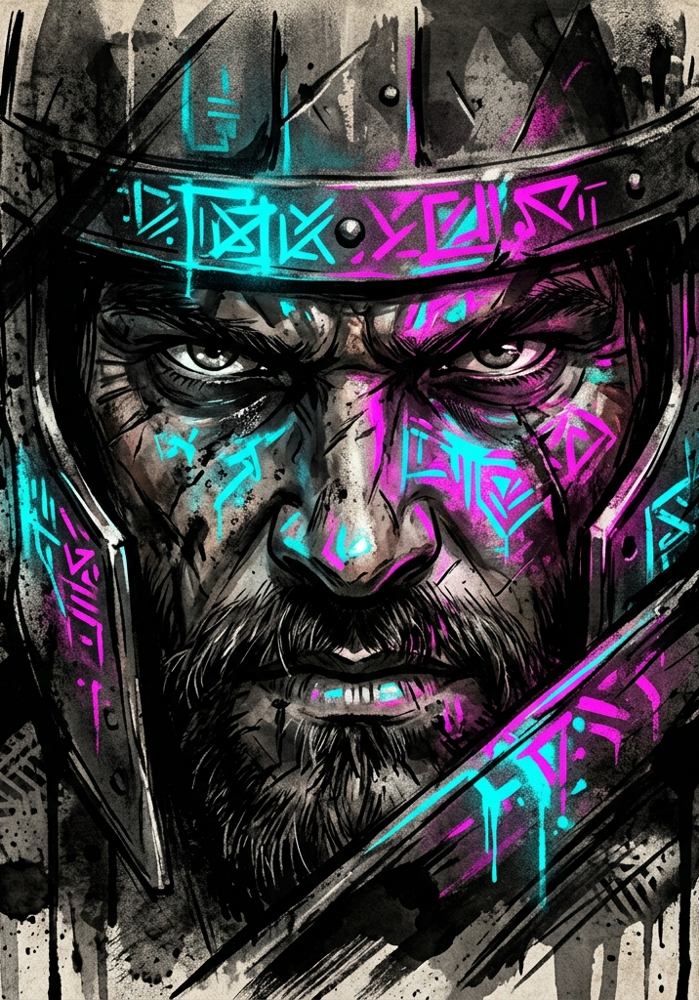

# Introduction

On the day of Integration, every human being on Earth heard the same voice at the same moment. It did not use a language. It did not need one.

::: systemvoice
*Native world: Earth. Status: Integrated.*

*Population: 7,916,442,203. Tutorial: provisioned.*

*Prior exemptions: expired. Observation: begun.*
:::

**LitRPG: RPG** is a tabletop roleplaying game of System-driven progression fantasy, the genre of stories like *Defiance of the Fall* and *Primal Hunter*: ordinary people pulled into a multiverse that keeps score, where every level is paid for in blood and sweat, quests arrive in cold blue status screens, and the only deal on offer is grow, or die. Each player takes the role of one freshly integrated human. One player, the Game Master (GM), plays everything else: the world, its monsters and factions, and the System itself.

## The System

The System is the multiverse's administrator. It integrates worlds, assigns Grades and levels, issues quests, grants titles, and watches. Neither god nor villain, it is an adaptive construct that discovers stable patterns of reality by putting conscious agents under pressure and recording what they do. Strength interests it less than *how* strength is used. Two characters can win the same fight and be offered different futures, because they won it differently.

That observation is real at the table. The GM quietly tracks how each character behaves under pressure, and the System converts that record into classes, opportunities, titles, and powers. In this game, a build is a biography: the System grows your character out of what you actually did.

## The Shape of a Character

A starting character is an ordinary person: seven Attributes bought with 40 points, most landing between 4 and 8, where 10 is the peak of pre-System humanity. From there the numbers genuinely climb: stats in the hundreds at E-Grade, the thousands at D-Grade, the tens of thousands beyond. The table math never grows with them. Resolution uses only a stat's first two digits (its Force), so a d100 plus a number from 1 to 99 resolves everything from a bar fight to a duel between demigods.

Progression runs on three tracks:

- **Levels.** Kills, quests, and survival yield Volatile Energy (VE); resting to refine it (Consolidation) converts it into levels and stat growth.
- **Principles.** Insight into reality's underlying patterns (Fire, Weight, Edge, Space) unlocks Applications, and eventually Domains. The track rewards talking through what a character has learned, and it plays at full strength without a word of it (The Principle System, "The Quiet Path").
- **Recognition.** Titles, a class at Level 10, and, at each Grade's cap, a Breakthrough: a ritual gamble that lifts every ceiling at once.

## What You Need

- This book. The GM's copy is the only required one.
- Percentile dice for everyone: roll two ten-sided dice together and read one as the tens digit, the other as the ones. A 4 and a 7 is 47; a 0 and a 3 is 3; two zeroes read as 100.
- Character sheets, scratch paper, and a pencil per player.
- A way to pass private notes (folded paper or phones): the game isolates players at key moments on purpose.
- Optionally, an AI assistant or the companion app (see The System AI chapter).

## Who Reads What

This book is written for the GM. Players are welcome to read the player-facing chapters: Core Mechanics, Character Creation, Cultivation, and The Principle System. Two boundaries:

- **The Hidden Vector Engine chapter is open knowledge, but the GM's game logs are not.** Players may know the System watches behavior and shapes their future around it; knowing that changes nothing, because the System is watching either way. What a player must never see is their own log. Scored behavior stays honest only while the scoring stays out of sight.
- **Players who intend to play should skip the Tutorial chapter and the Bestiary.** The tutorial is built to be experienced blind.

## How to Use This Book

For the GM, in order:

1. **Core Mechanics** and **Character Creation**: read closely. This is the resolution engine and the character sheet.
2. **Cultivation**: the progression engine. Read closely.
3. **The Principle System**, **Grade Breakthroughs**, **Titles**, and **System Quests**: read once so you know what exists; return when play reaches them.
4. **The System AI**: choose how you'll run (below).
5. **The Hidden Vector Engine**: the observation layer behind everything.
6. **The Tutorial**: your campaign's first three sessions, ready to run. It introduces every mechanic in play, phase by phase. Do not stop play to teach rules; when a player asks how combat works, the whole answer is "roll d100, add your Force, and I'll tell you what happens."

The **Bestiary**, **Items**, and the **Quick Reference** at the back of the book are table reference.

## The Three Ways to Run

The System's generative work (classes, quests, visions, titles, loot) can be performed three ways: **Unplugged**, where the GM does it all by hand and every rule in this book works with pencil and paper; **AI-Assisted**, where the GM uses any conversational AI between sessions with the prompt templates provided; or with the **Companion App**, software that listens to the session and drafts the System's bookkeeping for the GM's review. The System AI chapter defines all three. The rules are identical in every mode.

## An Example of Play

Kara (Strength 8 and Fortitude 7, written STR 8, FOR 7 on her sheet, with the Proficiency "close combat") and Andre (Perception 9, Dexterity 7, with "tracking and fieldcraft," "archery and marksmanship," and a scavenged hunting bow) are Level 2, three days integrated, crossing a dead city.

**GM:** The overpass ahead has folded in on itself. There's a gap in the rubble, a service stair, half buried. It's the only way through that isn't a mile around.

**Andre:** Before we climb in, I look it over. Has anything been through here?

**GM:** You have tracking and fieldcraft, so the obvious reads are free: the dust is disturbed, and something four-legged and heavy came through, recently. How recently is a harder question. Roll d100 plus your Perception Force, plus 5 for the Proficiency.

**Andre:** *(rolls 55)* 55 plus 9, plus 5. That's 69.

**GM:** Against a Moderate Resistance of 90. Not enough, so it's a Soft Failure, which means partial progress instead of a dead end: the tracks lead deeper in, but you can't tell whether they're an hour old or a day. You're at the stair mouth when gravel ticks down the slab above Kara.

**Kara:** Of course it does.

**GM:** A Snarljaw comes off the slab, low and gray, a maw like a sprung trap. That's its Surprise Beat: it attacks before the fight properly starts. It rolls d100 plus its Offensive Force of 14: *(rolls 74)* 88. Kara, defend: Fortitude to take it, Dexterity to get clear.

**Kara:** I plant and take it. Fortitude: *(rolls 51)* 51 plus 7 is 58.

**GM:** It wins by 30, and damage is the Margin, so that's 30 coming at your 14 HP. Before it lands, you have the option everyone has: Yield. Give up Beats from your next turn, and each one cuts the Margin by 20. One Beat, you give ground where you stand. Two, your next turn is gone and it drives you a Zone in whatever direction it likes.

**Kara:** It's not getting my whole turn. One Beat.

**GM:** Margin drops to 10. Fangs rake your forearm instead of closing on your throat: 10 damage, you're at 4. Now the fight starts properly. Momentum: Andre, you're the sharpest on your side, roll d100 plus Perception against its 18.

**Andre:** *(rolls 60)* 69.

**GM:** *(rolls 33 for the Snarljaw)* 51. Your side holds Momentum and goes first, every round until someone takes it. Andre, two Beats. Kara, one: the other is paying for your arm.

**Andre:** Beat one, I put the dead truck between us and draw. Beat two, loose. Dexterity, plus 5 for archery: *(rolls 30)* 30 plus 7, plus 5. That's 42.

**GM:** It twists, Defensive Force 18: *(rolls 12)* 30. You win by 12: the arrow takes it in the shoulder. Twelve off its HP, and it is not impressed.

**Kara:** My Beat. The pipe, Strength plus close combat: *(rolls 52)* 65.

**GM:** *(rolls 44)* 62 to slip it. Margin 3: you clip its skull as it ducks the worst of it. Its turn. It goes for the archer: *(rolls 20)* 34. Andre?

**Andre:** Out of the way. Dexterity: *(rolls 70)* 77.

**GM:** You win by 43, and a defensive win by 40 or more is a Turned Aside: it takes the truck's mirror off where you were standing and it's overextended, Exposed until the end of its next turn. It spends its second Beat scrambling around the wreck, hunting an angle it isn't going to get.

**Kara:** Is my turn back?

**GM:** Whole. The debt was one turn. Two Beats.

**Kara:** Then I meet it around the truck. Pipe: *(rolls 49)* 62.

**GM:** It's Exposed, so it defends 10 down: *(rolls 38)* 46. Margin 16, and it had 9 left. The pipe comes down where the arrow told it to, and the Snarljaw stops being a problem.

::: systemvoice
*[Threat neutralized. Volatile Energy acquired: 10.]*

*[Initiate 4,412,908 of 7,916,442,203. Observation continues.]*
:::

**Andre:** Four million and change. We're a line item.

**Kara:** It gave me ten. What does a big one give?

**GM:** The motes come off it pale and find you both, because you both earned it. You have no idea what a big one gives. Down the stairwell, something that had been answering the Snarljaw's noise stops answering.

**Kara:** How far down?

**Andre:** Don't.

**GM:** Two Zones. Do you want to find out?

*(And on the GM's log, where nobody can see it: Kara took the ambush head-on and gave one Beat rather than be moved, Force 1.0, then asked what a bigger kill pays, Hunger 0.5. Andre counted himself among the numbered, Method 0.5, and told her to leave it alone, Restraint 0.5.)*

That is the whole loop: fiction first, one roll, numbers that mean something, and a System quietly observing what each of you is becoming.
