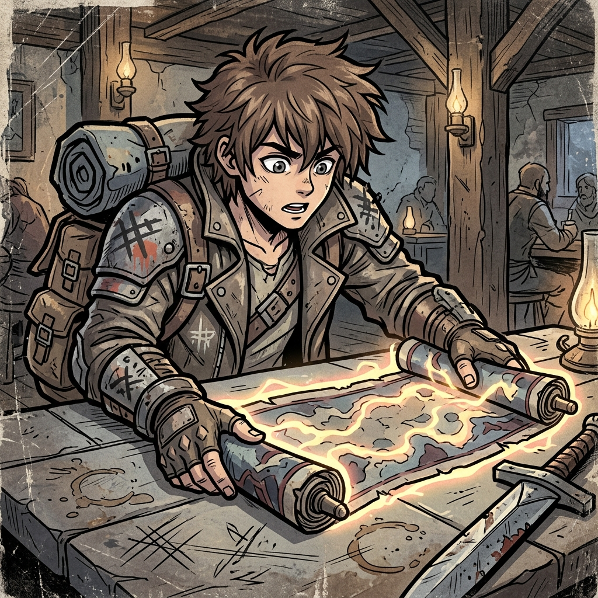

# DEFIANCE OF THE FALL: TTRPG

## Quick Reference: The Clash

---

**Roll d100 + Force + Tactics. High wins.**

- **vs. Active opponent:** Both roll d100 + Force + Tactics. Higher total wins. Margin = Winner − Loser.
- **vs. Passive obstacle:** Beat the Resistance (from the Grade Reference Card).
- **Auto-success:** If Force ≥ Resistance, no roll needed.
- **Volatility:** In combat, if d100 meets the Grade threshold, roll again and add (cascading).
- **Elevated:** +10 to roll. **Exposed:** −10 to roll. **Flanking:** +10 to roll.

**The Clash Formula:**

- **Attacker:** d100 + Offensive Force (STR/DEX/POW based on weapon) + Tactics
- **Defender:** d100 + Defensive Force (DEX to dodge, FOR to tank, HRT vs. mental, PER vs. illusion) + Tactics
- **Damage:** Margin × Grade Multiplier (append zeroes)

**Offensive Force by Weapon Type:**

- Heavy melee (axe, greatsword): STR Force
- Finesse melee (rapier, daggers): DEX Force
- Ranged (bows, thrown): DEX Force
- Spells and abilities: POW Force

**Defensive Force by Attack Type:**

- Physical (dodged): DEX Force
- Physical (absorbed): FOR Force
- Mental / spiritual / coercive: HRT Force
- Illusion / sensory deception: PER Force

**Grade Multipliers:** F-Grade: ×1 | E-Grade: ×10 | D-Grade: ×100 | C-Grade: ×1,000

**Volatility Thresholds (Combat Only):** F: 96+ | E: 90+ | D: 80+ | C: 70+ | B: 55+ | S: 40+

**Cross-Grade:** Higher-Grade combatant adds +100 Force per Grade of difference.

**HP** = Raw FOR. **Energy** = Raw POW. Energy refills only on Consolidation (no in-combat or passive regen).

**Principle / Skill Energy Costs (F-Grade baseline):** Seed App: 10 | Early Fragment App: 15 | Infusion: free | Domain: 30 + 5/round. Multiply cost by Grade Magnitude (×10 / ×100 / ×1,000) for skills learned at E / D / C respectively. Cost is permanently fixed to the skill's origin Grade.

**Aura Pressure Save:** d100 + HRT Force + (FOR Force / 2) vs. Aura Resistance.

---

## Grade Reference Card

| **Difficulty** | **F-Grade** | **E-Grade** | **D-Grade** | **C-Grade** |
|---|---|---|---|---|
| Trivial | 40 | 140 | 240 | 340 |
| Easy | 65 | 165 | 265 | 365 |
| Moderate | 90 | 190 | 290 | 390 |
| Hard | 115 | 215 | 315 | 415 |
| Severe | 140 | 240 | 340 | 440 |
| Peak | 165 | 265 | 365 | 465 |

| **Grade** | **Raw Stat Range** | **Force Range** | **Damage Multiplier** |
|---|---|---|---|
| F-Grade | 1–99 | 1–99 | ×1 |
| E-Grade | 100–999 | 10–99 | ×10 |
| D-Grade | 1,000–9,999 | 10–99 | ×100 |
| C-Grade | 10,000–99,999 | 10–99 | ×1,000 |

---

## Worked Examples

**1. F-Grade Peer Clash:**

Attacker: STR 55 (Force 55). Defender: FOR 40 (Force 40), HP 40.

- Attacker rolls 60 + 55 = 115. Defender rolls 50 + 40 = 90.
- Margin = 25. F-Grade adds 0 zeroes. **Damage = 25.**
- Defender drops from 40 HP to 15. Over half health gone in one hit. Fast, clean, lethal.

**2. D-Grade Peer Clash (Volatility Cascade):**

Attacker: STR 8,500 (D-Grade, Force 85). Defender: FOR 7,000 (D-Grade, Force 70), HP 7,000.

- Attacker rolls 82. D-Grade explodes on 80+. Rolls again: 40. Total die = 122. Clash = 122 + 85 = 207.
- Defender rolls 75 (no explosion). Clash = 75 + 70 = 145.
- Margin = 62. D-Grade adds 2 zeroes. **Damage = 6,200.**
- Defender drops from 7,000 to 800 HP. Functionally over in one devastating exchange.

**3. Cross-Grade: F-Grade Peak vs. E-Grade Initiate:**

F-Peak: STR 99 (Force 99), HP 99. E-Initiate: FOR 120 (Force 12, +100 Grade bonus = 112), HP 120.

F attacks E:

- F-Peak rolls brilliantly: 85 + 99 = 184. E-Initiate rolls poorly: 20 + 112 = 132.
- Margin = 52. F-Grade multiplier: ×1. **Damage = 52.** Nearly half the E-Grade's HP.

E attacks F:

- E-Initiate rolls average: 50 + 112 = 162. F-Peak rolls average: 50 + 99 = 149.
- Margin = 13. E-Grade multiplier: ×10. **Damage = 130.** F-Peak has 99 HP. Instantly dead from a glancing blow.
