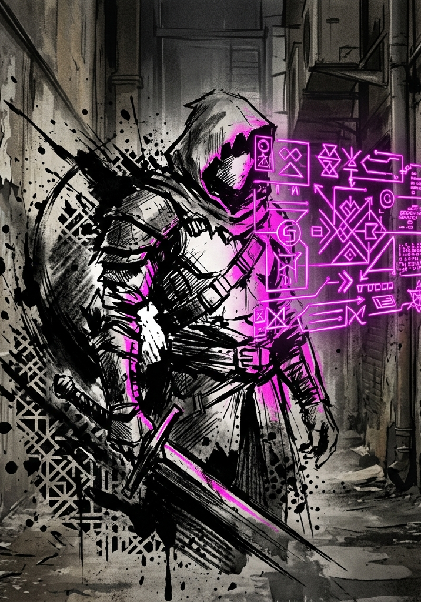

# LitRPG: RPG

## Character Creation

---

# Step 1: Attributes (Point Buy)

Distribute **40 points** across the seven core Attributes. Each stat has a **minimum of 3** and a **maximum of 10**.

These numbers represent a freshly integrated human — someone pulled into the System's jurisdiction moments ago. A stat of 3 is a genuine deficiency: frail, oblivious, or painfully awkward. A stat of 10 is the peak of pre-System human potential: the strongest athlete, the sharpest mind, the most magnetic personality. Most stats will land in the 4–8 range.

| Attribute | What It Represents |
|---|---|
| Strength (STR) | Physical power. Governs heavy melee attacks. |
| Dexterity (DEX) | Precision and agility. Governs evasion, finesse melee, ranged attacks. |
| Fortitude (FOR) | Endurance and resilience. Determines Max HP. |
| Heart (HRT) | Resolve and spiritual anchor. Defends against mental and spiritual attacks. |
| Power (POW) | Supernatural output potential. Determines Max Energy. |
| Perception (PER) | Awareness and acuity. Defends against illusions, governs detection. |
| Charisma (CHA) | Force of personality. Governs social pressure and manipulation. |

**Sample Spreads:**

| Archetype | STR | DEX | FOR | HRT | POW | PER | CHA | Total |
|---|---|---|---|---|---|---|---|---|
| Brawler | 10 | 6 | 8 | 4 | 3 | 5 | 4 | 40 |
| Scout | 4 | 9 | 5 | 4 | 3 | 10 | 5 | 40 |
| Aspiring Cultivator | 4 | 5 | 5 | 6 | 10 | 7 | 3 | 40 |
| Natural Leader | 5 | 5 | 5 | 7 | 4 | 5 | 9 | 40 |
| Generalist | 6 | 6 | 6 | 6 | 6 | 5 | 5 | 40 |

These are illustrations, not templates. Players should build what makes sense for the person they are playing.

# Step 2: Proficiencies

Choose **three Proficiencies** — broad domains of competence written in plain language. See the Proficiencies & Skills document for the full rules.

Proficiencies should reflect the character's life before Integration: what they trained in, what they were good at, what they spent years doing. A soldier might take "close combat," "field medicine," and "tactical awareness." A professor might take "ancient languages," "research methodology," and "persuasion." A mechanic might take "mechanical tinkering," "jury-rigging," and "vehicle operation."

# Step 3: Derived Stats

Calculate and record these values:

- **Max HP:** Equal to your Raw FOR value.
- **Max Energy:** Equal to your Raw POW value.
- **VE Tolerance:** (Raw FOR + Raw POW) / 2 × 10.
- **VE Stored:** 0.
- **Level:** 1.
- **Grade:** F.

At Level 1, HP and Energy are single digits. That is intentional — freshly integrated characters are fragile, and early encounters should feel dangerous. Growth comes fast.

# Step 4: Starting Equipment

Starting gear is campaign-dependent. The GM determines what characters have access to based on the scenario. For the standard Integration Protocol opening, characters begin with whatever they had on their person at the moment of Integration — everyday clothing, a phone, maybe a pocket knife. The System provides nothing.

# Step 5: Starting Principle Access

Freshly integrated characters do not begin with active Principle Applications. At creation, a character may have at most **Initial Insight** toward a single Principle Concept — a passive, narrative attunement chosen with the GM. This grants a minor passive bonus and a few narrative permissions, but no active ability. Active Principle Applications (Seed and above) are unlocked through play by accumulating Insight Points; they cannot be selected at creation.

**Why this matters mechanically:** A Seed Application costs 10 Energy at F-Grade origin. A starting character with POW 8 has 8 Max Energy and could not cast it even once. Earning Seeds through play paces the unlock to a moment when the character's POW (and therefore Energy pool) can actually support the cost — typically Level 4–7+, when POW has grown into the 15–25 range. Casting remains scarce, but viable.

The Initial Insight slot is optional. A character may choose to begin with no Principle attunement at all and accept their first Insight when the System grants it. See the Principles document for the full progression: Initial Insight → Seed → Early Fragment → Mid Fragment (Infusion) → Peak Fragment (Domain).

---

# Pre-Class Progression (Levels 2–9)

## Per-Level Stat Allocation

Each level from 2 through 9, the character gains **5 stat points:**

- **3 points assigned by the GM** based on how the character has been behaving. These represent the System observing the character and reinforcing the patterns it detects. The GM uses the Behavioral Stat Mapping table below as a guide.

- **2 points assigned freely by the player.** These represent the character's conscious self-improvement — the attributes they deliberately train or develop.

## Behavioral Stat Mapping (GM Reference)

The GM does not need to calculate anything. At each level-up, review what the character has done since the last level and assign the 3 System points to the stats that best match their behavior. Use the table as a guide, not a rigid formula.

| Behavior Pattern | Primary Stat | Secondary Stat |
|---|---|---|
| Solves problems with direct force, charges in | STR | FOR |
| Plans ahead, positions carefully, uses finesse | DEX | PER |
| Pursues power aggressively, takes risks for gain | POW | STR |
| Shows restraint, endures hardship, holds the line | FOR | HRT |
| Dominates socially, intimidates, commands | CHA | STR |
| Cooperates, negotiates, builds alliances | CHA | HRT |
| Imposes structure, creates systems, controls variables | PER | POW |
| Breaks rules, improvises, embraces chaos | DEX | POW |

**How to read the table:** If a character spent the last level charging into fights and solving problems through brute force, the GM puts 2 points into STR and 1 into FOR (or all 3 into STR if the behavior was extreme and unambiguous). A character who planned every engagement and used terrain might get 2 PER and 1 DEX. Mixed behavior? Split accordingly — 1 STR, 1 PER, 1 CHA is a perfectly valid assignment for a character who fought, planned, and negotiated in equal measure.

The GM's goal is simple: **reward what the character actually did, not what the player says they want.** This is the Hidden Vector Engine's primary mechanical lever during F-Grade — the System watches, and the System responds.

**Tutorial Multi-Level Allocation:** When the tutorial concludes and the System awards multiple levels at once (typical: Levels 1 → 3–5), the GM does not need to walk through each level individually. Review the player's tutorial behavior holistically and assign the cumulative System points (3 per level granted) according to the dominant patterns from the Behavioral Stat Mapping table. The player allocates their cumulative free points (2 per level) at the end. A character who reaches Level 4 directly from Level 1 receives 9 GM-assigned points (3 × 3 levels) and 6 free points (2 × 3 levels). This compression is allowed only for the tutorial-level jump; ongoing campaign play should level one at a time.

## What This Produces

By Level 9, a character has accumulated:

| Source | Points |
|---|---|
| Point buy (creation) | 40 |
| System-assigned (3 × 8 levels) | 24 |
| Free allocation (2 × 8 levels) | 16 |
| **Total at Level 9** | **80** |

A character who acted consistently toward one behavioral archetype will have a clear stat skew heading into class selection. A character who played eclectically will be more balanced. Both paths are valid — but the class options offered at Level 10 will differ dramatically between them.

---

# Class Selection (Level 10)

At Level 10, the System AI generates **three class options** based on the character's Hidden Vector Engine profile — the cumulative record of their behavior across Levels 1–9. The full class generation system is documented separately, but the mechanical effect at this milestone is:

1. The player selects one of the three offered classes.
2. The character receives a **one-time bonus allocation of 5–10 stat points**, distributed according to the class's stat profile. These are not player-assigned — they represent the System attuning the character's body and spirit to their new role.
3. From Level 10 onward, per-level stat allocation shifts to the class model: **3 points allocated by class profile** (fixed, determined by the class's stat priorities) **+ 2 points free** for the player. The GM no longer assigns the fixed portion — the class does.

The pre-class observation period is over. The Hidden Vector Engine continues tracking behavior for future class evolutions, Principle forging, and world response — but the stat allocation lever now belongs to the class.
