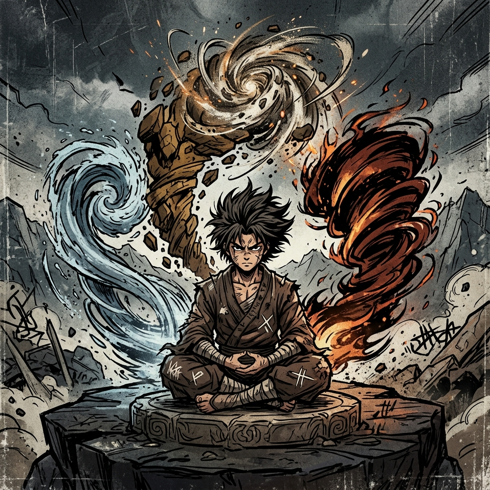

# LitRPG: RPG

## The Principle System

---

# Part I: Mechanics

Principle is the fundamental fabric of reality. It does not provide flat stat boosts; it provides Penetration, Mitigation, and Action Economy modifiers.

Principle is categorized by Concept (e.g., Fire, Space, Sharpness, Heaviness). As players advance, they unlock Applications (specific combat or utility manifestations).

## Principle Progression

Players track Insight Points (IP) for their chosen Concept. IP is gained through Battle Memories (see below), consuming affinity treasures, Consolidation visions, and life-or-death survival.

- **Initial Insight:** Grants a minor passive (e.g., +5% Fire Resistance).

- **Principle Seed:** Unlocks the first Active Application (e.g., Searing Strike: +10 to Clash roll vs. targets vulnerable to fire). Grants passive narrative permissions.

- **Early Fragment:** Unlocks a second Application. Passive bonus doubles.

- **Mid Fragment:** Unlocks Infusion (coat weapons/spells dynamically at no Beat or Energy cost).

- **Peak Fragment:** Unlocks a Domain (a localized zone of systemic control).

## Principle Activation Costs

| **Tier** | **Beat Cost** | **Energy Cost (F-Grade baseline)** | **Notes** |
|---|---|---|---|
| Seed Application | 1 Beat | 10 Energy | Early Principle use is a real tradeoff. |
| Early Fragment App. | 1 Beat | 15 Energy | More powerful, still costly. |
| Mid Fragment Infusion | Free | Free | The payoff for mastery. Woven into your fighting style. |
| Peak Fragment Domain | 1 Beat to activate | 30 Energy + 5/round | Powerful but draining. Natural time limit. |

**Cost scales with the Application's origin Grade.** Each Grade higher multiplies the Energy cost by the Grade Magnitude (×10 per Grade): an E-Grade Seed costs 100 Energy, a D-Grade Seed costs 1,000, and so on. Once learned, the cost is fixed to that origin Grade forever — a Seed acquired at F-Grade remains 10 Energy even after the character Breaks Through to higher Grades. Old Applications become cheap sustain; new Grade-appropriate Applications are where the real power lives. See Core Mechanics §7c for the full cost table and design rationale.

**Principle and Spells:** A character's Principle passives (Initial Insight bonuses) always apply to matching spells automatically. To use an active Principle Application alongside a spell requires Infusion tier — below that, you must choose: cast the spell or use the Application. Not both in one Beat.

## Passive Narrative Permissions

At Seed tier and above, a character's Principle grants passive narrative permissions — things the character can simply do without rolling or spending resources. These are not combat mechanics. They are fictional capabilities reflecting the character's deepening connection to their Concept.

Examples:

- **Fire Principle:** Can ignite flammable objects at will. Comfortable in extreme heat. Can sense nearby flame.
- **Sharpness Principle:** Can cut materials far beyond what the weapon should allow. Can sense structural weak points.
- **Earth Principle:** Can sense tremors and vibrations through the ground. Steady footing on any surface.
- **Space Principle:** Can sense spatial distortions. Intuitively aware of distances and dimensions.

The GM and System AI generate narrative permissions appropriate to each Concept. These should feel natural and flavorful, not mechanically exploitable.

## Principle Fusions

If a player possesses two compatible Seeds (e.g., Earth + Fire), they can attempt a highly volatile Fusion Insight roll. Success generates a Dual-Affinity Concept via the System AI (e.g., Magma), unlocking entirely new bespoke Applications.

## Battle Memories

Battle Memories are the primary pipeline from combat experience to Principle insight. In moments of extreme stress — surviving at near-zero HP, landing an improbable Volatility cascade, witnessing something beyond comprehension, or achieving an outcome the System deems statistically improbable — the GM grants a **Battle Memory Card**.

During the next Consolidation, the player describes how they meditate on this memory: what they felt, what they noticed, what pattern they think they glimpsed.

- **Action:** The GM feeds the memory context into the System AI.
- **Output:** The System AI generates a cryptic vision and awards Insight Points toward the Principle Concept most closely aligned with the memory. It may also generate a new Skill Fragment or hint at a hidden evolutionary path.

Battle Memories are the primary mechanism by which combat feeds into Principle progression. A character who fights but never reflects during Consolidation will grow in raw stats but stagnate in Principle mastery. A character who reflects deeply on fewer, more intense experiences may advance their Principle faster than one who grinds mindlessly.

---

# Part II: Ontology — The System & Principles

**Conceptual Power, Progression, and the Nature of Reality**

## I. The Nature of The System

The System is not a moral authority, nor a simple engine of conflict. It is an adaptive construct operating across unstable reality.

The System exists to discover and refine stable patterns of reality that cannot be derived directly. Reality is not fixed. Zones shift, laws degrade, and unknown conditions emerge faster than any static model can solve. The System cannot precompute solutions to these conditions. Instead, it creates them.

It introduces conscious agents into constrained environments and observes how they respond: Conflict reveals limits. Scarcity reveals priorities. Uncertainty reveals models. Pressure reveals identity.

Through this process, the System identifies patterns that succeed across contexts. These patterns are compressed, formalized, and made reusable. This is the origin of power.

Strength alone is not the goal. The System rewards the capacity to adapt, model, and act effectively under changing conditions.

## II. Adaptation and Identity

Every character is observed not just for outcomes, but for how they repeatedly solve problems. These tendencies form a behavioral signature (tracked mechanically by the Hidden Vector Engine). This signature influences class emergence, available opportunities, world reactions, and the kinds of insights a character is capable of achieving.

The System does not ask: "Did you win?" It asks: "How do you win, and what does that reveal?"

## III. Principles (Conceptual Power)

Principles are compressed patterns of reality. They are not elements, spells, or skills. They are operational abstractions — reusable truths about how things behave.

Examples: **Edge** (concentration of force into a decisive boundary), **Flow** (continuous adaptation and redirection), **Pressure** (constraining options to force outcomes), **Collapse** (exploiting instability to trigger failure), **Resonance** (amplification through alignment).

A Principle is powerful because it is generalizable. Edge in combat means precise strikes; in social interaction, cutting arguments; in exploration, breaking barriers.

**Properties of Principles:** All Principles must be Operational (they do something specific), Bounded (they do not apply everywhere), and Testable (their use produces observable outcomes). If a concept cannot meet these criteria, it is not a valid Principle.

## IV. Insight and Compression

Principles are not chosen. They are discovered.

### A. Gaining Insight

Players accumulate Insight Points (IP) through meaningful actions: surviving high-risk situations, repeatedly applying a successful pattern, deliberate experimentation, observing unusual phenomena, and achieving improbable outcomes. The primary combat-to-insight delivery mechanism is the Battle Memory system (see Part I above). Insight is tied to behavior, not passive time.

### B. Compression (Discovery Phase)

When sufficient Insight is gained, the player enters a Compression Phase. The player must answer: "What pattern have you discovered in how you act or how the world behaves?"

The player proposes a Principle based on their experience. The GM/System then refines the concept, enforces operational clarity, defines scope and limits, and assigns mechanical expression.

## V. Principle Progression

- **Initial Insight:** Minor passive benefit, limited application.
- **Developed Principle:** Stronger passive, one or more active abilities.
- **Integrated Principle:** Reduced cost of use, broader application across domains.
- **Mastery:** Large-scale or persistent effects, potential to shape environments or systems.

## VI. Principle Fusion

Principles can be combined to form new, more complex patterns. Fusion is risky and unstable but highly rewarding.

Example Fusions: **Edge + Flow → Severance** (precision applied through motion), **Pressure + Collapse → Implosion** (forcing failure through constraint), **Flow + Resonance → Harmony** (alignment across systems).

Fusion results are partially unpredictable, defined collaboratively by player and System, and often more powerful but less stable.

## VII. Domains (Optional Framing Layer)

While Principles are abstract, they often manifest within Domains: Physical (combat, movement, force), Social (interaction, influence, hierarchy), Environmental (terrain, systems, structures), and Cognitive (perception, insight, pattern recognition). A Principle may begin in one Domain but expand into others as it develops.

## VIII. The Role of Constraint

The System generates pressure not to punish players, but to reveal patterns. Dominant strategies are challenged, weaknesses are exposed, over-reliance is punished, and creativity is rewarded. No single approach remains optimal forever. Adaptation is required not just to survive, but to grow.

## IX. Example: Full Loop

1. A player consistently charges into combat (Force)
2. They begin controlling fights through positioning rather than damage
3. They gain Insight through repeated success and near-failures
4. During Compression, they identify a pattern of controlling space
5. The System grants the Principle of Pressure
6. This enables new abilities and changes how encounters unfold
7. The System begins generating scenarios that test this approach
8. The player either deepens the Principle or evolves beyond it

## X. Final Statement

The System refines reality through the actions of conscious agents. Principles are the stable patterns that emerge from that process. Power is not granted. It is recognized, compressed, and returned to those who discovered it.
