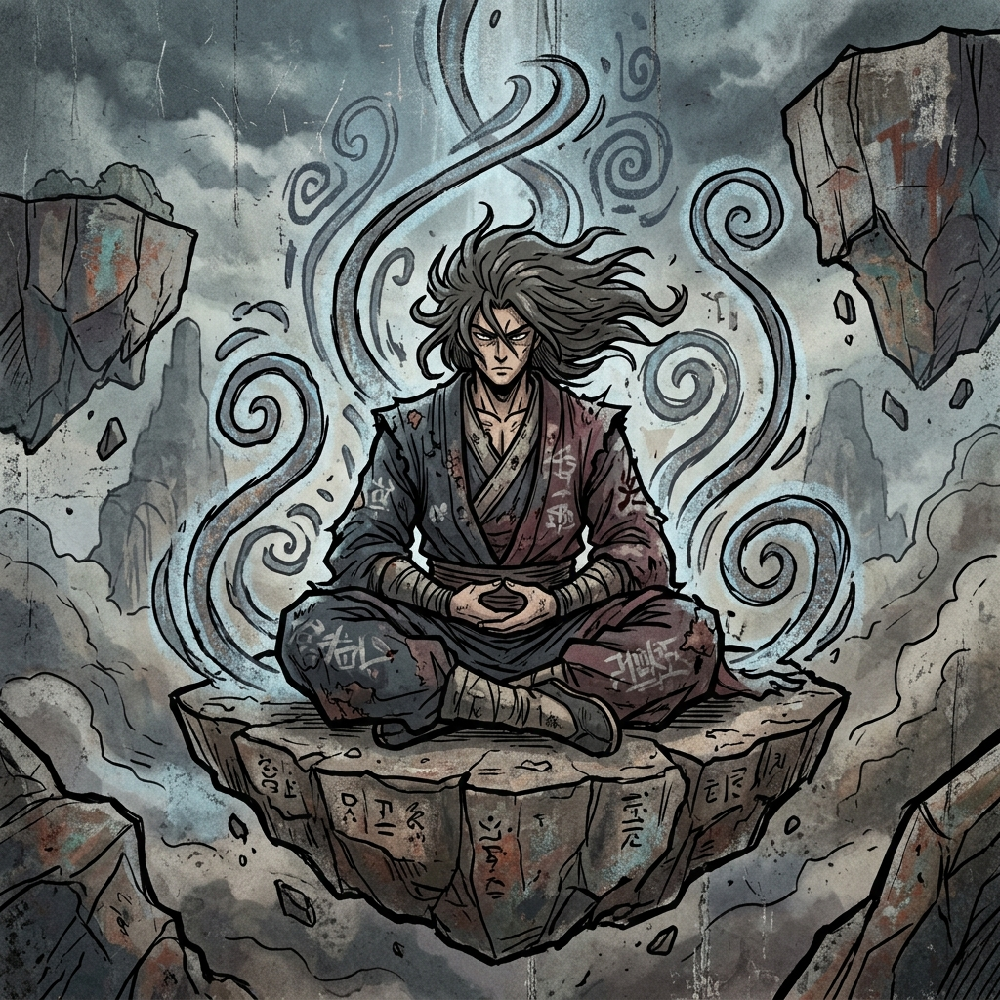

# DEFIANCE OF THE FALL: TTRPG

## Cultivation: Volatile Energy, Consolidation & Healing

---

# Volatile Energy & Consolidation

Characters do not gain traditional "Experience Points." They accumulate **Volatile Energy (VE)** from kills, consumables, and environmental sources. VE represents raw, unprocessed power absorbed from the Multiverse — essence that must be refined into permanent growth through structured rest.

## The Pressure Gauge

Every character has a **VE Tolerance** representing the raw energy their body and spirit can hold before refinement:

> **VE Tolerance = (Raw FOR + Raw POW) / 2 × 10**

An F-Grade character with FOR 60 and POW 60 has a Tolerance of 600. A pure warrior (FOR 80, POW 30) has a Tolerance of 550. A pure caster (FOR 30, POW 80) also has 550. The formula scales naturally with Grade — no special multiplier needed; the × 10 is a constant, and the Grade scaling comes from the stats themselves.

VE accumulates automatically after combat and from other sources. As long as stored VE remains below Tolerance, there is no penalty. Once VE exceeds Tolerance, the character enters **Saturation:**

- **Mild Saturation (101–150% Tolerance):** −10 to all rolls. Energy regeneration halved.
- **Heavy Saturation (151–200% Tolerance):** −25 to all rolls. HP begins bleeding (1% Max HP per round in combat, per hour outside combat).
- **Critical Saturation (200%+ Tolerance):** Stat degradation begins. Permanent attribute loss if not addressed.

**GM Note on Saturation:** The System does not announce band thresholds to the character. Narrate symptoms instead — skin feels hot and prickly, vision tunnels at the edges, muscles cramp, something under the breastbone flexes in ways that feel wrong. Let players learn the pattern by experience. This generates rich Hidden Vector signal: who pushes into the red zone chasing one more kill? (Hunger.) Who pulls back at the first warning? (Restraint.)

## Consolidation (Structured Rest)

To process VE, a character declares a **Consolidation** rest. This is not a mini-game. The player states they are consolidating, the GM tracks the clock and any interruptions, and the mechanical result resolves automatically.

**Declaration:** The player specifies a goal — process all current VE, process until the next level-up, or process a specific amount. The goal matters because the GM may interrupt for narrative reasons, and the player should know what they were reaching for.

**Minimum Duration:** 1 hour of in-game time, regardless of how little VE needs processing.

**Processing Rate:** **(Raw FOR + Raw POW) per hour of Consolidation.**

An F-Grade character with FOR 60 and POW 60 processes 120 VE per hour. A full tank (600 VE) takes 5 hours to empty. The same ratio holds at every Grade — an E-Grade character with FOR 500 and POW 400 processes 900 VE per hour, a full tank (4,500) in 5 hours. Time pressure is Grade-invariant.

**Result:** Processed VE converts into permanent level progress. When accumulated processed VE meets the threshold for the next level, the character advances (see Leveling below).

**HP Recovery:** During Consolidation, characters recover 25% of their Max HP per hour.

**Energy Recovery:** Energy refills completely at the start of any Consolidation rest, regardless of duration. This is the *only* source of Energy regeneration — Energy does not recover in combat, between combats, or through passive time. See Core Mechanics §7 for the full Energy system.

**Partial Consolidation:** If interrupted, the character retains proportional progress on both VE processing and HP recovery. Unprocessed VE stays in the tank and remains subject to Saturation rules.

**Simultaneous Consolidation:** The entire party may consolidate at the same time. This is a tactical choice — the party is completely defenseless while consolidating. Posting a guard means that character is not consolidating.

**Environmental Modifiers:** Consolidating in a high-energy-density hex reduces required time by 25%. Consolidating while holding a Principle-affinity treasure grants a small bonus to Insight Points for that Principle Concept.

**Battle Memory Meditation:** Characters who hold a Battle Memory Card (see Principles document) process it during Consolidation. The GM feeds the memory context into the System AI, which generates a cryptic vision and awards Insight Points.

## Leveling: The VE Chart

Levels require accumulated processed VE following an exponential curve:

> **VE to reach next level = 100 × 1.2^(Level-in-Grade − 1) × Grade Multiplier**

Where Grade Multiplier is ×1 for F, ×10 for E, ×100 for D, ×1,000 for C, etc. — the same multiplier used everywhere else in the system.

**F-Grade reference (selected levels):**

| Level | VE to Next | Cumulative VE |
|---|---|---|
| 1 → 2 | 100 | 100 |
| 2 → 3 | 120 | 220 |
| 3 → 4 | 144 | 364 |
| 5 → 6 | 207 | 871 |
| 10 → 11 | 516 | 3,193 |
| 15 → 16 | 1,284 | 9,539 |
| 20 → 21 | 3,196 | 25,330 |

At E-Grade, every entry is × 10 (Level 1 costs 1,000 VE). At D-Grade, × 100. The chart shape is identical at every Grade; only the magnitude shifts. Class features, rare titles, or specific treasures may tweak the multiplier for individual characters, but the baseline curve applies to everyone.

**Grade Breakthrough** happens at the Grade-cap level (the last level within a Grade). It is **not** an automatic level-up. See Breakthrough Consolidation below.

## The Interesting Decision

Consolidation is not about *how* — it is about *when*. Do you push one more fight while your gauge is in the red zone, gambling on a bigger haul before resting? Or do you pull back and consolidate safely, knowing that another group might claim the hunting ground while you meditate?

Players who hunt aggressively and consolidate efficiently pull ahead. Players who get greedy risk poisoning and permanent loss. This maps directly onto the Hunger/Restraint behavioral axis.

## Bonus VE (Optional Accelerant)

Characters earn baseline progression through survival and quest completion. VE from dangerous kills functions as a bonus accelerant on top of this baseline. Playing it safe means you still level — but the aggressive cultivator who masters the timing of risk and rest will outpace you.

## Toxins & Impurities

Consuming healing pills or forced-growth treasures adds **Toxin Points**. If Toxin Points exceed a character's Toxin Tolerance (Raw FOR × 2), Consolidation efficiency drops: more time is required per VE processed, and a percentage of VE is lost to impurity during each rest.

## Breakthrough Consolidation (Stub — Full Mechanic TBD)

Ascending from one Grade to the next is a deliberate, dangerous act — not a passive level-up. When a character reaches the Grade-cap level (the last level within their Grade), they cannot advance further through ordinary Consolidation. Instead:

1. The character must intentionally push their VE into Saturation, using the overcharge as fuel for the Breakthrough.
2. They declare a **Breakthrough Consolidation**, a specialized rest distinct from ordinary processing.
3. A roll is required — likely **d100 + POW Force + HRT Force vs. a Severe or Peak difficulty on the next Grade's Reference Card** — to successfully reshape their systemic structure.
4. On success: the character ascends, gains Grade-appropriate stat scaling, and excess VE burns off. On failure: Critical Saturation consequences trigger, potential stat loss, and a lock-out period before retry.

The full mechanic (exact roll formula, VE requirements, failure consequences, environmental hooks, special treasures that improve odds) is reserved for future design. What matters now: the genre-required bottleneck exists, POW and HRT are the relevant stats, and the "overcharge is sometimes required" design space is reserved for later mining.

---

# Healing

Recovery in the Multiverse is never free. There are three paths, each with a cost.

- **Rest Healing:** During Consolidation, characters recover 25% Max HP per hour. Safest option, but it requires time.

- **Healing Pills and Potions:** Instant recovery of a flat HP amount based on pill grade. However, every pill adds Toxin Points.

- **Healing Skills and Spells:** Some classes possess healing abilities generated by the System AI. These cost Energy and one Beat in combat.

There are no instant full heals outside of extraordinary systemic treasures. Attrition is real and Consolidation timing remains meaningful.
