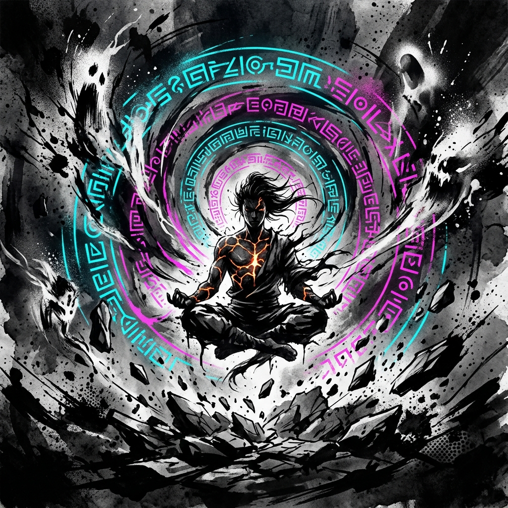

# DEFIANCE OF THE FALL: TTRPG

## Grade Breakthroughs

---

# Design Intent

Breakthroughs are the genre's emotional centerpiece. They are ritual moments — not long rests, not passive level-ups, not bookkeeping. A Breakthrough is the scene the table remembers.

**Principles governing this mechanic:**

- **Visible Payoff.** Every successful Breakthrough produces numbers going up, new options unlocking, and the System itself acknowledging the character's ascension. The LitRPG power fantasy must be tangible.
- **Single-Session Resolution.** A Breakthrough resolves in one dramatic sequence. No multi-session seclusion arcs, no cutting away for weeks of in-game meditation. The tension builds and pays off in one sitting.
- **Soloable, But Better With Friends.** A well-prepared cultivator with the right location and items can Break Through alone. But the party makes it more interesting, more accessible, and more dramatic.
- **The Spotlight Problem, Solved.** Other party members should find Breakthrough scenes exciting to participate in — but they should never feel burdened with constant tactical decisions during someone else's spotlight moment. Their involvement is meaningful but lightweight.

---

# In-World Framing

A Breakthrough occurs when the barrier between the cultivator's current Grade and the next becomes permeable. The System's Principles draw closer to the material plane — the boundary thins, the ambient energy density spikes, and for a brief window the cultivator's body and spirit can be reshaped by forces that normally operate far beyond mortal reach.

This proximity is what makes the event possible. It is also what makes it dangerous. The same thinning of the boundary that allows ascension also allows external phenomena to manifest — tribulations, environmental backlash, spectral echoes of the energy being consumed. The cultivator is not simply meditating harder. They are standing at the threshold of a higher order of reality and daring it to remake them.

---

# The Universal Blueprint

Every Breakthrough, regardless of Grade, follows the same four-beat structure. The flavor and stakes of Beats 2 and 3 change by Grade. The scale of Beat 4's rewards changes by Grade. But the skeleton is always the same.

## Beat 1 — Preparation

The setup phase. No dice are rolled. This is where most quality dials are set.

**Requirements:**

- The character must be at the **Grade-cap level** (the final level within their current Grade).
- All VE from leveling must already be fully processed through Consolidation. The character's VE tank starts this process empty — what fills it next is the Ignition fuel.

**Steps:**

1. **Declare Intent.** The player announces that their character is attempting a Breakthrough.
2. **Choose a Location.** The energy density of the environment is a major quality input (see Environment & Energy Density below). A barren rooftop works. A ley-line nexus works better. The choice is strategic.
3. **Consume Breakthrough Items.** Any prepared items (see Breakthrough Item Categories below) are consumed now, before the trial begins. Their effects lock in as modifiers to the Breakthrough Check.
4. **Receive Party Support Setup.** If allies are present, they declare their support roles now. This is the moment for buffs, formations, wards, or simply taking up defensive positions around the cultivator.

**GM Note:** Beat 1 should feel deliberate — a ritual in motion. Describe the cultivator settling into position, consuming pills, the air growing heavy with unprocessed energy. The party arranging themselves. The world going quiet. Then transition to Beat 2.

## Beat 2 — Ignition

The cultivator deliberately floods their body with Volatile Energy, pushing past Tolerance into Saturation. This overcharge is not an accident — it is the fuel that powers the ascension. The body must be forced past its current limits before it can be reshaped to hold the next Grade's capacity.

**Mechanic: The Overcharge Ratio**

The cultivator must accumulate VE equal to at least **100% of their VE Tolerance** before igniting the Breakthrough. They may choose to push higher. The ratio of stored VE to Tolerance determines the **Overcharge Ratio**, which is the primary risk-reward dial the player controls.

| Overcharge Ratio | VE Stored | Trial Difficulty | Quality Modifier |
|---|---|---|---|
| ×1.0 (Minimum) | 100% of Tolerance | Base difficulty | +0 |
| ×1.5 (Aggressive) | 150% of Tolerance | +15 to Breakthrough DC | +1 Tier |
| ×2.0 (Reckless) | 200% of Tolerance | +30 to Breakthrough DC | +2 Tiers |
| ×2.5 (Suicidal) | 250% of Tolerance | +45 to Breakthrough DC | +3 Tiers |

The VE required for Ignition is gathered from environmental absorption during the Preparation phase and from any consumables. The GM determines how long this takes based on location energy density — a high-density location might provide full Tolerance in minutes; a barren one might take hours of dangerous exposure.

**While overcharging, Saturation effects apply.** A cultivator pushing to ×2.0 is operating under Heavy Saturation penalties (−25 to all rolls, HP bleeding). This is the explicit price of ambition — the character is poisoning themselves with power to fuel a better outcome. The Saturation penalties do not apply to the Breakthrough Check itself (the ignition burns the VE as fuel), but they apply to everything else — including any actions the party must take during the Trial.

**Once the cultivator declares Ignition, Beat 3 begins immediately. There is no going back.**

## Beat 3 — The Trial

The dangerous part. A hybrid structure: an internal challenge for the cultivator resolved mechanically through the Breakthrough Check, coupled with external phenomena that the party (or the cultivator, if solo) must manage.

### The Breakthrough Check

The cultivator makes a single roll:

> **d100 + POW Force + HRT Force vs. Breakthrough DC**

**Breakthrough DC** is read from the Grade Reference Card at the **Severe** difficulty of the *target* Grade (the Grade being ascended into), modified by the Overcharge Ratio.

| Target Grade | Base DC (Severe) | At ×1.5 | At ×2.0 | At ×2.5 |
|---|---|---|---|---|
| E-Grade | 240 | 255 | 270 | 285 |
| D-Grade | 340 | 355 | 370 | 385 |
| C-Grade | 440 | 455 | 470 | 485 |

**What the DC represents:** The Severe difficulty of the target Grade is the barrier. An F-Grade character attempting to reach E-Grade must hit 240 — a number that is, by design, unreachable through raw stats alone at F-Grade (max POW Force 99 + max HRT Force 99 + perfect d100 roll of 100 = 298). A well-built character can reach it. A poorly built one cannot, even with a perfect roll. This is intentional — Breakthroughs are meant to require investment, not luck.

**Modifiers to the Breakthrough Check:**

| Source | Modifier |
|---|---|
| Location Energy Density (see below) | +5 to +25 |
| Foundation Pills consumed | +5 to +15 |
| HVE Coherence Bonus (see below) | +0 to +20 |
| Party Support (see below) | +5 to +15 |
| Quality Enhancer item consumed | — (affects tier, not roll) |
| Tribulation Ward consumed | — (affects failure severity, not roll) |

**HVE Coherence Bonus:** A character with a sharp, consistent behavioral signature across the HVE axes generates a cleaner trial. Mechanically, the GM evaluates the character's HVE profile:

- **Scattered** (no axis above ±3.0 intensity): +0. The character's identity is diffuse. The trial has no shape to latch onto.
- **Leaning** (one axis above ±5.0): +5. A direction is emerging.
- **Defined** (one axis above ±8.0, or two above ±5.0): +10. The character knows who they are.
- **Singular** (one axis above ±12.0, or a dominant multi-axis archetype): +20. The trial practically writes itself.

The GM does not need to calculate this precisely — it is a qualitative read of the HVE profile, expressed as a modifier. Characters who have lived with conviction are rewarded. Characters who have drifted aimlessly face a harder road.

### The Quality Tier

The Breakthrough Check margin (roll result minus DC) determines the base Quality Tier. Overcharge and item bonuses can push the tier higher.

| Margin | Base Tier | Description |
|---|---|---|
| Below 0 | **Cracked** | Failure. |
| 0–19 | **Stable** | Standard ascension. |
| 20–39 | **Polished** | Above-average ascension. |
| 40–59 | **Pristine** | Exceptional ascension. |
| 60+ | **Transcendent** | One-of-a-kind ascension. |

**Tier Adjustment:** Quality Enhancer items push the final tier up by one step (never above Transcendent). The Overcharge Ratio modifier is already factored into the DC — it makes the roll harder, but a character who succeeds despite higher DC gets a better margin naturally. This is the risk-reward loop: overcharging doesn't guarantee a better tier, but it creates the *possibility* of one.

### External Phenomena (The Party's Role)

When the cultivator ignites, the environment reacts. The thinning of the boundary between Grades draws attention — from the ambient energy field, from local wildlife, from things that exist in the space between Grades.

**What manifests depends on the Grade:**

- **F→E:** Minor disturbances. Energy fluctuations cause local temperature spikes, small tremors, or flickering light. Wildlife may be drawn to the site. Low-grade elemental manifestations (wisps, sparks, tremors) appear and must be managed but pose no serious threat to a prepared party.
- **E→D:** Significant phenomena. Spectral manifestations coalesce from the cultivator's HVE signature — echoes of their behavioral patterns given temporary form. Environmental effects are meaningful: terrain warps, energy storms, or local wildlife transforms into aggressive tribulation beasts.
- **D→C and beyond:** Catastrophic phenomena. Left undeveloped (see Higher Grades section).

**Party Engagement — The Support Role:**

The party's job during Beat 3 is straightforward: **keep the cultivator alive and undisturbed.** This is not a full tactical combat — it is a defense scenario with a built-in clock.

**Mechanically, the party contributes in two ways:**

1. **Phenomenon Management.** The GM presents 1–3 external threats scaled to the current Grade's difficulty (typically Moderate to Hard on the current Grade's Reference Card). The party deals with them using standard Clash rules. If any threat reaches the cultivator, it imposes a penalty on the Breakthrough Check (−10 per threat that breaks through). These fights should be short — 2–3 rounds maximum. The point is dramatic tension, not a grinding slog.

2. **Active Support.** One party member may declare an **Anchor action** — a deliberate act of support that grants the cultivator a bonus on the Breakthrough Check. The Anchor makes an Opposed Roll using their most relevant Force (HRT Force for spiritual anchoring, POW Force for energy channeling, FOR Force for physical shielding) against a Moderate difficulty of the current Grade. Success grants +5 to the Breakthrough Check. A Margin of 20+ grants +10. A Margin of 40+ grants +15. Only one Anchor action per Breakthrough — this keeps the spotlight on the cultivator.

**Solo Breakthrough:** A cultivator attempting to Break Through alone must handle external phenomena themselves. Any phenomena that manifest impose their penalty automatically (the cultivator cannot fight and meditate simultaneously). This is why solo Breakthroughs require superior preparation — the item and location bonuses must compensate for the lack of party support and phenomenon management. A maxed-prep solo cultivator (peak location, full item loadout, high HVE coherence) should be able to reliably hit Stable without party support. Polished is possible but requires either a strong roll or exceptional preparation. Pristine solo is the stuff of legend.

### Time-Boxing

The Trial is time-boxed in fiction. From the moment of Ignition to the completion of the Breakthrough Check, no more than **10 minutes of in-game time** pass. This is a single dramatic sequence — not a slog, not a multi-hour ordeal. The Breakthrough Check, the party's defense, the external phenomena — all of it happens in a compressed burst of reality-warping intensity. Describe it as such.

## Beat 4 — Recognition

The System processes the result. This is the payoff — the moment the numbers change and the character is fundamentally different from who they were ten minutes ago.

### Outputs by Quality Tier

**Cracked (Failure):**

The Breakthrough fails. The overcharged VE backlashes through the cultivator's system.

- **VE Backlash:** All stored VE converts to Toxin Points. If this exceeds Toxin Tolerance, the character suffers stat degradation (see Toxins & Impurities in the Cultivation document).
- **Lockout Period:** The character cannot attempt another Breakthrough for a minimum number of sessions determined by Grade (F→E: 2 sessions, E→D: 3 sessions, D→C: 4 sessions). This is narrative — the character's channels are damaged and must heal.
- **Stat Consequences:** Scale by Grade (see Grade-Specific sections below).
- **Tribulation Ward Effect:** If a Tribulation Ward was consumed, the Cracked result is upgraded to Stable. The Ward absorbs the backlash. This is the insurance item — expensive, rare, but it turns catastrophe into mediocrity.

**Stable (Standard Ascension):**

The character successfully ascends. Clean, competent, unremarkable.

- **Grade Advancement.** The character's Grade increments. All stat caps rise to the new Grade's maximum (999 at E-Grade, 9,999 at D-Grade, etc.). Stats are *not* multiplied — an F-Grade character with STR 80 still has STR 80 after Breaking Through to E. The cap is lifted, not the floor. Growth into the new Grade's stat range comes from class evolution bonuses, E-Grade leveling (where per-level stat budgets scale with Grade magnitude), treasures, and titles.
- **Class Evolution.** The System AI generates 1–3 class evolution options appropriate to the new Grade. These function like the Level 10 class selection — the character's HVE profile, current class, and Principle affinities shape what is offered. The player selects one. The selected evolution grants a new Signature Skill, modifies the class's stat profile for future level-ups, and provides a **one-time class evolution stat infusion** — a lump sum of stat points distributed according to the new class's stat profile. At E-Grade, this infusion is typically 50–100 points total (enough to push primary stats past 100 while leaving dump stats where they are). The infusion scales with Grade magnitude at higher Breakthroughs.
- **System Message.** The System AI generates a clinical acknowledgment of the ascension — a brief, cold System notification reflecting the character's journey. ("*[Subject 4,291-F] has undergone Grade Evaluation. Assessment: Stable foundation. F-Grade patterns preserved. E-Grade clearance granted.*")
- **Principle Slots.** New Principle Application slots unlock at the new Grade tier. The character can now begin developing Grade-appropriate Principle Concepts.

**A Note on Dump Stats:** A character whose STR is 65 at F-Grade cap may still have STR 65 after Breaking Through to E-Grade if their class evolution doesn't invest in STR. This is intentional. An E-Grade wizard with sub-100 STR is physically frail — they auto-fail E-Grade physical Resistance checks, and any STR-based Clash uses their raw value as Force. That weakness is a feature, not a bug. Natural growth through E-Grade leveling, attribute treasures, and titles will push all stats upward over time, but lagging stats create meaningful character texture.

**Polished (Above-Average Ascension):**

Everything from Stable, plus:

- **Bonus Stat Budget.** The class evolution infusion is increased by 50% (e.g., 75–150 points at E-Grade instead of 50–100). The additional points are distributed by the GM based on HVE profile, following the same behavioral mapping as pre-class stat allocation. A Polished ascension means the System noticed something extra — and rewarded it.

**Pristine (Exceptional Ascension):**

Everything from Polished, plus:

- **Bespoke Perk.** The System AI generates a unique perk tailored to the character's specific HVE signature and Principle alignment. This is not a generic bonus — it is a one-of-a-kind ability, passive, or systemic advantage that reflects *who this character is*. Examples: a Force-dominant warrior might receive "First Impact" (the first Clash of every combat gets +15), a Method-dominant planner might receive "Architect's Eye" (once per Consolidation, reveal the structural weakness of any single target), a Hunger-dominant cultivator might receive "Refined Consumption" (VE gained from kills is increased by 25%).
- **Principle Bonus.** +10 Insight Points toward the character's highest-affinity Principle Concept, representing the trial's resonance with their established pattern.

**Transcendent (One-of-a-Kind Ascension):**

Everything from Pristine, plus:

- **System-Generated Unique Reward.** The System AI creates a one-of-one reward that exists nowhere else in the Multiverse. This is the Breakthrough as promotion review — the System looked at this character's entire behavioral record, their Principle mastery, their combat history, their choices under pressure, and decided to invest. Possible forms:
  - **Bloodline Awakening:** A latent genetic or systemic pattern activates, granting a permanent passive effect and opening a new evolutionary tree.
  - **Unique Skill:** A skill synthesized from the character's specific intersection of HVE axes and Principle Concepts — something no other cultivator has ever been offered.
  - **Hidden Title:** A System-granted title with mechanical weight — stat bonuses, faction recognition, or environmental effects that trigger in specific contexts.
  - **Principle Revelation:** An immediate jump in Principle progression — a Concept that was at Early Fragment might leap to Mid Fragment, or a new Concept might crystallize fully formed.
- **Hidden Achievement.** The System also generates a Hidden Achievement marking the Transcendent Breakthrough. This becomes part of the character's permanent record and may influence future System interactions.

---

# Breakthrough Item Categories

Six functional categories. Each is a treasure-hunt objective that players can pursue proactively when they see their Grade cap approaching. GMs should seed these items into dungeons and treasure hoards sessions before they are needed — let the players realize what they have and plan accordingly.

| Category | Function | Examples |
|---|---|---|
| **Foundation Pills** | Raise base success odds on the Breakthrough Check. | Dragon Marrow Pill (+5), Nine Leaf Essence (+10), Heavenly Foundation Pill (+15) |
| **Resonance Catalysts** | Amplify Principle gains during the trial. Increase IP awarded at Stable or higher. | Principle Tuning Crystal, Concept Resonance Elixir |
| **Anchoring Artifacts** | Reduce backlash damage to self and party if the Breakthrough fails or external phenomena break through. | Stillwater Ward Stone, Earthbound Anchor Talisman |
| **Tribulation Wards** | The insurance policy. If consumed, upgrades a Cracked result to Stable. Consumed whether used or not. Extremely rare. | Phoenix Down Seal, Heavenly Tribulation Banner |
| **Quality Enhancers** | Push the final Quality Tier up by one step (never above Transcendent). | Celestial Refinement Crystal, Dao Clarification Lotus |
| **Bespoke Items** | Rare, themed effects that do not fit the other categories. | Heart Demon Mirror (reveals HVE manifest during the trial — the cultivator sees their behavioral signature given form), Phoenix Feather (grants one re-roll on a failed Breakthrough Check), Spatial Anchor Stone (suppresses all external phenomena for the first round of the trial) |

**Item Stacking:** A cultivator may consume one item from each category. Multiple items from the same category do not stack — the body can only process one Foundation Pill, one Resonance Catalyst, etc. Bespoke Items are the exception; their effects are unique enough that the GM adjudicates stacking on a case-by-case basis.

**Toxin Cost:** Most breakthrough consumables add Toxin Points. More powerful items add more. A cultivator who stacks maximum items may enter the Breakthrough with Toxin already pushing against their tolerance — another risk-reward axis.

---

# Environment & Energy Density

The location where a Breakthrough occurs matters. Energy density — the concentration of ambient systemic energy in the environment — directly affects both the Breakthrough Check bonus and the intensity of external phenomena.

## Energy Density Tiers

| Tier | Breakthrough Bonus | Phenomena Intensity | Example Locations |
|---|---|---|---|
| **Barren** | +0 | Minimal (1 weak threat) | Urban ruins, depleted zones, mundane terrain |
| **Low** | +5 | Light (1 moderate threat) | Wilderness with scattered energy, minor ley lines |
| **Moderate** | +10 | Standard (2 moderate threats) | Established energy nexus, active ley-line intersection |
| **High** | +20 | Heavy (2–3 strong threats) | Deep dungeon core, natural treasure ground, ancient formation |
| **Extreme** | +25 | Severe (3 strong threats, possible Grade+ entity) | Mystic realm convergence point, heart of an Incursion zone |

The tradeoff is explicit: better locations produce better Breakthroughs, but they also attract more dangerous tribulation phenomena. A party that can handle the external threats should always seek the highest-density location available. A solo cultivator must weigh the bonus against the automatic phenomenon penalties they will eat.

## Consolidation Bonus (Cross-Reference)

Energy density also affects ordinary Consolidation (documented in the Cultivation section): Consolidating in a high-density hex reduces required time by 25%. The same environmental scouting that identifies good Breakthrough locations pays dividends during routine play.

## Location Scouting

Finding and securing a Breakthrough location is an adventure in itself. The GM should:

- **Hint early.** Introduce energy-dense locations during exploration and dungeon crawls, well before any character is approaching their Grade cap.
- **Create competition.** Other cultivators — NPC factions, rival sects, or Incursion forces — may have claimed the best locations. Acquiring access might require negotiation, subterfuge, or force.
- **Layer additional properties.** Some locations have Principle resonance (a fire-aspected volcanic caldera grants bonus IP to fire-aligned Concepts), spatial instability (increases tribulation intensity but also increases the chance of bespoke rewards), or historical significance (previous Transcendent Breakthroughs at a site may leave residual benefits — or residual dangers).

---

# Grade-Specific Breakthroughs

## F → E: Foundation & Body Tempering

**Theme:** Body-focused. The System burns out pre-System impurities — toxins, accumulated damage, the lingering fragility of a body that was never designed to hold systemic energy. The cultivator's physical form is fundamentally remade as a vessel capable of holding E-Grade energy density.

**Tone:** The gateway Breakthrough. This is the first time the table experiences the mechanic, and it should teach the system without threatening campaign-ending consequences. The genre treats F→E as the moment a character stops being "just an enhanced human" and becomes something genuinely other. Narrate accordingly: bones crack and re-fuse denser, impurities are expelled as black sludge through the skin, the character's heartbeat slows and deepens into something that sounds more like a drumbeat than a pulse.

**Trial Character:**

- **Internal:** Physical-spiritual pressure test. The cultivator's body is the battlefield — they must endure the reconstruction of their physical vessel while maintaining spiritual coherence. Describe impurity expulsion, body-tempering visions (flashes of the character's hardest physical moments, replayed and compressed into a single searing experience), the sensation of bones breaking and reforming.
- **External:** Mild phenomena. Local energy fluctuations cause temperature spikes, minor tremors, flickering light. Small elemental manifestations (energy wisps, ground cracks, brief spatial shimmers) appear and dissipate. At low-density locations, these may not manifest at all. At high-density locations, minor tribulation beasts (F-Grade, Moderate difficulty) may be drawn to the site.

**Failure Consequences (Cracked at F→E):**

- **Stat Loss:** Temporary. FOR and POW each drop by 5 (minimum 1). Recovery through one full Consolidation rest.
- **Toxin Accumulation:** Impurities not fully purged leave behind 50 Toxin Points.
- **Lockout:** 2 sessions before retry.
- **No permanent consequences.** The F→E Breakthrough is forgiving by design. It is the training run.

**Key Items/Locations:** Foundation Pills matter most at this Grade — the roll bonus they provide is a larger percentage of the total needed. Anchoring Artifacts are less critical because failure consequences are mild. A character with good stats and a decent location can Break Through to E-Grade with minimal item support.

**Math Check (F→E):**

A well-built F-Grade cap character (POW ~75, HRT ~60) has Force 75 + Force 60 = 135 before modifiers. The DC is 240 (E-Grade Severe). They need their d100 + modifiers to cover the remaining 105. Average d100 roll (50) leaves a gap of 55. With a Moderate location (+10), a Foundation Pill (+10), HVE Coherence of Defined (+10), and Party Anchor (+5 to +15), they are looking at +35 to +45 in modifiers, bringing the total needed from the d100 down to ~60–70. Achievable on an average-to-good roll. A maxed-prep character (POW 99, HRT 80, High density location, best pill, Singular coherence, strong Anchor) could make the check with a below-average roll and aim for Polished or better. This confirms the design intent: well-prepared characters succeed reliably; poorly prepared ones must roll well.

## E → D: Soul Sea Expansion

**Theme:** Spiritual-focused. The cultivator's energy channels and inner architecture rebuild at higher capacity. The "Soul Sea" — the internal space where Energy is held and Principle is processed — expands and reshapes around the character's accumulated identity. Who you have been determines the shape of who you become.

**Tone:** The first Breakthrough where HVE matters mechanically and narratively. The character's behavioral signature shapes the trial directly. This is where the Hidden Vector Engine delivers its most dramatic payoff — the character faces *themselves*, or rather, the System's interpretation of themselves. Play this up. The cultivator should emerge from the trial understanding something new about their own nature.

**Trial Character:**

- **Internal:** The cultivator faces internalized representations of their behavioral patterns — manifestations drawn from their HVE signature given form and volition within the Soul Sea. These are not adversaries (save explicit Heart Demon antagonism for D→C and beyond). They are trials of integration.
  - A **Force-dominant** character meets manifestations of impact and violence — echoes of every enemy broken, every wall shattered, every problem solved by overwhelming pressure. The trial demands they prove they can sustain that force without being consumed by it.
  - A **Method-dominant** character navigates labyrinthine internal architecture — crystalline structures of plans-within-plans, each one a decision made, a variable controlled. The trial demands they find the path through without losing themselves in abstraction.
  - An **Accord-dominant** character mediates between aspects of self — fragments representing every alliance forged, every compromise made, every time they bent to hold the group together. The trial demands they unify these fragments into a coherent whole.
  - A **Will-dominant** character confronts projections of everything they have dominated — the people cowed, the systems broken to their will, the resistance crushed. The trial demands they prove their will is genuine sovereignty and not mere cruelty.
- **External:** Significant phenomena. Spectral manifestations coalesce from the cultivator's HVE signature — echoes given temporary physical form outside the cultivator's body. These are E-Grade threats (Moderate to Hard difficulty on the E-Grade Reference Card) and they carry thematic resonance with the cultivator's behavioral patterns. A Force-dominant cultivator's external phenomena are aggressive and kinetic; a Method-dominant cultivator's are spatial and disorienting. Energy storms, terrain warping, and transformed local wildlife are all appropriate.

**Failure Consequences (Cracked at E→D):**

- **Energy Ceiling Reduction:** Permanent. Max Energy is reduced by 10% until the next successful Breakthrough. The Soul Sea cracked but did not shatter — it holds, but leaks.
- **Principle Regression:** The character loses IP equal to half their current total toward their highest Principle Concept. Progress toward the current tier is set back, though the tier itself is not lost.
- **Lockout:** 3 sessions before retry.
- **Cracked Foundation Status:** The character gains the narrative status "Cracked Foundation." This is known to the System and to perceptive cultivators. Future Breakthrough attempts carry an additional −5 penalty until a successful Breakthrough clears the status. NPCs and faction leaders who can sense cultivation state may react accordingly.
- **Stat Loss:** FOR and POW each drop by a value equal to 5% of their current Raw value (e.g., FOR 500 loses 25). This loss is permanent until recovered through leveling or treasures.

**Key Items/Locations:** Resonance Catalysts and Quality Enhancers become critical at E→D. The HVE Coherence bonus is more impactful because the trial's internal content is shaped by it — a character with a scattered HVE profile faces a chaotic, incoherent trial that is mechanically and narratively harder. Tribulation Wards are worth their weight in gold at this Grade, because Cracked consequences are now permanent.

## D → C and Beyond

Deliberately unwritten. These Grades will be developed when the campaign reaches that scale. The universal blueprint applies — the four-beat structure, the Overcharge Ratio, the Quality Tier system, and the Breakthrough Check formula all extend unchanged. What changes is the thematic content of the trial (D→C likely introduces true Heart Demon confrontation as an adversarial internal entity), the severity of failure, the scale of external phenomena (D-Grade tribulations may attract attention from entities beyond the local System), and the magnitude of Transcendent rewards.

---

# The Breakthrough Check — Summary Reference

> **Roll: d100 + POW Force + HRT Force**
>
> **vs. Breakthrough DC: Severe difficulty of the target Grade + Overcharge modifier**
>
> **Bonuses: Location Energy Density + Foundation Pill + HVE Coherence + Party Anchor**
>
> **Result: Margin determines Quality Tier → Tier determines rewards**

| Component | Source | Range |
|---|---|---|
| Base Roll | d100 | 1–100 |
| POW Force | Character stat | 10–99 |
| HRT Force | Character stat | 10–99 |
| Location | Environment tier | +0 to +25 |
| Foundation Pill | Consumed item | +5 to +15 |
| HVE Coherence | GM behavioral read | +0 to +20 |
| Party Anchor | Ally support roll | +5 to +15 |
| Overcharge | Player choice (added to DC) | +0 to +45 |

---

# Open Design Space

The following elements are identified as future development targets. They are not forgotten — they are deliberately deferred until playtest data or campaign progression demands them.

- **Environment & Energy Density as a full subsystem.** The tiers above are sufficient for Breakthroughs, but energy density also affects Consolidation efficiency, Principle resonance, monster spawning, and territorial control. A full hex-level energy density system is needed when the campaign begins involving planetary leadership or faction-scale territory management.
- **Higher-Grade Breakthrough themes.** D→C (Heart Demon confrontation), C→B (Cosmic attunement), B→A and beyond — each needs its own thematic layer within the universal blueprint.
- **Breakthrough as a faction event.** At higher Grades, a Breakthrough may attract attention from Sects, Monarchs, or the System itself. The political and military implications of a known Breakthrough attempt are a rich design space.
- **Bloodline interaction.** How does an active Bloodline modify the Breakthrough trial? Does it add an additional internal challenge, or does it provide a shortcut?
