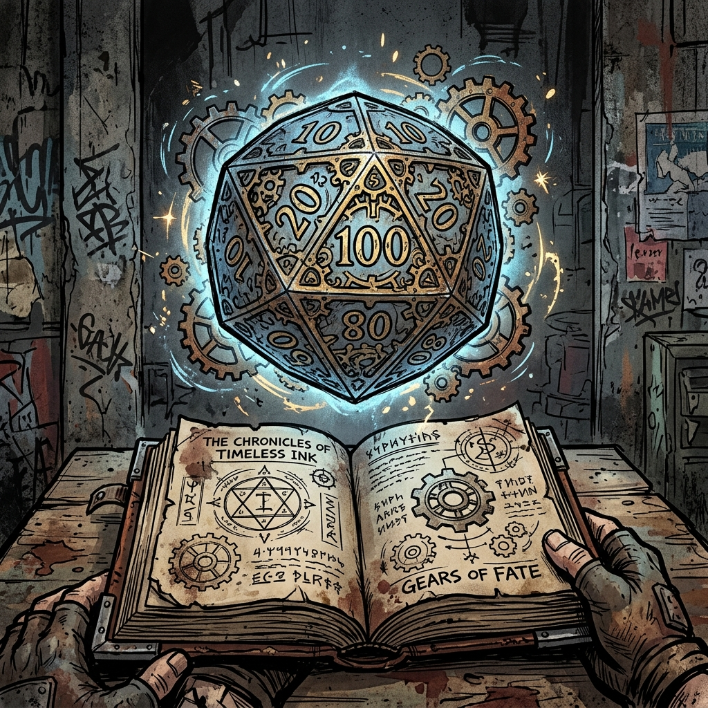

# Core Mechanics

*The Significant Digits Framework*

## Core Design Philosophy

This system decouples narrative scale from resolution scale to capture the feel of LitRPG progression: numbers go up, players feel it on their character sheet, and the GM never drowns in five-digit arithmetic.

- **Significant Digits (The Force System):** Every stat has a Raw Power value (the big LitRPG number) and a Force value (the first two significant digits). Players see their Strength climb from 4,200 to 4,500. The GM only ever touches the Force: 42 becomes 45. All resolution math stays locked in the 10–99 band, making a d100 always meaningful — whether characters are punching goblins or splitting continents.

- **The Clash (Opposed Resolution):** Every contested action resolves in one opposed roll. There is no separate to-hit step and damage step. You roll, your opponent rolls, and the Margin between totals determines the outcome. Combat is fast, decisive, and cinematic.

- **Grade-Anchored Difficulty:** The GM never calculates difficulty from scratch. Every obstacle is assigned a Grade and a relative difficulty, and the number comes from a single reference card. Cross-Grade interactions resolve through a symmetric adjustment: the higher-Grade side gains +100 per Grade of difference, applied to its Force (in Opposed Rolls) or its Resistance (in Resistance Rolls).

**Rounding:** All fractions round down. Always.

---

## The Significant Digits Framework

Every stat in the game has three components:

- **Raw Power:** The actual LitRPG number on the character sheet (e.g., 4,520). This is what players see, track, and get excited about.

- **Grade (Magnitude):** The order of magnitude, which maps directly to the character's Grade tier. Each Grade represents one order of magnitude of power.

- **Force:** The first two significant digits of the Raw Power. This is the only number used at the table for resolution.

**Extraction Example:** A character with STR 4,520 is D-Grade. Their STR Force is 45. An opponent with DEF 3,100 is D-Grade. Their DEF Force is 31.

| **Grade** | **Raw Stat Range** | **Magnitude** | **Force Range** | **Damage Multiplier** |
|---|---|---|---|---|
| F-Grade | 1–99 | 10⁰ | 1–99 | ×1 (add 0 zeroes) |
| E-Grade | 100–999 | 10¹ | 10–99 | ×10 (add 1 zero) |
| D-Grade | 1,000–9,999 | 10² | 10–99 | ×100 (add 2 zeroes) |
| C-Grade | 10,000–99,999 | 10³ | 10–99 | ×1,000 (add 3 zeroes) |
| B-Grade | 100,000–999,999 | 10⁴ | 10–99 | ×10,000 (add 4 zeroes) |

At F-Grade, Force equals Raw Power directly (no extraction needed — the number is already 1–99). From E-Grade onward, Force is extracted as the first two significant digits. A fresh E-Grade character with STR 120 has Force 12; they are weak within their Grade but still carry the Grade's damage multiplier, which is what makes cross-Grade combat so asymmetric.

The d100 never becomes irrelevant. A +10 flanking bonus matters exactly as much at C-Grade as it does at F-Grade, because the System scales the weight of tactics perfectly.

### Stat Growth and the Cap

Stats increase through leveling during Consolidation, consuming attribute-enhancing treasures, evolving to a new class at major milestones, and Hidden Achievement rewards. The System AI determines specific stat gains based on the character's class, behavior, and investment.

**Starting Stats:** A freshly integrated human begins with **40 points** distributed across seven Attributes via point buy, with a minimum of 3 and a maximum of 10 per stat. This produces stats typically in the 4–8 range, with one or two stats pushed to 9–10 by background or training. Even a +1 is meaningful — going from STR 5 to STR 7 represents the difference between a fit teenager and a seasoned laborer. See the Character Creation document for the full procedure and sample spreads.

**Per-Level Stat Budget (F-Grade):** Each level grants **5 stat points total**: **3 points** determined by class profile (or by the GM during pre-class levels) **+ 2 free points** for player choice. At higher Grades, the per-level budget scales with Grade magnitude — an E-Grade level grants points on the E-Grade scale (×10), a D-Grade level grants points on the D-Grade scale (×100), and so on.

**Pre-Class Allocation (Levels 2–9):** Before class selection at Level 10, the GM assigns the 3 fixed points each level based on observed behavior, using the Behavioral Stat Mapping table in the Character Creation document. A character who consistently acts with force tends to gain STR or FOR. A character who plans meticulously tends to gain PER or DEX. A character who leads or negotiates tends to gain CHA or HRT. The player controls 2 free points each level. This pre-class period is the Hidden Vector Engine's most influential window — how you play shapes what you become.

**Class Evolution at Level 10:** When the character selects their class from the three options generated by the System AI, they receive a one-time bonus allocation (typically 5–10 points, class-distributed) reflecting the character's systemic attunement to their new role. From this point, the class profile determines the 3 fixed points per level instead of the GM.

**Stat Cap:** A character's stats cannot exceed the maximum of their current Grade — **99 at F-Grade, 999 at E-Grade, 9,999 at D-Grade**, and so on. If leveling, treasures, or other rewards would push a stat above the cap, **those excess points are lost**. Breakthrough to the next Grade removes the barrier; stats scale into the new range and growth resumes. This is the genre's classic bottleneck: a cultivator who has maxed their primary stats feels the pressure of their Grade as a literal ceiling and must Break Through to continue growing.

---

## Core Resolution

Every check in the game resolves with a single mechanic: roll d100, add your Force, and compare.

### Opposed Rolls (Active Opposition)

When acting against another creature, NPC, or player character, both sides roll:

**Actor: d100 + Relevant Force + Tactical Modifiers**

**Opponent: d100 + Relevant Force + Tactical Modifiers**

Higher total wins. In the case of a tie, the initiator wins.

The **Margin** (winner's total minus loser's total) determines the degree of success. In combat, the Margin directly drives damage. Outside combat, the GM interprets the Margin narratively — a Margin of 50+ is a dominant success; a Margin of 1–5 is razor-thin.

### Resistance Rolls (Passive Obstacles)

When acting against a passive obstacle (a locked door, a cliff face, a trap, a poison), the GM assigns a Resistance value from the Grade Reference Card. The player rolls:

**d100 + Relevant Force + Tactical Modifiers vs. Resistance**

Meet or exceed the Resistance to succeed.

### The Grade Reference Card

The GM does not calculate difficulty from scratch. They ask two questions: What is this obstacle's difficulty tier? And what is its Grade relative to the challenger's? The base Resistance is read from this table:

| **Difficulty** | **Resistance** |
|---|---|
| Trivial | 40 |
| Easy | 65 |
| Moderate | 90 |
| Hard | 115 |
| Severe | 140 |
| Peak | 165 |

The card is a single column because Force is a single column: every Grade resolves with Force in the 1–99 band. Power scaling between Grades is handled separately by the **Cross-Grade Adjustment** below — not by inflating the card's columns.

**Cross-Grade Adjustment.** When the obstacle's Grade differs from the challenger's, the higher-Grade side gains **+100 per Grade of difference**. Apply it to whichever side is higher:

- **Higher-Grade challenger vs. lower-Grade obstacle:** Add +100 per Grade of difference to the challenger's roll.
- **Lower-Grade challenger vs. higher-Grade obstacle:** Add +100 per Grade of difference to the obstacle's Resistance.
- **Same Grade:** No adjustment. Read the Resistance straight off the card.

A magically reinforced door built by an E-Grade formation master is Moderate: base Resistance 90. An F-Grade challenger faces it at effective Resistance 190 (90 + 100 for the one-Grade differential). An F-Grade character with STR Force 99 rolls d100 + 99, maximum possible result 199 — they can barely crack it on a perfect roll. An E-Grade peer with Force 50 challenges the same door at Resistance 90 and cracks it on any roll of 40 or higher. The fiction reads correctly at both Grades, and the GM never has to recompute the card.

Tape the card to the GM screen. One card, every Grade.

### Auto-Success: The Power Fantasy Rule

If your Force alone meets or exceeds the Resistance, you do not roll. You simply succeed. The action is beneath you.

That F-Grade Moderate lock (Resistance 90) that once required a tense roll when your DEX Force was 30? When your DEX Force reaches 92, you pick it open without thinking. No roll. The table feels the growth. This is the LitRPG progression payoff expressed mechanically.

The GM only calls for a roll when there is genuine uncertainty — your Force is below the Resistance and the d100 could swing it.

### Proficiencies and Skill Checks

Each character begins with three Proficiencies — broad domains of competence written in plain language. Examples: "wilderness survival," "ancient languages," "mechanical tinkering," "intimidation," "field medicine," "stealth and infiltration."

**Skill Check Formula:**

- **Base Modifier:** Your Relevant Attribute's **Force** (e.g., intimidating a guard uses CHA Force; breaking down a barricade uses STR Force; tracking a creature uses PER Force; resisting an interrogator's coercion uses HRT Force).
- **Proficiency Bonus:** If you possess a relevant Proficiency, add a flat **+10** to your roll.

Opposed checks resolve as Opposed Rolls (above) — both sides roll d100 + Force, higher wins. Passive obstacles resolve as Resistance Rolls — the GM assigns a Resistance from the Grade Reference Card and the character must meet or exceed it.

The GM decides which Attribute applies. Resisting coercion is HRT; reading an interrogator's tells is PER; outlasting physical torture is FOR. Deciphering Principle script might be PER if it is analytical, POW if it is intuitive, or even a Principle affinity check if the script resonates with the reader's own cultivation.

**Passive Awareness:** If a character has a relevant Proficiency (perception, survival, investigation), the GM may assume they notice things up to a reasonable baseline without rolling. Only roll when there is meaningful risk, uncertainty, or time pressure.

**Gaining New Proficiencies:** Characters can earn new Proficiencies through play. The System AI may award them as class features, Hidden Achievement rewards, or Consolidation visions.

### System Volatility (Exploding Dice)

Higher Grades of power are not just bigger — they are more volatile. The System's energy density at elevated Grades creates cascading instabilities in every clash. The colloquial term is **exploding** — a die that triggers Volatility "explodes."

**The Trigger.** Volatility checks the **natural d100 result (before any modifiers)** — Force, Tactical Modifiers, Cross-Grade Adjustments, item bonuses, and ability bonuses are all ignored for the purpose of triggering Volatility. If the natural die meets or exceeds the Volatility Threshold for the rolling combatant's Grade, they roll again and add the new die to their Clash total. Each additional die cascades on the same natural threshold; modifiers never count toward the trigger. A single roll can cascade indefinitely so long as each successive die comes up natural-threshold or higher.

| **Grade** | **Explodes On (natural)** | **Probability** |
|---|---|---|
| F-Grade | 96–100 | 5% |
| E-Grade | 90–100 | 11% |
| D-Grade | 80–100 | 21% |
| C-Grade | 70–100 | 31% |
| B-Grade | 55–100 | 46% |
| S-Grade | 40–100 | 61% |

**Symmetry — Offensive and Defensive Explosions.** Volatility applies to **every d100 rolled in combat**, by either side: attacker's roll, defender's roll, both sides of an Opposed Roll, contested checks, and saves resolved during a combat scene. Both attackers and defenders can explode. An offensive explosion typically spikes the Margin upward into devastating damage. A defensive explosion drives the attacker's Margin sharply negative — the attack lands harmlessly with a spectacular flourish, as if the System itself swept the blow aside. A winning defender deals no damage from the Clash itself.

At F-Grade, explosions are rare — combat is gritty and grounded. At D-Grade and above, cascading explosions generate enormous Margins. Time-to-kill plummets. S-Grade fights are blindingly fast, terrifying exchanges where a single opening obliterates the opponent.

System Volatility replaces traditional critical hits. When an explosion occurs, it is inherently spectacular — the System's energy spiked, and the narrative should reflect it.

**Volatility applies only in combat.** Non-combat skill checks use the standard d100 without explosion.

---

## Attributes & Derived Stats

Every character possesses seven core Attributes. These are raw numbers — the big LitRPG values on the character sheet. Their Force equivalents are used at the table.

- **Strength (STR):** Physical power and carry capacity. Governs heavy melee attacks.
- **Dexterity (DEX):** Precision, speed, and manual agility. Governs evasion, finesse melee, and ranged attacks.
- **Fortitude (FOR):** Physical endurance and structural integrity. Governs Health and physical defense.
- **Heart (HRT):** Resolve, mental fortitude, and spiritual anchor. Governs defense against mental, spiritual, and coercive attacks, as well as Aura Pressure resistance.
- **Power (POW):** The magnitude of supernatural or energy-based output. Governs spells, abilities, and Energy pool.
- **Perception (PER):** Awareness, mental acuity, and sensory sharpness. Governs detection, Principle insight, and defense against illusions and sensory deception.
- **Charisma (CHA):** Force of personality and social manipulation.

**Derived Statistics:**

- **Max HP:** Raw FOR × 2. A character with FOR 75 has 150 HP. A character with FOR 8,500 has 17,000 HP. The numbers scale with Grade because the stats themselves scale with Grade. The doubled coefficient gives peer combat enough room to develop across multiple exchanges before lethality lands — without it, a single hot opening Clash routinely ended fights before the defender could act.

- **Max Energy:** Equal to the character's Raw POW value.

- **Defense Force:** In combat, the defending stat used in a Clash depends on context. Against physical attacks, a character uses FOR Force (representing toughness, armor integration, and physical resilience). Against mental, spiritual, or coercive attacks, HRT Force. Against illusions and sensory deceptions, PER Force (you resist by recognizing the deception; Heart does not help if you do not realize you are being tricked). The defender always adds DEX Force if actively dodging (see Combat Mechanics, "The Clash" subsection).

There is no Damage Reduction as a derived stat. Armor, toughness, and defensive training are folded into the defender's Clash total. If your defense is strong enough, the attacker's Margin is small — or negative, meaning you deflect entirely.

Stats are raw and unfiltered. There is no class-based efficiency layer — if a Mentalist invests heavily in STR, they hit just as hard as a Warrior with the same STR.

---

## Combat Mechanics

Combat is lethal, mathematically clean, and resolved through opposed Clashes.

### Initiative: The Momentum System

There is no fixed turn order. Combat flows through Momentum — whichever side holds Momentum acts first as a group, in whatever order they choose. Then the opposition acts. This keeps combat cinematic and rewards fictional positioning over stat optimization.

**Starting Momentum:** The side that initiated the encounter holds Momentum. Ambushers, aggressors, or whoever forced the fight goes first. If unclear, the GM calls for an Opposed Roll (each side's representative rolls d100 + DEX Force). Higher total wins Momentum.

**Surprise Beat:** A side that achieves true surprise (successful ambush, undetected trap) gains one free Beat per character before Momentum-based turns begin. This is the only time the action economy is asymmetric.

**Momentum Shifts:** Momentum passes to the opposing side when:

- A character drops to 0 HP or suffers near-fatal damage
- A System Volatility explosion occurs (the energy spike disrupts the flow of combat)
- A new combatant enters the fight or the terrain meaningfully changes
- A player action significantly alters positional advantage

A character may also attempt to **seize Momentum** by spending 1 Beat and winning an Opposed Roll (d100 + DEX Force vs. d100 + DEX Force of the opposing side's representative). Failure wastes the Beat.

The GM is the final arbiter of Momentum shifts. When in doubt, Momentum stays where it is.

### Action Economy: Beats

Each character gets **two Beats** per turn. A Beat is one meaningful action:

- Attack (melee or ranged)
- Cast a spell
- Move to an adjacent Zone
- Use an item
- Activate a Principle Application (Seed or Early Fragment)
- Attempt a skill check
- Disengage from a hostile (leave their Zone without provoking a free strike)
- Attempt to seize Momentum (Opposed DEX Force roll)

**Free actions** (no Beat cost): speaking, drawing a weapon, dropping an object, moving within your current Zone.

**Anti-Repetition Rule:** Repeating the same offensive action twice in one turn imposes −10 to the second Clash roll. A fighter can swing twice, but the second strike is less precise. This prevents degenerate double-attack loops while keeping the flexibility of two Beats.

**Aura Pressure and Beat Loss:** When Aura Pressure reduces a character's Beats, they drop to one Beat (moderate suppression) or zero Beats (severe suppression). See "Aura Pressure" below.

### Movement: Zones and Position

Combat does not use grids or measured distance. Each combat scene is divided into **Zones** — loose areas defined by the fiction.

- A tavern brawl might have three Zones: the bar, the floor, the doorway.
- A forest ambush might have: the trail, the tree line, the ridge.

**Movement Rules:**

- Moving within your current Zone is free.
- Moving to an adjacent Zone costs one Beat.
- Moving two Zones costs both Beats (your entire turn is spent repositioning).

**Engagement and Free Strikes:** If you are in the same Zone as a hostile enemy and attempt to leave without spending a Beat to Disengage, that enemy gets a **free strike** — one Clash roll at no Beat cost. To leave safely, spend a Beat to Disengage, then a Beat to move. Your whole turn, but you escape clean.

**Positional States:** Within a Zone, characters can occupy one of three Positional States:

- **Elevated** (high ground, rooftop, mounted): +10 to your Clash roll.
- **Neutral** (default): No modifier.
- **Exposed** (caught in the open, flanked, off-balance): −10 to your Clash roll.

Spending 1 Beat to reposition within a Zone can change your Positional State (e.g., climbing to high ground, diving behind cover). The GM may also assign Positional States based on terrain, clever play, or failed rolls.

### The Clash (Combat Resolution)

Combat is a series of Opposed Clashes. There is no separate to-hit roll and damage roll. Each Clash determines *whether* you hit, *how hard*, and *how much damage* in a single exchange.

**Step 1 — Both Sides Roll:**

**Attacker Clash Total: d100 + Offensive Force + Tactical Modifiers**

**Defender Clash Total: d100 + Defensive Force + Tactical Modifiers**

**Offensive Force** is drawn from the governing stat for the attack:

- Heavy melee (axe, warhammer, greatsword): STR Force
- Finesse melee (rapier, daggers, spear): DEX Force
- Ranged weapons (bows, thrown, crossbow): DEX Force
- Spells and abilities: POW Force

**Defensive Force** depends on how the defender responds:

- Active dodge/evasion: DEX Force
- Standing ground / absorbing the blow: FOR Force
- Resisting a mental, spiritual, or coercive attack: HRT Force
- Resisting an illusion or sensory deception: PER Force

The defender chooses their defensive posture when targeted, bounded by what the fiction permits. A heavily armored juggernaut tanks hits with FOR; a nimble duelist dances away with DEX; a steadfast monk holds her mind against a mentalist's assault with HRT. The GM adjudicates edge cases.

**Tactical Modifiers** include: Positional State (+10 Elevated, −10 Exposed), Anti-Repetition (−10 for same action twice), Flanking (+10 when allies threaten from multiple Zones), Skill bonuses (System-granted combat skills may add +5 to +15), Principle active effects (variable), Environmental conditions (−10 to −20 for blindness, difficult terrain, etc.).

**Step 2 — Determine the Winner:**

Highest Clash Total wins. Tie goes to the attacker (the initiator).

If the **defender wins**, the attack is deflected, dodged, or absorbed harmlessly. The defender deals no damage unless they used a specific Counter ability.

If the **attacker wins**, calculate the **Margin:**

> **Margin = Attacker's Clash Total − Defender's Clash Total**

**Step 3 — Apply Damage (The Zeroes Rule):**

Take the Margin and multiply it by the attacker's Grade Magnitude:

> **Damage = Margin × 10^(Grade Magnitude)**

| **Attacker's Grade** | **Magnitude** | **Damage Calculation** |
|---|---|---|
| F-Grade | 0 | Damage = Margin × 1 |
| E-Grade | 1 | Damage = Margin × 10 |
| D-Grade | 2 | Damage = Margin × 100 |
| C-Grade | 3 | Damage = Margin × 1,000 |

The GM does zero mental arithmetic on the big numbers. They just append zeroes.

Apply this damage directly to the defender's HP (which is their Raw FOR value). There is no Damage Reduction subtraction step. Armor, toughness, and defensive capability were already factored into the defender's Clash roll.

**Why this works:** Because Force is always 1–99 and the d100 is always 1–100, the Margin naturally stays in a tight, predictable band. Tactical modifiers never become irrelevant. The big LitRPG numbers live on the character sheet where players want them; the table math is an addition problem and a zero-appending exercise.

### AoE and Multi-Target Attacks

An AoE spell or sweep attack targets everyone in a Zone (or a portion of a Zone specified by the GM). The attacker rolls once. Each defender rolls their own Clash individually. The Margin is calculated separately for each defender — some may take massive damage while others barely get clipped.

AoE abilities are powerful by design. They are gated by Energy cost, skill rarity, and the risk of hitting allies in the same Zone.

For a martial character who wants to hit two adjacent targets with a melee cleave: make a single Clash roll against both (each defender rolls separately). Each defender takes damage based on their individual Margin, but the attacker splits their Magnitude tier down by one step (a D-Grade attacker's cleave adds 1 zero instead of 2). This gives melee fighters a multi-target option at a meaningful cost.

### Failure Consequences

When a roll fails, the GM selects the appropriate severity:

- **Soft Failure:** Success at a cost. The attack hits but the attacker becomes Exposed. The lock opens but the tool breaks. Partial information, not total ignorance.

- **Hard Failure:** Failure plus consequence. The attack misses and the enemy shifts Position. The negotiation fails and the NPC's attitude worsens. The stealth check fails and you are detected.

- **Catastrophic Failure:** Failure plus escalation. The spell misfires and drains double Energy. The enemy counterattacks outside normal turn order. The failed acrobatics check sends you off the ledge.

The GM chooses based on fictional stakes and narrative momentum. Catastrophic Failures should be rare — reserved for moments when the fiction demands it or when a natural 01–05 is rolled.

---

## The Grade Gap: The Magnitude Barrier

When entities of different Grades clash, the gap between them is expressed through the same Force system — cleanly, without bolted-on suppression layers.

### The Magnitude Gap Rule

**For every Grade of difference, the higher-Grade combatant adds +100 to their Force in all Clashes and opposed checks.**

This is not a separate mechanic. It flows directly from the Significant Digits framework. A character operating at a higher Grade carries more systemic weight — the System recognizes the dimensional difference and adjusts accordingly.

| **Grade Gap** | **Higher-Grade Force Bonus** |
|---|---|
| Same Grade | +0 |
| 1 Grade higher | +100 |
| 2 Grades higher | +200 |
| 3+ Grades higher | +300+ |

**Worked Example — F-Grade Peak vs. E-Grade Initiate:**

The F-Grade Peak has STR 99 (Force 99). The E-Grade Initiate has DEF 120 (Force 12, plus +100 for the Grade gap = effective Force 112).

If the F-Grade attacks: d100 + 99 vs. d100 + 112. The F-Grade's peak Force nearly matches the E-Grade's adjusted Force. With a great roll and a bad roll from the opponent, they can win — barely. But even if they win with a Margin of 20, F-Grade damage adds 0 zeroes: 20 damage against the E-Grade's 120 HP. A dent, not a kill.

If the E-Grade attacks: d100 + (12 + 100) vs. d100 + 99. The E-Grade's effective Force is 112. An average exchange (both roll 50) gives the E-Grade a Clash Total of 162 vs. 149. Margin of 13. E-Grade damage adds 1 zero: 130 damage. The F-Peak has 99 HP. Instantly dead — from a glancing blow.

**The combined effect:** Cross-grade combat is asymmetric not because of bolted-on penalties, but because the math itself creates asymmetry. The higher-Grade entity's damage multiplier ensures that even a small Margin is lethal, while the lower-Grade entity must win by a massive Margin to inflict meaningful damage at their reduced multiplier. Punching up is *possible* — possible enough to generate the best stories — but it requires extraordinary rolls, tactical mastery, and Principle preparation.

### The Natural Stat Wall

Before the Magnitude Gap bonus even applies, the raw stat difference between Grades creates a wall. An F-Grade character's stats max at 99. An E-Grade character's stats start at 100. The Force extraction ensures these map to the same 10–99 band for resolution, but the damage multiplier gap (×1 vs. ×10) makes every successful attack from a higher Grade devastatingly efficient.

### Aura Pressure

Being in the presence of a higher-Grade entity is not merely a tactical disadvantage — it is a visceral, spiritual experience. The weight of a higher-Grade being's accumulated systemic energy presses down on weaker entities like gravity.

When a character first enters the presence of a higher-Grade entity, they must make a single **Will Save:**

> **d100 + HRT Force + (FOR Force / 2) vs. Aura Resistance**

The entity's Aura Resistance is read from the Grade Reference Card, typically Hard or Severe for their Grade.

This save is decisive:

- **Success:** The character has steeled themselves. They are resistant for the remainder of the encounter and suffer no Aura penalties.

- **Failure:** The character is **Suppressed**, dropping from 2 Beats to 1 Beat per turn.

A character who fails does not retry each round. Aura suppression can only be broken by a meaningful change in the fiction:

- Spending a Beat (if the character has one) to activate a Principle Application and push back against the pressure
- An ally spending a Beat to intervene (shielding, shouting, physical contact)
- The higher-Grade entity taking significant damage or being distracted

When one of these occurs, the GM allows a fresh Will Save.

A benevolent higher-Grade NPC may suppress their aura entirely (no save required). A hostile entity that deliberately flares their aura mid-combat (as a Beat on their turn) forces a fresh save from everyone.

---

## The Energy System

Energy is the universal resource for active Principle Applications, spells, and most active skills. Warriors and casters alike draw on it — anyone reaching for System-granted power spends Energy to do so.

### The Energy Pool

**Max Energy equals the character's Raw POW value.** An F-Grade character with POW 80 has 80 Energy. An E-Grade character with POW 500 has 500 Energy. The pool scales naturally with Grade through the stat cap and per-level allocations — no separate multiplier is required.

### Regeneration

**Energy does not regenerate in combat. It does not regenerate between combats. It does not regenerate with passive time.** Energy refills only through **Consolidation** — a full pool restore occurs automatically at the start of any Consolidation rest (see Cultivation document).

This is deliberate. Combat Energy is a finite budget. Every Principle Application, every active skill, every sustained Domain eats against a hard ceiling that cannot be replenished until the character stops to rest. Characters must decide when to unleash big abilities and when to save them. The same pressure applies equally to warriors and casters — there is no "catching your breath" between fights.

### Costs Scale by Skill Origin Grade

Every Principle Application, spell, and active skill has a fixed Energy cost based on the Grade at which it was acquired. Baseline costs are set at F-Grade; each Grade higher multiplies the cost by the Grade Magnitude (×10 per Grade) — the same scaling rule used for damage and difficulty.

| **Skill Origin Grade** | **Seed Application** | **Early Fragment App.** | **Peak Fragment Domain** |
|---|---|---|---|
| F-Grade | 10 | 15 | 30 + 5/round |
| E-Grade | 100 | 150 | 300 + 50/round |
| D-Grade | 1,000 | 1,500 | 3,000 + 500/round |
| C-Grade | 10,000 | 15,000 | 30,000 + 5,000/round |

**The cost is permanently fixed to the skill's origin Grade.** A Seed Application learned at F-Grade costs 10 Energy for the rest of the character's life — after Breakthrough to E, to D, to C, it is still 10 Energy. The pool around it grows by orders of magnitude; the skill's price does not.

This produces two distinct feels at every Grade-up:

- **Old skills become trivial to sustain.** An F-Peak caster with 99 Energy got ~10 uses of a Seed Application per fight. After Breakthrough to E-Initiate (Energy ~100), still 10 uses. At E-Peak (Energy 999), 99 uses — an order of magnitude more sustain on their old toolkit. By D-Grade, F-tier skills are pennies.

- **New Grade-appropriate skills are the true upgrade.** A skill acquired at E-Grade costs 100 Energy per use — a meaningful fraction of the new pool. The character who wants to access their new Grade's full ceiling must pay for it. Old tricks still work, but they are no longer where the real power lives.

### Attrition Across the Grade Gap

Because costs scale with skill Grade but pool size scales with the user's current stats, higher-Grade characters in protracted combat must still manage Energy carefully. This produces the genre-standard attrition pressure: a higher-Grade entity fighting large numbers of lower-Grade opponents is not invincible — they are eventually drained.

A D-Grade warrior facing an F-Grade horde can spam cheap F-tier Seed Applications nearly forever, but F-tier bonuses do not clear swarms fast enough. Clearing the field requires D-tier AoE, Early Fragment applications, or a sustained Domain — all of which drain from the same 5,000-ish Energy pool. The character wins the encounter but cannot keep winning encounters without rest.

Numbers matter. Raw pool magnitude matters. Grade superiority is real but not infinite.
