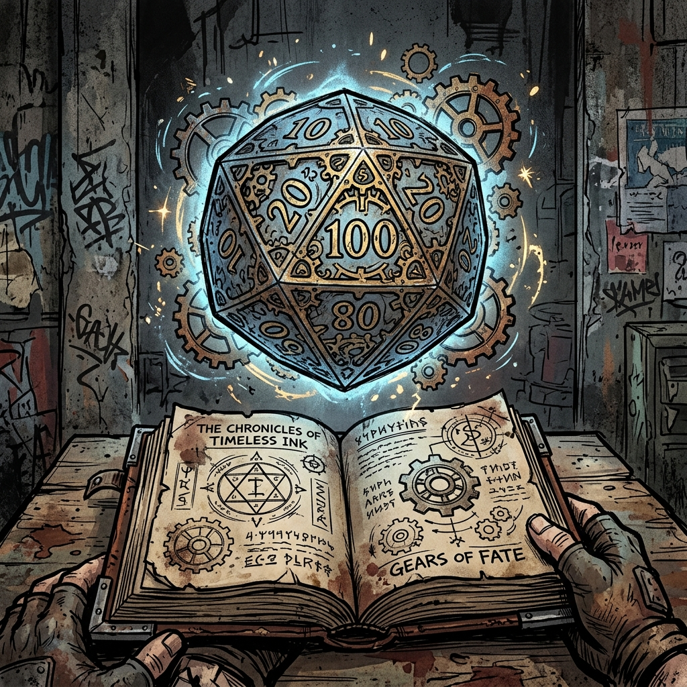

# Core Mechanics

Everything in this game resolves the same way: say what your character does, roll d100, add the one Force value that governs it, and compare. Against a living opponent they roll too, and the gap between the totals is the Margin, which says how well it went. In combat the Margin is the damage. That loop is the whole engine, and the rest of this chapter is the detail around it.

What lives elsewhere: how characters are built is in Character Creation, how they level is in Progression, where the energy to level comes from is in Cultivation, and the Principle track that most of these numbers eventually feed is in The Principle System.

---

## The Two Sizes of Number

The game's numbers come in two sizes: the huge ones the story is about, and the small ones the table rolls with. Stats grow into the millions; every number that touches dice stays between 1 and 99.

- **Force.** Every stat has a **Raw Power** value, the big number on the character sheet, and a **Force** value, the two digits read at the character's Grade. Players watch Strength climb from 4,200 to 4,500; at the table that same climb is Force 42 becoming Force 45.
- **The Clash.** Every contested action resolves in one opposed roll. There is no separate to-hit step and damage step.
- **Grade-anchored difficulty.** Every obstacle has a Grade and a difficulty, and the number comes off one reference card. Across a Grade gap, the higher side gains +100 per Grade of difference.

**Rounding:** all fractions round down, always.

### Drama Over Simulation

These rules chase the feel of the genre's fights: impossible speed, a sword arc that splits a hillside, the weak toppling the strong on nerve and timing. They are a camera, and the camera serves the story. A Zone is a piece of story geography; a Beat is a slice of dramatic time. Neither maps to meters or seconds, and pressing them for physical precision produces nonsense faster than answers.

Any system this size has edge cases, and every table eventually finds a reading that is technically legal and completely ridiculous. When that happens the GM's tiebreaker is drama: rule for the version that belongs in the story the table is imagining. Exploiting a rules edge is often half the fun of progression fantasy, and the System itself rewards ingenuity, so the question is never whether players are optimizing. The question is whether the optimization makes the table lean in or check out. If everyone is grinning, let it ride and let the world react. If it is draining tension from a scene people cared about, name it, adjust it, and move on.

---

## Raw Power, Grade, and Force

Every stat has three readings.

- **Raw Power.** The actual number on the sheet, such as 4,520. This is what players track and get excited about.
- **Grade.** The order of magnitude the character's body operates at. F reads stats as 1–99, E as 100–999, D as 1,000–9,999.
- **Force.** Raw Power divided by the Grade's divisor (1 at F, 10 at E, 100 at D), fractions dropped. For a stat inside the Grade's band, which is nearly every stat, this is the first two significant digits. **Force is the only number used at the table.**

A character with STR 4,520 is D-Grade, so their STR Force is 45. An opponent with FOR 3,100 at D-Grade has Force 31.

| **Grade** | **Raw Stat Range** | **Divisor** | **Force Range** | **Damage Multiplier** |
|---|---|---|---|---|
| F-Grade | 1–99 | 1 | 1–99 | ×1 |
| E-Grade | 100–999 | 10 | 10–99 | ×10 |
| D-Grade | 1,000–9,999 | 100 | 10–99 | ×100 |
| C-Grade | 10,000–99,999 | 1,000 | 10–99 | ×1,000 |
| B-Grade | 100,000–999,999 | 10,000 | 10–99 | ×10,000 |

At F-Grade, Force equals Raw Power; the number is already in the band. A fresh E-Grade character with STR 120 has Force 12: weak within their Grade, and still carrying the Grade's ×10 damage multiplier, which is what makes cross-Grade combat asymmetric.

### Stat Growth and the Cap

Stats increase through leveling at Consolidation, **Attribute Treasures** absorbed during a rest (Items), class evolution at milestones, and Title rewards.

**Starting stats.** A freshly integrated human distributes **40 points** across seven Attributes, minimum 3 and maximum 10 per stat. Even a single point is meaningful: STR 8 is a competitive collegiate powerlifter, STR 9 a professional strongman, STR 10 among the strongest humans who ever lived. Character Creation has the full procedure.

**Per-level budget (F-Grade).** **5 points per level: 3 assigned by class profile** (or by the GM before a class exists) **plus 2 the player spends freely.** At higher Grades the budget scales with Grade magnitude. Progression covers the pre-class years in detail.

**Stat cap.** Stats cannot exceed the current Grade's maximum: **99 at F, 999 at E, 9,999 at D.** Excess is lost. Breakthrough lifts the cap; it does not raise the stat.

---

## Attributes and Derived Stats

Seven Attributes, tracked as Raw Power and read as Force.

- **Strength (STR):** Physical power and carry capacity. Governs heavy melee.
- **Dexterity (DEX):** Precision, speed, manual agility. Governs evasion, finesse melee, and ranged attacks.
- **Fortitude (FOR):** Endurance and structural integrity. Governs Health and standing your ground.
- **Heart (HRT):** Resolve, mental fortitude, spiritual anchor. Governs how much raw Volatile Energy you can carry before it starts to burn, defense against mental, spiritual, and coercive attacks, Aura Pressure, and the Breakthrough.
- **Power (POW):** Magnitude of energy-based output. Governs spells, Applications, and the Aether pool.
- **Perception (PER):** Awareness and sensory sharpness. Governs detection, Principle insight, and defense against illusion.
- **Charisma (CHA):** Force of personality and social leverage.

**Derived:**

- **Max HP:** Raw FOR × 2. FOR 75 gives 150 HP; FOR 8,500 gives 17,000.
- **Max Aether:** equal to Raw POW.
- **VE Tolerance:** (Raw FOR + Raw HRT) / 2 × 10, re-derived at the first full hour of each Consolidation. The frame holds it and the will holds it down. See Cultivation.

There is no Damage Reduction stat. Armor, toughness, and defensive training are folded into the defender's Clash total: strong defense makes the attacker's Margin small or negative.

Stats are raw. There is no class-based efficiency layer, so a Mentalist who invests in STR hits as hard as a Warrior with the same STR.

---

## Core Resolution

Roll d100, add the relevant Force, compare.

### Opposed Rolls

Against another creature or character, both sides roll:

> **Each side: d100 + relevant Force + Tactical Modifiers**

Higher total wins; a tie goes to the initiator. The **Margin** is the winner's total minus the loser's. In combat the Margin drives damage. Outside combat the GM reads it narratively. **Forty is the swing number throughout these rules: win by 40 and the outcome is decisive, whatever the arena.**

### Resistance Rolls

Against a passive obstacle, the GM assigns a Resistance and the character rolls against it:

> **d100 + relevant Force + Tactical Modifiers vs. Resistance**

Meet or exceed to succeed.

### The Grade Reference Card

| **Difficulty** | **Resistance** |
|---|---|
| Trivial | 40 |
| Easy | 65 |
| Moderate | 90 |
| Hard | 115 |
| Severe | 140 |
| Peak | 165 |

**Cross-Grade Adjustment.** When the obstacle's Grade differs from the challenger's, the higher-Grade side gains **+100 per Grade of difference**, applied to the challenger's roll or to the obstacle's Resistance, whichever is higher. Same Grade, no adjustment.

A door built by an E-Grade formation master is Moderate, Resistance 90. An F-Grade challenger faces it at 190 and needs a near-perfect roll at Force 99. An E-Grade peer with Force 50 cracks it on a 40.

### Auto-Success

If your Force alone meets the Resistance, you do not roll. A Moderate F-Grade lock is Resistance 90: DEX Force 30 rolls, DEX Force 92 simply opens it.

Call for a roll only when Force is below Resistance and the die could swing it.

**Across Grades,** the Adjustment counts toward Auto-Success. A challenger two Grades above a passive obstacle never rolls. Living opposition is different: Opposed Rolls are always rolled, whatever the gap.

### Proficiencies and Skill Checks

Each character begins with three Proficiencies: broad domains of competence written in plain language, such as "wilderness survival," "ancient languages," "field medicine," or "stealth and infiltration."

A Proficiency covers its whole domain, weapons included. "Close combat" governs the axe in your hands the same way "field medicine" governs the wound you are packing.

#### The Three Tiers

| **Tier** | **Effect** |
|---|---|
| **Trained** | +5 to Clashes and skill checks in the domain. Routine Mastery. Specialist Gating access. |
| **Seasoned** | +10 (in place of the +5). |
| **Master** | +10, and once on your turn your first action using the Proficiency costs no Beat. Requires an E-Grade body. |

Characters begin with three Proficiencies at Trained and deepen them through Marks, below.

**The skill check** is d100 + the relevant Attribute's Force + your Proficiency bonus. The GM decides which Attribute applies: resisting coercion is HRT, reading an interrogator's tells is PER, outlasting torture is FOR. Opposed checks resolve as Opposed Rolls; passive obstacles resolve as Resistance Rolls.

**Routine Mastery.** With a relevant Proficiency at any tier, you automatically succeed at Trivial and Easy tasks of your own Grade, no roll. A field medic does not roll to dress a wound; a tracker does not roll to follow a day-old trail in soft earth. Roll only when risk, time pressure, or opposition pushes the task to Moderate or above.

**Specialist Gating.** Some tasks cannot be attempted without the relevant Proficiency, whatever the Force: surgery, deciphering ancient scripts, formation-craft. High Force lets a character attempt anything physical or intuitive; it does not conjure trained knowledge.

**The Master's free action.** Once on your turn, the first action drawing on a Mastered Proficiency costs no Beat. The axe Master's first swing is free. The field medic's first act of medicine is free, so an ally can be stabilized without giving up half a turn.

It is not a Beat and cannot be treated as one. It cannot be given up to Yield, held over for later in the round, or spent outside the Proficiency. A Master who gave up both Beats to Yield arrives at their turn with nothing to spend and still takes it. Aura Pressure reduces Beats and does not touch it. The Surprise Beat is a Beat outside a turn, so the free action is not available during surprise; it arrives when the Master's turn does.

#### Marks

When a natural d100 meets or exceeds your Volatility Threshold on a Clash or a skill check, the System marks the Proficiency you were using. Record it as a tally. Where a roll could belong to more than one domain, or to none the character holds, the GM names the domain.

::: systemvoice
**[Technique noted: Close Combat. 2/3.]**
:::

- **3 Marks:** Trained becomes Seasoned.
- **10 Marks:** Seasoned becomes Master. Mastery requires an E-Grade body; an F-Grade character banks Marks past 10 and advances at the Breakthrough.
- **3 Marks in a domain the character has no Proficiency in:** the System grants that Proficiency at Trained. Those three Marks are spent in the granting.

Marks land where the character actually works. A fighter who never puts down the axe reaches Master with an axe and stays Trained in everything else. Carrying a weapon you have no Proficiency for adds nothing today and marks the domain every time the die runs hot, which is how scavenged junk becomes a fourth Proficiency.

### Failure and Exceptional Success

These tiers apply to **skill checks**. Combat Clashes carry their own outcomes.

- **Soft Failure (fail by 1–39):** the attempt does not achieve what was asked. Usually that means visible partial progress and a new problem: the lock resists and the pick is bent, the climb stalls at the overhang, you learn half of what you came for. Give the character something to work with rather than a closed door.
- **Hard Failure (fail by 40 or more):** failure plus consequence. The negotiation collapses and the NPC's attitude hardens. The stealth attempt fails and you are detected.
- **Catastrophic Failure (natural 01–05):** failure plus escalation, whatever the margin. The rope parts at the worst height. The ancient script does the thing it warned about.

**On Soft Failure.** Turning a Soft Failure into success-at-a-cost is a tool, and it is worth spending when the cost is more interesting than the setback. Used every time it dissolves failure as an outcome and the dice stop mattering. Default to a real setback the character can push against, and save the bargain for the moments where paying the price is the better scene.

The GM may shift any tier one step when the fictional stakes demand it.

**Exceptional Success.** A natural roll that meets or exceeds your Volatility Threshold on a skill check adds no dice and no math; it makes the outcome remarkable. If the total succeeds, the GM narrates one step beyond what was asked: the merchant agrees, then offers more than anyone put on the table. If the total still fails, the failure is Soft whatever the margin.

### System Volatility

The System's energy density creates cascading instabilities in every clash. The colloquial term is **exploding**.

**The trigger** is the **natural d100 before any modifiers**. Force, Tactical Modifiers, Cross-Grade Adjustments, item and ability bonuses are all ignored for triggering. If the natural die meets or exceeds the Volatility Threshold for the roller's Grade, roll again and add. Each new die can cascade on the same threshold.

| **Grade** | **Explodes On (natural)** | **Probability** |
|---|---|---|
| F-Grade | 96–100 | 5% |
| E-Grade | 95–100 | 6% |
| D-Grade | 94–100 | 7% |
| C-Grade | 93–100 | 8% |
| B-Grade | 92–100 | 9% |
| S-Grade | 91–100 | 10% |

**One number at the top of the die.** The Volatility Threshold governs everything that happens at the high end of a natural d100. On a Clash it explodes. On a skill check it is an Exceptional Success. On either it marks the Proficiency in use. A player tracks one number and it moves only with their Grade.

**Both sides explode.** Volatility applies to every **Clash roll and Will Save in combat**, attacker and defender alike. Skill checks never explode; a battlefield surgery resolves on the standard d100. An offensive explosion spikes the Margin; a defensive explosion drives it sharply negative and the attack lands harmlessly. There is no separate critical-hit rule.

**Volatility applies only to combat Clashes and Will Saves,** with one exception: the Breakthrough Check explodes (see Grade Breakthroughs).

**Cascades leave marks.** A cascade of two or more extra dice on a player character's roll grants that character a **Battle Memory Card** (see The Principle System).

---

## Combat

### Initiative: The Momentum System

Combat does not use a fixed turn order. Each round the side with **Momentum** takes a complete turn first; the others follow. Momentum can shift between rounds.

**Initial Momentum.** Each side sends one roller:

1. For each combatant on the side, take the higher of their DEX Force and PER Force.
2. The side's roller is whoever has the highest such value.
3. The roller makes the side's **Momentum Roll**: d100 plus that value.

The two sides may be rolling different Attributes. Highest total holds Momentum for the first round. **On a tie, both sides roll again.**

**Surprise.** A side that achieves true surprise acts before combat properly begins: each surprising character immediately takes one free Beat, the **Surprise Beat**. Then Initial Momentum is rolled normally. A sharp defender can absorb an ambush and still take the first full round.

**Round structure.** When a side takes its turn:

- Characters act **one at a time**, in any order the side chooses.
- A character uses **all** of their Beats before the next teammate acts.
- Once every character on the side has acted, the next side begins.
- A round ends when every side has acted.

**Multi-faction combat.** With three or more sides, the initial Momentum Roll sets a turn order for the whole round, highest to lowest, until a Shift fires.

**Momentum Shifts.** Between rounds, Momentum can shift on three triggers:

- **Reinforcement Arrival.** A previously absent combatant enters the fight. Momentum shifts to that side at the start of the next round, if it does not already hold it.
- **Decisive Tactical Reversal.** A character reshapes the fight: springing a trap, weaponizing terrain, completing a multi-round setup, exposing a hidden combatant, winning a defensive Clash with a Volatility explosion, or any other move the GM judges to qualify. Momentum shifts to that character's side. The threshold is GM judgment, and it is the GM's flexible reward for clever play.
- **Seize Momentum.** A character spends 1 Beat and rolls an Opposed Momentum Roll against the side currently holding Momentum, using **their own** DEX or PER Force, whichever is higher. The side holding Momentum answers with its highest such value. On a win, Momentum shifts at the start of the next round. On a loss, the Beat is spent.

When no Shift fires, Momentum stays where it is.

### Action Economy: Beats

Every character has **two Beats** per turn by default; creature stat blocks may set a different count. A Beat is one meaningful action:

- Attack, melee or ranged
- Cast a spell
- Move to an adjacent Zone
- Use an item
- Activate a Principle Application
- Attempt a skill check
- Claim or strip a Positional State (below)
- Disengage from a hostile
- Attempt to seize Momentum

**Free actions,** costing no Beat: speaking, drawing a weapon, dropping an object, and moving around inside your current Zone (up to the Positional State line; see Movement).

**A third Beat is the rarest form of power.** Certain titles, class evolutions, and Grade milestones grant one, and anything that does says so explicitly. A Mastered Proficiency's free action is not a third Beat and is not a Beat at all; it is one specific action that costs nothing, and it is the only thing in the game shaped that way.

**Aura Pressure** reduces a character to one Beat or zero. See "Aura Pressure" below.

**Beats given up to Yield** come from the character's next turn. A character who yielded twice since their last turn has no Beats when their turn arrives.

### Movement: Zones and Position

Combat has no grid and no measured distance. Each scene is divided into **Zones**: loose areas defined by the fiction. The GM establishes them at scene start; players propose, the GM rules.

- A tavern brawl might have three Zones: the bar, the floor, the doorway.
- A forest ambush might have the trail, the tree line, the ridge.

**Movement:**

- Moving around inside your Zone is free, up to the line where movement would claim or strip a Positional State; crossing that line is the 1-Beat action above.
- Moving to an adjacent Zone costs one Beat.
- Moving two Zones costs both Beats.

**The Free Step (DEX Force 50+).** A character with DEX Force 50 or higher takes one additional Zone move each turn without spending a Beat. It does not bypass Engagement: leaving a hostile's Zone without Disengaging still provokes a free strike.

**Positional States.** Within a Zone a character is in one of three states:

- **Advantaged**, any fiction-derived positional edge: +10 to your Clash rolls.
- **Neutral**, the default: no modifier.
- **Exposed**, caught in the open, flanked, or off balance: −10 to your Clash rolls.

What counts as Advantaged depends on the combatant: high ground for an archer, bare stone underfoot for an Earth cultivator, cramped quarters for a knife-fighter facing a greatsword. The GM assigns the state from the fiction, and the same terrain can be Advantaged for one combatant and meaningless for another.

**States are not reciprocal.** Each combatant has their own state and it affects only their own rolls. Taking the high ground gives you +10; it does not also give your opponent −10. If the terrain genuinely ruins the other side's footing, assign them Exposed on its own merits.

**Changing your state costs 1 Beat.** Drifting around the Zone is free, but working an angle, taking the stairs, or putting the fire between you and the axe is a Beat, and so is stripping an enemy's edge. The GM may also assign states from terrain, clever play, or a failed roll, at no cost to anyone.

### Reach, Engagement, and Flanking

**You can attack anyone in your own Zone.** Melee reaches no further. Ranged weapons, thrown weapons, and most spells reach targets in **adjacent** Zones as well; individual weapons and Applications may say otherwise.

**Engagement and free strikes.** If you share a Zone with a hostile and try to leave without spending a Beat to Disengage, that enemy gets a **free strike**: one Clash roll at no Beat cost. To leave clean, spend a Beat to Disengage and a Beat to move. That is your whole turn, and you escape.

**Flanking.** When a combatant is **engaged by two or more hostiles at once**, every one of those hostiles gains **+10** against them. Two allies in the target's Zone qualify; so does one in the Zone and one shooting into it from next door. Being outnumbered is the single most reliable way to raise a Clash total in this game, and it is why isolating one enemy is worth a turn of maneuvering.

### The Clash

Combat is a series of Opposed Clashes. Each one determines whether you hit, how hard, and how much damage in a single exchange.

**Step 1. Both sides roll.**

> **Attacker: d100 + Offensive Force + Tactical Modifiers**
>
> **Defender: d100 + Defensive Force + Tactical Modifiers**

**Offensive Force** comes from the governing stat:

- Heavy melee (axe, warhammer, greatsword): STR Force
- Finesse melee (rapier, daggers, spear): DEX Force
- Ranged (bows, thrown, crossbow): DEX Force
- Spells and abilities: POW Force

**Defensive Force** depends on how the defender answers:

- Dodging or evading: DEX Force
- Standing ground and absorbing: FOR Force
- Resisting a mental, spiritual, or coercive attack: HRT Force
- Resisting an illusion or sensory deception: PER Force

The defender picks their posture when targeted, bounded by what the fiction permits. A heavily armored juggernaut tanks with FOR; a duelist dances away with DEX; a monk holds her mind against a mentalist with HRT.

**Strength does not defend.** STR is force you apply and FOR is force you withstand, so even a parry that turns a blade aside with brute leverage is FOR. A powerful character who wants to be hard to kill invests in Fortitude, which is also where their Health comes from.

**Player versus player.** A skill, spell, or Principle effect aimed at another player character resolves as a standard Opposed Clash. PvP coercion is logged as a high-intensity Will event in the Hidden Vector Engine.

**Tactical Modifiers** all draw from one budget:

| **Modifier** | **Size** | **Examples** |
|---|---|---|
| Minor bonus | +5 | Trained Proficiency, Surge, minor blessings |
| Standard bonus | +10 | Advantaged, Flanking, Seasoned and Master Proficiency, most System-granted skills |
| Peak bonus (rare) | +15 to +20 | Peak abilities, one-shot relics, Hidden Achievement rewards |
| Hindering environment | −10 | Darkness, difficult footing, driving rain |
| Crippling environment | −20 | Blindness, restrained, fighting submerged |

New skills, items, and class features price their bonuses against this table.

**Step 2. Determine the winner.** Highest total wins; a tie goes to the attacker.

If the **defender wins**, the attack is deflected, dodged, or absorbed. The defender deals no damage unless they used a specific Counter ability.

**Turned Aside:** if the defender wins by **40 or more**, the attacker is **Exposed** until the end of their next turn. A defensive win that includes a Volatility explosion also counts as a Decisive Tactical Reversal, shifting Momentum next round.

**Driven Back:** if the attacker wins by **40 or more**, the defender takes the damage and is **Exposed** until the end of their next turn. The attacker may also drive them one Zone, which costs the attacker the reach to follow up. Worth doing when you want them away from a wounded ally, out of a doorway, or off the thing they were reaching for.

Turned Aside and Driven Back are the same number read from either side of the Clash.

**Step 3. Apply damage.** If the attacker won:

> **Margin = Attacker's total − Defender's total**
>
> **Damage = Margin × the attacker's Grade multiplier**

| **Attacker's Grade** | **Damage** |
|---|---|
| F-Grade | Margin × 1 |
| E-Grade | Margin × 10 |
| D-Grade | Margin × 100 |
| C-Grade | Margin × 1,000 |

Apply it straight to HP. There is no reduction step; the defender's toughness was already in their roll.

### Yield

Losing a Clash does not have to mean taking the whole blow. You can give way.

> **Yield: once the Margin is known and before damage is applied, give up Beats from your next turn. Each Beat reduces the incoming Margin by 20.**

Your next turn has two Beats, so two is all you have to give.

- **One Beat:** you give ground where you stand, and half of your next turn is gone.
- **Two Beats:** you break contact entirely and your next turn is gone. The attacker **may** drive you into an adjacent Zone of their choosing, and may decline to. Forced movement provokes no free strike.

Damage is the remaining Margin times the attacker's Grade multiplier. A Margin reduced to zero or below deals nothing.

**Example.** A Snarljaw beats Marta by 37. She is at 30 HP, so the bite would put her on the floor.

- She gives up one Beat. Margin 37 − 20 = 17. She takes 17, stands at 13 HP, and has one Beat on her turn.
- She gives up both. Margin 37 − 40 is below zero, so the jaws close on nothing. She acts not at all next turn, and the Snarljaw decides whether she is thrown clear or stays where she is.

**Cornered.** If there is nowhere to be driven, you can give up only one Beat. A corridor, a sealed chamber, a ledge, or a closed ring of enemies makes a fight far more dangerous without changing a number on any stat block.

**Yield at every Grade.** Yield subtracts from the Margin before the Grade multiplier reaches it, so one Beat is worth 20 Margin at F-Grade and 20 Margin at D-Grade. Against a higher-Grade attacker the Cross-Grade Adjustment is already inside the Margin, so giving ground rarely saves anyone from something above their Grade.

**Creatures.** A creature yields only if its stat block says it can. See the Bestiary.

### Multi-Target and AoE

When one attack or effect targets several creatures at once (an AoE spell, an Application that hits a Zone, a thrown explosive, a falling boulder):

- The source makes one attack roll.
- Each target rolls their own defensive Clash.
- Damage is calculated per target from their individual Margin.
- **Each target may Yield on their own Margin.** Giving up both Beats throws that character clear of the blast; there is no attacker choosing where they land.
- Allies in the affected Zone are valid targets unless the ability excludes them.

Multi-target capability is a property of specific abilities, spells, and effects rather than a baseline action.

### Downed and Death

**Downed at zero.** A character reduced to 0 HP is **Downed**: unconscious or barely conscious, prone, out of the fight, with no Beats and no defense. HP floors at 0. Creatures simply die at 0 unless the GM wants them alive; Downed applies to player characters and named NPCs.

::: systemvoice
*[Vital coherence: fraying. Estimated thread loss: 3 rounds.]*
:::

**The countdown.** A Downed character dies at the end of their third round Downed unless stabilized. The System announces the count, so the table always knows the clock.

**Stabilizing.** Two paths:

- **Any HP restoration.** A pill, medkit, or healing skill from an ally in the same Zone (1 Beat) returns them to consciousness at the restored HP.
- **Bare hands.** 1 Beat and a Moderate (90) check, with a relevant Proficiency adding its bonus. Success stops the countdown; the character stays Downed at 0 HP and wakes at 1 HP when the scene ends.

**Annihilation.** A single hit dealing **10 × the target's Max HP** or more destroys them outright, with no Downed state and no countdown. A fresh initiate with 12 Max HP takes an E-Grade glancing blow for 130 and is gone; a FOR 40 scout with 80 Max HP takes the same blow and drops, Downed and counting.

**Executions.** A deliberate attack on a Downed character kills them: 1 Beat, no roll. Mindless creatures rarely bother; they turn to the nearest live threat or drag prey away. Intelligent enemies may. A player character executing a Downed enemy is a high-intensity Will or Hunger event for the Hidden Vector Engine.

**Death is permanent.** At the Grades this book covers, nothing returns the dead.

**Surviving leaves a mark.** A character who survives being Downed gains a Battle Memory Card.

---

## The Grade Gap

### The Magnitude Gap Rule

**For every Grade of difference, the higher-Grade combatant adds +100 to their Force in all Clashes and opposed checks.**

| **Grade Gap** | **Higher-Grade Bonus** |
|---|---|
| Same Grade | +0 |
| 1 Grade higher | +100 |
| 2 Grades higher | +200 |
| 3+ Grades higher | +300 or more |

**Example: F-Peak against E-Initiate.** The F-Grade Peak has STR 99. The E-Grade Initiate has FOR 120: Force 12, plus 100 for the gap, effective 112.

If the F-Grade attacks, d100 + 99 against d100 + 112. Their peak Force nearly matches, and they can win on the dice. But F-Grade damage is Margin × 1: a Margin of 20 is 20 damage against 120 HP. A dent.

If the E-Grade attacks, d100 + 112 against d100 + 99. An average exchange gives 162 against 149, Margin 13, and E-Grade damage is Margin × 10: **130 damage.** An F-Peak who matched their STR with FOR (99, so 198 HP) survives at 68 and dies to the next one. An F-Grade with FOR 40 and 80 HP is simply dead.

**Fortitude is the survive-the-gap stat.** Across a Grade gap, HP decides whether you get a second turn at all.

### The Natural Stat Wall

Before the gap bonus applies at all, raw stats create a wall. F-Grade stats cap at 99 while E-Grade stats run 100–999. Force extraction maps both into the same 1–99 band for resolution, and the damage multiplier gap does the rest.

### Lagging Stats

Breakthrough lifts stat caps without raising stats, so a neglected Attribute can sit below the new Grade's band: an E-Grade scholar might carry STR 65 into a world of three-digit bodies. The lagging stat reads like every other stat its owner has, at the character's Grade: pad with leading zeros to the band's width and take the first two digits. STR 65 at E-Grade is 065, Force 06. The same stat at D-Grade reads 0065, Force 0.

Nothing else changes. The character's Grade governs the Cross-Grade Adjustment, the damage multiplier, and every Grade-keyed rule, for all of their stats.

**Example.** An E-Grade scholar (STR 65, Force 06) grapples an E-Grade soldier (STR 300, Force 30): d100 + 6 against d100 + 30, an honest mismatch the scholar occasionally wins on the dice. Against an F-Grade dockworker (STR 80, Force 80) the scholar adds the +100 Adjustment: d100 + 106 against d100 + 80, because even the neglected arm of an ascended body is beyond a mortal's. And on the rounds the scholar's grip closes, the damage is E-Grade. What lags is how the stat measures against peers.

### Cross-Grade Movement

**Speed across a Grade gap is absolute.** Against lower-Grade opposition, movement contests are not rolled: chases, escapes, and closing distance simply go to the higher-Grade side unless the fiction intervenes through terrain, Principle effects, or a prepared trap.

**In combat, a combatant who is one or more Grades above every hostile in the scene moves between Zones without spending Beats at all.** They are not stepping faster than the others; they are somewhere else by the time anyone registers the movement. This holds however low the higher-Grade character's DEX has fallen, and it is why the Free Step is a contest between peers rather than a measure of absolute speed.

### Aura Pressure

The weight of a higher-Grade being's accumulated energy presses on weaker entities like gravity.

On first entering the presence of a higher-Grade entity, a character makes one **Will Save**:

> **d100 + HRT Force + (FOR Force / 2) vs. Aura Resistance**

Aura Resistance comes off the Grade Reference Card with no Cross-Grade Adjustment; the gap is priced into which difficulty applies. An entity carrying its presence calmly is **Hard (115)**; one flaring its aura in anger or intent is **Severe (140)**. At three or more Grades of difference the GM may skip the save: some presences are beyond a mortal's ability to stand in.

- **Success:** the character has steeled themselves, and is resistant for the rest of the encounter.
- **Failure:** the character is **Suppressed**, dropping from 2 Beats to 1.

A character who fails does not retry each round. Suppression breaks only on a meaningful change in the fiction:

- Spending a Beat, if they have one, on a Principle Application that pushes back
- An ally spending a Beat to intervene by shielding, shouting, or physical contact. The intervener must not themselves be Suppressed; you have to be standing to lift someone
- The higher-Grade entity taking significant damage or being distracted

Each grants a fresh Will Save automatically. The action buys the retry, and the retry can fail.

A benevolent higher-Grade NPC may suppress their aura entirely, requiring no save. A hostile entity that flares its aura mid-combat, as a Beat on its turn, forces a fresh save from everyone.

---

## Aether

**Aether is the lifeblood of the Multiverse**, the ambient energy the System runs on and the medium every Integrated body learns to move. It is in the air, in the ground, in the things that live there, and in you from the moment Integration finishes. Newly integrated humans describe the first weeks as an intoxication: colors sharper, exhaustion further away, a pressure behind the sternum that answers when reached for.

**Volatile Energy is the same substance, still wearing someone else's shape.** Everything alive holds its Aether in a pattern, and when the pattern comes apart the energy is released still bent to it: potent, unusable, and corrosive to anything that tries to hold it. That is what comes off a dying creature as pale motes, what a treasure core carries, and what soaks into a body standing too long in a place where the density runs high. It is not yours yet. Consolidation is the work of breaking that borrowed shape down: the structure it becomes is permanent growth, and the loose energy left over is what refills your Aether. This is why Aether returns at the first full hour of rest and levels take five, why a body can only hold so much raw charge before it starts to burn, and why nothing regenerates by simply waiting. Waiting gives you nothing to refine.

Aether is what you have. Volatile Energy is what you took.

At the table the two never mix. Aether is spent and refills; VE accumulates and is refined. Cultivation owns the VE economy in full.

At the table, Aether is the resource behind active Principle Applications, spells, and most active skills. Warriors and casters alike draw on it; anyone reaching for System-granted power spends Aether to do so.

### The Pool

**Max Aether equals Raw POW.** An F-Grade character with POW 80 has 80 Aether; an E-Grade character with POW 500 has 500.

### Regeneration

**Aether does not regenerate in combat, between combats, or with passive time.** It refills only through **Consolidation**, restoring in full when the first hour of the rest completes. See Cultivation.

### Surge

Every Integrated being can shove raw Aether into their own body: unshaped energy forced into an arm mid-swing or into the legs mid-dodge.

> **Surge: spend half your Maximum Aether, rounded up, to add +5 to one Clash roll you are making. Declare it before you roll. No Beat.**

- It works on any Clash you make, attacking or defending.
- Declare before the dice land, then pay.
- It stacks with everything else on the roll.
- The cost is always half your **Maximum** Aether, irrespective of what you currently have left. Two Surges empty a full pool, and nothing refills until Consolidation.

**Example.** Kara has POW 6, so Maximum Aether 6 and a Surge costs 3. Cornered by a Snarljaw, she declares a Surge on her defensive roll, pays 3, and rolls at +5. She has one more Surge in her and nothing until she rests.

A Seed Application might grant +10 for a small fixed cost while Surge pays half a pool for +5. Raw energy is wasteful and shaped technique is the reason to walk the Principle track. What Surge offers is availability: it is there from the first minute of Integration to the last Grade, asking the same question every time.

### What Things Cost

**Every Principle Application costs 1 Beat plus a fixed amount of Aether, set by the tier that granted it.** The price never changes afterward.

| **Granted at** | **Aether Cost** |
|---|---|
| Seed Application | 10 |
| Early Fragment Application | 15 |
| Infusion (Mid Fragment) | none |
| Domain (Peak Fragment) | 3,000 + 500 per round sustained |

A Domain requires a D-Grade body, which is why its price sits at D-Grade scale; the rest are priced for the Grades a character usually holds when they earn them. Nothing here reads off the character's Grade, so a prodigy who reaches Early Fragment while still F-Grade pays 15 for it like everyone else.

**Spells and class skills** work the same way with a different anchor: the cost is fixed by the Grade at which the skill was acquired, scaling ×10 per Grade, and it never changes afterward either.

**The pool grows and the price does not.** An F-Peak caster with 99 Aether gets about ten uses of a Seed Application per fight. At E-Peak with 999 Aether, the same Application is ninety-nine uses. By D-Grade it is pennies. Meanwhile a skill acquired fresh at E-Grade costs 100 a use, a real fraction of the new pool: reaching the new Grade's ceiling means paying the new Grade's prices.

### Attrition Across the Grade Gap

Because old costs stay fixed while pools scale, a higher-Grade character in protracted combat still has to manage Aether. A D-Grade warrior facing an F-Grade horde can spam cheap F-tier Applications nearly forever, but those are single-target actions: two Beats a turn is two kills a turn against a field of dozens. Clearing the field at pace takes AoE, higher-tier Applications, or a sustained Domain, all drawing on the same pool. They win the encounter and cannot keep winning encounters without rest.
