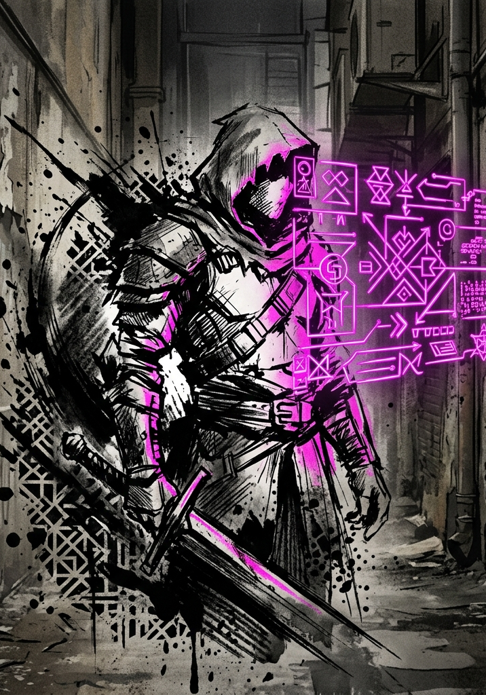

# Character Creation

---

## Attributes (Point Buy)

Distribute **40 points** across the seven core Attributes. Each stat has a **minimum of 3** and a **maximum of 10**.

These numbers represent a freshly integrated human: someone pulled into the System's jurisdiction moments ago. A stat of 3 is a genuine deficiency: frail, oblivious, or painfully awkward. A stat of 10 is the peak of pre-System human potential: the strongest athlete, the sharpest mind, the most magnetic personality. Most stats will land in the 4–8 range.

| Attribute | What It Represents |
|---|---|
| Strength (STR) | Physical power. Governs heavy melee attacks. |
| Dexterity (DEX) | Precision and agility. Governs evasion, finesse melee, ranged attacks. |
| Fortitude (FOR) | Endurance and resilience. Determines Max HP. |
| Heart (HRT) | Resolve and spiritual anchor. Defends against mental and spiritual attacks. |
| Power (POW) | Supernatural output potential. Determines Max Aether. |
| Perception (PER) | Awareness and acuity. Defends against illusions, governs detection. |
| Charisma (CHA) | Force of personality. Governs social pressure and manipulation. |

**Sample Spreads:**

| Archetype | STR | DEX | FOR | HRT | POW | PER | CHA | Total |
|---|---|---|---|---|---|---|---|---|
| Brawler | 10 | 6 | 8 | 4 | 3 | 5 | 4 | 40 |
| Scout | 4 | 9 | 5 | 4 | 3 | 10 | 5 | 40 |
| Aspiring Cultivator | 4 | 5 | 5 | 6 | 10 | 7 | 3 | 40 |
| Natural Leader | 5 | 5 | 5 | 7 | 4 | 5 | 9 | 40 |
| Generalist | 6 | 6 | 6 | 6 | 6 | 5 | 5 | 40 |

These are illustrations, not templates. Players should build what makes sense for the person they are playing. Three finished characters built from these rules, the same three the book's examples follow, are at the end of this chapter.

### What a Score Means

The anchors below calibrate every score in pre-Integration human terms. Even values sit between their neighbors. Scores of 1 and 2 exist below the creation floor: bodies and minds that are failing, and the System integrates them all the same.

| **Attribute** | **3 (deficiency)** | **5 (average)** | **7 (gifted)** | **9 (elite)** | **10 (peak human)** |
|---|---|---|---|---|---|
| STR | Struggles with a full bucket | Carries the groceries in one trip | Moves furniture alone | College shot-putter | World-record deadlifter |
| DEX | Drops what they carry | Catches keys tossed across a room | Amateur gymnast | Circus knife-thrower | Olympic-final gymnast |
| FOR | Winded by one flight of stairs | Works a full shift on their feet | Runs marathons | Channel swimmer | Summits without oxygen |
| HRT | Folds under a raised voice | Holds up in a crisis, shaken after | Steady hands in the ER | Hostage negotiator | Unbreakable under interrogation |
| POW | Never notices the uncanny | Occasional gut feelings | Vivid dreams that sometimes land | The family everyone called witches | The monastery would have taken them |
| PER | Misses the obvious | Notices a moved chair | Spots the tail on the drive home | Identifies birds by wingbeat | Counts the cards and the faces at once |
| CHA | Empties a room slowly | Pleasant company | Closes the sale | Packs a town hall | Starts a movement |

## Proficiencies

Choose **three Proficiencies**, broad domains of competence written in plain language. All three begin at **Trained**: +5 to Clashes and skill checks in the domain, Routine Mastery on Trivial and Easy tasks, and access to whatever the GM has gated behind training. They deepen to Seasoned and then Master through Marks, earned in play. See Core Mechanics, "Proficiencies and Skill Checks," for the full rules.

A Proficiency covers weapons in its domain. A character with "axes and hammers" adds their tier bonus when swinging a hatchet; a character without it adds nothing. Fighting domains are drawn by weapon shape, so picking up something outside your domain costs you the bonus until you have earned the Marks for it.

Proficiencies should reflect the character's life before Integration: what they trained in, what they were good at, what they spent years doing. A soldier might take "blades," "field medicine," and "tactical awareness." A professor might take "ancient languages," "research methodology," and "persuasion." A mechanic might take "mechanical tinkering," "jury-rigging," and "vehicle operation."

**A sample to work from.** Pick from this list or use it as a model. It is deliberately incomplete: players and GMs should invent new Proficiencies together, named in plain language and scoped like these. They are grouped by the kind of work they cover.

**Fighting**

| **Proficiency** | **Covers** |
|---|---|
| blades | Sword, knife, machete. An edge or a point, in one hand or two. |
| axes and hammers | Weight on a handle: battle axe, hatchet, maul, club, crowbar, a length of pipe. |
| spears and staves | Two-handed reach: spear, quarterstaff, polearm, scaffold pole. |
| hand to hand | Fists, grapples, throws, and every martial art. |
| archery and throwing | Bows, crossbows, slings, and anything you let go of. |
| firearms | Pistols, rifles, shotguns, and the System-forged weapons built on the same principle. |
| military tactics | Formations, ground, supply, and reading an enemy's plan. |
| athletics | Climbing, swimming, jumping, lifting, and long pursuit. |
| endurance training | Outlasting cold, thirst, pain, and sleeplessness. |

**Living Outdoors**

| **Proficiency** | **Covers** |
|---|---|
| wilderness survival | Shelter, fire, water, and not dying in weather. |
| tracking and fieldcraft | Following a trail, reading sign, moving without leaving one. |
| foraging and herblore | What is edible, what is medicine, what kills. |
| animal handling | Calming, driving, riding, and reading beasts. |
| navigation | Staying found, by stars, landmarks, or instruments. |

**People**

| **Proficiency** | **Covers** |
|---|---|
| persuasion | Argument, appeal, and finding what someone actually wants. |
| intimidation | Making a threat land without having to carry it out. |
| deception | Lies, disguise, false papers, and keeping a story straight. |
| performance | Music, oratory, theatre, and holding a room. |
| leadership | Getting frightened people to act together. |
| teaching | Making someone else able to do what you can do. |
| streetwise | Black markets, gangs, rumor, and who to ask. |

**Knowledge**

| **Proficiency** | **Covers** |
|---|---|
| research methodology | Finding the answer in a library, an archive, or a ruin. |
| ancient languages | Dead scripts, inscriptions, and their conventions. |
| field medicine | Wounds, poisons, fevers, and stabilizing the dying. |
| chemistry | Reactions, compounds, solvents, and explosives. |
| logistics and accounting | Ledgers, supply lines, and where the money went. |

**Making and Breaking**

| **Proficiency** | **Covers** |
|---|---|
| mechanical tinkering | Machines with moving parts: repair, modification, sabotage. |
| jury-rigging | Making a thing work with the wrong materials, briefly. |
| electronics | Circuits, sensors, and salvaged equipment. |
| construction | Building, shoring, demolition, and judging what will hold. |
| vehicle operation | Driving, piloting, and controlling a vehicle under stress. |
| lockpicking and security | Locks, alarms, safes, and the habits of the people who set them. |
| stealth and infiltration | Moving unseen and being somewhere you should not be. |
| sleight of hand | Palming, planting, lifting, and misdirection. |

## Derived Stats

Calculate and record these values:

- **Max HP:** Raw FOR × 2.
- **Max Aether:** Equal to your Raw POW value.
- **VE Tolerance:** 80. Every F-Grade character holds the same.
- **VE Stored:** 0.
- **Level:** 1.
- **Grade:** F.

At Level 1, HP is in the single to low double digits and Aether is single digits. Freshly integrated characters are fragile, and early encounters should feel dangerous. Growth comes fast.

Aether matters to every character, caster or brawler: anyone can spend half their Maximum Aether to Surge (see Core Mechanics, "Surge"). Nearly every character will also end up walking the Principle track, whatever they built, because Insight comes from surviving hard things rather than from any choice made here.

## Starting Equipment

Starting gear is campaign-dependent. The GM determines what characters have access to based on the scenario. For the standard Integration Protocol opening, characters begin with whatever they had on their person at the moment of Integration (everyday clothing, a phone, maybe a pocket knife). The System provides nothing.

## Starting Principle Access

Freshly integrated characters begin with no Principle access. Insight toward a Principle, and every tier beyond it, is earned through play by accumulating Insight Points. Nothing on this track is selected at creation. See the Principles document for the full progression.

---

## After Creation

A finished character is Level 1, Grade F, with no class, no Principle access, and whatever was in their pockets. Everything from here is earned in play: levels and stat growth are covered in the Progression chapter, the VE economy that fuels them in Cultivation, and the class milestone at Level 10 in Progression, "Class Selection."

---

## Ready-Made Characters

Three finished characters, built with this chapter's rules and nothing else: 40 points, three Proficiencies at Trained, derived stats computed, Saturation bands (Cultivation, "The Pressure Gauge") already worked out. Hand one across the table and play. They are also the book's recurring cast: Kara and Andre are the pair in the Introduction's example of play, and Joe is the hunter who opens Cultivation. None of them has a Principle, a title, or anything in their pockets beyond what survived Integration.

::: statblock
**KARA** &middot; Level 1 &middot; Grade F

*Warehouse shift lead. First through the door, and first to ask what it pays.*

| STR | DEX | FOR | HRT | POW | PER | CHA |
|:-:|:-:|:-:|:-:|:-:|:-:|:-:|
| 8 | 5 | 7 | 4 | 6 | 5 | 5 |

- **Max HP** 14 &middot; **Max Aether** 6 &middot; **VE Tolerance** 80 (Mild past 80, Heavy past 160, Critical past 240)
- **Proficiencies (Trained, +5):** axes and hammers, athletics, streetwise
- **Playing her:** Fight close and end it fast. Want things out loud: the better weapon, the bigger bounty, the pill nobody else has claimed. Her generosity is real, and it is never first.
:::

::: statblock
**JOE** &middot; Level 1 &middot; Grade F

*Volunteer firefighter. Hits hard so nobody else has to.*

| STR | DEX | FOR | HRT | POW | PER | CHA |
|:-:|:-:|:-:|:-:|:-:|:-:|:-:|
| 8 | 5 | 7 | 5 | 4 | 6 | 5 |

- **Max HP** 14 &middot; **Max Aether** 4 &middot; **VE Tolerance** 80 (Mild past 80, Heavy past 160, Critical past 240)
- **Proficiencies (Trained, +5):** axes and hammers, endurance training, field medicine
- **Playing him:** Stand between the danger and everyone else, and swing like the door needs breaking. He will take a bad trade if somebody weaker comes out ahead on it.
:::

::: statblock
**ANDRE** &middot; Level 1 &middot; Grade F

*Land surveyor. Looks first, counts everything, and knows where the exits are.*

| STR | DEX | FOR | HRT | POW | PER | CHA |
|:-:|:-:|:-:|:-:|:-:|:-:|:-:|
| 4 | 7 | 5 | 6 | 5 | 9 | 4 |

- **Max HP** 10 &middot; **Max Aether** 5 &middot; **VE Tolerance** 80 (Mild past 80, Heavy past 160, Critical past 240)
- **Proficiencies (Trained, +5):** tracking and fieldcraft, archery and throwing, navigation
- **Playing him:** Look before anyone moves, plan the way out before the way in, and take only what the plan needs. When the party gets loud, he is the one counting.
:::
