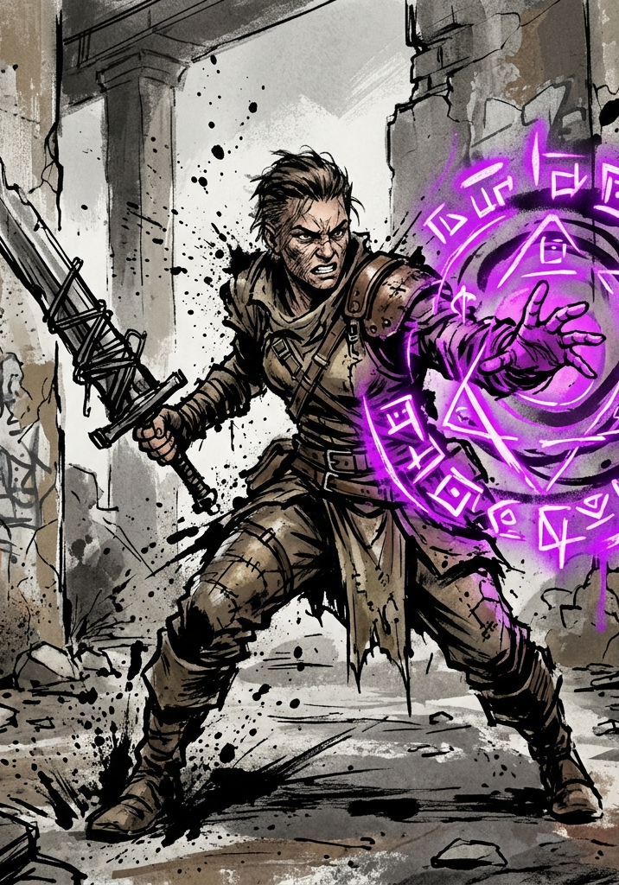

# Progression

Characters grow on a single loop: fight, quest, and survive to accumulate Volatile Energy (VE); rest to refine it through Consolidation; level when the refined total crosses the threshold. This chapter covers what happens at each level, and at the Level 10 milestone where a class arrives. The VE economy itself (how much a kill is worth, how fast Consolidation processes, what happens when you hold too much) lives in the Cultivation chapter.

## Earning Levels

Every kill, completed quest, survived ordeal, and absorbed treasure adds VE to the character's stored pool. Stored VE does nothing on its own; it must be processed during a **Consolidation** rest. When a character's processed VE reaches the cost of the next level (Cultivation, "Leveling: The Cost of a Level"), they level up on the spot, mid-rest. Levels arrive only at Consolidation: a character can end a battle carrying three levels' worth of unprocessed VE and still be the level they woke up as until they sit down and refine it.

Levels are numbered continuously across Grades: each Grade spans 25 of them, so Levels 1–25 are F-Grade, 26–50 are E-Grade, and so on. Level thresholds grow on an exponential curve, and VE awards grow on the same curve, so the pace of leveling holds steady across a Grade. At the cap, leveling stops; only a Grade Breakthrough (its own chapter) opens the next span.

## Leveling Up

Each level grants **5 stat points** at F-Grade:

- **3 points assigned by the System.** Before a character has a class (Levels 2–9), the GM assigns these based on how the character has actually been behaving, using the Behavioral Stat Mapping table below. From Level 10 onward, the class's stat profile assigns them instead.
- **2 points assigned freely by the player.** The character applies these themselves, through the System interface, to whatever they choose.

**Points can wait.** Freshly earned points arrive **unallocated** and sit there until the character spends them. A player who wants to see what the next fight demands before committing may hold them for as long as they like; the System does not press. Unallocated points do nothing while they wait, so holding them is a real cost paid for a real option.

**Capped stats.** A stat at the Grade maximum (99 at F-Grade) takes no further allocation: the player sends free points elsewhere, and the System assigns its points to the next-best behavioral match, never into a full stat. A dedicated build reaches its favorite stat's cap around Level 20, and the redirection over the last stretch of the Grade is expected; a body headed for Breakthrough ends up broader than the obsession that built it. Bonuses that arrive on their own, from titles or treasures, still overflow against a capped stat and are lost.

At higher Grades, the budget scales with Grade magnitude (×10 at E, ×100 at D, and so on), with the same 3-to-2 split.

## Behavioral Stat Mapping (GM Reference)

At each level-up during the pre-class window, review what the character has done since the last level and assign the 3 System points to the stats that best match their behavior. Use the table as a guide rather than a rigid formula.

| Behavior Pattern | Primary Stat | Secondary Stat |
|---|---|---|
| Solves problems with direct force, charges in | STR | FOR |
| Plans ahead, positions carefully, uses finesse | DEX | PER |
| Pursues power aggressively, takes risks for gain | POW | STR |
| Shows restraint, endures hardship, holds the line | FOR | HRT |
| Dominates socially, intimidates, commands | CHA | STR |
| Cooperates, negotiates, builds alliances | CHA | HRT |
| Imposes structure, creates systems, controls variables | PER | POW |
| Breaks rules, improvises, embraces chaos | DEX | POW |

**How to read the table:** If a character spent the last level charging into fights and solving problems through brute force, the GM puts 2 points into STR and 1 into FOR (or all 3 into STR if the behavior was extreme and unambiguous). A character who planned every engagement and used terrain might get 2 PER and 1 DEX. Mixed behavior? Split accordingly; 1 STR, 1 PER, 1 CHA is a perfectly valid assignment for a character who fought, planned, and negotiated in equal measure.

The GM's rule: **reward what the character actually did rather than what the player says they want.** This is the Hidden Vector Engine's primary mechanical lever during F-Grade.

## What Nine Levels Produce

By Level 9, a character has accumulated:

| Source | Points |
|---|---|
| Point buy (creation) | 40 |
| System-assigned (3 × 8 levels) | 24 |
| Free allocation (2 × 8 levels) | 16 |
| **Total at Level 9** | **80** |

A character who acted consistently toward one behavioral archetype will have a clear stat skew heading into class selection. A character who played eclectically will be more balanced. Both paths are valid, but the class options offered at Level 10 will differ dramatically between them.

## Class Selection (Level 10)

At Level 10, the System AI generates class options based on the character's Hidden Vector Engine profile, the cumulative record of their behavior across Levels 1–9. Three options is the default; some characters draw more. The class generation framework is still in development and will appear in a later revision of this book. The mechanical effect at this milestone is:

1. The player selects one of the offered classes.
2. The character receives a **one-time bonus allocation of 5–10 stat points**, distributed according to the class's stat profile. These are not player-assigned; they represent the System attuning the character's body and spirit to their new role.
3. From Level 10 onward, per-level stat allocation shifts to the class model: **3 points allocated by class profile** (fixed, determined by the class's stat priorities) **+ 2 points free** for the player. The GM no longer assigns the fixed portion. The class does.

The pre-class observation period is over. The Hidden Vector Engine continues tracking behavior for future class evolutions, Principle forging, and world response, but the stat allocation lever now belongs to the class.

## Beyond Level 25

Level 25 is the F-Grade cap. VE keeps accumulating, stats keep growing from treasures and titles up to the Grade's stat cap, but no further levels arrive. The way forward is a **Grade Breakthrough**: a deliberate, dangerous ritual with its own chapter. When it succeeds, leveling resumes at Level 26 at the E-Grade cost per level, and the stat cap rises to the new Grade's maximum; the F→E Breakthrough also unlocks the second Principle slot (see The Principle System).
