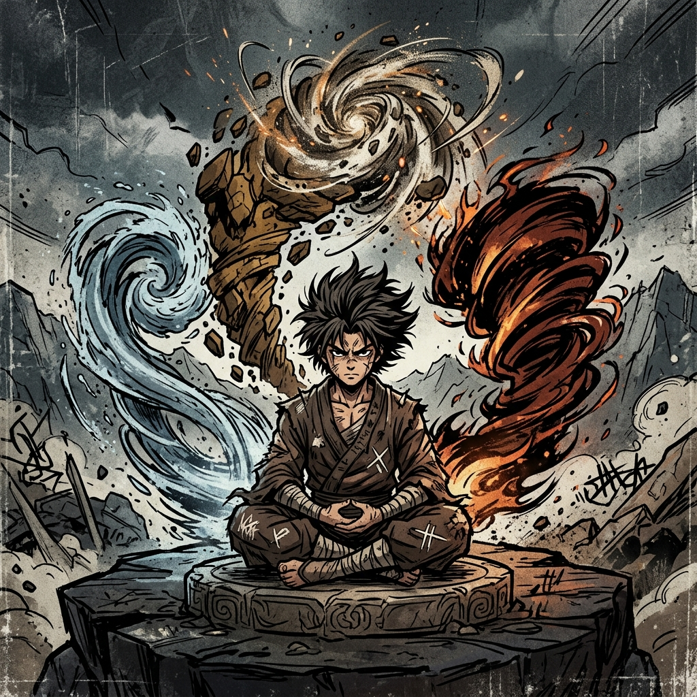
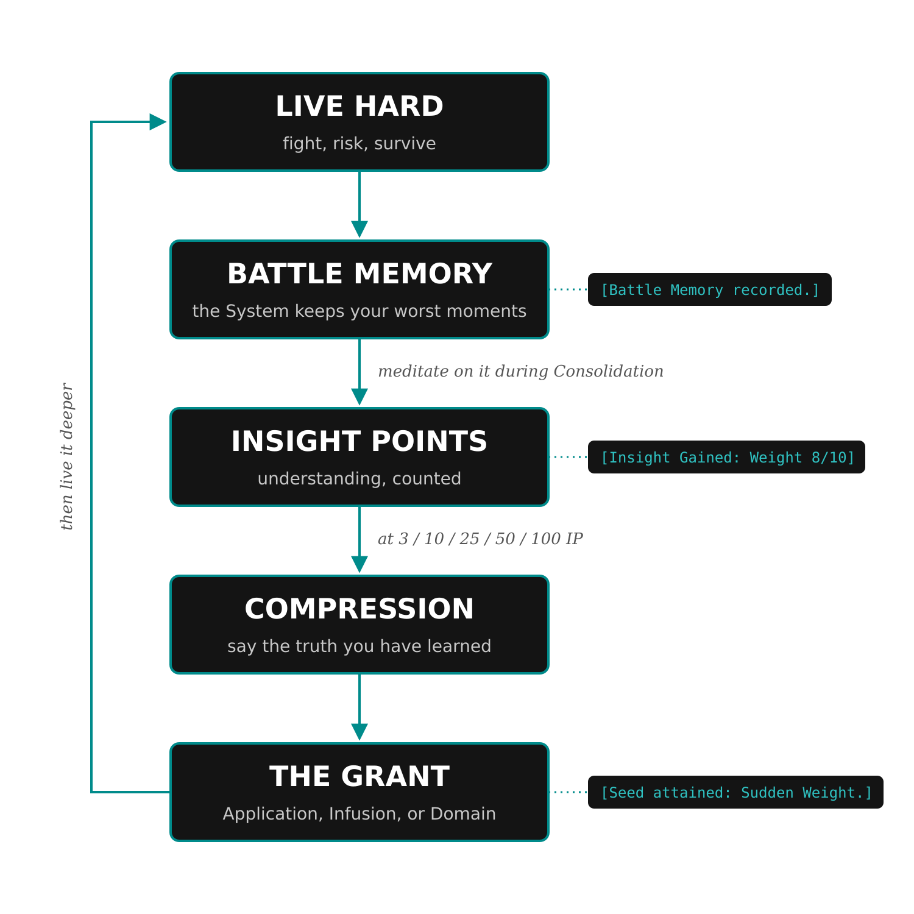

# The Principle System

## How the Track Works

During play, your character survives dangerous situations and starts noticing patterns in how reality behaves. The System remembers those moments. When the character meditates on them during rest, understanding accumulates as points. Collect enough points, say what your character has learned, and the System turns that understanding into power.

This chapter runs on five terms:

| **Term** | **Meaning** |
|---|---|
| Principle | The conceptual truth your character is learning: Weight, Fire, Edge. |
| Insight Points (IP) | Accumulated understanding. A visible number. |
| Battle Memory | An extreme moment the System kept. Meditating on it earns IP. |
| Distillation | The act that turns enough IP into an advancement: say the truth, receive its expression. |
| Application | An active technique granted by a Principle. |

Everything else in the chapter is detail hanging off this loop:

The loop below runs on one example, a brawler named Kara whose Principle turns out to be **Weight**. Her story follows in full.

{width=88%}

Principles advance on their own track. Levels and Grades measure how much power the System has integrated into your body; the Principle track measures how much of reality you understand. The two feed on the same dangerous life, so they usually rise together, but nothing forces them to. Grade matters to this track only once: a Domain needs a D-Grade body. Everything below it advances at any Grade.

A Principle does not raise stats. What it grants, tier by tier, is capability: active techniques, resistances and affinities, and eventually a Domain, a zone where its truth is briefly law.

## Kara's Story

The whole track, from first resonance to first power, looks like this at the table.

**The System watches.** Kara is an F-Grade brawler. From her first session she fights heavy and direct: she charges, she grabs, she ends fights by putting people on the ground. The GM logs this behavior (the Hidden Vector Engine chapter). After an early Battle Memory earns her first 2 IP, the System reports a direction and nothing more:

::: systemvoice
*Resonance accruing: IMPACT. 2/3.*
:::

**The moment.** In a collapsing mine, Kara catches a falling slab and holds it while her partner drags himself clear. The GM hands her a **Battle Memory Card**: the System kept that moment.

**The meditation.** At the party's next Consolidation, the GM turns to her:

**GM:** You're cycling, and the slab comes back. The full weight of it, on you again. What do you notice this time that you didn't in the moment?

**Kara:** I don't know. I keep thinking about how I couldn't have held it. It was way too heavy.

**GM:** And yet your partner is alive. What did you actually do, if you didn't hold it?

**Kara:** I guess... it was coming down no matter what. I just made it come down somewhere else. Not on him.

**GM:** The memory holds still, like something is listening. Say that again, plainer.

**Kara:** You can't stop a heavy thing. But maybe you can pick where it lands.

::: systemvoice
*A mountain hangs from a thread. The thread does not strain. Below, something waits to be told where to fall.*

**[Initial Insight: Weight.]**

**[Insight: Weight 4/10]**
:::

The meditation earned 2 IP. That carried her past 3, and the Principle **crystallized**: the System named what her life had been spelling out, and the name filled her single F-Grade slot for life.

> **Kara's sheet now.** Principle: Weight. Insight: 4/10. Tier: Initial Insight. Benefit: a minor passive (the System grants her +5 to defensive Clashes against crushing force). Next: her first Application at 10 IP.

**The climb to 10.** A second Battle Memory (3 IP) and a Consolidation vision (1 IP) bring her to 8. Two sessions later a third Battle Memory (2 IP) carries her to 10. The number sits there; nothing happens on its own.

**Distillation.** At her next Consolidation, Kara declares Distillation. The GM asks what pattern she has discovered. She answers from the fights and the slab: "Things fall the way I decide." The System grants her Seed Application, **Sudden Weight** (1 Beat, 10 Aether): her strike lands with the mass of something far larger, +10 to the Clash, and at F-Grade scale it can stagger a grown man, buckle a door, crack floorboards. She is Level 6 with POW 18; the 10-Aether cost is heavy but castable, exactly once per fight with room to spare.

> **Kara's sheet now.** Principle: Weight. Insight: 10/10 spent into Seed. Tier: Seed. Benefits: the passive, the Application Sudden Weight, and Attunements (she can feel loads and balance points at a glance; see "Attunements"). Next: a second Application at 25 IP.

The rest of this chapter is the rules Kara just walked through, in the order she met them.

## Earning Insight

### Battle Memories

**Battle Memories** are the primary pipeline from play to insight. In moments of extreme stress (surviving at near-zero HP, witnessing something beyond comprehension, achieving an outcome the System deems statistically improbable), the GM grants a **Battle Memory Card**. Two triggers are automatic: a Volatility cascade of two or more extra dice on a player character's roll, and surviving being Downed (see Core Mechanics, "Downed and Death").

During the next Consolidation, the player describes how their character meditates on the memory: what they felt, what they noticed, what pattern they think they glimpsed. A sentence is enough. The GM should ask one or two questions, the way Kara's GM did, and let the table sit with the answer. The System returns a cryptic vision and awards IP toward the Principle the memory most closely expresses (before crystallization, toward the family), 1 to 3 by the memory's intensity. The vision procedure for every run mode is in The System AI chapter; the unplugged version is three images composed by the GM.

A vision hints and never teaches. If it taught plainly, the player's later Distillation would be dictation instead of understanding, and understanding is the thing being tested. If the player decodes a vision correctly, the payoff arrives in play, later.

### Insight Points

Progression within a Principle is measured in **Insight Points (IP)**. IP totals are visible; the System reports them the way it reports levels:

::: systemvoice
**[Insight Gained: Weight 8/10]**
*The mountain does not strike. It arrives.*
:::

The character sees the number. What the System is forging from the number, it keeps to itself.

**Earning IP.** IP accrues only from experiences aligned with the Principle (before crystallization, with its family), and nearly all of it is earned under pressure. A character cannot grind generic experience into Sharpness insight: they must cut, be cut, study cutting, survive the edge.

<!-- rules:table ip-sources -->
| **Source** | **IP Awarded** |
|---|---|
| Battle Memory meditation | 1–3, by the memory's intensity |
| Consuming an affinity treasure | 1–2 |
| Consolidation vision | 1 |
| Surviving a life-or-death situation through the Principle | 2 |
| Any other Principle-aligned experience, GM's call | 1–3 |
<!-- /rules:table -->

**Consolidation visions are rationed.** A vision arrives only at a Consolidation that follows meaningful Principle-aligned experience, and never more than once per session. Rest alone produces nothing to see.

**A safe career earns nothing here.** Levels come from Volatile Energy, and VE comes from any kill; a cautious hunter who never takes a real risk still levels. The Principle track pays differently. No stress means no Battle Memories; no danger means no life-or-death insight. A season of careful hunting banks levels and not one point of Insight, while a single desperate hour can be worth a tier.

::: lore
Slower roads exist. The System honors comprehension however it arrives, and the Multiverse holds contemplatives who walked far up the ladder without drawing blood: monks who sat with Weight for sixty years until the mountain moved for them. Integration-era subjects rarely have sixty years. Pressure is the shortcut the System offers instead.
:::

## Your First Principle

No character chooses a Principle from a menu. The System watches what the character actually does and presents the truth their life has been spelling out. The procedure:

1. **The System watches.** From the first session, the GM logs how the character behaves under pressure (the Hidden Vector Engine chapter). Every behavior pattern points at a family of Principles. There are eight families, and this is the complete set: Impact, Architecture, Consumption, Preservation, Imposition, Harmony, Governance, and Subversion. The behavior-to-family map is in that chapter.
**Name the person, not the concept.** A family is read off behavior, so classify the character and let the Principle follow. Fire earned by someone who charges every line is Impact; Fire earned by someone who takes everything and leaves ash is Consumption. The two families that most often blur are **Architecture and Governance**: Architecture is how a character solves problems, and Governance is what they impose on the world. A meticulous planner is Architecture. Someone who writes rules other people must live by is Governance.

2. **Resonance accrues.** When the character begins earning IP, the System reports it at the family level only: *[Resonance accruing: IMPACT. 2/3.]* The character knows a direction and nothing more.
3. **At 3 IP, the Principle crystallizes.** The GM names one specific Principle, and the System announces it: *[Initial Insight: Weight.]* The slot fills for life, and the tier's minor passive arrives.
4. **The player steers by playing.** What the character does is what the System reads. How the player describes their meditations shapes which Principle a memory feeds. And if the System's read drifts from the person over time, Refinement (below) steers the Principle back.

**The second Principle.** The slot that opens at E-Grade fills the same way, with one difference: a veteran character can pursue a direction on purpose. The player may declare what they are seeking and spend attention and risk on aligned experiences. The System still does the naming, and it names what was actually lived, which may sit a step away from what was sought.

**Pursuing the second slot has a real cost.** IP comes from attention and risk, and both are finite: every desperate hour spent feeding a new Principle is one not deepening the first. A character chasing a second Principle slows their climb through the Fragment tiers, and two shallow Principles lose to one deep one in almost every fight that matters. The strong reason to fill the slot is a lived pattern the first Principle genuinely cannot hold, and a character who never fills it is not behind.

## Slots and the Ladder

### Principle Slots

A character holds **one Principle** at F-Grade. Breaking through to E-Grade unlocks a **second slot**. Two is the lifetime maximum.

A slot, once filled, holds its Principle for life. The Principle can change shape (Refinement), widen (Broadening), or merge with the other (Fusion); it never simply drops away. The only way a slot opens again is Fusion: two Principles become one, and the freed slot may later take a new Principle, which enters at the bottom like any other.

### The Progression Ladder

<!-- rules:table principle-ladder -->
| **Tier** | **Cumulative IP** | **Grants** |
|---|---|---|
| Initial Insight | 3 | The Principle crystallizes and is named; minor passive (e.g., +5 to defensive Clashes against fire) |
| Seed | 10 | First Application; Attunements |
| Early Fragment | 25 | Second Application; passive doubles |
| Mid Fragment | 50 | Infusion: the Principle rides your ordinary actions at no Beat or Aether cost |
| Peak Fragment | 100 | Domain: a zone where your Principle is briefly law |
<!-- /rules:table -->

**The Domain gate.** A Domain requires a **D-Grade body**. The insight can be complete at any Grade: a character may hold 100 IP and a fully formed Peak Fragment understanding while still E-Grade. The body is the limit; holding open a zone of law takes a frame rebuilt twice by Breakthrough. IP accrues normally past 100, and the Domain Distillation waits for D-Grade.

**What the economy delivers in practice.** With IP gated behind pressure, a character who lives dangerously reaches Seed midway through F-Grade, works through the Fragment tiers across E-Grade and into D, and Distills a Domain at D-Grade. Nothing enforces that schedule; it bends toward the life lived. A cautious character reaches Seed late or never. A character the System keeps nearly killing runs ahead of it.

**The ladder does not end at Domain.** Tiers beyond Peak Fragment exist at C-Grade and above, where a Principle stops being something a person holds and becomes something the world has to account for. They are outside the range this book covers, and a later volume will carry them.

### The Axioms

The eight families describe how a person behaves, so every Principle they produce is ultimately about the character who earned it. Some truths are not about anybody.

**Time. Void. Luck. Truth. Distance.** These are **Axioms**: Principles that belong to reality rather than to temperament, and no amount of behavior points at one. A character who fights like an avalanche resonates with Impact and will never resonate with Time, however long they fight.

Axioms are not earned from a pattern of living. They are earned from **exposure**: standing for a long while in a place where the thing is loose and wrong, and coming back out still able to think about it. A valley where an hour is not an hour. A hollow that objects fall into and do not arrive. A shrine whose answers are always true and never useful. The System does not offer an Axiom because it read the character; it offers one because the character was there and survived.

At the Grades this book covers, an Axiom is a rumor. Very occasionally a GM will want one as the strangest thing a campaign ever finds, and the rules for holding one are the ordinary ones: a slot, the IP ladder, Distillation. Everything else about them, including what they do at the tiers where they matter, belongs to the later material with the higher rungs.

For an F-Grade table the practical point is smaller: **when the eight families do not seem to fit a Principle a player wants, check whether they are reaching for an Axiom.** Usually they are reaching for a concept rather than a family, and the answer is that families come from behavior. Two characters can both end up holding Fire, one through Impact and one through Consumption, and the same word will mean different things on their sheets.

## Distillation

Meeting an IP threshold does not advance the tier. Advancement requires **Distillation**, a declared act during Consolidation. The procedure:

1. **Declare.** During any Consolidation with a threshold met, the player declares Distillation.
2. **The question.** The GM asks: *"What pattern have you discovered in how you act, or in how the world behaves?"*
3. **The answer.** The player answers from their character's lived experience: the fights, the Battle Memories, the moments that produced this IP.
4. **Refine together.** The GM works the answer with the player until it is specific enough to grant power (the GM section below has the test). This is a table conversation, and the GM carries as much of it as the player needs. A halting answer and a fluent one end in the same place: what is being compressed is the character's lived pattern, and the player's delivery has no effect on the result.
5. **The grant.** The System expresses the new tier: the Application, Infusion, or Domain, shaped by the articulation.

Distillation and Battle Memory meditation both happen during Consolidation and both involve talking about what the character has learned, so keep their shapes distinct at the table. A Battle Memory meditation is small and exploratory. A Distillation is rare and declarative.

| | **Battle Memory** | **Distillation** |
|---|---|---|
| Happens when | After an extraordinary event | After reaching an IP threshold |
| Looks back at | One experience | Your whole history with the Principle |
| The question | "What did you notice?" | "What truth have you learned?" |
| Gives | Insight Points | A new tier and its grant |

## Changing an Existing Principle

Three different changes can happen to a Principle a character already holds. They answer three different questions.

**Refinement changes the identity.** At any Distillation, the articulation can steer the Principle at its current tier instead of climbing. A character whose Fire has grown hungrier with every fight may Distill Fire into **Consuming Flame**: same slot, same tier, same IP, shifted identity. The System adjusts the Principle's Applications and Attunements to match the new reading. Refinement grants no new tier; what it buys is a Principle that keeps up with who its holder is becoming, which the Hidden Vector Engine is tracking either way.

**Broadening changes the scope.** At a tier-up, the re-articulation sometimes outgrows the Principle's name, and the System recognizes the larger truth. Weight, articulated again at Fragment depth ("everything falls toward something, and I choose the direction"), can become **Gravity**; Gravity, lifetimes deeper, might become **Dominion**. Broadening is a possibility inside a tier-up Distillation, never a separate procedure and never owed: most tier-ups deepen the Principle under its own name. Existing Applications keep their names, costs, and scales; the new tier's grant takes the broadened identity.

**New Principles enter at the bottom.** Mastery is per-Principle and never transfers. Whether the second slot opens at E-Grade or Fusion frees a slot late in a career, a new Principle starts at 0 IP and climbs to Initial Insight and Seed like any novice's. Its IP must come from experiences aligned to the *new* Principle: attention and risk spent there instead of deepening what the character already holds. Its Applications are priced by tier like everyone else's (below).

## Applications: Cost and Scale

Every Application is an active technique costing 1 Beat plus Aether. Two numbers describe it: what it costs, and its **scale**, how much world the manifestation can touch.

**Cost is set by the tier that granted it, and never changes.**

<!-- rules:table application-costs -->
| **Granted at** | **Aether Cost** |
|---|---|
| Seed | 10 |
| Early Fragment | 15 |
| Infusion (Mid Fragment) | none |
| Domain (Peak Fragment) | 3,000 + 500 per round held |
<!-- /rules:table -->

That is the whole price list. It does not read off the character's Grade, so a prodigy who reaches Early Fragment while still F-Grade pays 15 like everyone else, and a Seed Application earned in the first month costs 10 for the rest of a life. A Domain sits at D-Grade pricing because a D-Grade body is required to form one at all.

**Scale follows the body.** An Application's reach grows with the character's current Grade, without re-earning or re-paying for it. The understanding was always the same; what changes is how much of it a body can push into the world.

**Searing Strike** (the Seed Application of a Fire Principle) costs 10 Aether forever, and grants around +10 to the Clash forever, because table modifiers never inflate. What changes is what happens:

- **Carried by an F-Grade body:** the flame wraps the weapon's edge, ignites cloth and dry wood, and leaves scorch lines on flesh.
- **Carried by an E-Grade body:** the flame runs white and dense. It chars through leather, ruins the temper of a parried blade, and the wounds it leaves cauterize shut, still smoking.
- **Carried by a D-Grade body:** the strike arrives as a sheet of fire with an edge in it. It passes through a steel door as through bread, and the Zone smells of ozone for hours.

Scale is fictional permission. When a use collides with the world (can it burn this? can that survive it?), the GM reads the character's Grade against the obstacle's Grade the same way any Cross-Grade question resolves.

**Principles and Spells:** A character's Principle passives always apply to matching spells automatically. Using an active Application alongside a spell requires Infusion tier. Below that, choose one per Beat: cast the spell or use the Application.

## Attunements

From Seed tier, a Principle grants **Attunements**: capabilities that need no roll, Beat, or Aether. Baseline for every Principle:

- You **sense** the Principle's presence and behavior nearby (flame, edges, spatial distortion).
- **Mundane interactions** with the Principle stop requiring rolls (lighting a fire, splitting kindling clean, judging a distance exactly).
- You are **comfortable in environments** the Principle dominates (extreme heat, knife-storms of debris, warped space).

Specific Attunements beyond the baseline are generated by the GM and System AI to fit the Principle, and they deepen as tiers rise. Attunements are fictional capability rather than combat mechanics: if a use would demand a Clash roll, it is an Application.

## Principle Fusion

A character holding **two Principles at Seed tier or higher** may attempt to fuse them during a Distillation. With two slots for life, this is the largest commitment the track offers: both identities go in, one comes out.

Fusion is a Resistance Roll:

> **d100 + HRT Force vs. Severe (140) of the character's Grade**

- **Success:** the two Principles merge into a single fused Principle (Earth + Fire become **Magma**, Edge + Flow become **Severance**) at the **lower parent's tier**, occupying **one slot**. The System generates its Applications from both parent identities. The freed slot is empty and may later take a new Principle, entering at the bottom like any other.
- **Failure:** the patterns refuse unification. The higher-tier parent loses 10 IP, and the fusion cannot be reattempted until after the character's next Breakthrough.

## The Quiet Path

Some players don't enjoy trying to wax philosophical at the RPG table. They came to roll dice, level up, and collect powers, and being asked to articulate a truth about reality in front of four friends is the opposite of fun for them. That's fine, and it costs them nothing: the System reads what a character does, never how well their player talks. Run the track for these players as follows:

- **Battle Memories:** the player says one sentence about the memory, or just "he sits with it." You narrate the meditation and the vision. Award IP by the event's intensity, which was always the rule.
- **Distillation:** instead of asking the player to state the pattern, offer it to them. Build an articulation from the character's logged behavior (or take one from the System AI in assisted modes) and present it: "Here's what the System saw. Sound right?" The player accepts it, picks between two phrasings you offer, or vetoes it and Distills at a later Consolidation. Same grant, same tier, no discount.
- **Steering:** behavior remains the steering wheel. A Quiet Path character shapes their Principle by how they fight, spend, and choose, which is the primary channel for everyone anyway.

Don't press a Quiet Path player for speeches. Offer either/or questions ("was it the stopping or the choosing?"), accept a shrug as an answer, and put the poetry in the System's mouth instead of demanding it from theirs. And don't treat the mode as a lesser way to play or a phase to coax them out of; a player who grunts "Weight stuff, I guess" and then spends every fight putting heavy things on top of enemies is feeding the track everything it needs.

## Running the Track (GM Reference)

**Naming a Principle.** Use three inputs: the family, the character's circled Defining moments, and the words the player has used while meditating. If you are unsure, say the character's three biggest moments out loud and ask what they have in common; name that. Pick the plainer word: Weight beats Gravitational Inevitability, and Fire beats Combustion. A good name is one the player hears and instantly recognizes as theirs.

**The Distillation test.** A valid articulation is **Operational** (it does something specific), **Bounded** (it does not apply everywhere), and **Testable** (its use produces observable outcomes). If a proposed truth cannot meet all three, it is a mood, and the System does not compress moods. "Fury" is a mood: it does nothing specific and applies anywhere the character is angry. "Fire consumes and spreads" is a Principle. Work the player's answer toward the three properties collaboratively; the test is a filter for the final wording, never a grade on the player's delivery.

**Families and the Hidden Vector Engine.** The eight families (Impact, Architecture, Consumption, Preservation, Imposition, Harmony, Governance, Subversion) map to the four behavioral axes; the map and the per-axis Principle affinities are in the Hidden Vector Engine chapter. What a character does under pressure determines which Principle crystallizes, which Battle Memories resonate, and what a Distillation articulation can honestly claim.

**Pricing.** Application bonuses live inside the Modifier Budget (Core Mechanics): +5 minor, +10 standard, +15 to +20 peak and rare. Attunements are fictional capability; anything that would demand a Clash roll is an Application and gets priced.

**Each run mode.** Everything on this track that says "the System returns" or "the System generates" has a manual answer.

- **Unplugged:** the GM composes Battle Memory visions from the three-image procedure in The System AI chapter, applies the Distillation test by hand, and invents Attunements and Application effects priced against the Modifier Budget.
- **AI-Assisted:** between sessions, paste the standing campaign context and the relevant function prompt (The System AI chapter) and treat the output as a draft. Visions tolerate a week's delay; Distillation happens live at the table, so run it as the Unplugged procedure and let the AI polish the resulting Application afterward.
- **Companion App:** the app drafts visions and Applications from the session transcript; the GM reviews before anything reaches a player.

## Design Intent

Principles are discovered in play rather than chosen from a list, because the discovery *is* the behavioral signal. Slots are scarce and entry is always at the bottom so that a character's one or two Principles, their Refinements, and the Fusion that may one day join them read as the mechanical transcript of who that character has been. The track runs beside the level track rather than inside it: the System integrates power on its own schedule, and hands out understanding only when it has been lived.

## The System and Principles

::: lore
The System exists to discover and refine stable patterns of reality that cannot be derived directly. Reality is not fixed: zones shift, laws degrade, unknown conditions emerge faster than any static model can solve. So the System introduces conscious agents into constrained environments and observes: conflict reveals limits, scarcity reveals priorities, uncertainty reveals models, pressure reveals identity.

Patterns that succeed across contexts are compressed, formalized, and made reusable. That is a Principle, and that is why the System pressures its holders: dominant strategies are challenged, over-reliance is punished, and no single approach remains optimal forever. The System does not ask "Did you win?" It asks "How do you win, and what does that reveal?"

Power is not granted. It is recognized, distilled, and returned to those who discovered it.
:::
