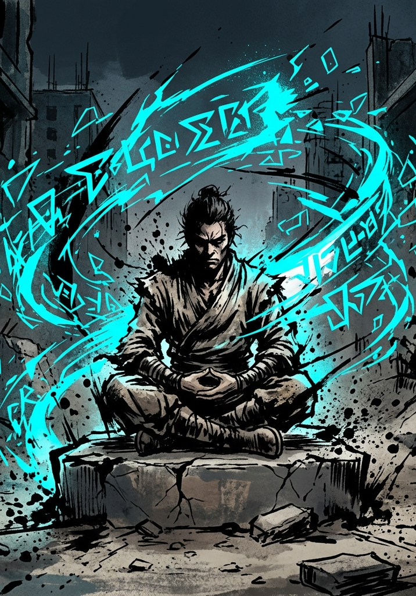

# Cultivation

---

## Volatile Energy & Consolidation

Characters do not gain traditional "Experience Points." They accumulate **Volatile Energy (VE)** from kills, consumables, and environmental sources: Aether that still carries the shape of whatever held it last, potent and unusable until it is broken down (Core Mechanics, "Aether"). VE is fuel. Refining it through structured rest is what turns it into permanent growth. The whole chapter is one loop:

**Earn VE → watch your gauge → decide to push or rest → Consolidate → level up.**

Joe has FOR 7 and HRT 5, so his VE Tolerance is 60. A morning of hunting earns him 35 VE; he is fine. Then the party finds the den, and Joe decides to risk it: two more fights push him to 70 VE, past his Tolerance, and now Joe feels uncomfortably full of energy: his skin prickles, his hands won't stay still, and everything is a little harder than it should be (Saturation, below: −10 to everything until he processes it). The party makes camp and Joe Consolidates. An hour in, his Aether is back. By the sixth hour the whole load is refined: his wounds are closed, the too-full feeling is gone, and all 70 VE is permanent progress toward his next level.

### The Pressure Gauge

Every character has a **VE Tolerance** representing the raw energy their body and spirit can hold before refinement:

> **VE Tolerance = (Raw FOR + Raw HRT) / 2 × 10**

Body and will together: the frame contains the charge and the Heart refuses to let go of it. Heart is the stat that decides how long a character can keep hunting between rests, which makes it the most-consulted number in this chapter.

Joe, with FOR 7 and HRT 5, holds 60.

VE accumulates automatically after combat and from other sources. As long as stored VE remains below Tolerance, there is no penalty. Once VE exceeds Tolerance, the character enters **Saturation:**

- **Mild Saturation (up to twice Tolerance):** −10 to all rolls.
- **Heavy Saturation (up to three times Tolerance):** −25 to all rolls.
- **Critical Saturation (past three times Tolerance):** Heavy Saturation penalties continue, and the body starts fighting to vent. At the end of each full hour spent at Critical, roll d100: the character collapses on a result of 25 or less. The threshold rises by 25 each hour (50 the second hour, 75 the third), and in the fourth hour the collapse is automatic. A collapsed character drops into involuntary Consolidation on the spot: defenseless, processing at the normal rate, unwakeable until stored VE falls below Tolerance. The collapse also costs 1 temporary Raw point of FOR or POW (player's choice), which returns after the character's next full clean Consolidation.

**GM Note on Saturation:** The System does not announce band thresholds to the character. Narrate symptoms instead: skin feels hot and prickly, vision tunnels at the edges, muscles cramp, something under the breastbone flexes in ways that feel wrong. Let players learn the pattern by experience. This generates rich Hidden Vector signal: who pushes into the red zone chasing one more kill? (Hunger.) Who pulls back at the first warning? (Restraint.)

### Consolidation (Structured Rest)

To process VE, a character declares a **Consolidation** rest and states what they are reaching for: process everything, process until the next level, or process a specific amount. The goal matters because the GM may interrupt for narrative reasons, and the player should know what they were reaching for.

One rule covers the clock: **every hour of Consolidation clears one fifth of your Tolerance from stored VE and restores one fifth of your Max HP.** Both run in fifths, so a full tank and a full set of wounds both close in five hours, and a night's rest covers them with margin. The minimum is 1 hour of in-game time, however little VE needs processing.

A character carrying more than a full Tolerance takes proportionally longer: five hours clears one Tolerance, so someone holding twice that needs ten, and a body at Critical can be down most of a day.

During the rest:

- **Growth:** Processed VE converts into permanent level progress. When cumulative processed VE crosses the next threshold on the VE Chart, the character levels up on the spot, mid-rest.
- **Aether:** The pool refills completely when the first full hour completes. This is the only source of Aether regeneration; Aether does not recover in combat, between combats, or through passive time. See Core Mechanics, "The Aether System."
- **Artifacts:** Items that recharge "at the next Consolidation" (the Reactive Buckler and similar) reset when the first full hour completes, on the same clock as Aether.
- **Interruption:** The character keeps every completed hour of processing and recovery. Unprocessed VE stays in the tank and remains subject to Saturation.
- **Defenselessness:** A consolidating character is completely defenseless. The whole party may consolidate at once as a calculated risk; posting a guard means that character is not consolidating.

**Environmental Modifiers:** Consolidating in a high-energy-density hex reduces the required time by a quarter. Consolidating while holding a Principle-affinity treasure grants a small bonus to Insight Points for that Principle.

**Battle Memory Meditation:** Characters holding a Battle Memory Card process it during Consolidation. The System returns a cryptic vision and awards Insight Points; see The Principle System, and the vision procedure for every run mode in The System AI chapter.

### Leveling: The VE Chart

Levels are numbered continuously across Grades: **Levels 1–25 are F-Grade, 26–50 are E-Grade, 51–75 are D-Grade**, and so on. Each Grade spans 25 levels, and the last few before a Grade's cap are a wall; the pre-Breakthrough grind is built into the curve.

| Level | VE to Next | Cumulative VE | Peer Kill |
|---|---|---|---|
| 1 → 2 | 100 | 100 | 8 |
| 2 → 3 | 120 | 220 | 10 |
| 3 → 4 | 144 | 364 | 12 |
| 4 → 5 | 173 | 537 | 14 |
| 5 → 6 | 207 | 744 | 17 |
| 6 → 7 | 249 | 993 | 20 |
| 7 → 8 | 299 | 1,292 | 25 |
| 8 → 9 | 358 | 1,650 | 30 |
| 9 → 10 | 430 | 2,080 | 35 |
| 10 → 11 | 516 | 2,596 | 40 |
| 11 → 12 | 619 | 3,215 | 50 |
| 12 → 13 | 743 | 3,958 | 60 |
| 13 → 14 | 892 | 4,850 | 70 |
| 14 → 15 | 1,070 | 5,920 | 85 |
| 15 → 16 | 1,284 | 7,204 | 100 |
| 16 → 17 | 1,541 | 8,745 | 120 |
| 17 → 18 | 1,849 | 10,594 | 150 |
| 18 → 19 | 2,219 | 12,813 | 180 |
| 19 → 20 | 2,662 | 15,475 | 210 |
| 20 → 21 | 3,195 | 18,670 | 260 |
| 21 → 22 | 3,834 | 22,504 | 310 |
| 22 → 23 | 4,601 | 27,105 | 370 |
| 23 → 24 | 5,521 | 32,626 | 440 |
| **24 → 25 (F cap)** | **6,625** | **39,251** | **530** |

**Grade Breakthrough:** At Level 25 the character cannot advance through ordinary Consolidation. Entering E-Grade (and Level 26) requires a **Grade Breakthrough**, a deliberate ritual with its own chapter. It is **not** an automatic level-up. The E-Grade span climbs the same curve at ×10 the cost; the numbers live in the GM reference at the end of this chapter.

At the cap, VE keeps accumulating with nowhere to go, and stored VE counts in full toward Breakthrough Ignition. Hunting at the cap is banking fuel for the ritual; Saturation applies to the stockpile as normal, which is why the last stretch of the charge gets gathered fast, on site.

**A character at the cap who is not ready to Break Through is not stalled.** Levels stop and everything else continues. Marks still accrue toward Seasoned and Master. Insight still accrues, and the Principle track has no cap at all, so the capped stretch is where cautious characters catch up on the ladder they neglected. Titles still land, treasures still raise stats toward the Grade ceiling, and the Breakthrough itself rewards preparation: a Foundation Pill, a high-density site, a party trained to Anchor, and a cleaner behavioral signature all move the odds. The cap is the game telling a character to go get everything else before the door opens.

### When to Consolidate

The decision is about timing. Push one more fight while the gauge is in the red zone, gambling on a bigger haul before resting? Or pull back and consolidate safely, knowing another group might claim the hunting ground while you meditate?

---

## Awarding VE (GM Reference)

The GM awards VE from multiple sources. The baseline rates below are tuned to F-Grade. Multiply by ×10 per Grade for higher tiers (E-Grade enemies yield ×10 VE, D-Grade ×100, and so on), matching the leveling chart and damage Multiplier.

### Combat Kills

**A kill is priced against the killer, not against a fixed table.** Difficulty tiers already describe an enemy relative to the party: a Moderate enemy is a peer, a Peak enemy is a monster. The award follows the same logic, so a peer fight is worth the same fraction of a level at Level 2 and at Level 22.

Read the **Peer Kill** value for the character's level off the VE Chart above. That is what one Moderate enemy of their own Grade pays them. Every other tier is a multiple of it:

| **Difficulty** | **Award** | **At Level 1** | **At Level 24** |
|---|---|---|---|
| Trivial | Peer Kill × 0.2 | 2 | 105 |
| Easy | Peer Kill × 0.5 | 4 | 265 |
| Moderate (peer) | Peer Kill | 8 | 530 |
| Hard | Peer Kill × 2 | 16 | 1,060 |
| Severe | Peer Kill × 3 | 24 | 1,590 |
| Peak | Peer Kill × 5 | 40 | 2,650 |

Twelve peer kills or two and a half Peak kills carry a character a level, at every level in the Grade.

The transfer is visible: when something dies, its unrefined VE leaves the body as a brief drift of pale motes toward those who earned the kill.

Cross-Grade kills follow the multiplier: an E-Grade Moderate enemy yields 300 VE; a D-Grade Hard yields 6,000. A successful punch-up against a higher-Grade opponent is one of the fastest ways to leap forward in progression.

The kill is priced by what died, whatever the method: a trap, an ambush, or a plan that ended the fight before it started pays the same as an open brawl. How the kill happened is logged by the Hidden Vector Engine; it is never priced. A defeated boss-tier encounter (rare, named, or designed for the moment) may be worth 1.5× the listed amount at the GM's discretion.

**Who earns it.** Every character who meaningfully participated collects the award at their own level; there is nothing to pool and nothing to divide. Fighting, guarding, scouting the escape route, and controlling the field all participate; being elsewhere does not. The killing blow earns no extra share, and individual excellence reaches the System through the Hidden Vector Engine, titles, and Hidden Achievements instead. A party spread across levels is handled automatically, since each member reads their own row.

### Quest & Survival

- **Session Survival:** 10 VE (F-Grade) per character per session, awarded for surviving meaningful play. Scales with Grade.
- **Quest Completion:** GM-assigned, and the useful unit is levels rather than VE. A small errand is worth a peer kill or two. A solid side quest runs a quarter to half a level. A quest arc that defined a stretch of play can be worth a full level or several, and should be when the table earned it.
- **Hidden Achievements:** Rare, and worth being generous with: half a level to a full level, plus a Title or other narrative reward. These are the System noticing something, so let the number match the moment.

### Environmental Sources

- **Ambient Absorption:** Characters passively absorb VE in energy-dense terrain: 5 VE/hour at Moderate density, 15 at High, 30 at Extreme. Such places should be rare and notable, and the award batches per visit ("a day working the ridge: 100 VE"). This is the absorption that funds Breakthrough Ignition.
- **Treasure Cores & Affinity Crystals:** VE awarded once, when consumed. F-Grade examples: minor core (50 VE), refined core (150 VE), pristine core (400 VE). These are fuel and nothing else; the treasures that raise an Attribute permanently are a separate category in the Items chapter.

### Pacing Reference (F-Grade)

L1 → L2 requires 100 VE: roughly 7 Easy kills, 4 Moderate, or one strong quest plus survival. Reaching Level 10 requires 2,080 cumulative VE, across roughly 15–20 sessions of moderate-pace play. Reaching the F-Grade cap at Level 25 requires 39,251 VE; the final 3 levels alone account for nearly 17,000.

Tracking every award as it lands is optional. Running totals between sessions, awarded in batches at rest points, keep the bookkeeping off the table for GMs who want it off; GMs who enjoy calling each number as it drops are not doing anything wrong.

### Risk vs. Rest

Survival and quest completion guarantee baseline progression. Combat VE and environmental absorption are the accelerants. Characters who push into danger and time their rests well level faster than those who play it safe.

### The Curve

The chart is generated by:

> **VE to reach next level = 100 × 1.2^(level-within-Grade − 1) × Grade Multiplier**

where level-within-Grade runs 1–24 inside each Grade and the Grade Multiplier is ×1 for F, ×10 for E, ×100 for D, the same multiplier used everywhere else in the system. The E-Grade chart is the F-Grade chart ×10, numbered 26–50. Class features, rare titles, or specific treasures may tweak the multiplier for individual characters, but the baseline curve applies to everyone.

The exact processing rate behind the one-fifth rule is (Raw FOR + Raw HRT) VE per hour, which equals one fifth of Tolerance by construction; the fifths phrasing is the same rule with no per-character arithmetic.

On paper the pace is flat across Grades: rewards and costs both scale ×10, so the same number of peer kills spans a level at every Grade. In play, later Grades run slower anyway. Sub-Grade kills pay next to nothing, peer prey is rarer and defends better territory, and every peer fight is genuinely dangerous. Expect each Grade to take more sessions than the one before without touching the numbers.

---

## Grade Breakthroughs

When a character reaches the Grade-cap level, they must attempt a **Grade Breakthrough**: a four-stage ritual involving deliberate VE overcharge, a Breakthrough Check (d100 + HRT Force + preparation against a flat DC of 140), external phenomena management, and System recognition. The full mechanic is in the Grade Breakthroughs chapter, including the Overcharge Ratio risk-reward dial, the five Quality Tiers, Breakthrough Item categories, Environment & Energy Density modifiers, Party Support, and Grade-specific trial themes.

---

## Healing

For 0 HP, the Downed state, stabilization, and death, see Core Mechanics, "Downed and Death."

Three paths, each with a cost:

- **Rest Healing:** During Consolidation, characters recover 20% Max HP per hour. Safest option, but it requires time.

- **Healing Pills and Potions:** Instant recovery of a flat HP amount based on pill grade. Consuming one in combat costs 1 Beat, and only the first two pills a character takes in a fight have any effect (see Items, "Pill Limit in Combat").

- **Healing Skills and Spells:** Some classes possess healing abilities generated by the System AI. These cost Aether and one Beat in combat.

Instant full heals do not exist outside extraordinary systemic treasures.
