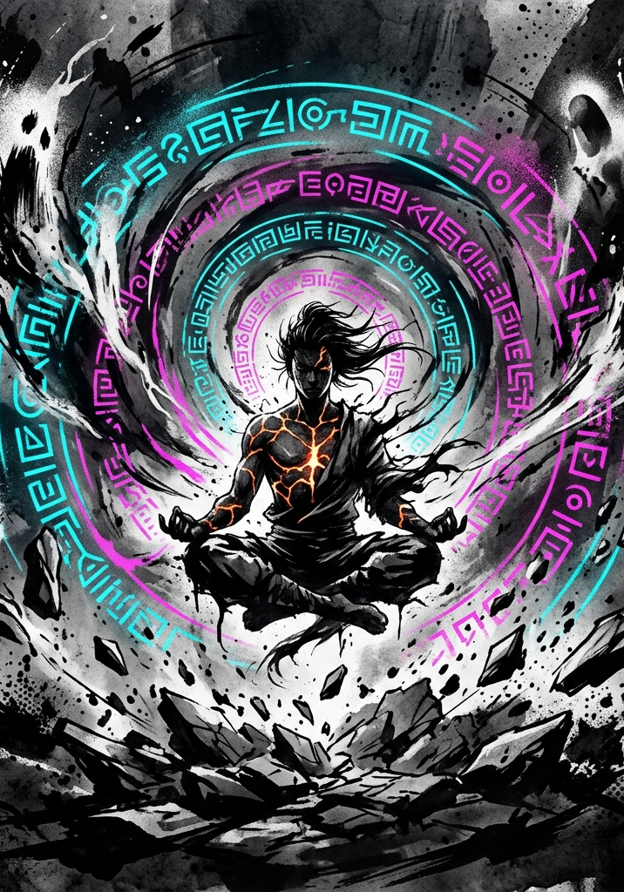

# Grade Breakthroughs

---

## Design Intent

A Breakthrough is a single dramatic ritual, resolved at the table in one scene with the whole party watching. The mechanic is built around four principles:

- **Visible Payoff.** Every successful Breakthrough produces stat changes, new options, and a System acknowledgment of the character's ascension.
- **Single-Session Resolution.** A Breakthrough resolves in one dramatic sequence.
- **Soloable, but better with friends.** A well-prepared cultivator can Break Through alone. The party makes it more accessible and more dramatic.
- **Lightweight spotlight.** Other party members participate, but without constant tactical decisions during the cultivator's moment.

---

## In-World Framing

A Breakthrough occurs when the barrier between the cultivator's current Grade and the next becomes permeable. The System's Principles draw closer to the material plane. The boundary thins, the ambient energy density spikes, and for a brief window the cultivator's body and spirit can be reshaped by forces that normally operate far beyond mortal reach.

This proximity is what makes the event possible. It is also what makes it dangerous. The same thinning of the boundary that allows ascension also allows external phenomena to manifest: tribulations, environmental backlash, spectral echoes of the energy being consumed. The cultivator is not simply meditating harder. They are standing at the threshold of a higher order of reality and daring it to remake them.

---

## The Universal Blueprint

Every Breakthrough, regardless of Grade, follows the same four-stage structure. The flavor and stakes of Stages 2 and 3 change by Grade. The scale of Stage 4's rewards changes by Grade. But the skeleton is always the same.

### Stage 1: Preparation

The setup phase. No dice are rolled. This is where most quality dials are set.

**Requirements:**

- The character must be at the **Grade-cap level** (Level 25 for F-Grade, 50 for E, 75 for D, and so on).

At the cap, VE has nowhere else to go: kills, quests, and absorption keep filling the tank, and everything stored counts toward the Ignition fuel. A character who has been hunting at the cap arrives with a head start.

**Steps:**

1. **Declare Intent.** The player announces that their character is attempting a Breakthrough.
2. **Choose a Location.** The energy density of the environment is a major quality input (see Environment & Energy Density below). A barren rooftop works. A ley-line nexus works better. The choice is strategic.
3. **Consume Breakthrough Items.** Any prepared items (see Breakthrough Item Categories below) are consumed now, before the trial begins. Their effects lock in as modifiers to the Breakthrough Check.
4. **Receive Party Support Setup.** If allies are present, they declare their support roles now. This is the moment for buffs, formations, wards, or simply taking up defensive positions around the cultivator.

**GM Note:** Stage 1 should feel deliberate, a ritual in motion. Describe the cultivator settling into position, consuming pills, the air growing heavy with unprocessed energy. The party arranging themselves. The world going quiet. Then transition to Stage 2.

### Stage 2: Ignition

The cultivator deliberately floods their body with Volatile Energy, pushing past Tolerance into Saturation. This overcharge is not an accident; it is the fuel that powers the ascension. The body must be forced past its current limits before it can be reshaped to hold the next Grade's capacity.

**Mechanic: The Overcharge Ratio**

**The charge is usually banked long before this stage.** A character sitting at their Grade cap has been storing VE with nowhere to spend it, sometimes for many sessions (Cultivation, "Leveling: The Cost of a Level"). Stage 2 is not where gathering begins; it is where the cultivator commits what they have and tops off the difference on site. Consumables add more and ambient absorption closes the gap, and the GM sets how long the top-up takes from the location's density: minutes somewhere rich, hours of dangerous exposure somewhere barren.

The cultivator needs VE equal to at least **one full Tolerance** to ignite, and may choose to carry more. The multiple of Tolerance they hold at Ignition is the **Overcharge Ratio**, the risk-reward dial the player controls:

| Overcharge Ratio | VE Stored | Saturation While Charging | Trial Difficulty | Quality Modifier |
|---|---|---|---|---|
| ×1.0 (Minimum) | One Tolerance | None | Base difficulty | +0 |
| ×2.0 (Aggressive) | Twice Tolerance | Mild, −10 | +10 to Breakthrough DC | +1 Tier |
| ×3.0 (Reckless) | Three times Tolerance | Heavy, −25 | +20 to Breakthrough DC | +2 Tiers |
| ×4.0 (Suicidal) | Four times Tolerance | Critical, clock running | +40 to Breakthrough DC | +3 Tiers |

At the F-Grade cap those are 80, 160, 240, and 320 VE; ×10 for each Grade above.

**Saturation penalties never touch the Breakthrough Check.** The ignition burns that VE as fuel, so the weight a cultivator is carrying does not blunt the roll it is paying for. Those penalties apply to everything else, including whatever the party has to do during the Trial, and to the cultivator's own actions right up until they ignite.

**The body can give out first.** At ×4.0 the character is in Critical Saturation, and the collapse clock (Cultivation chapter) runs until the moment of Ignition: a d100 at the end of every full hour, escalating, automatic by the fourth. If it fires first they pass out on the spot into the collapse the Cultivation chapter defines: involuntary Consolidation, defenseless, the gathered charge draining away with nothing to show for it, and no attempt. This is why the highest ratio is gathered fast, in a dense location, with the ritual site already prepared. Once Ignition is declared, Saturation is suspended and the ritual consumes the VE.

**Once the cultivator declares Ignition, Stage 3 begins immediately. There is no going back.**

### Stage 3: The Trial

The dangerous part. A hybrid structure: an internal challenge for the cultivator resolved mechanically through the Breakthrough Check, coupled with external phenomena that the party (or the cultivator, if solo) must manage.

#### The Breakthrough Check

The cultivator makes a single roll:

> **d100 + HRT Force + preparation vs. Breakthrough DC**

Heart alone. Every Breakthrough is a trial of will, and no other Attribute is consulted, because no other Attribute is being asked anything. A career of carrying more raw power than the body wanted is exactly the training this roll tests. The brawler and the diplomat make the same roll, and what separates them is how much they were willing to hold.

**Breakthrough DC** is **140** at every Grade transition: Severe difficulty, read straight off the Grade Reference Card. There is no Cross-Grade Adjustment, because the challenger is not facing something a Grade above them. They are becoming it. The Overcharge Ratio further modifies the DC.

| Overcharge Ratio | ×1.0 | ×2.0 | ×3.0 | ×4.0 |
|---|---|---|---|---|
| Effective DC | 140 | 150 | 160 | 180 |

**What the DC represents:** a challenger rolls d100 + HRT Force against 140, with Heart bounded 1–99 inside their current Grade, and adds whatever preparation they brought. A character with Heart in the sixties and ordinary preparation is a little better than even. One who neglected Heart entirely needs both a fortune in preparation and a good die. The math is identical at every Breakthrough: F→E, E→D, D→C.

**The Breakthrough Check explodes.** This is the one roll outside combat where System Volatility applies. The natural d100 checks the character's **current** Grade threshold and cascades as normal (see Core Mechanics, "System Volatility"): a rare surge at every transition, natural 96+ for an F-Grade cultivator, with the threshold falling one point per Grade. A cascade can carry an outmatched cultivator past the DC, or turn a safe attempt into a Transcendent one.

**Modifiers to the Breakthrough Check:**

| Source | Modifier |
|---|---|
| Location Energy Density (see below) | +5 to +25 |
| Foundation Pills consumed | +5 to +15 |
| HVE Coherence Bonus (see below) | +0 to +20 |
| Party Support (see below) | +5 to +15 |
| Quality Enhancer item consumed | no roll modifier (affects tier) |
| Tribulation Ward consumed | no roll modifier (affects failure severity) |

**HVE Coherence Bonus:** A character with a sharp, consistent behavioral signature across the HVE axes generates a cleaner trial. Read the character's profile band from the Deep rows of their HVE sheet (The Hidden Vector Engine, "What the Engine Drives"):

- **Scattered:** +0. The character's identity is diffuse. The trial has no shape to latch onto.
- **Leaning:** +5. A direction is emerging.
- **Defined:** +10. The character knows who they are.
- **Singular:** +20. The trial practically writes itself.

The GM does not need to calculate this precisely; it is a qualitative read of the HVE profile, expressed as a modifier. Characters who have lived with conviction are rewarded. Characters who have drifted aimlessly face a harder road.

#### The Quality Tier

The Breakthrough Check margin (roll result minus DC) determines the base Quality Tier. Overcharge and item bonuses can push the tier higher.

| Margin | Base Tier | Description |
|---|---|---|
| Below 0 | **Cracked** | Failure. |
| 0–19 | **Stable** | Standard ascension. |
| 20–39 | **Polished** | Above-average ascension. |
| 40–59 | **Pristine** | Exceptional ascension. |
| 60+ | **Transcendent** | One-of-a-kind ascension. |

**Tier Adjustment:** On a successful check, apply the Overcharge Quality Modifier to the base tier from the margin table: ×2.0 raises the final tier one step, ×3.0 two steps, ×4.0 three steps. Quality Enhancer items push the final tier up one further step. Neither adjustment raises a tier above Transcendent, and neither applies on a failure: a check that misses the DC is Cracked no matter the Overcharge. This is the risk-reward loop: overcharging raises the DC, buying a better outcome on success at the price of a likelier failure.

#### External Phenomena (The Party's Role)

When the cultivator ignites, the environment reacts. The thinning of the boundary between Grades draws attention: from the ambient energy field, from local wildlife, from things that exist in the space between Grades.

**What manifests depends on the Grade:**

- **F→E:** Minor disturbances. Aether fluctuations cause local temperature spikes, small tremors, or flickering light. Wildlife may be drawn to the site. Low-grade elemental manifestations (wisps, sparks, tremors) appear and must be managed but pose no serious threat to a prepared party.
- **E→D:** Significant phenomena. Spectral manifestations coalesce from the cultivator's HVE signature: echoes of their behavioral patterns given temporary form. Environmental effects are meaningful: terrain warps, energy storms, or local wildlife transforms into aggressive tribulation beasts.
- **D→C and beyond:** Catastrophic phenomena. Left undeveloped (see Higher Grades section).

**Party Engagement (The Support Role):**

The party's job during Stage 3 is straightforward: **keep the cultivator alive and undisturbed.** This is not a full tactical combat; it is a defense scenario with a built-in clock.

**Mechanically, the party contributes in two ways:**

1. **Phenomenon Management.** The GM presents 1–3 external threats at the current Grade, typically Moderate to Hard on the Grade Reference Card. The party deals with them using standard Clash rules. If any threat reaches the cultivator, it imposes a penalty on the Breakthrough Check (−10 per threat that breaks through). These fights should be short: 2–3 rounds maximum. The point is dramatic tension, not a grinding slog.

2. **Active Support.** One party member may declare an **Anchor action**, a deliberate act of support that grants the cultivator a bonus on the Breakthrough Check. The Anchor makes an Opposed Roll using their most relevant Force (HRT Force for spiritual anchoring, POW Force for energy channeling, FOR Force for physical shielding) against a Moderate difficulty of the current Grade. Success grants +5 to the Breakthrough Check. A Margin of 20+ grants +10. A Margin of 40+ grants +15. Only one Anchor action per Breakthrough; this keeps the spotlight on the cultivator.

**Solo Breakthrough:** A cultivator attempting to Break Through alone must handle external phenomena themselves. Any phenomena that manifest impose their penalty automatically (the cultivator cannot fight and meditate simultaneously). This is why solo Breakthroughs require superior preparation: the item and location bonuses must compensate for the lack of party support and phenomenon management. A maxed-prep solo cultivator (peak location, full item loadout, high HVE coherence) should be able to reliably hit Stable without party support. Polished is possible but requires either a strong roll or exceptional preparation. Pristine solo is the stuff of legend.

#### Time-Boxing

The Trial is time-boxed in fiction. From the moment of Ignition to the completion of the Breakthrough Check, no more than **10 minutes of in-game time** pass. This is a single dramatic sequence, not a slog, not a multi-hour ordeal. The Breakthrough Check, the party's defense, the external phenomena: all of it happens in a compressed burst of reality-warping intensity. Describe it as such.

### Stage 4: Recognition

The System processes the result. This is the payoff: the moment the numbers change and the character is fundamentally different from who they were ten minutes ago.

#### Outputs by Quality Tier

**Cracked (Failure):**

The Breakthrough fails. The overcharged VE backlashes through the cultivator's system.

- **VE Backlash:** All stored VE is burned off in the failed attempt; none of it becomes level progress. The stat cost of the backlash scales by Grade (see the Grade-Specific sections below).
- **Battle Memory:** A failed Breakthrough always grants a Battle Memory Card: the trial is the kind of moment Battle Memories exist to capture. The GM narrates what the character glimpsed as it slipped away.
- **Lockout Period:** The character cannot attempt another Breakthrough for a minimum number of sessions determined by Grade (F→E: 2 sessions, E→D: 3 sessions, D→C: 4 sessions). This is narrative: the character's channels are damaged and must heal.
- **Stat Consequences:** Scale by Grade (see Grade-Specific sections below).
- **Tribulation Ward Effect:** If a Tribulation Ward was consumed, the Cracked result is upgraded to Stable. The Ward absorbs the backlash. This is the insurance item: expensive, rare, but it turns catastrophe into mediocrity.

**Stable (Standard Ascension):**

The character successfully ascends. Clean, competent, unremarkable.

- **Grade Advancement.** The character's Grade increments. All stat caps rise to the new Grade's maximum (999 at E-Grade, 9,999 at D-Grade, etc.). Stats are *not* multiplied: an F-Grade character with STR 80 still has STR 80 after Breaking Through to E. The cap is lifted, not the floor. Growth into the new Grade's stat range comes from class evolution bonuses, E-Grade leveling (where per-level stat budgets scale with Grade magnitude), treasures, and titles.
- **Class Evolution.** The System AI generates 1–3 class evolution options appropriate to the new Grade. These function like the Level 10 class selection. The character's HVE profile, current class, and Principle affinities shape what is offered. The player selects one. The selected evolution grants a new Signature Skill, modifies the class's stat profile for future level-ups, and provides a **one-time class evolution stat infusion**, a lump sum of stat points distributed according to the new class's stat profile. At E-Grade, this infusion is typically 50–100 points total (enough to push primary stats past 100 while leaving dump stats where they are). The infusion scales with Grade magnitude at higher Breakthroughs.
- **System Message.** The System AI generates a clinical acknowledgment of the ascension: a brief, cold System notification reflecting the character's journey. ("*[Subject 4,291-F] has undergone Grade Evaluation. Assessment: Stable foundation. F-Grade patterns preserved. E-Grade clearance granted.*")
- **Principle Track Effects.** Principles advance on their own track and most Breakthroughs leave it untouched. Two exceptions: the F→E Breakthrough unlocks the **second Principle slot**, and reaching D-Grade opens the **Domain gate** (see The Principle System, "Principle Slots" and "The Domain gate").

**A Note on Dump Stats:** A character whose STR is 65 at F-Grade cap may still have STR 65 after Breaking Through to E-Grade if their class evolution doesn't invest in STR. That stat now reads at the new Grade's magnitude with a leading zero: 065, Force 06 (see Core Mechanics, "Lagging Stats"). Against mortals the Grade gap carries it; against E-Grade opposition it is the character's soft spot. Natural growth through E-Grade leveling, attribute treasures, and titles will push all stats upward over time, but lagging stats create meaningful character texture.

**Polished (Above-Average Ascension):**

Everything from Stable, plus:

- **Bonus Stat Budget.** The class evolution infusion is increased by half: 75–150 points at E-Grade instead of 50–100. The additional points are distributed by the GM based on HVE profile, following the same behavioral mapping as pre-class stat allocation. A Polished ascension means the System noticed something extra and rewarded it.

**Pristine (Exceptional Ascension):**

Everything from Polished, plus:

- **Bespoke Perk.** The System AI generates a one-of-a-kind ability, passive, or systemic advantage tailored to the character's HVE signature and Principle alignment. Examples: a Force-dominant warrior might receive "First Impact" (the first Clash of every combat gets +15), a Method-dominant planner might receive "Architect's Eye" (once per Consolidation, reveal the structural weakness of any single target), a Hunger-dominant cultivator might receive "Refined Consumption" (kills award VE as if one difficulty tier harder).
- **Principle Bonus.** +10 Insight Points toward the character's highest-affinity Principle, representing the trial's resonance with their established pattern.

**Transcendent (One-of-a-Kind Ascension):**

Everything from Pristine, plus:

- **System-Generated Unique Reward.** The System AI creates a one-of-one reward that exists nowhere else in the Multiverse. This is the Breakthrough as promotion review: the System looked at this character's entire behavioral record, their Principle mastery, their combat history, their choices under pressure, and decided to invest. Possible forms:
  - **Bloodline Awakening:** A latent genetic or systemic pattern activates, granting a permanent passive effect and opening a new evolutionary tree.
  - **Unique Skill:** A skill synthesized from the character's specific intersection of HVE axes and Principles, something no other cultivator has ever been offered.
  - **Hidden Title:** A System-granted title with mechanical weight: stat bonuses, faction recognition, or environmental effects that trigger in specific contexts.
  - **Principle Revelation:** An immediate jump in Principle progression: a Principle at Early Fragment might leap to Mid Fragment, or a new Principle might crystallize fully formed.
- **Hidden Achievement.** The System also generates a Hidden Achievement marking the Transcendent Breakthrough. This becomes part of the character's permanent record and may influence future System interactions.

---

## Breakthrough Item Categories

Six functional categories. Each is a treasure-hunt objective that players can pursue proactively when they see their Grade cap approaching. GMs should seed these items into dungeons and treasure hoards sessions before they are needed; let the players realize what they have and plan accordingly.

| Category | Function | Examples |
|---|---|---|
| **Foundation Pills** | Raise base success odds on the Breakthrough Check. | Dragon Marrow Pill (+5), Nine Leaf Essence (+10), Heavenly Foundation Pill (+15) |
| **Resonance Catalysts** | Amplify Principle gains during the trial. Increase IP awarded at Stable or higher. | Principle Tuning Crystal, Resonance Elixir |
| **Anchoring Artifacts** | Reduce backlash damage to self and party if the Breakthrough fails or external phenomena break through. | Stillwater Ward Stone, Earthbound Anchor Talisman |
| **Tribulation Wards** | The insurance policy. If consumed, upgrades a Cracked result to Stable. Consumed whether used or not. Extremely rare. | Phoenix Down Seal, Heavenly Tribulation Banner |
| **Quality Enhancers** | Push the final Quality Tier up by one step (never above Transcendent). | Celestial Refinement Crystal, Dao Clarification Lotus |
| **Bespoke Items** | Rare, themed effects that do not fit the other categories. | Heart Demon Mirror (reveals HVE manifest during the trial; the cultivator sees their behavioral signature given form), Phoenix Feather (grants one re-roll on a failed Breakthrough Check), Spatial Anchor Stone (suppresses all external phenomena for the first round of the trial) |

**Item Stacking:** A cultivator may consume one item from each category. Multiple items from the same category do not stack: the body can only process one Foundation Pill, one Resonance Catalyst, etc. Bespoke Items are the exception; their effects are unique enough that the GM adjudicates stacking on a case-by-case basis.

---

## Environment & Energy Density

The location where a Breakthrough occurs matters. Energy density (the concentration of ambient systemic energy in the environment) directly affects both the Breakthrough Check bonus and the intensity of external phenomena.

### Energy Density Tiers

| Tier | Breakthrough Bonus | Phenomena Intensity | Example Locations |
|---|---|---|---|
| **Barren** | +0 | Minimal (1 weak threat) | Urban ruins, depleted zones, mundane terrain |
| **Low** | +5 | Light (1 moderate threat) | Wilderness with scattered energy, minor ley lines |
| **Moderate** | +10 | Standard (2 moderate threats) | Established energy nexus, active ley-line intersection |
| **High** | +20 | Heavy (2–3 strong threats) | Deep dungeon core, natural treasure ground, ancient formation |
| **Extreme** | +25 | Severe (3 strong threats, possible Grade+ entity) | Mystic realm convergence point, heart of an Incursion zone |

The tradeoff is explicit: better locations produce better Breakthroughs, but they also attract more dangerous tribulation phenomena. A party that can handle the external threats should always seek the highest-density location available. A solo cultivator must weigh the bonus against the automatic phenomenon penalties they will eat.

### Consolidation Bonus (Cross-Reference)

Energy density also affects ordinary Consolidation (documented in the Cultivation section): a high-density region refines 40 VE per hour instead of 20. The same environmental scouting that identifies good Breakthrough locations pays dividends during routine play.

### Location Scouting

Finding and securing a Breakthrough location is an adventure in itself. The GM should:

- **Hint early.** Introduce energy-dense locations during exploration and dungeon crawls, well before any character is approaching their Grade cap.
- **Create competition.** Other cultivators (NPC factions, rival sects, or Incursion forces) may have claimed the best locations. Acquiring access might require negotiation, subterfuge, or force.
- **Layer additional properties.** Some locations have Principle resonance (a fire-aspected volcanic caldera grants bonus IP to fire-aligned Principles), spatial instability (increases tribulation intensity but also increases the chance of bespoke rewards), or historical significance (previous Transcendent Breakthroughs at a site may leave residual benefits, or residual dangers).

---

## Grade-Specific Breakthroughs

### F → E: Foundation & Body Tempering

**Theme:** Body-focused. The System burns out pre-System impurities: toxins, accumulated damage, the lingering fragility of a body that was never designed to hold systemic energy. The cultivator's physical form is fundamentally remade as a vessel capable of holding E-Grade energy density.

**Tone:** The gateway Breakthrough. This is the first time the table experiences the mechanic, and it should teach the system without threatening campaign-ending consequences. The genre treats F→E as the moment a character stops being "just an enhanced human" and becomes something genuinely other. Narrate accordingly: bones crack and re-fuse denser, impurities are expelled as black sludge through the skin, the character's heartbeat slows and deepens into something that sounds more like a drumbeat than a pulse.

**Trial Character:**

- **Internal:** Physical-spiritual pressure test. The cultivator's body is the battlefield; they must endure the reconstruction of their physical vessel while maintaining spiritual coherence. Describe impurity expulsion, body-tempering visions (flashes of the character's hardest physical moments, replayed and compressed into a single searing experience), the sensation of bones breaking and reforming.
- **External:** Mild phenomena. Local energy fluctuations cause temperature spikes, minor tremors, flickering light. Small elemental manifestations (energy wisps, ground cracks, brief spatial shimmers) appear and dissipate. At low-density locations, these may not manifest at all. At high-density locations, minor tribulation beasts (F-Grade, Moderate difficulty) may be drawn to the site.

**Recognition at this Grade** also unlocks the second, and final, Principle slot (see The Principle System, "Principle Slots").

**Failure Consequences (Cracked at F→E):**

- **Stat Loss:** Temporary. FOR and POW each drop by 5 (minimum 1). Recovery through one full Consolidation rest.
- **Lockout:** 2 sessions before retry.
- **No permanent consequences.** The F→E Breakthrough is forgiving.

**Key Items/Locations:** Foundation Pills matter most at this Grade; the roll bonus they provide is a larger percentage of the total needed. Anchoring Artifacts are less critical because failure consequences are mild. A character with good stats and a decent location can Break Through to E-Grade with minimal item support.

**Math Check (F→E):**

A well-built F-cap character with HRT 60 sits 80 short of the DC before preparation, so the d100 has to cover 80 on its own: about one attempt in five. With a Moderate location (+10), a Foundation Pill (+10), Coherence of Defined (+10), and a Party Anchor (+5 to +15), preparation covers 35 to 45 of that gap and the roll needs 35 to 45: **roughly even odds, plus the explosion tail.** A character who pushed Heart into the eighties and brought maxed preparation clears the base DC on almost any roll and should be spending the margin on Overcharge instead, buying Quality with the odds they no longer need. A character who neglected Heart is not blocked, but they are buying their way through with consumables and a good night's dice.

### E → D: Soul Sea Expansion

**Theme:** Spiritual-focused. The cultivator's energy channels and inner architecture rebuild at higher capacity. The "Soul Sea" (the internal space where Aether is held and Principle is processed) expands and reshapes around the character's accumulated identity. Who you have been determines the shape of who you become.

**Tone:** The first Breakthrough where HVE matters mechanically and narratively. The character's behavioral signature shapes the trial directly. This is where the Hidden Vector Engine delivers its most dramatic payoff: the character faces *themselves*, or rather, the System's interpretation of themselves. Play this up. The cultivator should emerge from the trial understanding something new about their own nature.

**Trial Character:**

- **Internal:** The cultivator faces internalized representations of their behavioral patterns: manifestations drawn from their HVE signature given form and volition within the Soul Sea. These are not adversaries (save explicit Heart Demon antagonism for D→C and beyond). They are trials of integration.
  - A **Force-dominant** character meets manifestations of impact and violence: echoes of every enemy broken, every wall shattered, every problem solved by overwhelming pressure. The trial demands they prove they can sustain that force without being consumed by it.
  - A **Method-dominant** character navigates labyrinthine internal architecture: crystalline structures of plans-within-plans, each one a decision made, a variable controlled. The trial demands they find the path through without losing themselves in abstraction.
  - An **Accord-dominant** character mediates between aspects of self: fragments representing every alliance forged, every compromise made, every time they bent to hold the group together. The trial demands they unify these fragments into a coherent whole.
  - A **Will-dominant** character confronts projections of everything they have dominated: the people cowed, the systems broken to their will, the resistance crushed. The trial demands they prove their will is genuine sovereignty and not mere cruelty.
- **External:** Significant phenomena. Spectral manifestations coalesce from the cultivator's HVE signature, echoes given temporary physical form outside the cultivator's body. These are E-Grade threats (Moderate to Hard difficulty on the Grade Reference Card) and they carry thematic resonance with the cultivator's behavioral patterns. A Force-dominant cultivator's external phenomena are aggressive and kinetic; a Method-dominant cultivator's are spatial and disorienting. Aether storms, terrain warping, and transformed local wildlife are all appropriate.

**Recognition at this Grade** opens the Domain gate: the rebuilt Soul Sea is a vessel that can hold a Domain, and a character with a Peak Fragment articulation waiting may Distill it at their next Consolidation (see The Principle System, "The Domain gate").

**Failure Consequences (Cracked at E→D):**

- **Aether Ceiling Reduction:** Permanent. Max Aether is reduced by one tenth (drop fractions) until the next successful Breakthrough. The Soul Sea cracked but did not shatter; it holds, but leaks.
- **Principle Regression:** The character loses IP equal to half their current total toward their highest Principle. Progress toward the current tier is set back, though the tier itself is not lost.
- **Lockout:** 3 sessions before retry.
- **Cracked Foundation Status:** The character gains the narrative status "Cracked Foundation." This is known to the System and to perceptive cultivators. Future Breakthrough attempts carry an additional −5 penalty until a successful Breakthrough clears the status. NPCs and faction leaders who can sense cultivation state may react accordingly.
- **Stat Loss:** FOR and POW each drop by one twentieth of their current Raw value, fractions dropped (FOR 500 loses 25). This loss is permanent until recovered through leveling or treasures.

**Key Items/Locations:** Resonance Catalysts and Quality Enhancers become critical at E→D. The HVE Coherence bonus is more impactful because the trial's internal content is shaped by it: a character with a scattered HVE profile faces a chaotic, incoherent trial that is mechanically and narratively harder. Tribulation Wards are worth their weight in gold at this Grade, because Cracked consequences are now permanent.

### D → C and Beyond

This book covers F→E and E→D in full; D→C and beyond arrive in a future supplement. The universal blueprint applies: the four-stage structure, the Overcharge Ratio, the Quality Tier system, and the Breakthrough Check formula all extend unchanged. What changes is the thematic content of the trial (D→C likely introduces true Heart Demon confrontation as an adversarial internal entity), the severity of failure, the scale of external phenomena (D-Grade tribulations may attract attention from entities beyond the local System), and the magnitude of Transcendent rewards.

---

## The Breakthrough Check: Summary Reference

> **Roll: d100 + HRT Force + preparation, against DC 140**
>
> **vs. Breakthrough DC: Severe difficulty of the target Grade + Overcharge modifier**
>
> **Bonuses: Location Energy Density + Foundation Pill + HVE Coherence + Party Anchor**
>
> **Result: Margin determines Quality Tier → Tier determines rewards**

| Component | Source | Range |
|---|---|---|
| Base Roll | d100 (Volatility-live; explodes at the current Grade's threshold) | 1–100+ |
| HRT Force | Character stat | 10–99 |
| Highest Attribute Force | Character stat | 10–99 |
| Location | Environment tier | +0 to +25 |
| Foundation Pill | Consumed item | +5 to +15 |
| HVE Coherence | GM behavioral read | +0 to +20 |
| Party Anchor | Ally support roll | +5 to +15 |
| Overcharge | Player choice (added to DC) | +0 to +45 |

---

## Open Design Space

The following elements are identified as future development targets. They are not forgotten; they are deliberately deferred until playtest data or campaign progression demands them.

- **Environment & Energy Density as a full subsystem.** The tiers above are sufficient for Breakthroughs, but energy density also affects Consolidation efficiency, Principle resonance, monster spawning, and territorial control. A full map-scale energy density system is needed when the campaign begins involving planetary leadership or faction-scale territory management.
- **Higher-Grade Breakthrough themes.** D→C (Heart Demon confrontation), C→B (Cosmic attunement), B→A and beyond: each needs its own thematic layer within the universal blueprint.
- **Breakthrough as a faction event.** At higher Grades, a Breakthrough may attract attention from Sects, Monarchs, or the System itself. The political and military implications of a known Breakthrough attempt are a rich design space.
- **Bloodline interaction.** How does an active Bloodline modify the Breakthrough trial? Does it add an additional internal challenge, or does it provide a shortcut?
