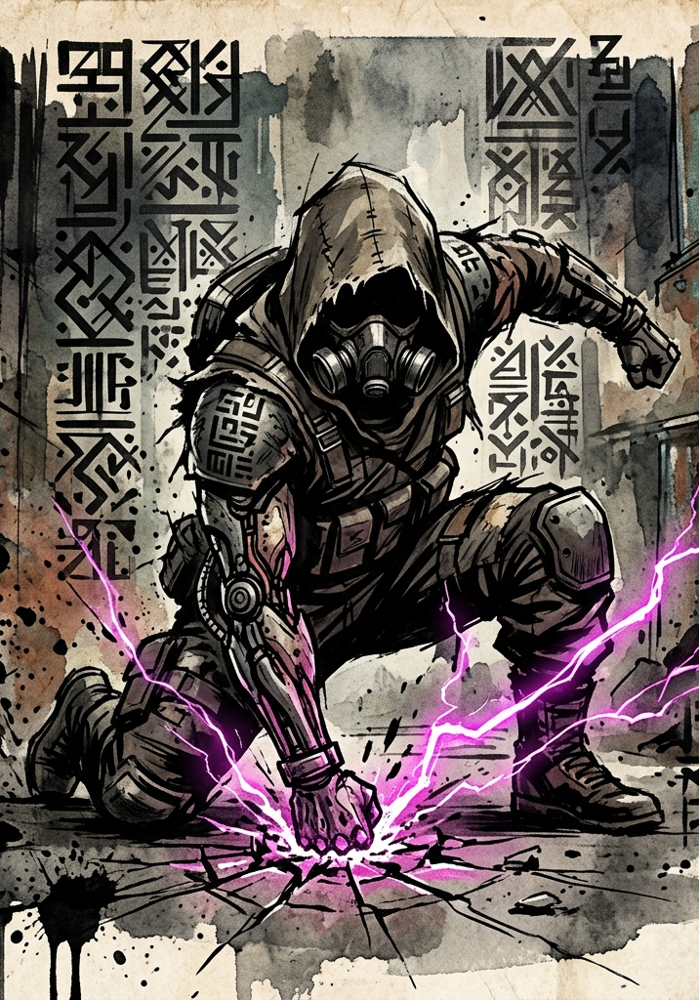

# Stable Abilities

---

## Design Notes

A **Stable Ability** is a small, permanent capability granted by the System at the end of the Integration Tutorial (Phase 7: First Recognition). It is not a class feature — class selection happens at Level 10. It is not a Principle Application — those are earned through Insight Points. A Stable Ability is the System's first formal acknowledgment of the character's emerging identity: a single, flavor-rich tool that signals the direction of their growth.

Each Stable Ability is keyed to a behavioral signature observed during the tutorial. The GM selects one ability per character at Phase 7, drawing from the catalog below. Use the player's strongest tutorial moment, their dominant Hidden Vector axis, or a combination — whichever feels most earned.

**Mechanical principles:**

- Stable Abilities cost no Energy. They are System-stamped permissions, not channeled techniques.
- Most are gated by frequency (once per encounter, once per Consolidation, once per session) rather than by resource pool.
- They never replace a class feature. When the character selects their class at Level 10, the Stable Ability remains — but the class will provide more powerful, similar-flavored options that may overshadow it. That is intentional. The Stable Ability is a foothold, not a peak.

---

## The Catalog

### Force / Hunger Axis

#### First Impact
*The first blow lands harder when the body is fresh and the mind is set.*

The first Clash you make in any combat gains **+15 to the roll**. Once per encounter; refreshes when combat ends.

**Best for:** Characters who charged decisively into the tutorial's first fights, claimed weapons aggressively, or struck before others could react.

#### Bloodfast
*Killing accelerates the next strike.*

Each time you deliver a killing blow, your next Clash this turn (if any) gains **+5 cumulative**. Resets at end of turn or end of encounter.

**Best for:** Characters who pursued kills aggressively, took risks for resources, or showed predator behavior at the Recycling Node and Wild Fragment.

---

### Method / Restraint Axis

#### Sensory Pulse
*A pulse of focused attention reveals what hides in the seams.*

Once per Consolidation, spend 1 Beat. Reveal hidden features within your current Zone — traps, concealed enemies, structural weak points, energy signatures. The GM describes what stands out.

**Best for:** Characters who explored the Arcane Debris carefully, noticed the spiral pattern, or asked careful questions before acting.

#### Architect's Eye
*You see the shape of the thing before you see the thing itself.*

After observing a target for at least one round (combat or otherwise), you may ask the GM one tactical question about it: a Force value, a vulnerability, its preferred attack pattern, or its remaining HP/Energy in rough terms. Once per encounter, no Beat cost.

**Best for:** Characters who studied the training constructs, observed before engaging, or proposed structured plans during loot allocation.

---

### Will / Accord Axis

#### Crushing Stare
*Some pressure is delivered without a weapon.*

Once per encounter, spend 1 Beat. One target in your Zone makes a HRT Force save vs. your CHA Force + 10. On failure, they lose their next Beat (suppressed by your presence). Does not work on creatures immune to mental attacks (constructs, mindless undead).

**Best for:** Characters who dominated social interactions, intimidated alien Initiates, or made others defer through sheer presence.

#### Rally
*A word, a look, a gesture — and your ally finds another half-step.*

Once per encounter, spend 1 Beat. One ally within line of sight gains **+10 to their next Clash this round**.

**Best for:** Characters who advocated for the group, mediated disputes, or stepped forward as informal leaders during the Civic Fragment encounter.

#### Voice of Decision
*When the room can't decide, you decide.*

When the party is deliberating a decision and unable to reach agreement, you may declare a resolution. The System registers the moment of leadership and grants **+10 to your CHA-based Clashes for the rest of that session**, whether the party accepts your declaration or not. Once per session.

**Best for:** Characters who broke deadlocks, took responsibility under uncertainty, or established themselves as the party's voice without seizing dominance.

---

### Control / Freedom Axis

#### Iron Settle
*The wound deepens, the stance lowers, and the world narrows to what must hold.*

When at 25% HP or less, gain **+10 to Defense Force on all Clashes**. Lasts until you regain HP above the threshold.

**Best for:** Characters who held the line, endured hardship, or refused to retreat when the party was breaking.

#### Slipstep
*The blow that should have landed slides past you.*

When you would be hit by an attack, declare Slipstep — the attacker rerolls their Clash and takes the lower result. Once per Consolidation.

**Best for:** Characters who improvised under pressure, embraced chaotic solutions, or escaped situations through unpredictable movement.

#### Tracker's Mark
*You hold the impression of them, and the impression holds direction.*

Spend 1 Beat outside of combat to mark a target you can perceive. For the next 24 hours, you sense their direction and rough distance. Affects only one target at a time; marking a new target replaces the old one.

**Best for:** Characters who hunted, pursued, or showed strong tracking and observation behavior in the Wild Fragment.

---

### Hybrid / Arcane

#### Arcane Flicker
*A small, deliberate disturbance in the air.*

Free action, no Energy cost: produce a small telekinetic push. Move an unattended object up to 10 lbs within line of sight, or shove an Exposed enemy off-balance (no damage; impose **−5 to their next Clash**). Useful for tactical setups, environmental tricks, knocking objects loose from a distance.

**Best for:** Characters who experimented with unstable shards, interacted with arcane phenomena, or showed early POW affinity in the Arcane Debris.

#### Reactive Dodge
*The body remembers what the mind has not yet decided.*

When you are Exposed and would be hit by an attack, gain **+10 to Defense Force on that Clash**. Once per encounter.

**Best for:** Characters who survived bad positions through reflex, escaped traps, or showed late-clutch defensive instincts.

---

## Selection Guidelines for the GM

At Phase 7 of the tutorial, review each player's tutorial behavior and select **one** Stable Ability per character. If multiple abilities feel appropriate, pick the one that:

1. Matches the player's strongest behavioral signature on the Hidden Vector Engine.
2. Reflects a specific moment that surprised the table (the play that made everyone lean forward).
3. Opens a direction the player seems excited about, even if they haven't named it.

If two players would naturally receive the same ability, give one of them a thematically adjacent variant rather than splitting them between identical kits. Stable Abilities are signals of identity — duplication blunts the signal.

**Do not let players select their own Stable Ability.** The point is that the System grants what it observed, not what the player wants. If a player's behavior didn't strongly signal anything, default to **Reactive Dodge** or **Sensory Pulse** — both are flexible and don't lock direction.

---

## Future Expansion

This catalog covers the tutorial-tier grant. As the campaign develops, new Stable Abilities may be granted by:

- **Hidden Achievements** for statistically improbable outcomes.
- **Major narrative milestones** (saving a faction, completing a Mandate, surviving a B-tier threat).
- **Bespoke System recognition** at Pristine or Transcendent Breakthroughs.

The GM may extend the catalog with new abilities tailored to the campaign's emerging themes. The shape stays the same: one trigger, one effect, no Energy cost, frequency-gated.
