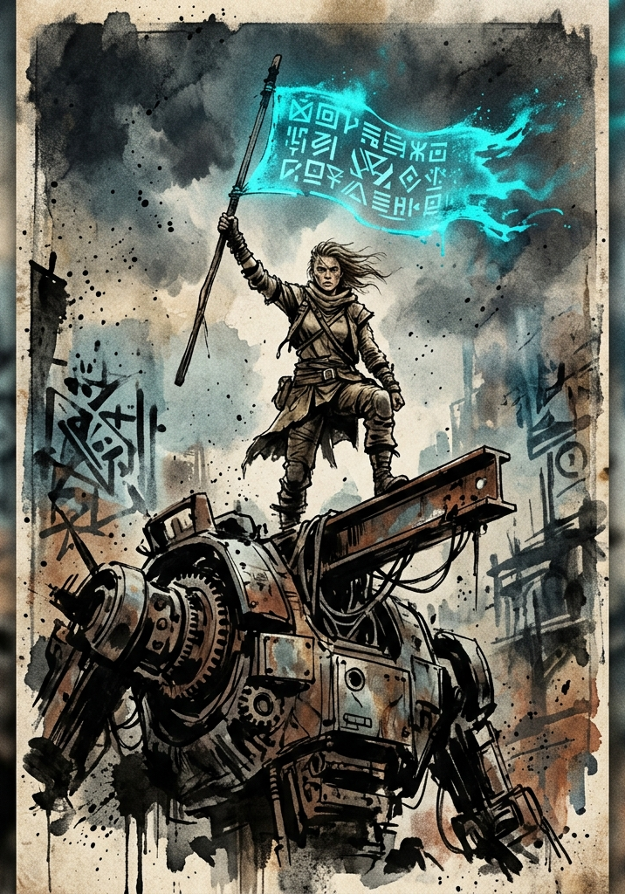

# Titles

Titles are the System's achievement layer, and they run on one loop: a character does something the System considers worth recording, a notification lands mid-session with a name and a bonus attached, and the bonus stays on the record forever. Kill your tenth beast and "Ten-Slayer" arrives with +1 STR. Survive something you had no business surviving and something rarer shows up. Nobody picks them from a menu and nobody sees the thresholds in advance.

This chapter covers the four shapes a title comes in, what their bonuses are worth, and who can see them. The behavior the System is reading to generate them is the Hidden Vector Engine's business, and the titles the Integration Tutorial hands out are listed there.

---

## Design Intent

Collecting titles is fun, comparing them is fun, and a good stack adds up to real power.

**Stacking is the point.** Title bonuses are calibrated so that a single title is a satisfying nudge, but a creatively constructed stack of five to ten produces visible, decisive power. Players are expected to hunt titles, plan around combinations, and lean on the stack when conditions converge.

Titles arrive in four shapes (Achievement, Hidden Achievement, HVE-Resonant, Bestowed). All four coexist on a character. Nobody picks them from a menu; the GM, or the System AI in assisted modes, generates each one for the specific character who earned it.

**Pacing target (soft):**

- **Achievement titles:** every 3–4 sessions across the party, rather than per character
- **HVE-Resonant titles:** every Grade or major behavioral shift
- **Hidden Achievement titles:** 1–3 times per campaign arc
- **Bestowed titles:** whenever the fiction earns them

These are guidance, not quotas.

---

## Title Categories

### Achievement Titles

Generated when a player crosses a quantitative threshold the System tracks: kills, distance traveled, items crafted, Consolidations completed, days survived, locks picked, oaths fulfilled, and so on. Common, semi-predictable in rhythm, low-to-moderate mechanical impact.

Players don't see thresholds in advance, but after the second or third Achievement title they begin to feel the rhythm: *something* triggers titles, and the System is watching. This is the breadcrumb layer that makes the System feel constantly observant.

**Examples:** "Ten-Slayer," "First Through the Gate," "Pillwright," "Hundredfoot," "Vow-Keeper," "Lockbreaker."

### Hidden Achievement Titles

Generated when a player accomplishes something statistically improbable: surviving an encounter they should have died in, solving a puzzle in an unintended way, completing an objective with a self-imposed constraint, achieving an outcome the System did not predict.

Rare, surprising, meaningfully buffed. Generation guidance lives in The System AI chapter. Players never see criteria in advance. These are the titles players brag about.

**Examples:** "Improbable," "The One Who Walked Through," "Unbroken," "The First Mercy," "Cornerless."

### HVE-Resonant Titles

Generated when a character's behavior settles into a recognizable pattern. Achievement titles track things a character did; these track how a character does things. Tend to appear during Consolidation, after meaningful Battle Memories, or at Breakthrough.

Mechanically grant bonuses aligned with the dominant axis combination.

**These titles evolve.** A character who is "The Hungering Edge" at F-Grade may become "The Devourer's Blade" at E-Grade if the pattern intensifies, or may shed the title and gain a new one if their behavior shifts.

**Examples:** "The Hungering Edge" (Force + Hunger), "Quiet Architect" (Method + Control), "The Open Hand" (Restraint + Accord), "The Severed Tether" (Method + Freedom).

### Bestowed Titles

Granted by external entities: factions, higher-Grade beings, ancient Principles, locations, or the System itself responding to a specific action. Mechanically variable, narratively heavy.

**Bestowed titles can be negative.** "Oathbroken" is granted automatically by the System when a sworn agreement is violated. Negative Bestowed titles cannot be unequipped or removed without specific in-fiction action: fulfilling an oath, completing a penance, defeating a specific entity. They create real consequence for behavior the System judges.

**Examples:** "Hand of the Iron Court" (faction-granted), "Witnessed by the Mountain" (granted by a Principle-rich location), "Oathbroken" (System-granted, negative), "Salvaged" (System-granted, negative, conferred when the System recovers an Initiate it was about to lose to its own administrative failure), "Marked by the Wild" (Bestowed by a creature or biome).

---

## Mechanical Effects

### Stacking Rules

**Stacking is unbounded.** There is no cap on the number of simultaneous active titles. A character with thirty titles benefits from all thirty, except where the mutual-exclusion rule below applies.

**Mutual exclusion (HVE-Resonant only):** A character may have only **one HVE-Resonant title per axis pair active at a time**. When the System grants a new HVE-Resonant title that resonates with an axis pair already represented, the new title supersedes the old one. The old title is logged as "Echoed" (visible in the character's history, no longer mechanically active).

Achievement, Hidden Achievement, and Bestowed titles never conflict with each other. They simply add to the stack.

**Identity titles can coexist when the axes differ.** A character can simultaneously hold "The Hungering Edge" (Force + Hunger) and "The Open Hand" (Restraint + Accord) only if their HVE profile genuinely supports both. This is rare, but possible for a character whose behavior is genuinely bimodal. The System AI is the arbiter.

### Bonus Magnitudes

Titles grant a mix of effect types. Magnitudes scale by the Grade at which the title was earned. The numbers below are calibrated assuming a player will stack 8–15 titles by the end of any given Grade.

Every bonus is a flat number; nothing is expressed as a percentage. Conditional bonuses, action economy effects, and resistances appear only on Hidden Achievement, HVE-Resonant, and Bestowed titles, which arrive rarely enough that the list of things a player must remember mid-fight stays short.

#### Flat Stat Bonuses (the workhorse)

The most common bonus shape, and the only shape an Achievement title grants. Multiple flat bonuses to the same stat sum directly, and a flat bonus is applied to the sheet once, the day it lands.

| **Title Class** | **F-Grade Bonus** | **E-Grade Bonus** | **D-Grade Bonus** |
|---|---|---|---|
| Common Achievement | +1 to +2 to one stat | +10 to +20 | +100 to +200 |
| Notable Achievement | +2 to +3 to one stat, or +1 across two stats | +20 to +30, or +10 across two | ×100 |
| HVE-Resonant | +2 to +4 across one or two thematic stats | +20 to +40 across one or two | ×100 |
| Hidden Achievement | +3 to +5 to one stat | +30 to +50 | ×100 |
| Bestowed (Common) | +2 to +5 across thematically appropriate stats | +20 to +50 | ×100 |
| Bestowed (Major) | +5 to +10 across multiple stats | +50 to +100 | ×100 |

**Example F-Grade stack ceiling:** A focused player with 12 active titles by F-Cap might accumulate roughly +25 to +40 stat points distributed across their key stats, a meaningful slice of the roughly 200 points an F-cap character has gathered from every source. Strong, but not game-breaking. The same player at E-Cap, having evolved or replaced most of those titles, holds an equivalent share at the E-Grade scale.

#### Conditional and Situational Bonuses

Bonuses that apply under a stated circumstance: outnumbered, below half HP, against a specific enemy category, in a specific environment, after killing a foe. Only Hidden Achievement, HVE-Resonant, and Bestowed titles carry them; an Achievement title's bonus is always flat.

**Magnitude:** the same range as a flat bonus of the title's class. The trigger is not a discount that buys a bigger number; what it buys is a spike, and a player who orchestrates the conditions for their titles to light up is doing exactly what the System rewards. A character's conditionals belong in one place on the sheet, read once when a fight starts.

Where a title wants to touch damage against a category of enemy, grant a flat Clash bonus against that category ("+10 to Clashes against constructs"); the Margin carries it into damage on its own.

#### Action Economy Bonuses

Free Beats or extra actions under specific conditions. Genuinely powerful; use sparingly.

**F-Grade examples:**
- "Once per encounter, when reduced to a quarter of Max HP or less, gain 1 free Beat."
- "Your first attack of any combat does not consume a Beat."
- "Once per Consolidation, take a free Beat outside the action economy when you have not yet acted this turn."

These should be rare, typically Hidden Achievement or peak Bestowed.

#### Resistances and Affinities

Standing defenses against specific damage types, Principle resonance gifts, environmental tolerance.

**F-Grade magnitudes:**
- +5 to defensive Clashes against a named damage type or source
- A one-time grant of 1 to 3 IP toward an aligned Principle, awarded with the title
- Immunity to specific minor effects (heat exhaustion, mild poisons, sensory deception below a Force threshold)

### Negative Titles

A negative Bestowed title cannot be unequipped or removed without specific in-fiction action. The character carries it until they earn the conditions of release.

**Common shape:** a flat penalty (−2 to a stat, +10 difficulty against a specific entity) plus a concrete social consequence (NPCs of a faction turn hostile on sight, wildlife that once ignored you now hunts you).

**Release conditions** are written into the title itself when granted. "Oathbroken" is released by fulfilling a new sworn oath under witness. "Marked for the Hunt" is released by defeating the entity that marked you. The System AI generates the release condition based on the violation.

**A released negative title may convert rather than vanish.** Where the release condition is the same test the character originally failed, the System replaces it with an Achievement title commemorating the second attempt: "Salvaged" becomes "Came Back Whole." Use conversion when the character earned the release through the fiction; use plain removal when it was bought, bargained for, or granted by an authority.

### Passive Recognition

All earned titles are visible to the System, and to other characters within the limits in What Can Be Seen. They affect NPC reactions, faction relationships, and System-generated content **regardless of how many are mechanically "active"**. There is no concept of "equipping" titles. They are part of the character's record, always.

The mechanical bonuses always apply. The narrative weight always applies. Stacking is automatic.

---

## Title Evolution

How HVE-Resonant titles change over time.

**HVE-Resonant titles evolve when:**
- The character ascends a Grade. The F-Grade title is automatically replaced by its E-Grade evolution at the moment of successful Breakthrough. The new title carries forward the same axis pairing but at the new Grade's magnitude. The System AI generates the evolved name and refines the bonus.
- The character's behavioral signature intensifies along the same axis (deeper, more singular). The System may grant an evolved title mid-Grade, replacing the prior version.

**HVE-Resonant titles are replaced when:**
- The character's behavioral signature shifts dominantly to a different axis pairing. The old title is "Echoed" (logged in history, no longer active). A new title for the new pairing is generated.

**HVE-Resonant titles coexist when:**
- The character develops a genuinely new axis pairing in addition to an existing one. A character who started Force + Hunger and develops an additional Will pattern may end up holding both "The Hungering Edge" and a new Will-based title. This is rare and the System AI is conservative about granting it.

**Achievement titles never evolve.** They commemorate a specific milestone. The "Ten-Slayer" you earned at F-Grade is still on your record at S-Grade; its bonus is small, but it never goes away.

**Hidden Achievement titles never evolve.** They commemorate a specific moment. They keep their original bonus.

**Bestowed titles evolve only by external action.** A faction promotes you, a Principle deepens its acknowledgment, a higher-Grade entity reaffirms its mark. Bestowed evolution is narrative, not automatic.

---

## Inspection and Visibility

**The System always sees all titles.** Every title affects System-generated content (encounters, opportunities, Mandates, faction reactions) regardless of who else can see it.

Titles are the only part of a character that other people can read, which is what makes them function as reputation. Who can read which ones, how Bestowed titles are worn or hidden, and why negative titles cannot be concealed are all in the What Can Be Seen chapter.

---

## Sample F-Grade Titles by HVE Archetype

The four archetypes from the Hidden Vector Engine chapter illustrate magnitude and flavor. Each archetype gets a sample stack of five titles spanning the four categories. The System AI generates titles dynamically; these are calibration references, not menus.

### The Apex Predator (Force + Hunger + Will + Freedom)

| **Title** | **Class** | **Effect** |
|---|---|---|
| **Ten-Slayer** | Achievement | +1 STR. Triggered by tenth confirmed kill. |
| **First Blood** | Achievement | +1 DEX. Triggered by drawing first blood in ten separate fights. |
| **The Hungering Edge** | HVE-Resonant | +3 STR, +2 DEX. Once per encounter, when you reduce a foe to 0 HP, gain 1 Beat next turn. |
| **Cornerless** | Hidden Achievement | At a quarter of Max HP or less, +5 STR and +5 DEX. Triggered by surviving an encounter that the System assessed as 10× over-Grade. |
| **Marked by the Wild** | Bestowed (Beast) | Predators recognize you as kin or rival: +5 to Clashes against beasts fleeing you, −5 on parley with hostile fauna. Granted by killing the alpha of a wild pack. |

### The System Architect (Method + Restraint + Accord + Control)

| **Title** | **Class** | **Effect** |
|---|---|---|
| **Pillwright** | Achievement | +1 PER. Triggered by crafting or refining ten consumables. |
| **Patient Gardener** | Achievement | +1 PER, +1 HRT. Triggered by spending the first round of ten separate fights without an offensive Beat. |
| **Quiet Architect** | HVE-Resonant | +3 PER, +2 HRT. Once per encounter, when an ally executes a plan you proposed, they gain +5 to that Clash. |
| **The One Who Did Not Strike First** | Hidden Achievement | Once per encounter, when an enemy attacks you first in a Clash, gain +10 to that defensive Clash. Triggered by completing three consecutive encounters without making the first offensive move. |
| **Witnessed by the Mountain** | Bestowed (Place) | +5 to all Clashes within terrain matching the witnessing site. Granted by completing a Consolidation at a Principle-resonant location. |

### The Iron Adjudicator (Force + Restraint + Will + Control)

| **Title** | **Class** | **Effect** |
|---|---|---|
| **Vow-Keeper** | Achievement | +1 HRT. Triggered by fulfilling three sworn oaths. |
| **Stand** | Achievement | +1 FOR. Triggered by ending five separate fights below half HP and still standing. |
| **The Iron Verdict** | HVE-Resonant | +3 FOR, +2 HRT. Once per encounter, when an ally is targeted in your Zone, you may interpose; the attack rerolls against you instead. |
| **The Line That Did Not Move** | Hidden Achievement | +5 FOR. Triggered by holding a position alone against three or more attackers without retreating, for three consecutive rounds. |
| **Hand of the Iron Court** | Bestowed (Faction) | Faction-granted: bureaucratic recognition, access to Iron Court resources, +5 to social Clashes invoking lawful authority. |

### The Phantom Thief (Method + Hunger + Accord + Freedom)

| **Title** | **Class** | **Effect** |
|---|---|---|
| **Lockbreaker** | Achievement | +1 PER. Triggered by picking five non-trivial locks. |
| **Unseen** | Achievement | +1 DEX. Triggered by crossing ten guarded thresholds unseen. |
| **The Severed Tether** | HVE-Resonant | +3 DEX, +2 PER. Once per encounter, when you would be detected by an enemy, the detection fails. |
| **The One Who Walked Through** | Hidden Achievement | Once per Consolidation, ignore one closed door, lock, or non-magical barrier. Triggered by entering and exiting three sealed locations without leaving evidence. |
| **The Open Hand** | Bestowed (Network) | Granted by an underworld figure. Access to black-market contacts; +5 to negotiation Clashes with criminal NPCs; merchants of the network offer favorable prices. |

---

## Open Design Space

Deliberately deferred until playtest data or campaign progression demands them:

- **E-Grade and higher title evolution chains.** Sample E-Grade titles per archetype, illustrating what each F-Grade title evolves into. Will be drafted as the campaign approaches the first Breakthroughs.
- **Title interaction with class evolution.** When a character selects a class at Level 10 (or evolves at Breakthrough), how do existing titles interact? Some may grant the class evolution itself; others may provide bonuses that the class amplifies.
- **Title-driven content generation.** A character with "The Hungering Edge" should encounter situations that test or reward Force + Hunger behavior more often. The System AI should weight content generation against the character's title stack.
- **Title scrubbing and Hidden Achievement rerolls.** Are there narrative mechanisms (specific quests, rare items) that allow a character to shed a title they earned but no longer want? The current rule is "no," but high-tier campaigns may need an outlet.
- **Group and party titles.** Can a party share a title earned through collective action ("Survivors of Sector 7-Alpha")? If so, how do shared bonuses scale?
