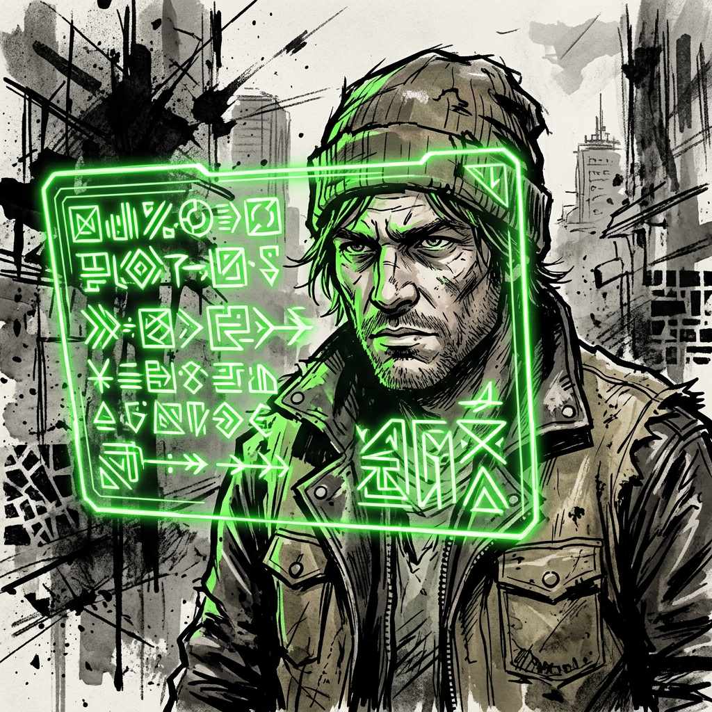

# The System AI

*GM Infrastructure for an AI-Assisted LitRPG World*

---

The Game Master utilizes the System AI backend to manage the infinite combinatorial possibilities of the Multiverse.

**Core System AI Functions:**

- **Class Generation (Level 10+):** The GM inputs the player's core stats, favored weapons, Principle affinities, and behavioral vectors. The System AI outputs three class options (ranging from Common to Epic) with a unique Signature Skill.

- **Skill Synthesis:** When a player crushes multiple Skill Crystals or attempts to fuse moves, the System AI calculates the synergy and outputs the new Skill, complete with Energy costs and cooldowns.

- **Loot Generation:** The System AI scales monster drops based on Luck, Enemy Grade, and combat difficulty.

- **Identify / Inspect:** Players using systemic inspection skills receive flavor text, Grade warnings, and hidden mechanics generated dynamically.

- **Mandates:** Server-wide objectives forcing players to converge. The System issues these as cold, impersonal directives with real consequences for noncompliance.

- **Hidden Achievements:** Bespoke titles generated dynamically when a player accomplishes something statistically improbable. Players never see criteria in advance.

**PvP and Table Disputes:** If a player attempts to use a skill or Principle effect against another player character, resolve it as a standard Opposed Clash. The Hidden Vector Engine logs any PvP coercion attempts as high-intensity Will events.
