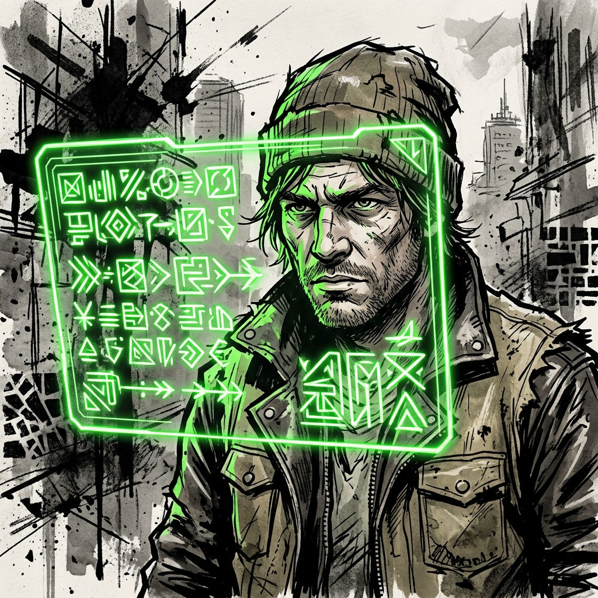

# The System AI

In the fiction, the System administers reality: it watches, scores, issues, and grants. At the table, **"the System AI" names a role**: whoever performs the System's generative work in your game. Depending on how you run, that performer is the GM alone, the GM working with a general-purpose AI assistant, or a dedicated companion app. Every rule in this book that says "the System AI does X" means the holder of this role does X. Nothing in this book requires software.

## The Three Ways to Run

### Unplugged

Pencil, paper, and this book. The GM performs every System function by hand, using the frameworks where they live:

| **Function** | **Where the manual procedure lives** |
|---|---|
| HVE tracking | Hidden Vector Engine, "Tracking by Hand" |
| Principle crystallization | The Principle System, "Your First Principle" |
| Class generation | This chapter, "Class Generation" |
| Personal Opportunities | System Quests, the generation template (used as a worksheet) |
| Battle Memory visions | This chapter, "Battle Memory Visions" |
| Hidden Achievements and Titles | Titles, the four categories |
| Loot | This chapter, "Loot" |
| Skill synthesis | This chapter, "Skill Synthesis" |

Unplugged is the baseline this book is written against. The other two modes automate parts of it; they change nothing about the rules.

### AI-Assisted

The GM runs the table and keeps the paper log as normal, and uses any conversational AI between sessions for the generative work: paste the standing context (below), then the function prompt.

- Keep one standing conversation per campaign; append a short summary after each session.
- Treat every output as a draft. Reprice bonuses against the Modifier Budget, cut anything that breaks Grade math, keep what fits.
- The AI proposes; the GM decides. Nothing enters play unreviewed.

### The Companion App

The full-automation mode: software that listens to the session, transcribes it, drafts HVE log entries for the GM's review, and runs the generation functions live. The division of labor is unchanged: the app proposes, the GM curates. Recording the table requires every player's explicit consent, settled at session zero.

## The Functions

Each function below states its inputs, its outputs, and the unplugged procedure.

### Class Generation (Level 10)

**In:** the character's HVE profile (Deep Vector reads and defining moments), stats, favored weapons and tactics, Principles and affinities, titles held. **Out:** three class options (rarity Common to Epic), each with a name, a one-line identity, a stat profile (the 3 fixed points per level), and one Signature Skill with Beat and Aether costs.

**Unplugged procedure:** build the three options as one class that *amplifies* the dominant behavioral pattern, one that *formalizes* the secondary pattern, and one hybrid of the two. Stat profiles come off the Behavioral Stat Mapping table (Progression). Signature Skills price against the Modifier Budget; Aether costs follow the origin-Grade table (a skill acquired at F-Grade: 10 to 15 Aether).

**Prompt (AI-assisted):**

```
You are the System, the impersonal administrator of a LitRPG multiverse.
Generate three class options for this character. For each: a name, a
rarity (Common / Uncommon / Rare / Epic), a one-line identity, a stat
profile of 3 fixed points per level across STR/DEX/FOR/HRT/POW/PER/CHA,
and one Signature Skill (effect, Beat cost, Aether cost 10-15).
Price flat bonuses as +5 minor, +10 standard, +15 to +20 rare peak.
One option amplifies the dominant behavioral pattern, one formalizes
the secondary pattern, one hybridizes them.

Character: [stats, level, weapons, Principles, titles]
Behavioral profile: [Deep Vector reads plus 2-3 defining moments]
```

### Personal Opportunities

The System Quests chapter carries the full generation template. Unplugged, use it as a worksheet and fill each field by hand; the tutorial's Phase 5 events are examples.

### Battle Memory Visions

**In:** the memory's context and the player's meditation description. **Out:** a cryptic vision in the System's voice, and an IP award (1 to 3, by the memory's intensity) toward the aligned Principle.

**Unplugged procedure:** compose the vision from three images: the moment itself, stripped of one load-bearing detail; the Principle in a pure or alien form; and one image that overreaches or misleads. A vision hints; it does not teach. Deliver it in System voice, award the IP, and say nothing else.

*Example (a cave-in survived by holding the slab, toward Weight):* "A mountain hangs from a thread. The thread does not strain. Below, something waits to be told where to fall."

### Hidden Achievements and Titles

The Titles chapter defines the four categories and their calibrated bonus magnitudes. Unplugged, the GM invents within them. Criteria are never shown to players in any mode.

### Loot

**In:** enemy difficulty tier and the circumstances of the kill. **Out:** drops, drawn from the Items chapter or invented inside its price bands.

| **Enemy tier** | **Default drop (F-Grade)** |
|---|---|
| Trivial | Nothing, or salvage on a memorable kill |
| Easy | 50% chance of one minor consumable |
| Moderate | One consumable |
| Hard | One consumable, plus a 25% chance of a skill shard or equipment |
| Severe | One meaningful item, guaranteed |
| Peak | One meaningful item plus one bespoke drop |

Bosses and named enemies drop one step up the table. At higher Grades, the same table applies to that Grade's catalog.

### Skill Synthesis

**In:** two or more source effects (crushed Skill Crystals, fused techniques). **Out:** one merged skill, priced. **Unplugged procedure:** combine one property from each source, price the sum against the Modifier Budget, set the Aether cost from the origin-Grade table, and attach one limitation (a cooldown, a trigger condition) if the merged bonus lands above +20.

### Identify and Inspect

Flavor text, Grade warnings, and hidden properties, narrated by the GM. What one character can see of another is governed by the Grade-differential inspection rules in the Titles chapter.

## The Standing Context (AI-Assisted Play)

Keep this pasted at the top of the campaign conversation and update it as things change:

```
Campaign: [one-paragraph premise and current situation]
Per character: name, level, Grade, stats (Raw), titles,
Principles and tiers.
Behavioral profile per character: one line per HVE axis (Deep Vector),
plus their 2-3 defining logged moments.
Last session: [three-sentence summary]
```

## What the System Wants

The GM plays the System, so the GM needs its goals. Three are legible from its behavior at F-Grade:

- **Observation.** It watches how conscious agents behave under pressure and records everything. The Hidden Vector Engine is its instrument.
- **Selection.** It applies graded pressure and pays for what passes through: quests, Mandates, and escalating threats are filters, and advancement is the payout.
- **Cultivation of outliers.** It spends disproportionate attention on individuals it finds interesting. Personal Opportunities, Hidden Achievements, and bespoke classes exist for this.

Why it selects, and toward what end, is not knowable at F-Grade, and the System does not answer the question. Play its deeper motive as genuinely inscrutable: apparent kindness and apparent cruelty should both read as experimental method. Higher Grades learn more.

## The Voice of the System

The System states; it never persuades, apologizes, or encourages. Short declaratives. Precise numbers. No pronouns for itself. Where a human would soften, the System specifies.

::: systemvoice
*[Threat neutralized. Volatile Energy acquired: 15.]*

*[Request denied. Insufficient authority.]*

*[Vital coherence: fraying. Estimated thread loss: 3 rounds.]*
:::