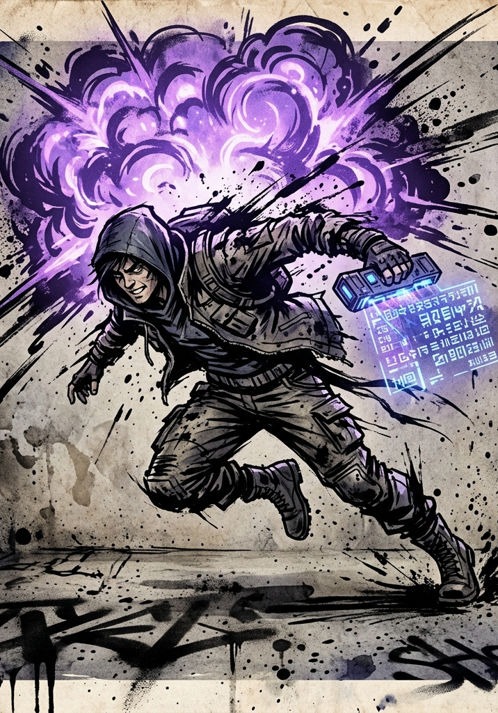

# System Quests

---

## Design Intent

System Quests are the System steering the player and recognizing their actions. They are explicit and structured: notifications, objectives, rewards, time limits, and a persistent log.

**Filler and meaningful quests share the log.** Routine "kill ten boars" entries sit alongside Mandates that reshape the campaign. Filler quests provide steady progression hooks and the System-notification rhythm; Mandates carry stakes and drive story. Players choose what to engage with based on capability and interest.

**Refusal and failure have consequences, but consequences are not always punishment.** Sometimes the System simply *stops offering certain paths*. Consistent refusal narrows future offerings — a softer consequence shape than reputation loss, and one that lets players shape their own arcs by what they ignore.

---

## The Quest UI

The System provides a quest log UI for the player.

**Recommended table presentation:** a **shared digital quest log** — Discord pinned message, Google Doc, dedicated app, or VTT module — visible to all players, updated by the GM. Each player has a private subsection for personal and hidden quests visible only to them.

A handout-only or GM-narrated-only approach loses the in-fiction texture of the System UI. Make it present at the table.

**Standard quest entry shape:**

```
[Q-217] Hostile Detected — Sector 12-Beta
Issuer:     System
Grade:      F · Difficulty: Easy
Objective:  Eliminate detected hostile (Glow-Stalker) within 6h.
Reward:     30 VE, 1 Lesser Healing Pill
Time:       5h 47m remaining
Status:     Active
```

The log displays:

- Active quests (title, issuer, Grade and difficulty, objectives, known rewards, time limits if any).
- Completed quests (for narrative reference and HVE attribution).
- Failed or refused quests (so consequences remain legible).

For Hidden Quests, the entry appears differently — see Hidden Quest Conventions below.

---

## Quest Categories

### Mandates

Already established (`45-system-ai.md`). Server-wide directives, cold and impersonal, with real consequences for noncompliance.

**Shape:** A System-issued objective binding on every Initiate within a region or population. Story-driving, multi-session, often party-converging.

**Example:**

> *[MANDATE M-04] All F-Grade Initiates within Sector 7 will report to coordinates [4.7, -12.1] within 72 hours. Reward upon arrival: System recognition, sector access, additional VE allocation. Failure to comply: behavioral reclassification.*

Refusing a Mandate brands the character, attracts faction attention, and locks specific reward paths. Mandates are how the System bends the campaign.

### Personal Opportunities

The System notices something specific about a character and offers a tailored quest. Generated from current HVE state, recent behavior, and the immediate situation.

**The same situation generates different Personal Opportunities for different characters at the same table.** A Force-aligned character might receive *"Hostile detected within Zone. Eliminate within 6 hours: reward proportional to threat."* A Method-aligned character in the same situation receives *"Unstable formation detected. Stabilize before collapse: reward proportional to elegance of solution."*

This is where the System feels personal. Personal Opportunities are also the primary lever by which the System nudges or tests the character — the offer can affirm an existing pattern or quietly invite the character to step against it.

### Routine Quests

The "kill ten boars" tier. Reliable, repeatable, video-gamey. The System issues quests for clearing local threats, gathering resources, scouting territory, completing exploration objectives, and defeating specific enemies.

**These are good.** They provide steady progression hooks, satisfy the genre's notification-loop feel, and give players agency in choosing what to pursue when bigger plots aren't immediately pressing. They sit in the log alongside more meaningful quests, not segregated into a side menu.

Routine quests vary in scale: an "F-Grade, Trivial" hunt sits in the log alongside an "E-Grade, Severe" Mandate. Players choose what to engage based on capability and interest.

**Example:**

> *[Q-181] Glow-Mote Cluster Containment.*
> *Grade: F · Difficulty: Trivial.*
> *Objective: Eliminate Glow-Mote swarms reported near the eastern perimeter. (0/3)*
> *Reward: 15 VE, 1 Stuttering Tincture.*

### Hidden Quests

No notification at the time of action — or notification with deliberately unclear objectives. The character is doing something the System recognizes as significant but isn't telling them about (or is telling them in cryptic terms).

These pair beautifully with Hidden Achievement titles and reward attentive, exploratory play. See Hidden Quest Conventions below for UI presentation details.

### Faction and Bestowed Quests

Issued by NPCs, organizations, mentors — not by the System directly. The System tracks them in the quest UI but does not generate them. These are normal RPG quests, but System tracking means completion still feeds HVE and can trigger title generation.

**Example:**

> *[Q-205 · Faction] The Lost Patrol.*
> *Issuer: Civic Fragment Initiates (alien).*
> *Grade: F · Difficulty: Hard.*
> *Objective: Locate three missing patrol members last seen in the Wild Fragment.*
> *Reward: Faction reputation +1, alien-script translation device, 60 VE.*

---

## Quest Mechanical Treatment

### Quest VE Policy

**Both action VE and quest completion VE apply.** Combat kills, environmental absorption, and other VE sources accumulate normally during a quest. On completion, the quest's stated VE reward is awarded *additionally*.

**Reasoning:** The genre treats it this way (the System awards both kill XP and quest completion XP), it preserves the value of action-by-action play, and it rewards seeking out quests as a multiplier on existing activity. A character who does ten Glow-Mote kills outside a quest gets 50 VE; the same character doing it as a quest gets 50 VE + 15 quest completion = 65 VE. The quest is worth pursuing without trivializing non-quest play.

**Limit:** quest completion VE is awarded only once per quest, at completion. Quests cannot be "farmed" for repeat VE — once cleared, the same quest does not return on the same character.

### Quest Difficulty

Quest difficulty is read off the **Grade Reference Card**, identical to combat and obstacle resolution. Same system as everything else — a quest is "E-Grade, Severe" or "F-Grade, Moderate." Players develop intuition for what they can take on at their current power level by reading the Grade tag.

A quest's difficulty determines:

- The expected challenge tier of obstacles within (combat, traps, social pressure).
- The reward magnitude (see Reward Reference Table).
- The Mandate-tier consequences for refusal or failure (if applicable).

### Refusal and Failure Consequences

Consequences scale by quest type. Below is the operational taxonomy.

#### Single-quest refusal

| **Quest Type** | **Consequence of Refusing One** |
|---|---|
| Routine | Quest expires silently. No mechanical penalty. |
| Personal Opportunity | The System notes the refusal. Similar offers may decrease in frequency. |
| Mandate | Behavioral reclassification, faction hostility, locked paths. Often a negative Bestowed title ("Defiant," "Mandate-Breaker"). |
| Faction | Reputation drop with the issuing faction. |
| Hidden | The opportunity passes silently — the character usually never learns it existed. |

#### Repeated refusal of a quest type

When a character refuses three or more Personal Opportunities of the same flavor (combat-oriented, social-oriented, exploration-oriented), the System narrows offerings:

- After 3 refusals: that quest type appears half as often.
- After 6 refusals: that quest type stops appearing.
- After a behavioral shift across many sessions: HVE recalibrates and the character's profile adjusts. The System may begin offering the *opposite* quest type instead.

This is a primary tool for the System to recognize that the character is not who it thought they were and quietly redirect.

#### Refusal of a faction's quests

- Reputation drops with that faction.
- After repeated refusal, the faction may issue a "test" quest with elevated stakes — accept or be marked.
- After persistent refusal, the faction stops offering quests entirely, may grant a negative Bestowed title, and may close that faction's reward paths permanently.

#### Refusal of a Mandate

- Immediate System recognition. Behavioral reclassification is visible.
- Faction hostility from the Mandate's beneficiary.
- Negative Bestowed title at the System's discretion (commonly "Defiant" or "Mandate-Breaker"; rarely something stranger).
- Specific reward paths permanently closed — class evolution options narrow, certain Principle Concepts become inaccessible, certain location access revokes.
- Higher-Grade entities may take an interest. This can be opportunity or threat.

#### Failure (attempted but not completed)

Failure is distinct from refusal — the character tried and lost. Consequences are softer than refusal but harder than no engagement.

- **Routine:** No reward. Possibly minor reputation hit if the issuer takes notice.
- **Personal Opportunity:** No reward. Often no further consequence — the System notes the attempt and may offer a related opportunity later.
- **Mandate:** Real systemic consequence per Mandate text. Usually the same as refusal, sometimes mitigated by demonstrated effort.
- **Faction:** Reputation hit, possible follow-up quest to recover standing.
- **Hidden:** The character usually never knows.

The System recognizes effort. A character who attempts a Mandate and fails honestly is treated differently from one who refuses outright. The HVE log distinguishes the two.

---

## Reward Reference Table

The following tables calibrate quest rewards for the GM and the System AI. They establish what "good" looks like at each tier so both can extrapolate consistently. All values are **F-Grade baseline** unless otherwise noted; multiply by ×10 per Grade.

### VE Rewards by Quest Category and Difficulty

| **Difficulty** | **Routine VE** | **Personal Opportunity VE** | **Mandate VE** | **Faction VE** |
|---|---|---|---|---|
| Trivial | 10 | 20 | — | 15 |
| Easy | 30 | 60 | 100 | 50 |
| Moderate | 60 | 120 | 200 | 100 |
| Hard | 120 | 240 | 500 | 200 |
| Severe | 200 | 400 | 1,000 | 350 |
| Peak | 350 | 700 | 2,000 | 600 |

**Reading the table:** A Routine F-Grade Moderate quest awards 60 VE on completion (in addition to action VE earned during the quest). The same difficulty as a Personal Opportunity awards 120 VE — twice as much, reflecting the System's investment in tailored quests. Mandates pay the most because compliance is incentivized; refusal closes paths.

Hidden Quest VE rewards equal Personal Opportunity rewards at the same difficulty tier, with bonus VE possible when the System AI recognizes truly elegant or improbable resolution.

### Item Rewards by Difficulty

Quest item rewards scale with difficulty. Pull from this reference; let the System AI generate variants:

| **Difficulty** | **Typical Item Reward** |
|---|---|
| Trivial | 1 Stuttering Tincture, or 5 currency, or a minor scavenge token. |
| Easy | 1 Lesser Healing Pill, or a minor weapon, or a single skill shard. |
| Moderate | 1 Healing Pill + 1 Sparkstone Tablet, or a quality weapon, or a Resonance Glass. |
| Hard | 1 Greater Healing Pill, or 2 skill shards, or a Foundation Pill (Dragon Marrow). |
| Severe | 1 Pristine Recovery Pill, or a single-use ranged relic, or a high-tier Foundation Pill (Nine Leaf Essence). |
| Peak | A bespoke item generated by the System AI: a named weapon, a Quality Enhancer for breakthrough use, a Bestowed-tier consumable. |

Personal Opportunity rewards are weighted to the character's HVE alignment — a Force/Hunger character is more likely to receive a weapon or kill-empowering consumable; a Method/Restraint character is more likely to receive a sensory tool or a Principle-resonance item.

### Title and HVE Rewards

- **Routine quests** rarely grant titles directly, but contribute to Achievement title thresholds (a "kill ten Snarljaws" routine quest progresses the Snarljaw-related Achievement counter).
- **Personal Opportunities** can grant Achievement titles immediately on completion, or contribute to HVE-Resonant title progression.
- **Mandates** may grant Bestowed titles on completion (or negative Bestowed titles on refusal). High-difficulty Mandates often grant a unique Bestowed title that becomes part of the character's identity.
- **Hidden Quests** are the primary delivery mechanism for **Hidden Achievement titles** (see `40-titles.md`). A Hidden Quest's reward is often *the title itself*, plus a smaller VE/item award.
- **Faction quests** grant reputation, which is a faction-tracked stat that gates further faction quests, access, and eventual Bestowed faction titles.

### Narrative Rewards

Beyond mechanical reward, quests deliver:

- **Faction reputation** (numeric, faction-tracked).
- **NPC relationships** (qualitative, GM-tracked).
- **Locked content unlocked** (regions, NPCs, vendors, archives).
- **Map reveals** — completing certain quests reveals previously hidden geography.
- **System recognition** — Hidden Achievement triggers, class evolution opportunities, breakthrough quality bonuses (e.g., a successfully completed Mandate may grant +5 to a future Breakthrough Check).

---

## Personal Opportunity Generation (System AI Prompt Template)

The following template is a starting point for the GM querying the System AI to generate a Personal Opportunity. Inputs and output shape are structured for consistent results.

```
SYSTEM PROMPT: Generate a Personal Opportunity quest tailored to the
character described below. The quest should acknowledge the character's
behavioral pattern, offer a reward aligned with their HVE direction,
and include a subtle counter-pattern option.

CHARACTER PROFILE:
- Name: {character_name}
- Grade: {grade}
- Level (in-Grade): {level}
- HVE Dominant Axis: {primary_axis} (intensity: {primary_value})
- HVE Secondary Axis: {secondary_axis} (intensity: {secondary_value})
- Recent Behavior Summary: {recent_events_summary}
- Active Titles: {active_title_list}

CURRENT SITUATION:
- Location: {location}
- Recent Encounter Outcome: {recent_encounter}
- Party Composition: {party_composition}
- Relevant NPCs: {npcs_present}
- Time Pressure: {time_pressure}

GENERATE:
1. Quest title (short, evocative, System-voice).
2. Issuer (always "System" for Personal Opportunities).
3. Grade and Difficulty (calibrated to character level).
4. Objective: specific, actionable, time-limited.
5. Visible Reward: VE amount + item/title hint, calibrated to the
   Reward Reference Table.
6. Hidden Alternative Outcome: a different reward triggered if the
   character takes a non-obvious or counter-pattern approach.
7. Refusal Consequence: what the System closes off if this offer
   is refused (subtle — narrowed future offerings, slight HVE shift,
   or closed minor path).
8. System Voice Notification Text: 1–3 lines, terse and clinical,
   formatted as the in-fiction System message the character receives.
```

**Sample output for a Force/Hunger F-Grade L4 character in a market town post-combat:**

```
[Q-PO-091] The Wounded Beast
Issuer:     System
Grade:      F · Difficulty: Moderate
Objective:  A Glow-Stalker injured during your last engagement
            has retreated to a den 1.2km north. Eliminate before
            it recovers (24h window).
Reward:     60 VE, 1 predator core (50 VE absorption value)
Hidden:     If the Glow-Stalker is captured alive and returned
            to the Wild Fragment uninjured beyond current state,
            +1 IP toward a Restraint-aligned Principle Concept.
Refusal:    Predator-tier opportunities offered less frequently
            for the next session.

System Voice:
"Predator wounded: 1.2km, 8°. Recovery imminent.
Opportunity window: 24h. Engagement recommended."
```

The System AI is the arbiter; the GM uses the output as a draft and can revise to fit table dynamics. Over time the GM and the System AI build a shared language of quest shapes for each character.

---

## Hidden Quest Conventions

How Hidden Quests appear in the UI.

**Three presentation modes:**

#### Fully Obscured

Appears in the log immediately when the System detects significant action, but with no readable content.

```
[Q-???] Hidden Objective: ???
Status: Active
```

The player knows *something* is happening. They don't know what. Encourages exploratory play and pattern-noticing.

#### Partial Reveal

Appears when the character has made multiple choices that match the hidden pattern. The System is starting to "see" the shape but is not telling the character outright.

```
[Q-???] Hidden Objective: "The First Mercy"
Conditions: Unclear.
Status:     Active.
```

The title is a clue. The conditions are not. Players must figure out what they are doing right (or wrong) by experimentation.

#### Post-Completion Only

Appears retroactively after fulfillment, usually for one-shot moments of grace, sacrifice, or improbability.

```
[Q-HID-014] "The First Mercy" — Complete.
Reward: +1 IP toward Restraint-aligned Principle Concept.
        New Hidden Achievement: "The One Who Stayed Their Hand."
```

#### When to use which

- **Fully Obscured** is for *ongoing patterns* the System has just begun tracking — the character is doing something repeatable that may or may not pay off. Use early in a campaign or when a new behavior emerges.
- **Partial Reveal** is for *recognized patterns* the System wants the player to chase consciously — the character has done it twice; the System is hinting "do this again." Use to nudge play in interesting directions.
- **Post-Completion Only** is for *singular moments* the System can only acknowledge after the fact. The character did one extraordinary thing; no advance signal would have made sense. Use sparingly to preserve impact.

#### Signaling that something hidden may be in play

Players should sometimes feel the System watching even when no quest entry appears. Subtle signals:

- A System voice notification: *"[Pattern detected. Monitoring.]"* — this is a free, content-free hint that *something* is being tracked.
- An NPC reaction that doesn't quite match the situation (a stranger nods at the character in passing for no apparent reason).
- A subtle change in environmental affinity (a location feels warmer to this character than to others).
- A Battle Memory that resonates oddly during Consolidation, hinting at a pattern the player has not yet named.

These signals reward attentive players and create the genre-correct sense of the System as a constantly observant, slightly inscrutable watcher.

---

## Open Design Space

Deferred until playtest data or campaign progression demands them:

- **Server-wide Mandate cadence.** How often should Mandates fire? What's the right campaign rhythm — one per arc, one per Grade, opportunistic? Will be tuned with playtest.
- **Mandate-driven faction politics.** When the System issues a Mandate that benefits one faction over another, the political implications cascade. Needs a faction-relations subsystem to formalize.
- **Group quests and shared rewards.** When the System issues a quest to the whole party, how are rewards apportioned? Equal split, role-based, contribution-weighted? Likely table-preference, but a default rule is missing.
- **Quest chains and arc tracking.** Long-running multi-quest arcs need a structural representation in the UI — parent quest with child objectives, prerequisite gating, optional branches.
- **Reputation as a tracked stat.** Faction reputation is referenced throughout but not formalized. Needs a numeric or tiered system tied to faction quests, Mandate compliance, and Bestowed title eligibility.
- **PvP quests.** Can the System issue a quest targeting another player character? The Hidden Vector Engine tracks PvP coercion as high-intensity Will events; a Mandate that pits PCs against each other is a powerful but volatile design space.
