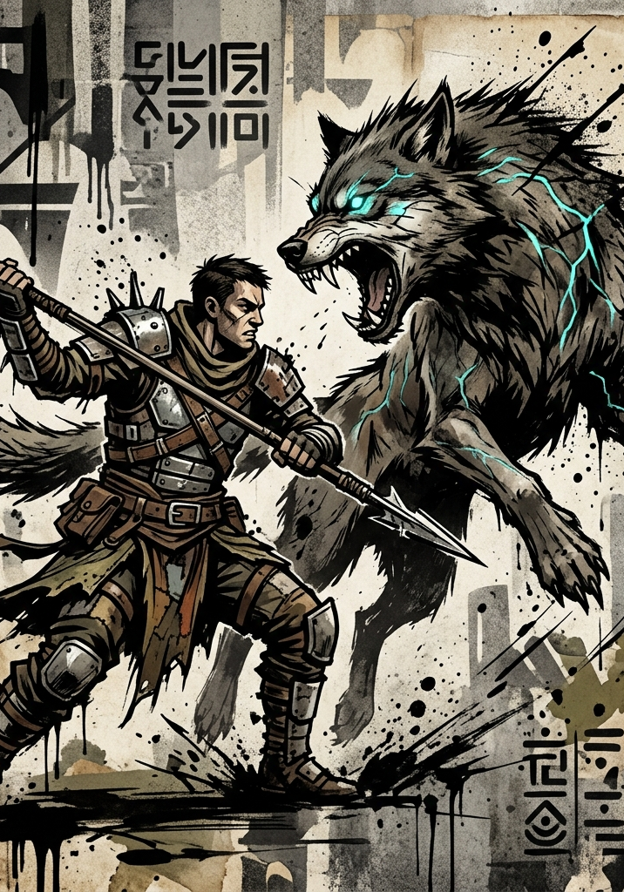

# Bestiary

---

## How to Read a Stat Block

Every stat block lists only the values relevant for the Clash. Force values are pre-extracted at the creature's Grade and printed as two digits; a leading zero marks a value below the Grade band, exactly as on a character sheet. HP equals 2 × the creature's effective Raw FOR; Aether is listed only for creatures that use Principle Applications or active skills. Beats per turn, governing offensive Force, governing defensive Force, and tactical notes complete the entry.

Most F-Grade enemies have Force values in the 04–40 range and HP in the 8–80 range. A mid-tier F-Grade enemy can threaten a starting character; by Level 10, the same enemy is trivial.

**Difficulty tier maps to the Grade Reference Card and to VE reward**: a kill pays each participant the tier's multiple of their own Peer Kill (see Cultivation, "Awarding VE"). A "Moderate" enemy is balanced for a peer character (similar Force values); an "Easy" enemy is a clear underdog; a "Hard" enemy is a dangerous fight; a "Severe" or "Peak" enemy is boss-tier.

**Yield.** A creature does not Yield unless its entry says **Yields**. One that does uses the rule characters use: it gives up Beats from its next turn to cut an incoming Margin by 20 each. This is the cleanest dial for making a single enemy last, because the creature buys its survival out of its own offense. A solo elite that Yields runs roughly a third longer and stays about as dangerous. Giving Yield to a whole group is usually a mistake: several enemies all yielding turns a fight into a grind while multiplying the attacks coming back at the party. Use it on one enemy, and reach for a group only when the grind is the point, as with a disciplined shield line that is meant to feel immovable.

**Grade and tier are different axes.** Every entry states its Grade; every entry in this chapter is F-Grade. Tier names size an enemy against opposition of its own Grade only. Across Grades, the Cross-Grade rules take over: the higher-Grade side adds +100 per Grade of difference to its Clash rolls and keeps its own damage multiplier, so an enemy the E-Grade card calls Trivial is still a Severe encounter or worse for a full F-Grade party.

Use these as references, not rigid templates. Adjust HP, Force values, and abilities to match the moment. A "Hard" encounter for an L3 party may be one Pre-System Brigand with terrain advantage; a "Hard" encounter for an L8 party may be three Snarljaws plus their Alpha.

---

## Trash Tier (Trivial / Easy)

### Glow-Mote Swarm
*A cloud of bioluminescent stinging insects, drawn to body heat.*

- **Grade:** F · **Tier:** Trivial- **HP:** 10 · **Beats:** 1
- **Off Force (DEX, sting):** 05
- **Def Force (DEX, evasion):** 08
- **Tactics:** On a successful hit, target is **Exposed** for one round (vision dazzle from bioluminescence).

### Husk Crawler
*A pre-System corpse animated by residual integration energy. Slow, persistent, dumb.*

- **Grade:** F · **Tier:** Trivial- **HP:** 16 · **Beats:** 1
- **Off Force (STR, claws):** 04
- **Def Force (FOR, dead flesh):** 08
- **Tactics:** Will not flee. Ignores Free Strikes when leaving a Zone; it does not register the threat.

### Frenzy Rat
*A small, vicious creature warped by ambient energy. Scampers and bites.*

- **Grade:** F · **Tier:** Easy- **HP:** 12 · **Beats:** 2
- **Off Force (DEX, bite):** 12
- **Def Force (DEX, scampering):** 12
- **Tactics:** Always attempts to flank. When two or more Frenzy Rats share a Zone with their target, all of them gain +10 (Flanking).

### Pre-System Brigand
*A surviving human bandit, integrated but unambitious. Cowardly, predictable.*

- **Grade:** F · **Tier:** Easy- **HP:** 14 · **Beats:** 2
- **Off Force (STR, club; or DEX, knife):** 08 / 07
- **Def Force (FOR or DEX):** 07 / 07
- **Tactics:** Flees when Turned Aside or when reduced below half HP. Carries 1d3 Stuttering Tinctures and a crude weapon.

---

## Peer Tier (Moderate)

### Snarljaw
*A pack-hunting beast, maw lined with serrated bone.*

- **Grade:** F · **Tier:** Moderate- **HP:** 24 · **Beats:** 2
- **Off Force (STR, fang and claw):** 14
- **Def Force (DEX):** 18
- **Tactics:** Pack hunter: gains +10 (Flanking) when another Snarljaw is in the same Zone. On a successful hit, may spend its second Beat instead of attacking again to drag prey down (target becomes **Exposed** for next round).

### Glow-Stalker
*A camouflaged predator from the bioluminescent forests. Hunts via ambush.*

- **Grade:** F · **Tier:** Moderate- **HP:** 20 · **Beats:** 2
- **Off Force (DEX, ambush strike):** 22
- **Def Force (DEX, fade):** 22
- **Tactics:** Begins encounter unseen unless detected by an active Perception Clash. Surprise Beat on first turn. Withdraws to the Zone edge after striking; favors hit-and-run over sustained combat. If pinned, fights frantically, gaining +5 Off Force when below half HP.

### Training Sentry
*A military construct from the Martial Remnant. Predictable patterns; escalating threat.*

- **Grade:** F · **Tier:** Moderate- **HP:** 50 · **Beats:** 2
- **Off Force (STR, hammerblow):** 18
- **Def Force (FOR, plating):** 25
- **Tactics:** Immune to mental and coercive attacks (no HRT layer). A character may spend 1 Beat observing instead of attacking; their next Clash against the Sentry gains +5 (study). **Escalation:** after 3 rounds of combat, the Sentry shifts to combat-mode protocols and its Force values increase by +5.

---

## Elite Tier (Hard)

### Rival Initiate
*Another integrated human, dropped from a parallel tutorial. Tactically competent, hostile.*

- **Grade:** F · **Tier:** Hard- **HP:** 56 · **Aether:** 22 · **Beats:** 2
- **Off Force (DEX, bladework):** 30
- **Def Force (DEX or FOR):** 30 / 28
- **Tactics:** **Yields.** Wields a Knife (Trained blades, +5). Has one Seed Application: **Searing Strike** (costs 10 Aether, +10 to next Clash, deals damage as fire). Uses positioning intelligently and will retreat to advantageous terrain. Carries 1 Lesser Healing Pill.

### Husk Sentinel
*A heavier construct from the Civic Fragment. Durable, counter-aggressive.*

- **Grade:** F · **Tier:** Hard- **HP:** 80 · **Beats:** 2
- **Off Force (STR, glaive sweep):** 35
- **Def Force (FOR, plating):** 40
- **Tactics:** **Yields.** When the Sentinel wins a defensive Clash, it gains a free **Counterstrike**: one Clash at no Beat cost against the failed attacker. Resistant to mental attacks (treat HRT Force as 25 for defensive purposes).

### Alpha Snarljaw
*Pack leader. Coordinates lesser Snarljaws, hits with sundering force.*

- **Grade:** F · **Tier:** Hard- **HP:** 64 · **Beats:** 2
- **Off Force (STR, sundering bite):** 30
- **Def Force (DEX):** 28
- **Tactics:** **Pack Tactics.** While any other Snarljaw is in the same Zone, all of them gain +10 to Clashes. When the Alpha lands a hit, it deals +5 bonus damage on the Margin (sundering jaw). Will not flee; defends the pack to death.

---

## Boss Tier (Severe / Peak)

### Fragment Wraith
*A spiritual remnant: the dying coherence of a fallen cultivator's mind, given temporary form by ambient energy.*

- **Grade:** F · **Tier:** Severe- **HP:** 120 · **Aether:** 65 · **Beats:** 2
- **Off Force (POW, mind-leach):** 65
- **Def Force (HRT, spectral):** 60 · (PER, vs. illusion-piercing): 70
- **Tactics:**
  - **Yields.** The Wraith gives ground as smoke does, sliding out of a Zone rather than taking the blow.
  - **Incorporeal:** STR/DEX physical attacks are at −10 unless the weapon or attack carries an active Principle infusion.
  - **Mind-Leach (1 Beat, 10 Aether):** target rolls HRT defense. On a hit, deal damage as normal AND drain 1 Aether from the target per damage point dealt. The Wraith adds drained Aether to its own pool, up to its Max.
  - **Vulnerability:** PER-based attacks (Sensory Pulse, Light or Truth Principles, scanning skills) deal +10 bonus damage on the Margin.

### Corrupted System Warden (*Tutorial Boss*)
*A massive maintenance construct that was supposed to manage the tutorial's dissolution. Now it is glitching, deranged, and trying to reach the gate before the Initiates do.*

- **Grade:** F · **Tier:** Peak- **HP:** 190 · **Aether:** 75 · **Beats:** 3
- **Off Force (STR, gauntlet smash):** 80 · **(POW, energy lash):** 75
- **Def Force (FOR, plating):** 95 · (DEX, evasive shift): 60
- **Tactics:**
  - **Indifferent Mode:** While at full HP, the Warden ignores the party. It moves toward the gate using all 3 Beats per turn (one Zone of movement per Beat). It does not attack unless attacked.
  - **Hostile Mode:** Once it has lost a quarter of its HP, the Warden becomes aware. It uses 2 Beats for attacks and 1 Beat for movement.
  - **Yields.** The Warden is too massive to be moved far; when it gives up both Beats it plants itself and absorbs, staying in its Zone.
  - **Glitch Cascade:** Whenever the Warden rolls a System Volatility explosion (natural d100 of 96+), the construct's targeting reroutes erratically. The next attack against the Warden by any combatant gains +20.
  - **Tutorial Note:** This encounter is **not winnable in a straight fight at F-Grade**. Players succeed by reaching the gate, slowing the Warden, exploiting Glitch Cascades, and using Volatile Artifacts (skill shards in particular). The Multi-Path Resolution in the Tutorial chapter describes how each tested competence can contribute.

---

## GM Reference: Encounter Building

When in doubt, use the Grade Reference Card. A character with Force 30 fighting an enemy with Force 30 is a peer fight (Moderate). Add +10 to enemy Force for a tougher engagement, subtract for an easier one.

**Encounter sizing for an F-Grade party of 4:**

| Party Level | Easy Fight | Standard Fight | Hard Fight |
|---|---|---|---|
| L1–3 | 2 Trivial | 1 Easy + 1 Trivial | 1 Moderate or 2 Easy |
| L4–7 | 2 Easy | 1 Moderate + 1 Easy | 1 Hard or 2 Moderate |
| L8–12 | 2 Moderate | 1 Hard + 1 Moderate | 1 Severe or 2 Hard + 1 Easy |
| L13–20 | 2 Hard | 1 Severe + 1 Hard | 1 Peak or 2 Severe |
| L21–25 | 2 Severe | 1 Peak + 1 Hard | Boss + adds |

These ratios assume a balanced party with reasonable equipment. Adjust upward for well-prepared parties; adjust downward when the party is wounded, low on Aether, or out of consumables.

The Hard column assumes the top of the level band. At the bottom of a band, a Hard fight can put the whole party on the floor; run one with a telegraphed escape route or an enemy that has reasons not to finish the job. At Levels 1–3, a landed hit can exceed Max HP outright, and a character at that level pays both Beats to survive one. Expect low-level fights to be spent giving ground. A character hitting the floor is a normal fight, and the Downed rules are the safety net.

Against small enemy groups, a party of four resolves most fights in one or two rounds; only peer-Force elites (a Husk Sentinel, a boss) run longer.

**To make a fight last, give one enemy Yield.** It buys length out of that creature's own action economy, so the fight grows without the danger growing at the same rate.

**Adding bodies multiplies danger.** Every additional creature is two more attacks per round arriving at a party that can only give up so many Beats, so doubling the enemy count is closer to quadrupling the danger than to doubling it. Four peer-tier creatures against a party of four is near even odds of losing the whole party. Use extra bodies when you intend that, and never as a way to pad a fight's length.

**Terrain is a lethality dial.** A corridor, a sealed room, a ledge, or a closed ring of enemies leaves nowhere to be driven, which caps Yield at one Beat and roughly doubles the danger of the same stat blocks. Announce the geometry before the first roll so the table can choose to fight elsewhere.

If a fight drags past round 5, raise the stakes: introduce a complication, escalate the enemy's tactics, or end it decisively.

**When a player character goes Downed:** mindless creatures (Husk Crawlers, Glow-Motes, Frenzy Rats) do not execute; they turn to the nearest live threat, or begin dragging prey away, which is its own kind of clock. Pack hunters guard a kill rather than finish it. Intelligent enemies (Brigands, Rival Initiates, the Warden) may execute, and the threat should be telegraphed a Beat early so the table can react. See Core Mechanics, "Downed and Death."
