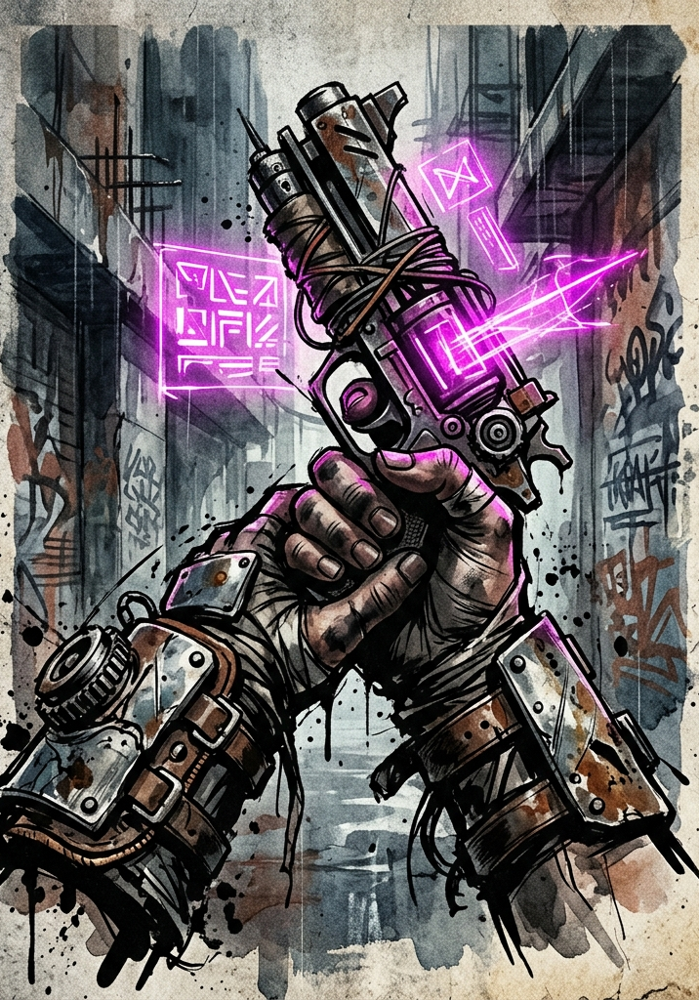

# Items, Consumables & Volatile Artifacts

---

## Design Notes

This document covers the practical items players encounter during F-Grade play — the consumables, weapons, and one-shot oddities that fill the spaces between treasure tiers. The full economy, crafting professions, and merchant systems are deferred. This is what the GM needs at the table for the prototype.

All Toxin Points referenced below interact with the Toxin Tolerance rule (Cultivation §Toxins & Impurities). A character whose accumulated Toxin exceeds Tolerance suffers Consolidation efficiency loss; pushing well above tolerance risks permanent stat degradation.

---

## Consumables

### Healing Pills

Restore HP instantly. Adds Toxin Points. Consumed as a **free action** on the user's turn, or as a 1-Beat action to administer to an ally in the same Zone.

| **Pill** | **Grade** | **HP Restored** | **Toxin Added** |
|---|---|---|---|
| Stuttering Tincture | F | 5 | 2 |
| Lesser Healing Pill | F | 15 | 5 |
| Healing Pill | F | 30 | 10 |
| Greater Healing Pill | F | 50 | 20 |
| Pristine Recovery Pill | F | 80 | 40 |

E-Grade pills heal ×10 the listed amount and add ×10 Toxin (if the user can metabolize them — F-Grade systems are prone to violent reactions when ingesting E-Grade materia, often inducing temporary Saturation).

**Healing pills cap at the user's Max HP.** Excess healing is wasted.

#### Pill Saturation in Combat

Pills are emergency tools, not infinite reservoirs. The body's energy channels accept healing in diminishing quantities — chugging the entire stash does not make a character immortal.

Within a single combat scene, each healing pill consumed by a given character heals at progressively lower efficiency:

| Pill # in this combat | Efficiency |
|---|---|
| 1st | 100% (full listed value) |
| 2nd | 50% |
| 3rd | 25% |
| 4th | 12% |
| 5th and beyond | half-again per pill, until rounded to 0 |

Round down at each step. Once a pill would heal 0 HP, the character is **saturated** and further pills have no healing effect for the remainder of the combat scene. Energy Pills follow the same diminishing schedule, tracked separately from healing pills (a third Healing Pill does not affect the next Energy Pill's potency).

**Toxin still accrues at the listed amount per pill regardless of efficiency.** A desperate character chugging pills in a long fight pays the full Toxin price even after the heals stop landing — the body absorbed the impurities without absorbing the medicine.

**Administering a pill to an ally** remains a 1-Beat action. The ally's saturation count increments, not the user's.

**Out-of-combat Consolidation rest** resets all saturation counts. The body has time to clear residual saturation between encounters.

**Foundation Pills are exempt** — they are not consumed during combat.

### Energy Pills

Restore Energy mid-encounter. Toxin cost.

| **Pill** | **Grade** | **Energy Restored** | **Toxin Added** |
|---|---|---|---|
| Sparkstone Tablet | F | 10 | 5 |
| Lesser Energy Pill | F | 25 | 10 |
| Energy Pill | F | 50 | 25 |
| Greater Energy Pill | F | 80 | 50 |

Energy Pills exist but should be rare. Energy is meant to be a scarce resource that primarily refills through Consolidation; Energy Pills are emergency tools, not crutches. A party with reliable access to Energy Pills will short-circuit the design intent of the Energy system.

### Foundation Pills

See the Breakthroughs document for full rules. Brief reference:

| **Pill** | **Grade** | **Breakthrough Bonus** | **Toxin Added** |
|---|---|---|---|
| Dragon Marrow Pill | F | +5 | 15 |
| Nine Leaf Essence | F | +10 | 30 |
| Heavenly Foundation Pill | F | +15 | 50 |

Foundation Pills are consumed during Beat 1 of a Breakthrough (Preparation phase). Only one Foundation Pill effect applies per Breakthrough — the body cannot metabolize multiple at once.

---

## Weapons (F-Grade Reference)

Weapons in this system don't deal flat damage — they determine which Force is governing for an attack and may grant a small **Skill Bonus** to the Clash. Quality and craftsmanship matter narratively but do not break the math.

| **Weapon** | **Governing Force** | **Skill Bonus** | **Notes** |
|---|---|---|---|
| Crude Club | STR | +0 | Found objects, broken table legs. |
| Knife / Dagger | DEX | +5 | Quick, concealable. Throwable as one-shot ranged. |
| Spear | DEX | +5 | Reach: free Disengage from one Zone-edge enemy per turn. |
| Battle Axe / Greatsword | STR | +10 | Heavy. Cannot be wielded with under STR Force 5 without Soft Failure on every Clash. |
| Short Bow | DEX | +5 | Ranged: target enemies in adjacent Zones. |
| Crossbow (single-shot) | DEX | +10 | Requires 1 Beat to reload between shots. |
| Quarterstaff | STR or DEX | +5 | Versatile: choose Force at attack time. |
| Hand Axe (thrown) | STR | +5 | Ranged: one Zone. Recoverable. |

These are intended as starting and recovery tier. Higher-quality weapons (named, System-forged, Principle-attuned) are bespoke items the GM designs as treasure or quest rewards.

**Wielding without proficiency:** A character with no relevant Proficiency may still use a weapon, but loses the Skill Bonus. A trained soldier with a Greatsword adds +10; a librarian swinging the same blade adds +0.

---

## Volatile Artifacts (One-Shot and Tutorial-Grade)

Volatile Artifacts are scavenged debris from dead worlds, half-functioning constructs, and degraded shards of higher-tier equipment. They are unreliable, frequently single-use, and core to the tutorial's economy.

### Reactive Buckler

A small shield that absorbs one impact before its protective field collapses.

- **Effect:** Once per encounter, when the wielder would take damage from a physical Clash, reduce that damage to 0. The buckler's field discharges visibly and does not reset until the next Consolidation.
- **Limitations:** Does not protect against mental, spiritual, or illusion-based attacks. Does not negate the Margin — only converts damage to 0 after the Clash resolves. Does not work against attacks the wielder did not see coming (Surprise Beat hits, ambushes from Hidden enemies).

### Degraded Skill Shards

Crystalline matrices containing fragments of dead techniques. Single-use. Activate as a 1-Beat action; the user describes intent and the GM rolls for backfire. Roll **1d100** when activating.

| **Shard Type** | **Effect** | **Backfire (on d100 ≤ 10)** |
|---|---|---|
| Edge Shard | Next Clash this turn gains +20. | Shard cracks: user takes 5 damage. |
| Pulse Shard | Restore 30 Energy. | Energy backlash: user takes 10 Toxin. |
| Veil Shard | Become invisible until end of next turn or until you act offensively. | Veil flickers — you remain visible but appear blurred (+5 to defense, no concealment). |
| Anchor Shard | Until end of next turn, you cannot be moved by any effect, and your Defense Force gains +10. | You become **Rooted** — you also cannot move under your own power. |
| Resonance Shard | Add 1 IP toward a Principle Concept of your choice. | The IP is added to a random Concept the GM selects. |
| Volatile Shard | Roll d100 again. The GM and the System AI generate an unpredictable effect based on the result. | The GM's discretion is the risk. |

Shards are deliberate randomizers. They reward players who use them in moments where a wild outcome is acceptable, and punish those who treat them as reliable tools.

### Sensory Tools

- **Resonance Glass:** Spend 1 Beat. Reveals hidden energy signatures within your current Zone — concealed runes, dormant constructs, Principle resonance points. Does not reveal hidden creatures unless they have an active energy signature (cultivators using skills, magical creatures, etc.). Reusable.
- **Truthbinder Cuff:** Forces a single yes/no answer from one detained, non-hostile target. Single use; the cuff dissolves after activation. Cannot compel meaningful detail — only a binary truth.

### Single-Use Ranged Relic

Devastating weapon, one charge. Common in tutorial scavenger zones.

- **Effect:** A ranged Clash using DEX or POW Force (user's choice) at +20 to the roll. On hit, deals damage as normal but treats the user's Grade as **one tier higher** for the damage Multiplier (an F-Grade user deals E-Grade damage on this hit only — Margin × 10 instead of × 1).
- **Disposable:** After use, the relic burns out and crumbles. Cannot be repaired.

### Other Tutorial-Grade Items

- **Battered Medkit:** Heals 10 HP (no Toxin) when used as a 1-Beat action on yourself or an ally in the same Zone. Three uses before the supplies are exhausted.
- **Low-Grade Armor Scraps:** Heavy. Grants +5 Defense Force when defending with FOR; imposes −5 to DEX-based Clashes (offensive or defensive). Stackable up to one set per character.
- **Sensory Tool (Generic):** Spend 1 Beat. Reveal one hidden feature within your Zone. Single use unless specified otherwise.
- **Battered Communicator:** Allows short-range communication between paired devices. Frequently malfunctions. Useful for the Civic Fragment terminal interaction in the tutorial.

---

## Item Acquisition

For F-Grade prototype play, items appear:

- As **tutorial scavenge** in Volatile Artifact zones (Phase 2 and Phase 3 of the Integration Tutorial).
- As **loot drops** from defeated enemies — the System AI generates tier-appropriate drops per the loot generation rule (System AI document).
- In **dungeon caches**, treasure rooms, and abandoned stockpiles.
- Through **trade with NPCs** in the Civic Fragment or post-tutorial settlements.

Players should not be flush with consumables. Healing Pills are a meaningful resource. The Reactive Buckler that saves a player's life in Phase 5 of the tutorial is supposed to be remembered. The single-use ranged relic that one-shots a tutorial mini-boss is supposed to be a story.

If the party is hoarding consumables and never spending them, the GM is being too generous with drops. If the party is constantly out and dying for want of a Lesser Healing Pill, the GM is being too stingy. Calibrate to encounter density.

---

## Future Expansion

This document covers prototype-tier items only. Deferred for later development:

- **Crafted equipment and named weapons.** Once the Professions system is designed, players can craft, refine, and name their own gear.
- **Principle-attuned items.** Weapons and tools that resonate with specific Principle Concepts and grant attunement bonuses.
- **Set bonuses and equipment synergies.** Multi-piece kits with cumulative effects.
- **E-Grade and higher item tiers.** When the campaign scales, the same six categories scale ×10 per Grade.
- **Bespoke artifacts.** Story-tier items with unique mechanical and narrative weight, generated by the System AI and the GM in collaboration.
