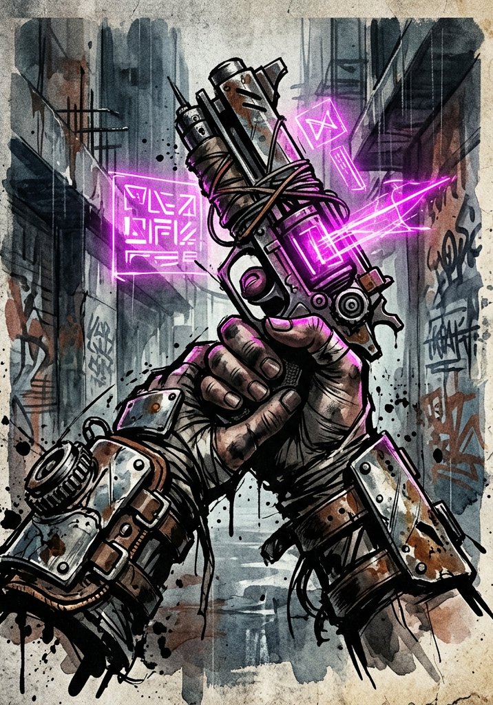

# Items, Consumables & Volatile Artifacts

---

## How to Read This Chapter

This chapter covers the practical items players encounter during F-Grade play: the consumables, weapons, and one-shot oddities that fill the spaces between treasure tiers. The full economy, crafting professions, and merchant systems are deferred. This is what the GM needs at the table.

Every entry here is one of three kinds, and each is labeled:

- **Category.** A class of items. The listed members are the common forms; the GM builds variants inside the same price band and the same rules. Healing Pills and Degraded Skill Shards are categories.
- **Example.** One fully specified item, usable exactly as written and meant as the pattern for building others of its kind. The Reactive Buckler is an example.
- **Unique.** A one-of-a-kind item. Nothing in this chapter is unique; at F-Grade, named and System-forged gear is bespoke treasure the GM designs for the moment.

---

## Consumables

### Healing Pills (Category)

Restore HP instantly. In combat, consuming a pill costs **1 Beat**, spent by whoever takes the action: swallow one yourself, or administer one to an ally in the same Zone. The recipient of an administered pill spends nothing.

| **Pill** | **Grade** | **HP Restored** |
|---|---|---|
| Stuttering Tincture | F | 5 |
| Lesser Healing Pill | F | 15 |
| Healing Pill | F | 30 |
| Greater Healing Pill | F | 50 |
| Pristine Recovery Pill | F | 80 |

E-Grade pills heal ×10 the listed amount for an E-Grade body. **An F-Grade body cannot process one at all:** the concentration is wrong for the frame holding it, and the pill does nothing but leave a metallic burn in the throat and a bad hour afterward. Hoarding higher-Grade medicine against a future Grade is sensible; swallowing it now is a waste of a valuable thing.

**Healing pills cap at the user's Max HP.** Excess healing is wasted.

#### Pill Limit in Combat

The body accepts only so much pill-borne help under stress. **The first two Healing Pills a character takes in a fight work in full. From the third on, pills have no effect on that character until they have spent ten quiet minutes out of combat.** Aether Pills follow the same rule, counted separately: two of each kind work per fight.

**Administering a pill to an ally** counts against the recipient's two, never the administrator's.

**Foundation Pills are exempt.** They are not consumed during combat.

### Aether Pills (Category)

Restore Aether mid-encounter. In combat, consuming one costs **1 Beat**.

| **Pill** | **Grade** | **Aether Restored** |
|---|---|---|
| Sparkstone Tablet | F | 10 |
| Lesser Aether Pill | F | 25 |
| Aether Pill | F | 50 |
| Greater Aether Pill | F | 80 |

Aether Pills should be rare. Aether primarily refills through Consolidation; widely available Aether Pills would collapse the scarcity the Aether system is built on.

### Foundation Pills (Category)

See the Grade Breakthroughs chapter for full rules. Brief reference:

| **Pill** | **Grade** | **Breakthrough Bonus** |
|---|---|---|
| Dragon Marrow Pill | F | +5 |
| Nine Leaf Essence | F | +10 |
| Heavenly Foundation Pill | F | +15 |

Foundation Pills are consumed during Stage 1 of a Breakthrough (Preparation). Only one Foundation Pill effect applies per Breakthrough; the body cannot metabolize multiple at once.

### Attribute Treasures (Category)

Concentrated pieces of something that was strong: the heart of a beast that should not have been able to move that fast, sap from a tree that grew up through stone, marrow from a thing that kept standing. Absorbing one raises a single Attribute's Raw value permanently, and the character chooses which.

| **Treasure** | **Grade** | **Raw Points** |
|---|---|---|
| Lesser | F | +2 |
| Standard | F | +5 |
| Greater | F | +10 |

Values scale ×10 per Grade, matching everything else.

**It takes an hour, and it puts you on the floor.** The body has to come apart a little to be rebuilt. For that hour the character is as defenseless as they are during a Consolidation: no Beats, no defense, aware of very little. Heat under the breastbone, the taste of the thing they ate, and a long stretch where standing up seems like somebody else's idea.

The obvious time to do this is during a rest the party was taking anyway, where the hour costs nothing at all. The memorable time is the hour somebody spent lying on the floor of a ruin, changing, while their friends held the door.

**Grade-locked in both directions,** on the same logic as pills. A treasure carries a concentration meant for a particular frame, so an F-Grade treasure does nothing for an E-Grade body, and an E-Grade treasure does nothing for an F-Grade one except leave a taste like hot metal. Sell it, trade it, or keep it until you have grown into it.

**Excess above the Grade cap is lost.** A treasure that would push an Attribute past 99 at F-Grade raises it to 99 and stops. Together with how rarely they appear, that is the entire brake on the economy: a character can absolutely pour every treasure they find into one Attribute and run it to the ceiling, and the genre expects nothing less.

**How often.** Rare enough to be remembered. A character who hunts hard and explores thoroughly might absorb three or four across an entire Grade; a cautious one might find a single Lesser treasure and be pleased about it for a month. They are the reward for going somewhere dangerous on purpose, and they should never be for sale in a starting settlement. Scarcity is the dial here, and it is the GM's.

**These are not Cores.** A Core or Affinity Crystal releases Volatile Energy, which is fuel for levels (see Cultivation). An Attribute Treasure never touches stored VE at all; it changes the body directly. Both are eaten and only one of them shows up on the Attribute line.

## Weapons (F-Grade Reference)

Weapons do not deal flat damage and carry no bonus of their own. They determine which Force governs an attack and what the implement makes possible. The bonus to the Clash comes from the wielder's Proficiency: **+5 at Trained, +10 at Seasoned or Master, nothing at all untrained.**

The wielder is the weapon. In an Integrated body, accuracy and killing power both come from the person: Force decides them, and the Margin is the physics. The implement decides which Force applies and what reach or range it grants. This is why the tables here carry no damage dice and no high-damage weapon class: a greatsword in weak hands is a slow club, and a knife guided by Force 60 is deadlier than either.

| **Weapon** | **Governing Force** | **Notes** |
|---|---|---|
| Improvised object | STR | Broken table legs, rocks, a length of pipe. No Proficiency bonus applies. |
| Knife / Dagger | DEX | Quick, concealable. Throwable as one-shot ranged. |
| Spear | DEX | Reach: free Disengage from one Zone-edge enemy per turn. |
| Battle Axe / Greatsword | STR | Heavy. Requires STR Force 05; below that, every Clash with it takes −10 (hindering). |
| Short Bow | DEX | Ranged: target enemies in adjacent Zones. |
| Crossbow (single-shot) | DEX | Requires 1 Beat to reload between shots. |
| Quarterstaff | STR or DEX | Versatile: choose Force at attack time. |
| Hand Axe (thrown) | STR | Ranged: one Zone. Recoverable. |

These are the starting and recovery tier. Higher-quality weapons (named, System-forged, Principle-attuned) are bespoke items the GM designs as treasure or quest rewards.

**Wielding without a Proficiency:** a character with no relevant Proficiency may still pick up any weapon and adds nothing to the Clash. A Seasoned soldier with a greatsword adds +10; a librarian swinging the same blade adds +0.

---

## Volatile Artifacts

<!-- worldbuilding pass: opening story slot (related-thread survivor) -->

Volatile Artifacts are scavenged debris from dead worlds, half-functioning constructs, and degraded shards of higher-tier equipment. They are thick on the ground in the Integration Tutorial, which is where most tables meet them first. They are unreliable and frequently single-use. They are also disposable verbs: an artifact in a pocket is a whole new move a character can make exactly once, and which one a player hoards, spends, or hands away tells the System something.

### Degraded Skill Shards (Category)

Crystalline matrices containing fragments of dead techniques. Single-use. Activate as a 1-Beat action; the user describes intent and the GM rolls for backfire. Roll **1d100** when activating.

| **Shard Type** | **Effect** | **Backfire (on natural 01–05)** |
|---|---|---|
| Edge Shard | Next Clash this turn gains +20. | Shard cracks: user takes 5 damage. |
| Pulse Shard | Restore 30 Aether. | Aether backlash: user takes 10 damage. |
| Veil Shard | Become invisible until end of next turn or until you act offensively. | Veil flickers: you remain visible but appear blurred (+5 to defense, no concealment). |
| Anchor Shard | Until end of next turn, you cannot be moved by any effect (moving yourself is fine), and your Defense Force gains +10. | You become **Rooted** for the rest of the encounter: unable to be moved, and unable to move under your own power. |
| Resonance Shard | Add 1 IP toward a Principle of your choice. | The IP is lost. |
| Volatile Shard | Roll d100 again. The GM and the System AI generate an unpredictable effect based on the result. | The GM's discretion is the risk. |

Shards are randomizers. They reward players who use them in moments where a wild outcome is acceptable, and punish those who treat them as reliable tools. New shard types price their effects against the Modifier Budget and keep the natural 01–05 backfire, the same bottom-of-the-die number that governs Catastrophic Failure.

### The Reactive Buckler (Example: Protective One-Shots)

A small shield that absorbs one impact before its protective field collapses. The pattern for defensive artifacts generally: one negation, a visible discharge, a recharge tied to Consolidation, and stated limits.

- **Effect:** Once per encounter, when the wielder would take damage from a physical Clash, reduce that damage to 0 **without giving up any Beats**. The buckler's field discharges visibly and does not reset until the next Consolidation.
- **Limitations:** Does not protect against mental, spiritual, or illusion-based attacks. Does not work against attacks the wielder did not see coming (Surprise Beat hits, ambushes from Hidden enemies). Does not move the wielder, so it is no help against being Driven Back.

The buckler covers the blow a character would otherwise have paid a whole turn to survive. Yielding alongside it is wasted; the damage is already zero.

### Single-Use Ranged Relic (Example: Expended Weapons)

A devastating weapon with one charge, the pattern for burnt-out relics of higher-Grade arsenals.

- **Effect:** A ranged Clash using DEX or POW Force (user's choice) at +20 to the roll. On hit, deals damage as normal but treats the user's Grade as **one tier higher** for the damage Multiplier (an F-Grade user deals E-Grade damage on this hit only: Margin × 10 instead of × 1).
- **Disposable:** After use, the relic burns out and crumbles. Cannot be repaired.

### Sensory Tools (Category)

Artifacts that reveal rather than harm.

- **Resonance Glass:** Spend 1 Beat. Reveals hidden energy signatures within your current Zone: concealed runes, dormant constructs, Principle resonance points. Does not reveal hidden creatures unless they have an active energy signature (cultivators using skills, magical creatures, etc.). Reusable.
- **Truthbinder Cuff:** Forces a single yes/no answer from one detained, non-hostile target. Single use; the cuff dissolves after activation. Cannot compel meaningful detail, only a binary truth.
- **Generic single-use variants** exist throughout scavenge zones: spend 1 Beat, reveal one hidden feature within your Zone, then the tool is spent.

---

## Scavenged Field Gear (Examples)

Mundane survival equipment, battered but functional. The pattern: small flat effects, limited uses, no Aether interaction.

- **Battered Medkit:** Heals 10 HP when used as a 1-Beat action on yourself or an ally in the same Zone. Does not count toward the pill limit. Three uses before the supplies are exhausted.
- **Low-Grade Armor Scraps:** Heavy. Grants +5 Defense Force when defending with FOR; imposes −5 to DEX-based Clashes (offensive or defensive). Stackable up to one set per character.
- **Battered Communicator:** Allows short-range communication between paired devices. Frequently malfunctions.

---

## Item Acquisition

At F-Grade, items appear:

- As **loot drops** from defeated enemies; the System AI generates tier-appropriate drops per the loot generation rule (see The System AI).
- In **dungeon caches**, treasure rooms, and abandoned stockpiles.
- As **scavenge** in ruins and Volatile Artifact zones.
- Through **trade with NPCs** in settlements.

Players should not be flush with consumables. Healing Pills are a meaningful resource. The buckler that saves a life is supposed to be remembered; the relic that one-shots a boss is supposed to be a story.

If the party is hoarding consumables and never spending them, the GM is being too generous with drops. If the party is constantly out and dying for want of a Lesser Healing Pill, the GM is being too stingy. Calibrate to encounter density.

---

## Outfitting the Tutorial (GM Reference)

The Integration Tutorial draws its economy from this chapter. What the tutorial expects:

- **Phases 2 and 3 are the scavenge phases.** Starting weapons, armor, and consumables all come from landing-zone debris and the Recycling Node; the default loot list lives in the tutorial's Phase 3.
- **The Recycling Node's scarcity is deliberate.** One spear, one armor set, one buckler, four shards, one pill, one Resonance Glass for a full party: the shortfall is the point, and the division of it is HVE signal.
- **One Resonance Shard sits in that pile and it is the sharpest test in the tutorial.** Everything else on offer is power this afternoon; the Resonance Shard is one point of insight toward a Principle the character cannot yet name or price. Say only that it resonates.
- **One Attribute Treasure** sits in the Wild Fragment's predator den, and it is the price of a decision rather than a find. Do not place a second one.
- **The Battered Communicator** bridges the dead command terminal in the tutorial's Civic Fragment (Phase 4); seed one in Phase 2 or 3 scavenge.
- **The Single-Use Ranged Relic** is common in tutorial scavenger zones and is one of the sanctioned answers to the Phase 5 boss; place at least one where exploration finds it.
- **Volatile Artifacts are core to the tutorial's economy**: they give classless, Principle-less characters verbs beyond posture and position. Be generous with shards, stingy with pills.
- **Items fill three roles for a classless character,** and the tutorial leans on all three: shards and one-shots are **verbs** (a move available once), weapons and armor are **vessels** (no bonus of their own, they decide which Force governs and route Marks toward the domains a character uses), and Resonance Shards and affinity treasures are **seeds** (insight paid forward).

---

## Future Expansion

This chapter covers F-Grade items only. Deferred for later development:

- **Crafted equipment and named weapons.** Once the Professions system is designed, players can craft, refine, and name their own gear.
- **Principle-attuned items.** Weapons and tools that resonate with specific Principles and grant attunement bonuses.
- **Set bonuses and equipment synergies.** Multi-piece kits with cumulative effects.
- **E-Grade and higher item tiers.** When the campaign scales, the same categories scale ×10 per Grade.
- **Bespoke artifacts.** Story-tier items with unique mechanical and narrative weight, generated by the System AI and the GM in collaboration.
