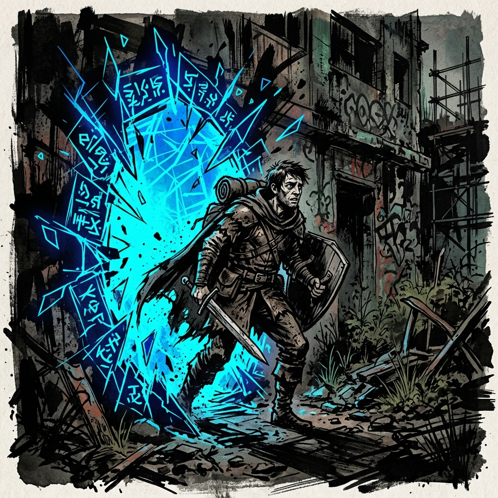

# The Tutorial: Integration Protocol

*Design Document, v2.0*

---

## Pre-Tutorial Setup

Before the first session, each player has built a character per `15-character-creation.md`:

- 40-point buy across the seven Attributes (floor 3, cap 10).
- Three Proficiencies, written in plain language.
- Optionally, one **Initial Insight** toward a Principle Concept (passive only, narrative permissions, no active ability — see "Starting Principle Access" in Character Creation).
- Derived stats calculated: Max HP = Raw FOR, Max Energy = Raw POW, VE Tolerance = (FOR + POW)/2 × 10, Level 1, Grade F.

Players begin with **whatever was on their person at the moment of Integration** — phone, keys, backpack, work clothes. The System provides nothing. Starting weapons, armor, and consumables are scavenged in Phase 2.

**GM preparation checklist:**

- [ ] Print or digitize the Grade Reference Card (`05-quick-reference.md`).
- [ ] Pull stat blocks from `60-bestiary.md`: Glow-Mote Swarm, Husk Crawler, Frenzy Rat, Snarljaw, Glow-Stalker, Training Sentry, Husk Sentinel, Fragment Wraith, Corrupted System Warden.
- [ ] Pre-write 5–7 probe variants from Phase 1 (one per player, plus spares).
- [ ] Set up the Quest UI: a shared digital quest log (Discord pinned, Google Doc, VTT module). Each player has a private subsection.
- [ ] Read `40-titles.md` and `55-quests.md` once through. Be ready to issue the first Mandate in Phase 6 and the first Achievement Titles in Phase 7.
- [ ] Have the Stable Abilities catalog (`35-stable-abilities.md`) open during Phase 7.
- [ ] Decide on starting consumables in the Recycling Node (Phase 3) — the default loot list is in that section.
- [ ] Open the HVE event log (`50-hidden-vector-engine.md`, "Structured Event Logging") and be ready to record entries throughout. The tutorial generates dense behavioral signal; capture it.

---

## Design Objectives

The tutorial must accomplish six things simultaneously:

- **Introduce awe and danger.** The Multiverse is vast, ancient, indifferent, and lethal.
- **Expose players to many possible futures.** Martial, arcane, social, and survival paths must all be visible and viable before class selection at Level 10.
- **Generate clean behavioral data.** The Hidden Vector Engine needs signal across all four axes (Force/Method, Hunger/Restraint, Will/Accord, Control/Freedom) before it can offer meaningful class options at L10.
- **Create private decision points.** Group consensus flattens identity. The tutorial must mechanically isolate players at key moments so the Engine gets individual reads, not committee outputs.
- **Teach tone, not rules.** Players should absorb how the System feels — cold, observant, administratively precise — without being lectured on mechanics. Rules emerge through play.
- **End with becoming, not completion.** Players should leave feeling "I have begun turning into someone," not "I finished onboarding."

The tutorial is not a dungeon. It is a curated gauntlet of incompatible incentives designed to force revelation through stress.

### Pacing Target

Three sessions of 3–4 hours each. Session 1 covers Phases 1–3. Session 2 covers Phase 4. Session 3 covers Phases 5–7. The GM can compress to two sessions for experienced groups by tightening Phase 4.

### Expected Mechanical Outcomes

By the end of the tutorial, every player should have:

- Reached **Level 4 or 5** (cumulative VE ~450–700; see Phase 7 ledger).
- Survived at least one Clash that nearly killed them.
- Witnessed at least one System Volatility cascade.
- Made at least three **2.0+ intensity** HVE log events (high-stakes choices).
- Earned **one Stable Ability** drawn from the catalog.
- Earned **at least one Achievement Title** (Hidden Achievement titles are rare but possible).
- Received an **Affinity Notice** hinting at their Principle direction.
- Survived a **Mandate** (the Phase 6 dissolution event).

If any of these is missing at the end of Session 3, the GM should improvise to deliver it before transitioning out of the tutorial.

---

## Mechanics Introduction Schedule

| **Phase** | **What the Players Encounter for the First Time** |
|---|---|
| 1 — Threshold | The System's voice. The probe (HVE seed reads). |
| 2 — Violent Arrival | The Clash. Force. Beats. Zones. First kill. First VE. Volatile Artifacts. |
| 3 — Convergence | System status notifications. The Quest UI. Scarcity. Group dynamics. |
| 4 — Field of Ruins | Volatility cascades. Aura Pressure save. Saturation symptoms. Skill Shards in use. The auto-success rule. |
| 5 — Resonance Isolation | Personal Opportunities. Irreversible solo decisions. The first Battle Memory. |
| 6 — Convergence Crisis | The first Mandate. Boss-tier combat. Sacrifice as a 3.0 intensity choice. |
| 7 — First Recognition | Consolidation. Leveling. Stat allocation. Stable Abilities. Titles. Affinity Notices. Hidden Quest reveals. The Stinger. |

The GM should never stop play to explain a system. If a player asks "how does combat work," the answer is *"roll d100, add your Force, I'll tell you what happens."* Every other rule emerges by encountering it.

---

## Phase 1: The Threshold

**Purpose.** Sever players from Earth. Establish the System as intentional, administered, and uninterested in their comfort. Get one clean behavioral seed read per player before they know they are being tested.

**Pacing.** 5–10 minutes of real time. Do not let players settle in.

### Narrative

Players black out on Earth. No warning, no portal, no quest-giver. They simply stop existing in one place and begin existing somewhere else.

For approximately sixty seconds of subjective experience, they are nowhere. No body. No ground. No light. Pressure and orientation exist. Nothing else does.

Then the System speaks — not in words, but in meaning that arrives pre-translated, like remembering something you never learned:

::: systemvoice
*Consciousness anchored.*

*Native world: Earth. Status: Integrated.*

*Integration stability: provisional.*

*Tutorial rights: granted. Tutorial mercy: limited.*

*Mortality: active.*
:::

The System does not answer questions. It does not wait for acknowledgment. It processes and moves on.

### The Probe

Before the void fractures, each player experiences one brief, private sensory event. Deliver these individually — note, text, brief sidebar, or written card. Each probe is a temperament read; there are no correct answers.

Each probe maps to one or two HVE axes. Log each player's response as **0.5 intensity (Minor)** on the indicated axis.

| **Probe** | **Choice** | **HVE Read** |
|---|---|---|
| A distant sound — something between a voice and a frequency — pulls at your attention. | Turn toward it / Hold still. | Force / Method |
| A shard of light drifts within reach. Contact produces a sharp, hot sensation — not quite pain, not quite information. | Reach again / Withdraw. | Hunger / Restraint |
| A string of symbols appears in your vision, then begins dissolving. You can feel meaning in it, but it's escaping. | Chase it / Let it go. | Force+Method / Restraint |
| Nothing happens. The void is silent. Several seconds pass. | What do you do with the silence? | Patience / Action — observe player priority |
| Another presence is nearby — not hostile, not safe, just *there*. | Reach out / Retreat / Observe. | Accord / Will / Method |
| You feel something beneath you — a current, a pull, a direction the void wants to take you. | Resist / Yield / Try to steer it. | Control / Freedom / Will |
| A name forms in your mind. Not yours. Whose? | Speak it aloud / Hold it silent / Reject it. | Accord / Restraint / Freedom |

After each player commits, deliver one private System voice line, calibrated to their response. Examples:

- *"[Curiosity logged. Threshold tolerance: above baseline.]"*
- *"[Restraint logged. Risk profile: conservative.]"*
- *"[Engagement logged. Pattern fixation: active.]"*

The lines are clinical, brief, slightly unsettling. They establish that the System has *already started watching*.

### GM Notes

This phase should be disorienting and fast. Sixty seconds in the void is about right. Two minutes is the maximum. If players try to "explore" the void, it ends — the System does not reward stalling. If a player tries to communicate with the System, it does not respond. The relationship is observation, not dialogue.

Then the void breaks. Light, sound, gravity, pain — all at once. They fall.

---

## Phase 2: The Violent Arrival

**Purpose.** Deliver spectacle. Create immediate survival pressure. Get isolated behavioral data before groupthink infects the signal.

**Pacing.** 30–45 minutes of real time.

### Narrative

Players do not land together. The System drops them scattered across a 300-yard radius of the tutorial zone — a stitched collision landscape assembled from the wreckage of failed civilizations. A valley where pieces of dead worlds have been bolted together wrong: bioluminescent forest bleeding into rusted machine carcasses, a half-collapsed stone arena butted against crystalline desert, floating arcane debris suspended at impossible angles overhead, weather boundaries where rain becomes ash mid-stride.

The artificiality is obvious. This place was *built*. The seams are visible. The System constructed it to evaluate them and does not care if they know.

### The Isolated Micro-Encounters

Each player wakes alone and faces an immediate situation that demands a response before they can find anyone else. These encounters are brief (5–10 minutes of play each), personal, and have no "correct" answer. Run them in rapid rotation or simultaneously via written prompts.

Below are five canonical encounters. Assign one per player; vary across the table to capture different axes. **Each encounter ends with at least one Clash or one resource decision and concludes with a 1.0 intensity HVE log.**

#### The Dying Scavenger

You wake next to a small, non-human creature — insectoid, broken-limbed, clutching a faintly glowing core to its chest. It is dying. The core pulses with warmth and energy. The creature's grip is weak.

- **Stats (creature):** Trivial, HP 2, Beats 1, no offensive Force. Cannot fight back.
- **Take by force:** No roll required. Awards a **predator core** (50 VE absorption, processed at next Consolidation). Logs **Hunger 1.0**.
- **Communicate (CHA Force vs. F-Easy 65):** On success, the creature releases the core willingly and dies in peace. Awards core + **+1 IP toward a Restraint-aligned Concept** (hidden — see "The First Mercy" below). Logs **Accord 1.0**.
- **Let it die naturally:** No reward, no penalty. Logs **Restraint 0.5**.
- **Mercy kill (no core take):** Hidden achievement candidate. Logs **Restraint 1.0**, **Heart 0.5**.
- **Hidden Quest:** If the player spares the creature without taking the core, log it — this is the seed of a Hidden Quest titled *"The First Mercy."* Reveal at Phase 7.

#### The Rubble Trap

You wake pinned under a slab of stone. Not crushing, but immobilizing. Something is circling nearby — you can hear it but not see it. A rusted metal bar is within arm's reach, and a natural crack runs through the stone near your shoulder.

- **Brute force escape (STR Force vs. F-Moderate 90):** Logs **Force 1.0**. On success, the noise nearby flees. On failure, the noise resolves into **1 Frenzy Rat** (bestiary) — combat ensues from a prone position (Exposed: −10 to Clashes until standing, 1 Beat to stand).
- **Lever the crack (DEX Force vs. F-Easy 65):** Logs **Method 1.0**. Lifts the slab cleanly without alerting anything.
- **Improvise (PER + creativity, GM judgment):** Player describes a non-standard solution. If clever, no roll. Logs **Method 1.0** or **Freedom 1.0** depending on approach.

Reward on escape (regardless of method): **15 VE** (Easy tier).

#### The Locked Cache

You wake next to a humming System construct — a chest with three distinct physical inputs: a slot shaped for a blade, a depression that responds to heat, and a panel of symbols. You have no blade and no fire, but you have hands, rocks, and ingenuity.

- **Solve the puzzle (PER Force vs. F-Moderate 90, with hints from the environment):** Logs **Method 1.0**. On success, the cache opens cleanly.
- **Force the cache (STR Force vs. F-Hard 115):** Logs **Force 1.0**, **Hunger 0.5**. On success, the cache opens but yields half the loot (some destroyed).
- **Wait for help / leave it:** Logs **Restraint 0.5** or **Accord 0.5**.

**Cache contents (full):** 1 Reactive Buckler, 1 Sparkstone Tablet, 1 Lesser Healing Pill. (Half contents on Force solution: 1 Lesser Healing Pill only.)

Reward: **30 VE** (Moderate tier) on full open; **15 VE** on Force open.

#### The High Ground

You wake on an elevated ridge overlooking the valley. You can see two other players in the distance — one struggling against something, one wandering. You can also see a cache of supplies at the base of a cliff below — unguarded, in the open. You cannot reach all three quickly.

- **Help the struggling player:** Logs **Accord 2.0**, **Will 0.5**. The other player gains a free Beat in their micro-encounter.
- **Take the supplies:** Logs **Hunger 1.0**, **Restraint −0.5**. Awards 1 Healing Pill, 1 Knife (Dagger, +5 skill bonus, DEX governing).
- **Signal both / try to do everything:** Logs **Method 1.0**. PER Force vs. F-Moderate 90 to coordinate; partial success means partial reward.
- **Stay hidden / observe:** Logs **Method 0.5**, **Freedom 0.5**.

#### The Resonance Flicker

You wake near a cracked obelisk emitting pulses of energy. Each pulse makes your skin tingle and your vision sharpen. A degraded skill shard lies at its base, partially embedded in the stone. Pulling it free will probably stop the pulses. Leaving it means the pulses keep intensifying — it feels like it's building toward something.

- **Pull it free immediately:** Logs **Hunger 1.0**, **Force 0.5**. Awards 1 **Edge Shard** (see `65-items.md`).
- **Wait for the buildup:** Logs **Restraint 1.0**, **Method 1.0**. After 3 in-game minutes (real-time tension), the obelisk releases a single pulse that grants the character **+1 IP toward whatever Principle Concept the GM judges most aligned**. This is a **Battle Memory** trigger — log it for Phase 7 reflection.
- **Destroy the obelisk:** Logs **Freedom 1.0**, **Force 1.0**. Releases scattered VE — awards 30 VE — but no IP.

### Volatile Artifacts (Available Across the Landing Zone)

In addition to encounter-specific loot, the landing zone contains scattered survival debris. Players may pick these up during travel between encounters or during Phase 3. Items below are pulled from `65-items.md`.

- **Crude Club** (STR, +0 skill bonus)
- **Knife / Dagger** (DEX, +5)
- **Spear** (DEX, +5, free Disengage)
- **Battle Axe** (STR, +10, requires Force 5+)
- **Short Bow** (DEX, +5, ranged)
- **Reactive Buckler** (one-shot 0-damage absorb)
- **2–3 Skill Shards** (Edge, Pulse, Veil, Anchor, Resonance, or Volatile — GM picks)
- **1 Battered Medkit** (3 charges, 10 HP each, no Toxin)
- **Low-Grade Armor Scraps** (+5 FOR defense, −5 DEX-based Clashes)
- **1 Single-Use Ranged Relic** (one charge, +20 to Clash, deals damage at one Grade higher)
- **1 Resonance Glass** (sensory tool)

Who grabs what — and who grabs nothing because they were busy helping someone else — is itself behavioral data. Log significant claims as **0.5 to 1.0 intensity** events.

### GM Notes

The scattered landing is the single most important structural decision in the tutorial. It guarantees that every player's first 5–10 minutes are purely their own. The Engine gets clean signal. **Do not let players "decide to land together" or otherwise circumvent the isolation.**

After each player resolves their encounter, the System delivers a one-line clinical summary as a private note:

> *Survival duration: 7 minutes. First engagement: resolved. Behavioral telemetry: registered.*

This is the first time players consciously notice that the System is *counting*.

---

## Phase 3: Convergence and the Volatile Economy

**Purpose.** Reunite the party. Test resource allocation behavior. Introduce the Quest UI and System status notifications.

**Pacing.** 20–30 minutes.

### Narrative

Geography, sound, and instinct draw players toward each other. Within 15–20 minutes of arrival, they have found one another (or most of each other) near a central landmark — the **Recycling Node**, a mound of detritus from a thousand dead worlds. Half-functional gear, broken constructs, scattered shards, unidentifiable objects.

### The Scarcity Test

The Node contains useful equipment, but not enough optimal gear for everyone. **Default loot list** (calibrate to party size):

- **1 superior weapon** (the GM picks: a Greatsword with +10 skill bonus, or a Crossbow with +10, or a Spear that has been etched with faint glyphs and grants +5 to spear-only Clashes — the System notes who claims it).
- **1 set of Low-Grade Armor Scraps** (+5 FOR defense, −5 DEX).
- **1 Reactive Buckler.**
- **2 skill shards** (1 Edge Shard, 1 Veil Shard).
- **1 Healing Pill** (30 HP, 10 Toxin).
- **1 Resonance Glass.**
- **Junk:** broken constructs, unidentifiable objects, mysteries the System AI can interpret later if a player asks.

The party must divide these resources. There is no System-imposed allocation. No "roll for loot." They talk, argue, trade, defer, demand, or stay silent. The Hidden Vector Engine tracks everything:

- **Who claims aggressively** → Hunger, Force, Will (1.0 intensity).
- **Who defers to others** → Restraint, Accord (1.0 intensity).
- **Who proposes a system for distribution** → Control, Method (1.0 intensity).
- **Who ignores the pile and explores the periphery** → Freedom, curiosity (0.5 intensity).
- **Who takes the healing item** → self-preservation vs. group welfare (1.0 intensity, secondary axis depending on framing).

This is one of the richest behavioral data points in the entire tutorial. Do not rush it. Let the table dynamics play out.

### First System Status Notice

After the scramble, the System issues its first formal status to each player privately. Terse, clinical, slightly unnerving:

> *Survival duration: 14 minutes.*
> *Hostile engagements: 1.*
> *Resource acquisition: moderate.*
> *Behavioral integration: processing.*

The players now understand: the System is *counting*. It has been counting since the void.

### First Quest Log Appearance

Immediately after the status notice, each player's perception is briefly overlaid with a structured System interface. Read the following aloud or hand out as a card. This is the moment the **Quest UI** becomes diegetic.

> ```
> [Q-001] Status Verification
> Issuer:     System
> Grade:      F · Difficulty: Trivial
> Objective:  Confirm survival. Locate other Initiates. Establish
>             baseline coordination. (Active)
> Reward:     10 VE on completion.
> Time:       Open.
> ```

If the GM uses a shared digital quest log (recommended), this is when it appears. The party has now formally entered the System's quest tracking framework.

### Orientation

From the Node, the party can see the four major sub-zones of the tutorial landscape stretching outward:

- **The Martial Remnant** (north): a dark arena, partially intact stone tiers.
- **The Wild Fragment** (east): a glowing bioluminescent forest, canopy shifting on its own.
- **The Arcane Debris** (west): a shattered tower with runes still flickering, suspended fragments orbiting slowly.
- **The Civic Fragment** (south): a partially intact administrative structure, distant lights.

Beyond, distant landmarks suggest the world's true scale: a floating citadel, a creature so vast it blots out a section of sky, a wall of energy marking the tutorial boundary. The party can access maybe 10% of what they can see. That gap is intentional.

The System issues a second quest the moment the party orients:

> ```
> [Q-002] Sector Mapping
> Issuer:     System
> Grade:      F · Difficulty: Easy
> Objective:  Survey at least one tutorial sub-zone. Catalog
>             relevant phenomena. (Open until Phase 4 ends.)
> Reward:     30 VE per sub-zone surveyed (max 4).
> ```

This frames Phase 4. Players now have a quest log with active entries and visible rewards. The video-gamey System interface is fully present at the table.

### End of Session 1

Pause here. Players have experienced the void, the violent arrival, the first Clash, the first kill, the first scarcity decision, the first formal System notification, and the Quest UI. They have made roughly **3–5 meaningful HVE-logged choices** each.

Award **session survival VE** (10 VE per character) and confirm running totals. A typical character ends Session 1 with **40–80 VE** accumulated (combat + encounter rewards + survival).

---

## Phase 4: The Field of Ruins

**Purpose.** Expose players to the breadth of possible futures. Seed class affinities across martial, arcane, survival, and social paths. Create simultaneous incentives that fracture the party and produce individual data.

**Pacing.** Full session (3–4 hours).

### Structural Note

The four sub-zones can be approached in any order, but the GM should **engineer overlapping urgency** — events in one zone have timers or consequences that incentivize splitting attention. A tremor in the Arcane Debris coincides with a distress signal from the Civic Fragment. A hunting pack in the Wild Fragment is heading toward the Recycling Node (the party's effective base camp). The world is moving whether they engage with it or not.

The party should never feel comfortable exploring one zone while the others wait patiently.

### Mechanical Introductions in Phase 4

This is the session where the GM introduces:

- **Volatility cascades** (one or more enemies trigger 96+ on a d100; demonstrate the explosion mechanic).
- **Aura Pressure save** (a higher-Grade entity passes through one of the zones — see Wild Fragment below).
- **Saturation symptoms** (a player who pushes hard accumulates VE past Tolerance; describe symptoms without naming thresholds).
- **The auto-success rule** (during the zone, a check that would have been impossible at L1 is now beneath them — show, don't tell).
- **Skill Shard activation** (one of the zones requires or rewards using a shard).

### Zone A: The Martial Remnant

A ruined arena from a dead warrior civilization. Stone tiers, shattered weapon racks, sand floor stained with old blood. Training constructs stand dormant along the walls.

**What it tests:** Direct combat. Tactical positioning. Courage under structured threat. Willingness to protect others.

**Encounters:**

- **3–4 Training Sentries** (bestiary, F-Moderate). They activate when approached. Sentry escalation triggers if combat extends past 3 rounds — Force values increase by +5.
- **Tactical diagrams** carved on the walls. Spending 1 Beat studying mid-combat grants **+5 to the next Clash**.
- **Locked armory** behind a Sentry that requires defeating it cleanly (no kiting — the arena geometry punishes it). Contents: 1 Greatsword (+10 skill), 1 Reactive Buckler, 2 Lesser Healing Pills.
- **Sealed vault door** at the rear, partially buried, humming. A Grade warning the players cannot yet read. **It does not open.** This is withheld access — a thread for the future.

**Hidden Opportunity:** A character who spends 1 Beat at the viewing platform observing the constructs before engaging gains a **passive Achievement title progress: "Patient Gardener"** (one of three required observations).

**HVE Reads:** Who charges in (Force)? Who watches first (Method)? Who claims the best weapon (Hunger/Will)? Who positions to protect a less-armored ally (Accord)? Who activates the hardest construct on purpose (Force/Hunger)?

**VE Reward:** 30 VE per Sentry defeated. 30 VE for surveying (Q-002).

### Zone B: The Wild Fragment

An unnatural forest of bioluminescent trees with root systems that visibly move. The canopy shifts. Sounds come from wrong directions. Predatory shapes flicker between the trunks — not attacking yet, but tracking.

**What it tests:** Perception. Stealth. Patience. Willingness to avoid fights rather than win them. Comfort with ambiguity.

**Encounters:**

- **Snarljaw pack** (3 Snarljaws + 1 Alpha Snarljaw, bestiary). Pack tactics make them dangerous — +10 Flanking when they share a Zone. The Alpha will not flee.
- **1 Glow-Stalker** stalking the party from concealment. Surprise Beat on first turn. Hit-and-run.
- **Predator den** with young (harmless). Inside: a high-value resource (1 predator core, 50 VE absorption). Killing the adults is straightforward; harvesting the den while sparing the young is a Hunger/Restraint test.
- **Edible flora** that restores 10 HP but causes temporary sensory distortion (−5 to PER Clashes for the next encounter).
- **A hidden trail** that bypasses the entire zone. PER Force vs. F-Easy 65 to spot while moving normally. A character who spends 1 Beat actively scanning *with* a relevant Proficiency (tracking, survival, scouting) auto-detects the trail — no roll. The trail passes through the zone in three minutes of fictional time and exits behind the predator den.
- **A trapped creature** (non-hostile, non-human) caught in root-tendrils, slowly being digested. Saving it costs 1d3 rounds and attracts predators (1 Glow-Stalker), but the creature knows things about the landscape.

**Aura Pressure Demonstration:** Once during this zone, a far-off **higher-Grade entity** passes overhead — a vast shape barely visible above the canopy. Every character within line of sight makes a **Will Save: d100 + HRT Force + (FOR Force / 2) vs. Aura Resistance F-Severe 140**. This is calibrated to *fail* for most starting characters (with HRT 5 and FOR 5, total Force ≈ 7.5, max d100 + 7.5 = 107.5 — below 140 always). On failure, the character is **Suppressed (1 Beat)** for the next encounter. This teaches the rule. The entity does not engage; it passes.

**Hidden Opportunity:** Deep in the forest, a **Resonance Node** pulses at a frequency only characters with PER Force ≥ 7 can detect. Approaching it triggers a sensory vision — a flash of the wider Multiverse, overwhelming and beautiful and terrifying. Grants **+1 IP** toward whatever Principle Concept the GM judges most aligned with the player's current vector state. The player does not choose. The System does. **This is also a Battle Memory trigger** — log it for Phase 7 reflection.

**HVE Reads:** Who scouts ahead? Who blunders? Who notices the hidden path? Who saves the trapped creature? Who harvests the predator den despite the young?

**VE Reward:** 30 VE per Snarljaw, 60 VE for the Alpha, 30 VE for the Glow-Stalker, 30 VE for surveying.

### Zone C: The Arcane Debris

A shattered tower or ritual complex — the remnants of a civilization that understood systemic architecture. Runes flicker on broken walls. Constructs lie dormant, half-assembled. The air feels textured — thick with residual energy that makes skin prickle and thoughts echo strangely.

**What it tests:** Curiosity. POW sensitivity. Willingness to risk unknown consequences. Pattern recognition. Tolerance for instability.

**Encounters:**

- **1 Fragment Wraith** (bestiary, F-Severe). Incorporeal. Must be defeated with PER-based attacks, Principle infusion, or skill shards. Demonstrates the Mind-Leach drain mechanic — deals damage AND drains Energy on hit.
- **Degraded skill shards** embedded in crystalline matrices. Pulling them free requires solving spatial puzzles (PER vs. F-Moderate 90) or enduring energy feedback (5 damage on failure). Inventory: 1 Edge Shard, 1 Pulse Shard, 1 Anchor Shard.
- **Inactive runes** that respond to touch, voice, or proximity in unpredictable ways. GM rolls d100 for effect: 1–30 painful (5 damage), 31–70 neutral (sensory glitch), 71–95 beneficial (+5 to next Clash), 96–100 unstable (rune detonates, all in Zone make F-Easy 65 DEX save or take 10 damage). Rewards experimentation under risk.
- **Resonance chamber:** a character can temporarily "borrow" a dead technique. They feel arcane power flow through them for one use, unstable and intoxicating, then it's gone. Functionally: choose one Stable Ability from the catalog (`35-stable-abilities.md`) and use it once during the next combat. Then it is gone forever — they cannot keep it.
- **Broken constructs:** can be partially reactivated by characters who experiment (PER vs. F-Hard 115). On success, the construct fights for the party for 3 rounds (Off Force 12, Def Force 15, HP 15).
- **Corrupted data-altar:** answers one question about the tutorial zone truthfully — but the question must be phrased precisely, and the answer comes in symbolic form requiring interpretation.

**Volatility Demonstration:** During the Wraith fight, the GM should engineer a moment where the d100 lands 96+. Show the cascade — explain it after, not before. Players will remember this.

**Hidden Opportunity:** At the top of the shattered tower, a partially intact observation deck overlooks the entire valley. From here, a character can see things invisible from ground level — the geometric precision of the zone boundaries, the pattern in the terrain layout, the fact that the "random" debris is arranged in a spiral. **This information is critical for Phase 6's multi-path resolution** (a character with this knowledge can predict the Reality Purge's path). Whether the player shares the information is a Method/Control read — log it.

**HVE Reads:** Who experiments? Who hangs back? Who grabs shards despite the pain? Who asks the altar a selfish question vs. a strategic one? Who tries to reactivate a construct vs. smashing it for parts?

**VE Reward:** 100 VE for the Fragment Wraith. 30 VE for surveying. Variable for shard collection.

### Zone D: The Civic Fragment

A partially intact administrative structure from a lost civilization — half-courthouse, half-command post, half-refugee shelter. Flickering lights, malfunctioning automated systems, and — critically — **other beings**.

These are not monsters. They are a small group of non-human Initiates from a different integrated world, dropped into this same tutorial from a different entry point. They are terrified, disorganized, and **do not share a language** with the players. The System has not granted auto-translation — communication requires effort, creativity, and patience.

They are holding a fortified position with resources the party needs (a pristine healing cache, a high-grade defensive artifact, critical information about Phase 6). They are also holding what may be hostages, prisoners, or refugees — it's unclear which, because the players cannot yet understand the distinction.

**What it tests:** Leadership. Negotiation. Emotional reading. Manipulation. Sacrifice vs. self-interest. Willingness to use violence against non-hostile sentients.

**Encounters:**

- **3–5 alien Initiates** (use Pre-System Brigand stats with HP 10, Off Force 8, Def Force 9 — but they are not hostile by default). They have their own fears, hierarchy, and internal disagreements. Not a monolith.
- **1 Husk Sentinel** (bestiary, F-Hard) standing guard at the medical bay entrance. **Not** allied with the aliens — it is an automated defense system. Aliens will help fight it if relations are good.
- **Malfunctioning command terminal** — partial operation possible by a character willing to sit with it (PER vs. F-Hard 115). Success unlocks doors, activates backup defenses, or sends signals.
- **Tribunal chamber:** the automated arbitration system still partially functions. A character who figures out the protocol (CHA + Method, F-Hard 115) can invoke a formal binding decision — useful for resolving disputes with the aliens.
- **Locked medical bay** with healing supplies for the whole party (3 Healing Pills, 1 Greater Healing Pill). The aliens are using it as their stronghold.
- **Scattered records in alien script** (PER + curiosity, F-Moderate 90) — partial decoding reveals the alien group has lost members and is as scared as the players are.

**Hidden Opportunity:** If the players successfully establish communication (even rudimentary — gestures, drawing, shared ration sharing), the alien group reveals: **the tutorial zone is degrading**. *Something is coming.* The final phase is a survival event, and cooperation dramatically improves odds. **This information is only available through social engagement.** Combat-only parties miss it entirely and walk into Phase 6 blind.

**Critical Design Note:** This zone is what prevents CHA from being a dump stat. Players who invest in the social path here have **measurable advantages in Phase 6** (allied alien Initiates as combat backup, foreknowledge of the Warden, gate activation hints).

**HVE Reads:** This is the most vector-dense zone. Who tries to communicate (Accord)? Who advocates for violence (Will/Force)? Who proposes a trade (Method/Accord)? Who notices the aliens are scared and tries to de-escalate (Heart/Accord)? Who ignores the social situation entirely and tries to hack the terminal (Method/Control)?

**VE Reward:** 60 VE for the Husk Sentinel (if defeated). 100 VE bonus if the party establishes communication with the aliens (logs as completed Q-FACTION-001 informally). 30 VE for surveying.

### Saturation Demonstration

Saturation is near-universal by Phase 4. A starting character with FOR 5 and POW 4 has Tolerance = ((5 + 4) / 2) × 10 = **45 VE** — they cross into **Mild Saturation** (46+ VE) after just 3–4 Easy kills, and into **Heavy Saturation** (68+ VE) soon after. The pressure is meant to be felt.

Do not announce thresholds. Instead, narrate symptoms:

- *"Your skin feels hot and prickly. Vision tunnels at the edges."*
- *"Your muscles cramp. Something under your breastbone flexes in ways that feel wrong."*
- *"You taste copper. Your hands tremble when you stop moving."*

Apply mechanical penalties (−10 to all rolls at Mild, −25 at Heavy, HP bleed at Heavy+). The character must choose: push forward or retreat to consolidate. Either choice is HVE-loaded. Pushing past Heavy is **Hunger 2.0**. Retreating to Consolidate is **Restraint 1.0**.

### End of Session 2

By session's end, characters have explored 1–3 zones, engaged in 4–8 combat encounters, faced an Aura Pressure save, witnessed a Volatility cascade, and made several major HVE-logged choices.

**Pause for Consolidation.** This is the first time the party has the option to declare a Consolidation rest (per `25-cultivation.md`). Walk them through the mechanic:

- 1 hour minimum.
- Processing rate: (Raw FOR + Raw POW) per hour.
- HP recovery: 25% Max per hour.
- Energy refills fully on declaration.
- Anyone holding a **Battle Memory** card from the Wild Fragment Resonance Node or the Resonance Flicker (Phase 2) reflects on it now and gains **+1 IP** toward the System AI's chosen Principle Concept.

A typical character ends Session 2 with **150–300 VE accumulated** (after Consolidation processing, this becomes permanent level progress). Most should be approaching or at **Level 3**.

---

## Phase 5: The Resonance Isolation

**Purpose.** Generate the cleanest possible individual behavioral data by temporarily isolating each player in a private, irreversible decision.

**Pacing.** 30–40 minutes total. Each event is 5–8 minutes of focused one-on-one play.

### Trigger

As the party explores the zones — or after they regroup post-Consolidation — the System intervenes directly. Each player, at a moment when they are somewhat separated from the group (the GM engineers this through temporal pressure), receives a private System notification:

> ```
> [Q-PO-???] Localized Compatibility Event Detected
> Issuer:     System
> Grade:      F · Difficulty: Moderate
> Objective:  Solo claim window: active. Duration: limited.
> Reward:     [unknown — calibrated to outcome]
> ```

These are formal **Personal Opportunities** (`55-quests.md`). Each tests at least two HVE axes simultaneously. There is no objectively correct answer. The choice is **irreversible** — no takebacks, no group consultation, no "I'll come back later." Log each event at **2.0 intensity (Major)**.

### Standard Resonance Events

Use 3–5 of the following, varying axes across the table.

#### The Offering

A System construct presents you with two objects. One is clearly a weapon — elegant, sharp, radiating controlled violence. The other is a seed of something — organic, warm, pulsing with slow potential. The construct's posture makes clear: you take one, the other ceases to exist.

- **Weapon:** A Knife with +10 skill bonus and +5 to first Clash of any combat. Logs **Hunger 2.0**, **Force 1.0**.
- **Seed:** Cannot be used immediately. During next Consolidation, the seed germinates into a Principle Affinity for a Concept the System chooses. Functionally: **+2 IP** toward that Concept and a permanent narrative permission. Logs **Restraint 2.0**, **Method 1.0**.
- **Refuse both:** Logs **Freedom 2.0**. The construct dissolves silently. The System notes the refusal — Personal Opportunity offerings narrow for the next session.

#### The Trapped Intelligence

A dying consciousness — the last fragment of an ancient cultivator's mind — is trapped in a decaying rune matrix. It speaks to you in fragments.

- **Accept the imprint:** It transfers its final technique. Painful, disorienting. Functionally: choose one Stable Ability from `35-stable-abilities.md` to receive at Phase 7. Logs **Accord 2.0**, **Method 1.0**.
- **Harvest the matrix for raw energy:** The consciousness dissipates screaming. **+150 VE** absorbed. Logs **Hunger 2.0**, **Force 1.0**.
- **Free the consciousness:** The matrix releases; the consciousness expresses gratitude and dissolves into ambient energy. **+1 IP** toward a Restraint-aligned Concept. Logs **Restraint 2.0**, **Accord 1.0**. **Hidden Achievement candidate** — log "The First Mercy" if the player has not yet earned it.

#### The Mirror

You find yourself standing before a reflective surface that does not show your body. It shows your behavior — abstracted into patterns, colors, motion. You watch yourself as the System sees you. A prompt appears:

> *Confirm orientation?*

You instinctively understand: confirming locks in a tendency. It strengthens whatever the System has observed so far.

- **Confirm:** Logs **Control 2.0**. The character's HVE Coherence improves — at next Breakthrough, treat their HVE Coherence as one tier higher (per `30-breakthroughs.md`).
- **Decline (reset):** Logs **Freedom 2.0**. Behavioral data blurs — the character has more flexibility in future decisions but less momentum. Mechanically: their next three HVE log entries are weighted at 1.5×.
- **Stand silently:** Logs **Restraint 1.0**. The mirror dims; the System notes the abstention.

#### The Other Player

You find another player — or what appears to be another player — in distress. They are trapped, injured, or facing a threat. Helping them costs your Solo Claim Window. The compatible artifact / power source / insight you were drawn to will expire. You can help them or claim the prize. You cannot do both.

- **Help:** Logs **Accord 2.0**, **Restraint 1.0**. The "other player" turns out to be a System construct — testing whether you would help. Reward: **a Bestowed title** delivered at Phase 7 (e.g., "The Hand That Reached"). The other player's struggle was illusory, but the act was real.
- **Claim the prize:** A Foundation Pill (Dragon Marrow, +5 to future Breakthrough Check). Logs **Hunger 2.0**, **Will 1.0**.
- **Fight the apparent threat for them, then claim the prize:** Logs **Force 2.0**, **Hunger 1.0**. Half reward (no Foundation Pill, but +30 VE).

#### The Threshold

A door appears in front of you — solid, real, locked. You sense, somehow, that what is on the other side does not belong in this tutorial. It is *bigger*. The System voice murmurs:

> *Threshold detected. Compatibility: marginal. Crossing: not recommended.*

- **Open the door:** Reveals a brief vision of an E-Grade location — overwhelming, beautiful, terrifying. Aura Pressure save: d100 + HRT Force + (FOR Force / 2) vs. Aura Resistance E-Severe 240. Will fail at F-Grade. On fail: Suppressed for the rest of the tutorial (1 Beat). On success (statistically improbable): **Hidden Achievement** — "The One Who Walked Through." Logs **Freedom 2.0**, **Hunger 1.0**, **Will 1.0**.
- **Walk away:** Logs **Restraint 1.0**, **Method 1.0**.

### GM Notes

These events are the tutorial's secret weapon. Everything else generates behavioral data with some noise — group dynamics, time pressure, incomplete information. The Resonance Events are clean signal. Run them slowly. Make the player commit out loud. **No discussion with the rest of the table until everyone has resolved.**

After all players resolve, deliver each one a private one-line System acknowledgment matching their choice:

> *[Selection logged. Trajectory adjusted.]*

---

## Phase 6: The Convergence Crisis

**Purpose.** Stress-test everything the players have become. Reward multiple forms of competence. Introduce the first Mandate. End the tutorial with spectacle and genuine danger overcome.

**Pacing.** 60–90 minutes.

### The First Mandate

The tutorial zone is degrading. This was always going to happen — the stitched landscape was never stable, and now it is actively collapsing. The System announces it as a formal **Mandate**:

> ```
> [MANDATE M-00] Tutorial Sector 7-Alpha: Controlled Dissolution
> Issuer:     System
> Grade:      F · Difficulty: Severe
> Objective:  Reach the transit gate at coordinates [0.0, 0.0]
>             before structural coherence reaches zero. (Duration:
>             approximately 30 minutes in-fiction.)
> Reward:     Survival. Continued Integration. Sector access.
> Failure:    Behavioral termination.
> ```

Read this aloud. Show the timer. **The first Mandate must feel like a Mandate** — cold, indifferent, lethal. The System is not asking.

### Narrative

A geometric wall of annihilation — a **Reality Purge** — begins sweeping across the landscape from the far edge. The zones start collapsing in sequence. The party must reach the **transit gate** at the center of the valley (the broken nexus / dead world-root they have seen since Phase 2) before the Purge catches them.

### The Complication

Between them and the gate is a **Corrupted System Warden** (bestiary, F-Peak boss). The Warden was supposed to manage the tutorial's dissolution but has malfunctioned. It is **not hunting the players**. It is trying to reach the gate itself, to escape through it, and it will destroy anything in its path. It is far too powerful to defeat in a straight fight at F-Grade.

See `60-bestiary.md` for the full stat block. Key behaviors:

- **Phase 1 (full HP):** Ignores the party, moves toward the gate using all 3 Beats.
- **Phase 2 (below 75% HP):** Becomes aware. Uses 2 Beats for attacks, 1 Beat for movement.
- **Glitch Cascade:** On Volatility (96+), next attack against the Warden gains +20.

### Multi-Path Resolution

The encounter is designed so that every type of competence the tutorial tested can contribute. The GM should ensure each player has a moment to shine based on what they invested in.

| **Competence** | **Contribution** | **Tested in** |
|---|---|---|
| **Martial** | Slow the Warden by engaging it in terrain bottlenecks. Recognize its movement logic from the Sentries. | Zone A |
| **Survival/Environmental** | Route the party through collapsing terrain. Predict the Purge's path from the spiral pattern. | Zones B + C |
| **Arcane** | Exploit the Warden's glitching nature using skill shards (Edge Shards trigger Glitch Cascades). | Zone C |
| **Social** | If communication was established in Zone D, the alien Initiates provide critical intelligence (Warden's weak point, gate activation sequence) and combat backup (3 alien Initiates fight alongside the party). | Zone D |
| **Sacrifice** | A player draws the Warden's attention while others reach the gate. Logs as **Defining (3.0 intensity)**. | New |

If the players failed to establish communication in Zone D, they face the Warden alone, without forewarning, and without the alien backup. This is a real consequence — the social zone matters.

### The Sacrifice Option

A player may choose to draw the Warden's attention permanently, dying in the process so the others can reach the gate. This is an extraordinary choice and should be honored mechanically and narratively:

- The sacrificing character's HVE log records a **3.0 Defining intensity** event on whichever axis matches their motivation (typically Accord + Restraint, but it could be Will if they are dying spitefully).
- **Hidden Achievement title** awarded retroactively at Phase 7: "The One Who Stood." If the player rolls a new character, the title persists as a permanent legacy in the world — NPCs and the System remember.
- The sacrificing player may, with GM permission, return as a new character at the next session, generated as if they had completed Phase 7 (with full Stable Ability and tutorial rewards).

If no one sacrifices, that's fine. The encounter is winnable through cooperation. Sacrifice should never feel mandatory — it should feel *available* for the player who wants to commit to it.

### The Gate

When enough of the party reaches the transit nexus, the gate activates. But it does not activate all at once — it processes Initiates **individually**, and there is a brief, terrible moment where not everyone is through and the Purge is closing. The last player through is the closest the tutorial comes to a genuine death.

**Mechanical resolution at the gate:** Each player makes a final **d100 + DEX Force vs. F-Moderate 90** check to make it through before the Purge arrives — using DEX, STR, or whichever Force the player can fictionally justify (sprinting, vaulting, leaping the closing edge). Failure means a near-miss (HP reduced to 1, but they make it). Catastrophic failure (rolling natural 1–5) means death — the Purge takes them. This is the only point in the tutorial where a non-sacrificing character can permanently die. **It almost never happens, but the threat must be real.**

The first character through earns the Achievement title **"First Through the Gate"** (granted at Phase 7).

### GM Notes

Ramp the tension. Use a real-world clock. Describe the Purge in clinical detail — *"a flat plane of geometric annihilation, 800 meters and closing, ablating reality into raw mathematical noise."* The Warden is a force of nature. Don't run it tactically — run it as an obstacle that has to be navigated.

If the party is doing badly, intervene in the fiction, not the math: a piece of architecture collapses on the Warden, slowing it. An alien Initiate sacrifices themselves. A skill shard the players forgot about shimmers in someone's inventory at the right moment.

The tutorial *should* end with the party making it through. But the path should feel earned.

---

## Phase 7: First Recognition

**Purpose.** Pay off the tutorial emotionally. Show the players that the System has been watching. Make them feel changed.

**Pacing.** 30–45 minutes. Slow, ceremonial, individual.

### Narrative

The players emerge on the other side of the gate into something that is clearly **real** — not a tutorial construct, but a genuine location in the Multiverse. Air that smells like living things. A sky with actual weather. Ground that was not assembled from dead worlds.

Then the System speaks again — formally this time. Not the terse survival notices from the tutorial. Something more substantial:

> *Integration tutorial: survived.*
> *Initiates registered: [number].*
> *Behavioral integration: complete.*
> *Grade: F. Confirmed.*

### The Individual Summary

Each player receives a **private System summary** — a card, note, sidebar, or one-on-one moment. These are not full vector readouts. They are oblique, pattern-based observations that are simultaneously flattering and unsettling.

#### Summary Template

```
══════════════════════════════════════════
    INTEGRATION COMPLETE — INITIATE [name]
══════════════════════════════════════════
[Summary observation: 2–3 lines, clinical.]
[Affinity Notice: 1 line, hint at Principle direction.]
[Title(s) granted: list.]
[Stable Ability granted: name + brief effect.]
[Hidden Quest reveals: list with rewards.]
[Levels gained: count + stat allocation.]
[VE total processed: number.]
══════════════════════════════════════════
```

#### Sample Summaries by Archetype

Below are four samples calibrated to common tutorial archetypes. The GM customizes the actual content to each player's specific tutorial behavior.

**Force/Hunger archetype** (charged in, claimed loot, killed aggressively):

> *Repeated front-line engagement detected. Pain tolerance: above baseline. Resource prioritization: self-first. Pattern intensifying.*
>
> *Conceptual resonance detected: pattern-class IMPACT. Monitoring.*
>
> Title granted: **First Blood** (Achievement).
> Hidden Achievement: **Cornerless** (survived a Clash at 25% HP or less).
> Stable Ability: **First Impact** — Once per encounter, the first Clash you make in any combat gains +15.
>
> Hidden Quest revealed: *"Ten-Slayer" — Progress: 4/10.*
>
> Levels gained: 4 (now Level 5). Stat allocation pending.
> VE total processed: 720.

**Method/Restraint archetype** (observed, planned, helped others):

> *Environmental adaptation speed: notable. Threat avoidance preferred over threat elimination. Pattern fixation detected.*
>
> *Conceptual resonance detected: pattern-class ARCHITECTURE. Monitoring.*
>
> Title granted: **Patient Gardener** (Achievement).
> Hidden Quest revealed (post-completion): *"The First Mercy" — Complete. Reward: +1 IP toward Restraint-aligned Concept.*
> Stable Ability: **Architect's Eye** — Once per encounter, after observing a target for at least one round, ask the GM one tactical question about it.
>
> Levels gained: 3 (now Level 4). Stat allocation pending.
> VE total processed: 580.

**Will/Accord archetype** (led the group, negotiated, rallied):

> *Social dominance captured under uncertainty. Negotiation preference over coercion. Alliance instinct: strong.*
>
> *Conceptual resonance detected: pattern-class HARMONY. Monitoring.*
>
> Title granted: **Voice of Decision** (Achievement, for breaking deadlock during Recycling Node allocation).
> Bestowed title: **The Hand That Reached** (granted by System construct in Resonance Event).
> Stable Ability: **Rally** — Once per encounter, spend 1 Beat to grant an ally +10 to their next Clash this round.
>
> Levels gained: 4 (now Level 5). Stat allocation pending.
> VE total processed: 690.

**Method/Freedom archetype** (experimented, broke rules, escaped):

> *Unstable resonance tolerance: above baseline. Experimentation under risk: persistent. Consequence aversion: low.*
>
> *Conceptual resonance detected: pattern-class SUBVERSION. Monitoring.*
>
> Title granted: **Lockbreaker** (Achievement, for opening the locked cache without the proper inputs).
> Stable Ability: **Slipstep** — Once per Consolidation, when you would be hit by an attack, declare Slipstep; the attacker rerolls and takes the lower result.
>
> Hidden Quest revealed: *"The One Who Walked Through" — In progress (1/3 sealed locations entered).*
>
> Levels gained: 3 (now Level 4). Stat allocation pending.
> VE total processed: 540.

### Stat Allocation Procedure

For each level gained, allocate **5 stat points**:

- **3 points GM-assigned** based on the player's tutorial behavior (use the Behavioral Stat Mapping table from `15-character-creation.md`).
- **2 points free** for the player.

For multi-level jumps (typical: L1 → L4 or L5), use the **Tutorial Multi-Level Allocation** rule from `02a`: assign cumulative System points (3 per level) holistically based on dominant patterns, then let the player allocate their cumulative free points (2 per level) at the end.

Walk each player through this individually. The first stat increase is a moment — the character sheet changes in front of them. **Numbers go up. Players feel it.** This is the mechanical expression of the design's first priority.

### The Stable Ability Moment

For each player, narrate the Stable Ability arrival as a felt experience:

- *"You feel a faint pressure behind your eyes — and then a knowing. Your body remembers something it hasn't done yet."*
- *"There's a click in your chest. A new permission. You'll know when you can use it."*
- *"You blink, and the world has slightly more options than it did a moment ago."*

Hand them the ability text. They now have a permanent capability that signals their direction. (See `35-stable-abilities.md` for selection guidelines.)

### The Stinger

The session ends on an open hook. Choose one (or layer two):

- **A gate opens** to a landscape vast beyond anything they've seen — a continent, a floating city, a war in progress.
- **A sky-object wakes** — something enormous, distant, and clearly alive becomes visible for the first time.
- **A System broadcast** hits every Initiate simultaneously: a cold, impersonal Mandate with a deadline and consequences. (This becomes the first post-tutorial campaign hook.)
- **The alien Initiates** (if befriended in Zone D) are visible in the distance, heading a different direction — a thread the players can choose to follow or ignore.
- **A higher-Grade entity** notices the new arrivals. Aura Pressure save required (will fail). The entity makes brief, deliberate eye contact with one specific character — the System AI generates a personalized cryptic line for them.

End the session before the consequences resolve. Let the players sit with it for a week.

> *The tutorial is over. The game has begun.*

---

## GM Reference: Vector Logging Cheatsheet

Log behavioral events using the standard JSON structure (`50-hidden-vector-engine.md`, "Structured Event Logging"). Below are the key tutorial decision points and their primary axis mappings.

| **Tutorial Moment** | **Primary Axis** | **Secondary Axis** | **Typical Intensity** |
|---|---|---|---|
| Void probe response | Varies | — | 0.5 |
| Phase 2 micro-encounter | Varies | Varies | 1.0 |
| Volatile Artifact pickup | Hunger or Method | Force or Restraint | 0.5 |
| Recycling Node allocation | Hunger/Restraint | Will/Accord | 1.0 |
| Zone selection priority | Force/Method | — | 0.5 |
| Behavior within Zone A | Force/Method | Will/Accord | 1.0 |
| Behavior within Zone B | Force/Method | Control/Freedom | 1.0 |
| Behavior within Zone C | Hunger/Restraint | Control/Freedom | 1.0 |
| Behavior within Zone D | Will/Accord | Force/Method | 1.0–2.0 |
| Saturation push past Heavy | Hunger | Force | 2.0 |
| Phase 5 Resonance Event | Varies (2 axes) | — | 2.0 |
| Refusing a Personal Opportunity | Freedom | Restraint | 1.0 |
| Phase 6 Warden behavior | Varies | Varies | 2.0 |
| Sacrifice during gate escape | Highest-signal axis | — | 3.0 |

**Rule of thumb:** If a player made a choice that surprised *you*, it's at least 1.0. If it surprised the *table*, it's 2.0. If it surprised the *player themselves*, it's 3.0.

---

## GM Reference: Mechanics Introduction Tracker

Use this checklist to confirm each mechanic was introduced before tutorial end.

- [ ] **System voice** delivered in Phase 1 (formal, clinical).
- [ ] **The Clash** demonstrated in Phase 2 (first combat).
- [ ] **Force extraction** taught implicitly — players see Force values on their sheet, used for Clash.
- [ ] **Beats** demonstrated in Phase 2 (first turn with two-Beat economy).
- [ ] **Zones** introduced in Phase 2 or Phase 3 (multiple Zones in scattered landing).
- [ ] **VE accumulation** visible by Phase 3 (totals tracked).
- [ ] **Quest UI** debuts in Phase 3.
- [ ] **System Volatility** demonstrated in Phase 4 (engineer at least one cascade).
- [ ] **Aura Pressure save** delivered in Phase 4 (Wild Fragment passover).
- [ ] **Saturation symptoms** narrated in Phase 4 if any player pushes hard.
- [ ] **Auto-success rule** experienced in Phase 4 (hidden trail Force ≥ 8).
- [ ] **Skill Shard activation** at least once in Phase 4 or 6.
- [ ] **Personal Opportunity** delivered in Phase 5.
- [ ] **Battle Memory** earned by at least one player (Resonance Node, Resonance Flicker, or near-death moment).
- [ ] **First Mandate** issued in Phase 6.
- [ ] **Boss-tier combat** in Phase 6 (Warden).
- [ ] **Consolidation** taught at end of Session 2 or in Phase 7.
- [ ] **Leveling and stat allocation** in Phase 7 (with Multi-Level Allocation rule).
- [ ] **Stable Ability** assigned in Phase 7.
- [ ] **First Title** delivered in Phase 7.
- [ ] **Affinity Notice** delivered in Phase 7.
- [ ] **Hidden Quest reveals** in Phase 7 (retroactive completions).
- [ ] **The Stinger** ends Session 3.

---

## GM Reference: Tutorial Reward Ledger

Cumulative VE pacing target by phase, F-Grade baseline.

| **Phase** | **VE Range per Character** | **Source** |
|---|---|---|
| 1 — Threshold | 0 | None — pre-combat. |
| 2 — Violent Arrival | 30–60 | Micro-encounter (15–30) + 1 Frenzy Rat or Husk Crawler kill (5–15) + Volatile Artifact pickup (varies). |
| 3 — Convergence | 10 | Q-001 completion (10). |
| 4 — Field of Ruins | 200–400 | 4–8 enemy kills (15–60 each) + Q-002 sub-zone surveys (30 × N) + Hidden Opportunity (50–100). |
| 5 — Resonance | 0–150 | Personal Opportunity rewards vary; "Trapped Intelligence" harvest grants up to 150. |
| 6 — Convergence Crisis | 200–300 | Mandate completion (1,000 raw, but tutorial-scaled to 200) + Warden contribution (varies) + gate survival. |
| 7 — Recognition | 100–200 | Tutorial completion bonus + Hidden Quest reveal rewards. |

**Total expected:** 540–1,120 VE, processed during the Phase 7 Consolidation. With cumulative VE at Level 4 = 364 and Level 5 = 536, this puts characters firmly in the **L4–L5 range** by tutorial end.

If a character is significantly under (under 400), the GM should grant a tutorial completion bonus. If significantly over (above 1,200), they leveled hard and the next sessions can adjust pacing accordingly.

---

## Design Notes: What This Tutorial Does Not Do

The tutorial intentionally avoids:

- **Explaining all futures.** Players should leave with questions. What was in the sealed vault? Why did that blade respond to one player? What was the spiral pattern? What happens to the alien Initiates? The unanswered threads make the world feel larger than the tutorial.

- **Front-loading mechanics.** The tutorial teaches through play. Players learn Clashes by clashing, Zones by moving, Beats by running out of them. Never stop play to explain a system.

- **Selecting classes.** Class choice happens at Level 10. The tutorial generates the behavioral data that informs class offerings later. Players should feel their identity *forming*, not see a menu.

- **Being fair.** Some players get better loot. Some face harder encounters. Some have Resonance events that grant more power. This asymmetry is intentional — the System is not fair, and the sooner players internalize that, the better they will understand the world.

- **Overstaying its welcome.** Three sessions, maximum. The tutorial proves four things: the world is huge, the System is watching, identity emerges through action, and many futures are possible. It does not need to prove anything else. Restraint makes the world feel larger.

- **Telegraphing Hidden Achievements.** The "First Mercy," "Cornerless," "The One Who Stood" — these are revealed retroactively. Players should never feel like they were grinding toward a hidden achievement. They should feel like the System *noticed* something they did.

- **Mandatory party survival.** The Phase 6 sacrifice option must be available, real, and honored. If a player chooses to die for the others, the table should feel the weight of it. The tutorial offers the option without demanding it.

The first thing players say after the tutorial should not be *"I finished the onboarding."* It should be *"What the hell was that, and when do we play again?"*
