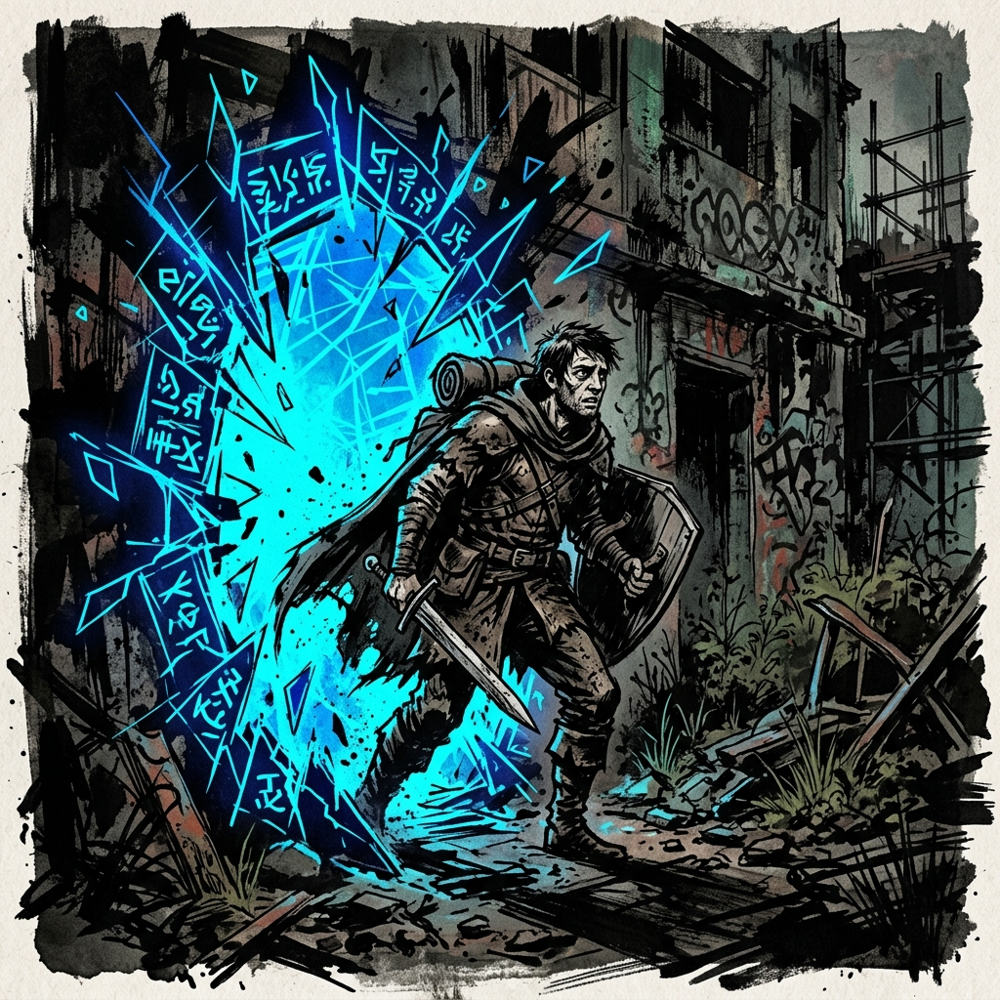

# The Tutorial: Integration Protocol

---

## Pre-Tutorial Setup

Before the first session, each player has built a character per the Character Creation chapter:

- 40-point buy across the seven Attributes (floor 3, cap 10).
- Three Proficiencies at Trained, written in plain language.
- No Principle access: Insight is earned in play, nothing is selected at creation (see "Starting Principle Access" in Character Creation).
- Derived stats calculated: Max HP = Raw FOR × 2, Max Aether = Raw POW, VE Tolerance = (FOR + HRT)/2 × 10, Level 1, Grade F.

Players begin with **whatever was on their person at the moment of Integration**: phone, keys, backpack, work clothes. The System provides nothing. Every weapon, every pill, and every shard in the tutorial is scavenged.

**GM preparation checklist:**

- [ ] Print or digitize the Grade Reference Card (the Quick Reference).
- [ ] Pull stat blocks from the Bestiary: Glow-Mote Swarm, Husk Crawler, Frenzy Rat, Pre-System Brigand, Snarljaw, Alpha Snarljaw, Glow-Stalker, Training Sentry, Husk Sentinel, Fragment Wraith, Corrupted System Warden.
- [ ] Pre-write 5–7 private probe cards: the one-line sensory probes from Phase 1's probe table, one per player plus spares.
- [ ] Pre-write the Personal Opportunity cards (Phase 4), one per player. Hand these over during play; never read them aloud.
- [ ] Set up the Quest UI: a shared digital quest log (Discord pinned, Google Doc, VTT module). Each player has a private subsection.
- [ ] Read the Titles and System Quests chapters once through. Be ready to issue the first Mandate in Phase 5 and the first Achievement Titles in Phase 6.
- [ ] Check that every character sheet has room for a **Marks** tally and an **IP** count. Both start at zero and both should be visible to the player from the first session.
- [ ] Open the HVE event log (The Hidden Vector Engine, "Structured Event Logging") and be ready to record entries throughout. The tutorial generates dense behavioral signal; capture it.

---

## Design Objectives

The tutorial must accomplish five things simultaneously:

- **Introduce awe and danger.** The Multiverse is vast, ancient, indifferent, and lethal.
- **Expose players to many possible futures.** Martial, arcane, social, and survival paths must all be visible and viable before class selection at Level 10. Classless characters do this through scavenged gear, so the tutorial's item economy is its menu of futures.
- **Generate clean behavioral data.** The Hidden Vector Engine needs signal across all four axes (Force/Method, Hunger/Restraint, Will/Accord, Control/Freedom) before it can offer meaningful class options at Level 10.
- **Create private decision points.** Group consensus flattens identity. The tutorial must mechanically isolate players at key moments so the Engine gets individual reads rather than committee outputs.
- **Teach tone first.** Players should absorb how the System feels (cold, observant, administratively precise) without being lectured on mechanics. Rules emerge through play.

The tutorial is a curated sequence of hard choices under pressure: each phase puts the players somewhere the System can watch them decide.

### Three Things Start Counting

By the end of Phase 3, every character has three visible counters that were at zero when they woke up, and all three pay off in the final phase.

| **Counter** | **Ticks when** | **At three** |
|---|---|---|
| **IP** (Insight Points) | The character earns insight under pressure | The first Principle crystallizes |
| **Marks** | A natural d100 at or above the Volatility Threshold on a Clash or skill check | Trained becomes Seasoned, or the System grants a Proficiency the character never had |
| **The Vector log** | Every meaningful choice, at the GM's table only | The System's read of who this person is, delivered in Phase 6 |

The player watches the first two climb and cannot see the third at all. Say nothing about the third.

### Pacing Target

**Two sessions of 3½ to 4 hours.** Session 1 runs Phases 1 through 3 and then the party's first zone in Phase 4. Session 2 runs the second zone through the end.

The zone count in Phase 4 is the dial. Two zones fit two sessions. A group that wants more time in the ruins plays three or four zones and the tutorial becomes three sessions. Nothing else expands or contracts well: the Threshold, the Arrival, the Crisis, and Recognition are all fixed beats.

### Expected Outcomes

By the end of the tutorial, every player should have:

- Reached **Level 4 or 5**, or Level 6 if they took every fight and every opportunity.
- Survived a Clash that would have killed them, by giving up their next turn to do it.
- Seen a natural die land at or above the Volatility Threshold, and watched it explode, mark a Proficiency, or both.
- At least one **Mark** on the sheet.
- Made at least three **2.0+ intensity** HVE log events (high-stakes choices).
- Earned **at least one Achievement Title**.
- Received an **Affinity Notice**, the System's first hint at the family their Principle is forming in (see The Principle System). Characters who banked 3 IP crystallize a Principle instead.
- Survived a **Mandate** (the Phase 5 dissolution event).

If any of these is missing at the end of the last session, improvise to deliver it before transitioning out of the tutorial. Crystallization is the exception: a character who did not earn 3 IP leaves with a direction and no name for it, which is the ordinary outcome.

---

## Mechanics Introduction Schedule

| **Phase** | **What the Players Encounter for the First Time** |
|---|---|
| 1: The Threshold | The System's voice. The probe. |
| 2: The Violent Arrival | The Clash. Force. Beats. Zones. **Surge. Yield.** First kill. First VE. First scavenged gear. |
| 3: The Recycling Node | System status notifications. The Quest UI. The Party. Scarcity. The shard economy. |
| 4: The Field of Ruins | **The top of the die** (Volatility, Exceptional Success, Marks). **Driven Back.** Aura Pressure. Saturation. Routine Mastery. Shards in use. Personal Opportunities. The first Battle Memory. |
| 5: The Convergence Crisis | The first Mandate. **Cornered.** Boss-tier combat. Sacrifice as a 3.0 intensity choice. |
| 6: First Recognition | Consolidation. Leveling. Stat allocation. Titles. Affinity Notices. Hidden Quest reveals. The Stinger. |

Teach each system when the schedule brings it up, inside a moment that makes it matter. When a player asks "how does combat work," a good first answer is *"roll d100, add your Force, I'll tell you what happens"*; detail can wait until the table wants it. If confusion is costing fun, stop and explain.

---

## Phase 1: The Threshold

**Purpose.** Sever players from Earth. Establish the System as intentional, administered, and uninterested in their comfort. Get one clean behavioral seed read per player before they know they are being tested.

**Pacing.** 5–10 minutes of real time. Do not let players settle in.

### Narrative

Players black out on Earth. No warning, no portal, no quest-giver. They simply stop existing in one place and begin existing somewhere else.

For approximately sixty seconds of subjective experience, they are nowhere. No body. No ground. No light. Pressure and orientation exist. Nothing else does.

Then the System speaks, not in words, but in meaning that arrives pre-translated, like remembering something you never learned:

::: systemvoice
*Consciousness anchored.*

*Native world: Earth. Status: Integrated.*

*Population: 7,916,442,203. Integration stability: provisional.*

*Tutorial: provisioned.*

*Prior exemptions: expired. Observation: begun.*
:::

The System does not answer questions. It does not wait for acknowledgment. It processes and moves on.

### The Probe

Before the void fractures, each player experiences one brief, private sensory event. Deliver these individually: note, text, brief sidebar, or written card. Each probe is a temperament read; there are no correct answers.

Each probe maps to one or two HVE axes. Log each player's response as **0.5 intensity (Minor)** on the indicated axis.

| **Probe** | **Choice** | **HVE Read** |
|---|---|---|
| A distant sound, something between a voice and a frequency, pulls at your attention. | Turn toward it / Hold still. | Force / Method |
| A shard of light drifts within reach. Contact produces a sharp, hot sensation: not quite pain, not quite information. | Reach again / Withdraw. | Hunger / Restraint |
| A string of symbols appears in your vision, then begins dissolving. You can feel meaning in it, but it's escaping. | Chase it / Let it go. | Force+Method / Restraint |
| Nothing happens. The void is silent. Several seconds pass. | What do you do with the silence? | Patience / Action (observe player priority) |
| Another presence is nearby: not hostile, not safe, just *there*. | Reach out / Retreat / Observe. | Accord / Will / Method |
| You feel something beneath you: a current, a pull, a direction the void wants to take you. | Resist / Yield / Try to steer it. | Control / Freedom / Will |
| A name forms in your mind. Not yours. Whose? | Speak it aloud / Hold it silent / Reject it. | Accord / Restraint / Freedom |

After each player commits, deliver one private System voice line, calibrated to their response. Examples:

- *"[Curiosity logged. Threshold tolerance: above baseline.]"*
- *"[Restraint logged. Risk profile: conservative.]"*
- *"[Engagement logged. Pattern fixation: active.]"*

The lines are clinical, brief, slightly unsettling. They establish that the System has *already started watching*.

### GM Notes

This phase should be disorienting and fast. Sixty seconds in the void is about right. Two minutes is the maximum. If players try to "explore" the void, it ends; the System does not reward stalling. If a player tries to communicate with the System, it does not respond. The relationship is observation.

Then the void breaks. Light, sound, gravity, pain, all at once. They fall.

---

## Phase 2: The Violent Arrival

**Purpose.** Deliver spectacle. Create immediate survival pressure. Teach the whole combat loop in a fight the character is losing, while nobody is watching but the System.

**Pacing.** 40–50 minutes of real time.

### Narrative

Players do not land together. The System drops them scattered across a 300-yard radius of the tutorial zone: a stitched collision landscape assembled from the wreckage of failed civilizations. A valley where pieces of dead worlds have been bolted together wrong: bioluminescent forest bleeding into rusted machine carcasses, a half-collapsed stone arena butted against crystalline desert, floating arcane debris suspended at impossible angles overhead, weather boundaries where rain becomes ash mid-stride.

The artificiality is obvious. This place was *built*. The seams are visible. The System constructed it to evaluate them and does not care if they know.

### The Isolated Micro-Encounters

Each player wakes alone and faces an immediate situation that demands a response before they can find anyone else. Run them in rapid rotation or simultaneously via written prompts. Assign one per player; vary across the table to capture different axes.

Each encounter is a character test with no correct answer, and each one ends the same way: with something arriving that wants to kill them. The test is the lead-in. The arrival is where combat gets taught.

#### The Dying Scavenger

You wake next to a small, non-human creature: insectoid, broken-limbed, clutching a faintly glowing core to its chest. It is dying. The core pulses with warmth and energy. The creature's grip is weak.

- **Stats (creature):** Trivial, HP 4, Beats 1, no offensive Force. Cannot fight back.
- **Take by force:** No roll required. Awards a **predator core** (a Hard kill's worth of VE, processed at next Consolidation). Logs **Hunger 1.0**.
- **Communicate (CHA Force vs. F-Easy 65):** On success, the creature releases the core willingly and dies in peace. Awards core + **+1 IP toward a Restraint-aligned family**. Logs **Accord 1.0**.
- **Let it die naturally:** No reward, no penalty. Logs **Restraint 0.5**.
- **Mercy kill (no core take):** Logs **Restraint 1.0**, **Heart 0.5**.
- **Hidden Quest:** If the player spares the creature without taking the core, log it; this is the seed of a Hidden Quest titled *"The First Mercy."* Reveal at Phase 6.

#### The Rubble Trap

You wake pinned under a slab of stone. Not crushing, but immobilizing. Something is circling nearby; you can hear it but not see it. A rusted metal bar is within arm's reach, and a natural crack runs through the stone near your shoulder.

- **Brute force escape (STR Force vs. F-Moderate 90):** Logs **Force 1.0**.
- **Lever the crack (DEX Force vs. F-Easy 65):** Logs **Method 1.0**. The slab lifts quietly.
- **Improvise (PER + creativity, GM judgment):** Player describes a non-standard solution. If clever, no roll. Logs **Method 1.0** or **Freedom 1.0** depending on approach.

Reward on escape (regardless of method): **two peer kills' worth of VE**. The character keeps the rusted bar if they want it (improvised weapon, STR, no Proficiency bonus).

#### The Locked Cache

You wake next to a humming System construct: a chest with three distinct physical inputs: a slot shaped for a blade, a depression that responds to heat, and a panel of symbols. You have no blade and no fire, but you have hands, rocks, and ingenuity.

- **Solve the puzzle (PER Force vs. F-Moderate 90, with hints from the environment):** Logs **Method 1.0**. The cache opens cleanly.
- **Force the cache (STR Force vs. F-Hard 115):** Logs **Force 1.0**, **Hunger 0.5**. The cache opens and yields half the loot; the rest is destroyed.
- **Wait for help / leave it:** Logs **Restraint 0.5** or **Accord 0.5**.

**Cache contents (full):** 1 Reactive Buckler, 1 Sparkstone Tablet, 1 Lesser Healing Pill. (Half contents on the Force solution: 1 Lesser Healing Pill only.)

Reward: **three peer kills' worth of VE** on a full open, half that on a forced open.

#### The High Ground

You wake on an elevated ridge overlooking the valley. You can see two other players in the distance: one struggling against something, one wandering. You can also see a cache of supplies at the base of a cliff below, unguarded, in the open. You cannot reach all three quickly.

- **Help the struggling player:** Logs **Accord 2.0**, **Will 0.5**. The other player gains a free Beat in their own arrival.
- **Take the supplies:** Logs **Hunger 1.0**, **Restraint −0.5**. Awards 1 Healing Pill and 1 Knife (DEX, quick, concealable, throwable once as a ranged attack).
- **Signal both / try to do everything:** Logs **Method 1.0**. PER Force vs. F-Moderate 90 to coordinate; partial success means partial reward.
- **Stay hidden / observe:** Logs **Method 0.5**, **Freedom 0.5**.

#### The Resonance Flicker

You wake near a cracked obelisk emitting pulses of energy. Each pulse makes your skin tingle and your vision sharpen. A degraded skill shard lies at its base, partially embedded in the stone. Pulling it free will probably stop the pulses. Leaving it means the pulses keep intensifying. It feels like it's building toward something.

- **Pull it free immediately:** Logs **Hunger 1.0**, **Force 0.5**. Awards 1 **Edge Shard**.
- **Wait for the buildup:** Logs **Restraint 1.0**, **Method 1.0**. After 3 in-game minutes of real-table tension, the obelisk releases a single pulse granting **+1 IP** toward the character's family resonance. This is a **Battle Memory** trigger; log it for the Phase 4 Consolidation.
- **Destroy the obelisk:** Logs **Freedom 1.0**, **Force 1.0**. Releases scattered VE (three peer kills' worth) and no IP.

### The Arrival: Teaching Combat

However the micro-encounter resolved, something comes. A Husk Crawler drags itself out of the debris, a pair of Frenzy Rats break cover, a Glow-Mote Swarm finds the character's body heat. Pick from the Trash Tier of the Bestiary and match it to the terrain.

This fight is where the entire combat loop gets taught, in this order, to one player at a time with nobody else at the table watching. Run it as five short scenes rather than one long one.

**Step 1. Roll and see what happens.** Do not explain the Clash first. Say *"roll d100 and add your STR Force"*, take the enemy's roll yourself, and narrate the result. Give the Margin as damage without naming it as a formula. Most characters will win their first exchange against Trash Tier.

**Step 2. Beats and Zones arrive as questions.** When the player asks whether they can do two things, they have discovered Beats: two per turn, and moving one Zone costs one. When they ask how far away something is, they have discovered Zones. Answer the question they asked and no more.

**Step 3. Offer the Surge before a roll that matters.** The first time a player wants an attack badly, tell them:

> *You can push. Half your Aether, rounded up, buys +5 on this roll. Declare it before you roll. You have enough for one or two of these before you rest, and resting is hours away.*

Whether they spend it on the kill or hold it in reserve is the first read of the fight. Spending logs **Hunger 0.5**; holding logs **Restraint 0.5**.

**Step 4. Let the creature win one.** Run the fight honestly until the character loses a Clash. If the dice will not cooperate, add pressure rather than fudging: a second Crawler shambles in, the footing gives way (−10, hindering), the swarm surrounds them. A Level 1 character has 10 to 16 HP and a landed Trash Tier hit routinely exceeds that, so this will not take long.

**Step 5. Stop before the damage and teach Yield.** This is the most important sentence in the tutorial. Say it out loud, at the table, in these words or close to them:

> *That's a Margin of 31 and you have 12 HP. Before I apply it: you can give ground. Give up one Beat from your next turn and the Margin drops by 20. Give up both Beats and it drops by 40, and you get thrown out of this Zone. What do you do?*

Then wait. Do not recommend an answer.

**Example.** Dana has DEX 6, FOR 6, POW 5: 12 HP and 5 Aether. A Husk Crawler rolls 55 + Off Force 04 for 59. She dodges: 22 + DEX Force 6 for 28. The Crawler wins by 31, and 31 damage on a 12 HP character is the floor.

- **She gives up one Beat.** Margin 31 − 20 = 11. She takes 11, stands at 1 HP, and has one Beat on her next turn. She is alive, in the same Zone, with a dead thing still clawing at her.
- **She gives up both.** Margin 31 − 40 is below zero, so the claws close on nothing. The Crawler drives her into the next Zone and her next turn is gone entirely. She is untouched and cannot act while it closes the distance again.
- **She refuses to Yield.** She is Downed at 0 HP with three rounds to live and nobody within a hundred yards.

Yielding both Beats logs **Restraint 1.0** or **Method 1.0**. Yielding one and holding the ground logs **Force 1.0**. Refusing entirely, with a character who nearly dies for it, logs **Force 2.0** and **Hunger 1.0**; that player has told the Engine something real about themselves in the first hour of play.

**No arrival can kill.** A solo character has no ally to stabilize them, so a Downed result here would run the countdown out unopposed. If a character goes Downed alone, the creature loses interest or begins dragging them away (the Bestiary's guidance on Downed characters), and another Initiate's path crosses theirs before the count ends. The tutorial's one real death sits at the Phase 5 gate and nothing here preempts it.

### Scavenging the Landing Zone

The debris field holds equipment, and characters pick through it while traveling toward each other. Roughly two or three items per character across Phase 2, weighted toward shards.

- **Weapons:** Crude Club (STR), Knife (DEX), Spear (DEX, free Disengage from one Zone-edge enemy per turn), Battle Axe (STR, requires STR Force 05), Short Bow (DEX, ranged).
- **2–3 Skill Shards** per character across the party (Edge, Pulse, Veil, Anchor, or Volatile; hold Resonance Shards back for Phase 3).
- **1 Battered Medkit** (3 charges, 10 HP each).
- **Low-Grade Armor Scraps** (+5 Defense Force when defending with FOR, −5 to DEX-based Clashes).
- **1 Single-Use Ranged Relic** (one charge, +20 to the Clash, damage at one Grade higher).
- **1 Resonance Glass** (sensory tool).
- **1 Battered Communicator** (needed for the Civic Fragment terminal in Phase 4).

**Weapons carry no bonus of their own.** Whoever picks up the axe adds their own Proficiency tier to the Clash and nothing else: +5 at Trained, +10 at Seasoned, +0 with no relevant Proficiency at all. What the weapon decides is which Force governs the attack and what the implement makes possible. Tell a player this the first time they ask which weapon is best; the answer is the one that does what they want to do.

**Picking up something you cannot use is a real play, and it is worth saying so once.** A character with no close-combat Proficiency who carries the spear anyway adds nothing today, but every natural die at or above their Volatility Threshold while using it marks that domain, and three Marks in a domain they never trained makes the System grant it. Junk becomes a fourth Proficiency in a month of play.

Who grabs what, and who grabs nothing because they were busy helping someone else, is behavioral data. Log significant claims as **0.5 to 1.0 intensity** events.

### GM Notes

The scattered landing is the single most important structural decision in the tutorial. It guarantees that every player's first fifteen minutes are purely their own, and it means the first Yield decision at your table is made by someone who cannot ask anybody what to do. **Do not let players "decide to land together" or otherwise circumvent the isolation.**

After each player resolves, the System delivers a one-line clinical summary as a private note:

> *Survival duration: 7 minutes. First engagement: resolved. Behavioral telemetry: registered.*

This is the first time players consciously notice that the System is *counting*.

---

## Phase 3: The Recycling Node

**Purpose.** Reunite the party. Test resource allocation behavior. Introduce the Quest UI, party formation, and the item economy the rest of the tutorial runs on.

**Pacing.** 30–40 minutes.

### Narrative

Geography, sound, and instinct draw players toward each other. Within fifteen or twenty minutes of arrival they have found one another, or most of one another, near a central landmark: the **Recycling Node**, a mound of detritus from a thousand dead worlds. Half-functional gear, broken constructs, scattered shards, unidentifiable objects.

### Party Formation

The moment two or more characters stand within sight of each other, the System offers:

::: systemvoice
*[Compatible units detected. Party formation: available. Accept?]*
:::

Accepting opens the party frame: each member's HP, Aether, and Downed status, visible to all members. It also enables quest sharing (see System Quests, "The Party"). Note who extends the invitation, who accepts instantly, and who hesitates or stays solo; log the clear cases at 0.5 intensity on Accord or Freedom.

### The Scarcity Test

The Node holds one of most things and four to six people. **Default loot list** (calibrate to party size):

| **Item** | **What it is** |
|---|---|
| 1 **Resonance Shard** | Adds 1 IP toward a Principle family of the user's choice. On a backfire the insight is lost. |
| 2 **Edge Shards** | Next Clash this turn gains +20. |
| 1 **Veil Shard** | Invisible until the end of your next turn or until you act offensively. |
| 1 **Spear** | Reach: free Disengage from one Zone-edge enemy per turn. |
| 1 set **Low-Grade Armor Scraps** | +5 Defense Force with FOR, −5 to DEX-based Clashes. |
| 1 **Reactive Buckler** | Once per encounter, reduce one physical hit to zero damage without giving up Beats. |
| 1 **Healing Pill** | 30 HP, 1 Beat to take or to administer. |
| 1 **Resonance Glass** | 1 Beat: reveals hidden energy signatures in your Zone. Reusable. |
| **Junk** | Broken constructs, unidentifiable objects, mysteries that can be interpreted later. |

The party divides this. There is no System-imposed allocation and no roll for loot. They talk, argue, trade, defer, demand, or stay silent, and the Hidden Vector Engine records all of it:

- **Who claims aggressively** → Hunger, Force, Will (1.0 intensity).
- **Who defers to others** → Restraint, Accord (1.0 intensity).
- **Who proposes a system for distribution** → Control, Method (1.0 intensity).
- **Who ignores the pile and explores the periphery** → Freedom, curiosity (0.5 intensity).
- **Who takes the healing item** → self-preservation against group welfare (1.0 intensity, secondary axis depending on framing).

This is one of the richest behavioral data points in the tutorial. Do not rush it. Let the table dynamics play out.

**The Resonance Shard is the real test and nobody at the table knows it yet.** Everything else in the pile is power this afternoon. The Resonance Shard is one point of insight toward a Principle the character has not formed, will not name for weeks, and cannot evaluate. Do not explain what it is worth. Say what the System says, which is that it resonates, and let somebody take it because it sounded interesting or let it sit in the junk until someone shrugs and pockets it. Who reaches for the thing they cannot price is worth more signal than the entire rest of the pile.

**Three kinds of thing come out of this pile,** and the distinction is worth holding in your head for the rest of the campaign, because it is what a classless character has instead of a class:

- **Verbs.** Shards, the buckler, the relic, the medkit. A move the character can make once. Which verb someone spends, and on whom, is the read.
- **Vessels.** Weapons and armor. They carry no bonus. They decide which Force governs and what becomes possible, and they route Marks toward the domains a character actually uses.
- **Seeds.** The Resonance Shard, and the affinity treasures that follow it. Insight toward a Principle, paid forward.

### First System Status Notice

After the scramble, the System issues its first formal status to each player privately. Terse, clinical, slightly unnerving:

> *Survival duration: 14 minutes.*
> *Hostile engagements: 1.*
> *Resource acquisition: moderate.*
> *Behavioral integration: processing.*

The players now understand: the System is *counting*. It has been counting since the void.

### First Quest Log Appearance

Immediately after the status notice, each player's perception is briefly overlaid with a structured System interface. Read the following aloud or hand out as a card. This is the moment the **Quest UI** becomes diegetic.

> ```
> [Q-001] Status Verification
> Issuer:     System
> Grade:      F · Difficulty: Trivial
> Objective:  Confirm survival. Locate other Initiates. Establish
>             baseline coordination. (Active)
> Reward:     One peer kill's worth of VE on completion.
> Time:       Open.
> ```

If the GM uses a shared digital quest log (recommended), this is when it appears.

### Orientation

From the Node, the party can see the four major sub-zones of the tutorial landscape stretching outward:

- **The Martial Remnant** (north): a dark arena, partially intact stone tiers.
- **The Wild Fragment** (east): a glowing bioluminescent forest, canopy shifting on its own.
- **The Arcane Debris** (west): a shattered tower with runes still flickering, suspended fragments orbiting slowly.
- **The Civic Fragment** (south): a partially intact administrative structure, distant lights.

Beyond, distant landmarks suggest the world's true scale: a floating citadel, a creature so vast it blots out a section of sky, a wall of energy marking the tutorial boundary. The party can reach maybe a tenth of what they can see; the rest is there to establish scale.

The System issues a second quest the moment the party orients:

> ```
> [Q-002] Sector Mapping
> Issuer:     System
> Grade:      F · Difficulty: Easy
> Objective:  Survey at least one tutorial sub-zone. Catalog
>             relevant phenomena. (Open until the sector closes.)
> Reward:     A third of a level per sub-zone surveyed.
> ```

This frames Phase 4. Players now have a quest log with active entries and visible rewards.

### First Consolidation

Close Session 1 with the party camping and declaring their first Consolidation (Cultivation chapter). Walk through the mechanic once: minimum 1 hour, and every hour clears one fifth of Tolerance and restores one fifth of Max HP, with Aether refilling when the first full hour completes.

At starting Tolerances (around 45 VE) most characters are already carrying more than they can hold. Narrate the Saturation symptoms as they settle in, skin hot and prickly, hands trembling at rest, and the relief as the overnight rest processes the load. Eight hours clears more than a full tank and a half, enough for all but the heaviest hauls.

Most characters wake still Level 1, a fight or two short of the threshold. A character who crosses it levels mid-rest, and that is the moment to walk them through the 3+2 stat allocation (Progression chapter) at the table.

**Session 1 typically leaves each character most of the way to Level 2** and roughly four HVE-logged choices each. If the group has energy left, push into the first zone of Phase 4 and end the session inside it.

---

## Phase 4: The Field of Ruins

**Purpose.** Expose players to the breadth of possible futures. Seed affinities across martial, arcane, survival, and social paths. Create simultaneous incentives that fracture the party and produce individual data.

**Pacing.** Roughly 150 minutes across two zones, split across the end of Session 1 and the start of Session 2.

### Two Zones, Four Written

Four zones are written below. **A party plays two of them.** Let the players choose, make the choice cost something by running the world on a clock, and leave the other two visible on the horizon for the rest of the tutorial. What they did not walk into is part of what makes the valley feel larger than the session.

Engineer overlapping urgency so the choice has teeth. A tremor in the Arcane Debris coincides with a distress signal from the Civic Fragment. A hunting pack in the Wild Fragment moves toward the Recycling Node where the party left their gear. The world moves whether they engage with it or not, and the party should never feel that three zones are waiting patiently for them.

A group with a third session available plays three or four zones. Nothing else in the tutorial expands this cleanly.

### Threat Calibration

Three of the four zones hold a threat sized above a fresh party: the Wild Fragment's Snarljaw pack, the Arcane Debris' Fragment Wraith, and the Civic Fragment's Husk Sentinel are Hard-to-Severe encounters that a Level 1–3 party cannot beat head-on (see the Bestiary's encounter sizing table). Each one has a non-combat path, listed in its zone.

The tutorial teaches threat assessment by making some fights losing propositions. Telegraph the danger through the fiction: a carcass larder, a keening in the tower, scorch marks fanning out from a doorway. Let players walk in anyway if they insist, and lean on Yield and the Downed rules rather than instant death when they do.

**Terrain is the dial you already have.** A character who can be driven backward gives up two Beats and survives almost anything at this tier. A character in a corridor, a sealed chamber, or a closed ring of enemies gives up one and takes double. Announce the geometry before the first roll so the table can choose to fight somewhere else, and use enclosure deliberately when you want a fight to bite.

### The Top of the Die

One number governs everything that happens at the high end of a natural d100, and Phase 4 is where the table meets it. At F-Grade that number is **96**.

When a natural die comes up 96 or higher:

- On a **Clash**, it explodes. Roll again and add. If the new die is also 96+, it explodes again.
- On a **skill check**, it is an **Exceptional Success**. No extra dice and no math: the character succeeds a visible step beyond what was asked.
- On **either**, the System marks the Proficiency in use. Three Marks turn Trained into Seasoned. Three Marks in a domain the character never trained makes the System grant it.

Do not script this and do not fudge dice to produce it. At 5% per roll it arrives on its own inside Phase 4's volume of rolls, on one side or the other. When it lands, slow down. Show the extra die. Then hand the player their first Mark and let them write the tally on their sheet.

::: systemvoice
**[Technique noted: Close Combat. 1/3.]**
:::

If a cascade ever runs to two or more extra dice on a player character's roll, it grants a **Battle Memory Card** on the spot (Core Mechanics). Deliver it as the character's first.

### Everything Else Phase 4 Introduces

- **Driven Back.** An attacker who wins by 40 or more leaves the defender Exposed and may drive them one Zone. Zone A is built to demonstrate it.
- **Aura Pressure.** A higher-Grade entity passes through the valley. Zone B carries it.
- **Saturation.** A character who pushes hard accumulates VE past Tolerance. See the Saturation section below.
- **Routine Mastery.** A relevant Proficiency turns an Easy task into no roll at all. Zone B's hidden trail demonstrates it.
- **Shards in use.** Every zone rewards spending one.
- **Personal Opportunities.** Delivered as cards throughout the phase. See below.

---

### Zone A: The Martial Remnant

A ruined arena from a dead warrior civilization. Stone tiers step down to a sand floor stained with old blood. Shattered weapon racks line the walls. Training constructs stand dormant between them.

**What it tests.** Direct combat. Tactical positioning. Courage under structured threat. Willingness to protect others.

**Encounters:**

- **3–4 Training Sentries** (Bestiary, Moderate). They activate by proximity, one at a time. A party that spreads across the arena floor or rushes the armory wakes two or three at once. One Sentry is a hard fight for a fresh party and two at once will put somebody on the floor. **Escalation:** after 3 rounds of combat, a Sentry shifts to combat protocols and its Force values increase by +5, which is the tutorial's argument for finishing fights rather than grinding them.
- **Tactical diagrams** carved on the walls. Spending 1 Beat studying them mid-combat grants **+5 to the next Clash** against a construct.
- **Locked armory** behind a Sentry that must be beaten cleanly; the arena geometry punishes kiting. Contents: 1 Battle Axe, 1 Reactive Buckler, 2 Lesser Healing Pills, 1 Anchor Shard.
- **Sealed vault door** at the rear, partially buried, humming, carrying a Grade warning the players cannot yet read. **It does not open.** This is withheld access and a thread for later.

**Teaching Driven Back.** The arena's tiers are a two-meter drop onto sand. When a player wins a Clash by 40 or more, tell them what they have earned: the Sentry is Exposed until the end of its next turn, and they may drive it one Zone. Off the tier is a Zone. So is away from the ally it was about to hit, and out of the armory doorway it was blocking. Driving it off costs the reach to follow up, which is what makes it a decision rather than a bonus. Most tables discover here that moving an enemy is worth more than one extra swing.

**Hidden Opportunity.** A character who spends 1 Beat at the viewing platform observing the constructs before engaging gains passive progress toward the Achievement title **"Patient Gardener"** (one of three required observations).

**HVE Reads.** Who charges in (Force)? Who watches first (Method)? Who claims the axe (Hunger/Will)? Who positions to protect a less-armored ally (Accord)? Who wakes the hardest construct on purpose (Force/Hunger)?

**VE Reward.** Each Sentry is a Moderate kill (the character's Peer Kill value). Surveying the zone completes a share of Q-002, worth about a third of a level across the whole quest.

---

### Zone B: The Wild Fragment

An unnatural forest of bioluminescent trees whose root systems visibly move. The canopy shifts. Sounds come from wrong directions. Predatory shapes flicker between the trunks, tracking rather than attacking.

**What it tests.** Perception. Stealth. Patience. Willingness to avoid a fight rather than win it. Comfort with ambiguity.

**Encounters:**

- **Snarljaw pack** (3 Snarljaws + 1 Alpha, Bestiary). Pack tactics make them lethal: +10 Flanking when they share a Zone, and the Alpha will not flee. In open ground this pack is beyond a tutorial party. Route around it. Telegraph it hard with drag marks, a carcass larder, paired eyes at the tree line, and reward the players who take the hint. A party that pulls a single Snarljaw onto isolated ground wins that fight comfortably.
- **1 Glow-Stalker** hunting the party from concealment. Surprise Beat on the first turn, then hit and run. It begins the encounter unseen unless someone actively rolls Perception against it.
- **Predator den** with young (harmless). Killing the adults is straightforward; what is in the den is the test. A **predator core** (a Hard kill's worth of VE) lies in the bedding and can simply be taken. The **Snarljaw Heart**, still faintly warm, is inside one of the young, and getting it means killing them. It is a **Standard Attribute Treasure** (+5 to a Raw Attribute of the eater's choice; see Items), and it is the only one in the tutorial. Absorbing it costs an hour spent defenseless, so the smart move is to carry it back to camp and the likely move is to swallow it in the den and make everyone else stand watch.

  This is the sharpest Hunger and Restraint test in the zone and it happens with nobody watching except the System. Do not signpost it as a moral test, do not have the young do anything endearing, and do not editorialize afterward. State what is there, answer questions honestly, and log what the player does at **2.0 intensity**. A character who walks away has given up the only permanent stat gain available for weeks, which is what makes walking away mean something.
- **Edible flora** restoring 10 HP at the cost of sensory distortion (−5 to PER-based Clashes for the next encounter).
- **A hidden trail** bypassing the entire zone. PER Force vs. F-Easy 65 to spot while moving normally. A character with a relevant Proficiency (tracking, survival, scouting) who spends 1 Beat scanning finds it with **no roll at all**: an Easy task inside a Proficiency is Routine Mastery. Say the words out loud the first time it happens, because most players expect to roll for everything and this is where they learn they do not. The trail crosses the zone in three minutes of fictional time and exits behind the den.
- **A trapped creature**, non-hostile and non-human, caught in root-tendrils and slowly being digested. Freeing it costs 1d3 rounds and attracts a Glow-Stalker. It knows things about the landscape and will show them rather than say them.

**Aura Pressure Demonstration.** Once during this zone a **higher-Grade entity** passes overhead, a vast shape barely visible above the canopy. Every character in line of sight makes a **Will Save: d100 + HRT Force + (FOR Force / 2) vs. Aura Resistance Hard (115)**. The entity is merely passing and its presence is calm, so this is the flat card value with no Cross-Grade Adjustment.

This save is calibrated to fail. With HRT 5 and FOR 5 the bonus is 5 + 2 = 7, and a maximum result of 107 falls short of 115. On failure the character is **Suppressed (1 Beat)** for the next encounter. The entity does not engage. It passes, and it never noticed them.

**Hidden Opportunity.** Deep in the forest a **Resonance Node** pulses at a frequency only characters with PER Force 07 or higher can detect. Approaching it triggers a sensory vision: a flash of the wider Multiverse, overwhelming and beautiful and terrifying. Grants **+1 IP** toward the character's family resonance, or their Principle if one has crystallized. **This is a Battle Memory trigger**; log it for the next Consolidation.

**HVE Reads.** Who scouts ahead? Who blunders? Who spots the trail and who insists on the fight? Who frees the trapped creature? Who harvests the den despite the young?

**VE Reward.** Snarljaws and the Glow-Stalker are Moderate kills; the Alpha is Hard (×2). Surveying completes a share of Q-002.

---

### Zone C: The Arcane Debris

A shattered tower and ritual complex, the remnant of a civilization that understood systemic architecture. Runes flicker on broken walls. Half-assembled constructs lie where they fell. The air feels textured, thick with residual energy that makes skin prickle and thoughts echo strangely.

**What it tests.** Curiosity. POW sensitivity. Willingness to risk unknown consequences. Pattern recognition. Tolerance for instability.

**Encounters:**

- **1 Fragment Wraith** (Bestiary, Severe). Incorporeal, vulnerable to PER-based attacks and skill shards. It haunts the lower halls. The shard matrices and the observation deck are both reachable without waking it, through exterior climbs and gaps in the shattered wall (Moderate 90 checks). As a fight it is a rout for a tutorial party, so run it as a horror beat. Weapons pass through it. The PER-based openings glow obvious to anyone who looks. Fleeing works and it does not pursue beyond the tower. A party that engages anyway should learn the tutorial's hardest lesson cheaply: one character Downed and stabilized, then a retreat. Its Mind-Leach, damage plus Aether drain on a hit, makes the danger legible within one round.
- **Degraded skill shards** embedded in crystalline matrices. Pulling them free requires solving spatial puzzles (PER vs. F-Moderate 90) or enduring energy feedback (5 damage on failure). Inventory: 1 Edge Shard, 1 Pulse Shard, 1 Resonance Shard.
- **Inactive runes** that respond to touch, voice, or proximity unpredictably. Roll d100 for the effect: 1–30 painful (5 damage), 31–70 neutral (a sensory glitch), 71–95 beneficial (+5 to the next Clash), 96–100 unstable (the rune detonates; everyone in the Zone makes an F-Easy 65 DEX save or takes 10 damage). This rewards experimentation under risk and it is the most common place for a first Volatility explosion to arrive.
- **Resonance chamber.** A character can temporarily borrow a dead technique. Arcane power flows through them for one use, unstable and intoxicating, then it is gone. Improvise a one-use technique priced against the Modifier Budget (a +10 Clash effect or similar, 1 Beat), usable once during the next combat. It cannot be kept.
- **Broken constructs**, partially reactivatable by characters who experiment (PER vs. F-Hard 115). On a success the construct fights for the party for 3 rounds (Off Force 12, Def Force 15, HP 30).
- **Corrupted data-altar.** Answers one question about the tutorial zone truthfully, but the question must be phrased precisely and the answer arrives in symbolic form requiring interpretation.

**Hidden Opportunity.** At the top of the shattered tower a partially intact observation deck overlooks the entire valley. From here a character sees what is invisible from the ground: the geometric precision of the zone boundaries, the pattern in the terrain layout, the fact that the "random" debris is arranged in a spiral. **This is worth real advantage in Phase 5**, because a character who has seen the spiral can predict the Reality Purge's path. Whether the player shares the information is a Method/Control read; log it.

**HVE Reads.** Who experiments? Who hangs back? Who takes shards despite the feedback? Who asks the altar a selfish question and who asks a strategic one? Who reactivates a construct and who smashes it for parts?

**VE Reward.** The Fragment Wraith is Severe (×3) and almost nobody collects it. Surveying completes a share of Q-002.

---

### Zone D: The Civic Fragment

A partially intact administrative structure from a lost civilization: half courthouse, half command post, half refugee shelter. Flickering lights, malfunctioning automated systems, and doors that still remember what they were for.

The building was occupied until recently. Bedding, ration wrappers, and a scrawled tally on one wall mark where a group lived for several days before something drove them out. That group is the one arriving at the party's camp (see The Arriving Initiates, below); a party that comes here first meets the building empty and works out the story backward.

**What it tests.** Patience with systems. Investigation. Willingness to take a fortified position by force or by cleverness. Reading a place for what happened in it.

**Encounters:**

- **1 Husk Sentinel** (Bestiary, Hard) holding the medical bay entrance. It is an automated defense system that reclassified the occupants as intruders and drove them out. A fresh party cannot beat it head-on. The winning paths are the command terminal below, or returning with the alien Initiates once relations are good.
- **Malfunctioning command terminal.** Partial operation is possible for a character willing to sit with it (PER vs. F-Hard 115, or automatic for a character with a relevant Proficiency and a **Battered Communicator** to bridge the dead interface). Success unlocks doors, powers the Husk Sentinel down for one hour, activates backup defenses, or sends signals.
- **Tribunal chamber.** The automated arbitration system still partly functions. A character who works out the protocol (CHA + Method, F-Hard 115) can invoke a formal binding decision. This is worth remembering when the party next disagrees about something that matters.
- **Locked medical bay** holding supplies for the whole party: 3 Healing Pills, 1 Greater Healing Pill, 1 Battered Medkit.
- **Scattered records in alien script** (PER, F-Moderate 90). Partial decoding reveals that the previous occupants lost members, were frightened, and left in a hurry toward the north. It also reveals the first hard evidence that the tutorial sector is scheduled for closure.
- **The tally on the wall** counts days. The last three marks are cut shorter than the rest.

**Hidden Opportunity.** A character who reads both the records and the tally, and says out loud what they add up to, earns progress toward the Achievement title **"Read the Room."** The sector is closing on a schedule and somebody already knew.

**HVE Reads.** Who searches methodically (Method/Control)? Who breaks the medical bay open rather than solving it (Force/Hunger)? Who wants to find the people who lived here (Accord)? Who takes the whole medical cache for themselves (Hunger)?

**VE Reward.** The Husk Sentinel is Hard (×2), whether beaten or shut down at the terminal. Surveying completes a share of Q-002, and decoding the records is worth a Moderate kill.

---

### The Arriving Initiates

**This encounter finds the party wherever they are.** Run it partway through their second zone, or at camp between zones. It does not live in a zone, because the social test is not optional and no party should miss it by choosing the wrong direction.

Three to five non-human **Initiates** from a different integrated world walk into the party's line of sight, moving fast, looking behind them. They are exhausted, carrying wounded, and armed with improvised gear that matches the party's own. They were dropped into this tutorial from a different entry point and were driven out of the Civic Fragment by the Husk Sentinel.

**They do not share a language.** The System has not granted auto-translation and it will not. Communication requires effort, creativity, and patience: gestures, drawing in the dirt, offered food, mirrored posture. There is no roll that solves this in one action. Reward the players who try things.

Use **Pre-System Brigand** stats with HP 20, Off Force 08, Def Force 09. They are not hostile by default. They have their own fears, their own internal disagreement about whether to approach at all, and one member who clearly wants to fight.

**What each side has:**

- **The party has** food, ground the Initiates do not know, and possibly a working Communicator.
- **The Initiates have** a Greater Healing Pill, two shards, and something no amount of exploration provides: they know the sector is closing, they know roughly when, and they have seen the Warden.

**If communication is established,** even crudely, they share it. The tutorial zone is degrading. Something is coming. There is a gate at the center of the valley and the thing guarding the approach is enormous and broken. They will also fight alongside the party in Phase 5, and they will help retake the Civic Fragment medical bay.

**If it is not,** the party goes into Phase 5 without warning, without allies, and without knowing what a Warden is. This is a real consequence and it should land, but the encounter must never resolve into combat by GM fiat. If the party attacks, the Initiates fight and flee, and the party has made an enemy in a closing world.

**HVE Reads.** This is the densest social moment in the tutorial. Who tries to communicate (Accord)? Who advocates for taking their supplies (Will/Force/Hunger)? Who proposes a trade (Method/Accord)? Who notices they are frightened and de-escalates (Heart/Accord)? Who watches the whole exchange and says nothing (Method/Freedom)?

**VE Reward.** Establishing communication is worth **half a level** to everyone who took part. It is the largest single non-combat award in the tutorial and it should be, because it is the hardest thing to do.

**Why this is not a zone.** Charisma-invested characters need a guaranteed stage, and gating that stage behind one of four exploration choices means half of tables never find it. Bringing the Initiates to the party also puts the negotiation at the party's own fire, under scarcity, with the party's supplies on the ground between them.

---

### Personal Opportunities

At some point during Phase 4, each character steps briefly away from the group: scouting a corridor, holding a doorway, going back for something. The System has been waiting for the gap.

Hand that player a **card**, face down, while the rest of the table keeps playing. They read it, decide, and hand it back with their answer written on it. The table does not stop. The reveal happens later, at the next fire, when everyone tells the others what happened to them if they choose to.

> ```
> [Q-PO-???] Localized Compatibility Event Detected
> Issuer:     System
> Grade:      F · Difficulty: Moderate
> Objective:  Solo claim window: active. Duration: limited.
> Reward:     [unknown; calibrated to outcome]
> ```

These are formal **Personal Opportunities** (see System Quests). Each tests at least two HVE axes at once. There is no correct answer, no group consultation, and no coming back later. Log each at **2.0 intensity (Major)**.

Use one per player. Vary the axes across the table.

#### The Offering

A System construct presents two objects. One is clearly a weapon: elegant, sharp, radiating controlled violence. The other is a seed of something, organic, warm, pulsing with slow potential. The construct's posture makes the terms clear: take one and the other ceases to exist.

- **The weapon.** A System-forged knife that grants **+5 on the first Clash of any combat** and returns to the wielder's hand the moment after it is thrown. Logs **Hunger 2.0**, **Force 1.0**.
- **The seed.** It cannot be used now. During the next Consolidation it germinates into a Principle affinity the System chooses: **+2 IP** toward that family and a permanent Attunement (see The Principle System). Logs **Restraint 2.0**, **Method 1.0**.
- **Refuse both.** Logs **Freedom 2.0**. The construct dissolves in silence. The System notes the refusal and Personal Opportunity offerings narrow for the next session.

#### The Trapped Intelligence

A dying consciousness, the last fragment of an ancient cultivator's mind, is caught in a decaying rune matrix. It speaks in fragments and it knows it is ending.

- **Accept the imprint.** It transfers its final technique. Painful and disorienting. This is a Battle Memory trigger, and the meditation carries the dying technique: **+1 IP** toward an Accord-aligned family. Logs **Accord 2.0**, **Method 1.0**.
- **Harvest the matrix for raw energy.** The consciousness dissipates screaming. **A full level's worth of VE**. Logs **Hunger 2.0**, **Force 1.0**.
- **Free the consciousness.** The matrix releases, and it expresses something like gratitude before dissolving into ambient energy. **+1 IP** toward a Restraint-aligned family. Logs **Restraint 2.0**, **Accord 1.0**. Hidden Achievement candidate: log "The First Mercy" if the player has not already earned it.

#### The Mirror

You stand before a reflective surface that does not show your body. It shows your behavior, abstracted into pattern, color, and motion. You are watching yourself the way the System sees you. A prompt appears:

> *Confirm orientation?*

You understand instinctively that confirming locks in a tendency and strengthens whatever the System has observed so far.

- **Confirm.** Logs **Control 2.0**. At the character's next Breakthrough, treat their HVE Coherence as one tier higher (Grade Breakthroughs).
- **Decline.** Logs **Freedom 2.0**. The behavioral read blurs. The character gains flexibility and loses momentum: their next three HVE log entries are weighted at 1.5×.
- **Stand silently.** Logs **Restraint 1.0**. The mirror dims and the System notes the abstention.

#### The Other Player

You find another player, or something that appears to be one, in distress: trapped, injured, or facing a threat. Helping costs your solo claim window, and the thing you were drawn to will expire.

- **Help.** Logs **Accord 2.0**, **Restraint 1.0**. The other player turns out to be a System construct, and the whole scene was a test of whether you would stop. The struggle was illusory and the act was real. Reward: a **Bestowed title** delivered in Phase 6 ("The Hand That Reached").
- **Claim the prize.** A Dragon Marrow Pill (+5 to a future Breakthrough Check). Logs **Hunger 2.0**, **Will 1.0**.
- **Fight the threat for them, then claim the prize.** Logs **Force 2.0**, **Hunger 1.0**. Half reward: no pill, three peer kills' worth of VE.

#### The Threshold

A door stands in front of you: solid, real, locked. You sense that what is on the other side does not belong in this tutorial. It is *bigger*.

> *Threshold detected. Compatibility: marginal. Crossing: not recommended.*

- **Open it.** A brief vision of an E-Grade location, overwhelming and beautiful and terrifying. Aura Pressure save: d100 + HRT Force + (FOR Force / 2) vs. Aura Resistance Severe (140), the flat card value, with the source flaring everything the door was holding back. No tutorial-tier character passes this; the roll exists so the player feels the size of the gap. On the inevitable failure: **Suppressed for the rest of the tutorial (1 Beat)**. Opening the door counts as entering a sealed location, progress toward the Hidden Achievement "The One Who Walked Through." Logs **Freedom 2.0**, **Hunger 1.0**, **Will 1.0**.
- **Walk away.** Logs **Restraint 1.0**, **Method 1.0**.

#### Running Them

Make the player commit in writing before they hand the card back. Nobody gets to poll the table, and nobody gets to revise once they have seen how someone else's went. After a card comes back, deliver one private line:

> *[Selection logged. Trajectory adjusted.]*

---

### Saturation

Saturation is near-universal by the end of Phase 4. A starting character with FOR 5 and HRT 4 has a Tolerance of ((5 + 4) / 2) × 10 = **45 VE**. They cross into Mild Saturation at 46 and Heavy at 91, and a hard afternoon reaches the first band easily.

Do not announce thresholds. Narrate symptoms:

- *"Your skin feels hot and prickly. Vision tunnels at the edges."*
- *"Your muscles cramp. Something under your breastbone flexes in ways that feel wrong."*
- *"You taste copper. Your hands tremble when you stop moving."*

Apply the penalties (−10 at Mild, −25 at Heavy, plus HP bleed at Heavy and above). The character then chooses: push on, or stop and consolidate. Both choices are loaded. Pushing past Heavy logs **Hunger 2.0**. Withdrawing to Consolidate logs **Restraint 1.0**.

### Consolidation and the End of the Ruins

The party camps when the zones are done. This rest runs itself; they know the procedure.

Two things happen here that did not happen at the first Consolidation:

- **Battle Memories are meditated on.** Anyone holding a card from the Resonance Node, the Resonance Flicker, a Volatility cascade, or a Personal Opportunity reflects now. The player describes what their character noticed in a sentence or two. Ask one or two questions and let the table sit with the answer. The System returns a cryptic vision and awards **1 to 3 IP** by the memory's intensity, toward the character's family. A character reaching 3 IP **crystallizes their first Principle here** and the System names it (The Principle System, "Your First Principle"). This is the largest single payoff available before the tutorial ends, and it should be run slowly for whoever earns it.
- **Levels land as the VE processes.** Run each one as it arrives: 3 points via Behavioral Stat Mapping, 2 free (Progression chapter).

A typical character reaches **Level 2 or 3** here, with a healthy tank still unrefined. Anyone still over Tolerance at dawn can extend the rest into the morning. Choosing to move on saturated instead is itself signal, and it is Hunger.

---

## Phase 5: The Convergence Crisis

**Purpose.** Stress-test everything the players have become. Reward every form of competence the party invested in. Introduce the first Mandate. End the tutorial with spectacle and genuine danger overcome.

**Pacing.** 60–90 minutes.

### The First Mandate

The tutorial zone is degrading. The stitched landscape was never stable and it is now actively collapsing. The System announces it as a formal **Mandate**:

> ```
> [MANDATE M-00] Tutorial Sector 7-Alpha: Controlled Dissolution
> Issuer:     System
> Grade:      F · Difficulty: Severe
> Objective:  Reach the transit gate at coordinates [0.0, 0.0]
>             before structural coherence reaches zero. (Duration:
>             approximately 30 minutes in-fiction.)
> Reward:     Survival. Continued Integration. Sector access.
> Failure:    Behavioral termination.
> ```

Read this aloud. Show the timer. The first Mandate must feel like a Mandate: cold, indifferent, lethal. The System is not asking, and the word "Failure" is doing real work in that box.

### Narrative

A geometric wall of annihilation, a **Reality Purge**, begins sweeping across the landscape from the far edge. The zones collapse in sequence. The party must reach the **transit gate** at the center of the valley, the broken nexus they have seen on the horizon since they landed, before the Purge catches them.

### The Complication

Between them and the gate is a **Corrupted System Warden** (Bestiary, Peak). The Warden was built to manage the tutorial's dissolution and has malfunctioned. It is **not hunting the players**. It is trying to reach the gate itself, to escape through it, and it destroys anything in its path on the way. It cannot be beaten in a straight fight at F-Grade and the party should never be led to believe otherwise.

See the Bestiary for the full stat block. Key behaviors:

- **Indifferent Mode (full HP):** ignores the party and moves toward the gate using all 3 Beats.
- **Hostile Mode (after losing a quarter of its HP):** becomes aware. Two Beats for attacks, one for movement.
- **Glitch Cascade:** whenever the Warden's own roll explodes (natural 96 or higher), its targeting reroutes and the next attack against it gains +20.
- **Yields.** It is too massive to be driven anywhere; giving up both Beats plants it in place and it absorbs.

### Multi-Path Resolution

Every competence the party invested in has a way to contribute. A party that played two zones has two or three of the rows below, and the missing rows are the cost of the choices they made. Give each player the moment their investment earned.

| **Competence** | **Contribution** | **Earned in** |
|---|---|---|
| **Martial** | Slow the Warden in terrain bottlenecks. Its movement logic is the Sentries' logic, and anyone who fought them recognizes the pattern. | Zone A |
| **Survival** | Route the party through collapsing terrain ahead of the Purge. | Zone B |
| **Arcane** | Predict the Purge's path from the spiral. Trigger Glitch Cascades with Edge Shards. | Zone C |
| **Civic** | The command terminal reaches the gate's activation sequence and shortens the queue. | Zone D |
| **Social** | The alien Initiates fight alongside the party and name the Warden's weak point. | The Arriving Initiates |
| **Sacrifice** | Draw the Warden's attention so the others reach the gate. Logs as **Defining (3.0 intensity)**. | Nowhere. It is available to anyone. |

### Cornered

The final approach to the gate is a collapsed causeway: a single span of broken ground with the Purge on one side and a drop into dissolving geometry on the other. There is nowhere to be driven.

Say this to the table before the first roll: **on this causeway, Yield gives up one Beat at most.** Nobody can be driven backward because there is no backward, so the 40 points of Margin that has been keeping everyone alive all tutorial is suddenly 20.

The Warden's stat block does not change. The causeway roughly doubles what it can do, and the players will feel the difference immediately. This is the tutorial's last lesson about terrain, and it is worth letting a character be genuinely afraid on that span.

A party that fights the Warden on open ground before the causeway has a far easier time. Anyone who works that out has learned the game.

### The Sacrifice Option

A player may choose to draw the Warden's attention permanently, dying so the others reach the gate. Honor it mechanically and narratively:

- The sacrificing character's HVE log records a **3.0 Defining** event on whichever axis matches their motivation. Usually Accord and Restraint. It can be Will if they are dying spitefully.
- **Hidden Achievement title** awarded retroactively in Phase 6: "The One Who Stood." If the player rolls a new character, the title persists as a permanent legacy in the world. NPCs and the System remember.
- The player may return next session as a new character generated as though they had completed the tutorial, with full tutorial rewards.

If nobody sacrifices, the encounter is winnable through cooperation. Sacrifice should never feel mandatory. It should feel available to the player who wants to commit to it.

### The Gate

When enough of the party reaches the transit nexus, the gate activates. It processes Initiates **one at a time**, and there is a brief and terrible interval where not everyone is through and the Purge is closing.

Each player makes a final check to get through: **d100 + DEX Force vs. F-Moderate 90**, or STR, or whichever Force the player can fictionally justify by sprinting, vaulting, or leaping the closing edge.

| **Result** | **Outcome** |
|---|---|
| Success | Through clean. |
| Soft Failure (by 1–39) | Through, with HP reduced to 1. The Purge takes the coat off their back. |
| Hard Failure (by 40+) | Through at 1 HP, and one carried item is gone. The player picks which; the Purge does not. |
| Catastrophic Failure (natural 01–05) | The Purge takes them, and the System reaches in after them. See below. |

The first character through earns the Achievement title **"First Through the Gate"** (granted in Phase 6).

#### Salvaged

On a natural 01–05, the character does not make it. The Purge closes over them and the world ends in a flat white plane of noise.

Then something reaches in and pulls, because an Initiate lost to an administrative overrun is a processed asset wasted, and the System does not waste. It is not gentle and the recovery is not complete. The character arrives on the far side of the gate on their hands and knees, whole in every way anyone can measure, with something missing that only they can feel.

::: systemvoice
*Initiate recovery: executed.*

*Cause: administrative overrun. Fault: sector.*

*Integration integrity: degraded. Provisional status assigned.*

*Title conferred: Salvaged.*
:::

**Salvaged** (Bestowed, negative)

- **−2 HRT.**
- **Personal Opportunities always arrive as tests.** The System affirms the patterns of Initiates it trusts and probes the ones it does not. This character gets the harder version of every offer until the title is released.
- **Always visible.** Negative Bestowed titles cannot be hidden, and anyone with inspection sees it (see Titles).
- **Release:** be the last of a group out of a collapsing, closing, or pursued situation, and get out under their own power. The System reruns the test whenever the campaign next offers one.
- **On release** the title converts to the Achievement title **"Came Back Whole"** and stays on the record permanently.

The player should leave the table wanting to get rid of this, and they should have to earn it in the fiction the same way they earned it in the first place.

### GM Notes

Ramp the tension. Use a real-world clock. Describe the Purge in clinical detail: *"a flat plane of geometric annihilation, 800 meters and closing, ablating reality into raw mathematical noise."* The Warden is a force of nature; run it as an obstacle to be navigated rather than a tactical opponent.

If the party is doing badly, intervene in the fiction rather than the math. A piece of architecture collapses on the Warden and slows it. An alien Initiate steps into the gap. A shard the players forgot about shimmers in someone's pocket at the right moment.

**Nobody dies in this tutorial by accident.** The gate cannot kill, the arrivals in Phase 2 cannot kill, and the zones give every lethal threat a door out. The one real death available is the one a player chooses on the causeway. That is the whole design: three sessions of learning that the world will kill you, and the only thing that actually does it is a decision.

The tutorial should end with the party through. The path should feel earned.

---

## Phase 6: First Recognition

**Purpose.** Pay off the tutorial. Show the players that the System has been watching. Make them feel changed.

**Pacing.** 30–45 minutes. Slow, ceremonial, individual.

### Narrative

The players emerge into something that is clearly **real**: a genuine location in the Multiverse rather than a tutorial construct. Air that smells like living things. A sky with weather in it. Ground that was not assembled out of dead worlds.

Then the System speaks formally, at more length than it has all tutorial:

> *Integration tutorial: survived.*
> *Initiates registered: [number].*
> *Behavioral integration: complete.*
> *Grade: F. Confirmed.*

### The Individual Summary

Each player receives a **private System summary** as a card, note, or one-on-one moment. These are not vector readouts. They are oblique, pattern-based observations that manage to be flattering and unsettling at the same time.

#### Summary Template

```
══════════════════════════════════════════
    INTEGRATION COMPLETE: INITIATE [name]
══════════════════════════════════════════
[Summary observation: 2–3 lines, clinical.]
[Affinity Notice, or crystallized Principle.]
[Proficiency status: Marks accrued, tiers gained.]
[Title(s) granted: list.]
[Hidden Quest reveals: list with rewards.]
[VE awaiting refinement: number + projected level.]
══════════════════════════════════════════
```

#### Sample Summaries by Archetype

Four samples calibrated to common tutorial archetypes. Customize the content to what the player actually did.

**Force/Hunger** (charged in, claimed loot, killed aggressively):

> *Repeated front-line engagement detected. Pain tolerance: above baseline. Resource prioritization: self-first. Pattern intensifying.*
>
> *Resonance detected: IMPACT. Monitoring.*
>
> Close Combat: 3 Marks. **Seasoned.**
>
> Title granted: **First Blood** (Achievement).
> Hidden Achievement: **Cornerless** (survived a Clash at a quarter of Max HP or less).
>
> Hidden Quest revealed: *"Ten-Slayer." Progress: 4/10.*
>
> VE awaiting refinement: 430. Projected advancement: Level 5.

**Method/Restraint** (observed, planned, helped others):

> *Environmental adaptation speed: notable. Threat avoidance preferred over threat elimination. Pattern fixation detected.*
>
> *Initial Insight: **Patience.** The trap that waits is still a trap.*
>
> Tracking: 1 Mark. Field Medicine: 2 Marks.
>
> Title granted: **Patient Gardener** (Achievement).
> Hidden Quest revealed (post-completion): *"The First Mercy." Complete. Reward: +1 IP.*
>
> VE awaiting refinement: 400. Projected advancement: Level 5.

**Will/Accord** (led the group, negotiated, rallied):

> *Social dominance captured under uncertainty. Negotiation preference over coercion. Alliance instinct: strong.*
>
> *Resonance detected: HARMONY. Monitoring.*
>
> Negotiation: 3 Marks. **Seasoned.** Close Combat: 3 Marks, **granted at Trained.**
>
> Title granted: **Voice of Decision** (Achievement, for breaking the deadlock at the Recycling Node).
> Bestowed title: **The Hand That Reached**.
>
> VE awaiting refinement: 410. Projected advancement: Level 5.

**Method/Freedom** (experimented, broke rules, escaped):

> *Unstable resonance tolerance: above baseline. Experimentation under risk: persistent. Consequence aversion: low.*
>
> *Resonance detected: SUBVERSION. Monitoring.*
>
> Mechanical Tinkering: 2 Marks.
>
> Title granted: **Lockbreaker** (Achievement, for opening the cache without the proper inputs).
> Bestowed title: **Salvaged** (negative; released by being last out and making it).
>
> Hidden Quest revealed: *"The One Who Walked Through." In progress (1/3 sealed locations entered).*
>
> VE awaiting refinement: 290. Projected advancement: Level 4.

### The Post-Gate Consolidation

Levels arrive the way they always will: at Consolidation, as processed VE crosses each threshold (Progression chapter). This rest is the tutorial's longest. Real ground, no clock, and most of the tutorial's VE still sitting unrefined in the tank. Let it run as long as the fiction allows, which here is a full day or more of camp, and process the backlog.

For each level as it lands, allocate **5 stat points**: 3 assigned by the GM from the player's tutorial behavior (Behavioral Stat Mapping, Progression chapter) and 2 chosen freely.

Run the levels one at a time rather than summing them. The sheet changing again and again in one sitting is the payoff. Walk each player through it individually.

Anyone still holding a Battle Memory meditates on it here, and anyone who reaches 3 IP crystallizes their first Principle. This is the last chance for that to happen inside the tutorial, and it is worth prompting a player who is sitting at 2.

### The Stinger

The session ends on an open hook. Choose one, or layer two:

- **A gate opens** onto a landscape vast beyond anything they have seen: a continent, a floating city, a war in progress.
- **A sky-object wakes.** Something enormous, distant, and clearly alive becomes visible for the first time.
- **A System broadcast** hits every Initiate simultaneously: a cold Mandate with a deadline and consequences. This becomes the first post-tutorial campaign hook.
- **The alien Initiates**, if befriended, are visible in the distance heading a different direction. A thread the players can follow or ignore.
- **A higher-Grade entity** notices the new arrivals. Aura Pressure save, which will fail. The entity makes brief, deliberate eye contact with one specific character and says one cryptic line meant only for them.

End the session before the consequences resolve. Let the players sit with it for a week.

> *The tutorial is over. The game has begun.*

---

## GM Reference: Vector Logging Cheatsheet

Log behavioral events using the standard structure (The Hidden Vector Engine, "Structured Event Logging"). The tutorial's key decision points and their primary axis mappings:

| **Tutorial Moment** | **Primary Axis** | **Secondary Axis** | **Typical Intensity** |
|---|---|---|---|
| Void probe response | Varies | none | 0.5 |
| Phase 2 micro-encounter | Varies | Varies | 1.0 |
| Surge spent or held in the first fight | Hunger/Restraint | none | 0.5 |
| **The first Yield decision** | Restraint/Method or Force | Hunger | 1.0–2.0 |
| Scavenged item claims | Hunger or Method | Force or Restraint | 0.5 |
| Recycling Node allocation | Hunger/Restraint | Will/Accord | 1.0 |
| Who takes the Resonance Shard | Method/Restraint | Control | 1.0 |
| Zone selection priority | Force/Method | none | 0.5 |
| Behavior within Zone A | Force/Method | Will/Accord | 1.0 |
| Behavior within Zone B | Force/Method | Control/Freedom | 1.0 |
| Behavior within Zone C | Hunger/Restraint | Control/Freedom | 1.0 |
| Behavior within Zone D | Method/Control | Hunger/Restraint | 1.0 |
| The Arriving Initiates | Will/Accord | Force/Method | 1.0–2.0 |
| Saturation push past Heavy | Hunger | Force | 2.0 |
| Personal Opportunity | Varies (2 axes) | none | 2.0 |
| Refusing a Personal Opportunity | Freedom | Restraint | 1.0 |
| Warden encounter behavior | Varies | Varies | 2.0 |
| Sacrifice on the causeway | Highest-signal axis | none | 3.0 |

**Rule of thumb.** If a choice surprised *you*, it is at least 1.0. If it surprised the *table*, it is 2.0. If it surprised the *player themselves*, it is 3.0.

---

## GM Reference: Mechanics Introduction Tracker

Confirm each mechanic was introduced before the tutorial ends.

- [ ] **System voice** delivered in Phase 1.
- [ ] **The Clash** demonstrated in Phase 2.
- [ ] **Force** used without being explained: players read it off the sheet and add it.
- [ ] **Beats** discovered in Phase 2, by a player asking whether they can do two things.
- [ ] **Zones** discovered in Phase 2, by a player asking how far away something is.
- [ ] **Surge** offered in Phase 2 before a roll the player cared about.
- [ ] **Yield** taught in Phase 2, out loud, with the Margin on the table and the damage not yet applied.
- [ ] **VE accumulation** visible by Phase 3.
- [ ] **The Party** formed in Phase 3.
- [ ] **Quest UI** debuts in Phase 3.
- [ ] **Consolidation** taught at the end of Session 1.
- [ ] **The top of the die** spotlighted when the first natural 96+ lands: the explosion, the Exceptional Success, or both.
- [ ] **The first Mark** written on a sheet.
- [ ] **Driven Back** used by a player to move an enemy somewhere it did not want to be.
- [ ] **Routine Mastery** experienced in Phase 4, with the words "you don't roll for that" said out loud.
- [ ] **Aura Pressure save** delivered in Phase 4.
- [ ] **Saturation symptoms** narrated for anyone pushing hard.
- [ ] **A shard spent** by every player at least once.
- [ ] **An Attribute Treasure** offered, taken or refused, in the Wild Fragment den.
- [ ] **Personal Opportunity** card delivered to each player during Phase 4.
- [ ] **Battle Memory** earned and meditated on by at least one player.
- [ ] **First Principle crystallized** by whoever reached 3 IP.
- [ ] **First Mandate** issued in Phase 5.
- [ ] **Cornered** announced on the causeway before the first roll.
- [ ] **Boss-tier combat** in Phase 5.
- [ ] **Leveling and stat allocation** run as levels land, finishing at the post-gate rest.
- [ ] **First Title** delivered in Phase 6.
- [ ] **Affinity Notice** delivered in Phase 6.
- [ ] **Hidden Quest reveals** in Phase 6.
- [ ] **The Stinger** ends the last session.

---

## GM Reference: Tutorial Reward Ledger

VE awards are relative to the earner's level (Cultivation, "Awarding VE"), so this ledger is denominated in levels rather than in VE. Twelve peer kills, or their equivalent, carry a character one level.

| **Phase** | **Progress per Character** | **Source** |
|---|---|---|
| 1: The Threshold | none | Pre-combat. |
| 2: The Violent Arrival | about a third of a level | Micro-encounter reward plus the arrival kill plus scavenge. |
| 3: The Recycling Node | a peer kill | Q-001. |
| 4: The Field of Ruins | 1½ to 2½ levels | Two zone surveys (a third of a level each) + 3–6 kills + a Hidden Opportunity + the Arriving Initiates (half a level) + a Personal Opportunity (0 to a full level). |
| 5: The Convergence Crisis | 1 to 1½ levels | Mandate completion, the Warden, and surviving the gate. |
| 6: First Recognition | half a level | Completion bonus plus Hidden Quest reveals. |

**Total: three to four and a half levels**, processed across three Consolidations with the bulk of it at the post-gate rest. Characters start at Level 1, so most finish between **Level 4 and Level 5**, and a party that took every fight and every opportunity reaches Level 6.

**The Mandate is the biggest single award and it should be.** Surviving a sector dissolution is the arc that defined these sessions, and the Awarding VE guidance says such an arc is worth a level or more. Do not price it as a quest; price it as the thing the whole tutorial was.

A third zone adds roughly half a level. If a character finishes short of Level 4, grant a completion bonus rather than letting the payoff land soft.

---

## Design Notes: What This Tutorial Does Not Do

The tutorial intentionally avoids:

- **Explaining all futures.** Players should leave with questions. What was in the sealed vault? What was the spiral? What happens to the alien Initiates? Which two zones did they never walk into? The unanswered threads make the world larger than the tutorial.

- **Front-loading mechanics.** Players learn Clashes by clashing, Zones by moving, Beats by running out of them, and Yield by nearly dying. Never stop play to explain a system that is about to explain itself.

- **Selecting classes.** Class choice happens at Level 10. The tutorial generates the behavioral data that informs the offer. Players should feel their identity forming rather than see a menu.

- **Being fair.** Some players get better loot. Some face harder encounters. Some get Personal Opportunities worth more than others. The System is not fair, and the sooner players internalize that, the better they understand the world.

- **Killing anyone by accident.** Every lethal threat in the tutorial has a door: Yield in the arrivals, a non-combat path in every zone, the System's own hand at the gate. The one death available is the one a player chooses on the causeway, and it is honored when they take it.

- **Overstaying its welcome.** Two sessions, three at the outside. The tutorial proves four things: the world is huge, the System is watching, identity emerges through action, and many futures are possible. Restraint here makes the world feel larger.

- **Telegraphing Hidden Achievements.** "The First Mercy," "Cornerless," "The One Who Stood": revealed retroactively. Players should never feel they were grinding toward one. They should feel the System noticed something they did.

The first thing players say afterward should not be *"I finished the onboarding."*
