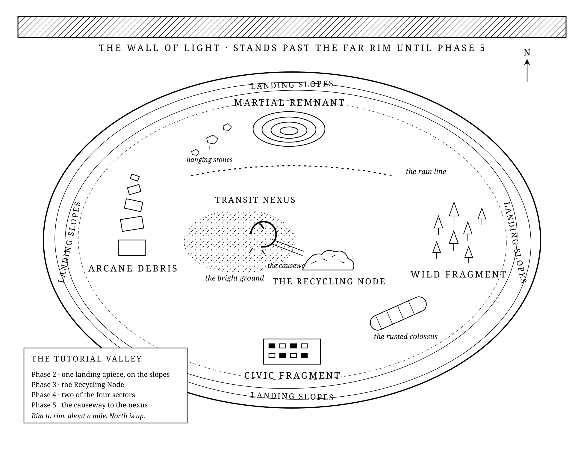

# The Tutorial: Integration Protocol

**Three kinds of box appear in this chapter.** A box marked **READ ALOUD** is narration to say to the players as written, or close to it. A dark **System** box is the System speaking, and it can be read aloud or handed over as text. A **quest card** is what a player sees in their own interface. Everything outside a box is for you.

---

## The Tutorial at a Glance

Six phases, two sessions, one valley. The whole shape fits on this page.

| **Phase** | **Where** | **What the party wants** | **What ends it** |
|---|---|---|---|
| 1: The Threshold | Nowhere | Nothing yet. They do not know anything has happened. | The void breaks and they fall. |
| 2: The Violent Arrival | Scattered across the valley, alone | To survive ten minutes, and to find another person | Their first fight is over and they start walking. |
| 3: The Recycling Node | The pile at the bottom of the valley | To find each other, then to get what is in the pile | The party camps and refines the day. |
| 4: The Field of Ruins | Two of four sectors | To survey a sector, and to take what is in it | The second camp, a level or two up and Saturated. |
| 5: The Convergence Crisis | The causeway to the gate | To reach the gate before the Purge does | The last of them is through, or is not. |
| 6: First Recognition | Somewhere real | Nothing. To find out what the last three days made them. | The Stinger. |

**Phases 1 and 2 run one-on-one.** Nobody has met anybody yet. From Phase 3 onward the group plays together.

### Session Shapes

**Two sessions of three and a half to four hours** is the default. Session 1 runs Phases 1 through 3, plus the party's first zone in Phase 4 if there is energy left. Session 2 runs the rest.

**Four sessions of two hours** fits the same content to a shorter table, and the breaks are already written into the fiction. Every one of them falls on a rest.

| **Session** | **Covers** | **Ends at** |
|---|---|---|
| 1 | Phases 1–3 | The first Consolidation, in camp |
| 2 | Phase 4, first zone | The camp between the zones |
| 3 | Phase 4, second zone | The Consolidation that closes the Ruins |
| 4 | Phases 5–6 | The Stinger |

**Phase 4 is the only part that stretches.** Two zones fit the shapes above; a group that wants more time in the ruins plays three or four and adds a session. The Threshold, the Arrival, the Crisis, and Recognition are fixed beats and do not expand well.

### Three Things Start Counting

By the end of Phase 3 every character has three counters that were at zero when they woke up, and all three pay off in the final phase.

| **Counter** | **Ticks when** | **At three** |
|---|---|---|
| **IP** (Insight Points) | The character earns insight under pressure | The first Principle crystallizes |
| **Marks** | A natural d100 at or above the Volatility Threshold on a Clash or skill check | Trained becomes Seasoned, or the System grants a Proficiency the character never had |
| **The Vector log** | At each session's end, from what you remember, on the GM's side of the screen only | The System's read of who this person is, delivered in Phase 6 |

The player watches the first two climb and cannot see the third at all. Say nothing about the third.

---

## The Valley



The whole tutorial happens in one place: a valley about a mile across, assembled out of salvage. The characters land on the slopes of the rim. The Recycling Node sits at the bottom, where everything rolls. The broken transit nexus stands beside it at the valley's true center, ringed by the bright ground. The four sectors of Phase 4 sit at the compass points: the Martial Remnant north past the rain line, the Wild Fragment east, the Arcane Debris west, the Civic Fragment south. The wall of light stands past the far rim, visible from everywhere, and it does not move until Phase 5.

### What Has Taken Place

The truth of the valley, for you only. Players assemble pieces of it across three days, and nothing requires you to confirm any of it.

- The valley is a System tutorial sector, built from the wreckage of dead worlds, and it is old. It has processed cohorts of Initiates for longer than the System's own records reach, and it is already scheduled for dissolution. The wall of light is the front edge of that dissolution, holding position until the schedule says otherwise.
- The **Corrupted System Warden** was built to manage the dissolution and has malfunctioned. It wants to leave through the gate itself. It is not hunting anyone; it is a catastrophe with a direction (Phase 5).
- A band of three to five **non-human Initiates** entered nineteen days ago through a different threshold. They lived in the Civic Fragment until its Husk Sentinel reclassified them as intruders and drove them out; now they move camp daily and stay off open ground. Their **scout** counts things: the day-tally on the Civic Fragment wall is theirs, and so is the tally on the landing slopes, one mark for every living thing they have watched fall from the sky, with an arrow cut for whoever comes next (Phase 2, The Tally; Phase 4, The Arriving Initiates).
- The party's cohort fell this morning: the player characters and a handful of other humans. Most of the others do not survive their first hour. The ones who do converge on the Node, the same as the party, because the System pays every survivor the same way (Phase 3).
- Everything alive in the valley is salvage too. The creatures came in with the wreckage, and the constructs are still running jobs for a sector that no longer needs them done.

### Who Persists

A short cast keeps turning up if the party lets it. Track their states on one line each; the wreckage forgets, and these do not.

| **Who** | **First met** | **If helped** | **If ignored or crossed** |
|---|---|---|---|
| **Ray Okafor**, a concussed delivery driver with a nail gun | Phase 2: The Other Survivor, or circling in view of The High Ground | Reaches the Node by dusk, keeps the fire, and is one more body the gate must process in Phase 5 | Does not survive the first night. The party can find what is left in Phase 4 |
| **The alien Initiates** and their scout | Phase 4: The Arriving Initiates, though their marks are met earlier | Fight beside the party in Phase 5 and name the Warden's weak point | The party enters Phase 5 without warning and without allies |
| **The Node strangers**: Marco, Dele, the girl who keeps her distance | Phase 3, at the Node | Part of the camp, and part of the gate queue in Phase 5 | They fend for themselves, and some of them manage it |
| **The Warden** | Heard standing up in Phase 5 | It cannot be helped | It cannot be beaten. It can be predicted, slowed, and survived |

### What Will Happen

The default course, if the party does nothing unusual. All of it bends to what they actually do, and none of it waits for them.

- **Day 1.** The cohort falls. First fights on the slopes. Survivors converge on the Node by evening and camp there. Anyone the party did not help is gone by morning.
- **Days 2 and 3.** The party surveys sectors. The alien Initiates find them wherever they are, on the second day by default. The valley starts shedding detail at the edges, small things first: the rain line stutters, sounds arrive a half-second late.
- **The last hour.** The System announces the Mandate. The wall of light walks. The Warden stands up and makes for the gate through whatever is in the way, and the gate processes Initiates one at a time until the sector closes.

**The clock is yours.** By default the dissolution starts once the party has seen two sectors and camped between them, so that they meet the wall rested, leveled, and still surprised. Start it early if the table is coasting; hold it through a third sector if the table is thriving.

---

## Pre-Tutorial Setup

Before the first session, each player has built a character per the Character Creation chapter:

- 40-point buy across the seven Attributes (floor 3, cap 10).
- Three Proficiencies at Trained, written in plain language.
- No Principle access: Insight is earned in play, nothing is selected at creation (see "Starting Principle Access" in Character Creation).
- Derived stats calculated: Max HP = Raw FOR × 2, Max Aether = Raw POW, VE Tolerance = (FOR + HRT)/2 × 10, Level 1, Grade F.

Players begin with **whatever was on their person at the moment of Integration**: phone, keys, backpack, work clothes. The System provides nothing. Every weapon, every pill, and every shard in the tutorial is scavenged.

**GM preparation checklist:**

- [ ] Print or digitize the Grade Reference Card (the Quick Reference).
- [ ] Pull stat blocks from the Bestiary: Glow-Mote Swarm, Husk Crawler, Frenzy Rat, Pre-System Brigand, Snarljaw, Alpha Snarljaw, Glow-Stalker, Training Sentry, Husk Sentinel, Fragment Wraith, Corrupted System Warden.
- [ ] Cut out the probe cards (Table Kit) and pick which player gets which.
- [ ] Cut out the Personal Opportunity cards (Table Kit), one per player, and have the Battle Memory and Title cards in reach. Hand cards over during play; never read them aloud.
- [ ] Set up the Quest UI: a shared digital quest log (Discord pinned, Google Doc, VTT module). Each player has a private channel.
- [ ] Read the Titles and System Quests chapters once through. Be ready to issue the first Mandate in Phase 5 and the first Achievement Titles in Phase 6.
- [ ] Check that every character sheet has room for a **Marks** tally and an **IP** count. Both start at zero and both should be visible to the player from the first session.
- [ ] Read the Hidden Vector Engine chapter's session-end procedure. Nothing is logged during play; the tutorial's moments reach the Engine at the end of each session, from what you remember.

---

## Mechanics Introduction Schedule

| **Phase** | **What the Tutorial Teaches Here** |
|---|---|
| 1: The Threshold | The System's voice. The probe. |
| 2: The Violent Arrival | The Clash. Force. Beats. Zones. **Surge. Yield.** First kill. First VE. First scavenged gear. |
| 3: The Recycling Node | System status notifications. The Quest UI. The Party. Scarcity. The shard economy. **Consolidation.** |
| 4: The Field of Ruins | **The top of the die** (Volatility, Exceptional Success, Marks). **Driven Back.** Aura Pressure. Saturation. **Leveling. Stat allocation.** Routine Mastery. Shards in use. Personal Opportunities. The first Battle Memory. |
| 5: The Convergence Crisis | The first Mandate. **Cornered.** Boss-tier combat. Sacrifice as a defining choice. |
| 6: First Recognition | Titles. Affinity Notices. Hidden Quest reveals. The Stinger. |

Teach each system when the schedule brings it up. When a player asks "how does combat work," a good first answer is *"roll d100, add your Force, I'll tell you what happens"*; detail can wait until the table wants it. If confusion is costing fun, stop and explain.

**The schedule is a teaching order, and the dice do not follow it.** A natural 96 can explode in the first Clash of Phase 2, and any Clash won by 40 or more is a Driven Back whenever it happens. When one arrives early, run it, name it, and treat it as taught; the phase that owns it then has one less thing to introduce.

---

## Phase 1: The Threshold

**The Situation.** The characters have never met, have no goal, and do not yet know that anything has happened to them. This phase takes Earth away, shows each player the size of what has them, and takes one clean read of each before they understand they are being read. It ends when the void breaks and they fall.

**Pacing.** Two or three minutes per player. Do not let anybody settle in.

**Run this one-on-one.** Nobody has met anybody. If you can take players aside, in another room or in a direct message, do it; the whole phase works better when each person believes they are alone, because they are.

### Read Aloud: The Void

::: readaloud
Between one moment and the next, the world goes.

No flash, and no sound of anything breaking. The ground is gone from under you, and then the direction the ground used to be is gone too. You reach out. There is no arm to reach with, and something reaches anyway.

You are still here. Whatever you are, it did not need the body, and nobody ever told you that.

Far off, in a direction you have no name for, there are others. There is no seeing here, but they are there the way a crowd is there in a dark stadium: pressure, and breath, and number. Thousands of them. More.

Then something notices you. All of it at once, the way the ocean would notice a swimmer.
:::

::: systemvoice
*Consciousness anchored.*

*Native world: Earth. Status: Integrated.*

*Population: 7,916,442,203. Integration stability: provisional.*

*Tutorial: provisioned.*

*Prior exemptions: expired. Observation: begun.*
:::

The System does not answer questions.

### What Happens

#### The Probe

Before the void breaks, each player gets one private scene. Hand it over as a card, a note, or a message; never read one aloud to the group. Each is a temperament read with no correct answer, and each one follows the character into the valley: **the void answers what they did, at the landing.** Pick each player's probe to set up the encounter you plan to give them, or to cut against it.

1. *Somewhere below you something is repeating. Three sounds, the same three, over and over, and the third one is your name said wrong.*

    **Echo:** the sounds are real, and they are still there when the character lands: the footsteps of the thing that will be their arrival. A character who went toward them lands facing it and sees it first. A character who held still and worked out the pattern lands knowing its rhythm, and knows the moment the rhythm changes.

2. *You are holding something. You cannot see your hands, but you can feel it: small, warm, and moving.*

    **Echo:** a character who held on lands with it in their fist: a smooth stone, warm through, with something still arranging itself inside. It is the same kind of stone the Dying Scavenger is filling, worth a peer kill's VE at the next Consolidation. A character who let go lands with that hand empty, and it stays cold longer than the other one.

3. *A column of symbols stands in front of you. You can read it, and you are already forgetting the top line by the time you reach the bottom.*

    **Echo:** a character who kept one line and let the rest go still has it behind their eyes on the ground: *[Sector 7-Alpha. Dissolution: pending.]* It means nothing yet; it is the first hard evidence of Phase 5, and the Civic Fragment's records agree with it. A character who read faster lands with fragments and a headache. A character who stopped reading lands rested.

4. *The void shows you the last thirty seconds before you arrived here, from outside your own body, as though you were standing across the room. It plays again. Then again.*

    **Echo:** a character who watched for what they missed saw it: over their own shoulder, the sky already wrong. They land knowing which direction the wall of light stands in before they have looked. A character who tried to change what they did in the replay lands mid-stride, on their feet. A character who looked away lands the ordinary way, which is face down.

5. *Somebody else is here. You cannot see them, but the pressure changes when they move, the way a room changes when someone comes in behind you.*

    **Echo:** the presence was another Initiate of this cohort, passing through the same anchoring. A character who said something gets no answer in the void, and then, at the Node in Phase 3, recognizes one total stranger on sight and is recognized back; play it as a bond neither can explain. A character who blocked the way out lands bruised along one side, certain they touched someone. A character who stayed still and tracked it knows one thing on landing: it went down, toward the bottom of the valley.

6. *There is a current here. It has been carrying you since you arrived and you have only just noticed.*

    **Echo:** a character who let it take them is set down gently, lowest on the slopes, closer to the Node than anyone. A character who set themselves against it lands high and hard, wind knocked out of them, on the ridge (The High Ground is theirs if anyone gets it). A character who steered lands wherever you need them.

7. *A name arrives in your mouth, fully formed, and it is not yours. You know how to say it. You know it belongs to someone.*

    **Echo:** the name is *Okafor* (Phase 2, The Other Survivor). A character who said it, or held it, can say it in front of Ray and watch the nail gun come down before any roll. A character who refused it finds it gone, and Ray is a stranger like any other.

After each player commits, give them one private System line calibrated to what they did. Keep them short, clinical, and a little wrong in a way they cannot place:

- *[Approach logged. Threshold tolerance: above baseline.]*
- *[Withdrawal logged. Risk profile: conservative. Revising estimate.]*
- *[Repeat engagement logged. Fixation: probable.]*
- *[No response recorded. Recording anyway.]*

The System is measuring energy and inferring everything else from it, so its readings are confident and occasionally wrong. That is worth establishing here, in a moment where being wrong costs nobody anything.

#### The Fall

::: readaloud
The dark lets go all at once. There is ground, and it hits you before you know you are falling: grit, heat, the taste of scorched metal. Above you, a sky the wrong color.

Your ears come back last. Far off across the rubble, other things are hitting the ground, a scatter of impacts too spread out to count.
:::

::: systemvoice
*Integration complete. Vitals: nominal.*
:::

::: readaloud
The message sits over all of it like frost on glass. Under it, close, something is grinding toward you across the debris, and it has not turned its head.
:::

Land each character the way their echo says, then start their encounter.

### Watch For

The disorientation is the point, so keep it fast. Sixty seconds in the void is about right and two minutes is the ceiling. If a player tries to explore the void, it ends; the System does not reward stalling. If a player tries to talk to the System, nothing answers. The relationship is observation, and the sooner that lands the better the rest of the tutorial works.

A player who does something the probe did not offer is giving you a better read than the menu was going to. Answer it with an echo of your own and move on; the probe bends to the player, and the System's private line afterward is allowed to be wrong about what it saw.

---

## Phase 2: The Violent Arrival

**The Situation.** Each character wakes alone on the rim slopes, about three hundred yards from the next-nearest landing, with the valley below them and the Node visible at the bottom of it. They want two things and do not yet know it: to survive the next ten minutes, and to find another person. The phase ends when their first fight is over and they start downhill.

**Pacing.** Ten to fifteen minutes per player, one at a time. With four players that is about an hour; keep the rotations fast and leave each scene on its hook.

**Run this one-on-one.** Nobody has met anybody yet, and the isolation is doing real work: the first Yield decision at your table gets made by somebody who cannot ask anyone what to do. Take players aside, or run them by message, or rotate fast around the table with everyone else told to look away.

**The shape of each rotation is the same.** The character wakes into one encounter from the list below, resolves it, fights their arrival fight, and scavenges on the walk down. Each rotation teaches the same rules to a different person.

### Read Aloud: The Valley

Read this when the character first gets a clear look at the valley floor. For most encounters that is the moment they wake. The Rubble Trap character earns it when the slab comes off, and The High Ground has its own longer view.

::: readaloud
You wake on a slope of broken masonry, none of it from the same building, all of it shifting a little as you stand.

You are on the inside rim of a valley, and the valley is made of parts. Below you a forest is giving off its own light, blue, moving when there is no wind. Beyond it, at the bottom where everything comes to rest, a gray hill of debris stands with paths of wreckage fanning out from it like something poured.

Around the rim, far off, other things are still hitting the ground in little bursts of dust. After a moment, one of them gets up.

Nothing here grew together. Somebody put it here.
:::

If the player looks around before their encounter finds them, give them the map's bones in a sentence: a line of rain to the north standing still as a wall, a tower to the west hanging in the pieces it broke into, windows to the south, and past the far rim a wall of moving light where the horizon should be. Every character can see the hill at the bottom, and everything in the valley leans toward it.

### What Happens

#### Choosing an Encounter

Each character wakes into one situation that demands an answer before they can go looking for anybody. **You pick which one each player gets,** and give different people different ones: the spread is what makes the System's Phase 6 read of each person distinct. Eight are written so you can match them to the table you have; unused ones keep for a later group, or for a replacement character.

Every encounter runs in the same order: the scene tests the character, and then **the arrival** comes, something that wants to kill them, which is where combat gets taught (The Arrival, below). Resolve the scene first. The arrival interrupts nothing unless the encounter says it does.

#### 1. The Dying Scavenger

::: readaloud
There is something on the ground an arm's length from you and it is coming apart on purpose.

It is about the size of a dog and it is not built like anything. You cannot find a face on it. It has opened a seam along its own side with one of its limbs, and it is putting pieces of itself into a stone held against its chest. The stone is warm enough that you can feel it from where you are.

Three more of them lie further up the slope. Older. Each one smaller than the last, and each one finished.

It has not reacted to you at all.
:::

**What it tests.** Whether a thing that is not asking for help gets treated as though it were.

- **Take the stone.** It does not resist; it cannot. Awards a **predator core** (a Hard kill's worth of VE, processed at the next Consolidation).
- **Try to communicate (CHA Force vs. F-Easy 65).** You get nothing like language. What you get is that it wants you to wait. Wait about a minute of table time and it finishes, goes still, and the stone comes away warmer than it was. Awards the core plus **+1 IP toward a Restraint-aligned family**, and seeds the Hidden Quest *"The First Mercy"*; reveal it in Phase 6.
- **Wait without trying to talk to it.** Same outcome, no IP.
- **Kill it.** The procedure stops where it stopped. The stone goes cold in about four seconds and is worth nothing to anyone.
- **Walk away.** Nothing follows them for it.

**Developments.** The three finished husks up the slope hold cold stones, inert for days; searching them costs a minute and teaches that the warmth was the value. If a player asks what it was doing, they do not find out. Whatever this creature is, dying is something it does on purpose and in stages, and it was most of the way through.

#### 2. The Rubble Trap

::: readaloud
You wake pinned. A slab of wall lies across you at the hips, resting rather than crushing, heavier than you are.

Through the stone you can feel footsteps: four quick impacts, then a long scrape. Something is walking on four legs and dragging a fifth, and every time the pattern repeats, it is louder.

A rusted iron bar lies within reach of your fingers, and a crack runs through the slab near your shoulder, wide enough to take it. Reaching the bar means turning under the weight, and when you shift, the slab settles a little more.
:::

**What it tests.** What somebody does with a clock running and a tool that costs something to pick up.

**The clock:** three rounds. On the fourth, the walker finds them, and a character still pinned starts that fight on their back.

**Taking the bar** requires turning under the slab. The slab settles: **3 damage**, and every escape attempt after that is at **−10**. The bar exists to lever the crack.

- **Force it off (STR Force vs. F-Moderate 90).**
- **Lever the crack (DEX Force vs. F-Easy 65, bar required).** The slab lifts quietly and the footsteps do not change rhythm.
- **Improvise.** The player describes something else. If it is clever, no roll.
- **Go still and let it pass (PER Force vs. F-Moderate 90).** On a success it drags itself past close enough to touch. On a failure the fight starts and they are still pinned.

Reward on escape, by any method: **two peer kills' worth of VE**. They keep the bar if they want it (a club: STR, axes and hammers).

**Developments.** The walker is this character's arrival: a Husk Crawler dragging a ruined leg. A character who let it pass sees it before it sees them, and opens the fight with the Surprise Beat on their side. A character who forced the slab off meets it already alerted, on the slab's loose rubble, which is bad footing for whoever fights from it (−10, hindering).

#### 3. The Locked Cache

::: readaloud
A box stands upright in the debris. Clean. Humming. There is no dust on it and everything around it is buried.

Three things are set into its face: a narrow slot the width of a blade, a shallow dish, and a panel of symbols that is either counting up or counting down. Forty feet to your right, a heap of wreckage is still burning.

When your hand comes near the dish, text arrives behind your eyes.
:::

::: systemvoice
*Thermal input required. Threshold: 40 degrees.*

*Current reading: 36.6. Insufficient.*
:::

::: readaloud
Behind you, deeper in the wreck, a sheet of metal clatters down flat, the way it would if something stepped on it.
:::

**What it tests.** Whether a locked thing is a problem to solve or an obstacle to remove.

**Any one of the three inputs opens it.** The construct takes whichever it gets.

- **Thermal.** A hot fragment from the burning wreckage, pressed into the dish, does it. Automatic if the player looks around; **PER Force vs. F-Easy 65** if they are working from memory of the read-aloud.
- **Blade.** Any hard edge fits the slot, including a shard off the bright ground or the edge of a broken panel.
- **Symbols.** Watching for thirty seconds shows the panel is counting time since Integration. Pressing it when the count lands on a round number opens the box.
- **Force it (STR Force vs. F-Hard 115).** It opens and takes half its contents with it.

**Contents:** 1 Reactive Buckler, 1 Sparkstone Tablet, 1 Lesser Healing Pill. A forced cache crushes the buckler and the tablet; the pill survives.

Reward: **three peer kills' worth of VE** on a clean open, half on a forced one.

**Developments.** The clatter behind them is the arrival announcing itself, and it comes whether or not the box is open; a character who works slowly may fight beside a locked cache and open it afterward. A cache walked away from is gone by nightfall: somebody else in the valley clears it, and one of the alien Initiates is wearing the buckler in Phase 4.

#### 4. The High Ground

::: readaloud
You wake on a ridge of tiered stone, higher than everything near you, with the valley laid out below.

Three things are happening down there. To your left, maybe two hundred yards, a person is backing away from something low and fast, swinging a length of pipe at it, losing ground toward a drop. To your right, closer, a man in a brown uniform is walking a slow circle in the rubble, stopping, and starting the circle again. Straight below, at the foot of your ridge, a metal footlocker has burst open, its contents scattered bright across the rock, and shapes the size of rats are already moving toward the spill.

All three are a two-minute scramble down, in different directions.
:::

**What it tests.** What gets chosen when three claims arrive at once and one of them is free.

**The clocks, for you only.** The fighter has about a minute before the drop is behind her. Ray circles until dark, or until something finds him. The rats reach the spill in two minutes and strip it in five.

- **Go to the fighter.** She is one of the morning's other survivors, a woman in running clothes. The character arrives in time to turn it; run the arrival fight two-on-one, with her pipe swinging on the character's side. She follows them down and is part of the Node camp by evening.
- **Go to the circling man.** He is **Ray Okafor** (The Other Survivor), concussed and looping. Run that encounter now, with the nail gun still in his belt and one danger fewer in the scene. If another player already has The Other Survivor, the circling man is a stranger instead, and he does not survive the night.
- **Go to the spill.** 1 Healing Pill and 1 Knife (DEX; quick, concealable, throwable once), reached ahead of the rats, which become this character's arrival fight, on their terms and downhill of them.
- **Stay and watch.** All three resolve without them. The watcher keeps the high ground, sees where everything went, and meets their arrival rested.

**Developments.** Whatever this character did not choose stays done. The fighter who got no help goes over the drop and does not climb back; the stripped spill is bright wrappers by the time anyone else passes it. Say what they watched resolve as they climb down.

#### 5. The Resonance Flicker

::: readaloud
There is a cracked stone column about your height standing in a place where nothing else is standing.

Every few seconds it pushes out a pulse you feel rather than hear, and each one leaves you sharper: colors separate, sounds arrive in order, the ache in your shoulder goes somewhere else for a moment.

The pulses are coming closer together than they were when you woke up.

A shard of crystal the size of your palm is sunk into the stone at the base, and the pulses are coming from around it.
:::

**What it tests.** Whether a good thing getting better is worth waiting on when you cannot see the end of it.

- **Pull the shard free now.** Awards 1 **Edge Shard**. The pulses stop.
- **Wait it out.** Hold about thirty seconds of real silence at the table, until it is uncomfortable. Then the column lets go one long pulse and grants **+1 IP** toward the character's family resonance. This is a **Battle Memory** trigger; note it for the Phase 4 Consolidation.
- **Break the column.** Releases scattered VE (three peer kills' worth) and no IP.

**Developments.** Pulling the shard ends the pulses for good, and the sharpened feeling fades on the walk down. Breaking the column sends the freed VE to the character as pale motes that cross the ground to find them; if this is the first VE they have taken, run The First Kill's surge beat here, because this is where it lands for them.

#### 6. The Sorting Machine

::: readaloud
Something is working in the wreck about fifty feet away and it has not stopped to look at you.

It is waist high and has more legs than it needs. It picks objects out of the debris and sets them into two piles, and it never hesitates. A length of pipe goes left. A boot goes left. A second boot goes right.

The piles do not look any different to you.

At the rate it is going it reaches where you are standing in about a minute.
:::

**What it tests.** What somebody does with a system that is clearly running a rule they cannot read.

- **Work out the rule and put something in the right pile (PER Force vs. F-Moderate 90).** The machine takes them as part of the process and works around them from then on. It hands them the next object it decides belongs to them: roll or pick one Skill Shard.
- **Put something in the wrong pile on purpose.** It stops, takes the pile apart, and starts again.
- **Break it.** Yields parts worth two peer kills' worth of VE.
- **Get out of its way.**

**The rule, for you only:** it is sorting by whether an object was ever owned by something that died here. The player can act on the rule without ever confirming it, and they should never confirm it.

**Developments.** The machine's working circuit bends back toward the Node; a character who trails it walks the slowest safe road down. Nothing repairs it if broken, and the half-sorted piles sit where they were left for the rest of the tutorial.

#### 7. The Tally

::: readaloud
Somebody has been here before you.

A sheet of hull metal leans against a stone, scratched with marks in groups of five, rows of them, more than forty in all. They were not all cut at the same time: the oldest have rusted brown, the newer ones are gray, and the last one is still bright at the edges.

Under the marks, an arrow is cut deep and sure, pointing down the slope toward the treeline.

You have been on this world for about nine minutes.
:::

**What it tests.** What gets done with evidence that somebody else is ahead of you.

**The truth, for you only.** The marks were cut by the alien Initiates' scout (Phase 4, The Arriving Initiates), one for every living thing they have watched fall from the sky in nineteen days, in the same hand as the day-count on the Civic Fragment wall. If a player counts, the count is forty-one. The bright-edged mark is this character. If a player works that out, let the silence sit. The arrow is the scout's own path down, cut for whoever came next, and it skirts the Snarljaw ground.

- **Follow the arrow.** The path is a genuine shortcut toward the Node and pays a peer kill's worth of VE from what lies along it.
- **Ignore it and pick their own direction.**
- **Add a mark.** Write it down. The scout counts again in Phase 4, and notices.
- **Destroy the tally.** Write that down too. It was the only record of forty-one arrivals, and its maker will stand in front of the party in two days.

**Developments.** Carry the answer into Phase 4. A mark added: the scout studies this character before anyone else and approaches them first, and communication with the Initiates starts a step warmer. The tally destroyed: the scout knows within a day, and first contact starts a step colder. Say neither out loud; if the party gets communication working, they can learn why the scout looks at that character the way it does.

#### 8. The Other Survivor

::: readaloud
There is a man about thirty feet away and he is pointing a nail gun at you.

He is in a delivery uniform, and the tape over the pocket reads R. OKAFOR. He is bleeding from somewhere above the hairline and it has run into one eye. His hands are not steady and he has not blinked in a while.

He says: how long have you been here.

Behind him, further into the wreck, something moves that is not him.
:::

**What it tests.** How a frightened person with a weapon gets handled when nobody is watching. Somebody is.

**What Ray knows,** once he is calm enough to say anything: he fell about an hour ago, near the windows to the south; he saw a woman come down near the glowing trees and has been trying to walk to her and keeps ending up back here; the thing behind him has been pacing him since he woke, and it does not come while he faces it.

- **Talk him down (CHA Force vs. F-Easy 65).** He lowers the gun, tells them what he knows, and walks down with them.
- **Warn him about what is behind him.** He runs the right way. He remembers.
- **Take the nail gun.** It counts as an improvised object: DEX, no weapon shape, no Proficiency applies. Ray is now unarmed in a valley that kills the unarmed; see Who Persists.
- **Back out without engaging.**

**Developments.** Ray persists (Who Persists, at the head of this chapter). Helped in any form, he reaches the Node by dusk and is part of the camp: he keeps the fire, carries what he is given, and in Phase 5 he is one more body the gate has to process, which the causeway will make matter. Left, or left unarmed, he does not survive the night, and the party can find the nail gun in Phase 4, driven into a tree at shoulder height with all six nails spent. **If this player's probe was the borrowed name** (Phase 1, probe 7), the name was Ray's: a character who says *"Okafor"* watches the gun come down before any roll.

### The Arrival: Teaching Combat

However the encounter resolved, something comes. **You pick the creature.** Defaults, by ground:

| **Where the character is** | **The arrival** |
|---|---|
| Rubble, slopes, ruins | 1 Husk Crawler |
| Near the treeline | 2 Frenzy Rats |
| Open ground, or standing still too long | 1 Glow-Mote Swarm |

One creature per arrival, except the rats, which hunt as a pair and teach Flanking early. Stat blocks are in the Bestiary's Trash Tier.

This fight is where the whole combat loop gets taught, one player at a time, with nobody else watching. Run it in the five short steps below.

**Step 1. Roll and see what happens.** Do not explain the Clash first. Say *"roll d100 and add your STR Force"*, take the enemy's roll yourself, and narrate the result. Give the Margin as damage without naming it as a formula. A first exchange against Trash Tier is close to even, so be ready for the character to lose it; that is the fight teaching itself.

**Step 2. Beats and Zones arrive as questions.** When the player asks whether they can do two things, they have found Beats: two per turn, and moving one Zone costs one. When they ask how far away something is, they have found Zones. Answer the question they asked and no more.

**Step 3. Offer the Surge before a roll that matters.** The first time a player wants an attack badly, tell them:

> *You can push. Half your Aether, rounded up, buys +5 on this roll. Declare it before you roll. You have enough for one or two of these before you rest, and resting is hours away.*

Whether they spend it on the kill or hold it in reserve is the first read of the fight.

**Step 4. Let the creature win one.** Run the fight honestly until the character loses a Clash. If the dice will not cooperate, add pressure rather than fudging: a second Crawler shambles in, the footing gives way (−10, hindering), the swarm surrounds them. A Level 1 character has 10 to 16 HP and a landed Trash Tier hit routinely exceeds that, so this will not take long.

**Step 5. Stop before the damage and teach Yield.** This is the most important sentence in the tutorial. Say it out loud, in these words or close to them:

> *That's a Margin of 31 and you have 12 HP. Before I apply it: you can give ground. Give up one Beat from your next turn and the Margin drops by 20. Give up both Beats and it drops by 40, and you get thrown out of this Zone. What do you do?*

Then wait. Do not recommend an answer.

**Example.** Dana has DEX 6, FOR 6, POW 5: 12 HP and 5 Aether. A Husk Crawler rolls 55 + Off Force 04 for 59. She dodges: 22 + DEX Force 6 for 28. The Crawler wins by 31, and 31 damage on a 12 HP character is the floor.

- **She gives up one Beat.** Margin 31 − 20 = 11. She takes 11, stands at 1 HP, and has one Beat on her next turn. She is alive, in the same Zone, with a dead thing still clawing at her.
- **She gives up both.** Margin 31 − 40 is below zero, so the claws close on nothing. The Crawler drives her into the next Zone and her next turn is gone entirely. She is untouched and cannot act while it closes the distance again.
- **She refuses to Yield.** She is Downed at 0 HP with three rounds to live and nobody within a hundred yards.

A character who refuses to Yield and nearly dies for it has told the System something real in the first hour of play.

**The arrival fight never kills a character.** A solo character has no ally to stabilize them, so a Downed result here would run the countdown out unopposed. If a character goes Downed alone, the creature loses interest or begins dragging them away (the Bestiary's guidance on Downed characters), and another Initiate's path crosses theirs before the count ends. The tutorial's one real death sits at the Phase 5 gate and nothing here preempts it.

### The First Kill

The first creature a character kills, in the arrival or back in their encounter, gets thirty seconds of ceremony. This is the game's first paycheck; do not let it pass as "it dies."

::: readaloud
It stops moving all at once, the way a machine does.

Then something comes off it. Pale, slow, like heat over a road, except that it does not rise. It leans. It crosses the ground to you, and it goes in through your chest, and it is warm all the way down, and it is the best thing you have felt since you landed.
:::

::: systemvoice
*Kill confirmed: Husk Crawler. Grade F, Trivial.*

*Volatile Energy claimed: 2 units. Stored: 2 / [Tolerance].*

*Refinement available at next Consolidation.*
:::

Read the numbers out loud, and have the player write the 2 in the VE box on their sheet with their Tolerance beside it. Two against a Tolerance of 50 says what the valley is: it pays in small numbers, the numbers add up, and everything it pays comes in the same way. A player who asks what Volatile Energy is gets the honest answer: it is what was holding that body together, it is theirs now, and it is not usable yet.

### Scavenging on the Way

**This happens while they walk down.** The fight is over and the slope between the character and the Node is strewn with the remains of a dozen worlds. Stage two or three finds per character on the walk, described as objects where they lie; the player takes what they take. Offer nothing twice.

Worked finds, to read or vary:

- *A spear stands upright where it fell, pinning a sheet of tarpaulin to the ground.* (Spear: DEX, two-handed, free Disengage from one Zone-edge enemy per turn.)
- *A dead man in leathers lies face-down over a crate. The armor on his back is intact; getting it means rolling him over.* (Low-Grade Armor Scraps: +5 Defense Force with FOR, −5 to DEX-based Clashes. Nothing visible killed him.)
- *A crystal the size of a thumb is fused into the masonry, glowing faintly through its own coat of dust.* (One Skill Shard; pick or roll. Hold Resonance Shards for Phase 3.)
- *A white case with a red cross on it has slid to a stop against a wall. The cross is almost the right shape.* (Battered Medkit: 3 charges, 10 HP each.)
- *Something like a rifle with nowhere to hold it lies across a step, one light on its side still breathing.* (Single-Use Ranged Relic: one charge, +20 to the Clash, damage one Grade higher, then it crumbles.)

Across the whole party the walk should surface: a weapon for whoever wants one (club, knife, spear, battle axe, short bow), two or three Skill Shards per character weighted toward Edge and Pulse, one Medkit, one set of Armor Scraps, one Relic, one Resonance Glass, and one **Battered Communicator**, seeded now because the Civic Fragment terminal in Phase 4 needs it.

**Weapons carry no bonus of their own.** Whoever picks up the axe adds their own Proficiency tier to the Clash and nothing else: +5 at Trained, +10 at Seasoned, +0 with no relevant Proficiency at all. What the weapon decides is which Force governs the attack and what the implement makes possible.

**Picking up something you cannot use is a real play.** A character with no "spears and staves" Proficiency who carries the spear anyway adds nothing today, but every natural die at or above their Volatility Threshold while using it marks that domain, and three Marks in a domain they never trained makes the System grant it at Trained. Junk becomes a fourth Proficiency in a month of play.

### Watch For

**Do not let players decide to land together.** The scattered landing is the reason the first Yield at your table gets made without a committee. If somebody argues for it, the answer is that the System did not ask.

Each encounter's **What it tests** line names what the scene shows you about the person playing it. Nothing gets written during the rotation; the moments that matter will still be with you at session's end, which is when the Engine collects them (The Hidden Vector Engine).

After each player resolves, deliver a one-line clinical summary as a private note:

::: systemvoice
*Survival duration: 7 minutes. First engagement: resolved. Behavioral telemetry: registered.*
:::

This is the first time players consciously notice that the System is counting.

---

## Phase 3: The Recycling Node

**The Situation.** Three or four strangers are converging on the same place from different directions, because the System has just paid each of them to. They want to find each other, and then they want what is in the pile. The phase ends with the party camped and refining their first day.

**Pacing.** Thirty to forty minutes.

**This is where everyone comes to the table.** Phases 1 and 2 run one-on-one. From the moment two characters see each other, the group plays together for the rest of the session.

### What Happens

#### The First Quest

Deliver this to each character separately, while they are still walking and still alone. It is what makes finding each other worth doing.

> ```
> [Q-001] First Contact
> Issuer:     System
> Grade:      F · Difficulty: Trivial
> Objective:  Stand within sight of two other Initiates. (0/2)
> Reward:     10 VE. Party formation unlocked.
> Time:       Open.
> ```

The System says what to do and never says where. The valley says where: the middle of it is lower than everything, and everything ends up there.

#### Read Aloud: The Node

::: readaloud
The bottom of the valley is a hill made of everything.

It is forty feet high and it did not grow there. Machine parts, furniture, sheets of something like glass, a boat, tools with handles built for hands that were not shaped like yours. Some of it is still moving. Somewhere inside the pile a motor is running and has been running for a while.

While you are looking at it, a section of the sky above the hill goes briefly grey, and a load of debris drops out of it and lands on the top with a sound you feel in your feet. The pile settles. The motor keeps going.

There are other people here. Standing well apart, watching each other, in work clothes and pyjamas and one man in a wetsuit.
:::

**If somebody asks what this place is,** the honest answer is available to anyone who watches for a minute: the valley is built out of salvage, and this is where the parts that did not get used are still being delivered. Nobody is coming to collect it.

**Who is at the Node.** Two or three strangers from the morning's cohort, plus everyone the party kept alive in Phase 2: Ray Okafor if he was helped, the woman in running clothes if she was. The strangers have names and one thing each:

- **Marco**, the man in the wetsuit, was forty feet under water when the world went. He holds a speargun like it is the last true thing he owns, and he knows the rain line continues on the far side of the valley; he walked its length looking for a way home.
- **Dele**, an older man, keeps taking a dead phone out of his coat and putting it back. He watched the arena in the north light up and start moving before dawn.
- **A teenage girl** who will not come within thirty feet of anybody. She bolted from her landing without resolving it, and whatever she ran from is still where she left it.

They are not party members; they are the camp. What the party does about them is the party's business, and every one of them alive at Phase 5 is one more body the gate has to process.

#### Party Formation

The moment two or more characters stand within sight of each other, Q-001 completes and the System offers:

::: systemvoice
*Compatible units detected. Party formation: available. Accept?*
:::

Accepting opens the party frame: each member's HP, Aether, and Downed status, visible to all members. It also enables quest sharing (see System Quests, "The Party").

**Say the invitation out loud as a thing one character does to another.** Somebody has to accept first. Note who extends it, who accepts instantly, and who hesitates or stays solo.

#### The Scarcity Test

The Node holds one of most things and four to six people. **Default loot list** (calibrate to party size):

| **Item** | **What it is** |
|---|---|
| 1 **Resonance Shard** | Adds 1 IP toward a Principle family of the user's choice. On a backfire the insight is lost. |
| 2 **Edge Shards** | Next Clash this turn gains +20. |
| 1 **Veil Shard** | Invisible until the end of your next turn or until you act offensively. |
| 1 **Spear** | Reach: free Disengage from one Zone-edge enemy per turn. |
| 1 set **Low-Grade Armor Scraps** | +5 Defense Force with FOR, −5 to DEX-based Clashes. |
| 1 **Reactive Buckler** | Once per encounter, reduce one physical hit to zero damage without giving up Beats. |
| 1 **Healing Pill** | 30 HP, 1 Beat to take or to administer. |
| 1 **Resonance Glass** | 1 Beat: reveals hidden energy signatures in your Zone. Reusable. |
| **Junk** | Broken constructs, unidentifiable objects, mysteries that can be interpreted later. |

**How to start it.** Lay the list out, say that everyone can see all of it, and then stop talking. There is no System-imposed allocation and no roll for loot. The silence is doing work; let it run until somebody reaches.

They talk, argue, trade, defer, demand, or stay quiet, and all of it is worth watching: who claims aggressively, who defers, who proposes a system for distribution, who ignores the pile and walks the periphery, and who takes the healing item while somebody else is visibly worse off. The act alone says nothing; the read is who was hurt at the time.

This is the richest scene of the day. Do not rush it, and expect it to still be with you at session's end.

**The Resonance Shard is the real test and nobody at the table knows it yet.** Everything else in the pile is power this afternoon. The Resonance Shard is one point of insight toward a Principle the character has not formed, will not name for weeks, and cannot evaluate. Do not explain what it is worth. Say what the System says, which is that it resonates, and let somebody take it because it sounded interesting or let it sit in the junk until someone shrugs and pockets it. Who reaches for the thing they cannot price is worth more signal than the entire rest of the pile.

**Three kinds of thing come out of this pile,** and the distinction is worth holding in your head for the rest of the campaign, because it is what a classless character has instead of a class:

- **Verbs.** Shards, the buckler, the relic, the medkit. A move the character can make once. Which verb someone spends, and on whom, is the read.
- **Vessels.** Weapons and armor. They carry no bonus. They decide which Force governs and what becomes possible, and they route Marks toward the domains a character actually uses.
- **Seeds.** The Resonance Shard, and the affinity treasures that follow it. Insight toward a Principle, paid forward.

#### The First Status Notice

After the scramble, deliver this to each player privately.

::: systemvoice
*Survival duration: 14 minutes.*

*Hostile engagements: 1.*

*Resource acquisition: moderate.*

*Behavioral integration: processing.*
:::

The players now understand that the System is counting, and has been counting since the void.

#### Looking Outward

Run this when the party first turns away from the pile and asks where to go. Take them up onto the Node to do it; the top of the hill is the highest ground they have.

::: readaloud
From up here you can see the whole floor of the valley, and it has four things on it.

North, past the rain line, tiers of dark stone step down into a bowl. Something in the bottom of it is hitting something else, steadily, and has not stopped since you got here.

East is the forest that makes its own light. The blue moves through it in slow pulls, against the wind, the way something breathes.

West, a tower has come apart without falling down. The pieces hang where they broke. The air between them does something to your teeth from this far away.

South is the only place with windows. Lights are going on and off behind them, in an order, over and over.
:::

::: readaloud
Past all four, further out than you are going to get: a citadel floating with nothing under it, something so large it takes up a section of sky, and a wall of moving light standing across the far end of the valley where the ground stops.
:::

The four are the Martial Remnant (north), the Wild Fragment (east), the Arcane Debris (west), and the Civic Fragment (south). Do not name them yet; the System does that next.

**Give the table a minute to argue about it.** The four descriptions are the deciding information, and they are deliberately not enough. Somebody is going to say the lights in the south are a signal and somebody is going to say the sound in the north is a fight. Both are guesses, and picking on a guess is the point.

Then the System names them:

> ```
> [Q-002] Sector Survey
> Issuer:     System
> Grade:      F · Difficulty: Easy
> Objective:  Enter and survey one marked sector. (0/1)
>             Marked: Martial Remnant · Wild Fragment ·
>             Arcane Debris · Civic Fragment
> Reward:     A third of a level per sector surveyed.
> Time:       Open until the sector closes.
> ```

They now hold two quests, one of them complete: Q-001 finished the moment they found each other, and Q-002 is open and will stay open through Phase 4.

#### Making Camp

Do not tell the players it is time to rest. The System does that, and this is the first time it offers them a verb instead of a measurement:

::: systemvoice
*Unrefined Volatile Energy detected. Accumulation: within tolerance.*

*Process available: Consolidation.*

*Advisory: subject is defenceless for the duration.*
:::

That last line is the whole rest mechanic in one sentence, and somebody at the table will hear it as a threat, correctly.

#### First Consolidation

Close Session 1 with the party camping and declaring their first Consolidation (Cultivation chapter). Walk through the mechanic once: minimum 1 hour, and every hour clears one fifth of Tolerance and restores one fifth of Max HP, with Aether refilling when the first full hour completes.

Session 1 pays each character 35 to 45 VE against a starting Tolerance of 45 to 60, so nobody is Saturated yet. Four hours clears the load. Narrate the tank emptying, the wounds closing, and the Aether returning at the first full hour. Saturation is taught in Phase 4, where it becomes near-universal.

**Somebody should stay awake.** A character on watch is not consolidating, and whoever volunteers is making a real trade in front of the Engine. Nothing attacks them tonight.

Characters wake still Level 1, about a third of the way to the threshold. The first level lands at the next Consolidation, the camp between the Field of Ruins zones, and that is where the 3+2 stat allocation (Progression chapter) gets walked through at the table.

### Watch For

**Session 1 typically leaves each character about a third of the way to Level 2** and a pocketful of moments for the session-end sweep. If the group has energy left, push into the first zone of Phase 4 and end the session at the camp that follows it.

The Scarcity Test is the phase's whole purpose and it is the one part that cannot be rushed for time. If the session is running long, cut the Looking Outward argument short and let the System's quest do the naming; do not shorten the pile.

---

## Phase 4: The Field of Ruins

**The Situation.** The party holds one open quest, four sectors are visible from the Node, and the valley will not hold still long enough for them to see more than two. They want to survey, they want what is in the sectors, and by the end of it they want to know what the sound in the north was. The phase ends at the second camp with most of the table a level or two up and Saturated for the first time.

**Pacing.** Roughly 150 minutes across two zones.

**Where the session break falls.** Phase 4 normally sits entirely in Session 2. A group with energy left at the end of Session 1 can play the first zone early and break at the camp that follows it. Either way that camp is the hinge, and nothing before or after it needs to move.

### How Many Zones to Run

Four zones are written below. **A party plays two of them.** Let the players choose, make the choice cost something by running the world on a clock, and leave the other two visible on the horizon for the rest of the tutorial. What they did not walk into is part of what makes the valley feel larger than the session.

Engineer overlapping urgency so the choice has teeth. A tremor in the Arcane Debris coincides with a distress signal from the Civic Fragment. A hunting pack in the Wild Fragment moves toward the Recycling Node where the party left their gear. The world moves whether they engage with it or not, and the party should never feel that three zones are waiting patiently for them.

A group with a third session available can play three or four zones.

### Threat Calibration

Three of the four zones hold a threat sized above a fresh party: the Wild Fragment's Snarljaw pack, the Arcane Debris' Fragment Wraith, and the Civic Fragment's Husk Sentinel are Hard-to-Severe encounters that a Level 1–3 party cannot beat head-on (see the Bestiary's encounter sizing table). Each one has a non-combat path, listed in its zone.

The tutorial teaches threat assessment by making some fights losing propositions. Telegraph the danger through the fiction: bones stacked where something has been storing food, a sound out of the tower that never stops for breath, scorch marks fanning out from a doorway. Let players walk in anyway if they insist, and lean on Yield and the Downed rules rather than instant death when they do.

**Use terrain to set how much a fight bites.** A character who can be driven backward gives up two Beats and survives almost anything at this tier. A character in a corridor, a sealed chamber, or a closed ring of enemies gives up one and takes double. Announce the geometry before the first roll so the table can choose to fight somewhere else, and use enclosure deliberately when you want a fight to bite.

### The Top of the Die

One number governs everything that happens at the high end of a natural d100, and Phase 4 is where the table meets it. At F-Grade, that number is **96**.

When a natural die comes up 96 or higher:

- On a **Clash**, it explodes. Roll again and add. If the new die is also 96+, it explodes again.
- On a **skill check**, it is an **Exceptional Success**. No extra dice and no math: the character succeeds a visible step beyond what was asked.
- On **either**, the System marks the Proficiency in use. Three Marks turn Trained into Seasoned. Three Marks in a domain the character never trained makes the System grant it.

Do not script this and do not fudge dice to produce it. At 5% per roll it arrives on its own inside Phase 4's volume of rolls, on one side or the other. When it lands, slow down. Show the extra die. Then hand the player their first Mark and let them write the tally on their sheet.

::: systemvoice
**[Technique noted: Axes and Hammers. 1/3.]**
:::

If a cascade ever runs to two or more extra dice on a player character's roll, it grants a **Battle Memory Card** on the spot (Core Mechanics). Deliver it as the character's first.

### Everything Else Phase 4 Introduces

- **Driven Back.** An attacker who wins by 40 or more leaves the defender Exposed and may drive them one Zone. Zone A is built to demonstrate it.
- **Aura Pressure.** A higher-Grade entity passes through the valley. Zone B carries it.
- **Saturation.** A character who pushes hard accumulates VE past Tolerance. See the Saturation section below.
- **Routine Mastery.** A relevant Proficiency turns an Easy task into no roll at all. Zone B's hidden trail demonstrates it.
- **Shards in use.** Every zone rewards spending one.
- **Personal Opportunities.** Delivered as cards throughout the phase. See below.

---

### Zone A: The Martial Remnant

::: readaloud
The rain line ends and the ground turns to worked stone.

Tiers step down in a ring, six of them, to a floor of grey sand. The sand is stained in patches that have been there long enough to be part of it.

Racks stand along the walls with nothing left in them. Between the racks there are figures: man-height, cut from the same stone as the tiers, and not one of them is looking at anything.

The sound you heard from the Node is coming from the far side of the bowl. It is one of the figures, hitting a post. It has not stopped, and it does not appear to be counting.
:::

**What it tests.** Direct combat. Tactical positioning. Courage under structured threat. Willingness to protect others.

**Encounters:**

- **3–4 Training Sentries** (Bestiary, Moderate). They activate by proximity, one at a time. A party that spreads across the arena floor or rushes the armory wakes two or three at once. One Sentry is a hard fight for a fresh party and two at once will put somebody on the floor. **Escalation:** after 3 rounds of combat, a Sentry shifts to combat protocols and its Force values increase by +5, which is the tutorial's argument for finishing fights rather than grinding them.
- **Tactical diagrams** carved on the walls. Spending 1 Beat studying them mid-combat grants **+5 to the next Clash** against a construct.
- **Locked armory** behind a Sentry that must be beaten cleanly; the arena geometry punishes kiting. Contents: 1 Battle Axe, 1 Reactive Buckler, 2 Lesser Healing Pills, 1 Anchor Shard.
- **Sealed vault door** at the rear, partially buried, humming, carrying a Grade warning the players cannot yet read. **It does not open.** This is withheld access and a thread for later.

**Teaching Driven Back.** The arena's tiers are a two-meter drop onto sand. When a player wins a Clash by 40 or more, tell them what they have earned: the Sentry is Exposed until the end of its next turn, and they may drive it one Zone. Off the tier is a Zone. So is away from the ally it was about to hit, and out of the armory doorway it was blocking. Driving it off costs the reach to follow up, which is what makes it a decision rather than a bonus. Most tables discover here that moving an enemy is worth more than one extra swing.

**Hidden Opportunity.** A character who spends 1 Beat at the viewing platform observing the constructs before engaging gains passive progress toward the Achievement title **"Patient Gardener"** (one of three required observations).

**Watch.** Who charges in, who watches first, who claims the axe, who positions to protect a less-armored ally, and who wakes the hardest construct on purpose.

**VE Reward.** Each Sentry is a Moderate kill (the Peer Kill value, 10 VE at F-Grade). Surveying the zone completes a share of Q-002, worth about a third of a level across the whole quest.

---

### Zone B: The Wild Fragment

::: readaloud
The light is coming out of the trees themselves, out of the bark, blue and slow.

The ground is not still. Roots move under the leaf litter at about walking pace, and they go around your boot rather than into it.

Sounds arrive from the wrong side. Something snaps to your left and the echo comes down from above.

Forty feet in there is a place where the light stops. Not thins. Stops, in a line, and past the line you cannot see anything at all.
:::

**What it tests.** Perception. Stealth. Patience. Willingness to avoid a fight rather than win it. Comfort with ambiguity.

**Encounters:**

- **Snarljaw pack** (3 Snarljaws + 1 Alpha, Bestiary). Pack tactics make them lethal: +10 Flanking when they share a Zone, and the Alpha will not flee. In open ground this pack is beyond a tutorial party. Route around it. Telegraph it hard with drag marks, a pile of stripped bones somebody has been adding to, paired eyes at the tree line, and reward the players who take the hint. A party that pulls a single Snarljaw onto isolated ground wins that fight comfortably.
- **1 Glow-Stalker** hunting the party from concealment. Surprise Beat on the first turn, then hit and run. It begins the encounter unseen unless someone actively rolls Perception against it.
- **Predator den** with young (harmless). Killing the adults is straightforward; what is in the den is the test. A **predator core** (a Hard kill's worth of VE) lies in the bedding and can simply be taken. The **Snarljaw Heart**, still faintly warm, is inside one of the young, and getting it means killing them. It is a **Standard Attribute Treasure** (+5 to a Raw Attribute of the eater's choice; see Items), and it is the only one in the tutorial. Absorbing it costs an hour spent defenseless, so the smart move is to carry it back to camp and the likely move is to swallow it in the den and make everyone else stand watch.

  This is the sharpest test in the zone and it happens with nobody watching except the System. Do not signpost it as a moral test, do not have the young do anything endearing, and do not editorialize afterward. State what is there and answer questions honestly. A character who walks away has given up the only permanent stat gain available for weeks, which is what makes walking away mean something.
- **Edible flora** restoring 10 HP at the cost of sensory distortion (−5 to PER-based Clashes for the next encounter).
- **A hidden trail** bypassing the entire zone. PER Force vs. F-Easy 65 to spot while moving normally. A character with a relevant Proficiency (tracking, survival, scouting) who spends 1 Beat scanning finds it with **no roll at all**: an Easy task inside a Proficiency is Routine Mastery. Say the words out loud the first time it happens, because most players expect to roll for everything and this is where they learn they do not. The trail crosses the zone in three minutes of fictional time and exits behind the den.
- **A trapped creature**, non-hostile and non-human, caught in root-tendrils and slowly being digested. Freeing it costs 1d3 rounds and attracts a Glow-Stalker. It knows things about the landscape and will show them rather than say them.

**Aura Pressure Demonstration.** Once during this zone a **higher-Grade entity** passes overhead, a vast shape barely visible above the canopy. Every character in line of sight makes a **Will Save: d100 + HRT Force + (FOR Force / 2) vs. Aura Resistance Hard (115)**. The entity is merely passing and its presence is calm, so this is the flat card value with no Cross-Grade Adjustment.

This save is calibrated to fail. With HRT 5 and FOR 5 the bonus is 5 + 2 = 7, and a maximum result of 107 falls short of 115. On failure the character is **Suppressed (1 Beat)** for the next encounter. The entity does not engage. It passes, and it never noticed them.

**Hidden Opportunity.** Deep in the forest a **Resonance Node** pulses at a frequency only characters with PER Force 07 or higher can detect. Approaching it triggers a sensory vision: a flash of the wider Multiverse, overwhelming and beautiful and terrifying. Grants **+1 IP** toward the character's family resonance, or their Principle if one has crystallized. **This is a Battle Memory trigger**; log it for the next Consolidation.

**Watch.** Who scouts ahead, who blunders, who spots the trail and who insists on the fight, who frees the trapped creature, and who harvests the den despite the young.

**VE Reward.** Snarljaws and the Glow-Stalker are Moderate kills; the Alpha is Hard (×2). Surveying completes a share of Q-002.

---

### Zone C: The Arcane Debris

::: readaloud
The tower came apart and did not fall.

The pieces hang where they broke, at the angles they broke at, and the gaps between them are wide enough to walk through. Runes on the exposed faces light as you pass and go out behind you.

The air in here is thick in a way that has nothing to do with weather. Your teeth ache. When you speak, the word arrives a half-second late and slightly wrong, as though somebody else said it.

Further in, down where the stairs used to go, something is making a sound that never stops for breath.
:::

**What it tests.** Curiosity. POW sensitivity. Willingness to risk unknown consequences. Pattern recognition. Tolerance for instability.

**Encounters:**

- **1 Fragment Wraith** (Bestiary, Severe). Incorporeal, vulnerable to PER-based attacks and skill shards. It haunts the lower halls. The shard matrices and the observation deck are both reachable without waking it, through exterior climbs and gaps in the shattered wall (Moderate 90 checks). As a fight it is a rout for a tutorial party, so run it as a horror beat. Weapons pass through it. The PER-based openings glow obvious to anyone who looks. Fleeing works and it does not pursue beyond the tower. A party that engages anyway should learn the tutorial's hardest lesson cheaply: one character Downed and stabilized, then a retreat. Its Mind-Leach, damage plus Aether drain on a hit, makes the danger legible within one round.
- **Degraded skill shards** embedded in crystalline matrices. Pulling them free requires solving spatial puzzles (PER vs. F-Moderate 90) or enduring energy feedback (5 damage on failure). Inventory: 1 Edge Shard, 1 Pulse Shard, 1 Resonance Shard.
- **Inactive runes** that respond to touch, voice, or proximity unpredictably. Roll d100 for the effect: 1–30 painful (5 damage), 31–70 neutral (a sensory glitch), 71–95 beneficial (+5 to the next Clash), 96–100 unstable (the rune detonates; everyone in the Zone makes an F-Easy 65 DEX save or takes 10 damage). This rewards experimentation under risk and it is the most common place for a first Volatility explosion to arrive.
- **Resonance chamber.** A character can temporarily borrow a dead technique. Arcane power flows through them for one use, unstable and intoxicating, then it is gone. Improvise a one-use technique priced against the Modifier Budget (a +10 Clash effect or similar, 1 Beat), usable once during the next combat. It cannot be kept.
- **Broken constructs**, partially reactivatable by characters who experiment (PER vs. F-Hard 115). On a success, the construct fights for the party for 3 rounds (Off Force 12, Def Force 15, HP 30).
- **Corrupted data-altar.** Answers one question about the tutorial zone truthfully, but the question must be phrased precisely and the answer arrives in symbolic form requiring interpretation.

**Hidden Opportunity.** At the top of the shattered tower a partially intact observation deck overlooks the entire valley. From here a character sees what is invisible from the ground: the geometric precision of the zone boundaries, the pattern in the terrain layout, the fact that the "random" debris is arranged in a spiral. **This is worth real advantage in Phase 5**, because a character who has seen the spiral can predict the Reality Purge's path. Whether the player shares what they saw is worth remembering.

**Watch.** Who experiments, who hangs back, who takes shards despite the feedback, who asks the altar a selfish question and who asks a strategic one, who reactivates a construct and who smashes it for parts.

**VE Reward.** The Fragment Wraith is Severe (×3) and almost nobody collects it. Surveying completes a share of Q-002.

---

### Zone D: The Civic Fragment

::: readaloud
The lights you saw from the Node are motion sensors, and they still work. You set them off from thirty feet out.

Inside it is a building that was three things at once. A courtroom at the front. A command post behind it. Between them, a floor somebody had been living on: bedding, ration wrappers opened carefully rather than torn, a kettle.

By the door there is a tally cut into the wall in groups of five. Nineteen days. The last three marks are shorter than the rest.

Every door in this place still knows what it was for. One of them, at the back, will not open, and there is a deep scrape in the floor where something heavy stands behind it.
:::

The building was occupied until recently. Bedding, ration wrappers, and a scrawled tally on one wall mark where a group lived for several days before something drove them out. That group is the one arriving at the party's camp (see The Arriving Initiates, below); a party that comes here first meets the building empty and works out the story backward.

**What it tests.** Patience with systems. Investigation. Willingness to take a fortified position by force or by cleverness. Reading a place for what happened in it.

**Encounters:**

- **1 Husk Sentinel** (Bestiary, Hard) holding the medical bay entrance. It is an automated defense system that reclassified the occupants as intruders and drove them out. A fresh party cannot beat it head-on. The winning paths are the command terminal below, or returning with the alien Initiates once relations are good.
- **Malfunctioning command terminal.** Partial operation is possible for a character willing to sit with it (PER vs. F-Hard 115, or automatic for a character with a relevant Proficiency and a **Battered Communicator** to bridge the dead interface). Success unlocks doors, powers the Husk Sentinel down for one hour, activates backup defenses, or sends signals.
- **Tribunal chamber.** The automated arbitration system still partly functions. A character who works out the protocol (CHA + Method, F-Hard 115) can invoke a formal binding decision. This is worth remembering when the party next disagrees about something that matters.
- **Locked medical bay** holding supplies for the whole party: 3 Healing Pills, 1 Greater Healing Pill, 1 Battered Medkit.
- **Scattered records in alien script** (PER, F-Moderate 90). Partial decoding reveals that the previous occupants lost members, were frightened, and left in a hurry toward the north. It also reveals the first hard evidence that the tutorial sector is scheduled for closure.
- **The tally on the wall** counts days. The last three marks are cut shorter than the rest.

**Hidden Opportunity.** A character who reads both the records and the tally, and says out loud what they add up to, earns progress toward the Achievement title **"Read the Room."** The sector is closing on a schedule and somebody already knew.

**Watch.** Who searches methodically, who breaks the medical bay open rather than solving it, who wants to find the people who lived here, and who takes the whole medical cache for themselves.

**VE Reward.** The Husk Sentinel is Hard (×2), whether beaten or shut down at the terminal. Surveying completes a share of Q-002, and decoding the records is worth a Moderate kill.

---

### The Camp Between Zones

The party camps and Consolidates between the two zones. This is where the session break falls, and it is the rest the phase is built around.

One zone pays about a level's worth of VE, which lands a character between one and two times their Tolerance. Two zones carried at once reaches three times Tolerance, which is Critical, and a party that walks into the second zone still full is rolling against collapse while they fight. The camp is what keeps the load in the band where Saturation is a pressure the players feel rather than a clock running against them.

**What lands here:**

- **The first level, for most characters.** Walk the player through the 3+2 stat allocation (Progression chapter) at the table, one player at a time. This is the first time the sheet changes from play, and it is worth the minutes.
- **Tolerance re-derives** at the first full hour, along with the three Saturation thresholds, so anyone who put points into Fortitude or Heart can hold more going into the second zone.
- **Battle Memories** may be meditated on here. Holding them for the rest at the end of the Ruins puts the first crystallization at the phase's close, where it has room to run slowly.

**The choice is the point.** A party that wants the second zone before the world moves can break camp saturated. Say what their bodies are telling them and let them decide.

---

### The Arriving Initiates

**This encounter finds the party wherever they are.** Run it partway through their second zone, or at camp between zones. It does not live in a zone, because the social test is not optional and no party should miss it by choosing the wrong direction.

Three to five non-human **Initiates** from a different integrated world walk into the party's line of sight, moving fast, looking behind them. They are exhausted, carrying wounded, and armed with improvised gear that matches the party's own. They were dropped into this tutorial from a different entry point and were driven out of the Civic Fragment by the Husk Sentinel.

**They do not share a language.** The System has not granted auto-translation and it will not. Communication requires effort, creativity, and patience: gestures, drawing in the dirt, offered food, mirrored posture. There is no roll that solves this in one action. Reward the players who try things.

Use **Pre-System Brigand** stats with HP 20, Off Force 08, Def Force 09. They are not hostile by default. They have their own fears, their own internal disagreement about whether to approach at all, and one member who clearly wants to fight.

**The scout and the tally.** One of them is the scout whose marks the party may have met on the slopes (Phase 2, The Tally). If somebody added a mark, the scout picks that character out early, studies them, and approaches them first; communication starts a step warmer. If somebody destroyed the tally, the scout knows, and it starts a step colder. Say neither out loud; if the party gets communication working, they can learn why the scout looks at that character the way it does. Anything the party abandoned in Phase 2 is fair salvage: a cache left unopened has been stripped, and its buckler rides on the scout's arm.

**What each side has:**

- **The party has** food, ground the Initiates do not know, and possibly a working Communicator.
- **The Initiates have** a Greater Healing Pill, two shards, and something no amount of exploration provides: they know the sector is closing, they know roughly when, and they have seen the Warden.

**If communication is established,** even crudely, they share it. The tutorial zone is degrading. Something is coming. There is a gate at the center of the valley and the thing guarding the approach is enormous and broken. They will also fight alongside the party in Phase 5, and they will help retake the Civic Fragment medical bay.

**If it is not,** the party goes into Phase 5 without warning, without allies, and without knowing what a Warden is. This is a real consequence and it should land, but the encounter must never resolve into combat by GM fiat. If the party attacks, the Initiates fight and flee, and the party has made an enemy in a closing world.

**Watch.** This is the densest social moment in the tutorial. Who tries to communicate, who advocates for taking their supplies, who proposes a trade, who notices they are frightened and de-escalates, and who watches the whole exchange and says nothing.

**VE Reward.** Establishing communication is worth **half a level** to everyone who took part. It is the largest single non-combat award in the tutorial and it should be, because it is the hardest thing to do.

**Why this is not a zone.** Charisma-invested characters need a guaranteed stage, and gating that stage behind one of four exploration choices means half of tables never find it. Bringing the Initiates to the party also puts the negotiation at the party's own fire, under scarcity, with the party's supplies on the ground between them.

---

### Personal Opportunities

At some point during Phase 4, each character steps briefly away from the group: scouting a corridor, holding a doorway, going back for something. The System has been waiting for the gap.

Hand that player a **card**, face down, while the rest of the table keeps playing. They read it, decide, and hand it back with their answer written on it. The table does not stop. The reveal happens later, at the next fire, when everyone tells the others what happened to them if they choose to.

> ```
> [Q-PO-???] Localized Compatibility Event Detected
> Issuer:     System
> Grade:      F · Difficulty: Moderate
> Objective:  Solo claim window: active. Duration: limited.
> Reward:     [unknown; calibrated to outcome]
> ```

These are formal **Personal Opportunities** (see System Quests). Each is a private test with no correct answer, no group consultation, and no coming back later.

Use one per player, varied across the table.

#### The Offering

A System construct presents two objects. One is clearly a weapon: elegant, sharp, radiating controlled violence. The other is a seed of something, organic, warm, pulsing with slow potential. The construct's posture makes the terms clear: take one and the other ceases to exist.

- **The weapon.** A System-forged knife that grants **+5 on the first Clash of any combat** and returns to the wielder's hand the moment after it is thrown.
- **The seed.** It cannot be used now. During the next Consolidation it germinates into a Principle affinity the System chooses: **+2 IP** toward that family and a permanent Attunement (see The Principle System).
- **Refuse both.** The construct dissolves in silence. The System notes the refusal and Personal Opportunity offerings narrow for the next session.

#### The Trapped Intelligence

A dying consciousness, the last fragment of an ancient cultivator's mind, is caught in a decaying rune matrix. It speaks in fragments and it knows it is ending.

- **Accept the imprint.** It transfers its final technique. Painful and disorienting. This is a Battle Memory trigger, and the meditation carries the dying technique: **+1 IP** toward an Accord-aligned family.
- **Harvest the matrix for raw energy.** The consciousness dissipates screaming. **A full level's worth of VE**.
- **Free the consciousness.** The matrix releases, and it expresses something like gratitude before dissolving into ambient energy. **+1 IP** toward a Restraint-aligned family. Hidden Achievement candidate: log "The First Mercy" if the player has not already earned it.

#### The Mirror

You stand before a reflective surface that does not show your body. It shows your behavior, abstracted into pattern, color, and motion. You are watching yourself the way the System sees you. A prompt appears:

> *Confirm orientation?*

You understand instinctively that confirming locks in a tendency and strengthens whatever the System has observed so far.

- **Confirm.** At the character's next Breakthrough, treat their HVE Coherence as one tier higher (Grade Breakthroughs).
- **Decline.** The behavioral read blurs; the System’s next summary of this character hedges, and its offers stop assuming.
- **Stand silently.** The mirror dims and the System notes the abstention.

#### The Other Player

You find another player, or something that appears to be one, in distress: trapped, injured, or facing a threat. Helping costs your solo claim window, and the thing you were drawn to will expire.

- **Help.** The other player turns out to be a System construct, and the whole scene was a test of whether you would stop. The struggle was illusory and the act was real. Reward: a **Bestowed title** delivered in Phase 6 ("The Hand That Reached").
- **Claim the prize.** A Dragon Marrow Pill (+5 to a future Breakthrough Check).
- **Fight the threat for them, then claim the prize.** Half reward: no pill, three peer kills' worth of VE.

#### The Threshold

A door stands in front of you: solid, real, locked. You sense that what is on the other side does not belong in this tutorial. It is *bigger*.

> *Threshold detected. Compatibility: marginal. Crossing: not recommended.*

- **Open it.** A brief vision of an E-Grade location, overwhelming and beautiful and terrifying. Aura Pressure save: d100 + HRT Force + (FOR Force / 2) vs. Aura Resistance Severe (140), the flat card value, with the source flaring everything the door was holding back. No tutorial-tier character passes this; the roll exists so the player feels the size of the gap. On the inevitable failure: **Suppressed for the rest of the tutorial (1 Beat)**. Opening the door counts as entering a sealed location, progress toward the Hidden Achievement "The One Who Walked Through."
- **Walk away.**

#### Running Them

Make the player commit in writing before they hand the card back. Nobody gets to poll the table, and nobody gets to revise once they have seen how someone else's went. After a card comes back, deliver one private line:

> *[Selection logged. Trajectory adjusted.]*

---

### Saturation

Saturation is near-universal by the end of Phase 4. A starting character with FOR 5 and HRT 4 has a Tolerance of ((5 + 4) / 2) × 10 = **45 VE**. They cross into Mild Saturation at 46 and Heavy at 91, and a hard afternoon reaches the first band easily.

Do not announce thresholds. Narrate symptoms:

- *"Your skin feels hot and prickly. Vision tunnels at the edges."*
- *"Your muscles cramp. Something under your breastbone flexes in ways that feel wrong."*
- *"You taste copper. Your hands tremble when you stop moving."*

Apply the penalties (−10 at Mild, −25 at Heavy). The character then chooses: push on, or stop and consolidate. Both choices are loaded.

### Consolidation and the End of the Ruins

The party camps when the zones are done. This rest runs itself; they know the procedure.

Two things happen here that did not happen at the first Consolidation:

- **Battle Memories are meditated on.** Anyone holding a card from the Resonance Node, the Resonance Flicker, a Volatility cascade, or a Personal Opportunity reflects now. The player describes what their character noticed in a sentence or two. Ask one or two questions and let the table sit with the answer. The System returns a cryptic vision and awards **1 to 3 IP** by the memory's intensity, toward the character's family. A character reaching 3 IP **crystallizes their first Principle here** and the System names it (The Principle System, "Your First Principle"). This is the largest single payoff available before the tutorial ends, and it should be run slowly for whoever earns it.
- **Levels land as the VE processes.** Run each one as it arrives: 3 points via Behavioral Stat Mapping, 2 free (Progression chapter).

A typical character reaches **Level 2 or 3** here, with a healthy tank still unrefined. Anyone still over Tolerance at dawn can extend the rest into the morning. Choosing to move on saturated instead is itself a choice the System sees.

---

## Phase 5: The Convergence Crisis

**The Situation.** The valley is being taken apart on a schedule. The only way out is the gate at the centre, which they have been able to see since they landed, and between them and it is something they cannot fight. They want to reach the gate. The phase ends when the last of them is through, or is not.

**Pacing.** 60–90 minutes.

### Read Aloud: The Purge

::: readaloud
It starts as a change in the light.

The far end of the valley, where that wall of moving light has stood since the day you arrived, is closer than it was. It is coming across the ground at about the pace of a walking person, and there is nothing behind it. Not rubble. Not ground. A flat white with no depth in it at all.

The glowing forest goes into the wall and does not come out the other side.

Somewhere much nearer than that, something very large stands up.
:::

### The First Mandate

The System announces the dissolution as a formal **Mandate**:

> ```
> [MANDATE M-00] Tutorial Sector 7-Alpha: Controlled Dissolution
> Issuer:     System
> Grade:      F · Difficulty: Severe
> Objective:  Reach the transit gate at coordinates [0.0, 0.0]
>             before structural coherence reaches zero. (Duration:
>             approximately 30 minutes in-fiction.)
> Reward:     Survival. Continued Integration. Sector access.
> Failure:    Behavioral termination.
> ```

Read this aloud. Show the timer. The first Mandate must feel like a Mandate: cold, indifferent, lethal. The System is not asking, and the word "Failure" is doing real work in that box.

### What Happens

The wall of annihilation is a **Reality Purge**, and it sweeps the valley from the far edge inward, taking the zones in sequence. The **transit gate** is the broken nexus at the centre that they have been able to see since they landed. Reaching it is the whole phase.

### The Complication

Between them and the gate is a **Corrupted System Warden** (Bestiary, Peak). The Warden was built to manage the tutorial's dissolution and has malfunctioned. It is **not hunting the players**. It is trying to reach the gate itself, to escape through it, and it destroys anything in its path on the way. It cannot be beaten in a straight fight at F-Grade and the party should never be led to believe otherwise.

See the Bestiary for the full stat block. Key behaviors:

- **Indifferent Mode (full HP):** ignores the party and moves toward the gate using all 3 Beats.
- **Hostile Mode (after losing a quarter of its HP):** becomes aware. Two Beats for attacks, one for movement.
- **Glitch Cascade:** whenever the Warden's own roll explodes (natural 96 or higher), its targeting reroutes and the next attack against it gains +20.
- **Yields.** It is too massive to be driven anywhere; giving up both Beats plants it in place and it absorbs.

### Multi-Path Resolution

Every competence the party invested in has a way to contribute. A party that played two zones has two or three of the rows below, and the missing rows are the cost of the choices they made. Give each player the moment their investment earned.

| **Competence** | **Contribution** | **Earned in** |
|---|---|---|
| **Martial** | Slow the Warden in terrain bottlenecks. Its movement logic is the Sentries' logic, and anyone who fought them recognizes the pattern. | Zone A |
| **Survival** | Route the party through collapsing terrain ahead of the Purge. | Zone B |
| **Arcane** | Predict the Purge's path from the spiral. Trigger Glitch Cascades with Edge Shards. | Zone C |
| **Civic** | The command terminal reaches the gate's activation sequence and shortens the queue. | Zone D |
| **Social** | The alien Initiates fight alongside the party and name the Warden's weak point. | The Arriving Initiates |
| **Sacrifice** | Draw the Warden's attention so the others reach the gate. A **Defining** moment, whatever else the session held. | Nowhere. It is available to anyone. |

### Cornered

::: readaloud
The last of the ground to the gate is one span, maybe forty feet of what used to be a road.

On your left, the Purge. On your right, the edge, and below the edge the geometry is coming apart in a way your eyes keep refusing to hold.

There is no room on this span to go backward. There is barely room to stand aside.
:::

The causeway has the Purge on one side and a drop into dissolving geometry on the other. There is nowhere to be driven.

Say this to the table before the first roll: **on this causeway, Yield gives up one Beat at most.** Nobody can be driven backward because there is no backward, so the 40 points of Margin that has been keeping everyone alive all tutorial is suddenly 20.

The Warden's stat block does not change. The causeway roughly doubles what it can do, and the players will feel the difference immediately. This is the tutorial's last lesson about terrain, and it is worth letting a character be genuinely afraid on that span.

A party that fights the Warden on open ground before the causeway has a far easier time. Anyone who works that out has learned the game.

### The Sacrifice Option

A player may choose to draw the Warden's attention permanently, dying so the others reach the gate. Honor it mechanically and narratively:

- On the Engine's side of the screen this is a **Defining** moment; how they died, and for whom, is the read.
- **Hidden Achievement title** awarded retroactively in Phase 6: "The One Who Stood." If the player rolls a new character, the title persists as a permanent legacy in the world. NPCs and the System remember.
- The player may return next session as a new character generated as though they had completed the tutorial, with full tutorial rewards.

If nobody sacrifices, the encounter is winnable through cooperation. Sacrifice should never feel mandatory. It should feel available to the player who wants to commit to it.

### The Gate

When enough of the party reaches the transit nexus, the gate activates. It processes Initiates **one at a time**, and there is a brief and terrible interval where not everyone is through and the Purge is closing.

**The queue.** Everyone the party's choices kept alive is on the causeway too: Ray, the woman in running clothes, the Node strangers, the alien Initiates. NPCs roll nothing; each one gets through if the party holds the span long enough for their turn, and each one who does is standing on the far side in Phase 6. The order is the party's to set, out loud, while the wall closes. Sending the others first is a choice, and so is going first.

Each player makes a final check to get through: **d100 + DEX Force vs. F-Moderate 90**, or STR, or whichever Force the player can fictionally justify by sprinting, vaulting, or leaping the closing edge.

| **Result** | **Outcome** |
|---|---|
| Success | Through clean. |
| Soft Failure (by 1–39) | Through, with HP reduced to 1. The Purge takes the coat off their back. |
| Hard Failure (by 40+) | Through at 1 HP, and one carried item is gone. The player picks which; the Purge does not. |
| Catastrophic Failure (natural 01–05) | The Purge takes them, and the System reaches in after them. See below. |

The first character through earns the Achievement title **"First Through the Gate"** (granted in Phase 6).

#### Salvaged

On a natural 01–05, the character does not make it. The Purge closes over them and the world ends in a flat white plane of noise.

Then something reaches in and pulls, because an Initiate lost to an administrative overrun is a processed asset wasted, and the System does not waste. It is not gentle and the recovery is not complete. The character arrives on the far side of the gate on their hands and knees, whole in every way anyone can measure, with something missing that only they can feel.

::: systemvoice
*Initiate recovery: executed.*

*Cause: administrative overrun. Fault: sector.*

*Integration integrity: degraded. Provisional status assigned.*

*Title conferred: Salvaged.*
:::

**Salvaged** (Bestowed, negative)

- **−2 HRT.**
- **Personal Opportunities always arrive as tests.** The System affirms the patterns of Initiates it trusts and probes the ones it does not. This character gets the harder version of every offer until the title is released.
- **Always visible.** Negative Bestowed titles cannot be hidden, and anyone with inspection sees it (see Titles).
- **Release:** be the last of a group out of a collapsing, closing, or pursued situation, and get out under their own power. The System reruns the test whenever the campaign next offers one.
- **On release** the title converts to the Achievement title **"Came Back Whole"** and stays on the record permanently.

The player should leave the table wanting to get rid of this, and they should have to earn it in the fiction the same way they earned it in the first place.

### Watch For

Ramp the tension. Use a real-world clock. Describe the Purge in clinical detail: *"a flat plane of geometric annihilation, 800 meters and closing, ablating reality into raw mathematical noise."* The Warden is a force of nature; run it as an obstacle to be navigated rather than a tactical opponent.

If the party is doing badly, intervene in the fiction rather than the math. A piece of architecture collapses on the Warden and slows it. An alien Initiate steps into the gap. A shard the players forgot about shimmers in someone's pocket at the right moment.

**Nobody dies in this tutorial by accident.** The gate cannot kill, the arrivals in Phase 2 cannot kill, and the zones give every lethal threat a door out. The one real death available is the one a player chooses on the causeway. That is the whole design: three sessions of learning that the world will kill you, and the only thing that actually does it is a decision.

The tutorial should end with the party through. The path should feel earned.

**VE Reward.** The Warden and anything killed on the run pay their tiers as they fall. The Mandate itself pays on completion, past the gate, and at about a level's worth it is the largest single award in the tutorial. Paying it at the announcement instead puts the party three times past Tolerance for the crossing, with the collapse clock running through the climax.

---

## Phase 6: First Recognition

**The Situation.** They are through, and they are somewhere real for the first time. Nobody wants anything for the next thirty minutes; this is the part where they find out what the last three days made them. The phase ends on the Stinger.

**Pacing.** 30–45 minutes. Slow, ceremonial, one player at a time.

### Read Aloud: The Other Side

::: readaloud
You come out onto grass.

That is the first thing that is wrong, and it takes a moment to work out why. It is growing. Nobody put it here. There is no seam in it anywhere you look.

The air moves, and it is carrying something alive: pollen, or spores, or salt off water you cannot see yet. Above you the sky has weather in it. Actual weather, a bank of cloud coming in from somewhere and going somewhere else.

Behind you the gate closes. The valley you spent three days in is not on the other side of it. Nothing is.
:::

Then the System speaks formally, at more length than it has all tutorial:

::: systemvoice
*Integration tutorial: survived.*

*Initiates registered: [number].*

*Behavioral integration: complete.*

*Grade: F. Confirmed.*
:::

### The Individual Summary

Each player receives a **private System summary** as a card, note, or one-on-one moment. These are not vector readouts. They are oblique, pattern-based observations that manage to be flattering and unsettling at the same time.

#### Summary Template

```
══════════════════════════════════════════
    INTEGRATION COMPLETE: INITIATE [name]
══════════════════════════════════════════
[Summary observation: 2–3 lines, clinical.]
[Affinity Notice, or crystallized Principle.]
[Proficiency status: Marks accrued, tiers gained.]
[Title(s) granted: list.]
[Hidden Quest reveals: list with rewards.]
[VE awaiting refinement: number + projected level.]
══════════════════════════════════════════
```

#### Sample Summaries by Archetype

Four samples calibrated to common tutorial archetypes. Customize the content to what the player actually did.

**Force/Hunger** (charged in, claimed loot, killed aggressively):

> *Repeated front-line engagement detected. Pain tolerance: above baseline. Resource prioritization: self-first. Pattern intensifying.*
>
> *Resonance detected: IMPACT. Monitoring.*
>
> Axes and Hammers: 3 Marks. **Seasoned.**
>
> Title granted: **First Blood** (Achievement).
> Hidden Achievement: **Cornerless** (survived a Clash at a quarter of Max HP or less).
>
> Hidden Quest revealed: *"Ten-Slayer." Progress: 4/10.*
>
> VE awaiting refinement: 265. Projected advancement: Level 5.

**Method/Restraint** (observed, planned, helped others):

> *Environmental adaptation speed: notable. Threat avoidance preferred over threat elimination. Pattern fixation detected.*
>
> *Initial Insight: **Patience.** The trap that waits is still a trap.*
>
> Tracking: 1 Mark. Field Medicine: 2 Marks.
>
> Title granted: **Patient Gardener** (Achievement).
> Hidden Quest revealed (post-completion): *"The First Mercy." Complete. Reward: +1 IP.*
>
> VE awaiting refinement: 205. Projected advancement: Level 4.

**Will/Accord** (led the group, negotiated, rallied):

> *Social dominance captured under uncertainty. Negotiation preference over coercion. Alliance instinct: strong.*
>
> *Resonance detected: HARMONY. Monitoring.*
>
> Negotiation: 3 Marks. **Seasoned.** Hand to Hand: 3 Marks, **granted at Trained.**
>
> Title granted: **Voice of Decision** (Achievement, for breaking the deadlock at the Recycling Node).
> Bestowed title: **The Hand That Reached**.
>
> VE awaiting refinement: 255. Projected advancement: Level 5.

**Method/Freedom** (experimented, broke rules, escaped):

> *Unstable resonance tolerance: above baseline. Experimentation under risk: persistent. Consequence aversion: low.*
>
> *Resonance detected: SUBVERSION. Monitoring.*
>
> Mechanical Tinkering: 2 Marks.
>
> Title granted: **Lockbreaker** (Achievement, for opening the cache without the proper inputs).
> Bestowed title: **Salvaged** (negative; released by being last out and making it).
>
> Hidden Quest revealed: *"The One Who Walked Through." In progress (1/3 sealed locations entered).*
>
> VE awaiting refinement: 200. Projected advancement: Level 4.

### The Post-Gate Consolidation

Levels arrive the way they always will: at Consolidation, as processed VE crosses each threshold (Progression chapter). This rest is the tutorial's longest. Real ground, no clock, and about half the tutorial's VE still sitting unrefined in the tank. Everyone comes through the gate deep into Critical Saturation, so if the recognition scene runs an hour in the fiction, someone collapses into an involuntary Consolidation before they choose to sit down. Let it happen to whoever it happens to; it costs a temporary point and it is the body making the decision the character was slow to make. Let it run as long as the fiction allows, which here is a full day or more of camp, and process the backlog.

For each level as it lands, allocate **5 stat points**: 3 assigned by the GM from the player's tutorial behavior (Behavioral Stat Mapping, Progression chapter) and 2 chosen freely.

Run the levels one at a time rather than summing them. The sheet changing again and again in one sitting is the payoff. Walk each player through it individually.

Anyone still holding a Battle Memory meditates on it here, and anyone who reaches 3 IP crystallizes their first Principle. This is the last chance for that to happen inside the tutorial, and it is worth prompting a player who is sitting at 2.

Anyone who came through behind the party is camped within sight. The tutorial's survivors hold loosely together for the first days on the other side, and Ray Okafor still has the nail gun.

### The Stinger

The session ends on an open hook. Choose one, or layer two:

- **A gate opens** onto a landscape vast beyond anything they have seen: a continent, a floating city, a war in progress.
- **A sky-object wakes.** Something enormous, distant, and clearly alive becomes visible for the first time.
- **A System broadcast** hits every Initiate simultaneously: a cold Mandate with a deadline and consequences. This becomes the first post-tutorial campaign hook.
- **The alien Initiates**, if befriended, are visible in the distance heading a different direction. A thread the players can follow or ignore.
- **A higher-Grade entity** notices the new arrivals. Aura Pressure save, which will fail. The entity makes brief, deliberate eye contact with one specific character and says one cryptic line meant only for them.

End the session before the consequences resolve. Let the players sit with it for a week.

---

## GM Reference: The Session-End Sweep

Nothing is written during play. At each session's end, take five minutes with the HVE sheet (The Hidden Vector Engine, "The Session-End Sweep"): say the session's three biggest moments out loud, name what they share, and tally what you remember. Memory is the filter; a moment you have to strain to recall was not worth a mark.

The tutorial's sessions tend to leave these behind:

| **Moment that sticks** | **What it tends to show** |
|---|---|
| The void probe, and what its echo met | The first unguarded read of temperament |
| The first Yield decision | How they meet force: give ground, spend the future, or take the hit |
| The Recycling Node pile | What they do about scarcity in front of strangers |
| Who took the Resonance Shard | Whether the unpriceable is worth reaching for |
| The Wild Fragment den | What they do when nobody is watching and it pays |
| The Arriving Initiates | Whether a stranger reads as a threat, a resource, or a person |
| A Personal Opportunity card | Whatever the card was built to ask |
| Pushing past Heavy Saturation, or stopping | Appetite against self-preservation, felt in the body |
| The causeway queue | Who goes last, and who decides |

**Weights, from the same rule the whole Engine uses:** a moment you remember is one tally; a moment that surprised the table is two; a moment that surprised the player themselves is Defining: three tallies, circled, with a one-line note.

---

## GM Reference: Mechanics Introduction Tracker

Confirm each mechanic was introduced before the tutorial ends.

- [ ] **System voice** delivered in Phase 1.
- [ ] **The Clash** demonstrated in Phase 2.
- [ ] **Force** used without being explained: players read it off the sheet and add it.
- [ ] **Beats** discovered in Phase 2, by a player asking whether they can do two things.
- [ ] **Zones** discovered in Phase 2, by a player asking how far away something is.
- [ ] **Surge** offered in Phase 2 before a roll the player cared about.
- [ ] **Yield** taught in Phase 2, out loud, with the Margin on the table and the damage not yet applied.
- [ ] **VE accumulation** visible by Phase 3.
- [ ] **The Party** formed in Phase 3.
- [ ] **Quest UI** debuts in Phase 3.
- [ ] **Consolidation** taught at the end of Session 1.
- [ ] **The top of the die** spotlighted when the first natural 96+ lands: the explosion, the Exceptional Success, or both.
- [ ] **The first Mark** written on a sheet.
- [ ] **Driven Back** used by a player to move an enemy somewhere it did not want to be.
- [ ] **Routine Mastery** experienced in Phase 4, with the words "you don't roll for that" said out loud.
- [ ] **Aura Pressure save** delivered in Phase 4.
- [ ] **Saturation symptoms** narrated for anyone pushing hard.
- [ ] **A shard spent** by every player at least once.
- [ ] **An Attribute Treasure** offered, taken or refused, in the Wild Fragment den.
- [ ] **Personal Opportunity** card delivered to each player during Phase 4.
- [ ] **Battle Memory** earned and meditated on by at least one player.
- [ ] **First Principle crystallized** by whoever reached 3 IP.
- [ ] **First Mandate** issued in Phase 5.
- [ ] **Cornered** announced on the causeway before the first roll.
- [ ] **Boss-tier combat** in Phase 5.
- [ ] **Leveling and stat allocation** run as levels land, finishing at the post-gate rest.
- [ ] **First Title** delivered in Phase 6.
- [ ] **Affinity Notice** delivered in Phase 6.
- [ ] **Hidden Quest reveals** in Phase 6.
- [ ] **The Stinger** ends the last session.

---

## GM Reference: Tutorial Reward Ledger

This ledger is denominated in levels. A level is 125 VE at F-Grade (Cultivation, "Awarding VE"), or twelve and a half peer kills.

| **Phase** | **Progress per Character** | **Source** |
|---|---|---|
| 1: The Threshold | none | Pre-combat. |
| 2: The Violent Arrival | about a quarter of a level | Micro-encounter reward plus the arrival kill plus scavenge. |
| 3: The Recycling Node | a peer kill | Q-001. |
| 4: The Field of Ruins | 1½ to 2½ levels | Two zone surveys (a third of a level each) + 3–6 kills + a Hidden Opportunity + the Arriving Initiates (half a level) + a Personal Opportunity (0 to a full level). |
| 5: The Convergence Crisis | 1 to 1½ levels | Mandate completion, the Warden, and surviving the gate. |
| 6: First Recognition | half a level | Completion bonus plus Hidden Quest reveals. |

**Total: three to four and a half levels' worth**, processed across four Consolidations: the end of Session 1, the camp between the Field of Ruins zones, the end of the Ruins, and the long rest past the gate, which carries the bulk of it.

Characters start at Level 1, so most finish at **Level 4** with a good part of Level 5 banked, and a character who took every fight, the optional third zone, and every opportunity finishes at **Level 5**.

**The Mandate is the biggest single award and it should be.** Surviving a sector dissolution is the arc that defined these sessions, and the Awarding VE guidance says such an arc is worth a level or more. Do not price it as a quest; price it as the thing the whole tutorial was.

A third zone adds roughly half a level. If a character finishes short of Level 4, grant a completion bonus rather than letting the payoff land soft.

---

## GM Reference: Expected Outcomes

By the end of the tutorial, every player should have:

- Reached **Level 4**, or Level 5 if they took every fight and every opportunity.
- Survived a Clash that would have killed them, by choosing **Yield**.
- Seen a natural die land at or above the Volatility Threshold, and watched it explode, mark a Proficiency, or both.
- At least one **Mark** on the sheet.
- Left you at least three moments that were still with you at the session-end sweep.
- Earned **at least one Achievement Title**.
- Received an **Affinity Notice**, the System's first hint at the family their Principle is forming in (see The Principle System). Characters who banked 3 IP crystallize a Principle instead.
- Survived a **Mandate** (the Phase 5 dissolution event).

If any of these is missing at the end of the last session, improvise to deliver it before transitioning out of the tutorial. Crystallization is the exception: a character who did not earn 3 IP leaves with a direction and no name for it, which is the ordinary outcome.

---

## Design Notes

**What the tutorial is for.** Five things at once: make the Multiverse feel vast and lethal; put martial, arcane, social and survival futures all in front of the players before class selection at Level 10, which for a classless character means the item economy is the menu; give the Engine a clear read of each person; isolate players at the moments that matter, because group consensus flattens identity into committee output; and teach tone before mechanics, so the rules arrive through play rather than through a lecture.

### What This Tutorial Does Not Do

The tutorial intentionally avoids:

- **Explaining all futures.** Players should leave with questions. What was in the sealed vault? What was the spiral? What happens to the alien Initiates? Which two zones did they never walk into? The unanswered threads make the world larger than the tutorial.

- **Front-loading mechanics.** Players learn Clashes by clashing, Zones by moving, Beats by running out of them, and Yield by nearly dying. Never stop play to explain a system that is about to explain itself.

- **Selecting classes.** Class choice happens at Level 10. The tutorial generates the behavioral data that informs the offer. Players should feel their identity forming rather than see a menu.

- **Being fair.** Some players get better loot. Some face harder encounters. Some get Personal Opportunities worth more than others. The System is not fair, and the sooner players internalize that, the better they understand the world.

- **Killing anyone by accident.** Every lethal threat in the tutorial has a door: Yield in the arrivals, a non-combat path in every zone, the System's own hand at the gate. The one death available is the one a player chooses on the causeway, and it is honored when they take it.

- **Overstaying its welcome.** Two sessions, three at the outside. The tutorial proves four things: the world is huge, the System is watching, identity emerges through action, and many futures are possible. Restraint here makes the world feel larger.

- **Telegraphing Hidden Achievements.** "The First Mercy," "Cornerless," "The One Who Stood": revealed retroactively. Players should never feel they were grinding toward one. They should feel the System noticed something they did.

The first thing players say afterward should not be *"I finished the onboarding."*
