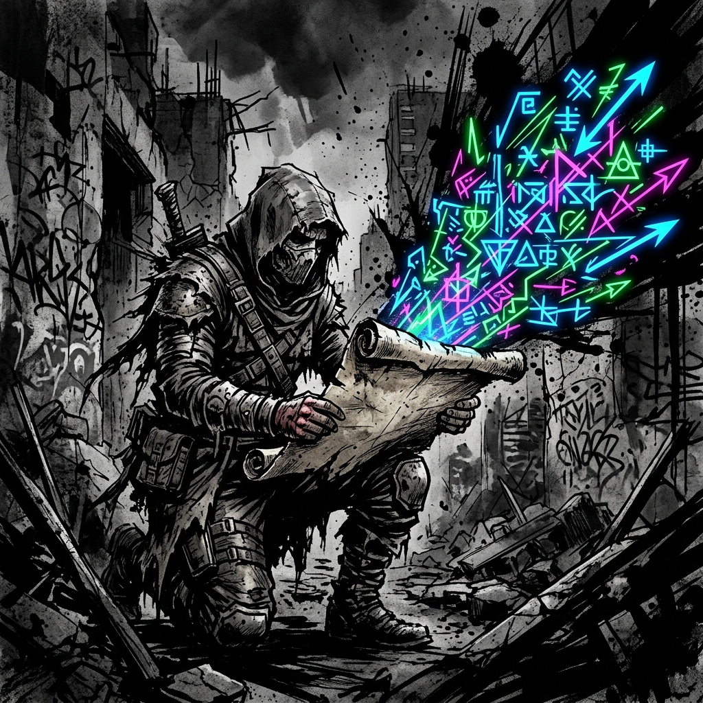

# Quick Reference

## The Clash

**Roll d100 + Force + Tactics. High wins.**

- **vs. Active opponent:** Both roll d100 + Force + Tactics. Higher total wins. Margin = Winner − Loser.
- **vs. Passive obstacle:** Beat the Resistance (from the Grade Reference Card).
- **Auto-success:** If Force ≥ Resistance, no roll needed.
- **Volatility:** In combat, if the **natural d100** (before any modifiers) meets the Grade threshold, roll again and add. Each cascade die also checks its own natural result. Applies to combat Clash rolls and Will Saves (either side), plus the Breakthrough Check; skill checks never explode. A cascade of 2+ extra dice on a PC's roll grants a Battle Memory Card.
- **Advantaged:** +10 to your rolls (fiction-derived positional edge). **Exposed:** −10 to your rolls. States are not reciprocal and are not free: changing your own or stripping an enemy's costs 1 Beat.
- **Flanking:** +10 for every hostile engaging a target that two or more hostiles are engaging at once.
- **Reach:** you can attack anyone in your Zone; ranged and most spells also reach adjacent Zones.
- **Environment:** −10 hindering / −20 crippling.
- **Turned Aside:** defender wins by Margin 40+ → attacker Exposed until end of their next turn. Defensive win with an explosion → Momentum shifts next round.
- **Driven Back:** attacker wins by Margin 40+ → defender takes the damage and is Exposed until end of their next turn; the attacker may drive them one Zone (no free strike).
- **Skill check failure:** fail by 1–39 soft (success at a cost), 40+ hard (failure plus consequence), natural 01–05 catastrophic. Margin 40+ on any success is dominant.
- **Exceptional Success:** natural roll at or above your Volatility Threshold on a skill check. Success: narrate a step beyond what was asked. Failure: Soft regardless of margin. No extra dice.
- **Cross-Grade Auto-Success:** vs. passive obstacles, Force + Cross-Grade Adjustment ≥ Resistance = no roll (2+ Grades up never rolls).
- **Momentum:** Opposed Momentum Roll: d100 + DEX or PER Force (whichever is higher). Winning side acts first each round.
- **Free Step:** DEX Force 50+ grants one free Zone move per turn.
- **Cross-Grade movement:** the higher Grade auto-wins movement contests. A combatant a full Grade above every hostile present moves between Zones without spending Beats at all.

**The Clash Formula:**

- **Attacker:** d100 + Offensive Force (STR/DEX/POW based on weapon) + Tactics
- **Defender:** d100 + Defensive Force (DEX to dodge, FOR to tank, HRT vs. mental, PER vs. illusion) + Tactics
- **Damage:** Margin × Grade Multiplier (append zeroes)

**Offensive Force by Weapon Type:**

- Heavy melee (axe, greatsword): STR Force
- Finesse melee (rapier, daggers): DEX Force
- Ranged (bows, thrown): DEX Force
- Spells and abilities: POW Force

**Defensive Force by Attack Type:**

- Physical (dodged): DEX Force
- Physical (absorbed): FOR Force
- Mental / spiritual / coercive: HRT Force
- Illusion / sensory deception: PER Force

**Grade Multipliers:** F-Grade: ×1 | E-Grade: ×10 | D-Grade: ×100 | C-Grade: ×1,000

**Volatility Thresholds (natural die):** F: 96+ | E: 95+ | D: 94+ | C: 93+ | B: 92+ | S: 91+ (starts at 96, falls 1 per Grade).

One number at the top of the die. On a Clash it explodes (combat Clashes, Will Saves, and the Breakthrough Check; skill checks never explode). On a skill check it is an Exceptional Success. On either it earns a **Mark** in the Proficiency you were using. A cascade of 2+ extra dice on a PC's roll also grants a Battle Memory Card.

**Cross-Grade Adjustment:** The higher-Grade side gains +100 per Grade of difference. In Opposed Rolls, the higher-Grade combatant adds +100 to their total per Grade above the opponent. In Resistance Rolls, add +100 per Grade of difference to whichever side is higher (the challenger's roll if challenging a lower-Grade obstacle, the obstacle's Resistance if challenging a higher-Grade obstacle). Same Grade, no adjustment.

**Lagging stats:** every stat reads at its owner's Grade. Pad below-band stats with leading zeros (E-Grade STR 65 → 065 → Force 06). Cross-Grade Adjustment and damage multiplier always follow the character's Grade.

**HP** = Raw FOR × 2. **Aether** = Raw POW. Aether refills only on Consolidation, after the first full hour (no in-combat or passive regen).

**VE Tolerance:** (Raw FOR + Raw HRT) / 2 × 10, re-derived at the first full hour of each Consolidation. **Saturation:** past one Tolerance −10, past twice −25, past three times the collapse clock.

**Consolidation:** every hour clears one fifth of VE Tolerance and restores one fifth of Max HP (full tank ≈ 5 hours); Aether refills at the first full hour. Interruption keeps completed hours.

**Breakthrough Check:** d100 + HRT Force + preparation vs. **DC 140** (Severe, flat, no Cross-Grade Adjustment). Overcharge ×1/×2/×3/×4 raises it to 140/150/160/180 and buys +0/+1/+2/+3 Quality Tiers.

**Surge:** spend half your Maximum Aether (round up) for +5 on one Clash roll you make. Declare before rolling. No Beat. Stacks with everything; available to everyone.

**Yield:** once the Margin is known and before damage lands, give up Beats from your **next** turn. Each Beat cuts the incoming Margin by 20. Your next turn has two Beats, so two is the most you can give. One Beat: you give ground where you stand. Two Beats: your turn is gone and the attacker may drive you one Zone of their choosing, or leave you where you are; no free strike either way. Against an AoE, each target Yields on their own Margin and two Beats throws them clear. **Cornered** (nowhere to be driven): one Beat only. Creatures Yield only if their stat block says so.

**Proficiencies:** three at creation, all **Trained**.

| Tier | Effect |
|---|---|
| Trained | +5 to Clashes and skill checks in the domain. Routine Mastery (auto-succeed Trivial and Easy). Specialist Gating access. |
| Seasoned | +10 in place of the +5. **3 Marks.** |
| Master | +10, and once on your turn your first action using it costs no Beat. **10 Marks**, and an E-Grade body. |

Weapons carry no bonus of their own; the bonus is the wielder's tier. Untrained is +0. **3 Marks in a domain you have no Proficiency in:** the System grants it at Trained, spending those Marks.

**Downed:** at 0 HP: no Beats, no defense; dies at the end of their third round unless stabilized (any healing, or 1 Beat + Moderate 90 check, field-medicine Proficiencies apply). One hit ≥ 10× Max HP kills outright. Attacking a Downed character: 1 Beat, no roll, kills. Surviving being Downed grants a Battle Memory Card.

**Principle Application Costs (by tier, never by Grade):** Seed 10 | Early Fragment 15 | Infusion free | Domain 3,000 + 500/round. A cost is fixed by the tier that granted it and never changes. Scale grows with the character's current Grade. Domains require a D-Grade body. Spells and class skills are fixed by the Grade they were acquired at, ×10 per Grade.

**Aura Pressure Save:** d100 + HRT Force + (FOR Force / 2) vs. Aura Resistance. Aura Resistance is the flat card value, no Cross-Grade Adjustment: calm presence Hard (115), flaring Severe (140). At 3+ Grades of difference the GM may skip the save.

---

## Grade Reference Card

| **Difficulty** | **Resistance** |
|---|---|
| Trivial | 40 |
| Easy | 65 |
| Moderate | 90 |
| Hard | 115 |
| Severe | 140 |
| Peak | 165 |

Resistance is read straight off the card for same-Grade encounters. For Cross-Grade, apply the +100/Grade adjustment to whichever side is higher (see above).

| **Grade** | **Raw Stat Range** | **Force Range** | **Damage Multiplier** |
|---|---|---|---|
| F-Grade | 1–99 | 1–99 | ×1 |
| E-Grade | 100–999 | 10–99 | ×10 |
| D-Grade | 1,000–9,999 | 10–99 | ×100 |
| C-Grade | 10,000–99,999 | 10–99 | ×1,000 |

---

## Examples

**1. F-Grade Peer Clash:**

Attacker: STR 55 (Force 55). Defender: FOR 40 (Force 40), HP 80.

- Attacker rolls 60 + 55 = 115. Defender rolls 50 + 40 = 90.
- Margin = 25. F-Grade adds 0 zeroes. **Damage = 25.**
- Defender drops from 80 HP to 55.

**2. D-Grade Peer Clash (Volatility Cascade):**

Attacker: STR 8,500 (D-Grade, Force 85). Defender: FOR 7,000 (D-Grade, Force 70), HP 14,000.

- Attacker rolls a natural 97. D-Grade explodes on natural 94+. Rolls again: natural 40 (below 94, no further cascade). Total die = 137. Clash = 137 + 85 = 222.
- Defender rolls a natural 75 (no explosion). Clash = 75 + 70 = 145.
- Margin = 77. D-Grade adds 2 zeroes. **Damage = 7,700.**
- Defender drops from 14,000 to 6,300 HP.

**3. Cross-Grade: F-Grade Peak vs. E-Grade Initiate:**

F-Peak: STR 99 (Force 99), HP 198. E-Initiate: FOR 120 (Force 12, +100 Grade bonus = 112), HP 240.

F attacks E:

- F-Peak rolls brilliantly: 85 + 99 = 184. E-Initiate rolls poorly: 20 + 112 = 132.
- Margin = 52. F-Grade multiplier: ×1. **Damage = 52.** The E-Grade drops from 240 HP to 188.

E attacks F:

- E-Initiate rolls average: 50 + 112 = 162. F-Peak rolls average: 50 + 99 = 149.
- Margin = 13. E-Grade multiplier: ×10. **Damage = 130.** F-Peak drops from 198 HP to 68.
