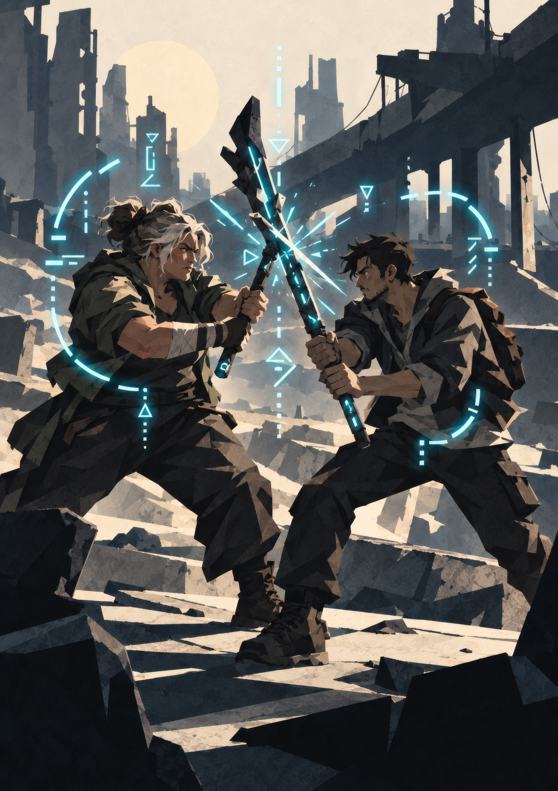
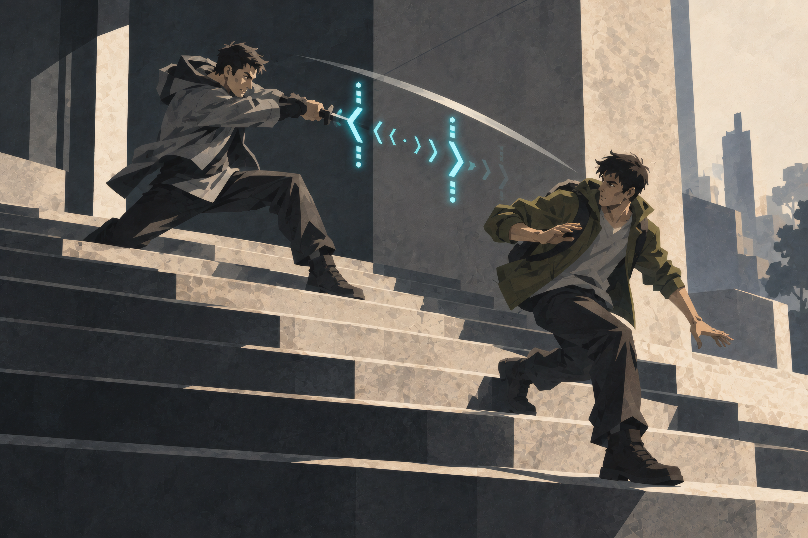
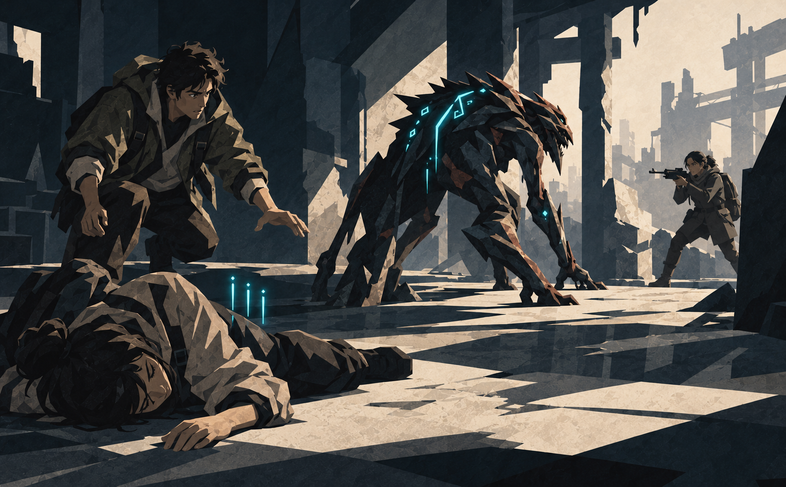
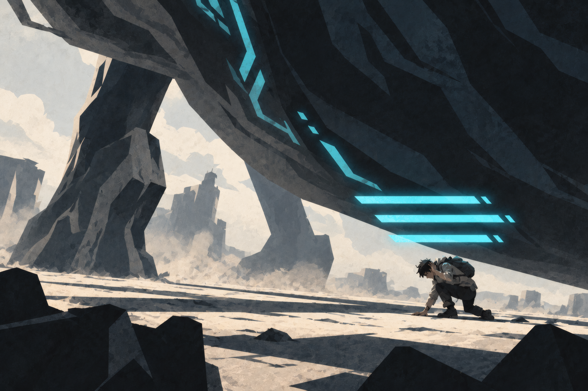

{.opener}

# Core Mechanics

::: epigraph
"Learned this with my face: when the big one swings, you can give ground and it hurts less."

the survivors' forum
:::

::: epigraph
"I hired a swordsman after watching him win a duel without taking a wound. When we were ambushed by Rexian whelps, he disappeared into the trees. His fighting record remains unblemished."

Bel Sar, route account
:::

Every roll in this game resolves the same way: say what your character does, roll d100, add the Force of the Attribute that governs the action, and compare. Force is an Attribute's two-digit table value, whatever the character's Grade. Against a living opponent they roll too, and the gap between the totals is the Margin, which says how well it went. In combat, the Margin is the damage. That loop is the whole engine, and the rest of this chapter is the detail around it.

---

## Two Sizes of Numbers

The game's numbers come in two sizes: the huge ones the story is about, and the small ones the table rolls with. Stats grow into the millions; Force stays at two digits at every Grade, and Grade differences are added separately.

- **Force.** Every stat has a **Raw Power** value, the big number on the character sheet, and a **Force** value, the two digits read at the character's Grade. Players watch Strength climb from 4,200 to 4,500; at the table that same climb is Force 42 becoming Force 45.
- **The Clash.** Every contested action resolves in one opposed roll. There is no separate to-hit step and damage step.
- **Grade-anchored difficulty.** Every obstacle has a Grade and a difficulty, and the number comes off one card, the Difficulty Card. Across a Grade gap, the higher side gains +100 per Grade of difference.

**Rounding:** all fractions round down.

---

## Raw Power, Grade, and Force

Every stat has three readings.

- **Raw Power.** The number on the sheet, such as 4,520: the one a LitRPG reader waits a chapter to see on the status screen, and the one players watch climb at every level.
- **Grade.** The order of magnitude the character's body operates at. Each Grade caps stats ten times higher than the one before: 99 at F, 999 at E, 9,999 at D.
- **Force.** Raw Power read at the character's Grade: the stat itself at F, the stat ÷ 10 at E, and so on down the table below, fractions dropped. Force runs from 0 to 99 at every Grade. **Force is the only number used at the table.**

A character with STR 4,520 is D-Grade, so their STR Force is 4,520 ÷ 100 = 45. An opponent with FOR 3,100 at D-Grade has Force 31.

<!-- rules:table grade-table -->
| **Grade** | **Stat Cap** | **Force** | **Damage** |
|---|---|---|---|
| F-Grade | 99 | the stat | the Margin |
| E-Grade | 999 | stat ÷ 10 | Margin × 10 |
| D-Grade | 9,999 | stat ÷ 100 | Margin × 100 |
| C-Grade | 99,999 | stat ÷ 1,000 | Margin × 1,000 |
| B-Grade | 999,999 | stat ÷ 10,000 | Margin × 10,000 |
| A-Grade | 9,999,999 | stat ÷ 100,000 | Margin × 100,000 |
<!-- /rules:table -->

At F-Grade, Force equals Raw Power. A fresh E-Grade character with STR 120 has Force 12: weak within their Grade, and still carrying the Grade's ×10 damage, which is what makes cross-Grade combat asymmetric. A stat below its Grade's band reads as a low Force; see "Lagging Stats."

### Stat Growth and the Cap

Stats increase through leveling at Consolidation, **Attribute Treasures** absorbed during a rest (Items), class evolution at milestones, and Title rewards.

**Starting stats.** A freshly integrated human distributes **40 points** across seven Attributes, minimum 3 and maximum 10 per stat. In the world, each point is a large step: STR 8 is a competitive collegiate powerlifter, STR 9 a professional strongman, STR 10 among the strongest humans who ever lived. On the dice, a few points is a small edge: STR 10 against STR 5 wins about 55 contests in 100. Aether runs through every Integrated body and every roll can explode, so the underdog always has a chance. The gap opens as stats grow: STR 60 against STR 20 wins about 80 contests in 100. Character Creation has the full procedure.

**Per-level budget (F-Grade).** **5 points per level: 3 assigned by class profile** (or by the GM before a class exists) **plus 2 the player spends freely.** At higher Grades the budget scales with Grade magnitude. Progression covers Levels 1 to 9 in detail.

**Stat cap.** Stats cannot exceed the current Grade's maximum: **99 at F, 999 at E, 9,999 at D.** Excess is lost. Breakthrough lifts the cap; it does not raise the stat.

---

## Attributes and Derived Stats

Seven Attributes, tracked as Raw Power and read as Force.

- **Strength (STR):** Physical power. Governs heavy melee, lifting, breaking, and feats of raw strength.
- **Dexterity (DEX):** Precision, speed, manual agility. Governs evasion, finesse melee, and ranged attacks.
- **Fortitude (FOR):** Endurance and structural integrity. Governs Health and standing your ground.
- **Heart (HRT):** Resolve, mental fortitude, spiritual anchor. Governs Momentum, defense against mental, spiritual, and coercive attacks, the Will Save against Aura Pressure, and the Breakthrough.
- **Power (POW):** Magnitude of energy-based output. Governs spells, Applications that act on their own, and the Aether pool.
- **Perception (PER):** Awareness and sensory sharpness. Governs detection, Principle insight, and defense against illusion.
- **Charisma (CHA):** Force of personality and social leverage. Governs persuading, deceiving, and commanding.

**Derived:**

- **Max HP:** Raw FOR × 2. FOR 75 gives 150 HP.
- **Max Aether:** equal to Raw POW.
- **VE Tolerance:** how much unrefined Volatile Energy a body holds before it starts to burn. 80 at F-Grade, ×10 per Grade, the same for every character of the Grade. See Cultivation.

There is no Damage Reduction stat. Armor, toughness, and defensive training are folded into the defender's Clash total: strong defense makes the attacker's Margin small or negative.

Stats are raw. There is no class-based efficiency layer, so a Mentalist who invests in STR hits as hard as a Warrior with the same STR.

---

## Core Resolution

Every roll is d100, plus the Force that governs it, plus any Tactical Modifiers. Rolls come in two kinds, named by what you roll against.

### Clashes

Against someone who rolls back, in or out of combat: a swing and its parry, a lie and the listener's read of it, two people straining at the same rope.

> **Each side: d100 + relevant Force + Tactical Modifiers**

Higher total wins; a tie goes to whoever started it. The **Margin** is the winner's total minus the loser's. In combat, the Margin is the damage. Outside combat the GM reads it narratively, and **a Margin of 40 or higher is a decisive result**, described below.

### Checks

Against a number: a lock, a cliff face, a fever. The GM sets the **Resistance** from the Difficulty Card, and the character rolls against it:

> **d100 + relevant Force + Tactical Modifiers vs. Resistance**

Meet or exceed it to succeed.

Three rolls in this book carry their own names. The **Momentum Roll** is a Clash between sides at the start of a fight. The **Will Save** is a Heart check against Aura Pressure. The **Breakthrough Check** is a check against Resistance 140.

### The Difficulty Card

<!-- rules:table resistance-card -->
| **Difficulty** | **Resistance** |
|---|---|
| Trivial | 40 |
| Easy | 65 |
| Moderate | 90 |
| Hard | 115 |
| Severe | 140 |
| Peak | 165 |
<!-- /rules:table -->

**Cross-Grade Adjustment.** When the obstacle's Grade differs from the challenger's, the higher-Grade side gains **+100 per Grade of difference**, applied to the challenger's roll or to the obstacle's Resistance, whichever is higher. Same Grade, no adjustment.

A door built by an E-Grade formation master is Moderate, Resistance 90. An F-Grade challenger faces it at 190 and needs a natural 91 or better at Force 99. An E-Grade peer with Force 50 opens it on a 40.

### When to Roll

The GM decides whether a check is rolled. A player may not know about a clock, a watcher, or a hidden cost of failure, so the call is always the GM's. In order:

1. **Force meets the Resistance.** If the character's Force alone meets the Resistance, they succeed without rolling. A Moderate F-Grade lock is Resistance 90: DEX Force 92 opens it.
2. **Take 100.** If nothing presses (no clock, no danger, nobody opposing) and a natural 100 would succeed, the character succeeds without rolling. It takes as long as the GM says it takes. DEX Force 30 against the same lock, with an afternoon and nobody watching, opens it by evening.
3. **Otherwise, roll once.** A failed check stands. The character can try again when something changes: a new tool, a new approach, help, a level.

**Across Grades,** the Adjustment counts toward the first two. A challenger two Grades above a passive obstacle never rolls. A Clash is always rolled, whatever the gap.

### Backgrounds

Every character has a **Background**: one or two plain-language lines naming what they did before Integration, such as "ER nurse, twelve years" or "land surveyor, and a deer hunter every fall." A Background does three things in its field:

- **Trained work.** The character can attempt work that needs training, whatever their Force: surgery, reading an old script, rewiring a live panel. A character without the Background cannot attempt it.
- **Routine work.** Trivial and Easy checks of the character's own Grade succeed without a roll. A nurse does not roll to dress a wound; a hunter does not roll to follow a day-old trail in soft earth. The roll comes when risk, time pressure, or opposition pushes the task to Moderate or above.
- **Advantage.** A check in the field, or a Clash in it outside combat, rolls with Advantage: two d100, keep the higher (see "Advantage and Exposed," below).

A Background never applies to an attack or a defense. Fighting skill is a Proficiency.

::: worked
Joe's Background is "volunteer firefighter and EMT." His friend is Downed, and stabilizing her is a Moderate (90) check; the GM calls for PER. Joe rolls two d100, keeps the higher, and adds his PER Force of 6, so he needs 84 on the kept die.
:::

### Proficiencies

A **Proficiency** is weapon training, and the System tracks it. Each character begins with one, at Trained. Proficiencies are drawn by weapon shape: blades, axes and hammers, spears and staves, hand to hand, archery and throwing, firearms. A Proficiency covers its whole shape: "axes and hammers" governs the hatchet, the maul, and a length of pipe. A character trained with an axe who picks up a sword adds nothing to the Clash until they have earned the Marks for blades.

#### The Three Tiers

<!-- rules:table proficiency-tiers -->
| **Tier** | **Effect** |
|---|---|
| **Trained** | +5 to attacks and defenses with the Proficiency's weapons. |
| **Seasoned** | +10 (in place of the +5). 3 Marks. |
| **Master** | +10, and once on your turn your first action with the Proficiency's weapon costs no Beat. 10 Marks in all, and an E-Grade body. |
<!-- /rules:table -->

**The Master's free action.** Once on your turn, the first action with a Mastered Proficiency's weapon costs no Beat. The axe Master's first swing is free.

The free action is separate from Beats. A Master cannot give it up to Yield, save it for later in the round, or use it for anything outside the Proficiency. A Master who gave up both Beats to Yield still gets the free action on their turn. Aura Pressure takes away Beats and leaves the free action alone. During surprise, a Master has only the Surprise Beat; the free action waits for the Master's own turn.

#### Marks

When the die explodes (see "System Volatility," below) on an attack or a defense with a weapon, the player adds a **Mark** beside that weapon's Proficiency on the sheet. One Mark per roll, however many dice the explosion adds. In the fiction, the System notes the technique:

::: systemvoice
*Technique noted: Axes and Hammers. 2/3.*
:::

- **3 Marks:** Trained becomes Seasoned.
- **10 Marks in all:** Seasoned becomes Master. Mastery requires an E-Grade body; an F-Grade character banks Marks past 10 and advances at the Breakthrough.
- **3 Marks with a weapon shape the character has no Proficiency in:** the System grants that Proficiency at Trained, and the three Marks are spent.

Where the weapon shape is unclear, the GM names it, or rules that no Proficiency applies. A fighter who never puts down the axe reaches Master with the axe and nothing else. A weapon the character has no Proficiency in adds nothing to the Clash, and each explosion with it still earns a Mark toward that Proficiency.

### Failure and Exceptional Success

These tiers apply to **checks**. Combat Clashes carry their own outcomes.

- **Soft Failure (fail by 1–39):** the attempt does not achieve what was asked. Usually that means visible partial progress and a new problem: the lock resists and the pick is bent, the climb stalls at the overhang, you learn half of what you came for. Give the character something to work with rather than a closed door.
- **Hard Failure (fail by 40 or more):** failure plus consequence. The negotiation collapses and the NPC's attitude hardens. The stealth attempt fails and you are detected.
- **Catastrophic Failure (natural 01–05):** failure plus escalation, whatever the margin. The rope parts at the worst height. Misreading the warning sets off the ward it describes.

**On Soft Failure.** The GM may offer success at a cost in place of a Soft Failure. Offer it when the cost makes a better scene than the setback would. Offered every time, it removes failure from the game and the dice stop mattering; the default is a real setback the character can push against.

The GM may shift any tier one step when the fictional stakes demand it.

**Exceptional Success.** A check whose die explodes and still succeeds is an Exceptional Success: the GM narrates one step beyond what was asked. The merchant agrees, then offers more than anyone put on the table. At the top of the die the result can be absurd. A field medic's check to close a wound explodes, the bleeding stops, and the GM rules that the patient will live ten years longer than they would have.

### System Volatility

Every d100 roll explodes. When the natural die meets or exceeds the Volatility Threshold for the roller's Grade, roll another d100 and add it. Each new die can explode on the same threshold. In the world, this is the System's energy running through the act; at the table, the word is **exploding**.

**The trigger** is the **natural d100 before any modifiers**. Force, Tactical Modifiers, Cross-Grade Adjustments, item and ability bonuses are all ignored for triggering.

<!-- rules:table volatility -->
| **Grade** | **Explodes On (natural)** | **Probability** |
|---|---|---|
| F-Grade | 96–100 | 5% |
| E-Grade | 95–100 | 6% |
| D-Grade | 94–100 | 7% |
| C-Grade | 93–100 | 8% |
| B-Grade | 92–100 | 9% |
| A-Grade | 91–100 | 10% |
<!-- /rules:table -->

**One number at the top of the die.** The Volatility Threshold is the only high-die number in the game, and it changes only with the character's Grade. When the die reaches it, the extra dice add to the total. On a check that succeeds, the success is Exceptional. On an attack or a defense with a weapon, the player adds a Mark.

**Both sides explode.** An offensive explosion spikes the Margin; a defensive explosion drives it sharply negative and the attack lands harmlessly. There is no separate critical-hit rule.

**Cascades and Battle Memories.** A cascade of two or more extra dice on a player character's roll grants that character a **Battle Memory Card** (see The Principle System).

---

## Combat

### Initiative: The Momentum System

Combat does not use a fixed turn order. Each round the side with **Momentum** takes a complete turn first; the others follow. Momentum can shift between rounds.

**Initial Momentum.** Each side sends one roller:

1. For each combatant on the side, take the higher of their HRT Force and PER Force.
2. The side's roller is whoever has the highest such value.
3. The roller makes the side's **Momentum Roll**: d100 plus that value.

The two sides may be rolling different Attributes. Highest total holds Momentum for the first round. **On a tie, both sides roll again.**

Momentum measures nerve and awareness: the combatant who keeps their head at first contact sets the tempo, and the one who reads the field can take it back.

**Surprise.** A side that achieves true surprise acts before combat properly begins: each surprising character immediately takes one free Beat, the **Surprise Beat**. Then Initial Momentum is rolled normally. A sharp defender can absorb an ambush and still take the first full round.

**Round structure.** When a side takes its turn:

- Characters act **one at a time**, in any order the side chooses.
- A character uses **all** of their Beats before the next teammate acts.
- Once every character on the side has acted, the next side begins.
- A round ends when every side has acted.

**Multi-faction combat.** With three or more sides, the initial Momentum Roll sets a turn order for the whole round, highest to lowest, until a Shift fires.

**Momentum Shifts.** Between rounds, Momentum can shift on two triggers:

- **Decisive Tactical Reversal.** A character reshapes the fight: springing a trap, weaponizing terrain, completing a multi-round setup, exposing a hidden combatant, winning a defensive Clash with a Volatility explosion, bringing a new combatant into the fight, or any other move the GM judges to qualify. Momentum shifts to that character's side at the start of the next round. The threshold is GM judgment, and it is the GM's flexible reward for clever play.
- **Seize Momentum.** A character spends 1 Beat and rolls a Momentum Roll against the side currently holding Momentum, using **their own** HRT or PER Force, whichever is higher. The side holding Momentum answers with its highest such value. On a win, Momentum shifts at the start of the next round. The Beat is spent either way.

When no Shift fires, Momentum stays where it is. If two Shifts fire in the same round, the later one wins. With three or more sides, the new holder acts first and the other sides keep their order.

### Action Economy: Beats

Every character has **two Beats** per turn by default; creature stat blocks may set a different count. A Beat is one meaningful action:

- Attack, melee or ranged
- Cast a spell
- Move to an adjacent Zone
- Use an item
- Activate a Principle Application
- Attempt a check
- Disengage from a hostile
- Attempt to seize Momentum

**Free actions,** costing no Beat: speaking, drawing a weapon, dropping an object, and moving around inside your current Zone.

**A third Beat is the rarest form of power.** Certain titles, class evolutions, and Grade milestones grant one, and anything that does says so explicitly. A Mastered Proficiency's free action is one specific action that costs nothing, and it is not a Beat.

**Aura Pressure** reduces a character to one Beat; a combatant that had only one is reduced to none. See "Aura Pressure" below.

**Beats given up to Yield** come from the character's next turn. A character who yielded twice since their last turn has no Beats when their turn arrives.

### Movement: Zones

Combat has no grid and no measured distance. When a fight starts, the GM divides the scene into **Zones**: loose areas such as these.

- A tavern brawl might have three Zones: the bar, the floor, the doorway.
- A forest ambush might have the trail, the tree line, the ridge.

**Movement:**

- Moving around inside your Zone is free.
- Moving to an adjacent Zone costs one Beat.
- Moving two Zones costs both Beats.

**The Free Step (DEX Force 50+).** A character with DEX Force 50 or higher takes one additional Zone move each turn without spending a Beat. It does not bypass Engagement: leaving a hostile's Zone without Disengaging still provokes a free strike.

### Advantage and Exposed

**Advantage.** Roll two d100 and keep the higher. The GM grants Advantage from the fiction: the high ground for an archer, bare stone underfoot for an Earth cultivator, cramped quarters for a knife-fighter facing a greatsword, the sun behind you. The same terrain can give one combatant Advantage and mean nothing to another.

- **Positioning is part of the action that uses it.** "I take the stairs two at a time and swing down at him" is one attack, and the GM decides whether the stairs earn Advantage. Taking an edge away from an enemy is an action like any other: knocking them off the stairs or kicking over their lamp costs a Beat.
- **Advantage does not stack with itself.** Two edges on one roll are one Advantage. It does stack with flat bonuses, Flanking included.
- **Only the kept die can explode.**

Advantage is worth about +20 between equals, twice a Standard bonus. Grant it a little less often than instinct suggests; the usual bar is an edge a player could point to in the scene.

**Exposed.** A combatant caught in the open, off balance, or pinned is **Exposed**: −10 to their Clash rolls. Turned Aside and Driven Back (below) leave a combatant Exposed until the end of their next turn, and the GM may rule it from the fiction: a floor giving way, a failed climb, a flare in the eyes.

### Reach, Engagement, and Flanking

**You can attack anyone in your own Zone.** Melee reaches no further. Ranged weapons, thrown weapons, and most spells reach targets in **adjacent** Zones as well; individual weapons and Applications may say otherwise.

**Engagement and free strikes.** A hostile in your Zone that is fighting you **engages** you; one busy elsewhere (working a door, locked with someone else) does not. If you leave a Zone without spending a Beat to Disengage, each hostile engaging you gets a **free strike**: one Clash roll at no Beat cost. To leave clean, spend a Beat to Disengage and a Beat to move. That is your whole turn, and you escape.

**Flanking.** When **two or more hostiles engage** a combatant at once, every one of those hostiles gains **+10** against them. Two hostiles fighting the target from its Zone qualify; so does one in the Zone and one shooting into it from next door. Being outnumbered is the most reliable way to raise a Clash total in this game, and it is why isolating one enemy is worth a turn of maneuvering.

### The Clash

Combat is a series of Clashes. Each one determines whether you hit, how hard, and how much damage in a single exchange.

**Step 1. Both sides roll.**

> **Attacker: d100 + Offensive Force + Tactical Modifiers**
>
> **Defender: d100 + Defensive Force + Tactical Modifiers**

**Offensive Force** comes from the governing stat:

- Heavy melee (axe, warhammer, greatsword): STR Force
- Finesse melee (rapier, daggers, spear): DEX Force
- Ranged (bows, thrown, crossbow): DEX Force
- Spells, and Applications that act on their own (a bolt, a blast, a field): POW Force

An Application that shapes a weapon attack is part of that attack and uses the attack's Force: Kara's Sudden Weight rides her swing and rolls STR (The Principle System, "Kara's Story").

**Defensive Force** depends on how the defender answers:

- Dodging or evading: DEX Force
- Standing ground and absorbing: FOR Force
- Resisting a mental, spiritual, or coercive attack: HRT Force
- Resisting an illusion or sensory deception: PER Force

The defender picks their posture when targeted, bounded by what the fiction permits. A heavily armored juggernaut tanks with FOR; a duelist dances away with DEX; a monk holds her mind against a mentalist with HRT. STR never defends: a parry that turns a blade by main strength is FOR.

**Player versus player.** A skill, spell, or Principle effect aimed at another player character resolves as a standard Clash. PvP coercion is logged as a high-intensity Will event in the Hidden Vector Engine.

**Tactical Modifiers.** On a d100, a bonus has to be large to matter, and it cannot get much larger before the roll stops mattering. Between equals, +10 wins six Clashes in ten and +20 wins two in three. Every bonus in the game comes in one of the sizes below, and a bonus the GM invents (a blessing, a found relic, a clever setup) takes its size from this table, the **Modifier Budget**:

<!-- rules:table modifier-budget -->
| **Modifier** | **Size** | **Examples** |
|---|---|---|
| Minor bonus | +5 | Trained Proficiency, Surge, minor blessings |
| Standard bonus | +10 | Flanking, Seasoned and Master Proficiency, most System-granted skills |
| Peak bonus (rare) | +15 to +20 | Peak abilities, one-shot relics, Hidden Achievement rewards |
| Advantage | roll two d100, keep the higher (about +20) | A real edge from the fiction, a Background's field on a check |
| Exposed | −10 | Turned Aside, Driven Back, caught in the open or off balance |
| Hindering environment | −10 | Darkness, difficult footing, driving rain |
| Crippling environment | −20 | Blindness, restrained, fighting submerged |
<!-- /rules:table -->

**Step 2. Determine the winner.** Highest total wins; a tie goes to the attacker.

If the **defender wins**, the attack is deflected, dodged, or absorbed. The defender deals no damage unless they used a specific Counter ability.

**Turned Aside:** if the defender wins by **40 or more**, the attacker is **Exposed** until the end of their next turn.

**Driven Back:** if the attacker wins by **40 or more**, the defender takes the damage and is **Exposed** until the end of their next turn. The attacker may also drive the defender into an adjacent Zone; being driven out of a Zone provokes no free strikes. A driven defender is out of the attacker's melee reach until someone moves. Use it to push an enemy away from a wounded ally, out of a doorway, or off the thing they were reaching for.

**Step 3. Apply damage.** If the attacker won:

> **Margin = Attacker's total − Defender's total**
>
> **Damage = Margin × the attacker's Grade multiplier**

The multiplier is the last column of the Grade table ("Raw Power, Grade, and Force"): ×1 at F, ×10 at E, ×100 at D. Apply the damage straight to HP. There is no reduction step; the defender's toughness was already in their roll.

### Yield

{.scene}

Losing a Clash does not have to mean taking the whole blow. You can give way.

> **Yield: once the Margin is known and before damage is applied, give up Beats from your next turn. Each Beat reduces the incoming Margin by 20.**

You can give every Beat your next turn will have, and no more: two as a rule, one while Suppressed, three if something has granted a third. Beats already given this round are gone.

- **One Beat:** you give ground where you stand, and half of your next turn is gone.
- **Two Beats:** you break contact entirely and your next turn is gone. The attacker **may** drive you into an adjacent Zone of their choosing, and may decline to. Forced movement provokes no free strike.

Damage is the remaining Margin times the attacker's Grade multiplier, and the remaining Margin is the Margin for everything else the hit does, Driven Back included. A Margin reduced to zero or below deals nothing.

::: worked
A Snarljaw beats Marta by 37. She is at 30 HP, so the bite would put her on the floor.

- She gives up one Beat. Margin 37 − 20 = 17. She takes 17, stands at 13 HP, and has one Beat on her turn.
- She gives up both. Margin 37 − 40 is below zero, so the jaws close on nothing. She loses her whole next turn, and the Snarljaw decides whether she is thrown clear or stays where she is.
:::

**Cornered.** If there is nowhere to be driven, you can give up only one Beat. A corridor, a sealed chamber, a ledge, or a closed ring of enemies makes a fight far more dangerous without changing a number on any stat block.

**Yield across Grades.** Yield subtracts from the Margin before the Grade multiplier, so one Beat is worth 20 Margin at every Grade. Against a higher-Grade attacker the Cross-Grade Adjustment is already inside the Margin, and giving ground rarely saves anyone.

::: worked
An E-Grade Initiate with STR Force 12 attacks at an effective 112. Against an F-Grade scout (DEX 40, FOR 40, 80 HP) dodging at Force 40, an average exchange wins by 72: 720 damage. Yielding both Beats leaves a Margin of 32, still 320 damage. Against an F-Peak defending at Force 99, the same Initiate's average exchange wins by 13 (see "Fighting Across a Grade"), and one Beat of Yield turns it to nothing.
:::

**Creatures.** A creature yields only if its stat block says it can. See the Bestiary.

### Surge

Every Integrated being can shove raw Aether into their own body: unshaped energy forced into an arm mid-swing or into the legs mid-dodge.

> **Surge: spend half your Maximum Aether, rounded down and at least 1, to add +5 to one Clash roll you are making. Declare it before you roll. No Beat.**

- It works on any Clash you make, attacking or defending.
- It stacks with everything else on the roll.
- The cost is always half your **Maximum** Aether, whatever you have left. A full pool holds at least two Surges, and nothing refills the pool until Consolidation or a pill.

::: worked
Kara has POW 6, so Maximum Aether 6 and a Surge costs 3. Cornered by a Snarljaw, she declares a Surge on her defensive roll, pays 3, and rolls at +5. She has 3 Aether left, enough for one more Surge before she rests.
:::

::: {.lore .quoted}
"PSA for the new ones. That warm thing under your breastbone: you can shove it into your arms or your legs right when you need it. It worked twice for me, and then there was nothing there until I'd slept. Spend it when it counts."

the survivors' forum
:::

A Seed Application (the first technique a Principle grants; The Principle System) buys +10 for a fixed 10 Aether, and its price stays put while the pool grows; Surge always costs half the pool for +5. What Surge offers is availability: it is there from the first minute of Integration to the last Grade, and it asks the same question every time: is this roll worth half your pool?

### Multi-Target and AoE

When one attack or effect targets several creatures at once (an AoE spell, an Application that hits a Zone, a thrown explosive, a falling boulder):

- The source makes one attack roll.
- Each target rolls their own defensive Clash.
- Damage is calculated per target from their individual Margin.
- **Each target may Yield on their own Margin.** Giving up both Beats throws that character clear of the blast, into an adjacent Zone of their choice.
- Allies in the affected Zone are valid targets unless the ability excludes them.

Multi-target capability is a property of specific abilities, spells, and effects rather than a baseline action.

### Downed and Death

{.scene}

**Downed at zero.** A player character reduced to 0 HP is **Downed**: unconscious or barely conscious, prone, out of the fight, with no Beats and no defense. HP does not go below 0. An NPC at 0 HP is Downed and a creature dies, by default; the GM may rule either way for any of them, such as a creature left alive to be questioned.

::: systemvoice
*Vital coherence: 3. Falling. Stabilization: required.*
:::

**The countdown.** A Downed character dies at the end of their third round Downed unless stabilized. The System reads out vital coherence as a number that falls by one each round, 3 at the moment of Downing.

**Stabilizing.** Two paths:

- **Any HP restoration.** A pill, medkit, or healing skill from an ally in the same Zone (1 Beat) returns them to consciousness at the restored HP.
- **Bare hands.** 1 Beat and a Moderate (90) check; a medical Background rolls it with Advantage. Success stops the countdown; the character stays Downed at 0 HP and wakes at 1 HP when the scene ends.

**Annihilation.** A single hit dealing **10 × the target's Max HP** or more destroys them outright, with no Downed state and no countdown. A fresh initiate with 12 Max HP takes an E-Grade glancing blow for 130 and is gone; a FOR 40 scout with 80 Max HP takes the same blow and drops, Downed and counting.

**Executions.** A deliberate attack on a Downed character kills them: 1 Beat, no roll. Mindless creatures rarely bother; they turn to the nearest live threat or drag prey away. Intelligent enemies may. A player character executing a Downed enemy weighs heavily in the Hidden Vector Engine, on the Will or Hunger side.

**Death is permanent.** At F-Grade, nothing returns the dead.

**Surviving the Downed state.** A character who is Downed in a fight and survives gains a Battle Memory Card. The GM may withhold it when the Downing taught the character nothing: a rockslide, then an ally's pill.

---

## The Grade Gap

### Fighting Across a Grade

**In every Clash, the higher-Grade side adds the Cross-Grade Adjustment: +100 per Grade of difference.** One Grade apart is +100; two Grades apart is +200.

::: worked
**F-Peak against E-Initiate.** The F-Grade Peak has STR 99. The E-Grade Initiate has STR and FOR 120: Force 12, plus 100 for the gap, effective 112.

If the F-Grade attacks, d100 + 99 against d100 + 112. Their peak Force nearly matches, and they can win on the dice. But F-Grade damage is Margin × 1: a Margin of 20 is 20 damage against 240 HP. A dent.

If the E-Grade attacks, d100 + 112 against d100 + 99. Rolls of 50 on both sides give 162 against 149, Margin 13, and E-Grade damage is Margin × 10: **130 damage.** An F-Peak who matched their STR with FOR (99, so 198 HP) survives at 68 and is Downed by the next one. An F-Grade with FOR 40 and 80 HP is Downed by the first.
:::

**Fortitude is the survive-the-gap stat.** Across a Grade gap, HP decides whether you get a second turn at all.

### Lagging Stats

Breakthrough lifts the stat caps and adds 10 to every Attribute, so a neglected Attribute can still sit below the new Grade's band: an E-Grade scholar might carry STR 65 into a world of three-digit bodies. The lagging stat reads like every other stat its owner has, at the character's Grade: pad with leading zeros to the band's width and take the first two digits. STR 65 at E-Grade is 065, Force 06. The same stat at D-Grade reads 0065, Force 0.

Nothing else changes. The character's Grade governs the Cross-Grade Adjustment, the damage multiplier, and every Grade-keyed rule, for all of their stats.

::: worked
An E-Grade scholar (STR 65, Force 06) grapples an E-Grade soldier (STR 300, Force 30): d100 + 6 against d100 + 30, a mismatch the scholar occasionally wins on the dice. Against an F-Grade dockworker (STR 80, Force 80) the scholar adds the +100 Adjustment: d100 + 106 against d100 + 80, because even the neglected arm of an ascended body is beyond a mortal's. And on the rounds the scholar's grip closes, the damage is E-Grade. What lags is how the stat measures against peers.
:::

### Cross-Grade Movement

**Speed across a Grade gap is absolute.** Against lower-Grade opposition, movement contests are not rolled: chases, escapes, and closing distance simply go to the higher-Grade side unless the fiction intervenes through terrain, Principle effects, or a prepared trap.

**In combat, a combatant who is one or more Grades above every hostile in the scene moves between Zones without spending Beats at all.** By the time anyone registers the movement, they are somewhere else. This holds however low the higher-Grade character's DEX has fallen.

### Aura Pressure

{.scene}

The weight of a higher-Grade being's accumulated energy presses on weaker entities like gravity.

On first entering the presence of a higher-Grade entity, a character makes one **Will Save**, a Heart check:

> **d100 + HRT Force vs. Aura Resistance**

Aura Resistance comes off the Difficulty Card with no Cross-Grade Adjustment; the gap is already counted in which difficulty applies. An entity carrying its presence calmly is **Moderate (90)**; one flaring its aura in anger or intent is **Hard (115)**. At three or more Grades of difference the GM may impose Suppression without a save: some presences are beyond a mortal's ability to stand in.

- **Success:** the character has steeled themselves, and is resistant for the rest of the encounter.
- **Failure:** the character is **Suppressed**, dropping from 2 Beats to 1.

A character who fails does not retry each round. Suppression breaks only on a meaningful change in the fiction:

- Spending a Beat, if they have one, on a Principle Application that pushes back
- An ally spending a Beat to intervene by shielding, shouting, or physical contact. The intervener must not themselves be Suppressed
- The higher-Grade entity taking significant damage or being distracted

Each of these lets the character roll the Will Save again at once.

A benevolent higher-Grade NPC may suppress their aura entirely, requiring no save. A hostile entity that flares its aura mid-combat, as a Beat on its turn, forces a fresh save from everyone.

::: {.lore .quoted}
"Two days north of Latchwater, a traveler came the other way. I did not see them arrive. I was counting way-stones, and then I was on my knees on the road with my pack still on and no memory of deciding to kneel. It was certainty rather than fear, the way you are certain of the ground: this person could end me, and my body had the knowledge before my thoughts did. They passed at a walk. They did not look at me. When I could stand, the road was the same road and I could not have told you what they wore. The forty-first stone. I set it down so the next traveler knows the stretch."

Bel Sar, route accounts, undated
:::

---

## Aether

**Aether is the lifeblood of the Multiverse**, the ambient energy the System runs on and the medium every Integrated body learns to move. It is in the air, in the ground, in the things that live there, and in you from the moment Integration finishes. Newly integrated humans describe the first weeks as an intoxication: colors sharper, exhaustion further away, a pressure behind the sternum that answers when reached for.

::: {.lore .quoted}
"Day 4. Nobody warned me it would be nice. I came out of the gate and the first thing was the smell, cut grass, like someone had mowed the whole city, and I stood in a car park breathing it while people were screaming two streets over. It's in me too. Something under my breastbone answers when I reach for it, and I keep reaching for it the way you tongue a loose tooth. My hands don't shake anymore. I ran three kilometers to my sister's flat and I wasn't tired. I don't know what I am now. I know I slept nine hours and woke up wanting more of it."

the survivors' forum
:::

**Volatile Energy is the same substance, still wearing someone else's shape.** Everything alive holds its Aether in a pattern, and when the pattern comes apart the energy is released still bent to it: potent, unusable, and corrosive to anything that tries to hold it. That is what comes off a dying creature as pale motes, what a treasure core carries, and what soaks into a body standing too long in a place where the density runs high. It is not yours yet. Consolidation is the work of breaking that borrowed shape down: the structure it becomes is permanent growth, and the loose energy left over is what refills your Aether. This is why Aether returns at the first full hour of rest and a level takes six, why a body can hold only so much raw charge before it starts to burn, and why nothing regenerates by simply waiting.

At the table, **Aether** is the pool a character spends on Surge, spells, Principle Applications, and most class techniques, and it refills at Consolidation. **Volatile Energy (VE)** is what kills and quests pay; it accumulates, and it becomes levels only when refined at Consolidation. The two never mix. Cultivation covers earning, storing, and refining VE.

### The Pool

**Max Aether equals Raw POW.** An F-Grade character with POW 80 has 80 Aether; an E-Grade character with POW 500 has 500.

### Regeneration

**Aether does not regenerate in combat, between combats, or with passive time.** **Consolidation**, the rest in which a character refines VE, refills it in full when the first hour completes, and an Aether Pill or a Pulse Shard restores it (Items). See Cultivation.

### What Things Cost

Every spell, Principle Application, and class technique costs 1 Beat plus an Aether price set when the character gains it.

- **A Principle Application**, a technique a character's Principle grants as their understanding deepens, costs by the tier that granted it: 10 at Seed, 15 at Early Fragment (The Principle System, "Applications: Cost and Scale").
- **A spell or class technique** costs by the Grade at which the character gained it: a spell gained at F-Grade costs 10 to 15, and a class technique 5. A class technique may instead be limited to once per encounter, or cost Health or leave its user Exposed, and then it costs no Aether (Classes, "One technique"). Each Grade higher multiplies the price by 10.

The price never changes after that, and Max Aether grows with POW. A Seed Application costs 10 against an F-Peak pool of 99, nine uses between rests, and 10 against an E-Peak pool of 999. A technique gained at E-Grade costs E-Grade prices: a spell gained there costs 100 to 150 a use. A higher-Grade character can fight a lower-Grade horde on old techniques for a long time, one target per Beat; clearing the field quickly takes area effects bought at the new Grade's prices.
