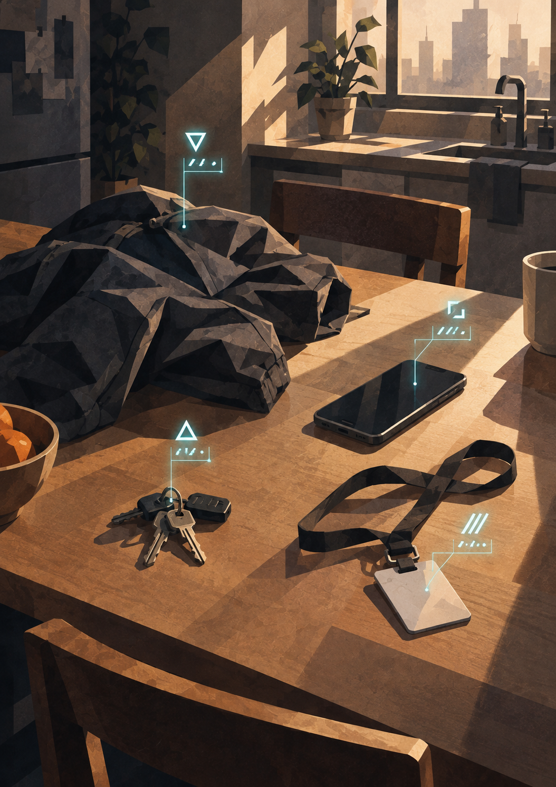
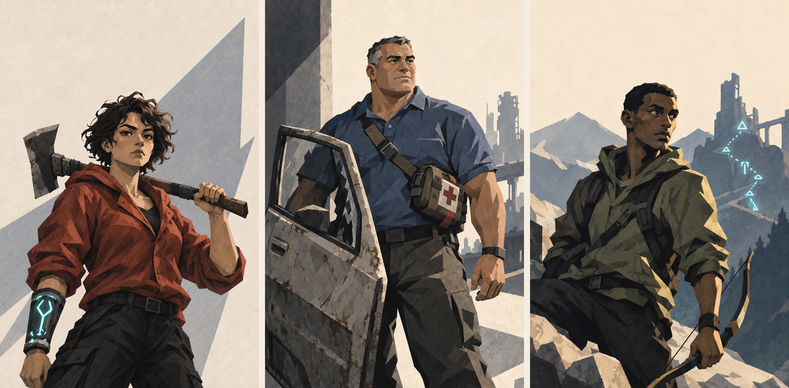

{.opener}

# Character Creation

::: epigraph
"Apparently my Strength stat is average. Tell the System to watch me carry that washing machine up the stairs again."

the survivors' forum
:::

::: epigraph
"My wife won't stop asking what my Charisma stat is."

the survivors' forum
:::

---

## Attributes (Point Buy)

Distribute **40 points** across the seven core Attributes. Each stat has a **minimum of 3** and a **maximum of 10**.

These numbers represent a freshly integrated human: someone pulled into the System's jurisdiction moments ago. A stat of 3 is a genuine deficiency: frail, oblivious, or painfully awkward. A stat of 10 is the peak of pre-System human potential: the strongest athlete, the sharpest mind, the most magnetic personality. Most stats will land in the 4–8 range.

| Attribute | What It Represents |
|---|---|
| Strength (STR) | Physical power. Governs heavy melee attacks. |
| Dexterity (DEX) | Precision and agility. Governs evasion, finesse melee, ranged attacks. |
| Fortitude (FOR) | Endurance and resilience. Determines Max HP. |
| Heart (HRT) | Resolve and spiritual anchor. Governs Momentum; defends against mental and spiritual attacks. |
| Power (POW) | Supernatural output potential. Determines Max Aether. |
| Perception (PER) | Awareness and acuity. Defends against illusions, governs detection. |
| Charisma (CHA) | Force of personality. Governs social pressure and manipulation. |

**Sample Spreads:**

<!-- rules:table sample-spreads -->
| Archetype | STR | DEX | FOR | HRT | POW | PER | CHA | Total |
|---|---|---|---|---|---|---|---|---|
| Brawler | 10 | 6 | 8 | 4 | 3 | 5 | 4 | 40 |
| Scout | 4 | 9 | 5 | 4 | 3 | 10 | 5 | 40 |
| Aspiring Cultivator | 4 | 5 | 5 | 6 | 10 | 7 | 3 | 40 |
| Natural Leader | 5 | 5 | 5 | 7 | 4 | 5 | 9 | 40 |
| Generalist | 6 | 6 | 6 | 6 | 6 | 5 | 5 | 40 |
<!-- /rules:table -->

These are illustrations. Players build what makes sense for the person they are playing. Three finished characters built from these rules, the same three the book's examples follow, are at the end of this chapter.

### What a Score Means

The anchors below calibrate every score in pre-Integration human terms. Scores of 1 and 2 represent limitations below the starting-character range; NPCs may have these scores.

<!-- rules:table stat-anchors -->
| **Attribute** | **3 (deficiency)** | **5 (average)** | **7 (gifted)** | **9 (elite)** | **10 (peak human)** |
|---|---|---|---|---|---|
| STR | Struggles with a full bucket | Carries the groceries in one trip | Moves furniture alone | College shot-putter | World-record deadlifter |
| DEX | Drops what they carry | Catches keys tossed across a room | Amateur gymnast | Circus knife-thrower | Olympic-final gymnast |
| FOR | Winded by one flight of stairs | Works a full shift on their feet | Runs marathons | Channel swimmer | Climbs Everest without bottled oxygen |
| HRT | Folds under a raised voice | Holds up in a crisis, shaken after | Steady hands in the ER | Hostage negotiator | Unbreakable under interrogation |
| POW | Never notices the uncanny | Occasional gut feelings | Vivid dreams that sometimes land | The family everyone called witches | Lights flicker when they lose their temper |
| PER | Misses the obvious | Notices a moved chair | Spots the tail on the drive home | Identifies birds by wingbeat | Counts the cards and the faces at once |
| CHA | Empties a room slowly | Pleasant company | Closes the sale | Packs a town hall | Starts a movement |
<!-- /rules:table -->

## Background

Write one or two plain-language lines naming what the character did before Integration and what they were good at: a trade, a job, years of a hobby. In its field, a Background lets the character attempt work that needs training, do routine work without rolling, and roll checks with Advantage (Core Mechanics, "Backgrounds"). It never applies to an attack or a defense.

Write it specific enough that the table can tell what it covers. "ER nurse, twelve years" covers wounds, triage, and medication; "medical" could mean anything. The GM decides whether a roll falls in the field.

A Background is a method, so it works on the alien version of its subject: a nurse reads an alien wound, a mechanic reads an alien engine. Languages are Interpretation's job (below).

**A sample to work from.** Use one of these or write your own the same way.

<!-- rules:table sample-backgrounds -->
| **Background** | **Covers** |
|---|---|
| ER nurse, twelve years | Wounds, triage, medication, and staying calm while someone is dying. |
| Volunteer firefighter | Rescue, first aid, fire, and working through the night without sleep. |
| Land surveyor | Maps, distances, reading terrain, and finding a boundary nobody marked. |
| Electrician | Wiring, power, circuits, and what will kill you if you touch it. |
| Auto mechanic | Engines, machines with moving parts, and making a thing run on the wrong part. |
| Hunting guide | Tracking, fieldcraft, weather, and living outdoors for days. |
| Army infantry, four years | Small-unit tactics, weapons care, marching, and field first aid. |
| High school chemistry teacher | Reactions, solvents, lab safety, explosives, and a room full of teenagers. |
| Trial lawyer | Argument, reading a witness, and finding the weak point in a story. |
| Line cook | Knives, heat, timing, and feeding forty people from what is in the walk-in. |
| Locksmith | Locks, safes, alarms, and the habits of the people who install them. |
| Grad student in classics | Dead languages, old scripts, archives, and research. |
| Warehouse shift lead | Lifting and loading, forklifts, logistics, and keeping a crew working. |
| Ran with a crew | Black markets, rumor, lying well, and who to ask. |
| Street musician | Performance, holding a crowd, and reading who will pay. |
<!-- /rules:table -->

## Proficiency

A new character has no Proficiency. The first time the die explodes on an attack or a defense with a weapon, the System grants that weapon shape's Proficiency at **Trained**: +5 to attacks and defenses with its weapons. Further Marks deepen it to Seasoned and then Master (Core Mechanics, "Proficiencies"). The six weapon shapes:

<!-- rules:table proficiencies-fighting -->
| **Proficiency** | **Covers** |
|---|---|
| blades | Sword, knife, machete. An edge or a point, in one hand or two. |
| axes and hammers | Weight on a handle: battle axe, hatchet, maul, club, crowbar, a length of pipe. |
| spears and staves | Two-handed reach: spear, quarterstaff, polearm, scaffold pole. |
| hand to hand | Fists, grapples, throws, and every martial art. |
| archery and throwing | Bows, crossbows, slings, and anything you let go of. |
| firearms | Pistols, rifles, shotguns, and the System-forged weapons built on the same principle. |
<!-- /rules:table -->

A character with "axes and hammers" adds their tier bonus when swinging a hatchet, and a character without it adds nothing.

## Derived Stats

Calculate and record these values:

- **Max HP:** Raw FOR × 2.
- **Max Aether:** Equal to your Raw POW value.
- **VE Tolerance:** 80. Every F-Grade character holds the same.
- **VE Stored:** 0.
- **Level:** 1.
- **Grade:** F.

At Level 1, HP is 6 to 20 and starting Aether is 3 to 10. Freshly integrated characters are fragile, and early encounters should feel dangerous.

Aether matters to every character, caster or brawler: anyone can spend half their Maximum Aether to Surge (see Core Mechanics, "Surge"). Nearly every character also ends up on the Principle track, whatever their starting Attributes.

## Starting Equipment

Starting gear is campaign-dependent. The GM determines what characters have access to based on the scenario. For this book's tutorial (The Tutorial: Integration Protocol), characters begin with whatever they had on their person at the moment of Integration (everyday clothing, a phone, maybe a pocket knife). The System provides no equipment.

## Interpretation

Every character has **Interpretation**, a special ability the System grants to everyone it integrates: it translates language. A character has it from the moment of Integration, except in a few tutorial sectors that run a version of the System older than Interpretation; a character taken into one gains it when they pass through the sector's gate. The tutorial in this book is one of those sectors (The Tutorial: Integration Protocol, "Phase 6: First Recognition").

- It translates anything a person says, signs, or writes to be understood, live or recorded, including the gestures an alien body uses as speech, and gives the listener what the speaker means.
- One character with Interpretation is enough for both sides of a conversation.
- It translates what is said, true or false: a lie translates perfectly. A flinch, tears, and everything the speaker's culture takes for granted arrive as they are, so a character can understand an offer and misread what accepting it commits them to.

## Starting Principle Access

A character begins with no Principles and no Insight Points. Both are earned in play (The Principle System).

---

## After Creation

A new character is Level 1 and Grade F, with Interpretation and whatever was in their pockets. Progression covers gaining levels and Attribute points. Cultivation covers Volatile Energy (VE), which characters earn from fights and quests and need for each level. Classes covers the class a character chooses at Level 10.

---

## Ready-Made Characters

{.scene .pregens}

Three finished characters, built with this chapter's rules: 40 points, a Background, derived stats computed, Saturation bands (Cultivation, "The Pressure Gauge") already worked out. Use one instead of building a character if you're in a hurry or just prefer it. They are also the book's recurring cast: Kara and Andre are the pair in the Introduction's example of play, and Joe is the hunter who opens Cultivation. Each carries only what survived Integration.

::: statblock
**KARA** &middot; Level 1 &middot; Grade F

*Warehouse shift lead. First through the door, and first to ask what it pays.*

| STR | DEX | FOR | HRT | POW | PER | CHA |
|:-:|:-:|:-:|:-:|:-:|:-:|:-:|
| 8 | 5 | 7 | 4 | 6 | 5 | 5 |

- **Max HP** 14 &middot; **Max Aether** 6 &middot; **VE Tolerance** 80 (Mild past 80, Heavy past 160, Critical past 240)
- **Background:** Warehouse shift lead, eight years of lifting and loading; grew up on the east side and still knows who sells what.
- **Playing her:** Fight close and end it fast. Want things out loud: the better weapon, the bigger bounty, the pill nobody else has claimed. She can be generous, but usually considers her own reward first.
:::

::: statblock
**JOE** &middot; Level 1 &middot; Grade F

*Volunteer firefighter. Hits hard so nobody else has to.*

| STR | DEX | FOR | HRT | POW | PER | CHA |
|:-:|:-:|:-:|:-:|:-:|:-:|:-:|
| 8 | 5 | 7 | 5 | 4 | 6 | 5 |

- **Max HP** 14 &middot; **Max Aether** 4 &middot; **VE Tolerance** 80 (Mild past 80, Heavy past 160, Critical past 240)
- **Background:** Volunteer firefighter and EMT: rescue, first aid, and long nights without sleep.
- **Playing him:** Stand between the danger and everyone else, and swing like the door needs breaking. He will take a bad trade if somebody weaker comes out ahead on it.
:::

::: statblock
**ANDRE** &middot; Level 1 &middot; Grade F

*Land surveyor. Looks first, counts everything, and knows where the exits are.*

| STR | DEX | FOR | HRT | POW | PER | CHA |
|:-:|:-:|:-:|:-:|:-:|:-:|:-:|
| 4 | 7 | 5 | 6 | 5 | 9 | 4 |

- **Max HP** 10 &middot; **Max Aether** 5 &middot; **VE Tolerance** 80 (Mild past 80, Heavy past 160, Critical past 240)
- **Background:** Land surveyor, and a deer hunter every fall since he was twelve: maps, terrain, tracking.
- **Playing him:** Look before anyone moves, plan the way out before the way in, and take only what the plan needs. When the others argue, he checks supplies and escape routes.
:::
