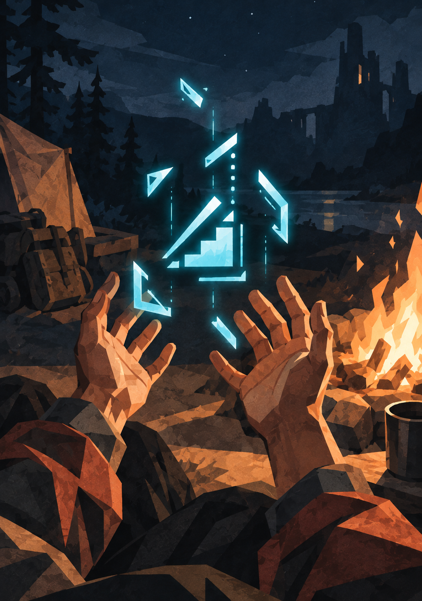

{.opener}

# Progression

::: epigraph
"So I get to level 10, right? And there's three classes to choose from. I tell the gang one is a healer. Mistake. They don't even want to hear the other 2. I was only carrying the bloody medkit because it wouldn't fit in Darren's bag."

the survivors' forum
:::

::: epigraph
"Y'all laughed when I kept the seeds. Well, my class says gardener and there's a tomato on that plant already. Nobody touch it, I'm getting my camera."

the survivors' forum
:::

Characters grow on a single loop: fight, quest, and survive to accumulate Volatile Energy (VE); rest to refine it through Consolidation; level when the refined total crosses the threshold. This chapter covers what happens at each level, and at the Level 10 milestone where a class arrives. The VE economy itself (how much a kill is worth, how fast Consolidation processes, what happens when you hold too much) lives in the Cultivation chapter.

## Earning Levels

Kills at or above your Grade, completed quests, session survival, and consumed cores add VE to the character's stored pool. Stored VE counts toward a level only once it is refined during a **Consolidation** rest. When the character's refined VE reaches the cost of the next level (Cultivation, "Leveling: The Cost of a Level"), they level up on the spot, mid-rest. A character can end a battle carrying three levels' worth of unrefined VE and still be the level they woke up as.

Levels are numbered continuously across Grades: each Grade spans 25 of them, so Levels 1–25 are F-Grade, 26–50 are E-Grade, and so on. Every level inside a Grade costs the same, and a kill pays a multiple of the Peer Kill set by how hard the enemy was for the character who fought it (Cultivation, "Combat Kills"). At the cap, leveling stops; only a Grade Breakthrough (its own chapter) opens the next span.

## Leveling Up

Each level grants **5 stat points** at F-Grade:

- **3 System points.** Before a character has a class (Levels 2–9), the GM assigns these based on how the character has actually been behaving, using the Behavioral Stat Mapping table below. From Level 10 onward, the class's stat profile assigns them instead.
- **2 free points.** The player assigns these to any Attributes they choose; in the fiction, the character allocates them through the System interface.

**Points can wait.** The three System points are placed at the level-up. The two free points arrive **unallocated**, and the player may hold them as long as they like, to see what the next fight demands; unallocated points add nothing until they are spent.

**Free points and the body.** A character whose class profile has no FOR and who puts every free point into one other Attribute reaches Level 25 with the Health they had at Level 10 (Classes, "Battle Medic": Nia at the cap with 30 Health). From Level 13, enemies in a standard fight deal hits of 40 and more, and the Health that FOR provides decides whether such a hit wounds the character or Downs them. Two free points a level into FOR from Level 10 add 60 Health by the cap.

**Capped stats.** A stat at the Grade maximum (99 at F-Grade) takes no further allocation: the player sends free points elsewhere, and the GM places the System points on the next-best behavioral match, never into a full stat. On level-up points alone, a dedicated build ends the Grade just short of its favorite stat's cap (Kara's all-STR run reaches STR 95 at Level 25; Classes, "Breaching Vanguard"); titles and treasures bring the cap sooner, and the redirection over the last stretch of the Grade is expected. A bonus from a title or treasure is not redirected: the points past the cap are lost.

At higher Grades, the budget scales with Grade magnitude (×10 at E, ×100 at D, and so on), with the same 3-to-2 split.

## Behavioral Stat Mapping (GM Reference)

At each level-up during the pre-class window, review what the character has done since the last level and assign the 3 System points to the stats that best match their behavior. The table is a guide; the GM may split points across rows or depart from it.

<!-- rules:table behavioral-mapping -->
| Behavior Pattern | Primary Stat | Secondary Stat |
|---|---|---|
| Solves problems with direct force, charges in | STR | FOR |
| Plans ahead, positions carefully, uses finesse | DEX | PER |
| Pursues power aggressively, takes risks for gain | POW | STR |
| Shows restraint, endures hardship, holds the line | FOR | HRT |
| Dominates socially, intimidates, commands | CHA | STR |
| Cooperates, negotiates, builds alliances | CHA | HRT |
| Imposes structure, creates systems, controls variables | PER | POW |
| Breaks rules, improvises, embraces chaos | DEX | POW |
<!-- /rules:table -->

**How to read the table:** If a character spent the last level charging into fights and solving problems through brute force, the GM puts 2 points into STR and 1 into FOR (or all 3 into STR if the behavior was extreme and unambiguous). A character who planned every engagement and used terrain might get 2 DEX and 1 PER. Mixed behavior? Split accordingly; 1 STR, 1 DEX, 1 CHA is a valid assignment for a character who fought, planned, and negotiated in equal measure.

The GM's rule: **reward what the character actually did rather than what the player says they want.**

## Your Stats at Level 9

By Level 9, a character has accumulated:

<!-- rules:table nine-levels -->
| Source | Points |
|---|---|
| Point buy (creation) | 40 |
| System-assigned (3 × 8 levels) | 24 |
| Free allocation (2 × 8 levels) | 16 |
| **Total at Level 9** | **80** |
<!-- /rules:table -->

A character who acted consistently toward one behavioral archetype will have a clear stat skew heading into class selection. A character who played eclectically will be more balanced. Both are valid, and they lead to different class offers at Level 10 (Classes, "Building a Class for a Specific Human").

## Class Selection (Level 10)

At Level 10 the System offers three classes built from the character's Hidden Vector Engine record across Levels 1–9. The Classes chapter owns the offers, the package, and the procedure for building them (Classes, "The Level 10 Scene"). The mechanical effect at this milestone:

1. The player accepts one of the three offers. The offers cannot be refused, and Level 10's three System points are not placed until the player chooses.
2. The class adds **10 to its lead Attribute** at once, before the level's points are placed.
3. From Level 10 onward, the level's **3 System points follow the class's profile**, which fixes all three, or fixes two and returns one to the player, or fixes one and returns two. The player's **2 points stay free**, plus whatever the profile returns.

The pre-class observation period is over. The Hidden Vector Engine continues tracking behavior for class evolution, the Principle track, and world response.

## Beyond Level 25

Level 25 is the F-Grade cap. VE keeps accumulating, stats keep growing from treasures and titles up to the Grade's stat cap, but no further levels arrive. The way forward is a **Grade Breakthrough**: a deliberate, dangerous ritual with its own chapter. When it succeeds, the character is Level 26 with nothing stored, leveling resumes at the E-Grade cost per level, the stat cap rises to the new Grade's maximum, and every Attribute gains 10; the F→E Breakthrough also unlocks the second Principle slot (see The Principle System).
