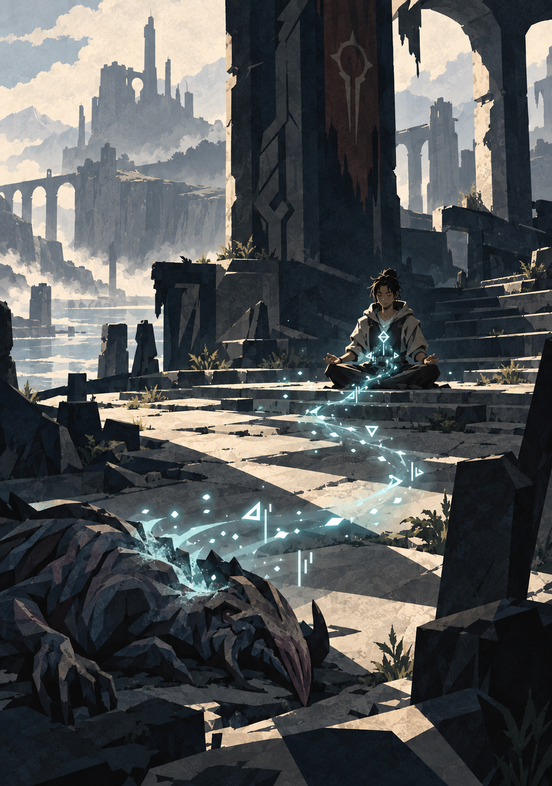
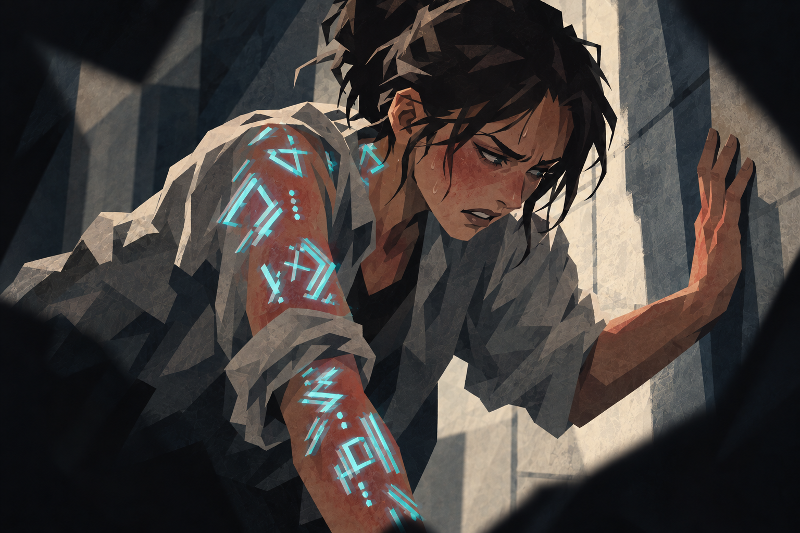
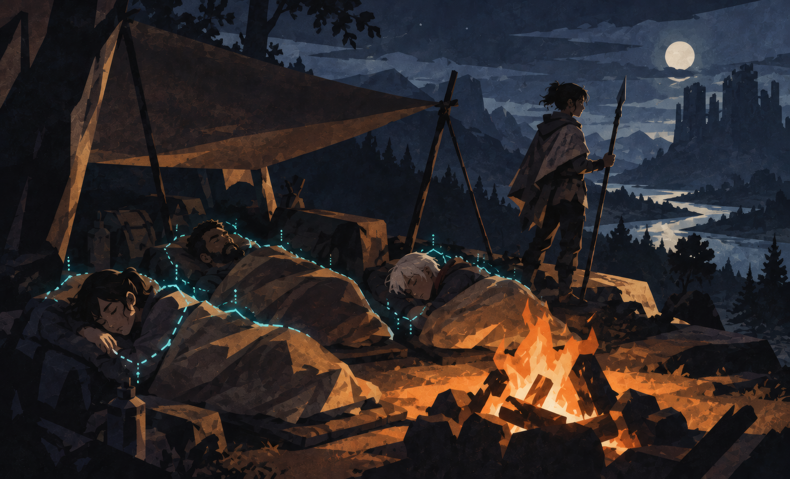

{.opener}

# Cultivation

::: epigraph
"Does anyone else smell cut grass every time something dies? Asking for reasons."

the survivors' forum
:::

::: epigraph
"The animal's death released its energy. The energy retained the animal's pattern. Consolidation proceeded as that pattern was dismantled."

an Open Measure bulletin
:::

---

## Volatile Energy & Consolidation

Characters do not gain traditional "Experience Points." They accumulate **Volatile Energy (VE)** from kills, consumables, and environmental sources: Aether that still carries the shape of whatever held it last, potent and unusable until it is broken down (Core Mechanics, "Aether"). VE is fuel. Refining it through structured rest is what turns it into permanent growth. The whole chapter is one loop:

**Earn VE → watch your gauge → decide to push or rest → Consolidate → level up.**

Joe's VE Tolerance is 80: he can store 80 VE before Saturation penalties start. A morning of hunting earns him 60 VE; he is fine. Then the party finds the den, and Joe decides to risk it: two more fights, one of them a Hard kill, push him to 90 VE, past his Tolerance, and now Joe feels uncomfortably full of energy: his skin prickles, his hands won't stay still, and everything is a little harder than it should be (Saturation, below: −10 to all rolls until he processes it). The party makes camp and Joe Consolidates. An hour in, his Aether is back. By the fifth hour the whole load is refined: his wounds are closed, the too-full feeling is gone, and all 90 VE is permanent progress toward his next level.

::: lore
Aether has a smell. Integrated humans describe green sweetness, fresh as leaves crushed between the palms and light enough to invite another breath. Each source adds an undertone that repeats for that source: a dry smoky finish, a warmer floral note, a musk, a low hum, a rhythm felt in the teeth. When something dies, the pale motes bring a brief wash of the sweetness and an uneven chord carrying the trace of what died, because the energy is still wearing the shape of the body that held it. Consolidation is that shape coming apart. The foreign notes fade, and the unevenness beneath the breastbone settles into a hum that follows the breath. A character who has smelled a thing's Aether once may recognize a resemblance later, before knowing its cause.
:::

A recognized trace is evidence to investigate. It grants no bonus, no range, and no sense stat. A PER check can pick out a faint trace; recognizing what left it requires having smelled that Aether before.

### The Pressure Gauge

{.scene}

Every character has a **VE Tolerance** representing the raw energy their body and spirit can hold before refinement:

> **VE Tolerance = 80 VE at F-Grade**, and ×10 for each Grade above: 800 at E-Grade, 8,000 at D-Grade.

Every character of a Grade holds the same amount. No Attribute raises it and no Attribute speeds the refining.

VE accumulates automatically after combat and from other sources. As long as stored VE remains at or below Tolerance, there is no penalty. Once VE exceeds Tolerance, the character enters **Saturation**. The bands are multiples of Tolerance; at F-Grade:

- **Mild Saturation (past 80, up to 160):** −10 to all rolls.
- **Heavy Saturation (past 160, up to 240):** −25 to all rolls.
- **Critical Saturation (past 240):** Heavy Saturation penalties continue, and the **collapse clock** starts: at the end of each full hour spent at Critical, roll d100, and the character collapses on a result of 25 or less. The threshold rises by 25 each hour (50 the second hour, 75 the third), and in the fourth hour the collapse is automatic. A collapsed character drops into involuntary Consolidation on the spot: defenseless, processing at the normal rate, unwakeable until stored VE falls to Tolerance or below. At the Level cap, where Consolidation refines nothing, the character wakes after 5 full hours with the VE still stored. The collapse also costs 1 temporary Raw point of FOR or POW (player's choice), which returns after the character's next Consolidation completed without interruption.

A level's worth of VE, 120, is Mild. Two levels, 240, is the top of Heavy; the next kill pushes stored VE past 240 into Critical and starts the collapse clock.

**A cross-Grade kill can put a character straight into Critical Saturation.** An E-Grade peer kill pays an F-Grade character 100 VE, Mild on its own; an E-Grade Peak monster pays 500, far past Critical, and a character who takes one is on the collapse clock from that moment. At 20 VE an hour, 500 VE takes 21 hours of Consolidation to come down to Tolerance. Allow the reward to stand, and apply the normal Saturation and Consolidation rules.

**GM Note on Saturation:** The System sends no notice when stored VE crosses a band. The GM narrates the crossing as symptoms: skin feels hot and prickly, vision tunnels at the edges, muscles cramp, something under the breastbone flexes in ways that feel wrong. The decision to keep hunting or to rest is one to remember at the session-end sweep.

### Consolidation (Structured Rest)

{.scene}

To process VE, a character declares a **Consolidation** rest and states what they are reaching for: process everything, process until the next level, or process a specific amount. The goal sets how many hours the rest runs.

**Every hour of Consolidation refines 20 VE at F-Grade and restores one fifth of your Max HP; the fifth hour restores the rest.** The refining rate is ×10 per Grade (200 at E-Grade) and the same for every character of the Grade. A full Tolerance clears in four hours, a level's worth of VE in six, and a full set of wounds in five; an eight-hour rest covers all three. The minimum is 1 hour of in-game time, however little VE needs processing. A character with nothing stored still declares the rest, takes its first hour, and gets the Aether and the HP.

Refining time scales with stored VE: 160 VE takes eight hours, and anything past 240 (Critical) takes more than twelve.

During the rest:

- **Growth:** Processed VE converts into permanent level progress. When processed VE reaches the cost of the next level, the character levels up on the spot, mid-rest.
- **Aether:** The pool refills completely when the first full hour completes. Aether does not recover in combat, between combats, or through passive time; outside Consolidation only an Aether Pill or a Pulse Shard restores it (Items). See Core Mechanics, "Aether."
- **Artifacts:** Items that recharge "at the next Consolidation" (the Reactive Buckler and similar) reset when the first full hour completes, on the same clock as Aether.
- **Interruption:** The character keeps every completed hour of processing and recovery. Unprocessed VE stays in the tank and remains subject to Saturation.
- **Defenselessness:** A consolidating character is completely defenseless. A consolidating character who is attacked or roused wakes at once, keeping completed hours per the interruption rule; only the collapse at Critical Saturation is unwakeable. The whole party may consolidate at once as a calculated risk; posting a guard means that character is not consolidating.

**Environmental Modifiers:** Consolidating at a High or Extreme density site (Grade Breakthroughs, "Energy Density Tiers") refines 40 VE per hour instead of 20: a full Tolerance in two hours, a level in three. A Principle-affinity treasure pays its Insight when consumed (The Principle System, "Insight Points").

**Battle Memory Meditation:** Characters holding a Battle Memory Card process it during Consolidation. The GM, or the System AI in assisted modes, delivers a cryptic vision in the System's voice and awards Insight Points; see The Principle System, and the vision procedure for every run mode in The System AI chapter.

### Leveling: The Cost of a Level

Levels are numbered continuously across Grades: **Levels 1–25 are F-Grade, 26–50 are E-Grade, 51–75 are D-Grade**, and so on. Each Grade spans 25 levels.

> **A level costs 120 VE at F-Grade**, and ×10 for each Grade above: 1,200 at E-Grade, 12,000 at D-Grade.

Every level inside a Grade costs the same. Twelve peer kills carry a character from one F-Grade level to the next, and reaching the F-Grade cap at Level 25 takes 2,880 VE in all.

**Grade Breakthrough:** At Level 25 the character cannot advance through ordinary Consolidation. Entering E-Grade (and Level 26) requires a **Grade Breakthrough**, a deliberate ritual with its own chapter. A successful Breakthrough makes the character Level 26 with nothing stored, and each E-Grade level costs 1,200 VE.

At the cap, VE keeps accumulating with nowhere to go, and stored VE counts in full toward the charge the Breakthrough burns at Ignition (Grade Breakthroughs, "Stage 2: Ignition"). Consolidation at the cap refines none of it: the stockpile waits for Ignition, and Saturation applies to it until it is spent. A collapse at the cap lasts 5 full hours and leaves the stockpile where it was (see "The Pressure Gauge").

**A character at the cap who is not ready to Break Through is not stalled.** Levels stop and everything else continues. Marks still accrue toward Seasoned and Master. Insight still accrues, and the Principle track has no cap at all, so the capped stretch is where cautious characters catch up on the ladder they neglected. Titles still land, treasures still raise stats toward the Grade ceiling, and the Breakthrough itself rewards preparation: a Foundation Pill, a high-density site, an ally's Anchor action, and a higher HVE Coherence band all add to the Breakthrough Check (Grade Breakthroughs, "Modifiers to the Breakthrough Check").

### When to Consolidate

The decision is about timing. Push one more fight while already Saturated, gambling on a bigger haul before resting? Or pull back and consolidate safely, knowing another group might claim the hunting ground while you meditate?

---

## Awarding VE (GM Reference)

The GM awards VE from multiple sources. The baseline rates below are tuned to F-Grade. Multiply by ×10 per Grade for higher tiers (E-Grade enemies yield ×10 VE, D-Grade ×100, and so on), matching the leveling chart and damage Multiplier.

### Combat Kills

**A kill's award depends on the enemy's difficulty tier for the party that fought it.** Difficulty tiers already describe an enemy relative to the party: a Moderate enemy is a peer, a Peak enemy is a monster. The award follows the same logic, so a peer fight is worth the same fraction of a level at Level 2 and at Level 22.

A **Peer Kill** is worth **10 VE** at F-Grade, and ×10 for each Grade above. That is what one Moderate enemy of the character's own Grade pays. Every other tier is a multiple of it:

<!-- rules:table kill-tiers -->
| **Difficulty** | **Award** | **F-Grade VE** |
|---|---|---|
| Trivial | Peer Kill × 0.2 | 2 |
| Easy | Peer Kill × 0.5 | 5 |
| Moderate (peer) | Peer Kill | 10 |
| Hard | Peer Kill × 2 | 20 |
| Severe | Peer Kill × 3 | 30 |
| Peak | Peer Kill × 5 | 50 |
<!-- /rules:table -->

Twelve peer kills, or two Peak kills and a Hard one, carry a character a level.

The transfer is visible: when something dies, its unrefined VE leaves the body as a brief drift of pale motes toward those who earned the kill.

Cross-Grade kills multiply the award: read the victim's tier within its own Grade, take that multiple of your own Peer Kill, then multiply by ×10 for every Grade the victim sits above you. For an F-Grade character, an E-Grade peer-tier enemy pays 100 VE, most of a level, and an E-Grade Peak monster pays 500, enough VE for four levels after refinement, with stored VE well above the Critical threshold ("The Pressure Gauge", above). **A victim below your Grade pays nothing.** Its VE is too thin a shape for an ascended body to refine.

The award depends on what died, whatever the method: a trap, an ambush, or a plan that ended the fight before it started pays the same as an open brawl. How the kill happened matters only to the Hidden Vector Engine. A defeated boss-tier encounter (rare, named, or designed for the moment) may be worth 1.5× the listed amount at the GM's discretion.

**Who earns it.** Every character who meaningfully participated collects the full award; there is nothing to pool and nothing to divide. Fighting, guarding, scouting the escape route, and controlling the field all participate; being elsewhere does not. The killing blow earns no extra share, and individual excellence reaches the System through the Hidden Vector Engine, titles, and Hidden Achievements instead. A party spread across levels uses one award unless the enemy's tier differs between characters: a creature that is a peer for the strongest character may be Hard or Severe for the newest, and each character then collects the award for their own tier.

### Quest & Survival

- **Session Survival:** 5 VE (F-Grade) per character per session, awarded for surviving meaningful play. Scales with Grade.
- **Quest Completion:** GM-assigned, sized against the cost of a level. A small errand is worth a peer kill or two. A solid side quest runs a quarter to half a level. A quest arc that defined a stretch of play can be worth a full level or several, and should be when the table earned it.
- **Hidden Achievements:** Rare, and worth being generous with: half a level to a full level, plus a Title or other narrative reward. Choose the award within that range to reflect the achievement's difficulty and significance.

### Environmental Sources

- **Ambient Absorption:** Characters passively absorb VE in energy-dense terrain: 1 VE/hour at Moderate density, 3 at High, 6 at Extreme. Such places should be rare and notable, and the award batches per visit ("a day working the ridge: 20 VE"). This is the absorption that funds Breakthrough Ignition.
- **Treasure Cores & Affinity Crystals:** VE awarded once, when consumed. F-Grade examples: minor core (5 VE), refined core (15 VE), pristine core (40 VE). These are fuel and nothing else; the treasures that raise an Attribute permanently are a separate category in the Items chapter.

### Pacing Reference

At F-Grade, L1 → L2 requires 120 VE: twelve Moderate kills, twenty-four Easy ones, or a mix of hunting, quests, and survival over a session or two. Reaching Level 10 requires 1,080 VE, across roughly 15–20 sessions of moderate-pace play. Reaching the F-Grade cap at Level 25 requires 2,880 VE.

On paper the pace is flat across Grades: rewards and costs both scale ×10, so the same number of peer kills spans a level at every Grade. In play, later Grades run slower anyway. Sub-Grade kills pay nothing, peer prey is rarer and defends better territory, and every peer fight is dangerous. Expect each Grade to take more sessions than the one before without touching the numbers.

Tracking every award as it lands is optional. A GM may instead keep running totals between sessions and award them in batches at rest points, checking Saturation whenever a batch crosses a band.

### Risk vs. Rest

Survival and quest completion guarantee baseline progression. Combat VE and environmental absorption are the accelerants. Characters who push into danger and time their rests well level faster than those who play it safe.

---

## Grade Breakthroughs

To advance beyond the Grade-cap level, a character must complete a **Grade Breakthrough**: a four-stage ritual involving deliberate VE overcharge, a Breakthrough Check (d100 + HRT Force + preparation against a flat Resistance of 140), external phenomena management, and System recognition. The full mechanic is in the Grade Breakthroughs chapter, including the Overcharge Ratio risk-reward dial, the five Quality Tiers, Breakthrough Item categories, Environment & Energy Density modifiers, Party Support, and Grade-specific trial themes.

---

## Healing

For 0 HP, the Downed state, stabilization, and death, see Core Mechanics, "Downed and Death."

Three paths, each with a cost:

- **Rest Healing:** During Consolidation, characters recover one fifth of Max HP per hour, and all of it by the fifth hour. It takes time and a secure site.

- **Healing Pills and Potions:** Instant recovery of a flat HP amount based on pill grade. Consuming one in combat costs 1 Beat, and only the first two pills a character takes in a fight have any effect (see Items, "Pill Limit in Combat").

- **Healing Skills and Spells:** Some classes possess healing abilities generated by the System AI. These cost Aether and one Beat in combat.

Instant full heals do not exist outside extraordinary systemic treasures and high-tier Principle Applications.
