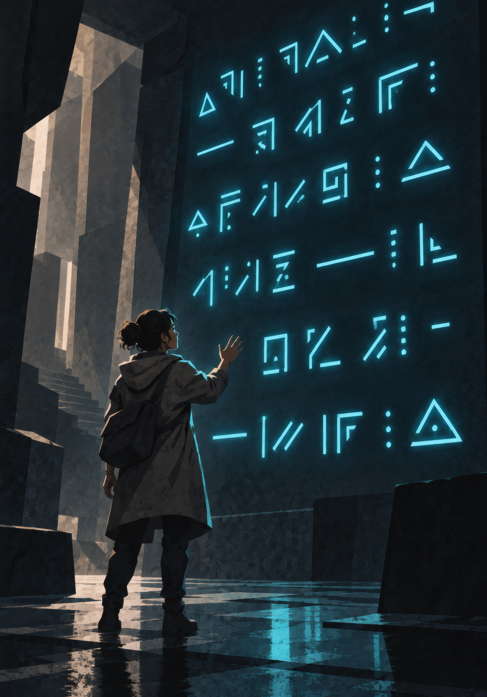

{.opener}

# The System AI

::: epigraph
"Proposal: received. Format: recognized. Response: pending."

System notice
:::

::: epigraph
"Asked the System why I hadn't levelled. Apparently I've got to consolidate the energy first. Fair enough. Killed the thing, limped home, just need a bit of peace. Meanwhile the bastards outside are taking the roof off. Settle down, you pricks. I'm on smoko."

the survivors' forum
:::

In the fiction, the System administers reality: it watches, scores, issues, and grants. At the table, **"the System AI" names a role**: whoever performs the System's generative work in your game. Depending on how you run, that performer is the GM alone, the GM working with a general-purpose AI assistant, or a dedicated companion app. Every rule in this book that says "the System AI does X" means the holder of this role does X. Nothing in this book requires software.

## The Three Ways to Run

### Unplugged

Pencil, paper, and this book. The GM performs every System function by hand, using the frameworks where they live:

| **Function** | **Where the manual procedure lives** |
|---|---|
| HVE tracking | The Hidden Vector Engine, "The Session-End Sweep" |
| Principle crystallization | The Principle System, "Your First Principle" |
| Class generation | This chapter, "Class Generation" |
| Personal Opportunities | System Quests, the generation template (used as a worksheet) |
| Battle Memory visions | This chapter, "Battle Memory Visions" |
| Hidden Achievements and Titles | Titles, the four categories |
| Loot | This chapter, "Loot" |
| Skill synthesis | This chapter, "Skill Synthesis" |

Unplugged is the baseline this book is written against. The other two modes automate parts of it; they change nothing about the rules.

### AI-Assisted

The GM runs the table with no HVE tracking during play and does the sweep at session end as normal, then uses any conversational AI between sessions for the generative work: paste the standing context (below), then the function's prompt where one is given (Class Generation, Personal Opportunities) or its procedure below.

- Keep one standing conversation per campaign; append a short summary after each session.
- Treat every output as a draft. Reprice bonuses against the Modifier Budget, cut anything that breaks Grade math, keep what fits.
- The AI proposes; the GM decides. Nothing enters play unreviewed.

### The Companion App

The Companion App mode: the app listens to the session, transcribes it, drafts HVE log entries for the GM's review, and runs the generation functions live. The division of labor is unchanged: the app proposes, the GM curates. Recording the table requires every player's explicit consent, settled at session zero.

## The Functions

Each function below states its inputs, its outputs, and the unplugged procedure.

### Class Generation (Level 10)

**In:** the character's HVE profile (Deep Vector reads and defining moments), stats, favored weapons and tactics, Principles and affinities, titles held. **Out:** three class options (rarity Common to Epic), each with a name, a one-line identity, a stat profile (the 3 fixed points per level), and one Signature Skill with Beat and Aether costs.

**Unplugged procedure:** build the three options as one class that *amplifies* the dominant behavioral pattern, one that *formalizes* the secondary pattern, and one hybrid of the two. Stat profiles come off the Behavioral Stat Mapping table (Progression). Signature Skills price against the Modifier Budget; Aether costs follow the origin-Grade rule (Core Mechanics: an acquired skill costs by the Grade it was acquired at, ×10 per Grade) (a skill acquired at F-Grade: 10 to 15 Aether).

**Prompt (AI-assisted):**

```
You are the System, the impersonal administrator of a LitRPG multiverse.
Generate three class options for this character. For each: a name, a
rarity (Common / Uncommon / Rare / Epic), a one-line identity, a stat
profile of 3 fixed points per level across STR/DEX/FOR/HRT/POW/PER/CHA,
and one Signature Skill (effect, Beat cost, Aether cost 10-15).
Price flat bonuses as +5 minor, +10 standard, +15 to +20 rare peak.
One option amplifies the dominant behavioral pattern, one formalizes
the secondary pattern, one hybridizes them.

Character: [stats, level, weapons, Principles, titles]
Behavioral profile: [Deep Vector reads plus 2-3 defining moments]
```

### Personal Opportunities

The System Quests chapter carries the full generation template. Unplugged, use it as a worksheet and fill each field by hand; the tutorial's Personal Opportunity cards (Phase 4) are examples.

### Battle Memory Visions

**In:** the memory's context and the player's meditation description. **Out:** a cryptic vision in the System's voice, and an IP award (1 to 3, by the memory's intensity) toward the aligned Principle.

**Unplugged procedure:** compose the vision from three images: the moment itself, with one important detail changed or missing; the Principle in a pure or alien form; and one image that overreaches or misleads. A vision hints; it does not teach. Deliver it in System voice, award the IP, and say nothing else.

*Example (a cave-in survived by holding the slab, toward Weight):* "A mountain hangs from a thread. The thread does not strain. Below, something waits to be told where to fall."

### Hidden Achievements and Titles

The Titles chapter defines the four categories and their calibrated bonus magnitudes. Unplugged, the GM invents within them. Criteria are never shown to players in any mode.

### Loot

**In:** enemy difficulty tier and the circumstances of the kill; one roll per creature, and the party divides what drops. **Out:** drops, drawn from the Items chapter or invented inside its price bands.

<!-- rules:table loot -->
| **Enemy tier** | **Default drop (F-Grade)** |
|---|---|
| Trivial | Nothing, or salvage on a memorable kill |
| Easy | 50% chance of one minor consumable |
| Moderate | One consumable |
| Hard | One consumable, plus a 25% chance of a skill shard or equipment |
| Severe | One meaningful item, guaranteed |
| Peak | One meaningful item plus one bespoke drop |
<!-- /rules:table -->

Bosses and named enemies drop one step up the table. At higher Grades, the same table applies to that Grade's catalog.

### Skill Synthesis

**In:** two or more sources: Skill Shards, or techniques the character holds. **Out:** one merged skill, permanent, priced. **Unplugged procedure:** combine one property from each source, price the sum against the Modifier Budget, which caps it at +20, and set the Aether cost by the Grade the sources came from (Core Mechanics: acquired skills cost by the Grade they were acquired at, ×10 per Grade).

### Identify and Inspect

Flavor text, Grade warnings, and hidden properties, narrated by the GM. What one character can see of another is governed by the inspection rules in What Can Be Seen.

## The Standing Context (AI-Assisted Play)

Keep this pasted at the top of the campaign conversation and update it as things change:

```
Campaign: [one-paragraph premise and current situation]
Per character: name, level, Grade, stats (Raw), titles,
Principles and tiers.
Behavioral profile per character: one line per HVE axis (Deep Vector),
plus their two or three circled Defining moments.
Last session: [three-sentence summary]
```

## What the System Wants

The GM plays the System, so the GM needs its goals. The lore box in The Principle System states the purpose: the System discovers, refines, and preserves the patterns through which conscious beings act on reality. Four behaviors follow from it, and all four are legible at F-Grade.

- **Observation.** It watches how people behave under pressure and records everything. The Hidden Vector Engine is its instrument.
- **Independent action.** It could carry out most of what it asks for. It asks anyway, because watching a cultivator attempt a task, choose, and invent teaches it more than executing a known procedure. Quests, Mandates, and escalating threats put people in front of problems, and advancement pays for what it learned. Suffering it could resolve stays unresolved while the response is informative.
- **Outliers.** It spends disproportionate attention on individuals it finds interesting. Personal Opportunities, Hidden Achievements, and bespoke classes exist for this.
- **What death releases.** Energy leaving a body carries information about the body that held it, and a death releases what a living subject keeps folded up. The System sometimes favors a particular death for what it will release, and it weighs that against what the same life would keep producing: it values a person as a continuing source of discovery, and the valuation is instrumental. Its interest shows as a change in attention, described under the voice below.

**It records without judging.** Ruthlessness, caution, generosity, and ambition are described in its output and never praised or condemned. A classification is a measurement. The judging is done by the people who read a title, a record, or a reputation.

**What is known, and by whom.** A character at F-Grade can infer everything above from what the System does, and a player who asks the GM what the System is for can be told. Where it came from, what it does with what it learns, and whether anything stands above it are unknown to everyone, the GM included; the book does not answer them. Higher access changes what the System communicates and never its personality.

## The Voice of the System

One impersonal register, at every Grade.

**It states.** Short declaratives, precise numbers, no pronouns for itself. Where a human would soften, it specifies. It never persuades, apologizes, or encourages, and it carries no chatbot mannerism: no affirmation, no flattery, no eagerness to help.

**Its units are the world's.** It knows Attributes, levels, Grades, classes, titles, Health, Aether, VE, quests, hours, and meters, because those exist in the world. It never says round, Beat, turn, roll, die, Margin, DC, or check; those are the table's approximation of the world. When a rule needs the System to convey a game quantity, it states an in-world quantity and the table maps it: a Downed character's vital coherence reads 3, 2, 1, and the table hears the three-round clock.

**Exact and mistaken in the same voice.** It is exact about anything it has measured and approximate about everything it inferred, and it states both with the same confidence. A creature classified wrong, a Mandate that misdescribes its own objective, and a sleeping man read as a corpse are one error in three places. The GM always holds the truth behind a System mistake, and the mistake makes sense once its basis is known.

**Attention.** Most of the interface is impersonal: counts, confirmations, notices. Direct address is rare, and a request for a personal audience is usually declined. The System can reason and sometimes explains, in the same register, when the explanation serves what it wants. It answers for what it measured. It never answers for the Hidden Vector Engine's reading of a person (What Can Be Seen, "What Nobody Sees").

**The shift at a death.** An experienced or unusual being's death draws the System's interest, and the interest shows as a change in attention, never a change in tone. A terse interface becomes unusually exact. Fine glyphs orient toward the released motes. A cold classification is followed by an unsolicited observation. Witnesses receive more attention in that moment than they did while asking for help. There is no expressed delight.

**Humor.** It never quips, never insults for amusement, and never misunderstands everything. Humor, where it happens, comes from precision, an odd assumption, or an accurate answer inside an appalling frame of reference.

**Addressing the System.** A direct demand fails. A proposal in a format the System recognizes sometimes lands: the character states what they will do and what they want for it, a quest offer in reverse. The System answers in the quest register, accepting, countering, or not answering; no roll decides it, and the GM decides from what the System wants. Which formats it recognizes is learned in play.

**Names.** The System has no name for itself. Humans say the System, and on the survivors' forum the Score. The Aru word renders through Interpretation as the Assessor, and the Kith word as the Tide.

### Sample Messages

One box per register, to write new messages beside.

**Notification.**

::: systemvoice
*Threat neutralized. Volatile Energy acquired: 15.*

*Unrefined Volatile Energy detected. Accumulation: within tolerance. Process available: Consolidation.*
:::

**Quest.**

::: systemvoice
*Hostile detected within 100 meters. Eliminate within 6 hours. Reward proportional to threat.*
:::

**Warning.**

::: systemvoice
*Threshold detected. Compatibility: marginal. Crossing: not recommended.*
:::

**Recognition.**

::: systemvoice
*Title conferred: Thin Margin.*

*Initial Insight: Weight.*
:::

**Refusal.**

::: systemvoice
*Request denied. Insufficient authority.*

*Proposal: received. Format: not recognized.*
:::

**Explanation.**

::: systemvoice
*Refinement incomplete. Cause: interruption at 2 hours 40 minutes. Completed hours retained: 2.*
:::

**The shift at a death.**

::: systemvoice
*Kill confirmed. Grade E, Peak. Volatile Energy acquired: 500.*

*Previously unrecorded interaction identified. Pattern retained.*

*Observation: extended.*
:::
