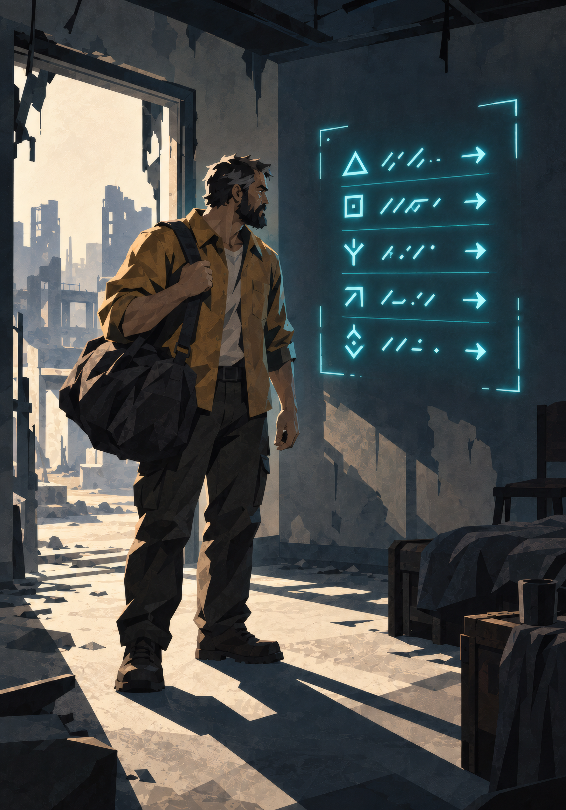
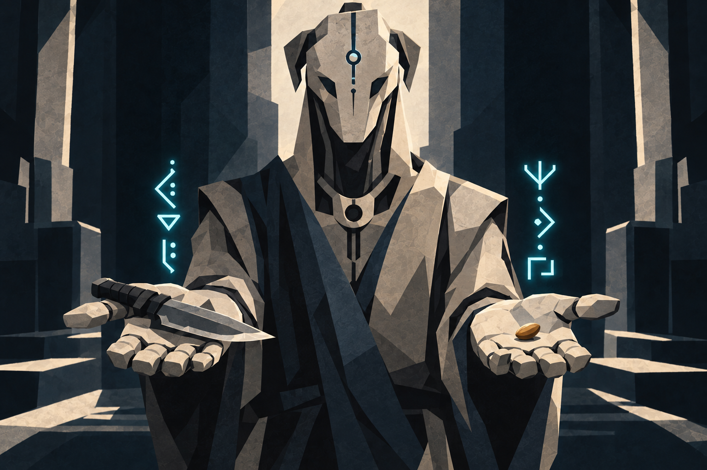

{.opener}

# System Quests

::: epigraph
"Mission said lifeless cave. There was a bear in it, asleep. I think it thinks asleep is the same as dead."

the survivors' forum
:::

::: epigraph
"Rill's notice specified when everyone must leave. The people without transport were given the same time."

Bel Sar, route account
:::

---

## Design Intent

System Quests are how the System steers a character and recognizes what the character does. They are explicit and structured: notifications, objectives, rewards, time limits, and a persistent log.

**Filler and meaningful quests share the log.** Routine "kill ten boars" entries sit alongside Mandates that reshape the campaign. Filler quests provide steady progression hooks and the System-notification rhythm; Mandates carry stakes and drive story. Players choose what to engage with based on capability and interest.

**Refusal and failure have consequences, but consequences are not always punishment.** Sometimes the System simply *stops offering certain paths*. Consistent refusal narrows future offerings: a less punitive consequence than a faction's door closing, and one that lets players shape their own arcs by what they ignore.

---

## The Quest UI

Every character's System interface holds a quest log.

**Recommended table presentation:** a **shared quest log** (paper handouts, a Discord pinned message, a Google Doc, a dedicated app, or a VTT module) visible to all players, updated by the GM. Each player keeps their personal and hidden quests on their own sheet or card, visible only to them.

**Standard quest entry shape:**

```
[Q-217] Hostile Detected: Sector 12-Beta
Issuer:     System
Grade:      F · Difficulty: Easy
Objective:  Eliminate detected hostile (Glow-Stalker) within 6h.
Reward:     8 VE, 1 Lesser Healing Pill
Time:       5h 47m remaining
Status:     Active
```

The log displays:

- Active quests (title, issuer, Grade and difficulty, objectives, known rewards, time limits if any).
- Completed quests (for narrative reference and the Session-End Sweep).
- Failed or refused quests (so consequences remain legible).

For Hidden Quests, the entry appears differently; see Hidden Quest Conventions below.

---

## The Party

The System supports formal parties. Any Integrated being can extend a party invitation to another within line of sight; accepting is a thought. Membership persists until a member leaves, the party disbands, or a member dies.

A party grants three things:

- **Status sharing.** Every member's interface shows a party frame: each member's current HP, Maximum HP, Aether, and whether they are Downed, and nothing else. See What Can Be Seen.
- **Quest sharing.** A member may share a Routine, Faction, or Bestowed quest with the party. The entry appears in every member's log, and any holder's progress advances the shared objective. **When a quest with a counted objective is shared, the count multiplies by the number of holders at that moment and does not change afterward; a holder who leaves keeps nothing, and a joiner takes the quest at its current count.** "Eliminate ten" held by three hunters becomes thirty between them, announced in every holder's log. Objectives that cannot scale (reach a place, protect a person, recover a thing) stay as written. Mandates need no sharing (they already bind everyone in scope), and Personal Opportunities cannot be shared; they are addressed to one behavioral signature.
- **Rewards are per holder.** On completion, every holder who meaningfully participated collects the quest's award at their own level, the same rule combat kills use (see Cultivation, "Awarding VE").

---

## Quest Categories

### Mandates

{.scene}

Directives from the System, cold and impersonal, with stated consequences for noncompliance.

**Shape:** A System-issued objective binding on every Initiate within a region or population. Story-driving, multi-session, often party-converging.

**Example:**

> *[MANDATE M-04] All F-Grade Initiates within Sector 7 will report to coordinates [4.7, -12.1] within 72 hours. Reward upon arrival: System recognition, sector access, additional VE allocation. Failure to comply: behavioral reclassification.*

Refusing a Mandate can earn a negative Bestowed title, draws faction hostility, and closes specific reward paths (Refusal of a Mandate, below). Use Mandates for regional objectives that affect the campaign.

::: lore
The Rill Closure is the case the wider world cites. A documented, inhabited sector was scheduled for retirement, with notice given and the evacuation window published. Some inhabitants refused to abandon what they depended on, and the retirement proceeded on schedule. A Mandate's deadline does not move for those who cannot meet it.
:::

### Personal Opportunities

{.scene}

The System notices something specific about a character and offers a tailored quest. Generated from current HVE state, recent behavior, and the immediate situation.

**The same situation generates different Personal Opportunities for different characters at the same table.** A Force-aligned character might receive *"Hostile detected within 100 meters. Eliminate within 6 hours. Reward proportional to threat."* A Method-aligned character in the same situation receives *"Unstable formation detected. Stabilize before collapse: reward proportional to elegance of solution."*

Personal Opportunities are also the primary lever by which the System nudges or tests the character: the offer can affirm an existing pattern or quietly invite the character to step against it. By default the offer affirms, following the character's recent behavior. An offer typically tests against the pattern when recent behavior and long-term identity disagree (the Current and Deep columns of the HVE sheet lean different ways at the sweep, where the offer is drafted before Current wipes), and occasionally for no visible reason. The GM, or the System AI in assisted modes, makes the choice, and a GM in doubt affirms.

**Paired Opportunities.** When the System has recorded a human and an Aru acting together twice, it may address one Personal Opportunity to both at once: the same offer in two logs in two languages, completing only if both act. The offer affirms or tests the cooperation the way an ordinary Opportunity affirms or tests a pattern, and it pays each holder the Personal Opportunity value at its difficulty. The precedent and the campaign use are in After the Gate, "Paired Opportunities".

### Routine Quests

The "kill ten boars" tier. Reliable, repeatable in kind, video-gamey. The System issues quests for clearing local threats, gathering resources, scouting territory, completing exploration objectives, and defeating specific enemies.

They provide steady progression hooks, satisfy the genre's notification-loop feel, and give players agency in choosing what to pursue when bigger plots aren't immediately pressing.

Routine quests vary in scale: an "F-Grade, Trivial" hunt sits in the log alongside an "E-Grade, Severe" one.

**Example:**

> *[Q-181] Glow-Mote Cluster Containment.*
> *Grade: F · Difficulty: Trivial.*
> *Objective: Eliminate Glow-Mote swarms reported near the eastern perimeter. (0/3)*
> *Reward: 3 VE, 1 Stuttering Tincture.*

### Hidden Quests

No notification at the time of action, or notification with deliberately unclear objectives. The character is doing something the System recognizes as significant but isn't telling them about (or is telling them in cryptic terms).

These pair with Hidden Achievement titles and reward attentive, exploratory play. See Hidden Quest Conventions below for how they appear in the log.

### Faction and Bestowed Quests

Issued by NPCs, organizations, and mentors, never by the System directly. The System tracks them in the quest log but does not generate them. What a character does on one counts at the Session-End Sweep and toward titles like anything else the character does.

**Example:**

> *[Q-205 · Faction] The Lost Crew.*
> *Issuer: the Flats co-op.*
> *Grade: F · Difficulty: Hard.*
> *Objective: Locate three missing scavengers last seen past the depot fence.*
> *Reward: Standing with the co-op improves; a Skill Shard; 50 VE.*

---

## Quest Mechanical Treatment

### Quest VE Policy

**Both action VE and quest completion VE apply.** Combat kills, environmental absorption, and other VE sources accumulate normally during a quest. On completion, the quest's stated VE reward is awarded *additionally*.

**Reasoning:** The genre treats it this way (the System awards both kill XP and quest completion XP), it preserves the value of action-by-action play, and it pays a bonus for seeking out quests on top of existing activity. A character who does ten Glow-Mote kills outside a quest gets 20 VE; the same character doing it as a quest gets 20 VE + 3 quest completion = 23 VE.

**Limit:** a quest pays its completion VE once. A cleared quest does not return to the same character; new quests of the same kind do.

### Quest Difficulty

Quest difficulty is read off the **Difficulty Card**, identical to combat and obstacle resolution: a quest is "E-Grade, Severe" or "F-Grade, Moderate."

A quest's difficulty determines:

- The expected challenge tier of obstacles within (combat, traps, social pressure).
- The reward magnitude (see Reward Reference Table).
- For a Mandate, the consequences of refusal or failure.

### Performance-Scaled Rewards

Some quests state a reward as a proportionality clause instead of a fixed amount: *"reward proportional to threat,"* *"reward proportional to elegance of solution."* At completion the GM, or the System AI in assisted modes, sets the payout from the difficulty's number on the Reward Reference Table, weighing speed, thoroughness, collateral damage, and style (the System never publishes the criteria): exceptional performance pays up to half again, poor performance half.

Use these for quests where how the thing gets done matters as much as whether. They pair naturally with Personal Opportunities.

### Refusal and Failure Consequences

Consequences depend on quest type.

#### Single-quest refusal

<!-- rules:table refusal -->
| **Quest Type** | **Consequence of Refusing One** |
|---|---|
| Routine | Quest expires silently. No mechanical penalty. |
| Personal Opportunity | The System notes the refusal; after 3 refusals of one flavor, that flavor appears half as often, and after 6 it stops appearing. |
| Mandate | Faction hostility, locked paths. Often a negative Bestowed title ("Defiant," "Mandate-Breaker"). |
| Faction | The issuing faction remembers the refusal; the character's standing with it falls. |
| Hidden | The opportunity passes silently; the character usually never learns it existed. |
<!-- /rules:table -->

#### Repeated refusal of one flavor

When a character refuses three or more Personal Opportunities of the same flavor (combat-oriented, social-oriented, exploration-oriented), the GM, or the System AI in assisted modes, narrows offerings:

- After 3 refusals: that flavor appears half as often.
- After 6 refusals: that flavor stops appearing.

#### Refusal of a faction's quests

- Reputation drops with that faction.
- After repeated refusal, the faction may issue a "test" quest with elevated stakes: accept, or the faction may grant a negative Bestowed title.
- After persistent refusal, the faction stops offering quests entirely, may grant a negative Bestowed title, and may close that faction's reward paths permanently.

#### Refusal of a Mandate

Refusal takes effect at once:

- Faction hostility from the Mandate's beneficiary.
- Negative Bestowed title at the GM's discretion (commonly "Defiant" or "Mandate-Breaker"; rarely something stranger).
- Specific reward paths permanently closed: class evolution options narrow, certain Principles become inaccessible, access to certain locations is revoked.
- Higher-Grade entities may take an interest. This can be opportunity or threat.

#### Failure (attempted but not completed)

Failure is distinct from refusal: the character tried and lost. Failing a Personal Opportunity or Faction quest costs less than refusing it, and failing a Mandate never costs more. Routine and Hidden quests cost nothing to refuse, and failing one costs the reward and little else.

- **Routine:** No reward.
- **Personal Opportunity:** No reward. Often no further consequence; the System notes the attempt and may offer a related opportunity later.
- **Mandate:** Real systemic consequence per Mandate text. Usually the same as refusal, sometimes mitigated by demonstrated effort.
- **Faction:** Reputation hit, possible follow-up quest to recover standing.
- **Hidden:** Sometimes the character never knows; sometimes the log shows a hidden entry as failed, its objective still obscured.

---

## Reward Reference Table

The following tables calibrate quest rewards for the GM and the System AI. They establish what "good" looks like at each tier so both can extrapolate consistently. All values are **F-Grade baseline** unless otherwise noted; multiply by ×10 per Grade.

### VE Rewards by Quest Category and Difficulty

<!-- rules:table quest-ve -->
| **Difficulty** | **Routine VE** | **Personal Opportunity VE** | **Mandate VE** | **Faction VE** |
|---|---|---|---|---|
| Trivial | 3 | 5 | none | 4 |
| Easy | 8 | 15 | 25 | 12 |
| Moderate | 15 | 30 | 50 | 25 |
| Hard | 30 | 60 | 125 | 50 |
| Severe | 50 | 100 | 250 | 90 |
| Peak | 90 | 175 | 500 | 150 |
<!-- /rules:table -->

**Reading the table:** A Routine F-Grade Moderate quest awards 15 VE on completion (in addition to action VE earned during the quest). The same difficulty as a Personal Opportunity awards 30 VE, twice as much. Mandates pay the most.

Hidden Quest VE rewards equal Personal Opportunity rewards at the same difficulty tier, and pay up to half again when the GM, or the System AI in assisted modes, judges the resolution elegant or improbable (see "Performance-Scaled Rewards").

### Item Rewards by Difficulty

Quest item rewards scale with difficulty. Pull from this reference; the GM, or the System AI in assisted modes, can build variants:

<!-- rules:table quest-items -->
| **Difficulty** | **Typical Item Reward** |
|---|---|
| Trivial | 1 Stuttering Tincture, or 5 currency, or a minor scavenge token. |
| Easy | 1 Lesser Healing Pill, or a minor weapon, or a single skill shard. |
| Moderate | 1 Healing Pill + 1 Sparkstone Tablet, or a quality weapon, or a Resonance Glass. |
| Hard | 1 Greater Healing Pill, or 2 skill shards, or a Foundation Pill (Dragon Marrow). |
| Severe | 1 Pristine Recovery Pill, or a single-use ranged relic, or a high-tier Foundation Pill (Nine Leaf Essence). |
| Peak | A bespoke item the GM designs (the System AI can draft one in assisted modes): a named weapon, a Quality Enhancer for breakthrough use, a Bestowed-tier consumable. |
<!-- /rules:table -->

Personal Opportunity rewards are weighted to the character's HVE alignment: a Force/Hunger character is more likely to receive a weapon or kill-empowering consumable; a Method/Restraint character is more likely to receive a sensory tool or a Principle-resonance item.

### Title and HVE Rewards

- **Routine quests** rarely grant titles directly, but contribute to Achievement title thresholds (a "kill ten Snarljaws" routine quest progresses the Snarljaw-related Achievement counter).
- **Personal Opportunities** can grant Achievement titles immediately on completion, or contribute to HVE-Resonant title progression.
- **Mandates** may grant Bestowed titles on completion (or negative Bestowed titles on refusal). High-difficulty Mandates often grant a unique Bestowed title that becomes part of the character's identity.
- **Hidden Quests** are the primary delivery mechanism for **Hidden Achievement titles** (see Titles). A Hidden Quest's reward is often *the title itself*, plus a smaller VE/item award.
- **Faction quests** raise the character's standing with the faction, stated in words on the quest, which opens further faction quests, access, and eventual Bestowed faction titles.

### Narrative Rewards

Beyond mechanical reward, quests deliver:

- **Faction standing** (qualitative, GM-tracked).
- **NPC relationships** (qualitative, GM-tracked).
- **Access to previously restricted regions, NPCs, vendors, or archives.**
- **Map reveals:** completing certain quests reveals previously hidden geography.
- **System recognition:** Hidden Achievement triggers, class evolution opportunities, breakthrough quality bonuses (e.g., a successfully completed Mandate may grant +5 to a future Breakthrough Check).

---

## Personal Opportunity Generation (System AI Prompt Template)

In AI-Assisted play the GM gives this template to the System AI to draft a Personal Opportunity. Unplugged, the template is a worksheet: fill each field by hand (The System AI, "Personal Opportunities").

```
SYSTEM PROMPT: Generate a Personal Opportunity quest tailored to the
character described below. The quest should acknowledge the character's
behavioral pattern, offer a reward aligned with their HVE direction,
and may include a subtle counter-pattern option.

CHARACTER PROFILE:
- Name: {character_name}
- Grade: {grade}
- Level: {level}
- HVE Dominant Lean: {axis and side, with Deep tally count}
- HVE Secondary Lean: {axis and side, or "scattered"}
- Defining Moments: {the circled margin notes, quoted}
- Recent Behavior Summary: {the last sweep's three biggest moments}
- Active Titles: {active_title_list}

CURRENT SITUATION:
- Location: {location}
- Recent Encounter Outcome: {recent_encounter}
- Party Composition: {party_composition}
- Relevant NPCs: {npcs_present}
- Time Pressure: {time_pressure}

GENERATE:
1. Quest title (short, evocative, System-voice).
2. Issuer (always "System" for Personal Opportunities).
3. Grade and Difficulty (calibrated to character level).
4. Objective: specific, actionable, time-limited.
5. Visible Reward: VE amount + item/title hint, calibrated to the
   Reward Reference Table.
6. Hidden Alternative Outcome (optional): a different reward triggered if the
   character takes a non-obvious or counter-pattern approach.
7. Refusal Consequence: what the System closes off if this offer
   is refused (subtle: narrowed future offerings, slight HVE shift,
   or closed minor path).
8. System Voice Notification Text: 1 to 3 lines, terse and clinical,
   formatted as the in-fiction System message the character receives.
```

**Sample output for a Force/Hunger F-Grade L4 character in the tutorial's Wild Fragment, after a fight:**

```
[Q-PO-091] The Wounded Beast
Issuer:     System
Grade:      F · Difficulty: Moderate
Objective:  A Glow-Stalker injured during your last engagement
            has retreated to a den 1.2km north. Eliminate before
            it recovers (24h window).
Reward:     30 VE, 1 minor core (5 VE absorption value)
Hidden:     If the Glow-Stalker is spared and left in its den,
            +1 IP toward the Preservation family.
Refusal:    Predator-tier opportunities offered less frequently
            for the next session.

System Voice:
"Predator wounded: 1.2km, 8°. Recovery imminent.
Opportunity window: 24h. Engagement recommended."
```

The GM revises the System AI's draft to fit the table before the player sees it.

---

## Hidden Quest Conventions

How Hidden Quests appear in the quest log.

**Three presentation modes:**

#### Fully Obscured

Appears in the log immediately when the System detects significant action, but with no readable content.

```
[Q-???] Hidden Objective: ???
Status: Active
```

The player knows a hidden quest is active and nothing about its objective.

#### Partial Reveal

Appears when the character has made multiple choices that match the hidden pattern. The System is starting to "see" the shape but is not telling the character outright.

```
[Q-???] Hidden Objective: "Let It Finish"
Conditions: Unclear.
Status:     Active.
```

Give the player a suggestive title while leaving the exact conditions hidden. Players must figure out what they are doing right (or wrong) by experimentation.

#### Post-Completion Only

Appears retroactively after fulfillment, usually for one-shot moments of grace, sacrifice, or improbability.

```
[Q-HID-014] "Let It Finish": Complete.
Reward: +1 IP toward the Preservation family.
        New Hidden Achievement: "The One Who Stayed Their Hand."
```

#### When to use which

- **Fully Obscured** is for *ongoing patterns* the System has just begun tracking: the character is doing something repeatable that may or may not pay off. Use early in a campaign or when a new behavior emerges.
- **Partial Reveal** is for *recognized patterns* the System wants the player to chase consciously: the character has done it twice; the System is hinting "do this again." Use to nudge play in interesting directions.
- **Post-Completion Only** is for *singular moments* the System can only acknowledge after the fact. The character did one extraordinary thing; no advance signal would have made sense. Use sparingly to preserve impact.

#### Signaling that something hidden may be in play

The GM can signal that the System is watching even when no quest entry appears:

- A System voice notification: *Pattern detected. Monitoring.* It tells the player that the System is tracking a pattern, and nothing else.
- An NPC reaction that doesn't quite match the situation (a stranger nods at the character in passing for no apparent reason).
- A subtle change in environmental affinity (a location feels warmer to this character than to others).
- A Battle Memory that resonates oddly during Consolidation, hinting at a pattern the player has not yet named.

---

## Open Design Space

Deferred until playtest data or campaign progression demands them:

- **Mandate cadence.** How often should the System issue Mandates? What's the right campaign rhythm: one per arc, one per Grade, opportunistic? Will be tuned with playtest.
- **Mandate-driven faction politics.** When the System issues a Mandate that benefits one faction over another, the political implications cascade. Needs a faction-relations subsystem to formalize.
- **Quest chains and arc tracking.** Long-running multi-quest arcs need a structural representation in the UI: parent quest with child objectives, prerequisite gating, optional branches.
- **Reputation as a tracked stat.** Faction standing is stated in words on each quest and nothing counts it. A numeric or tiered system tied to faction quests, Mandate compliance, and Bestowed title eligibility is deferred.
- **PvP quests.** Can the System issue a quest targeting another player character? Coercion aimed at another player character is always at least two tallies of Will (The Hidden Vector Engine); a Mandate that pits PCs against each other is a powerful but volatile design space.
