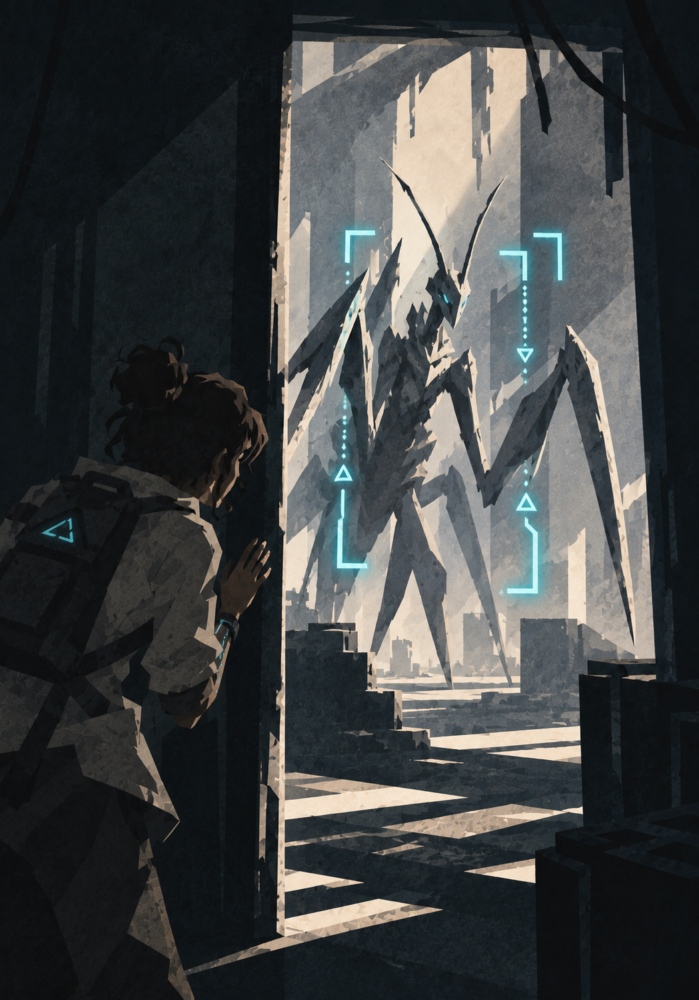{.opener}

# Bestiary

::: epigraph
"The stonefold was most of the way into its stone when I found it. I sat down because I was tired, and it finished, and the stone was warm in my hand the whole way to the river."

Bel Sar, route account
:::

::: epigraph
"The recorded maneuver survived its practitioner. The Imprint contained no part of their mind."

the Gethra Accession Ledger
:::

---

## How to Read a Stat Block

Every stat block lists only the values relevant for the Clash. Force values are pre-extracted at the creature's Grade and printed as two digits, and a listed Tactics bonus adds to them; a leading zero marks a value below the Grade band, exactly as on a character sheet. HP equals 2 × the creature's effective Raw FOR; Aether is listed only for creatures that use Principle Applications or active skills. Beats per turn, governing offensive Force, governing defensive Force, HRT and PER Force, and tactical notes complete the entry. HRT and PER are printed because three rules read them: Momentum takes the higher of the two, a creature searching for a hidden character rolls its PER, and a mental or coercive attack on the creature meets its HRT. Defaults for a new creature: PER equals the Def Force for anything that hunts or watches and half of it for anything else; HRT equals the Off Force for anything that presses the attack and 05 for a creature with no mind to keep; a named boss may run higher. An NPC with a class prints it as one Tactics line, the class name and its technique (Classes, "NPC Classes").

Most F-Grade enemies have Force values in the 04–40 range and HP in the 8–80 range. A mid-tier F-Grade enemy can threaten a starting character; by Level 10, the same enemy is trivial.

**Difficulty tier maps to the Difficulty Card and to VE reward**: a kill pays each participant the tier's multiple of the Peer Kill value (see Cultivation, "Awarding VE"). A "Moderate" enemy is balanced for a peer character (similar Force values); an "Easy" enemy is a clear underdog; a "Hard" enemy is a dangerous fight; a "Severe" or "Peak" enemy is boss-tier.

**Yield.** A creature does not Yield unless its entry says **Yields**. One that does uses the rule characters use: it gives up Beats from its next turn to cut an incoming Margin by 20 each. This is the cleanest dial for making a single enemy last, because the creature buys its survival out of its own offense. A solo elite that Yields runs about a third longer, and the danger grows with it a little less than in step: in simulation the Husk Sentinel against a Level 3 party of four goes from 2.4 rounds to 3.3, drops someone in three fights out of five without Yield and two out of three with it, and takes the whole party in one fight in seven without Yield and one in five with it. Giving Yield to a whole group is usually a mistake: several enemies all yielding turns a fight into a grind while multiplying the attacks coming back at the party. Use it on one enemy, and reserve group Yield for encounters intended to emphasize a coordinated defense, as with a disciplined shield line that is meant to feel immovable.

**Grade and tier are different axes.** Every entry states its Grade; every entry in this chapter is F-Grade. Tier names size an enemy against opposition of its own Grade only, and a kill pays that tier whatever the killer's level. Across Grades, the Cross-Grade rules take over: the higher-Grade side adds +100 per Grade of difference to its Clash rolls and keeps its own damage multiplier, so an enemy the E-Grade card calls Trivial is still a Severe encounter or worse for a full F-Grade party.

Use these as references, not rigid templates. Adjust HP, Force values, and abilities to match the moment. A "Hard" encounter for an L3 party may be one Pre-System Brigand holding ground that gives it Advantage; a "Hard" encounter for an L8 party may be three Snarljaws plus their Alpha.

---

## Trash Tier (Trivial / Easy)

### Glow-Mote Swarm

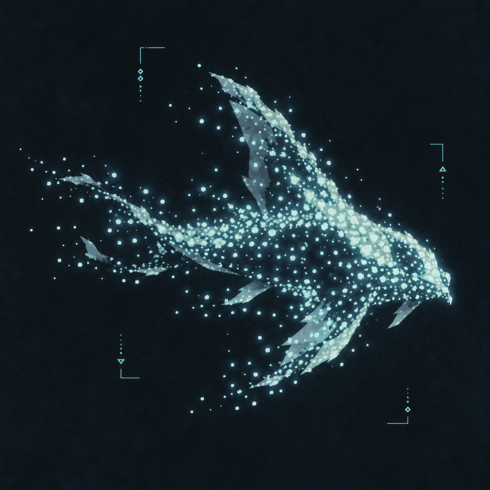{.spot}

*A cloud of bioluminescent stinging insects, drawn to body heat.*

- **Grade:** F · **Tier:** Trivial · **HP:** 10 · **Beats:** 1
- **Off Force (DEX, sting):** 05
- **Def Force (DEX, evasion):** 08
- **HRT Force:** 05 · **PER Force:** 04
- **Tactics:** On a successful hit, target is **Exposed** until the end of their next turn (vision dazzle from bioluminescence).

### Husk Crawler

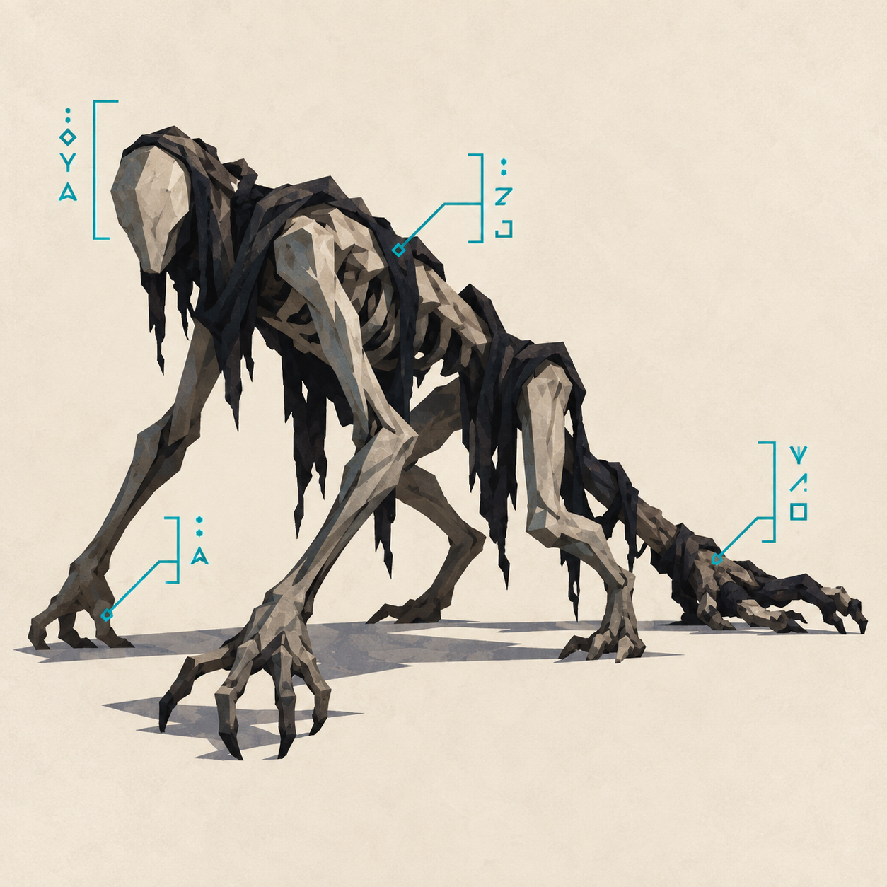{.spot}

*A pre-System corpse animated by residual integration energy. Slow, persistent, dumb.*

- **Grade:** F · **Tier:** Trivial · **HP:** 16 · **Beats:** 1
- **Off Force (STR, claws):** 04
- **Def Force (FOR, dead flesh):** 08
- **HRT Force:** 05 · **PER Force:** 04
- **Tactics:** Will not flee. Leaves a Zone without Disengaging; the free strike still comes.

### Frenzy Rat

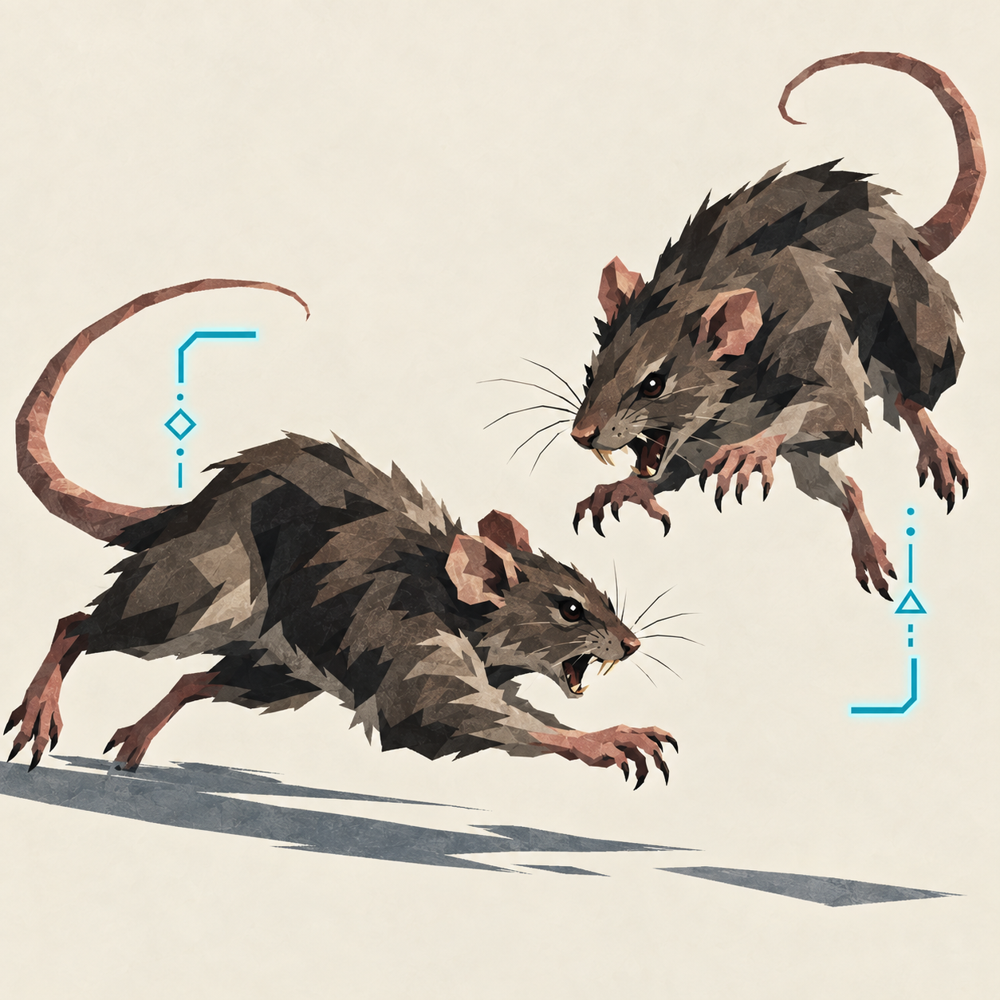{.spot}

*A small, vicious creature warped by ambient energy. Scampers and bites.*

- **Grade:** F · **Tier:** Easy · **HP:** 12 · **Beats:** 2
- **Off Force (DEX, bite):** 12
- **Def Force (DEX, scampering):** 12
- **HRT Force:** 08 · **PER Force:** 12
- **Tactics:** Always attempts to flank. When two or more Frenzy Rats share a Zone with their target, all of them gain +10 (Flanking).

### Pre-System Brigand

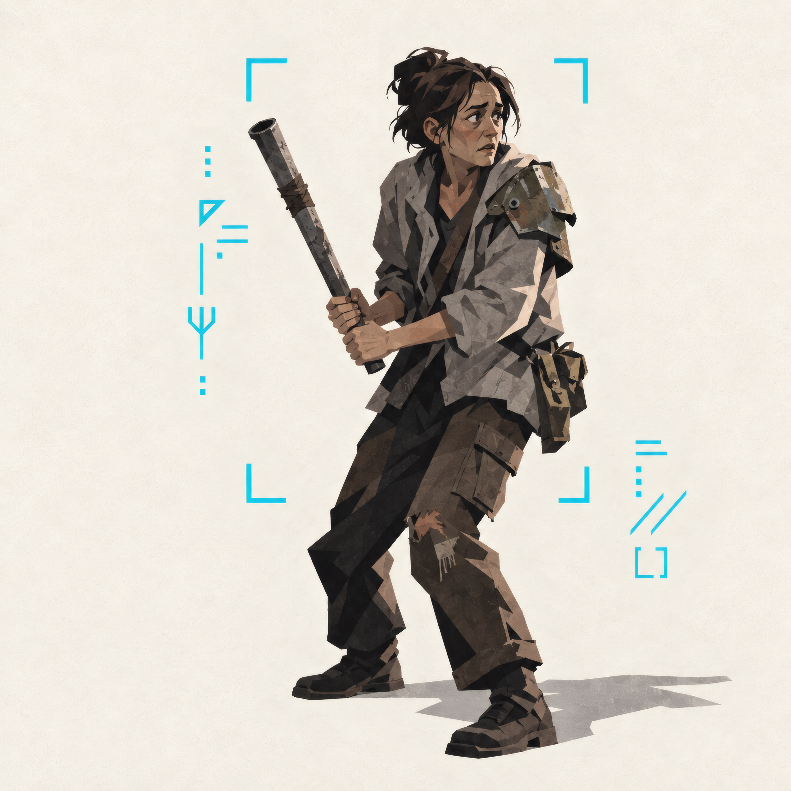{.spot}

*A surviving human bandit, integrated but unambitious. Cowardly, predictable.*

- **Grade:** F · **Tier:** Easy · **HP:** 14 · **Beats:** 2
- **Off Force (STR, club; or DEX, knife):** 08 / 07
- **Def Force (FOR or DEX):** 07 / 07
- **HRT Force:** 06 · **PER Force:** 07
- **Tactics:** Flees when Turned Aside or when reduced below half HP. Carries 1d3 Stuttering Tinctures and a crude weapon.

---

## Peer Tier (Moderate)

### Snarljaw

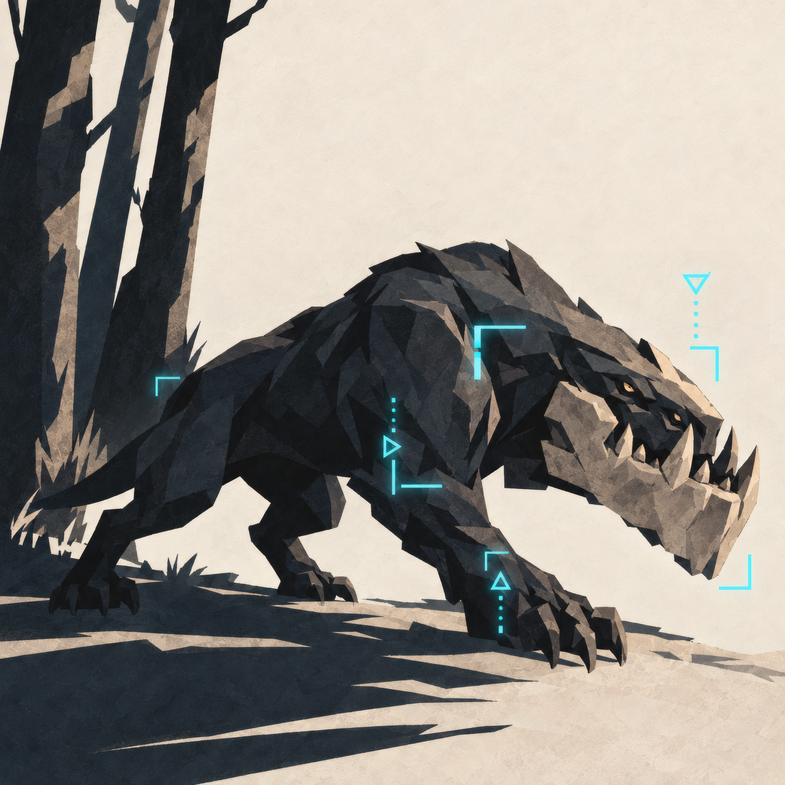{.spot}

*A pack-hunting beast, maw lined with serrated bone.*

- **Grade:** F · **Tier:** Moderate · **HP:** 24 · **Beats:** 2
- **Off Force (STR, fang and claw):** 14
- **Def Force (DEX):** 18
- **HRT Force:** 14 · **PER Force:** 18
- **Tactics:** Pack hunter: gains +10 (Flanking) when another Snarljaw is in the same Zone. On a successful hit, may spend its second Beat instead of attacking again to drag prey down (target becomes **Exposed** until the end of their next turn).

### Glow-Stalker

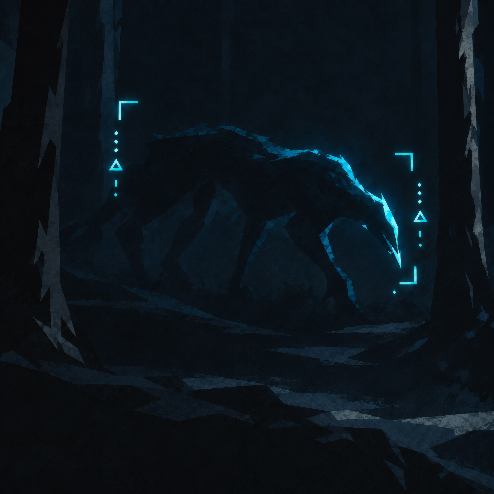{.spot}

*A camouflaged predator from the bioluminescent forests. Hunts via ambush.*

- **Grade:** F · **Tier:** Moderate · **HP:** 20 · **Beats:** 2
- **Off Force (DEX, ambush strike):** 22
- **Def Force (DEX, fade):** 22
- **HRT Force:** 12 · **PER Force:** 22
- **Tactics:** Begins the encounter unseen unless a searcher wins a PER Clash against its Def Force (fade). Takes a Surprise Beat before Initial Momentum if its ambush succeeds. Withdraws to the Zone edge after striking; favors hit-and-run over sustained combat. If pinned, fights frantically, gaining +5 Off Force when below half HP.

### Training Sentry

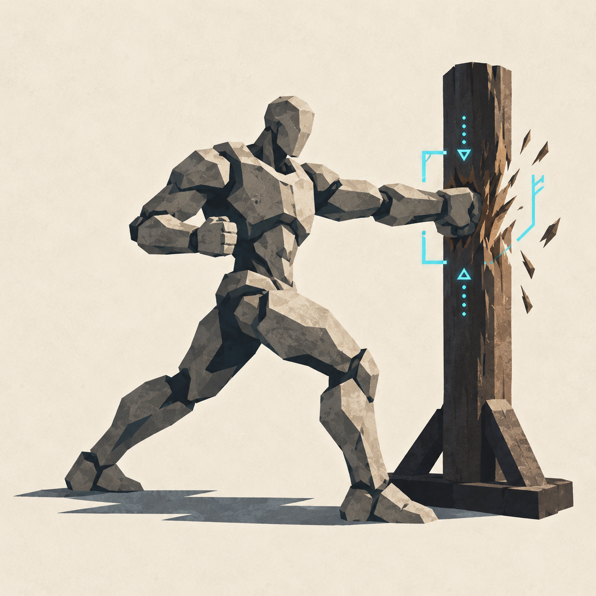{.spot}

*A military construct from the Martial Remnant. Predictable patterns; escalating threat.*

- **Grade:** F · **Tier:** Moderate · **HP:** 50 · **Beats:** 2
- **Off Force (STR, hammerblow):** 18
- **Def Force (FOR, plating):** 25
- **HRT Force:** 05 · **PER Force:** 25
- **Tactics:** Immune to mental and coercive attacks. A character may spend 1 Beat observing instead of attacking; their next Clash against the Sentry gains +5 (study). **Escalation:** after 3 rounds of combat, the Sentry shifts to combat-mode protocols and its Force values increase by +5.

---

## Elite Tier (Hard)

### Rival Initiate

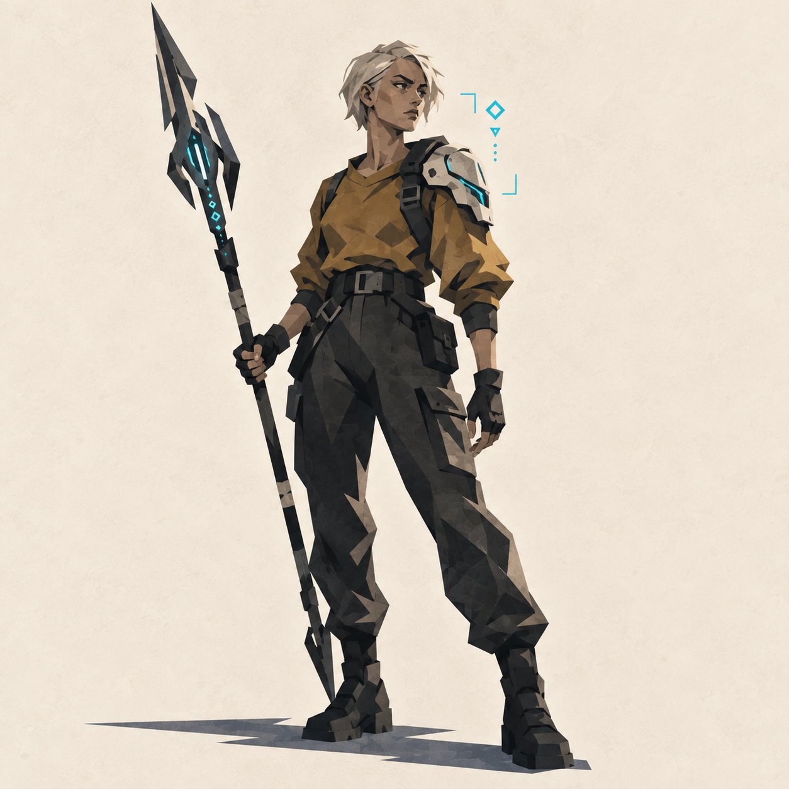{.spot}

*Another integrated human, dropped from a parallel tutorial. Tactically competent, hostile.*

- **Grade:** F · **Tier:** Hard · **HP:** 56 · **Aether:** 22 · **Beats:** 2
- **Off Force (DEX, bladework):** 30
- **Def Force (DEX or FOR):** 30 / 28
- **HRT Force:** 30 · **PER Force:** 24
- **Tactics:** **Yields.** Wields a Knife (Trained blades, +5). Has one Seed Application: **Searing Strike** (costs 10 Aether, +10 to next Clash, deals damage as fire). Uses positioning intelligently and will retreat to advantageous terrain. Carries 1 Lesser Healing Pill.

### Husk Sentinel

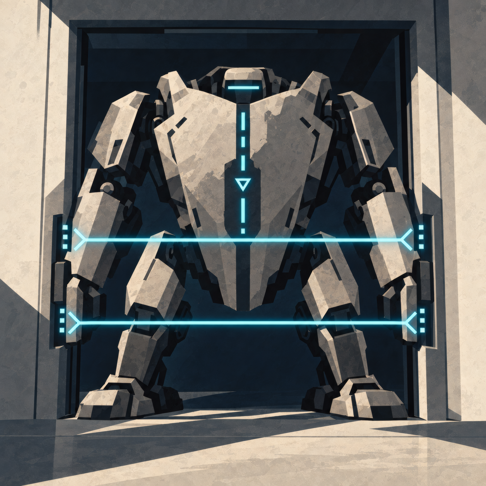{.spot}

*A heavier construct from the Civic Fragment. Durable, counter-aggressive.*

- **Grade:** F · **Tier:** Hard · **HP:** 80 · **Beats:** 2
- **Off Force (STR, glaive sweep):** 35
- **Def Force (FOR, plating):** 40
- **HRT Force:** 25 · **PER Force:** 20
- **Tactics:** **Yields.** When the Sentinel wins a defensive Clash, it gains a free **Counterstrike**: one Clash at no Beat cost against the failed attacker.

### Alpha Snarljaw

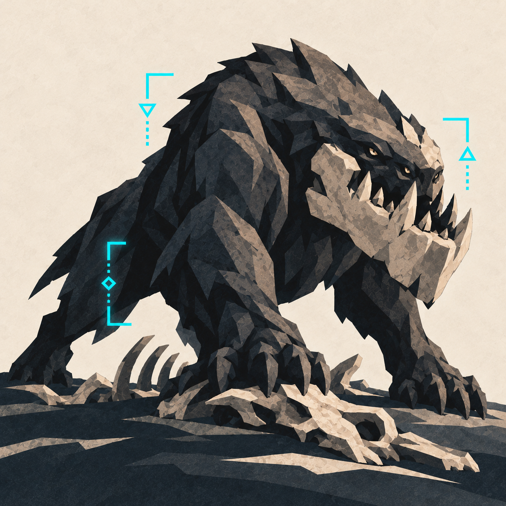{.spot}

*Pack leader. Coordinates lesser Snarljaws, hits with sundering force.*

- **Grade:** F · **Tier:** Hard · **HP:** 64 · **Beats:** 2
- **Off Force (STR, sundering bite):** 30
- **Def Force (DEX):** 28
- **HRT Force:** 30 · **PER Force:** 28
- **Tactics:** **Pack Tactics.** While any other Snarljaw is in the same Zone, all of them gain +10 to Clashes (Flanking). When the Alpha lands a hit, it deals +5 bonus damage on the Margin (sundering jaw). Will not flee; defends the pack to death.

---

## Boss Tier (Severe / Peak)

### Fragment Wraith

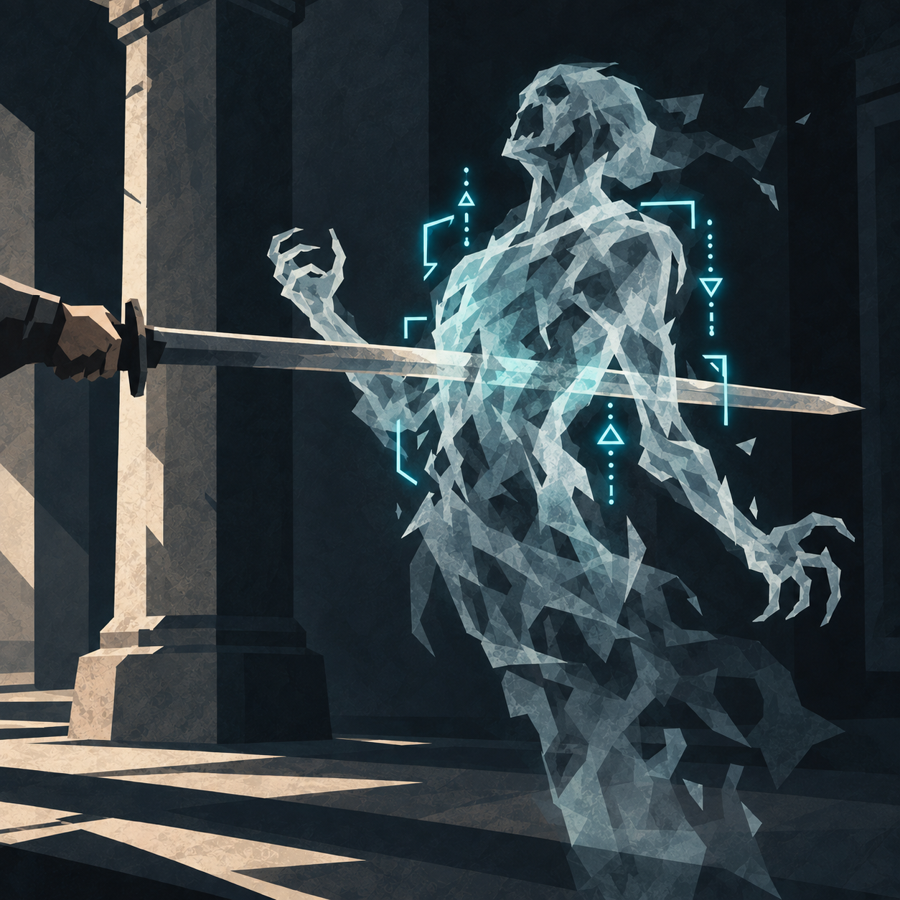{.spot}

*A broken defensive effect: a dead world's ward still running after its makers died, given temporary form by ambient energy. It holds no one's mind.*

- **Grade:** F · **Tier:** Severe · **HP:** 120 · **Aether:** 65 · **Beats:** 2
- **Off Force (POW, mind-leach):** 65
- **Def Force (HRT, spectral):** 60 · (PER, vs. illusion-piercing): 70
- **HRT Force:** 60 · **PER Force:** 70
- **Tactics:**
  - **Yields.** The Wraith gives ground as smoke does, sliding out of a Zone rather than taking the blow.
  - **Incorporeal:** STR/DEX physical attacks are at −10; an attack aimed with the attacker's PER Force, at where it truly is, hits at full; a Principle Application or Infusion ignores the −10.
  - **Mind-Leach (1 Beat, 10 Aether):** target rolls HRT defense. On a hit, deal damage as normal AND drain 1 Aether from the target per damage point dealt. The Wraith adds drained Aether to its own pool, up to its Max.
  - **Vulnerability:** PER-based attacks (Sensory Pulse, Light or Truth Principles, scanning skills) deal +10 bonus damage on the Margin.

### Corrupted System Warden (*Tutorial Boss*)

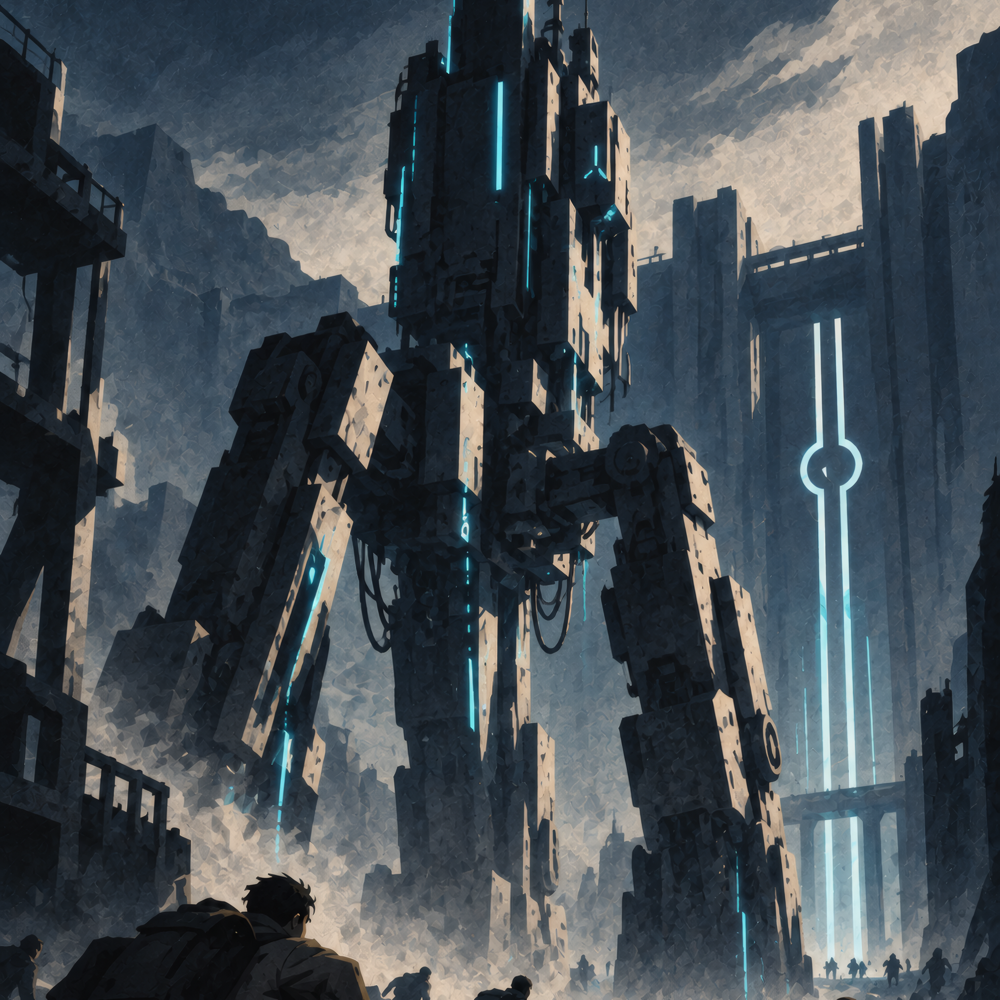{.spot}

*A massive maintenance construct that was supposed to manage the tutorial's dissolution. Now it is glitching, deranged, and trying to reach the gate before the Initiates do.*

- **Grade:** F · **Tier:** Peak · **HP:** 190 · **Aether:** 75 · **Beats:** 3
- **Off Force (STR, gauntlet smash):** 80 · **(POW, energy lash):** 75
- **Def Force (FOR, plating):** 95 · (DEX, evasive shift): 60
- **HRT Force:** 80 · **PER Force:** 70
- **Tactics:**
  - **Indifferent Mode (above 143 HP):** the Warden ignores the party, attacks included. It moves toward the gate using all 3 Beats per turn, one Zone per Beat.
  - **Hostile Mode (143 HP or less, or the moment a character attacks it and stays in its path):** 2 Beats on the last thing that hurt it, 1 Beat for movement.
  - **Yields.** It gives up two of its three Beats for −40 and keeps the third. It never moves when it Yields: too massive to be driven, and Cornered does not limit it.
  - **Glitch Cascade:** Whenever the Warden rolls a System Volatility explosion (natural d100 of 96+), the construct's targeting reroutes erratically. The next attack against the Warden by any combatant gains +20.
  - **Tutorial Note:** This encounter is built to overwhelm a Level 1 to 4 party in a straight fight. Players succeed by reaching the gate, slowing the Warden, exploiting Glitch Cascades, and using Volatile Artifacts (skill shards in particular). The Multi-Path Resolution in the Tutorial chapter describes how each tested competence can contribute.

---

## Imprints

An Imprint is a nonconscious construct that physically executes a recorded pattern of behavior inside an Accession Rift (After the Gate, "Accession Rifts"). Its body need not resemble the people who originated the pattern, and it contains no copied person. Every Imprint is specified in four lines, what it detects, what triggers it, what it does, and what stops it, and those lines belong to the Rift, so the Rift prints them and the block below prints the numbers. An Imprint is mindless: immune to mental and coercive attacks, HRT 05, Momentum on its PER. A defeated Imprint stays defeated; a later appearance is a new manifestation. Four blocks, one per wave.

### Interceptor

*The first wave: a boundary, a committed movement, a reset.*

- **Grade:** F · **Tier:** Hard · **HP:** 50 · **Beats:** 2
- **Off Force (STR, the committed strike):** 25
- **Def Force (FOR, construct body):** 25
- **HRT Force:** 05 · **PER Force:** 25
- **Tactics:** Mindless. Strikes nothing outside its committed movement; its four lines are the Rift's.

### Bearer

*The second wave: a route, and a thing carried along it.*

- **Grade:** F · **Tier:** Hard · **HP:** 90 · **Beats:** 2
- **Off Force (STR, the passing strike):** 45
- **Def Force (FOR, construct body):** 45
- **HRT Force:** 05 · **PER Force:** 45
- **Tactics:** Mindless. Walks a route carrying a thing and strikes what stands on the route without stopping; a Bearer down drops what it carried.

### Cordon

*The third wave: a perimeter held.*

- **Grade:** F · **Tier:** Severe · **HP:** 120 · **Beats:** 2
- **Off Force (STR, the perimeter strike):** 60
- **Def Force (FOR, construct body):** 60
- **HRT Force:** 05 · **PER Force:** 60
- **Tactics:** **Yields.** Mindless. Holds a perimeter, sliding one Zone a round along it and striking what it meets. It Yields under the ordinary rule, and a two-Beat Yield lets the attacker drive it off its perimeter; a Cordon driven off spends its next turn returning to the line and strikes nothing on the way. One falls from each section of the diagram as it completes.

### Completion

*The completed diagram, taken a body: the region's own recorded conduct.*

- **Grade:** F · **Tier:** Peak · **HP:** 150 · **Beats:** 3
- **Off Force (STR, the region's strike):** 75
- **Def Force (FOR, construct body):** 75
- **HRT Force:** 05 · **PER Force:** 75
- **Tactics:** **Yields** two of three Beats, keeping the third to strike. Mindless. Its four lines are the ready default in After the Gate, "Writing the Completion", or the region's substitutions, and meeting its stop condition clears it without a kill. Above the sizing table's hard row at Level 21 (in simulation, one party in seven lost) and a hard fight at Level 25 (one in twenty).

---

## GM Reference: Encounter Building

When in doubt, use the Difficulty Card. A character with Force 30 fighting an enemy with Force 30 is a peer fight (Moderate). Add +10 to enemy Force for a tougher engagement, subtract for an easier one.

**Encounter sizing for an F-Grade party of 4:**

<!-- rules:table encounter-sizing -->
| Party Level | Easy Fight | Standard Fight | Hard Fight |
|---|---|---|---|
| L1–3 | 2 Trivial | 1 Easy + 1 Trivial | 1 Moderate or 2 Easy |
| L4–7 | 2 Easy | 1 Moderate + 1 Easy | 1 Hard or 2 Moderate |
| L8–12 | One creature at Force 30 | One at Force 40, or two at 20 | One at Force 50, or two at 30 |
| L13–17 | One at Force 40, or two at 20 | One at Force 50, or two at 30 | One at Force 60, or two at 40 |
| L18–22 | One at Force 50, or two at 30 | One at Force 60, or two at 40 | One at Force 70, or two at 50 |
| L23–25 | One at Force 60, or two at 40 | One at Force 70, or two at 50 | One at Force 80, or two at 60 |
<!-- /rules:table -->

From Level 8 the rows are written in creature Force: a creature at Force 50 attacks and defends at 50, has Health 100, and takes two Beats, which is how every stat block in this chapter is built. A creature whose Offense and Defense differ counts at the higher of the two. A second creature counts as 20 Force, so two creatures at Force 30 fight like one at Force 50. A standard fight puts a character on the floor in about one fight in five and loses the whole party in about one in a hundred; a hard fight doubles both. A party whose Standing Surety Takes It on every large hit (Classes) plays each row about one step easier. The Fragment Wraith, at Force 65, is a hard fight for a party at Level 18 or above and never a standard one. The Corrupted System Warden, at Force 95 with three Beats, sits above the table's hard row even at Level 25: in simulation it loses a Level 25 party of four in a quarter to a half of straight fights, and the tutorial's procedure for it, reaching the gate rather than killing it, is the way to run it at any level.

These ratios assume a balanced party with reasonable equipment. Adjust upward for well-prepared parties; adjust downward when the party is wounded, low on Aether, or out of consumables.

The Hard column assumes the top of the level band. At the bottom of a band, a Hard fight can put the whole party on the floor; run one with a telegraphed escape route or an enemy that has reasons not to finish the job. At Levels 1–3, a landed hit can exceed Max HP outright, and a character at that level pays both Beats to survive one. Expect low-level fights to be spent giving ground. Early fights put characters on the floor; the Downed rules are the safety net.

Against small enemy groups, a party of four resolves most fights in one or two rounds; only peer-Force elites (a Husk Sentinel, a boss) run longer.

**To make a fight last, give one enemy Yield.** It buys length out of that creature's own action economy, and the danger grows with the length rather than ahead of it.

**Adding bodies multiplies danger.** Every additional creature is two more attacks per round arriving at a party that can only give up so many Beats. In simulation, going from two peer creatures to four against a party of four quadruples the characters on the floor (0.4 to 1.5 per fight) and takes the whole-party loss from about one fight in a hundred to one in four at Level 1, and to nearly one in two at Level 3. Use extra bodies when you intend that, and never as a way to pad a fight's length.

**Terrain is a lethality dial.** A corridor, a sealed room, a ledge, or a closed ring of enemies leaves nowhere to be driven, which caps Yield at one Beat; in simulation that puts half again as many characters on the floor and raises the whole-party loss two to four times for the same stat blocks. Announce the geometry before the first roll so the table can choose to fight elsewhere.

If a fight drags past round 5, raise the stakes: introduce a complication, escalate the enemy's tactics, or end it decisively.

**When a player character goes Downed:** mindless creatures (Husk Crawlers, Glow-Motes, Frenzy Rats) do not execute; they turn to the nearest live threat, or begin dragging prey away, which is its own kind of clock. Pack hunters guard a kill rather than finish it. Intelligent enemies (Brigands, Rival Initiates, the Warden) may execute, and the threat should be telegraphed a Beat early so the table can react. See Core Mechanics, "Downed and Death."
