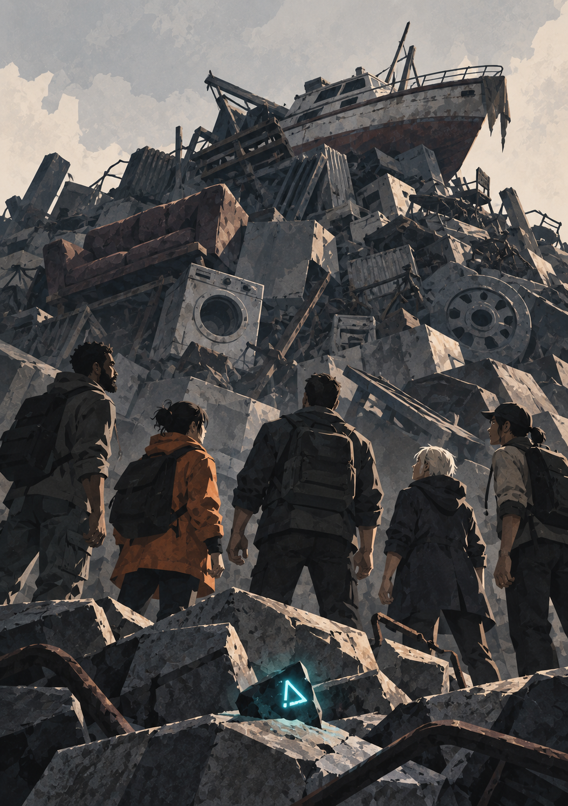
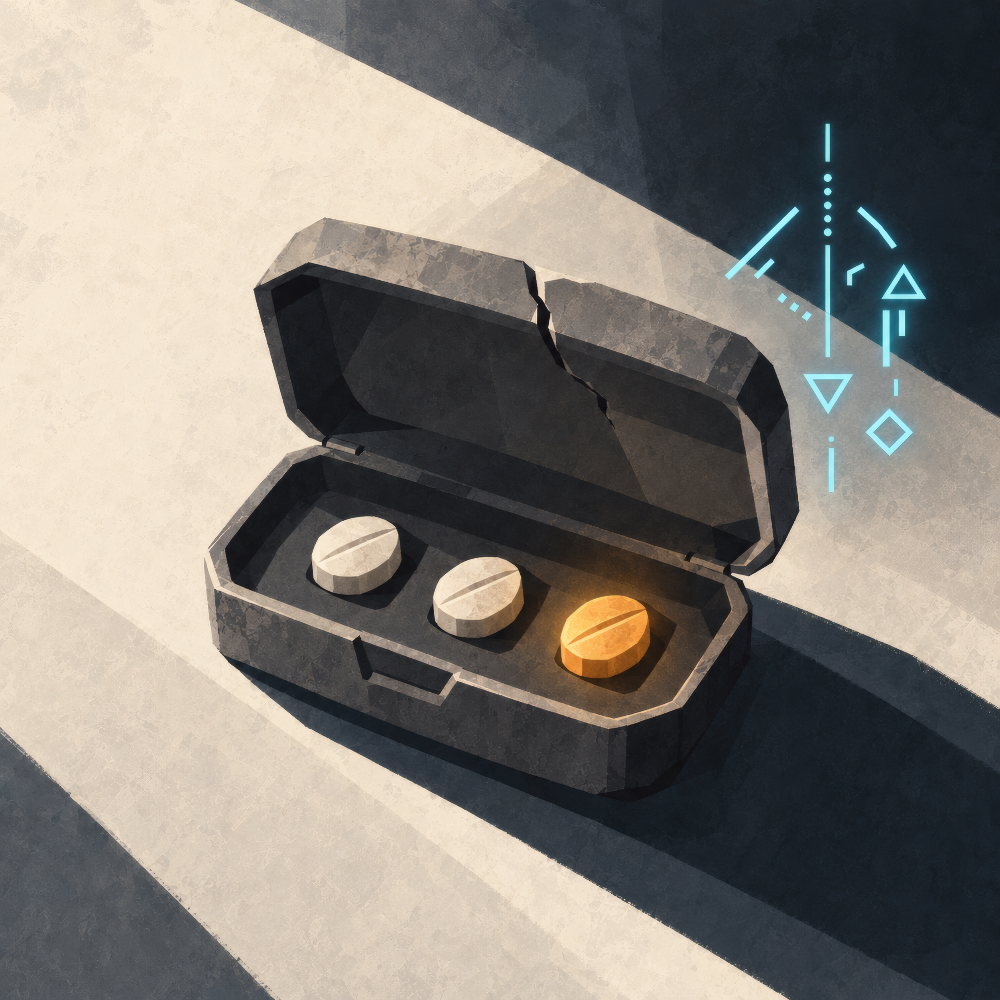
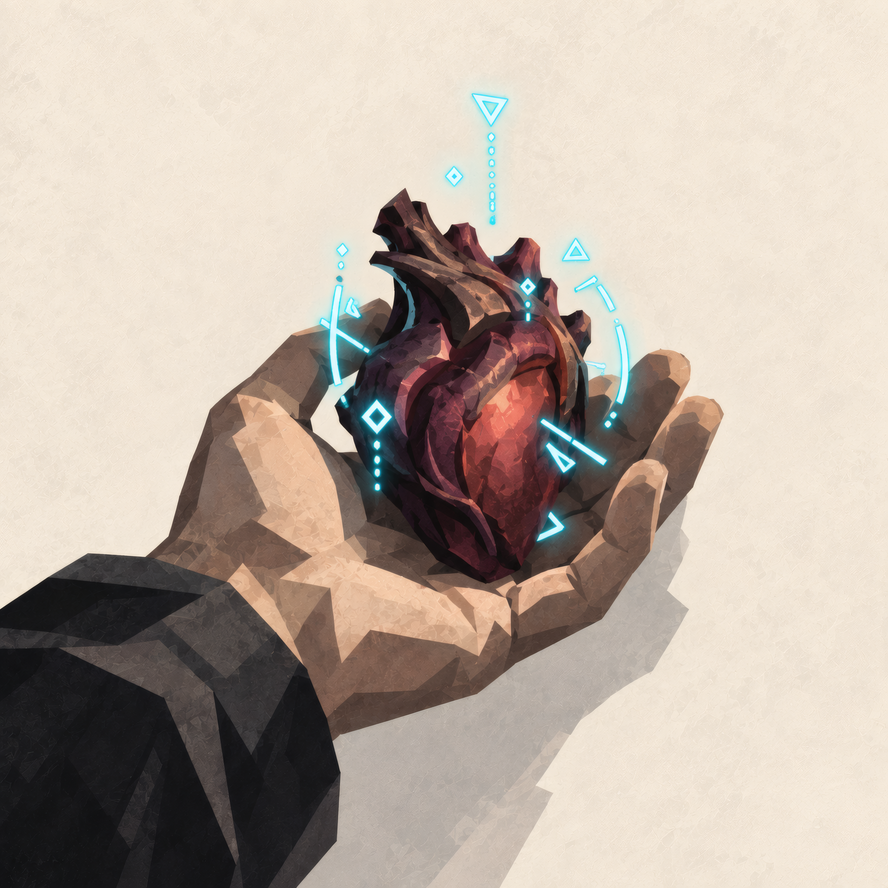
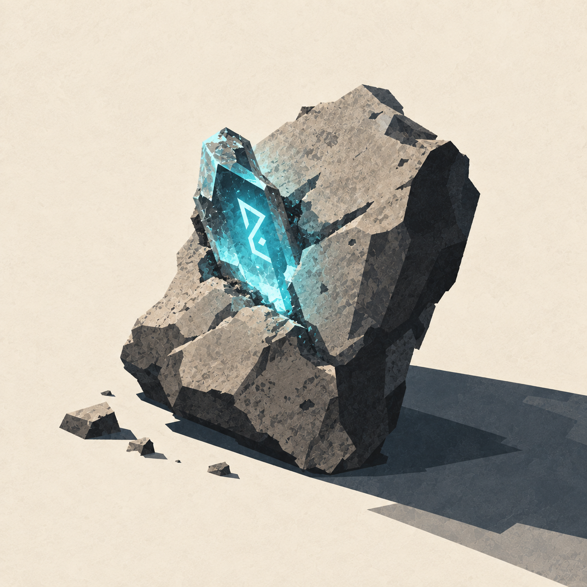
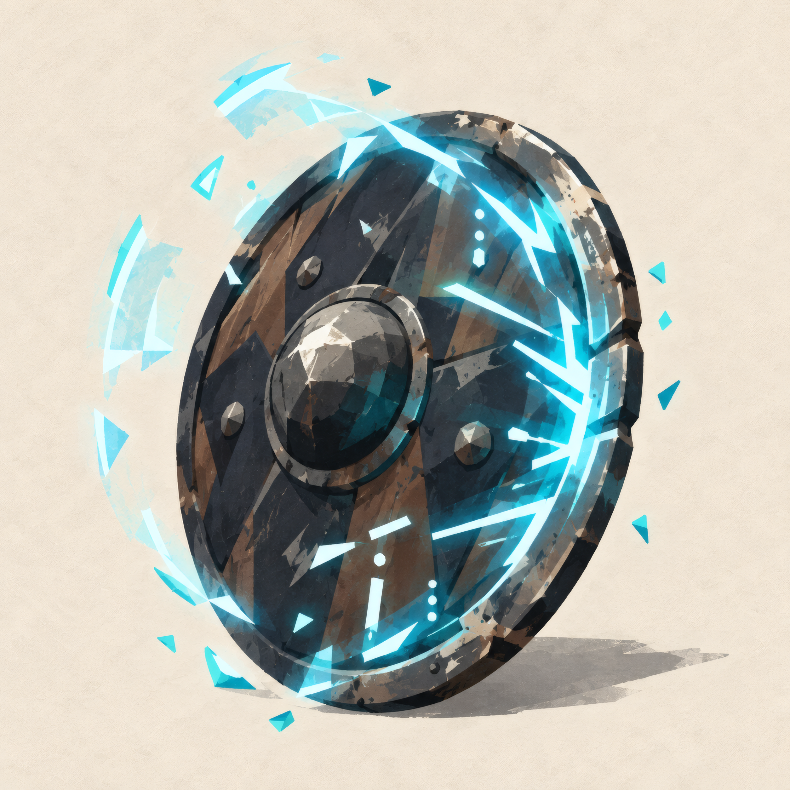
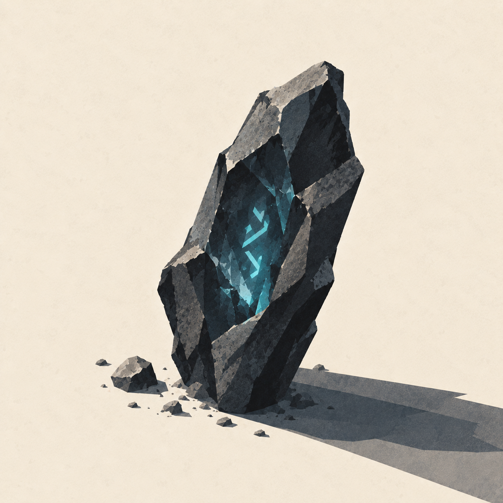

{.opener}

# Items, Consumables & Volatile Artifacts

::: epigraph
"Point blank with a twelve gauge. Barely annoyed it. Then Denise took the gun off me and hit it hard enough to fold its legs. Same gun. I'd like that on the record."

the survivors' forum
:::

::: epigraph
"The third pill did nothing. The subject took a fourth to be sure."

an Open Measure bulletin
:::

---

## How to Read This Chapter

This chapter covers the practical items players encounter during F-Grade play: consumables, weapons, Volatile Artifacts, and scavenged field gear. The full economy, crafting professions, and merchant systems are deferred.

Every entry here is one of three kinds, and each is labeled:

- **Category.** A class of items. The listed members are the common forms; the GM builds variants inside the same price band and the same rules. Healing Pills and Degraded Skill Shards are categories.
- **Example.** One fully specified item, usable exactly as written and meant as the pattern for building others of its kind. The Reactive Buckler is an example.
- **Unique.** A one-of-a-kind item. Nothing in this chapter is unique; at F-Grade, named and System-forged gear is bespoke treasure the GM designs for the moment.

---

## Consumables

### Healing Pills (Category)

{.spot}

Restore HP instantly. In combat, consuming a pill costs **1 Beat**, spent by whoever takes the action: swallow one yourself, or administer one to an ally in the same Zone. The recipient of an administered pill spends nothing.

<!-- rules:table healing-pills -->
| **Pill** | **Grade** | **HP Restored** |
|---|---|---|
| Stuttering Tincture | F | 5 |
| Lesser Healing Pill | F | 15 |
| Healing Pill | F | 30 |
| Greater Healing Pill | F | 50 |
| Pristine Recovery Pill | F | 80 |
<!-- /rules:table -->

**Pills are Grade-locked in both directions.** An E-Grade pill heals ×10 the listed amount, and only in an E-Grade body. A pill carries a concentration meant for one frame; in a body of any other Grade it does nothing but leave a metallic burn in the throat and a bad hour afterward. Hoarding higher-Grade medicine against a future Grade is sensible, and a character who Breaks Through can trade their leftover F-Grade pills to someone who still needs them.

**A healing pill cannot raise HP above Max HP;** the excess is lost.

#### Pill Limit in Combat

**The first two Healing Pills a character takes in a fight work in full. From the third on, pills have no effect on that character until they have spent ten quiet minutes out of combat.** Aether Pills follow the same rule, counted separately: two of each kind work per fight.

**Administering a pill to an ally** counts against the recipient's two, never the administrator's.

**Foundation Pills are exempt.** They are not consumed during combat.

### Aether Pills (Category)

Restore Aether mid-encounter. In combat, consuming one costs **1 Beat**.

<!-- rules:table aether-pills -->
| **Pill** | **Grade** | **Aether Restored** |
|---|---|---|
| Sparkstone Tablet | F | 10 |
| Lesser Aether Pill | F | 25 |
| Aether Pill | F | 50 |
| Greater Aether Pill | F | 80 |
<!-- /rules:table -->

Aether Pills should be rare. Aether primarily refills through Consolidation; widely available Aether Pills would collapse the scarcity the Aether system is built on.

### Foundation Pills (Category)

See the Grade Breakthroughs chapter for full rules. Brief reference:

<!-- rules:table foundation-pills -->
| **Pill** | **Grade** | **Breakthrough Bonus** |
|---|---|---|
| Dragon Marrow Pill | F | +5 |
| Nine Leaf Essence | F | +10 |
| Heavenly Foundation Pill | F | +15 |
<!-- /rules:table -->

Foundation Pills are consumed during Stage 1 of a Breakthrough (Preparation). Only one Foundation Pill effect applies per Breakthrough; the body cannot metabolize multiple at once.

### Attribute Treasures (Category)

{.spot}

Concentrated pieces of something that was strong: the heart of a beast that should not have been able to move that fast, sap from a tree that grew up through stone, marrow from a thing that kept standing. Absorbing one raises a single Attribute's Raw value permanently, and the character chooses which.

<!-- rules:table treasures -->
| **Treasure** | **Grade** | **Raw Points** |
|---|---|---|
| Lesser | F | +2 |
| Standard | F | +5 |
| Greater | F | +10 |
<!-- /rules:table -->

Values scale ×10 per Grade.

**Absorbing an Attribute Treasure takes one hour, during which the character is as defenseless as during a Consolidation:** no Beats, no defense, aware of very little. Heat under the breastbone, the taste of the thing they ate, and a long stretch where standing up seems like somebody else's idea.

The obvious time to do this is during a rest the party was taking anyway, where the hour costs nothing at all. Absorbing one in an unsecured area requires allies to guard the character.

**Grade-locked in both directions,** on the same logic as pills. A treasure carries a concentration meant for a particular frame, so an F-Grade treasure does nothing for an E-Grade body, and an E-Grade treasure does nothing for an F-Grade one except leave a taste like hot metal. Sell it, trade it, or keep it until you have grown into it.

**Excess above the Grade cap is lost.** A treasure that would push an Attribute past 99 at F-Grade raises it to 99 and stops. No other limit applies: a character can put every treasure they find into one Attribute, up to the Grade cap.

**How often.** A character who hunts hard and explores thoroughly might absorb three or four across an entire Grade; a cautious one might find a single Lesser treasure. They are the reward for going somewhere dangerous on purpose, and they should never be for sale in a starting settlement.

**These are not Cores.** A Core or Affinity Crystal releases Volatile Energy, which is fuel for levels (see Cultivation). An Attribute Treasure never touches stored VE at all; it changes the body directly.

## Weapons (F-Grade Reference)

Weapons do not deal flat damage, and an ordinary weapon carries no bonus of its own (a System-forged one may). A weapon determines which Force governs an attack and what the implement makes possible, such as reach or range. The bonus to the Clash comes from the wielder's Proficiency: **+5 at Trained, +10 at Seasoned or Master; an untrained wielder adds nothing.**

The wielder's Force and the Margin decide the damage, which is why the tables here carry no damage dice and no high-damage weapon class: a greatsword in weak hands is a slow club, and a knife guided by Force 60 is deadlier than either.

<!-- rules:table weapons -->
| **Weapon** | **Governing Force** | **Proficiency** | **Notes** |
|---|---|---|---|
| Improvised object | STR | none | A chair, a rock, a fire extinguisher. Nothing shaped like a weapon. |
| Club / Pipe / Crowbar | STR | axes and hammers | Scavenged weight on a handle. |
| Knife / Dagger | DEX | blades | Quick, concealable. Throwable as one-shot ranged. |
| Greatsword | STR | blades | Heavy, two-handed. Requires STR Force 05; below that, every Clash with it takes −10 (hindering). |
| Battle Axe / Maul | STR | axes and hammers | Heavy, two-handed. Requires STR Force 05; below that, every Clash with it takes −10 (hindering). |
| Spear | DEX | spears and staves | Two-handed. Reach: free Disengage from one Zone-edge enemy per turn. |
| Quarterstaff | STR or DEX | spears and staves | Two-handed. Versatile: choose Force at attack time. |
| Short Bow | DEX | archery and throwing | Two-handed. Ranged: target enemies in adjacent Zones. |
| Crossbow (single-shot) | DEX | archery and throwing | Two-handed. Requires 1 Beat to reload between shots. |
| Hand Axe (thrown) | STR | archery and throwing | Ranged: one Zone. Recoverable. |
| Pistol / Rifle / Shotgun | DEX | firearms | Ranged: target enemies in adjacent Zones. Holds 1d10 cartridges when found; empty, it is an improvised object. Nothing in this book makes ammunition. |
<!-- /rules:table -->

These are the starting and recovery tier. Higher-quality weapons (named, System-forged, Principle-attuned) are bespoke items the GM designs as treasure or quest rewards.

**Anything you let go of is archery and throwing.** A hand axe swung is axes and hammers; the same axe thrown is archery and throwing. A character can be Master with one and untrained in the other.

**Wielding without a Proficiency:** any character may wield any weapon. A Seasoned soldier with a greatsword adds +10; a librarian swinging the same blade adds +0, and so does an axe Master who has never trained with swords.

**Temper.** An Integrated body resists the energy a weapon carries on its own: muzzle energy, mass, an edge, a fall. Damage comes from the wielder's Clash, so a point-blank shotgun does Margin damage like every other weapon. Temper grows with the body, ×10 per Grade, and the Cross-Grade Adjustment (Core Mechanics, "Fighting Across a Grade") is where a higher-Grade body's Temper appears on the table. Artillery, vehicle weapons, and explosives have no weapon shape the System recognizes: they are improvised objects and deal Margin damage like one; a thrown one uses DEX and the archery and throwing domain and nothing else.

**Firearms** are a weapon shape like any other, and cartridges are the one part of a gun that runs out: a found firearm holds 1d10 cartridges, ammunition exists wherever Earth left it, and nothing in this book makes more. Arrows are made and recovered.

---

## Volatile Artifacts

{.spot}

<!-- worldbuilding pass: opening story slot (related-thread survivor) -->

Volatile Artifacts are scavenged debris from dead worlds, half-functioning constructs, and degraded shards of higher-tier equipment. They are thick on the ground in the Integration Tutorial, which is where most tables meet them first. They are unreliable, and most are single-use: each gives a character one extra action (the Reactive Buckler recharges at Consolidation, and the Resonance Glass is reusable). Which artifacts a character hoards, spends, or hands away is worth remembering at the Session-End Sweep.

### Degraded Skill Shards (Category)

Crystalline matrices containing fragments of dead techniques. Single-use. Activate as a 1-Beat action: the user describes intent, and the GM rolls **1d100** for backfire.

<!-- rules:table shards -->
| **Shard Type** | **Effect** | **Backfire (on natural 01–05)** |
|---|---|---|
| Edge Shard | Next Clash this turn gains +20. | Shard cracks: user takes 5 damage. |
| Pulse Shard | Restore 30 Aether. | Aether backlash: user takes 10 damage. |
| Veil Shard | Become invisible until end of next turn or until you act offensively. | Veil flickers: you remain visible but appear blurred (+5 to defense, no concealment). |
| Anchor Shard | Until end of next turn, you cannot be moved by any effect (moving yourself is fine), and your Defense Force gains +10. A two-Beat Yield still cuts the Margin, and the attacker cannot drive you into another Zone. | You become **Rooted** for the rest of the encounter: unable to be moved, and unable to move under your own power. |
| Resonance Shard | Add 1 IP toward a Principle family of your choice. | The IP is lost. |
| Volatile Shard | Roll d100 again. The GM, or the System AI in assisted modes, invents an effect scaled to that roll: 01–40 a nuisance to everyone in the Zone, 41–95 an effect the size of another shard's, 96–100 an effect worth +20. | The effect lands on the user; the GM may substitute something worse. |
<!-- /rules:table -->

Each shard use has a 5% backfire chance. New shard types price their effects against the Modifier Budget and keep the natural 01–05 backfire, the same range that governs Catastrophic Failure.

### The Reactive Buckler (Example: Protective One-Shots)

{.spot}

A small shield that absorbs one impact before its protective field collapses. The pattern for defensive artifacts generally: one negation, a visible discharge, a recharge tied to Consolidation, and stated limits.

- **Effect:** Once between Consolidations, when the wielder would take damage from a physical Clash, reduce that damage to 0 **without giving up any Beats**. The buckler's field discharges visibly and resets at the next Consolidation.
- **Limitations:** Does not protect against mental, spiritual, or illusion-based attacks. Does not work against attacks the wielder did not see coming (Surprise Beat hits, ambushes from Hidden enemies). Does not move the wielder, so it is no help against being Driven Back.

Yielding alongside it is wasted; the damage is already zero.

### Single-Use Ranged Relic (Example: Expended Weapons)

A devastating weapon with one charge, the pattern for burnt-out relics of higher-Grade arsenals.

- **Effect:** A ranged Clash using DEX or POW Force (user's choice) at +20 to the roll. On hit, deals damage as normal but treats the user's Grade as **one Grade higher** for the damage Multiplier (an F-Grade user deals E-Grade damage on this hit only: Margin × 10 instead of × 1).
- **Disposable:** After use, the relic burns out and crumbles. Cannot be repaired.

### Sensory Tools (Category)

Artifacts that reveal hidden things.

- **Resonance Glass:** Spend 1 Beat. Reveals hidden energy signatures within your current Zone: concealed runes, dormant constructs, Principle resonance points. Does not reveal hidden creatures unless they have an active energy signature (cultivators using skills, magical creatures, etc.). Reusable.
- **Truthbinder Cuff:** Forces a single yes/no answer from one detained, non-hostile target. Single use; the cuff dissolves after activation. One Beat, no roll; it works on targets of the user's Grade or lower.
- **Generic single-use variants** exist throughout scavenge zones: spend 1 Beat, reveal one hidden feature within your Zone, then the tool is spent.

---

## Scavenged Field Gear (Examples)

Mundane survival equipment, battered but functional. The pattern: small flat effects, limited uses, no Aether interaction.

- **Battered Medkit:** Heals 10 HP when used as a 1-Beat action on yourself or an ally in the same Zone. Does not count toward the pill limit. Three uses before the supplies are exhausted.
- **Low-Grade Armor Scraps:** Heavy. Grants +5 Defense Force when defending with FOR; imposes −5 to DEX-based Clashes (offensive or defensive). One set per character.
- **Shield:** A riot shield, a car door, a bolted-together plate. Grants +5 to your Clash when defending. Occupies a hand, so it cannot be carried alongside a two-handed weapon. There is no shield Proficiency; the bonus applies whatever the wielder is trained in.
- **Battered Communicator:** Allows short-range communication between paired devices. On a natural 01–05 when used, it fails for the scene.

---

## Item Acquisition

At F-Grade, items appear:

- As **loot drops** from defeated enemies: the GM, or the System AI in assisted modes, rolls once per creature on the loot table (The System AI, "Loot").
- In **dungeon caches**, treasure rooms, and abandoned stockpiles.
- As **scavenge** in ruins and Volatile Artifact zones.
- Through **trade with NPCs** in settlements.

Players should not be flush with consumables.

If items go unused, check whether players understand their effects and expect opportunities to replace them before changing the drop rate. If the party is constantly out and dying for want of a Lesser Healing Pill, the GM is being too stingy. Calibrate to encounter density.

---

## Outfitting the Tutorial (GM Reference)

{.spot}

The Integration Tutorial draws its economy from this chapter. What the tutorial expects:

- **Phases 2 and 3 are the scavenge phases.** Starting weapons, armor, and consumables all come from landing-zone debris and the Recycling Node; the default loot list lives in the tutorial's Phase 3.
- **The Recycling Node holds less than the party needs:** one spear, one armor set, one buckler, four shards, one pill, one Resonance Glass for a full party. How the party divides it is worth remembering at the Session-End Sweep.
- **One Resonance Shard sits in that pile, and it is a choice between equipment now and Principle progress later.** The Resonance Shard is 1 IP toward a Principle the character cannot yet name. The System states it in its own units: *Resonance Shard. Insight: +1 on meditation. Principle: undetermined.* Tell the players what the shard does; only the Principle it feeds stays hidden.
- **One Attribute Treasure** sits in the Wild Fragment's predator den, inside one of the young; taking it means killing that one (The Tutorial, "Sector B: The Wild Fragment"). It is the only one in the tutorial.
- **The Battered Communicator** bridges the dead command terminal in the tutorial's Civic Fragment (Phase 4); seed one in Phase 2 or 3 scavenge.
- **The Single-Use Ranged Relic** is common on the tutorial's scavenger slopes and is one of the sanctioned answers to the Phase 5 boss; place at least one where exploration finds it.
- **Volatile Artifacts are core to the tutorial's economy**: they give starting characters additional actions before classes and Principles provide more abilities. Be generous with shards, stingy with pills.
- **Items fill three roles for a classless character,** and the tutorial leans on all three: shards and one-shots are **single-use actions**, weapons and armor are **equipment** (a weapon decides which Force governs and which Proficiency earns the Mark; armor's modifiers are listed on it), and Resonance Shards and affinity treasures are **Principle progress** (IP earned before the Principle forms).

---

## Future Expansion

This chapter covers F-Grade items only. Deferred for later development:

- **Crafted equipment and named weapons.** Once the Professions system is designed, players can craft, refine, and name their own gear.
- **Principle-attuned items.** Weapons and tools that resonate with specific Principles and grant attunement bonuses.
- **Set bonuses and equipment synergies.** Multi-piece kits with cumulative effects.
- **E-Grade and higher item tiers.** When the campaign scales, the same categories scale ×10 per Grade.
- **Bespoke artifacts.** Story-tier items with unique mechanical and narrative weight, designed by the GM, or drafted with the System AI in assisted modes.
