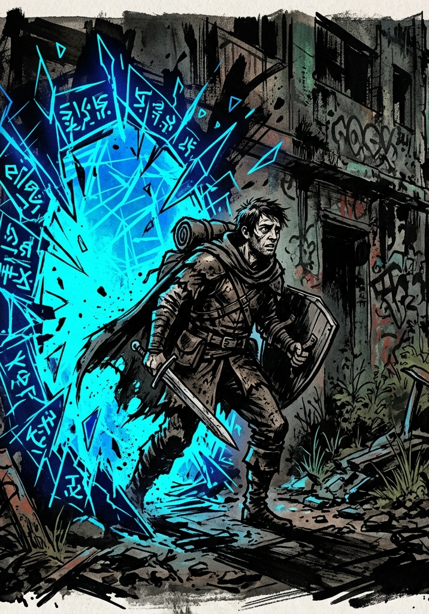

# The Tutorial: Integration Protocol

**Three kinds of box appear in this chapter.** A box marked **READ ALOUD** is narration to say to the players as written, or close to it. A dark **System** box is the System speaking, and it can be read aloud or handed over as text. A **quest card** is what a player sees in their own interface. Everything outside a box is for you.

---

## The Tutorial at a Glance

The tutorial has six phases and usually takes two sessions. All of it happens in one valley.

| **Phase** | **Where** | **What the party wants** | **What ends it** |
|---|---|---|---|
| 1: The Threshold | The void between worlds | Nothing yet. They do not know anything has happened. | The void breaks and they fall. |
| 2: The Violent Arrival | Scattered across the valley, alone | To survive the first ten minutes, and to find another person | Their first fight is over and they start downhill. |
| 3: The Recycling Node | The pile at the bottom of the valley | To find each other, then to get what is in the pile | The party camps and refines its stored VE. |
| 4: The Field of Ruins | Two of four sectors | To survey a sector, and to take what is in it | The Consolidation after the second sector. |
| 5: The Convergence Crisis | The causeway to the gate | To reach the gate before the Purge does | Everyone who can reach the gate is through, or the sector closes. |
| 6: First Recognition | Beyond the tutorial gate | To learn what the System recognized in what they did | The Stinger. |

**Phases 1 and 2 run one-on-one.** Nobody has met anybody yet. From Phase 3 onward the group plays together.

### Session Length and Breaks

**Two sessions of three and a half to four hours** is the default. Session 1 runs Phases 1 through 3, plus the party's first sector in Phase 4 if there is energy left. Session 2 runs the rest.

**Four sessions of two hours** covers the same content for a group with shorter sessions. The first three sessions end at a camp; the fourth ends with the Stinger.

| **Session** | **Covers** | **Ends at** |
|---|---|---|
| 1 | Phases 1–3 | The first Consolidation, in camp |
| 2 | Phase 4, first sector | The camp between the sectors |
| 3 | Phase 4, second sector | The Consolidation that closes the Ruins |
| 4 | Phases 5–6 | The Stinger |

**Extending the tutorial.** Phase 4 is the part that can grow: add a third or fourth sector and another session. Keep the other phases at the lengths given.

### What to Track

Players track two counters on their sheets from the first session. You keep a third record privately.

| **Record** | **Ticks when** | **Result** |
|---|---|---|
| **IP** (Insight Points) | The character earns insight under pressure | At 3 IP the first Principle crystallizes (The Principle System) |
| **Marks** | A natural d100 at or above the Volatility Threshold on a Clash or skill check, in a Proficiency's domain | At 3 Marks Trained becomes Seasoned. At 3 Marks in a domain the character never trained, the System grants it at Trained |
| **The HVE sheet** | At each session's end, from what you remember (The Hidden Vector Engine, "The Session-End Sweep") | Feeds the System's summary of each character in Phase 6 |

Players track their own IP and Marks. Keep the HVE sheet private.

---

## The Valley


The whole tutorial happens in one place: a valley about a mile across, assembled out of salvage. The characters land on the slopes of the rim. The Recycling Node sits at the bottom, where everything rolls. The broken transit nexus stands beside it at the valley's true center, ringed by the bright ground. The four sectors of Phase 4 sit at the compass points: the Martial Remnant north past the rain line, the Wild Fragment east, the Arcane Debris west, the Civic Fragment south. The wall of light stands past the far rim, visible from everywhere, and it does not move until Phase 5.

### What Has Taken Place

This background is for you. Players piece it together over three days from the clues in the scenes, and you never have to confirm their conclusions.

- The valley is a System tutorial sector, built from the wreckage of dead worlds, and it is old. It has processed cohorts of Initiates for longer than the System's own records reach, and it is already scheduled for dissolution. The wall of light is the front edge of that dissolution, holding position until the schedule says otherwise.
- The **Corrupted System Warden** was built to manage the dissolution and has malfunctioned. It wants to leave through the gate itself. It heads for the gate and destroys whatever is in its path, and it hunts nobody: it is a catastrophe with a direction (Phase 5).
- A band of three to five **non-human Initiates** entered nineteen days ago through a different threshold. They lived in the Civic Fragment until its Husk Sentinel reclassified them as intruders and drove them out; now they move camp daily and stay off open ground. Their **scout** watches the landing slopes from cover and keeps two tallies: the day-count on the Civic Fragment wall, and a count on the slopes of every living thing they have seen fall from the sky. Under the slope tally, an arrow marks the scout's own path down toward the treeline, cut for whoever came next (Phase 2, The Tally; Phase 4, The Arriving Initiates).
- The party's cohort fell this morning: the player characters and a handful of other humans. Most of the others do not survive their first hour. The survivors head for the Recycling Node because it is the lowest, most visible point in the valley and every path of wreckage runs to it; the System's first quest (Q-001, Phase 3) rewards them for finding each other once they arrive.
- Everything alive in the valley is salvage too. The creatures came in with the wreckage, and the constructs are still running jobs for a sector that no longer needs them done.

### Recurring NPCs

These NPCs come back if the party lets them. Keep one line per NPC: their condition, and how the party treated them.

| **Who** | **First met** | **If the party helped them** | **Without the party's help** |
|---|---|---|---|
| **Ray Okafor**, a concussed delivery driver with a nail gun | Phase 2: The Other Survivor, or circling in view of The High Ground | Reaches the Node by dusk, keeps the fire, and joins the gate queue in Phase 5 | Dies during the first night. The party can find his nail gun in Phase 4 |
| **The alien Initiates** and their scout | Phase 4: The Arriving Initiates, though their marks are met earlier | Fight beside the party in Phase 5 and name the Warden's weak point | The party enters Phase 5 without their warning and without allies |
| **The Node strangers**: Marco, Dele, and Wren | Phase 3, at the Node | Part of the camp, and part of the gate queue in Phase 5 | They fend for themselves. They are not in the gate queue, and the tutorial does not say whether any of them found another way out; decide if it ever matters |

The Warden appears in Phase 5. The party cannot defeat it. They can predict its route, slow it, and outlast it long enough to escape.

### What Will Happen

Use this as the default sequence. Adjust events to what the party does, and choose when the dissolution starts using the pacing note below.

- **Day 1.** The cohort falls. First fights on the slopes. Survivors converge on the Node by evening and camp there. Ray dies in the night if nobody helped him; the woman on the drop (The High Ground) is gone if nobody reached her. The other survivors are on their own.
- **Days 2 and 3.** The party surveys sectors. The alien Initiates find them wherever they are, on the second day by default. The valley starts shedding detail at the edges, small things first: the rain line stutters, sounds arrive a half-second late.
- **The last hour.** The System announces the Mandate. The wall of light begins advancing across the valley. The Warden stands up and makes for the gate through whatever is in the way, and the gate processes Initiates one at a time until the sector closes.

**When the dissolution starts is your call.** By default it begins once the party has surveyed two sectors and camped between them, so that they meet the wall rested and leveled. Start it earlier if the table is coasting; hold it through a third sector if the table wants more of the ruins. Once the Mandate is announced, its timer is fixed (Phase 5).

---

## Pre-Tutorial Setup

Before the first session, each player has built a character per the Character Creation chapter:

- 40-point buy across the seven Attributes (floor 3, cap 10).
- Three Proficiencies at Trained, written in plain language.
- No Principle access: Insight is earned in play, nothing is selected at creation (see "Starting Principle Access" in Character Creation).
- Derived stats calculated: Max HP = Raw FOR × 2, Max Aether = Raw POW, VE Tolerance 80, Level 1, Grade F.

Players begin with **whatever was on their person at the moment of Integration**: phone, keys, backpack, work clothes. The System provides nothing. Every weapon, pill, and shard in the tutorial is scavenged.

**GM preparation checklist:**

- [ ] Print or digitize the Grade Reference Card (the Quick Reference).
- [ ] Pull stat blocks from the Bestiary: Glow-Mote Swarm, Husk Crawler, Frenzy Rat, Pre-System Brigand, Snarljaw, Alpha Snarljaw, Glow-Stalker, Training Sentry, Husk Sentinel, Fragment Wraith, Corrupted System Warden.
- [ ] Cut out the probe cards (Table Kit) and pick which player gets which.
- [ ] Cut out the Personal Opportunity cards (Table Kit), one per player, and have the Battle Memory and Title cards in reach. Hand cards over during play; never read them aloud.
- [ ] Set up the Quest UI: a shared digital quest log (Discord pinned, Google Doc, VTT module). Each player has a private channel.
- [ ] Read the Titles and System Quests chapters once through. Be ready to issue the first Mandate in Phase 5 and the first Achievement Titles in Phase 6.
- [ ] Check that every character sheet has room for a **Marks** tally and an **IP** count. Both start at zero and both should be visible to the player from the first session.
- [ ] Read the Hidden Vector Engine chapter's session-end procedure. Nothing is logged during play; you tally at the end of each session, from what you remember.

---

## Mechanics Introduction Schedule

| **Phase** | **What the Tutorial Teaches Here** |
|---|---|
| 1: The Threshold | The System's voice. The probe. |
| 2: The Violent Arrival | The Clash. Force. Beats. Zones. **Surge. Yield.** First kill. First VE. First scavenged gear. |
| 3: The Recycling Node | System status notifications. The Quest UI. The Party. Scarcity. The shard economy. **Consolidation.** |
| 4: The Field of Ruins | **Volatility, Exceptional Success, and Marks.** **Driven Back.** Aura Pressure. Saturation. **Leveling. Stat allocation.** Routine Mastery. Shards in use. Personal Opportunities. The first Battle Memory. |
| 5: The Convergence Crisis | The first Mandate. **Cornered.** Boss-tier combat. Sacrifice as a defining choice. |
| 6: First Recognition | Titles. Affinity Notices. Hidden Quest reveals. The Stinger. |

Teach each system when the schedule brings it up. When a player asks "how does combat work," a good first answer is *"roll d100, add your Force, I'll tell you what happens"*; detail can wait until the table wants it. If confusion is costing fun, stop and explain.

**These mechanics can arrive before their scheduled introduction.** A natural 96 can explode in the first Clash of Phase 2, and an attacker who wins by 40 or more has Driven Back whenever it happens. When one arrives early, apply it, name it, and explain it briefly; skip its planned introduction later.

---

## Phase 1: The Threshold

**The Situation.** The characters have never met, have no goal, and do not yet know that anything has happened to them. They are pulled out of Earth and meet the System. Each one answers a private probe whose purpose is not explained to them. The phase ends when the void breaks and they fall.

**Pacing.** Two or three minutes per player. Keep it short so the characters stay disoriented; a player who needs a moment to answer gets the moment.

**Run this one-on-one.** Run each character's scene privately if you can, in another room or by direct message. Separate scenes establish that the characters arrive alone.

### Read Aloud: The Void

::: readaloud
Between one moment and the next, the world goes.

No flash, and no sound of anything breaking. The ground is gone from under you, and then the direction the ground used to be is gone too. You reach out. There is no arm to reach with, and something reaches anyway.

You cannot feel your body. You can still think, and when you try to move, something answers.

Far off, in a direction you have no name for, there are others. Thousands of them, more, felt the way a crowd is felt in a dark stadium.

Then something notices you. All of it at once, the way the ocean would notice a swimmer.
:::

::: systemvoice
*Consciousness anchored.*

*Native world: Earth. Status: Integrated.*

*Population: 7,916,442,203. Integration stability: provisional.*

*Tutorial: provisioned.*

*Prior exemptions: expired. Observation: begun.*
:::

The System does not answer questions.

### What Happens

#### The Probe

Before the void breaks, each player gets one private prompt. Hand it over as a card, a note, or a message; never read one aloud to the group. There is no prescribed response. What the character does in the void changes how they land in the valley: each probe below lists its **Echo**, the outcome that follows the character down. Pick each player's probe to set up the encounter you plan to give them, or to cut against it. What they did is also one piece of evidence for the System's summary in Phase 6.

1. *Somewhere below you something is repeating. Three sounds, the same three, over and over, and the third one is your name said wrong.*

    **Echo:** the sounds are real, and they are still there when the character lands: the footsteps of the creature they will fight after landing (The Arrival, in Phase 2). A character who went toward them lands facing it and sees it first. A character who held still and worked out the pattern lands knowing its rhythm, and knows the moment the rhythm changes.

2. *You are holding something. You cannot see your hands, but you can feel it: small, warm, and moving.*

    **Echo:** a character who held on lands with it in their fist: a smooth stone, warm through, with something still arranging itself inside. It is the same kind of stone the Dying Scavenger is filling, worth a peer kill's VE (10) at the next Consolidation. A character who let go lands with that hand empty, and it stays cold longer than the other one.

3. *A column of symbols stands in front of you. You can read it, and you are already forgetting the top line by the time you reach the bottom.*

    **Echo:** a character who kept one line and let the rest go remembers it after landing: *[Sector 7-Alpha. Dissolution: pending.]* It means nothing yet. It is the first evidence of Phase 5, and the Civic Fragment's records (Phase 4) say the same thing. A character who read faster lands with fragments and a headache. A character who stopped reading lands rested.

4. *The void shows you the last thirty seconds before you arrived here, from outside your own body, as though you were standing across the room. It plays again. Then again.*

    **Echo:** a character who watched for what they missed saw it: over their own shoulder, the sky already wrong. They land knowing which direction the wall of light stands in before they have looked. A character who tried to change what they did in the replay lands mid-stride, on their feet. A character who looked away lands face down.

5. *Somebody else is here. You cannot see them, but the pressure changes when they move, the way a room changes when someone comes in behind you.*

    **Echo:** the presence was another Initiate of this cohort, passing through the same anchoring. A character who said something gets no answer in the void, and then, at the Node in Phase 3, recognizes one total stranger on sight and is recognized back; play it as a bond neither can explain. A character who blocked the way out lands bruised along one side, certain they touched someone. A character who stayed still and tracked it knows one thing on landing: it went down, toward the bottom of the valley.

6. *There is a current here. It has been carrying you since you arrived and you have only just noticed.*

    **Echo:** a character who let it take them is set down gently, lowest on the slopes, closer to the Node than anyone. A character who set themselves against it lands high and hard, wind knocked out of them, on the ridge (The High Ground is theirs if anyone gets it). A character who steered lands where they aimed: choose the landing that fits the encounter you planned for them, and tell them it was their choice.

7. *A name arrives in your mouth, fully formed, and it is not yours. You know how to say it. You know it belongs to someone.*

    **Echo:** the name is *Okafor* (Phase 2, The Other Survivor). A character who said it aloud, or kept it without saying it, can say it in front of Ray and watch the nail gun come down before any roll. A character who refused it finds it gone, and Ray is a stranger like any other.

After each player commits, give them one private System line matched to what they did. Keep them short, clinical, and slightly wrong in a way the player cannot place:

- *[Approach logged. Threshold tolerance: above baseline.]*
- *[Withdrawal logged. Risk profile: conservative. Revising estimate.]*
- *[Repeat engagement logged. Fixation: probable.]*
- *[No response recorded. Recording anyway.]*

The System measures energy and infers everything else from it, so its readings are confident and sometimes wrong. Establish that here, where a wrong reading costs nobody anything.

#### The Fall

Adapt the landing to the probe's Echo. A character set down gently does not hit the ground; a character who landed on their feet is already standing. The second box below belongs to a character whose arrival creature is already close; for a character whose encounter comes first, end on the sky.

::: readaloud
The dark lets go all at once. There is ground, and it hits you before you know you are falling: grit, heat, the taste of scorched metal. Above you, a sky the wrong color.

Your ears come back last. Far off across the rubble, other things are hitting the ground, a scatter of impacts too spread out to count.
:::

::: systemvoice
*Integration complete. Vitals: nominal.*
:::

::: readaloud
The message sits over all of it like frost on glass. Under it, close, something is grinding toward you across the debris, and it has not turned its head.
:::

Land each character the way their Echo says, then run their encounter (Phase 2).

### Watch For

Keep the void scene short: sixty seconds is about right and two minutes is the ceiling. If a character explores the void, describe one response from it (the pressure of the others, or the notice turning toward them) and move to the fall. If a character speaks to the System, nothing answers. The System observes; it does not converse.

A player who does something the probe did not list is giving you something to work with. Answer it with an Echo of your own and move on. The System's private line afterward may misread what it saw.

---

## Phase 2: The Violent Arrival

**The Situation.** Each character wakes alone on the rim slopes, about three hundred yards from the next-nearest landing, with the valley below them and the Node visible at the bottom of it. Their immediate problems are the creature coming for them and the fact that they are alone. The phase ends when their first fight is over and they start downhill.

**Pacing.** Ten to fifteen minutes per player, one at a time. With four players that is about an hour, and the players not in the scene are waiting. Keep each rotation moving and end it on the walk down, so the next one can start.

**Run this one-on-one.** Nobody has met anybody yet. The first Yield decision at your table is made by a player who cannot ask the others what to do. Take players aside, run them by message, or rotate around the table with everyone else told to look away.

**Each rotation has the same shape.** The character wakes into one encounter from the list below, resolves it, fights their arrival creature, and scavenges on the walk down. Each rotation teaches the same rules to a different person.

### Read Aloud: The Valley

Read this when the character first gets a clear look at the valley floor. For most encounters that is the moment they wake. The Rubble Trap character earns it when the slab comes off, and The High Ground has its own longer view.

::: readaloud
You wake on a slope of broken masonry, none of it from the same building, all of it shifting a little as you stand.

You are on the inside rim of a valley, and the valley is made of parts. Below you a forest is giving off its own light, blue, moving when there is no wind. Beyond it, at the bottom where everything comes to rest, a gray hill of debris stands with paths of wreckage fanning out from it like something poured.

Around the rim, far off, other things are still hitting the ground in little bursts of dust. After a moment, one of them gets up.

Nothing here grew together. Somebody put it here.
:::

If the player looks around before their encounter finds them, give them the map's bones in a sentence: a line of rain to the north standing still as a wall, a tower to the west hanging in the pieces it broke into, windows to the south, and past the far rim a wall of moving light where the horizon should be. Every character can see the hill at the bottom, and everything in the valley leans toward it.

### What Happens

#### Choosing an Encounter

Each character wakes into one situation that needs an answer before they can go looking for anybody. **You pick which one each player gets,** and give different people different ones, so each has a separate experience to bring to the group. Eight are written; unused ones keep for a later group, or for a replacement character.

Every encounter runs in the same order: the scene, then **the arrival**, a creature that means to kill them, which is where combat gets taught (The Arrival, below). Resolve the scene first. The arrival fight is not optional; it is the one-on-one combat lesson, and it comes however the scene ended. It interrupts the scene only where the encounter says so.

**Choices to notice.** Each encounter lists the choices worth noticing. Consider them at the session-end sweep in the context of what the character knew and could do. A choice made without knowing a rule is a choice about the rule, and it says little about the character.

#### 1. The Dying Scavenger

::: readaloud
There is something on the ground an arm's length from you and it is coming apart on purpose.

It is about the size of a dog, and you cannot find a face on it. It has opened a seam along its own side with one of its limbs, and it is putting pieces of itself into a stone held against its chest. The stone is warm enough that you can feel it from where you are.

Three more of them lie further up the slope, each smaller than the last, each one still, each with a stone against its chest.

It has not reacted to you at all.
:::

**Choices to notice.** Whether the character treats a creature that is not asking for help as though it were: takes, waits, helps, or kills.

- **Take the stone.** It does not resist; it cannot. Awards a **predator core** (a Hard kill's worth of VE, 20, processed at the next Consolidation).
- **Try to communicate (CHA Force vs. F-Easy 65).** You get nothing like language. What you get is that it wants you to wait. Wait about a minute of table time and it finishes, goes still, and the stone comes away warmer than it was. Awards the core plus **+1 IP toward a Restraint-aligned family**, and seeds the Hidden Quest *"Let It Finish"*; reveal it in Phase 6. The core and the IP are separate awards.
- **Wait without trying to talk to it.** Same outcome, no IP.
- **Kill it.** The transfer stops. The stone goes cold in about four seconds and is worth nothing to anyone.
- **Walk away.** Nothing follows them for it.

**Developments.** The three husks up the slope hold cold stones, inert for days; searching them costs a minute and shows that the warmth was the value. A character who watches can see what is happening: the creature is moving itself into the stone, in stages, and it is most of the way through. Why it does this is never explained in the tutorial.

#### 2. The Rubble Trap

::: readaloud
You wake pinned. A slab of wall lies across you at the hips, resting rather than crushing, heavier than you are.

Through the stone you can feel footsteps: four quick impacts, then a long scrape. Something is walking on four legs and dragging a fifth, and every time the pattern repeats, it is louder.

A rusted iron bar lies within reach of your fingers, and a crack runs through the slab near your shoulder, wide enough to take it. Reaching the bar means turning under the weight, and when you shift, the slab settles a little more.
:::

**Choices to notice.** Whether the character risks the slab settling to reach the bar, forces the slab, waits for the walker to pass, or tries something else.

**The clock:** three rounds. On the fourth, the walker finds them, and a character still pinned starts that fight on their back.

**Taking the bar** requires turning under the slab. The slab settles: **3 damage**, and every escape attempt after that is at **−10**. The bar exists to lever the crack.

- **Force it off (STR Force vs. F-Moderate 90).**
- **Lever the crack (DEX Force vs. F-Easy 65, bar required).** The slab lifts quietly and the footsteps do not change rhythm.
- **Improvise.** The player describes something else. If it is clever, no roll.
- **Go still and let it pass (PER Force vs. F-Moderate 90).** On a success it drags itself past close enough to touch, and the character works free afterward at their own pace. On a failure the fight starts while they are still pinned.

Reward on escape, by any method: **two peer kills' worth of VE (20)**. They keep the bar if they want it (a club: STR, axes and hammers).

**Developments.** The walker is this character's arrival: a Husk Crawler dragging a ruined leg. A character who let it pass meets it again on the walk down, when it circles back toward the slab; they see it first and open the fight with the Surprise Beat on their side. A character who forced the slab off meets it already alerted, on the slab's loose rubble, which is bad footing for whoever fights from it (−10, hindering).

#### 3. The Locked Cache

::: readaloud
A box stands upright in the debris. Clean. Humming. There is no dust on it and everything around it is buried.

Three things are set into its face: a narrow slot the width of a blade, a shallow dish, and a panel of symbols that is either counting up or counting down. Forty feet to your right, a heap of wreckage is still burning.

When your hand comes near the dish, text arrives behind your eyes.
:::

::: systemvoice
*Thermal input required. Threshold: 40 degrees.*

*Current reading: 36.6. Insufficient.*
:::

::: readaloud
Behind you, deeper in the wreck, a sheet of metal clatters down flat, the way it would if something stepped on it.
:::

**Choices to notice.** Whether the character treats a locked thing as a problem to solve or an obstacle to remove.

**Any one of the three inputs opens it.** The construct takes whichever it gets.

- **Thermal.** A hot fragment from the burning wreckage, pressed into the dish. Automatic if the player thinks of the wreck; if they ask what nearby could be hot, a PER check (F-Easy 65) notices the heat coming off it.
- **Blade.** Any hard edge fits the slot, including a shard off the bright ground or the edge of a broken panel.
- **Symbols.** Watching for thirty seconds shows the panel is counting seconds since Integration. Pressing it as the count lands on a multiple of 100 opens the box; tell the player when the next one is due.
- **Force it (STR Force vs. F-Hard 115).** It opens. The buckler and the tablet are crushed; the pill survives.

**Contents:** 1 Reactive Buckler, 1 Sparkstone Tablet, 1 Lesser Healing Pill.

Reward: **three peer kills' worth of VE (30)** on a clean open, **half (15)** on a forced one.

**Developments.** The clatter behind them is the arrival creature, and it comes whether or not the box is open; a character who works slowly may fight beside a locked cache and open it afterward. A cache left unopened is gone by nightfall: somebody else in the valley clears it, and one of the alien Initiates is wearing the buckler in Phase 4.

#### 4. The High Ground

::: readaloud
You wake on a ridge of tiered stone, higher than everything near you, with the valley laid out below.

Three things are happening down there. To your left, maybe two hundred yards, a person is backing away from something low and fast, swinging a length of pipe at it, losing ground toward a drop. To your right, closer, a man in a brown uniform is walking a slow circle in the rubble, stopping, and starting the circle again. Straight below, at the foot of your ridge, a metal footlocker has burst open, its contents scattered bright across the rock, and shapes the size of rats are already moving toward the spill.

All three are a two-minute scramble down, in different directions.
:::

**Choices to notice.** Which of three chances the character takes when they can reach only one: the fighter, the injured man, or the supplies.

**The clocks, for you only.** The fighter has about two minutes before the drop is behind her; a character who goes to her now arrives as she runs out of ground. Ray circles until dark, or until something finds him. The rats reach the spill in two minutes and strip it in five.

- **Go to the fighter.** She is one of the morning's other survivors, a woman in running clothes. The character arrives in time to turn it; run the arrival fight two-on-one, with her pipe swinging on the character's side. She follows them down and is part of the Node camp by evening.
- **Go to the circling man.** He is **Ray Okafor** (The Other Survivor), concussed and looping. Run that encounter now, with the nail gun still in his belt and one danger fewer in the scene. If another player already has The Other Survivor, the circling man is a different concussed stranger; run him the same way, and if helped he reaches the camp like Ray.
- **Go to the spill.** 1 Healing Pill and 1 Knife (DEX; quick, concealable, throwable once), reached ahead of the rats, which become this character's arrival fight, on their terms and downhill of them.
- **Stay and watch.** All three resolve without them. The watcher keeps the high ground, sees where everything went, and meets their arrival rested.

**Developments.** The chances the character did not take resolve without them. The fighter who got no help goes over the drop and does not climb back. The man who got no help keeps circling until dark. The spill is bright wrappers by the time anyone passes it again. Say what they watched happen as they climb down.

#### 5. The Resonance Flicker

::: readaloud
There is a cracked stone column about your height standing in a place where nothing else is standing.

Every few seconds it pushes out a pulse you feel rather than hear, and each one leaves you sharper: colors separate, sounds arrive in order, the ache in your shoulder goes somewhere else for a moment.

The pulses are coming closer together than they were when you woke up.

A shard of crystal the size of your palm is sunk into the stone at the base, and the pulses are coming from around it.
:::

**Choices to notice.** Whether the character takes the shard now, waits for a process whose end they cannot see, or breaks the column for the VE.

- **Pull the shard free now.** Awards 1 **Edge Shard**. The pulses stop.
- **Wait it out.** Let a short silence run at the table, then describe the column letting go one long pulse. Grants **+1 IP** toward the character's family resonance. This is also a **Battle Memory** trigger; note it for the Consolidation at the end of the Ruins.
- **Break the column.** Releases scattered VE (three peer kills' worth, 30) and no IP.

**Developments.** Pulling the shard ends the pulses for good, and the sharpened feeling fades on the walk down. Breaking the column sends the freed VE to the character as pale motes that cross the ground to find them; if this is the first VE they have taken, use The First Kill's description of the transfer here.

#### 6. The Sorting Machine

::: readaloud
Something is working in the wreck about fifty feet away and it has not stopped to look at you.

It is waist high and has more legs than it needs. It picks objects out of the debris and sets them into two piles, and it never hesitates. A length of pipe goes left. A boot goes left. A second boot goes right.

The piles do not look any different to you.

At the rate it is going it reaches where you are standing in about a minute.
:::

**Choices to notice.** What the character does with a machine running a rule they cannot read: works it out, tests it, breaks it, or avoids it.

- **Work out the rule (PER Force vs. F-Moderate 90).** On a success the character can predict the machine: have them call which pile the next two objects go to, and they are right, without knowing why. Putting something in the right pile makes the machine treat them as part of the process; it works around them from then on and hands them the next object it decides belongs to them: roll or pick one Skill Shard.
- **Put something in the wrong pile on purpose.** It stops, takes the pile apart, and starts again.
- **Break it.** Yields parts worth two peer kills' worth of VE (20).
- **Get out of its way.**

**The rule, for you only:** it sorts by whether an object was ever owned by something that died here. Nothing in the scene reveals that. The character learns to predict the machine, never to explain it, and the rule stays unconfirmed.

**Developments.** The machine's working circuit bends back toward the Node; a character who trails it walks the slowest safe road down, and their arrival creature finds them on it. Nothing repairs the machine if it is broken, and the half-sorted piles sit where they were left for the rest of the tutorial.

#### 7. The Tally

::: readaloud
Somebody has been here before you.

A sheet of hull metal leans against a stone, scratched with marks in groups of five, rows of them, more than forty in all. They were not all cut at the same time: the oldest have rusted brown, the newer ones are gray, and the last one is still bright at the edges.

Under the marks, an arrow is cut deep and sure, pointing down the slope toward the treeline.

You have been on this world for about nine minutes.
:::

**Choices to notice.** What the character does with evidence that somebody else is ahead of them: follows it, ignores it, adds to it, or destroys it.

**The truth, for you only.** The marks were cut by the alien Initiates' scout (Phase 4, The Arriving Initiates), one for every living thing they have watched fall from the sky in nineteen days, in the same hand as the day-count on the Civic Fragment wall. If a player counts, the count is forty-one. The bright-edged mark is this character's own arrival; if they work that out, confirm it. The arrow is the scout's own path down, cut for whoever came next; it skirts the Snarljaw ground and is a real shortcut toward the Node. The scout watches the slopes from cover, and it saw what this character did here.

- **Follow the arrow.** The path reaches the Node sooner than any other route and pays a peer kill's worth of VE (10) from what lies along it.
- **Ignore it and pick their own direction.**
- **Add a mark.** Note it as scene bookkeeping; the Engine collects it at the sweep like everything else. The scout saw it.
- **Destroy the tally.** Note that too. It was the only record of forty-one arrivals, and its maker meets the party in two days.

**Developments.** Carry the answer into Phase 4. If a mark was added, the scout approaches that character first and communication starts warmer. If the tally was destroyed, the scout keeps its distance from that character and communication starts colder. Say neither out loud; if the party gets communication working, they can learn why the scout looks at that character the way it does.

#### 8. The Other Survivor

::: readaloud
There is a man about thirty feet away and he is pointing a nail gun at you.

He is in a delivery uniform, and the tape over the pocket reads R. OKAFOR. He is bleeding from somewhere above the hairline and it has run into one eye. His hands are not steady and he has not blinked in a while.

He says: how long have you been here.

Behind him, further into the wreck, something moves that is not him.
:::

**Choices to notice.** How the character handles a frightened, injured stranger holding a weapon.

**What Ray knows,** once he is calm enough to say anything: he fell about an hour ago, near the windows to the south; he saw a woman come down near the glowing trees and has been trying to walk to her and keeps ending up back here; the thing behind him has been pacing him since he woke, and it does not come while he faces it.

- **Talk him down (CHA Force vs. F-Easy 65).** He lowers the gun, tells them what he knows, and walks down with them.
- **Warn him about what is behind him.** He turns, sees it, and runs away from it, downhill. He remembers who warned him.
- **Take the nail gun.** It counts as an improvised object: DEX, no weapon shape, no Proficiency applies. Taking it leaves Ray unarmed; see Recurring NPCs.
- **Back out without engaging.**

**Developments.** Ray persists (Recurring NPCs, at the head of this chapter). Helped in any form, he reaches the Node by dusk and is part of the camp: he keeps the fire, carries what he is given, and in Phase 5 he is one more person the gate has to process. Left, or left unarmed, he dies in the night. If he still had the nail gun, the party can find it in Phase 4, wedged into a tree at shoulder height with its six nails fired into the bark around it; if a character took it, it is wherever that character left it. **If this player's probe was the borrowed name** (Phase 1, probe 7), the name was Ray's: a character who says *"Okafor"* watches the gun come down before any roll.

### The Arrival: Teaching Combat

However the encounter resolved, a creature comes. **You pick it.** Defaults, by ground:

| **Where the character is** | **The arrival** |
|---|---|
| Rubble, slopes, ruins | 1 Husk Crawler |
| Near the treeline | 2 Frenzy Rats |
| Open ground, or standing still too long | 1 Glow-Mote Swarm |

One creature per arrival, except the rats, which hunt as a pair and teach Flanking early. Stat blocks are in the Bestiary's Trash Tier.

This fight teaches the whole combat loop, one player at a time, with nobody else watching. Run it in the five steps below.

**Step 1. Roll and see what happens.** Do not explain the Clash first. Say *"roll d100 and add your Force"*, and name which Force: STR for a swung weapon or object, DEX for a thrown or fine one, plus +5 if a Trained Proficiency applies. Take the enemy's roll yourself and narrate the result. Give the Margin as damage without naming the formula. A first exchange against Trash Tier is close to even, so be ready for the character to lose it; when they do, Step 5 applies.

**Step 2. Beats and Zones.** When the player asks whether they can do two things, tell them about Beats: two per turn, and moving one Zone costs one. When they ask how far away something is, tell them about Zones. If they do not ask, tell them at the start of their second turn. Give the player enough to choose their next action, and answer a direct rules question directly.

**Step 3. Offer the Surge before a roll that matters.** The first time a player wants an attack badly, tell them:

> *You can push. Spend half your Maximum Aether, rounded up, for +5 on this roll. Declare it before you roll. Aether comes back only after the first full hour of a Consolidation, and that is hours away, so you have enough for one or two of these.*

Whether they spend it or hold it is their call. Say nothing either way.

**Step 4. The creature wins one.** Yield is taught when the character is about to take a hit that would drop them, so the fight has to produce one. Run it straight. If the dice give the character an easy win, add pressure: a second Crawler shambles in, the footing gives way (−10, hindering), the swarm surrounds them. A Level 1 character has 6 to 20 HP (most between 10 and 16), and a landed Trash Tier hit routinely exceeds that, so this does not take long. If the character kills the creature before losing a Clash, walk through the example below after the fight instead.

**Step 5. Stop before the damage and teach Yield.** Say it out loud, in these words or close to them:

> *That's a Margin of 31 and you have 12 HP. Before I apply it: you can give ground. Give up one Beat from your next turn and the Margin drops by 20. Give up both Beats and it drops by 40; your next turn is gone, and I can move you out of this Zone. What do you do?*

Then wait. Do not recommend an answer.

**Example.** Dana has DEX 6, FOR 6, POW 5: 12 HP and 5 Aether. A Husk Crawler rolls 55 + Off Force 04 for 59. She dodges: 22 + DEX Force 6 for 28. The Crawler wins by 31. Without Yield, 31 damage takes Dana to 0 HP and she is Downed.

- **She gives up one Beat.** Margin 31 − 20 = 11. She takes 11, stands at 1 HP, and has one Beat on her next turn. The Crawler is still in her Zone.
- **She gives up both.** Margin 31 − 40 is below zero, so the claws close on nothing. Her next turn is gone. The Crawler may drive her into the next Zone or leave her where she stands; either way it closes on her again while she cannot act.
- **She refuses to Yield.** She is Downed at 0 HP with three rounds to live and nobody within a hundred yards. See below.

**No player character dies in the arrival fight.** A solo character has no ally to stabilize them, so a Downed result here would run the countdown out unopposed. If a character goes Downed alone, the creature loses interest or begins dragging them away (the Bestiary's guidance on Downed characters), and another Initiate's path crosses theirs before the count ends. The tutorial's rule on character death is stated in Phase 5, Watch For.

### The First Kill

The first creature a character kills, in the arrival or back in their encounter, gets thirty seconds of ceremony.

::: readaloud
It stops moving all at once, the way a machine does.

Then something comes off it. Pale, slow, like heat over a road, except that it does not rise. It leans toward you, crosses the ground, and goes in through your chest. Warmth spreads down through your arms and legs.
:::

::: systemvoice
*Kill confirmed: Husk Crawler. Grade F, Trivial.*

*Volatile Energy claimed: 2 units. Stored: 2 / [Tolerance].*

*Refinement available at next Consolidation.*
:::

Adjust the creature, tier, and award to what actually died; the box shows a Husk Crawler. Read the numbers out loud, and have the player write the 2 in the VE box on their sheet with their Tolerance beside it. Tell them the rest: VE is what was holding that body together, it is theirs now, and it becomes level progress when refined at a Consolidation. Two against a Tolerance of 80 is the scale the valley pays in: small numbers that add up.

### Scavenging on the Way

**This happens while they walk down.** The fight is over, and the slope between the character and the Node is strewn with the remains of a dozen worlds. Describe two or three finds along each character's route, as objects where they lie, and let them choose what to carry. A find can hold more than one item: a pack, a body, a crate. Vary the finds across the party.

Worked finds, to read or vary:

- *A spear stands upright where it fell, pinning a sheet of tarpaulin to the ground.* (Spear: DEX, two-handed, free Disengage from one Zone-edge enemy per turn.)
- *A dead man in leathers lies face-down over a crate. The armor on his back is intact; getting it means rolling him over.* (Low-Grade Armor Scraps: +5 Defense Force with FOR, −5 to DEX-based Clashes. Nothing visible killed him.)
- *A crystal the size of a thumb is fused into the masonry, glowing faintly through its own coat of dust.* (One Skill Shard; pick or roll. Hold Resonance Shards for Phase 3.)
- *A white case with a red cross on it has slid to a stop against a wall. The cross is almost the right shape.* (Battered Medkit: 3 charges, 10 HP each.)
- *Something like a rifle with nowhere to hold it lies across a step, one light on its side pulsing slowly.* (Single-Use Ranged Relic: one charge, +20 to the Clash, damage one Grade higher, then it crumbles.)

Across the whole party, the walks down should put the following in play: a weapon for whoever wants one (club, knife, spear, battle axe, short bow), two or three Skill Shards per character weighted toward Edge and Pulse, one Medkit, one set of Armor Scraps, one Relic, one Resonance Glass, and one **Battered Communicator**, seeded now because the Civic Fragment terminal in Phase 4 needs it. Anything nobody picked up on the slopes can turn up in the Node pile.

**Weapons carry no bonus of their own.** Whoever picks up the axe adds their own Proficiency tier to the Clash and nothing else: +5 at Trained, +10 at Seasoned, +0 with no relevant Proficiency at all. What the weapon decides is which Force governs the attack and what the implement makes possible.

**A weapon outside your Proficiencies still works.** A character with no "spears and staves" Proficiency can fight with the spear; they add no Proficiency bonus. Every natural die at or above their Volatility Threshold while using it earns a Mark in that domain, and three Marks in a domain they never trained makes the System grant it at Trained.

### Watch For

**The characters land apart, and the party cannot choose otherwise.** Say so at setup if a player asks. The scattered landing is the premise, and it is what puts the first Yield decision in front of one player with nobody to consult.

Nothing gets written during the rotation. The moments that matter will still be with you at session's end, which is when the Engine collects them (The Hidden Vector Engine).

After each player resolves, deliver a one-line clinical summary as a private note, with the character's actual elapsed time and events:

::: systemvoice
*Survival duration: 7 minutes. First engagement: resolved. Behavioral telemetry: registered.*
:::

Use the notice to reinforce that the System is recording what they do.

---

## Phase 3: The Recycling Node

**The Situation.** Three or four strangers converge on the same place from different directions. They want to find each other, and then they want what is in the pile. The phase ends with the party camped and refining the day's VE.

**Pacing.** Thirty to forty minutes.

**This is where everyone comes to the table.** Phases 1 and 2 run one-on-one. From the moment two characters see each other, the group plays together for the rest of the session.

### What Happens

#### The First Quest

Deliver this to each character separately, while they are still walking and still alone.

> ```
> [Q-001] First Contact
> Issuer:     System
> Grade:      F · Difficulty: Trivial
> Objective:  Stand within sight of two other Initiates. (0/2)
> Reward:     10 VE. Party formation unlocked.
> Time:       Open.
> ```

The quest names no place. The Node is where they end up: it is the lowest point in the valley, every path of wreckage runs to it, and it is visible from every landing. Other Initiates includes the survivors already at the Node, so a party of two completes the count there.

#### Read Aloud: The Node

::: readaloud
At the bottom of the valley stands a hill of debris, forty feet high. Machine parts, furniture, sheets of something like glass, a boat, tools with handles built for hands that were not shaped like yours. Some of it is still moving. Somewhere inside the pile a motor is running.

While you are looking at it, a section of the sky above the hill goes briefly grey, and a load of debris drops out of it and lands on the top with a sound you feel in your feet. The pile settles. The motor keeps going.

There are other people here. Standing well apart, watching each other, in work clothes and pyjamas and one man in a wetsuit.
:::

**If somebody asks what this place is,** anyone who watches for a minute can see the answer: the valley is built out of salvage, and this is where the parts that did not get used are still being delivered. Nobody is coming to collect it.

**Who is at the Node.** Two or three strangers from the morning's cohort, plus everyone the party kept alive in Phase 2: Ray Okafor if he was helped, the woman in running clothes if she was. Each stranger has a name and one detail the players can recognize them by:

- **Marco**, the man in the wetsuit, was forty feet under water when the world went. He keeps both hands on a speargun, and he knows the rain line continues on the far side of the valley; he walked its length looking for a way home.
- **Dele**, an older man, keeps taking a dead phone out of his coat and putting it back. He landed at first light and watched the arena in the north light up and start moving before he came down.
- **Wren**, a teenage girl who will not come within thirty feet of anybody. She ran from the creature at her landing site without fighting it, and it is still there.

They are not party members. They stay at the camp unless the party involves them, and each of them alive at Phase 5 is one more person the gate has to process.

#### Party Formation

The moment two or more player characters stand within sight of each other, the System offers:

::: systemvoice
*Compatible units detected. Party formation: available. Accept?*
:::

Q-001 completes for each character once they have seen two other Initiates, the Node's strangers included.

Accepting opens the party frame: each member's HP, Aether, and Downed status, visible to all members. It also enables quest sharing (see System Quests, "The Party").

**Say the invitation out loud as a thing one character does to another.** Somebody has to accept first. Who extends it, who accepts at once, and who stays solo are moments for the sweep.

#### The Scarcity Test

The Node holds one of most things and four to six people. **Default loot list** (calibrate to party size):

| **Item** | **What it is** |
|---|---|
| 1 **Resonance Shard** | Adds 1 IP toward a Principle family of the user's choice. On a backfire the insight is lost. |
| 2 **Edge Shards** | Next Clash this turn gains +20. |
| 1 **Veil Shard** | Invisible until the end of your next turn or until you act offensively. |
| 1 **Spear** | Reach: free Disengage from one Zone-edge enemy per turn. |
| 1 set **Low-Grade Armor Scraps** | +5 Defense Force with FOR, −5 to DEX-based Clashes. |
| 1 **Reactive Buckler** | Once per encounter, reduce one physical hit to zero damage without giving up Beats. |
| 1 **Healing Pill** | 30 HP, 1 Beat to take or to administer. |
| 1 **Resonance Glass** | 1 Beat: reveals hidden energy signatures in your Zone. Reusable. |
| **Junk** | Broken constructs, unidentifiable objects, mysteries that can be interpreted later. |

**How to start it.** Lay the list out, say that everyone can see all of it, and then stop talking. There is no System-imposed allocation and no roll for loot. Let the group decide how to divide it.

Notice what characters propose, who needs an item and who takes it, whether anyone explains their choice, and who walks the periphery. Context matters: a character who takes the pill while someone else is visibly worse off has made a different choice from one who takes it because nobody else was hurt. If the group agrees quickly, move on.

**The Resonance Shard.** Everything else in the pile is power this afternoon. The Resonance Shard is one point of insight toward a Principle the character has not formed and cannot yet evaluate; a character who gathers 3 IP can crystallize a Principle before the tutorial ends, and this shard is a third of the way. Say what the System says, which is that it resonates, and nothing more (the Items chapter's tutorial notes say the same). Note who takes it and any reason they give.

**Three kinds of thing come out of this pile,** a distinction worth keeping for the rest of the campaign, because it is what a classless character has instead of a class (classes arrive at Level 10; Progression):

- **Verbs.** Shards, the buckler, the relic, the medkit. Moves the character can make a limited number of times: a shard once, the buckler once per encounter until a Consolidation resets it, the medkit three times.
- **Vessels.** Weapons and armor. A weapon carries no bonus of its own; it decides which Force governs and what becomes possible, and it routes Marks toward the domains a character actually uses. Armor's modifiers are listed on it.
- **Seeds.** The Resonance Shard, and the affinity treasures that follow it. Insight toward a Principle, paid forward.

#### The First Status Notice

After the scramble, deliver this to each player privately, with the elapsed time and the counts filled in from play. The walk down alone is most of an hour.

::: systemvoice
*Survival duration: 1 hour 50 minutes.*

*Hostile engagements: 1.*

*Resource acquisition: moderate.*

*Behavioral integration: processing.*
:::

The notice reinforces that the System has been counting since the void.

#### Looking Outward

Run this when the party first turns away from the pile and asks where to go. Take them up onto the Node to do it; the top of the hill is the highest ground they have.

::: readaloud
From up here you can see the whole floor of the valley. Four places stand out.

North, past the rain line, tiers of dark stone step down into a bowl. Something in the bottom of it is hitting something else, steadily, and has not stopped since you got here.

East is the forest that makes its own light. The blue moves through it in slow pulls, against the wind, the way something breathes.

West, a tower has come apart without falling down. The pieces hang where they broke. The air between them does something to your teeth from this far away.

South is the only place with windows. Lights are going on and off behind them, in an order, over and over.
:::

::: readaloud
Past all four, further out than you are going to get: a citadel floating with nothing under it, something so large it takes up a section of sky, and a wall of moving light standing across the far end of the valley where the ground stops.
:::

The four are the Martial Remnant (north), the Wild Fragment (east), the Arcane Debris (west), and the Civic Fragment (south). Do not name them yet; the System does that next.

**Give the table a minute with it.** Answer questions with what can be seen from the Node, and let them guess at the rest. Then the System names the sectors:

> ```
> [Q-002] Sector Survey
> Issuer:     System
> Grade:      F · Difficulty: Easy
> Objective:  Enter and survey a marked sector. (0/1)
>             Repeats for each marked sector.
>             Marked: Martial Remnant · Wild Fragment ·
>             Arcane Debris · Civic Fragment
> Reward:     A third of a level (40 VE) per sector surveyed.
> Time:       Open until the sector closes.
> ```

They now hold two quests, one of them complete: Q-001 finished when they found each other, and Q-002 stays open through Phase 4. A sector counts as surveyed once the party has been inside it and can describe its central feature: the arena floor, the den and the trail, the tower's lower halls, the building's interior. Crossing a sector by its bypass without entering it does not count.

#### Making Camp

Do not tell the players it is time to rest. The System does that:

::: systemvoice
*Unrefined Volatile Energy detected. Accumulation: within tolerance.*

*Process available: Consolidation.*

*Advisory: subject is defenceless for the duration.*
:::

The last line states the cost of resting: a Consolidating character is defenceless for the whole of it.

#### First Consolidation

Close Session 1 with the party camping and declaring their first Consolidation (Cultivation chapter). Walk through the mechanic once: minimum 1 hour, and every full hour refines 20 VE and restores one fifth of Max HP, with Aether refilling when the first full hour completes.

Session 1 pays each character between about 15 and 45 VE, depending on the encounter they drew: the cache is the richest, and The High Ground and The Other Survivor pay only the arrival kill, Q-001, and session survival. Nobody is Saturated against a Tolerance of 80, and three hours clears the largest load. Narrate the tank emptying, the wounds closing, and the Aether returning at the first full hour. Saturation is taught in Phase 4.

**Somebody should stay awake.** A character on watch is not consolidating. Nothing attacks them tonight.

Characters wake still Level 1, between an eighth and a third of the way to Level 2. The first level lands at the next Consolidation, the camp between the Field of Ruins sectors, and that is where the 3+2 stat allocation (Progression chapter) gets walked through at the table.

### Watch For

If the group has energy left at the end of Session 1, push into the first sector of Phase 4 and end the session at the camp that follows it.

If the session is running long, cut Looking Outward short and let the System's quest do the naming. Do not shorten the pile; the Scarcity Test is the phase's main event.

---

## Phase 4: The Field of Ruins

**The Situation.** The party holds one open quest and can see four sectors from the Node. They choose which to survey. The phase ends at the Consolidation after the second sector, with most of the table a level or two up and Saturated for the first time.

**Pacing.** Roughly 150 minutes across two sectors.

**Where the session break falls.** In the two-session format, Phase 4 sits in Session 2; a group with energy left at the end of Session 1 can play the first sector early and break at the camp that follows it. In the four-session format, the camp between sectors is the break between Sessions 2 and 3.

### How Many Sectors to Run

Four sectors are written below. **A party plays two of them.** Let the players choose, make the choice cost something by running the world on a clock, and leave the other two visible on the horizon for the rest of the tutorial.

Present competing events so the choice has a cost: a tremor in the Arcane Debris coincides with a distress signal from the Civic Fragment; a hunting pack from the Wild Fragment moves toward the Recycling Node where the party left their gear. Decide what happens if the party responds and what changes if it does not. These are examples; use one or two.

A group with a third session available can play three or four sectors.

### Threat Calibration

Three of the four sectors hold a threat sized above a fresh party: the Wild Fragment's Snarljaw pack, the Arcane Debris' Fragment Wraith, and the Civic Fragment's Husk Sentinel are Hard-to-Severe encounters that a Level 1–3 party cannot beat head-on (see the Bestiary's encounter sizing table). Each one has a non-combat path, listed in its sector.

The tutorial teaches threat assessment by making some fights losing propositions. Telegraph the danger through the fiction: bones stacked where something has been storing food, a sound out of the tower that never stops for breath, scorch marks fanning out from a doorway. Let players walk in anyway if they insist, and lean on Yield and the Downed rules rather than instant death when they do.

**Use terrain to set how hard a fight hits.** Describe the ground before the first roll. A character who can be driven backward can Yield two Beats and cut an incoming Margin by 40. A character in a corridor, a sealed chamber, or a closed ring of enemies is Cornered, can Yield one Beat at most, and cuts it by 20. Announce the geometry so the table can choose to fight somewhere else, and use enclosure when you want a fight to hurt.

### The Top of the Die

One number governs the high end of a natural d100 (Core Mechanics, "One number at the top of the die"), and Phase 4 is where the table meets it. At F-Grade, that number is **96**.

When a natural die comes up 96 or higher:

- On a **Clash**, it explodes. Roll again and add. If the new die is also 96+, it explodes again.
- On a **skill check**, it is an **Exceptional Success**. No extra dice and no math. If the total succeeds, the character succeeds a visible step beyond what was asked; if the total still fails, the failure is Soft whatever the margin.
- On **either**, the System marks the Proficiency in use. Three Marks turn Trained into Seasoned. Three Marks in a domain the character never trained makes the System grant it.

Do not script this and do not fudge dice to produce it. At 5% per roll it usually arrives somewhere in Phase 4's volume of rolls, on one side or the other; if it never does, explain it with the rule above when a roll comes close. When it lands on a player's roll, slow down. Show the extra die, or narrate the step beyond. Then hand the player their first Mark and let them write the tally on their sheet. An enemy's explosion earns nobody a Mark.

::: systemvoice
**[Technique noted: Axes and Hammers. 1/3.]**
:::

If a cascade ever runs to two or more extra dice on a player character's roll, it grants a **Battle Memory Card** on the spot (Core Mechanics). Deliver it as the character's first.

### Everything Else Phase 4 Introduces

- **Driven Back.** An attacker who wins by 40 or more leaves the defender Exposed and may drive them one Zone. Sector A is built to demonstrate it.
- **Aura Pressure.** A higher-Grade entity passes through the valley. Sector B carries it.
- **Saturation.** A character who pushes hard accumulates VE past Tolerance. See the Saturation section below.
- **Routine Mastery.** A relevant Proficiency turns an Easy task into no roll at all. Sector B's hidden trail demonstrates it; any Easy task inside a Proficiency does the same.
- **Shards in use.** Every sector rewards spending one.
- **Personal Opportunities.** Delivered as cards throughout the phase. See below.

Aura Pressure and the Attribute Treasure live in Sector B, and the Wraith in Sector C. A party that skips those sectors meets those mechanics later in the campaign; the tracker at the end of the chapter marks them as contingent.

---

### Sector A: The Martial Remnant

::: readaloud
The rain line ends and the ground turns to worked stone.

Tiers step down in a ring, six of them, to a floor of grey sand. The sand is stained in patches that have been there long enough to be part of it.

Racks stand along the walls with nothing left in them. Between the racks there are figures: man-height, cut from the same stone as the tiers, and not one of them is looking at anything.

The sound you heard from the Node is coming from the far side of the bowl. It is one of the figures, hitting a post, over and over, at the same pace.
:::

**Choices to notice.** Who charges and who watches first; who positions to protect a less-armored ally; who claims the axe; who wakes a second construct on purpose.

**Encounters:**

- **3–4 Training Sentries** (Bestiary, Moderate). Each activates when a character enters its Zone, one at a time. A party that spreads across the arena floor or rushes the armory wakes two or three at once. One Sentry is a hard fight for a fresh party and two at once will put somebody on the floor. **Escalation:** after 3 rounds of combat, a Sentry shifts to combat protocols and its Force values increase by +5.
- **Tactical diagrams** carved on the walls. Spending 1 Beat studying them mid-combat grants **+5 to the next Clash** against a construct.
- **Locked armory** behind a Sentry. The door opens once that Sentry is destroyed, and stays open while it is driven off the doorway. Contents: 1 Battle Axe, 1 Reactive Buckler, 2 Lesser Healing Pills, 1 Anchor Shard.
- **Sealed vault door** at the rear, partially buried, humming, carrying a Grade warning the players cannot yet read. **It does not open.** The sector is destroyed at the tutorial's end, so what the vault held stays a question the players carry out with them.

**Teaching Driven Back.** The arena's tiers are a two-meter drop onto sand. When a player wins a Clash by 40 or more, tell them what they have earned: the Sentry is Exposed until the end of its next turn, and they may drive it one Zone. Off the tier is a Zone. So is away from the ally it was about to hit, and out of the armory doorway it was blocking. Driving it off costs the reach to follow up, so it is a decision; it is worth more than an extra swing when the doorway or the ally matters.

**Hidden Opportunity.** A character who spends 1 Beat at the viewing platform observing the constructs before engaging earns the Achievement title **Watched First** (+1 PER), delivered in Phase 6.

**VE Reward.** Each Sentry is a Moderate kill (10 VE). Surveying the sector completes a share of Q-002, a third of a level (40 VE).

---

### Sector B: The Wild Fragment

::: readaloud
The light is coming out of the trees themselves, out of the bark, blue and slow.

The ground is not still. Roots move under the leaf litter at about walking pace, and they go around your boot rather than into it.

Sounds arrive from the wrong side. Something snaps to your left and the echo comes down from above.

Forty feet in, the blue light ends at a sharp line. Past the line you cannot see anything at all.
:::

**Choices to notice.** Who scouts ahead and who blunders in; who spots the trail and who insists on the fight; who frees the trapped creature; what happens at the den.

**Encounters:**

- **Snarljaw pack** (3 Snarljaws + 1 Alpha, Bestiary). Pack tactics make them lethal: +10 Flanking when they share a Zone, and the Alpha will not flee. In open ground this pack is beyond a tutorial party. Route around it. Telegraph it hard with drag marks, a pile of stripped bones somebody has been adding to, paired eyes at the tree line, and reward the players who take the hint. A party that pulls a single Snarljaw onto isolated ground wins that fight comfortably.
- **1 Glow-Stalker** hunting the party from concealment. Surprise Beat on the first turn, then hit and run. It begins the encounter unseen unless someone actively rolls Perception against it.
- **Predator den** with young (harmless). The pack hunts away from the den by day; one adult stays with the young, and a single Snarljaw is a fair fight. A **predator core** (a Hard kill's worth of VE, 20) lies in the bedding and can simply be taken. The **Snarljaw Heart** is inside one of the young. A Resonance Glass shows it as a warm signature in the smallest one; without the Glass, a PER check (F-Moderate 90) notices that one of the young is warmer and heavier than the others. Getting it means killing that one. It is a **Standard Attribute Treasure** (+5 to a Raw Attribute of the eater's choice; see Items), the only one in the tutorial, and absorbing it takes an hour spent defenseless.

  The party may be present for this or not. State what is there, answer questions honestly, do not have the young do anything endearing, and do not editorialize afterward.
- **Edible flora** restoring 10 HP at the cost of sensory distortion (−5 to PER-based Clashes for the next encounter).
- **A hidden trail** bypassing the entire sector. PER Force vs. F-Easy 65 to spot while moving normally. A character with a relevant Proficiency (tracking, survival, scouting) who spends 1 Beat scanning finds it with **no roll at all**: an Easy task inside a Proficiency is Routine Mastery. Say so out loud the first time it happens; most players expect to roll for everything. The trail crosses the sector in three minutes of fictional time and exits behind the den.
- **A trapped creature**, non-hostile and non-human, caught in root-tendrils and slowly being digested. Freeing it costs 1d3 rounds and attracts a Glow-Stalker. It knows the ground: freed, it leads the party to the hidden trail or around the pack's range, and it shows rather than says.

**Aura Pressure Demonstration.** Once during this sector a **higher-Grade entity** passes overhead, a vast shape barely visible above the canopy. Every character in line of sight makes a **Will Save: d100 + HRT Force + (FOR Force / 2) vs. Aura Resistance Hard (115)**. The entity is passing and its presence is calm, so this is the flat card value with no Cross-Grade Adjustment.

The save fails unless the die explodes. With HRT 5 and FOR 5 the bonus is 5 + 2 = 7, so an unexploded die tops out at 107 against 115; a natural 96 or higher rolls again and adds (Will Saves explode; Core Mechanics), and 96 plus a second die of 12 or better passes. On failure the character is **Suppressed (1 Beat)** for the next encounter. On success they hold steady under it and take no penalty. The entity does not engage. It passes, and it never noticed them.

**Hidden Opportunity.** Deep in the forest a **Resonance Node** pulses at a frequency only characters with PER Force 07 or higher can detect. Approaching it triggers a vision, one glimpse of the wider Multiverse; give it one concrete image (a city hung from the underside of a moon, a river of Aether crossing a plain, a figure whose shadow falls on three worlds). Grants **+1 IP** toward the character's family resonance, or their Principle if one has crystallized. **This is also a Battle Memory trigger**; note it for the next Consolidation.

**VE Reward.** Snarljaws and the Glow-Stalker are Moderate kills (10 each); the Alpha is Hard (20). Surveying completes a share of Q-002 (40).

---

### Sector C: The Arcane Debris

::: readaloud
The tower came apart and did not fall.

The pieces hang where they broke, at the angles they broke at, and the gaps between them are wide enough to walk through. Runes on the exposed faces light as you pass and go out behind you.

Your teeth ache. When you speak, the word arrives a half-second late and slightly wrong, as though somebody else said it.

Further in, down where the stairs used to go, something is making a sound that never stops for breath.
:::

**Choices to notice.** Who experiments and who hangs back; who takes shards despite the feedback; what each character asks the altar; who reactivates a construct and who smashes it for parts.

**Encounters:**

- **1 Fragment Wraith** (Bestiary, Severe). Incorporeal. Ordinary weapons pass through it; it can be hit by an attack aimed with PER Force (at where it truly is, which is never quite where it appears) and by skill shards. It haunts the lower halls. The shard matrices and the observation deck are both reachable without waking it, through exterior climbs and gaps in the shattered wall (Moderate 90 checks). Warn the party through its behavior and through the first weapon that passes through it. It does not pursue beyond the tower, and the exit is always clear. If they engage anyway, run its attacks as written (Mind-Leach: damage plus Aether drain on a hit), apply the tutorial's rule on character death (Phase 5, Watch For), and let them leave; the likely outcome is one character Downed and stabilized, then a retreat.
- **Degraded skill shards** embedded in crystalline matrices. Pulling one free requires solving a spatial puzzle (PER vs. F-Moderate 90); on a failure the character can still pull it and take 5 damage from energy feedback. Inventory: 1 Edge Shard, 1 Pulse Shard, 1 Resonance Shard.
- **Inactive runes** that respond to touch, voice, or proximity unpredictably. Roll d100 for the effect: 1–30 painful (5 damage), 31–70 neutral (a sensory glitch), 71–95 beneficial (+5 to the next Clash), 96–100 unstable (the rune detonates; everyone in the Zone makes an F-Easy 65 DEX save or takes 10 damage). This is an effect roll. A 96 here detonates the rune, adds no die, and earns no Mark.
- **Resonance chamber.** A character can temporarily borrow a dead technique. Arcane power flows through them for one use, unstable and intoxicating, then it is gone. Improvise a one-use technique priced against the Modifier Budget (a +10 Clash effect or similar, 1 Beat), usable once during the next combat. It cannot be kept.
- **Broken constructs**, partially reactivatable by characters who experiment (PER vs. F-Hard 115). On a success, the construct fights for the party for 3 rounds (Off Force 12, Def Force 15, HP 30).
- **Corrupted data-altar.** Answers one question about the tutorial sector truthfully, but the question must be phrased precisely and the answer arrives in symbolic form requiring interpretation.

**Hidden Opportunity.** At the top of the shattered tower a partially intact observation deck overlooks the entire valley. From here a character sees what is invisible from the ground: the sector boundaries are geometrically exact, and the debris that looks random from below is laid out in a spiral that tightens toward the gate. In Phase 5, a character who saw the spiral can tell which ground the Purge takes next as it follows the spiral inward (Multi-Path Resolution). Whether the player shares what they saw is theirs to decide.

**VE Reward.** The Fragment Wraith is Severe (30), and few parties collect it. Surveying completes a share of Q-002 (40).

---

### Sector D: The Civic Fragment

::: readaloud
The lights you saw from the Node are motion sensors, and they still work. You set them off from thirty feet out.

Inside it is a building that was three things at once. A courtroom at the front. A command post behind it. Between them, a floor somebody had been living on: bedding, ration wrappers opened carefully rather than torn, a kettle.

By the door there is a tally cut into the wall in groups of five. Nineteen days. The last three marks are shorter than the rest.

The building's doors still answer their old controls, sliding open as you approach. One of them, at the back, will not open, and there is a deep scrape in the floor where something heavy stands behind it.
:::

The building was occupied until recently. Bedding, ration wrappers, and a scrawled tally on one wall mark where a group lived for several days before something drove them out. That group is the one arriving at the party's camp (see The Arriving Initiates, below); a party that comes here first meets the building empty and works out the story backward.

**Choices to notice.** Who searches methodically and who breaks the medical bay open; who wants to find the people who lived here; who takes the whole medical cache for themselves.

**Encounters:**

- **1 Husk Sentinel** (Bestiary, Hard) holding the medical bay entrance. It is an automated defense system that reclassified the occupants as intruders and drove them out. A fresh party cannot beat it head-on. The winning paths are the command terminal below, or returning with the alien Initiates once relations are good.
- **Malfunctioning command terminal.** Partial operation is possible for a character willing to sit with it (PER vs. F-Hard 115, or automatic for a character with a relevant Proficiency and a **Battered Communicator** to bridge the dead interface). Each success buys one of: unlock a door, power the Husk Sentinel down for one hour, activate the backup defenses, or send a signal.
- **Tribunal chamber.** The automated arbitration system still partly functions. A character who works out the protocol (CHA Force vs. F-Hard 115) can put a dispute to it and receive a formal decision, which the System records against every party to it. Nothing enforces the decision outside the building; what it binds is the record, and the System's later offers to the parties may quote it.
- **Locked medical bay** holding supplies for the whole party: 3 Healing Pills, 1 Greater Healing Pill, 1 Battered Medkit.
- **Scattered records in alien script** (PER, F-Moderate 90). Partial decoding reveals that the previous occupants lost members, were frightened, and left in a hurry toward the north. It also confirms that the sector is scheduled to close.
- **The tally on the wall** counts days. The last three marks are cut shorter than the rest.

**Hidden Opportunity.** A character who reads both the records and the tally and says what they add up to (a group lived here nineteen days, learned the sector was closing, and left three days ago in a hurry) earns the Achievement title **Read the Room** (+1 PER), delivered in Phase 6.

**VE Reward.** The Husk Sentinel is Hard (20), whether beaten or shut down at the terminal. Surveying completes a share of Q-002 (40), and decoding the records is worth a Moderate kill (10).

---

### The Camp Between Sectors

The party camps and Consolidates between the two sectors. Offer it when they consider resting; the System's advisory from Phase 3 repeats.

One sector pays about a level's worth of VE, 120 against a Tolerance of 80, which is Mild Saturation for everyone. Two sectors carried at once land on the Critical line at 240, and a party that walks into the second sector still full is close to rolling against collapse before the sector is half done. Explain how long refinement will take (20 VE an hour) and which Saturation penalties apply if they leave early, and let them decide.

**What lands here:**

- **The first level, for most characters.** Walk the player through the 3+2 stat allocation (Progression chapter) at the table, one player at a time.
- **Battle Memories** may be meditated on here. Holding them for the rest at the end of the Ruins puts the first crystallization at the phase's close, where there is more time for it.

A party that wants the second sector before the world moves can break camp Saturated. Say what their bodies are telling them and let them decide.

---

### The Arriving Initiates

**This encounter finds the party wherever they are.** Run it partway through their second sector, or at the camp between sectors, so that every party meets them whichever sectors it chose.

Three to five non-human **Initiates** from a different integrated world walk into the party's line of sight, moving fast, looking behind them. They are exhausted, carrying wounded, and armed with improvised gear that matches the party's own. They were dropped into this tutorial from a different entry point and were driven out of the Civic Fragment by the Husk Sentinel.

**They do not share a language.** The System has not granted auto-translation and it will not. Communication requires effort, creativity, and patience: gestures, drawing in the dirt, offered food, mirrored posture. There is no roll that solves this in one action. Reward the players who try things.

Use **Pre-System Brigand** stats with HP 20, Off Force 08, Def Force 09. They are not hostile by default. They have their own fears, their own internal disagreement about whether to approach at all, and one member who clearly wants to fight.

**The scout and the tally.** One of them is the scout whose marks the party may have met on the slopes (Phase 2, The Tally). The scout watched the slopes and knows what each character did there. If somebody added a mark, the scout approaches that character first and communication starts warmer. If somebody destroyed the tally, the scout keeps its distance from that character and communication starts colder. Say neither out loud; if the party gets communication working, they can learn why the scout looks at that character the way it does. Anything the party abandoned in Phase 2 is fair salvage: a cache left unopened has been stripped, and its buckler rides on the scout's arm.

**What each side has:**

- **The party has** food, ground the Initiates do not know, and possibly a working Communicator.
- **The Initiates have** a Greater Healing Pill, two shards, and information: they know the sector is closing, they know roughly when (match it to your pacing call), and they have seen the Warden and know it heads for the gate.

**If communication is established,** even crudely, they share it: the sector is closing, something is coming, there is a gate at the center of the valley, and the thing between here and the gate is enormous and broken. They will also fight alongside the party in Phase 5, and they will help retake the Civic Fragment medical bay.

**If it is not,** the party goes into Phase 5 with only what it learned elsewhere (probe 3's line, the Civic records, the tower's spiral), without allies, and without a description of the Warden. The encounter never resolves into combat by your decision. If the party attacks, the Initiates fight and flee, and the party has made an enemy in a closing world.

**Choices to notice.** Who tries to communicate, who advocates for taking their supplies, who proposes a trade, who notices they are frightened and de-escalates, and who watches the whole exchange and says nothing.

**VE Reward.** Establishing communication is worth **half a level (60 VE)** to every character who took part. Taking part includes gesturing, drawing, offering food, keeping a weapon lowered, or holding back the one who wants to fight; a character who sat out collects nothing.

**Why this is not a sector.** Charisma-invested characters need a stage the exploration choice cannot skip, and the negotiation belongs at the party's own fire, under scarcity, with the party's supplies on the ground between them.

---

### Personal Opportunities

At some point during Phase 4, each character steps briefly away from the group: scouting a corridor, holding a doorway, going back for something. That is when the System offers.

Hand that player a **card**, face down, while the rest of the table keeps playing. They read it, decide, write their answer on it, and hand it back. They may ask you privately what their character can perceive or what a line on the card means; they may not consult the other players. Play continues around them. The reveal happens later, at the next fire, if the player chooses to tell the others.

> ```
> [Q-PO-???] Localized Compatibility Event Detected
> Issuer:     System
> Grade:      F · Difficulty: Moderate
> Objective:  Solo claim window: active. Duration: limited.
> Reward:     [unknown; calibrated to outcome]
> ```

These are formal **Personal Opportunities** (see System Quests). Each is a private choice with no prescribed answer, made once, without the party's input.

Use one per player, varied across the table. The card gives the situation; the terms below arrive as System text when the character is in front of it.

#### The Offering

A System construct holds out two objects. One is a knife, finely made and sharp. The other is a seed the size of a fist, warm, with a slow pulse in it. System text: *[Compatibility event. Select one. The unselected item will be unmade.]*

- **The knife.** A System-forged knife that grants **+5 on the first Clash of any combat** and returns to the wielder's hand the moment after it is thrown.
- **The seed.** It cannot be used now. During the next Consolidation it germinates into a Principle affinity the System chooses: **+2 IP** toward that family and a permanent Attunement (see The Principle System).
- **Refuse both.** The construct dissolves in silence. The System notes the refusal, and similar offers come less often (System Quests, "Refusal and Failure Consequences").

#### The Trapped Intelligence

The last fragment of an ancient cultivator's mind is caught in a decaying rune matrix. It speaks in fragments and knows it is ending. It offers to pass on a technique; the matrix could instead be broken open for the energy in it; or the consciousness could be released.

- **Accept the imprint.** It transfers its final technique, painful and disorienting. This is a Battle Memory trigger; the meditation carries the dying technique and pays **+1 IP** toward an Accord-aligned family. The technique arrives as the memory itself, and the character gains no usable ability from it.
- **Harvest the matrix for raw energy.** The consciousness dissipates screaming. **A full level's worth of VE (120)**.
- **Free the consciousness.** The matrix releases, and it expresses something like gratitude before dissolving into ambient energy. **+1 IP** toward a Restraint-aligned family. Freeing it also completes the Hidden Quest *"Let It Finish"* for a character who did not complete it at the Dying Scavenger.

#### The Mirror

You stand before a reflective surface that does not show your body. It shows your behavior, abstracted into pattern, color, and motion. You are watching yourself the way the System sees you. A prompt appears:

> *Confirm orientation?*

You understand instinctively that confirming locks in a tendency and strengthens whatever the System has observed so far.

- **Confirm.** At the character's next Breakthrough, treat their HVE Coherence as one tier higher (Grade Breakthroughs).
- **Decline.** The System's next summary of this character is less certain, and its later offers stop assuming the tendency is settled. No tracked value changes.
- **Stand silently.** The mirror dims and the System notes the abstention.

#### The Other Initiate

You find someone who looks like another Initiate, in immediate danger: trapped, injured, or facing a creature. Helping them uses the time you had to claim what drew you here, and it will be gone.

- **Help.** The Initiate is a System construct, and the danger was staged; the choice to stop was real. Reward: a **Bestowed title** delivered in Phase 6 ("The Hand That Reached").
- **Claim the prize.** A Dragon Marrow Pill (+5 to a future Breakthrough Check).
- **Fight the threat for them, then claim the prize.** Half reward: no pill, three peer kills' worth of VE (30).

The prize is whatever drew the character away from the group; name it when you hand over the card (a shard fused into a wall, a sealed case, a light under rubble). The window closes when the danger resolves, however it resolves.

#### The Threshold

A locked door stands in front of you. What is on the other side belongs to a higher Grade than anything in this tutorial. System text: *[Threshold detected. Compatibility: marginal. Crossing: not recommended.]*

- **Open it.** The door opens to a hand on it; the warning was the lock. A brief vision of an E-Grade location; give it one concrete image. Aura Pressure save: d100 + HRT Force + (FOR Force / 2) vs. Aura Resistance Severe (140), the flat card value, with the source flaring everything the door was holding back. The save fails unless the die explodes: a natural 96 or higher rolls again, and with a +7 bonus the second die needs 37 or better. On failure: **Suppressed for the rest of the tutorial (1 Beat)**. On success the character stands in it and takes no penalty. Either way, opening it earns the Hidden Achievement **Not Recommended** (+1 HRT), delivered in Phase 6.
- **Walk away.**

#### Running Them

Make the player commit in writing before they hand the card back. Nobody polls the table, and nobody revises after seeing how someone else's went. After a card comes back, deliver one private line:

> *[Selection logged. Trajectory adjusted.]*

---

### Saturation

Every F-Grade character has a VE Tolerance of **80**: Mild Saturation begins past 80 and Heavy past 160, and one sector of the Ruins pays about 120, so a hard afternoon reaches the first band on its own. The thresholds are printed on the character sheet. What the player decides is whether to keep going.

When stored VE crosses a threshold, narrate the symptoms and apply the penalty (−10 at Mild, −25 at Heavy):

- *"Your skin feels hot and prickly. Vision tunnels at the edges."*
- *"Your muscles cramp. Something under your breastbone flexes in ways that feel wrong."*
- *"You taste copper. Your hands tremble when you stop moving."*

Then the character chooses: push on, or stop and consolidate. Say what the penalty does to their next roll and where the next threshold is.

### Consolidation and the End of the Ruins

The party camps when the sectors are done. They know the procedure from the first camp.

Two things happen here that did not happen at the first Consolidation:

- **Battle Memories are meditated on.** Anyone holding a card from the Resonance Node, the Resonance Flicker, a Volatility cascade, or a Personal Opportunity reflects now. The player describes what their character noticed in a sentence or two. Ask one or two questions and give the answer room. The System returns a vision and awards **1 to 3 IP** by the memory's intensity, toward the character's family. A card converts to IP once, at this meditation; the +1 IP some triggers award on the spot (the Flicker, the Resonance Node, the Trapped Intelligence) is a separate award. A character reaching 3 IP **crystallizes their first Principle here** and the System names it (The Principle System, "Your First Principle"). Run it slowly for whoever earns it; it is the largest payoff available before the tutorial ends.
- **Levels land as the VE processes.** Run each one as it arrives: 3 points via Behavioral Stat Mapping, 2 free (Progression chapter).

A typical character reaches **Level 2 or 3** here. Use each character's actual stored VE to see whether they are still Saturated at dawn. Anyone still over Tolerance can extend the rest into the morning, and anyone who moves on Saturated has chosen to.

---

## Phase 5: The Convergence Crisis

**The Situation.** The valley is being taken apart on a schedule. The only way out is the gate at the centre, visible since they landed, and between them and it is something they cannot fight. They want to reach the gate. The phase ends when everyone who can reach the gate is through, or the sector closes.

**Pacing.** 60–90 minutes at the table. The Mandate's thirty minutes are fictional time; a real-world clock on the table is an optional pressure tool and changes no rule.

### Read Aloud: The Purge

::: readaloud
It starts as a change in the light.

The far end of the valley, where that wall of moving light has stood since the day you arrived, is closer than it was. It is coming across the ground at about the pace of a walking person, and there is nothing behind it. Not rubble. Not ground. A flat white with no depth in it at all.

The glowing forest goes into the wall and does not come out the other side.

Somewhere much nearer than that, something very large stands up.
:::

### The First Mandate

The System announces the dissolution as a formal **Mandate**:

> ```
> [MANDATE M-00] Tutorial Sector 7-Alpha: Controlled Dissolution
> Issuer:     System
> Grade:      F · Difficulty: Hard
> Objective:  Reach the transit gate at coordinates [0.0, 0.0]
>             before structural coherence reaches zero. (Duration:
>             approximately 30 minutes in-fiction.)
> Reward:     Survival. Continued Integration. Sector access.
> Failure:    Behavioral termination.
> ```

Read this aloud. Show the timer. From this moment the timer is fixed: thirty minutes of fictional time, spent in scenes; count rounds only on the causeway. Say what the failure line means: an Initiate still inside the sector when the Purge reaches the gate is gone.

### What Happens

The wall of annihilation is a **Reality Purge**, and it sweeps the valley from the far edge inward, taking the sectors in sequence. The **transit gate** is the broken nexus at the centre that they have been able to see since they landed. Reaching it is the whole phase.

### The Complication

Between them and the gate is a **Corrupted System Warden** (Bestiary, Peak). The Warden was built to manage the tutorial's dissolution and has malfunctioned. It is **not hunting the players**. It is trying to reach the gate itself, to escape through it, and it destroys anything in its path on the way. It cannot be beaten in a straight fight at F-Grade, and the party should never be led to believe otherwise.

See the Bestiary for the full stat block. Key behaviors:

- **Indifferent Mode (full HP):** ignores the party and moves toward the gate using all 3 Beats, one Zone per Beat. It attacks only if attacked.
- **Hostile Mode (after losing a quarter of its HP, 48 damage):** two Beats for attacks, one for movement. It attacks whoever last damaged it.
- **Glitch Cascade:** whenever the Warden's own natural die explodes (96 or higher), its targeting reroutes, and the next attack against it, by anyone, gains +20.
- **Yields.** When it gives up both Beats, the incoming Margin drops by 40 and it stays in its Zone. It is too massive to be driven, and Cornered does not limit it; this is its stat block's exception.

### Multi-Path Resolution

Every competence the party invested in has a way to contribute. A party that played two sectors has two or three of the rows below. The table lists the likely applications and what each buys; players may propose others the fiction supports, priced the same way.

| **Competence** | **Contribution** | **Earned in** |
|---|---|---|
| **Martial** | Slow the Warden in terrain bottlenecks. Its movement logic is the Sentries' logic, and anyone who fought them recognizes the pattern: a bottleneck the party holds costs the Warden one Beat of movement that round. | Sector A |
| **Survival** | Route the party through collapsing terrain ahead of the Purge: the party reaches the causeway a round before the Warden does. | Sector B |
| **Arcane** | Predict the Purge's path from the spiral: name which ground goes next, and the Purge is never at the party's back until the causeway. Skill shards work on the Warden, and an Edge Shard's +20 stacks with a Glitch Cascade's +20. | Sector C |
| **Civic** | The command terminal reaches the gate's activation sequence: the gate is already open when the first character arrives, and the queue starts a round early. | Sector D |
| **Social** | The alien Initiates fight alongside the party and name the Warden's weak point, the plating gap at its back: attacks from behind it use its DEX Def Force (60) in place of its FOR Def Force (95). | The Arriving Initiates |
| **Sacrifice** | Draw the Warden's attention so the others reach the gate (The Sacrifice Option, below). | Available to anyone. |

### Cornered

::: readaloud
The last of the ground to the gate is one span, maybe forty feet of what used to be a road.

Behind you and to your left, the Purge. On your right, the edge, and below the edge the road's broken pieces are falling into white.

There is no room on this span to go backward. There is barely room to stand aside.
:::

The causeway has the Purge closing behind and beside it and a drop on the other side. There is nowhere to be driven.

Say this to the table before the first roll: **on this causeway, Yield gives up one Beat at most.** Nobody can be driven backward, because the road behind is going into the Purge, so the 40 points of Margin that Yield has been worth all tutorial is 20 here.

The Warden's stat block does not change. What changes is that every hit lands 20 points harder than it would have on open ground. Fighting the Warden on open ground before the causeway leaves room to retreat, and a party that works that out has an easier crossing.

### The Sacrifice Option

A player may choose to die drawing the Warden's attention so the others reach the gate. Confirm that this is the player's intention before resolving it, then honor it:

- **How it works.** The character attacks the Warden and stays in its path. It turns on them (Hostile Mode), and every round it spends on them is a round the queue moves. The character dies when the Warden kills them or when the Purge reaches them.
- On the Engine's side of the screen this is a **Defining** moment.
- **Hidden Achievement title** awarded retroactively in Phase 6: "The One Who Stood." If the player rolls a new character, the title persists as a legacy in the world. NPCs and the System remember.
- The player may return next session as a new character generated as though they had completed the tutorial, with full tutorial rewards.

Sacrifice is never required. If nobody offers it, the crossing is winnable through cooperation: hold the span, keep the queue moving, and go.

### The Gate

When the first character reaches the transit nexus, the gate activates (or is already open, if the terminal reached it). It processes **one person per round**. While it works, the rest of the queue is on the span with the Purge closing.

**The queue.** Everyone the party's choices kept alive is on the causeway too: Ray, the woman in running clothes, the Node strangers, the alien Initiates. NPCs roll nothing; each one gets through if the party holds the span long enough for their turn, and each one who does is standing on the far side in Phase 6. The order is the party's to set, out loud, while the wall closes. Sending the others first is a choice, and so is going first. A queue of eight is eight rounds on the span.

Each player character makes a final check to get through: **d100 + DEX Force vs. F-Moderate 90**, or STR, or whichever Force the player can justify in the fiction by sprinting, vaulting, or leaping the closing edge. A failed check does not delay the next person; the gate takes the character as they are.

| **Result** | **Outcome** |
|---|---|
| Success | Through clean. |
| Soft Failure (by 1–39) | Through, with HP reduced to 1. The Purge takes the coat off their back. |
| Hard Failure (by 40+) | Through at 1 HP, and one carried item is gone; the player picks which. |
| Catastrophic Failure (natural 01–05) | The Purge takes them, and the System reaches in after them. See Salvaged. |

The first character through earns the Achievement title **Gate-Runner** (+1 DEX), granted in Phase 6.

#### Salvaged

On a natural 01–05, the character does not make it. The Purge closes over them and the world ends in flat white.

Then something reaches in and pulls, because an Initiate lost to an administrative overrun is a processed asset wasted, and the System does not waste. The recovery is rough and incomplete. The character arrives on the far side of the gate on their hands and knees, carrying the Salvaged title and its effects.

::: systemvoice
*Initiate recovery: executed.*

*Cause: administrative overrun. Fault: sector.*

*Integration integrity: degraded. Provisional status assigned.*

*Title conferred: Salvaged.*
:::

**Salvaged** (Bestowed, negative)

- **−2 Raw HRT.**
- **Personal Opportunities arrive as tests.** The System affirms the patterns of Initiates it trusts and tests the ones it does not (System Quests, "Personal Opportunities"); this character's offers cut against their pattern until the title is released.
- **Always visible.** Negative Bestowed titles cannot be hidden, and anyone with inspection sees it (see Titles).
- **Release:** be the last of a group out of a collapsing, closing, or pursued situation, and get out under their own power. The System reruns the test whenever the campaign next offers one.
- **On release** the title converts to the Achievement title **"Came Back Whole"** and stays on the record permanently.

Explain the penalty and the release condition to the player, and give the character a later chance to meet the condition. The System has laid its own sector fault on the person it failed; play that as the System's character.

### Watch For

Track the Purge and say, each round, which routes remain. Describe it by what it does: the wall is 800 meters off and closing at a walking pace, and buildings that go into it leave flat white behind them. The Warden is an obstacle to route around, slow, and outlast; run it as terrain that moves.

If the party is doing badly, intervene through the fiction: a piece of architecture collapses on the Warden and slows it; an alien Initiate steps into the gap; a shard the players forgot about is still in someone's pocket. Do not change a die.

**Character death in the tutorial.** No player character dies in this tutorial except by the sacrifice on the causeway. Where a result would otherwise kill a player character (a Downed countdown running out with nobody near, a single hit at ten times Max HP), the character is Downed at 0 HP instead, and something intervenes before the count ends: a creature loses interest, an ally arrives, the System's own hand at the gate. NPCs have no such protection, and several of them can die in these three days. Tell the players this rule if they ask.

The tutorial should end with the party through.

**VE Reward.** The Warden and anything killed on the run pay their tiers as they fall. The Mandate itself pays on completion, past the gate: 125 VE, the Hard Mandate award (System Quests, "VE Rewards by Quest Category and Difficulty"), and the largest single award in the tutorial. Paying it at the announcement instead would put the party three times past Tolerance for the crossing, with the collapse clock running through the climax.

---

## Phase 6: First Recognition

**The Situation.** They are through, on ground that was not assembled. They have about thirty minutes to recover and react before the System speaks. The phase ends on the Stinger.

**Pacing.** 30–45 minutes. Slow, one player at a time.

### Read Aloud: The Other Side

::: readaloud
You come out onto grass.

It is growing, and there is no seam in it anywhere you look.

The air moves, carrying pollen, or spores, or salt off water you cannot see yet. Above you a bank of cloud is coming in from one horizon and going toward the other.

Behind you the gate closes. The valley is not on the other side of it. Nothing is.
:::

Give the party time to recover and react. Then the System speaks formally, at more length than it has all tutorial:

::: systemvoice
*Integration tutorial: survived.*

*Initiates registered: [number].*

*Behavioral integration: complete.*

*Grade: F. Confirmed.*
:::

### The Individual Summary

Each player receives a **private System summary** as a card, note, or one-on-one moment. Base each on two or three things the character actually did. The System's wording is concise and diagnostic; it may draw a wrong inference from a right observation, which is in character for it.

#### Summary Template

```
══════════════════════════════════════════
    INTEGRATION COMPLETE: INITIATE [name]
══════════════════════════════════════════
[Summary observation: 2 to 3 lines, clinical.]
[Affinity Notice, or crystallized Principle.]
[Proficiency status: Marks accrued, tiers gained.]
[Title(s) granted: list.]
[Hidden Quest reveals: list with rewards.]
[VE awaiting refinement: number + projected level.]
══════════════════════════════════════════
```

#### Sample Summaries by Archetype

Four examples for common tutorial patterns. They show the shape; the content comes from what the player did. The tutorial's titles and their effects are listed in Titles, "The Tutorial's Titles". The VE totals assume a character who arrived at Level 1 and refined at the earlier camps as described.

**Force/Hunger** (charged in, claimed loot, killed aggressively):

> *Front-line engagement in every fight. Pain tolerance: above baseline. Resource prioritization: self-first. Pattern intensifying.*
>
> *Resonance detected: IMPACT. Monitoring.*
>
> Axes and Hammers: 3 Marks. **Seasoned.**
>
> Title granted: **Pack-Breaker** (Achievement, three kills in one fight).
> Hidden Achievement: **Thin Margin** (survived a Clash at a quarter of Max HP or less).
>
> Hidden Quest revealed: *"Ten-Slayer." Progress: 4/10.*
>
> VE awaiting refinement: 265. Projected advancement: Level 5.

**Method/Restraint** (observed, planned, helped others):

> *Threat avoidance preferred over threat elimination, three times of three. Trail found before the fight. Pattern fixation detected.*
>
> *Initial Insight: **Patience.** The trap that waits is still a trap.*
>
> Tracking: 1 Mark. Field Medicine: 2 Marks.
>
> Title granted: **Watched First** (Achievement, observed the constructs before engaging).
> Hidden Quest revealed (post-completion): *"Let It Finish." Complete. Reward: +1 IP.*
>
> VE awaiting refinement: 205. Projected advancement: Level 4.

**Will/Accord** (led the group, negotiated, rallied):

> *Negotiation attempted before force, twice. Injured strangers assisted at cost. Alliance preference: recorded.*
>
> *Resonance detected: HARMONY. Monitoring.*
>
> Negotiation: 3 Marks. **Seasoned.** Hand to Hand: 3 Marks, **granted at Trained.**
>
> Title granted: **Voice of Decision** (Achievement, for breaking the deadlock at the Recycling Node).
> Bestowed title: **The Hand That Reached**.
>
> VE awaiting refinement: 255. Projected advancement: Level 5.

**Method/Freedom** (experimented, broke rules, escaped):

> *Unstable resonance tolerance: above baseline. Experimentation under risk: persistent. Consequence aversion: low.*
>
> *Resonance detected: SUBVERSION. Monitoring.*
>
> Mechanical Tinkering: 2 Marks.
>
> Title granted: **Wrong Key** (Achievement, for opening the cache without any of its inputs).
> Bestowed title: **Salvaged** (negative; released by being last out and making it).
>
> Hidden Achievement: **Not Recommended** (opened the door the System advised against).
>
> VE awaiting refinement: 200. Projected advancement: Level 4.

### The Post-Gate Consolidation

Levels arrive the way they always will: at Consolidation, as refined VE crosses each threshold (Progression chapter). This rest is the tutorial's longest: real ground, no clock, and much of the tutorial's VE still unrefined. After the Mandate and completion awards, work out each character's stored VE and Saturation band. A character carrying two sectors' worth plus the Mandate is Critical, and the collapse roll runs hourly for them (Cultivation); one who refined at every camp may be only Mild. Let the party begin Consolidating when it chooses. Running the recognition scene for an hour in the fiction puts a Critical character on the collapse clock; if a collapse comes, it costs a temporary point and the character sleeps where they fell. Let the rest run as long as the fiction allows, which here is a full day or more of camp, and process the backlog.

For each level as it lands, allocate **5 stat points**: 3 assigned by the GM from the player's tutorial behavior (Behavioral Stat Mapping, Progression chapter) and 2 chosen freely.

Run the levels one at a time. Walk each player through it individually.

Anyone still holding a Battle Memory meditates on it here, and anyone who reaches 3 IP crystallizes their first Principle. This is the last chance for that to happen inside the tutorial, and it is worth prompting a player who is sitting at 2.

Anyone who came through behind the party is camped within sight. The tutorial's survivors hold loosely together for the first days on the other side. Ray Okafor has the nail gun if nobody took it from him.

### The Stinger

The session ends on an open hook. Choose one, or layer two, and end before the party can act on it:

- **A gate opens** onto a place that shows the scale of what they have joined: a city, a continent, a war in progress. Pick one and describe one thing in it.
- **A sky-object wakes.** Something enormous, distant, and clearly alive becomes visible for the first time.
- **A System broadcast** hits every Initiate simultaneously: a cold Mandate with a deadline and consequences. This becomes the first post-tutorial campaign hook.
- **The alien Initiates**, if befriended, are visible in the distance heading a different direction. A thread the players can follow or ignore.
- **A higher-Grade entity** notices the new arrivals. Make it three or more Grades up, so the Aura Pressure save may be skipped (Core Mechanics, "Aura Pressure") and the weight simply described. It makes brief, deliberate eye contact with one character and says one line meant for them. Write the line before the session, and know what the entity wants.

End the session before the consequences resolve.

---

## GM Reference: The Session-End Sweep

Nothing is written during play. At each session's end, take five minutes with the HVE sheet (The Hidden Vector Engine, "The Session-End Sweep"): name the session's three biggest moments out loud and say what they share, then tally, privately, what you remember for each character. Memory is the filter, by the Engine's own rule; what you can still recall at the sweep is its whole input.

The tutorial's sessions tend to leave these behind:

| **Moment that sticks** | **What it tends to show** |
|---|---|
| The void probe, and what its echo met | The character's response to a situation with no information in it |
| The first Yield decision | How they meet a damaging hit: give ground, give up next turn's Beats, or take it |
| The Recycling Node pile | What they do about scarcity in front of strangers |
| Who took the Resonance Shard | Whether they reach for something they cannot price |
| The Wild Fragment den | What they do when the gain is real and the cost falls on something that cannot object |
| The Arriving Initiates | Whether a stranger reads as a threat, a resource, or a person |
| A Personal Opportunity card | Whatever the card was built to ask |
| Pushing past Heavy Saturation, or stopping | Appetite against self-preservation |
| The causeway queue | Who goes last, and who decides |

Tally the character's choices in the context of what they knew. A refused Yield from a player who did not understand the rule is not a tally.

**Weights, from the same rule the whole Engine uses:** a moment you remember is one tally; a moment that surprised the table is two; a moment that surprised the player themselves is Defining: three tallies, circled, with a one-line note.

---

## GM Reference: Mechanics Introduction Tracker

Confirm each mechanic was introduced before the tutorial ends. Items marked **contingent** depend on the sectors chosen or on the dice; if the event never occurs, introduce the mechanic with an explained example, and award nothing for the example.

- [ ] **System voice** delivered in Phase 1.
- [ ] **The Clash** demonstrated in Phase 2.
- [ ] **Force**: players can say which Force a roll uses and read it off the sheet.
- [ ] **Beats**: players know they have two per turn and that moving a Zone costs one.
- [ ] **Zones**: players know what a Zone is and who is in theirs.
- [ ] **Surge** offered in Phase 2 before a roll the player cared about.
- [ ] **Yield** taught in Phase 2, out loud, with the Margin on the table and the damage not yet applied.
- [ ] **VE accumulation** visible by Phase 3.
- [ ] **The Party** formed in Phase 3.
- [ ] **Quest UI** debuts in Phase 3.
- [ ] **Consolidation** taught at the end of Session 1.
- [ ] **The top of the die** explained when the first natural 96+ lands (contingent): the explosion, the Exceptional Success, or both.
- [ ] **The first Mark** written on a sheet (contingent).
- [ ] **Driven Back** used by a player to move an enemy somewhere it did not want to be (contingent).
- [ ] **Routine Mastery** experienced, with the words "you don't roll for that" said out loud.
- [ ] **Aura Pressure save** delivered (contingent: Sector B, or the Threshold card).
- [ ] **Saturation symptoms** narrated for anyone pushing hard.
- [ ] **Shards**: players know how to spend one, and most have.
- [ ] **An Attribute Treasure** offered, taken or refused (contingent: Sector B).
- [ ] **Personal Opportunity** card delivered to each player during Phase 4.
- [ ] **Battle Memory** earned and meditated on by at least one player (contingent).
- [ ] **First Principle crystallized** by whoever reached 3 IP (contingent).
- [ ] **First Mandate** issued in Phase 5.
- [ ] **Cornered** announced on the causeway before the first roll.
- [ ] **Boss-tier combat** in Phase 5.
- [ ] **Leveling and stat allocation** run as levels land, finishing at the post-gate rest.
- [ ] **First Title** delivered in Phase 6.
- [ ] **Affinity Notice** delivered in Phase 6.
- [ ] **Hidden Quest reveals** in Phase 6.
- [ ] **The Stinger** ends the last session.

---

## GM Reference: Tutorial Reward Ledger

This ledger is denominated in VE and levels. A level is 120 VE at F-Grade (Cultivation, "Awarding VE"), or twelve peer kills. Guaranteed awards are separated from the ones a party may skip.

| **Phase** | **Guaranteed, per character** | **Optional, per character** |
|---|---|---|
| 1: The Threshold | none | none |
| 2: The Violent Arrival | The arrival kill (2 to 4) and session survival (5) | The encounter's reward, 0 to 30 by encounter and choice |
| 3: The Recycling Node | Q-001 (10) | none |
| 4: The Field of Ruins | Two sector surveys (40 each) | Kills, 3 to 6 at 10 to 30 each; a Hidden Opportunity; the Arriving Initiates (60); a Personal Opportunity (0 to 120) |
| 5: The Convergence Crisis | The Mandate (125) | Anything killed on the run |
| 6: First Recognition | The completion bonus, below | Hidden Quest reveals |

**Totals.** The guaranteed awards come to about 225 VE, just under two levels. A typical route (a rewarded encounter, four kills in the Ruins, the Initiates reached, a middling card) comes to about 365 VE, three levels, so most characters finish at **Level 4**. A character who took every fight, a third sector, and every opportunity finishes at **Level 5**. A low route (avoidance, no contact with the Initiates, a refused card) comes to about 265 VE, which is Level 3 with a third of a level banked. The VE is processed across four Consolidations: the end of Session 1, the camp between the sectors, the end of the Ruins, and the long rest past the gate, which carries the bulk of it.

**The Mandate is the biggest single award.** Surviving a sector dissolution is the arc that defined these sessions, and Awarding VE prices such an arc at a level or more. The Hard Mandate award of 125 VE meets that.

**Completion bonus.** The intended finishing level is 4. If a character is short of it at the post-gate Consolidation, award the difference as a completion bonus and say so. A third sector adds roughly half a level.

---

## GM Reference: Expected Outcomes

By the end of the tutorial, every player should have:

- Reached **Level 4**, or Level 5 if they took every fight and every opportunity.
- Survived a Clash that would have dropped them, by choosing **Yield**.
- Seen a natural die land at or above the Volatility Threshold, and watched it explode, mark a Proficiency, or both (contingent on the dice).
- At least one **Mark** on the sheet (contingent on the dice).
- Left you at least three moments that were still with you at the session-end sweep.
- Earned **at least one Achievement Title**.
- Received an **Affinity Notice**, the System's first hint at the family their Principle is forming in (see The Principle System). Characters who banked 3 IP crystallize a Principle instead.
- Survived a **Mandate** (the Phase 5 dissolution event).

If any of these is missing at the end of the last session, improvise to deliver it before transitioning out of the tutorial, with two exceptions. A character who did not earn 3 IP leaves with a direction and no name for it, which is the ordinary outcome. A die that never came up 96 gets the explained example, never a manufactured roll.

---

## Design Notes

**What the tutorial is for.** Five things: make the Multiverse feel vast and lethal; put martial, arcane, social, and survival futures in front of the players before class selection at Level 10 (characters are classless until then, and the item economy is their menu); give the Engine a first record of each character; give each player decisions of their own, apart from the group, alongside the group scenes where the characters cooperate and disagree; and teach the rules through play, explaining each one when a player needs it to choose.

### What This Tutorial Does Not Do

The tutorial intentionally avoids:

- **Explaining all futures.** Players should leave with questions. What was in the sealed vault? What was the spiral? What happens to the alien Initiates? Which two sectors did they never walk into? The unanswered threads make the world larger than the tutorial.

- **Front-loading mechanics.** Players learn Clashes by clashing, Zones by moving, Beats by running out of them, and Yield by nearly dying. Explain a rule when a player needs it to choose; otherwise let the next roll show it.

- **Selecting classes.** Class choice happens at Level 10 (Progression). The tutorial's record of behavior informs the offer. Players should feel an identity forming before they see a menu.

- **Equal outcomes.** Some players get better loot. Some face harder encounters. Some get Personal Opportunities worth more than others. The System's offers are unequal. Every player still gets enough information to make their choices and understand the consequences.

- **Killing anyone by accident.** Every lethal threat in the tutorial has a door: Yield in the arrivals, a non-combat path in every sector, the System's own hand at the gate. The one player-character death available is the one a player chooses on the causeway, and it is honored when they take it (Phase 5, Watch For).

- **Overstaying its welcome.** Two sessions of the default length, or four short ones. The tutorial shows four things: the world is huge, the System is watching, identity emerges through action, and many futures are possible.

- **Telegraphing Hidden Achievements.** "Thin Margin," "Not Recommended," "The One Who Stood": revealed retroactively. Players should never feel they were grinding toward one. The System noticed something they did.
