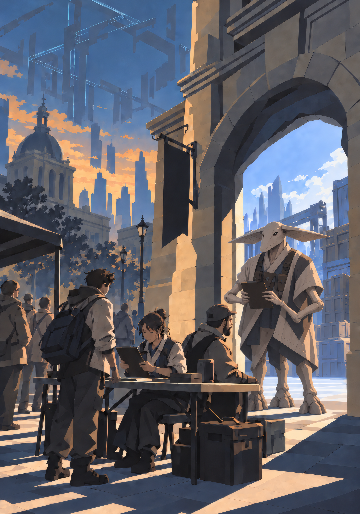

{.opener}

# After the Gate

::: epigraph
"Came home. The bakery on Fourth is open. It's the only thing on Fourth that's open and there's a line, and nobody in the line is talking about the sky."

the survivors' forum
:::

::: epigraph
"A gate joins two places that were each already somewhere."

Bel Sar, route account
:::

The party comes out of the tutorial gate at Level 4 or higher, onto Earth, three days after they vanished, and plays from there to the Level 25 cap. This chapter covers what happened while they were gone, the region they come home to, the Aru on the far side of the gate, the Accession Rifts that pace the game from the gate to the cap, and the diagram in the sky that completes at the end of it. It is a campaign framework, and the GM builds most sessions from it: a worked region with its people and its first two weeks, a default first session, fifteen Rift seeds, and a procedure for turning a seed into a session. The VE numbers live in Cultivation, the quest shapes in System Quests, the four Imprint stat blocks in the Bestiary, Level 10 in Classes, and the cap in Grade Breakthroughs.

## The Campaign at a Glance

The campaign runs in four bands, each keyed to the party's level and each with its own wave of Imprints. The Rifts named are Halden's; a GM's own region puts its own in their places. The session counts are one possible pace (Pacing to the Cap, below).

| **Band** | **Halden's Rifts** | **What the region lacks** | **What ends the band** | **Sessions** |
|------------|--------------|---------------|-----------|------|
| **First wave**, Levels 4 to 9: Interceptors | The Pumping Station, the Overpass, the Pharmacy, the Gym, the Far Side; the Mast from the second week | Water in the Flats, the Bend's road to the hospital, medicine, the gym's two hundred, Selan's workers, the forum relay | Level 10: the class offer, and the second wave falls | 7 |
| **Second wave**, Levels 10 to 15: Bearers | The Bridge, the Workshop, the Depot | The road between the banks and the quay, machine repair, the buses | Level 16: the third wave begins to fall | 4 or 5 |
| **Third wave**, Levels 16 to 20: Cordons, one per completed section of the diagram | The Hall, the Square, the Courthouse | Music, trade across the gate, the gate's building | The diagram completes and takes a body (default Level 20) | 3 |
| **The Completion**, Levels 21 to 25 | The Completion, the Descent, the Site | The square at the city's center, and the ground for the Breakthrough | The cap, and the Breakthrough | 3 |

## Three Days

Everyone the party comes home to has been living through a different version of the catastrophe for three days, and has already decided things. The order of events, as the GM holds it; what any one community knows is what its people saw, and the forum has filled in the rest with varying accuracy:

1. At one moment, every human on Earth heard the System's voice. The words are the Introduction's opening message. In the same moment about one adult in ten was gone, taken into the void and from there into tutorial sectors, with no warning and no goodbye. The taken heard the message in the void. The stayers heard it in place.
2. Some 550 million adults were taken. Cars, aircraft, and operating rooms lost their people at once, and the extraction killed people who were never taken: passengers, patients, anyone whose life depended on a hand that vanished. Most of the taken died in their first hour in a tutorial. Every child stayed: extraction draws only from adults who have reached cultivation readiness.
3. Within the first hour a System diagram stood in the sky over each city where a paired gate would open: fine, enormous, incomplete, drawn in the interface's own glyph grammar. The first Imprints took bodies beneath it, and the first Accession Rifts opened around where they landed.
4. Gates to Namar opened in a staggered sequence across three days, at sites of local significance, a few hundred pairs in all. A gate could open before its locality had heard of any other.
5. Stayers fought Imprints, cleared Rifts, kept people alive, and leveled. Some acquired considerable experience in three days. Many spent the days keeping people alive.
6. Late on Day 3 the tutorial survivors came back through their gates, into recognizable parts of their home regions, with Interpretation switched on and the diagram still incomplete above them.

Ordinary science and technology persist. Networks survive unevenly; some regions stay connected and others go dark from damage, missing staff, supply failure, and local danger. Governments and institutions survive as far as their people did. In any region at least one ordinary institution still functions and at least one needs help. There is no System messaging between people; personal messages, missing-person searches, and local news run on surviving networks, radio, couriers, and particular abilities. The survivors' forum is human-built: surviving or newly hosted pages, relayed by radio and physical copies where the network is gone, its linked copies called Still Here by the people who keep them.

The party's stayers have had three days of this. A sister who is Level 3. A neighbor who buried someone on Day 1 and has not yet said who. A street that voted. The party has seen a sector die, and nobody they come home to has.

### What the Cover Shows

The cover of this book is Day 1 from a rooftop: a city stopped, people in the street looking up, one vast diagram standing in the sky over all of it, unfinished at its edges, and one person in the foreground who has already turned away from it. For the GM running the first session after the gate, that is the region's Day 1 in one frame. The diagram is the pattern of an Imprint being drawn before it takes a body (The Completion, below). The people looking up are the stayers in the first hour, before the first Imprints landed. The person turned away is whoever decided, in that hour, that the sky was not the thing to watch, and the chapter's three stances are the three things such a person did next. When the party asks what the drawing is, the stayers know this much: it appeared in the first hour, things fell out of it, and it has been filling in since.

::: {.lore .quoted}
"Alishba went first. Second day, mid-morning, hands open, nothing in them, and she said afterward she went because the man on the other side had been standing there with a length of pipe for an hour and she was tired of looking at it. The Rift in the gate had two of those things in it, one on each side, and you could only see your own. She counted. He counted. We went through on their count."

the survivors' forum
:::

::: {.lore .quoted}
"Varek ar Soval, water maintenance, second form, lodged the following: that on the second day he crossed the plane holding a section of pipe forward, so that the human would see a tool and not a weapon; that the human, Alishba, then crossed; that the construct on each side was timed by the two of them speaking their counts across the plane; that a mixed party of thirty-one went through on the fourth count. The port authority records the crossing as cleared. It records no first crosser."

a Namar port record
:::

Established on both sides: the gate, the two names, a person stranded by the gate's appearance on the first day, whom the two of them retrieved together; and the clearance of the Rift in the gate on the second day, by counting aloud across the plane, with a mixed crowd through in one timed passage. Disputed: who crossed first, what was said, and who took the risk. The first-day rescue was work done on the same side of the plane, each with their own people; the disputed crossing is the second day's. Which account is right is not known by anyone. Alishba and Varek were the two people on either side who could get a thing done across a gate, unofficial for weeks and then appointed by authorities who found that the other side already trusted them. Their standing is real and unenforceable, and each has been disowned by their own side at least once.

## The Kith at the Return

The four Kith came through the gate beside the party and are camped within sight, and the party's Interpretation has been working since registration (The Tutorial, "Phase 6: First Recognition"). They are the party's existing relationships at the moment the chapter begins, and the first days on Earth are where those relationships become choices. What follows is what each of them believes on Day 3 and wants in the first week, adjusted to what the party actually did.

- **Kes**, the scout. "I saw you before you found each other; I want each name beside what each person did." Offers to scout an onward route for supplies and a written account of the work, the kind a traveling workshop on Oren would weigh.
- **Nemi**, supplies. "You are still finding out what your bodies can survive; I want to see the wound before anyone spends the pill." Asks to inspect a proposed camp and its escape route before committing the group's remaining medicine, and refuses a promise that amounts to "we will find somewhere later."
- **Sava**, the mechanic. "I watched you make that tool do another job; show me what it was built to do." Offers to examine a damaged structure beside a human repairer in exchange for time at the repairer's bench, and wants a reason to stay that includes work of their own. The Workshop seed below is Sava's.
- **Tovan**, the fighter. "You agreed who went through first while the ground was going; who gets to refuse the order next time?" Offers to stand watch through the others' first rest if someone will then walk the roads with them, and refuses to let a host's protection become a prohibition on leaving.

Anything spent in the tutorial stays spent. At registration on Earth each Kith received an individual System authorization for return to Oren, usable at a paired gate whenever the bearer chooses; it carries the bearer and their possessions alone, one way, at no cost in VE or service. Its cost is every Earth relationship that cannot be continued across the **accession bar**, which closes Earth to physical entry from established worlds, Oren included, for as long as accession lasts (The Liaison, below). Declining carries no penalty, and the authorization stays open throughout accession. A Kith who goes home carries the first account of humans that Oren will hear, with Kes's slope tally or a reconstruction of it.

A camp scene, optional and unrewarded, for a quiet stop: a Kith taps and rubs a stone slab or a metal rail, then invites a human to rest a palm on it. The human feels a simple repeating rhythm and misses the frequencies and spatial distinctions the Kith hears. The performer changes the pattern when a second hand touches the surface and shows one part the human can reproduce. On Oren the communal version fills a room.

## The Fault Line

The System causes enmity. People hate it for what it did on Day 1 and are tempted by it at the same time: as a source of personal power, as a new god, as a beacon of higher order. Every community the party meets has landed somewhere on that, and three prevailing stances cover most of them. A stance is what a community mostly does; inside it, people disagree, and the worked region below gives each community a spokesperson, a dissenting voice, and a dispute. Write the stance in words on the region sheet and update it when events change the community's response. There is no numerical track.

::: {.lore .quoted}
"We had a meeting. Forty-one people, the whole street. Nobody's taking the quests. Nobody's touching the glowing ones. If it wants to watch us, it can watch us fix the roof. Mike says that's stupid and he's already Level 3 and I said then you sleep at Mike's. I don't care what it wrote down about me. I care what my daughter thinks I did."

the survivors' forum
:::

**Refuse.** The community will not level, will not take quests, and treats cultivators as collaborators or as weapons it did not ask for. It looks like a neighborhood that took the diagram off its phones, a council that voted, a church that meets in the dark. It wants cultivators gone, or silent, or useful without a notice. It fears the day the System asks its children something. What moves it: a Rift cleared at the hospital it uses; a cultivator who takes no payment and no notice for the work; a cultivator who takes a Mandate against its wishes.

::: {.lore .quoted}
"Day 5. Pastor Lin got a title in front of everyone, right there at the depot fence, and you could see it. I don't know how to explain it to people who weren't there. Some of you are calling it a prison. It told us the rules. Nobody ever told us the rules before. My whole life nobody told me the rules."

the survivors' forum
:::

**Worship.** The community has read the message as a calling. It looks like a shelter run by the two highest-level people in it, a sign on a door listing who has a title, a vigil where a title was granted. It wants what the System wants, as it understands that, and it wants cultivators to lead. It fears being passed over. What moves it: a Personal Opportunity refused in public; a title granted in front of it; a cultivator who explains what the System actually recorded.

::: {.lore .quoted}
"OK practical people only. Marguerite at the co-op will feed a team of four for a week per cleared site, she's got a list, she's not negotiating, she's got the food. Bring your own bandages. Do NOT go near the depot on Fourth, there's one there that goes for anything that steps over the paint and it does not stop for a while."

the survivors' forum
:::

**Use.** The community treats the System as weather and cultivators as a resource. It looks like a customs desk at the gate, a co-op paying in food for a Rift cleared, a mayor with a list. It wants Rifts cleared, routes open, and terms. It fears dependence on people it cannot govern. What moves it: a bargain kept; a bargain broken; a cultivator who does the work without terms, which frightens it more than a price.

When the party does something a community can see, say what the community saw and update its stance on the region sheet. The three "What moves it" examples under each stance are samples; write your region's own. (The third post above is wrong about the trigger: the poster watched a man struck as he stepped over the paint while a bus idled behind him, and the depot's Bearer detects running engines, as its seed says. The post is right that it does not stop quickly.)

## Build Your Region

The default region is the GM's own town, and the book's worked region is a fictional one built to be replaced. A region sheet holds: one gate, one diagram, three communities with a stance each, at least three first-wave Rifts, one Aru counterpart, the party's homes, one institution that works, and one that is failing. The worksheet at the end of this section fits on one page.

### Halden When the Party Returns

A river city of about two hundred thousand on both banks of the Halden, joined by one road bridge and one rail bridge. The gate opened on Day 2 in the arch of the old courthouse on Court Square, on the north bank, and the diagram stands over the square. This is the city late on Day 3, as the party walks out of the arch.

- **The Flats**, south bank: warehouses, the transit depot, the co-op market, the working river. Prevailing stance: use.
- **Northgate**, north bank around Court Square: the hospital, the concert hall, the radio mast on the hill. Prevailing stance: worship, centered on the hall's shelter.
- **The Bend**, upriver on the north bank: a residential grid where the street councils formed on Day 1. Prevailing stance: refuse.

The hospital works, short-staffed and open. The water utility is failing: its plant is in the Flats and half its engineers were taken. Both bridges are open. Five first-wave Rifts stand unresolved: the Pumping Station, the Overpass, and the Pharmacy, which the city needs cleared; the Gym in the Bend, where two hundred people shelter; and the Far Side, across the gate in Selan's freight yard. The Mast arrives in the second week. An Interceptor has held the courthouse steps since the first hour and has been left alone on purpose (the Courthouse, a later Rift); the gate in the arch is reached by the side of the building. Court Square has an improvised customs table the Flats did not set up, a vigil on the way to it, and the diagram overhead.

| Place | Connects to | State on Day 3 |
|---|---|---|
| Court Square (Northgate) | The gate to Namar; the hospital two streets north; the road bridge south to the Flats; the Bend by the river road, on foot | The customs table; an Interceptor on the courthouse steps |
| The road bridge | Court Square to the Flats | Open; a Bearer walks it from the second wave |
| The rail bridge | The Bend to the Flats, on foot along the track | Open; the Overpass Rift sits under its north end |
| The Flats | The depot, the co-op, the pumping station, the quay | The Pumping Station Rift; the depot vigil at the fence |
| The Bend | The gym shelter; the river road to Court Square | The Gym Rift; the street councils; the river road under water at the bend since the weir's keepers were taken on Day 1, knee-deep on foot and closed to a vehicle or a stretcher |
| Northgate hill | The radio mast | The Mast Rift, from the second week |
| The far side of the gate | Selan's port and its freight yard | The Far Side Rift in the yard |

**What comes later.** The second wave (the Bridge, the Workshop, the Depot) falls as the party's band rises; the Bearer on the road bridge closes the direct road between the banks for twenty minutes in every hour when it arrives, and most people cross on foot by the rail bridge instead. The third wave falls from the diagram as it completes. Label these on the sheet with the band they arrive in.

| Community | Spokesperson | Dissenting voice | The dispute |
|---|---|---|---|
| The Bend (refuse) | **Ana Kowalczyk**, who chaired the first street meeting and keeps the roof crews working | **Mike Tran**, Level 3 by Day 3, who cleared the gym's first Imprint alone and wants the council to admit it helped | Whether a cultivator can live on the street. The council's compromise: he sleeps there and does not recruit there. |
| Northgate (worship) | **Pastor Lin Okonkwo**, whose title was granted at the depot fence on Day 2, in front of two hundred people she had led out of the Flats | **Dr. Sefa Aydin**, who runs the hospital and wants the hall's people working instead of waiting for notices | Whether the depot stays as it is once its Rift comes. The congregation holds its evening vigil at the fence where the title was granted. |
| The Flats (use) | **Marguerite Deschamps**, who runs the co-op and pays in food for cleared sites | **Teodor Ilić**, a depot dispatcher who will not send drivers into a Rift for anyone's price | Whether to deal with the Aru port directly or through Court Square's customs table, which the Flats did not set up and does not trust. |

Halden's Aru counterpart is Selan ar Nerava; the party's homes are wherever the players say, and a home in the Bend is a different campaign from a home in the Flats.

### Halden's People

What the GM needs to play each of them on Day 3. Their stances and disputes are in the table above; the Kith are in The Kith at the Return, and Selan's needs, offer, and refusal in The Aru Across the Gate.

- **Ana Kowalczyk**, the Bend's spokesperson. Late fifties, a roofer's tan, a clipboard of crew rosters; speaks in lists and does not raise her voice. **Wants now:** the two hundred out of the Gym without the council owing a cultivator for it. **Can give:** a street to sleep on, the roof crews, the council's vote. **Knows:** who in the Bend is sick, and which neighbors have quietly taken a level. **Found:** at the Gym's windows at the noon feeding; in the courthouse basement at night, from Day 4.
- **Mike Tran**, the Bend's dissenting voice. Late twenties, a bike courier, Level 3, his forearm taped where the Gym's first Imprint caught it; talks fast and answers a question with what he saw. **Wants now:** the council to say his clearing helped, and a partner for the Gym. **Can give:** his bike, and the Bend's back routes. **Knows:** the Gym's Imprint has never touched anyone going in; he has carried bread in twice. **Found:** asleep on Ana's street, or at the Gym's windows at feedings.
- **Pastor Lin Okonkwo**, Northgate's spokesperson. Sixties, a hospital fleece over her collar; she addresses a room even when she is speaking to one person. **Wants now:** the vigil kept at the depot fence, and her congregation told what the System wants of it. **Can give:** two hundred volunteers who follow instructions, the hall's floor, the congregation's pooled food. **Knows:** the name of everyone she led out of the Flats on Day 2. **Found:** the concert hall by day; the depot fence at the evening vigil.
- **Dr. Sefa Aydin**, Northgate's dissenting voice. Forties, in scrubs four days old, running the hospital since Day 1; talks in counts and dates. **Wants now:** the Pharmacy cleared, the Bend's patients through the Overpass, and the hall's people working shifts. **Can give:** surgery, beds, and the hospital's generator fuel. **Knows:** what runs out when; insulin and antibiotics go on ration on Day 6. **Found:** the hospital.
- **Marguerite Deschamps**, the Flats' spokesperson. Sixties, twenty years managing the co-op, reading glasses on a cord and a list in her apron pocket; she states a price once. **Wants now:** water in the Flats before Day 5, then trade with the port without the customs table. **Can give:** a week's food for a team of four per cleared site, and the co-op's boats. **Knows:** every supply route into the Flats, and who is hoarding. **Found:** the co-op market.
- **Teodor Ilić**, the Flats' dissenting voice. Fifties, the depot's dispatcher, a radio headset around his neck; speaks the way he talks on a channel, short and in turn. **Wants now:** none of his drivers killed, and the buses running. **Can give:** the depot's radio net, which works without the Mast; drivers once a route is proved safe; which roads are open. **Knows:** where every one of his drivers was when the day started, and who has not come back. **Found:** the depot office, outside the gates.
- **Selan ar Nerava**, the port across the gate. Second form, hearing fans held forward when listening; gives every time to the minute. **Found:** at the customs table from Day 4, or at the freight office by the yard across the gate.

### Your Own Town

Keep: a gate at a site of local significance, a diagram over it, three communities with the three stances, at least three first-wave Rifts on things people need, one Aru who has a reason to talk. Halden's own: the river, the hall, the depot, the two bridges. A town with no river has a highway; a town with no concert hall has a high school gym that held a thousand people; a town with no port on the far side has a farm cooperative with a different reason to want the gate open. Use the players' knowledge of the place: they know which road floods and which store would still be open.

### The Region Worksheet

Copy this onto one page and fill it in.

- **The gate:** where it opened, and what the building or site was before.
- **The diagram:** over what, and how many sections the party can count (the third wave drops one Cordon per section that completes).
- **Three communities:** name, place, prevailing stance, spokesperson, dissenting voice, the dispute.
- **At least three first-wave Rifts:** shape, site, what it costs the region while it stands.
- **The Aru counterpart:** name, job, what they need, what they can offer, what they will refuse.
- **The people:** for each spokesperson, dissenting voice, and the Aru counterpart, a look and a voice, what they want now, what they can give, and where to find them.
- **The clock:** what each first-wave Rift costs the region, and on which day if nobody acts.
- **The party's homes:** which community each is in.
- **One institution that works, and one that is failing.**
- **Later, labeled by band:** the second wave, the third wave, the Completion.

### Things That Pay Nothing

The System issues no notice and pays no VE for these scenes. The Kith camp scene. A meal on the far side of the gate, with food that may or may not be edible. The forum's first photograph of Namar, taken by whoever carries a phone through. A night of music (the Hall, below). The players will supply others.

## The First Session Back

The default for the first session after the tutorial, in Halden; in the GM's own town the same steps use its people and its Rifts. It runs from the arch at dusk on Day 3 to the party's first Rift on Day 4. Allow about an hour for steps 1 to 5 and the rest of the session for the Rift.

Read this as the party comes through the arch:

::: readaloud
You come out under a stone arch into evening air that smells of smoke and wet concrete. People stand along the edges of the square holding up phones with photographs on the screens. Above them a drawing in fine cyan lines, wider than the square and wider than the city, hangs over all of it, and the lines at its edges are still moving. Behind you, on the courthouse steps, something stands on two legs with one limb raised and does not move. In the middle of the square a man sits at a folding table with a pen and a list.
:::

1. **The square.** Let the square come to the party. A volunteer at the customs table asks each character's name and whether they are one of the ones who went, and writes both down. The vigil's candles are on the way to the table. The Interceptor stands on the courthouse steps behind them and does not move while nobody climbs.
2. **The reunion.** Before the session, ask each player who their character looks for first. Give one reunion in this session, to the character whose person lives nearest, and the rest by the end of Day 4. The person has had three days (Three Days): choose what they did from what the stayers did, and say what they have decided. A person who was taken too is on the customs table's list, marked taken and not returned.
3. **The Kith.** The table has no column for the Kith, and they camp within sight of the arch the first night. The decision is who answers for them at the table and where they go on Day 4: a character's home, the hall's shelter, or the co-op's warehouse. Nemi inspects the choice's escape route, and Tovan refuses any choice that forbids leaving. Each community reads what it sees: the Bend, whether cultivators bring strangers home; Northgate, whether the System's other Initiates are honored; the Flats, what the Kith can do.
4. **The reports.** By morning three people bring the party a problem, each in person. Marguerite sends a runner about the Pumping Station, with the price she will pay. Dr. Aydin, at the hospital, has the Pharmacy and her count of what runs out when. Mike Tran, at the Gym's windows, asks about the Gym without the council's leave. All three mention the Overpass. Selan comes to the customs table at noon with the Far Side.
5. **The worsening.** At noon on Day 4 Northgate loses water pressure: the plant is failing, and the streets uphill from the river go dry first. The hospital's taps run at a trickle. Say it wherever the party is standing.
6. **The choice.** The party picks its first Rift. Every other line of the clock below keeps running.

**Choices to notice:** which report the party takes first, who they tell, and whether they take payment.

### If Nobody Acts

Halden's first-wave clock, from the party's return. A cleared Rift stops its line. The GM may move any day; keep the order. The later waves keep to the party's level (The Campaign at a Glance).

| **Day** | **What happens** | **Rift** |
|---|---|---|
| 4 | Northgate loses water pressure at noon. Selan comes to the customs table. | The Pumping Station, the Far Side |
| 5 | The Flats drink from the river, and the co-op boils water for anyone who brings a pot. | The Pumping Station |
| 6 | The hospital rations insulin and antibiotics, and the forum names who ran out. | The Pharmacy |
| 7 | Selan turns to the port's other gate, two days' haul upriver, for its first partner. | The Far Side |
| 8 | The Bend's council votes on asking a cultivator to empty the Gym. The vote fails by default, and Mike Tran stops sleeping on the street. | The Gym |
| 10 | The Mast's Rift arrives, and Halden goes dark on the forum. Teodor's depot radio net carries the city's news. | The Mast |
| 12 | The Flats stop using the customs table and send their own runner through the gate. | none |

## The Aru Across the Gate

Namar is a newly integrating inhabited world whose most numerous people call themselves the Aru. Its cities are cities: homes, factories, public institutions, freight, entertainment, neglected districts, places people love. It has its own scientific and industrial history. Many urban regions run wired optical networks; an Aru communications engineer understands what a human cable is for and finds no compatible socket. Most inhabited regions of Namar support human life without suits, and Earth supports Aru the same way; air, gravity, and climate were part of the System's compatibility assessment. Local food is a separate question.

Aru have three weight-bearing legs, two manipulating arms, and movable hearing fans along the head. An adult stands about 2.1 meters at the head, taller than most humans, upright over three legs that splay wide. The build is lean and bony: long limbs, visible joints, smooth hairless skin the color of pale bone. The arms fold at two elbows apiece and the hands have five fingers; each foot has three blunt toes. The head is long and tapering on a short neck, the eyes small and dark and set wide, and the fans are broad flat blades spreading to either side, together wider than the shoulders. Aru dress hangs from the shoulders in wide panels to mid-leg over a harness of pouches, the legs bare and the head uncovered; a human garment fits nothing on them. Deliberate fan movements are part of language and translate; involuntary ones a human learns to read. Anatomy shapes furniture, gait, and comfort: an Aru's walk has a three-step rhythm, an Aru sits on a low ring rather than a chair, and turns the whole head to bring a fan to bear. Aru live through four discrete bodily forms, remain the same people through each, and remember their earlier lives:

| Form | Body | Particle |
|---|---|---|
| First | Juvenile: smaller, more flexible, large hearing fans; the future arms support early crawling. No sustained cultivation. | el |
| Second | The first adult body. Cultivation readiness arrives here. Reproductive organs are not yet functional. | ar |
| Third | Reproductive capacity, a broader torso, folding plates that shelter an external clutch. Any fertile adult can fertilize and any can brood; reproduction takes a partner. | ir |
| Fourth | Reproductive capacity recedes; brooding structures shrink; the hearing fans divide into layered lobes. Cultivation continues. | or |

A formal name is personal name, form particle, household name: **Varek ar Soval** is Varek, second form, of the Soval household, and after his next transition Varek ir Soval. Address is by personal name alone. Aru physiology supplies no male and female binary; gender systems vary by culture, and Interpretation renders what a person communicates about themselves.

Three first contacts, as local reactions: a port authority treats its gate as a customs problem; an inland mutual-aid group treats it as a route to supplies; an armed coalition treats it as a vulnerability or an opening. Earth shows the same range, and the region's three stances have Aru counterparts on the far side.

### Selan ar Nerava

Halden's counterpart, and the pattern for any region's. Selan is second form, a freight dispatcher for the port on the far side of Halden's gate, whose authority treats the gate as a customs problem. Selan knows routes, supplies, schedules, and the people who make things move.

- **Needs:** four dispatch workers, stranded since Day 2 in the Rift on the freight yard across the gate (the Far Side, below).
- **Can offer:** warehouse access on the Namar side, and a schedule for the barges once the quay is usable.
- **Will refuse:** to promise cargo that belongs to someone else, whatever it would buy.

Write any region's Aru the same way: one thing they need, one thing they can offer, one thing they will refuse.

### Paired Opportunities

The System chose Earth and Namar for each other, for sustained, informative interaction. It may issue a **paired Opportunity**: a Personal Opportunity addressed to a human and an Aru at once, the same offer in two logs in two languages, completing only if both act (System Quests, "Personal Opportunities"). The offer affirms or tests the cooperation the way an ordinary Opportunity affirms or tests a pattern: carry this across; refuse this for the other side's sake; tell the truth when it costs your own side. Alishba and Varek are the precedent the book names, and the setting's word for the pairing of the two worlds, in human slang, is integration buddies. The GM, or the System AI in assisted modes, offers one after a human and an Aru have acted together twice; in Halden, clearing the Far Side with Selan is the first time.

## Accession Rifts

An Accession Rift is a bounded site where the System has laid down a pattern and Imprints run it. An Imprint is a nonconscious construct that physically executes a recorded pattern of behavior; it contains no copied person, and players can rely on that. Rifts cluster around gate cities and impose real risk on inhabited places. People pursue Rift rewards willingly and object to the danger imposed on their neighbors at the same time. An encounter's consequences persist: the route is clear, the equipment is accessible, the group is rescued. Humans and Aru compare Rift procedures across the gates and exchange tactics.

### Three Shapes

- **Hold:** keep a position for a duration.
- **Passage:** get people or goods through.
- **Claim:** take and keep a site or a cache.

### Writing a Rift

A prepared Rift states: the objective; the boundary; the activation cue; the Imprint's four lines; the completion condition; the reward; and the consequence of leaving it unresolved. The System's notice states the objective, the boundary, the cue, and the reward, in its own units; the four lines are what the party learns by watching. A Rift pays the Faction column of the quest reward table at its difficulty (System Quests, "Reward Reference Table"): 25 at Moderate, 50 at Hard, 90 at Severe, 150 at Peak, per character, on completion, in addition to the kills. An Imprint's kill pays its tier.

::: questcard
*[R-014 · Accession Rift · Hold] The pumping station.*

*Objective: the station's pumps run for six hours.*

*Boundary: the marked line on the plant floor.*

*Begins: on the first crossing.*

*Reward: 25 VE.*

*Unresolved: the district's water fails within two days.*
:::

**When a Rift is cleared.** When the completion condition is met, the System closes the Rift: every Imprint in the Rift stops where it stands and, within the hour, comes apart into the pale motes of a dissolving sector, fought or not. The route stays clear and the site stays taken. A seed whose completion condition is the Imprint down needs the kill, and says so. A Rift solved without a kill pays its reward and none of the kill's VE. A cleared Rift never reopens; a later Imprint at the same site is a new manifestation with its own notice.

### The Four Lines

Every Imprint is specified in four lines: what it **detects**, what **triggers** it, what it **does**, what **stops** it. Its behavior is discoverable and reproducible. A method that worked once works again under the same conditions, and the GM changes an Imprint's four lines only when an event in play gives cause.

At the table: **Detects** is the sense the Imprint has, stated as what it perceives (contact with a surface, a sound, a gait, a running engine), and nothing else; a Mast Imprint that detects the transmitter's hum is blind to a person standing still beside it. **Triggers** is the condition; anything that does not meet it is ignored, and a decoy that meets it draws the full sequence. **Does** is a committed sequence written in rounds and Beats, and the Imprint strikes nothing outside it; while it waits to reset it stands where its sequence ended. **Stops** is the reset, and where it stands afterward. After the party has watched one full cycle, tell them what they can reliably infer: the trigger they saw, the sequence, and the reset. Detection limits and second triggers are confirmed when the party tests them. A solution the GM did not foresee is tested against the four lines and nothing else: if the lines allow it, it works.

**What they look like.** An Interceptor is a runner: a body built around two legs and a striking limb, light on its feet, that stands dead still at its post and moves all at once. A Bearer is a walker: heavier, four-legged, with a frame on its back that holds whatever it carries, and a gait that never changes pace. A Cordon is broad and low, wider than it is tall, with a long reach, and it slides sideways along its perimeter rather than turning. The Completion has no fixed shape; it is drawn from the region's record and looks like whatever the region's conduct was made of, and the GM describes it when the diagram takes a body. All four are silent except for the sound of their movement, and all four carry the fine cyan lines of the diagram they fell from.

::: {.lore .quoted}
OPEN MEASURE | Interceptor pattern, first wave | Conditions: a gate city on a newly acceded world; F-Grade subjects; sector version current | Sample: 3 subjects, 22 crossings, 4 struck | By: Ensa | Replication: one independent, one pending

The construct detected contact with the marked boundary and nothing beyond it: a subject standing still inside the boundary for two minutes was not approached. It triggered on the first crossing and did not retrigger on a second crossing made while the first was being struck. Its committed movement ran from its post to the crossing point, to the far barrier, and back, and it struck nothing during the return leg; a thrown object across the boundary drew the full movement 9 times in 9. Not tested: whether the pattern reacquires by sight or by the boundary; whether two boundaries can be held by one construct. These results hold under the conditions stated.

an Open Measure bulletin
:::

The bulletin is reader-facing. The accession bar keeps the paper out of Earth, and a GM who wants the knowledge in a character's hands has a Kith carry it.

### From Seed to Session

A seed is a Rift. A session around it adds five things, and Halden's people and clock supply most of them:

1. **Who brings it.** A person with a stake, who asks, pays, or forbids. Halden's People names who wants each first-wave Rift cleared or kept.
2. **What the party learns before the boundary.** The notice (objective, boundary, cue, reward), one or two facts the asker knows, and what watching one cycle shows (The Four Lines).
3. **One obstacle that is not the Imprint.** A community that wants the Rift left standing, a crew that got there first, a tool nobody has, or the clock.
4. **The attempt.** The Rift's lines and Ground, run as written.
5. **What changes.** The completion or the Leaving it line; one community's stance, updated on the region sheet for what it saw (The Fault Line); the clock's line stopped; and the next asker, who has heard.

A seed built out this way fills a session of three to four hours. Two small seeds can share one.

### The First Wave (Levels 4 to 9)

Archived patterns of dead worlds, dropped in the first hour. All six run the **Interceptor** block (Bestiary, "Imprints"): Force 25, a Moderate-to-Hard creature for a party at Level 4 to 9, and Halden has five of them on Day 3, the Mast arriving in the second week.

**The Interceptor's sequence**, which a first-wave seed runs unless its **Does** line gives its own: round one, it moves to the crossing point and strikes the first thing there (a Beat to move, a Beat to attack); round two, it moves to the far barrier and back to its post (two Beats of movement, no strike). It resets when its boundary has been quiet for a minute, standing at its post until then.

#### The Pumping Station (Hold)

The water plant in the Flats.

- **Objective:** keep the pumps running for six hours; the panel needs a hand on it once an hour.
- **Boundary:** the yellow line around the plant floor. **Cue:** the first person to cross it.
- **Ground:** three Zones inside the line, each one Zone from the others: the crossing point at the door, the pump bay with the panel, and the Interceptor's post at the far wall. Its far barrier is the pump bay's rail.
- **Completion:** six hours of pressure. **Reward:** Moderate, 25 VE.
- **Leaving it:** the Flats drink from the river within two days.

::: statblock
**Interceptor**

- **Detects** contact with the painted line.
- **Triggers** on anything crossing the line.
- **Does** the Interceptor's sequence.
- **Stops** when nothing has crossed for a minute; it stands at its post by the far wall.
:::

#### The Overpass (Passage)

The one dry road under the rail bridge between the Bend and Northgate's hospital.

- **Objective:** forty people across.
- **Boundary:** the median line, and a second Interceptor at the far ramp with a line of its own. **Cue:** the first crossing.
- **Ground:** five Zones along the road: the Bend's ramp, where the forty wait; the median line; the underpass; the far ramp's line; and the hospital side, where they must end. Each Interceptor posts at the bridge pier beside its own line, and its far barrier is the pier across the road. A group of ten moves one Zone a round.
- **Completion:** forty across, or both Interceptors down. **Reward:** Moderate, 25 VE.
- **Leaving it:** the Bend is cut off from the hospital.

::: statblock
**Two Interceptors, each with its own line**

- **Detects** contact with its own line.
- **Triggers** on anything across it.
- **Does** the Interceptor's sequence.
- **Stops** when its line has been quiet for a minute.
:::

Two lines and two two-round cycles: a crossing runs during both return legs, and a decoy at each line can start both cycles together. Fought head-on, two Interceptors are a hard fight for a Level 4 party (in simulation, one fight in five lost).

#### The Pharmacy (Claim)

The hospital's pharmacy corridor.

- **Objective:** take the corridor and hold it for one day.
- **Boundary:** the double doors. **Cue:** the doors opening.
- **Ground:** three Zones: the near end inside the double doors, where the Interceptor stands; the dispensary halfway; and the stockroom at the far end.
- **Completion:** the corridor held from dawn to dawn while the pharmacy is emptied. **Reward:** Hard, 50 VE.
- **Leaving it:** the hospital rations, and the forum names who ran out.

::: statblock
**Interceptor**

- **Detects** footfalls on the corridor floor.
- **Triggers** on anything walking the corridor while the doors stand open.
- **Does:** advances to the far end over two rounds, striking whatever it reaches, then holds the far end.
- **Stops** when the corridor has been empty for a minute; it walks back to the near end and stands.
:::

#### The Mast (Hold)

The radio mast on Northgate hill, the region's forum relay; it goes quiet in the second week when its Rift arrives. The objective is the trigger.

- **Objective:** keep the transmitter on through a night.
- **Boundary:** the fence. **Cue:** the carrier hum.
- **Ground:** two Zones inside the fence: the mast's foot, where the Imprint stands while the air is quiet, and the transmitter hut.
- **Completion:** six hours on air. **Reward:** Moderate, 25 VE.
- **Leaving it:** Halden goes dark on the forum.

::: statblock
**Interceptor**

- **Detects** the hum, and nothing else.
- **Triggers** while the transmitter is on.
- **Does:** walks to the transmitter and strikes it, or whatever stands between, one strike a round.
- **Stops** when the hum stops; it stands still where it is until the hum returns.
:::

#### The Gym (Passage)

A school gym in the Bend with two hundred people sheltering in it.

- **Objective:** everyone out.
- **Boundary:** the doorway. **Cue:** the first person to leave.
- **Ground:** three Zones: the gym floor, the doorway, and the street. The windows are two meters up and barred; food goes in through the bars.
- **Completion:** the gym empty. **Reward:** Hard, 50 VE.
- **Leaving it:** two hundred people fed through the windows.

::: statblock
**Interceptor**

- **Detects** the doorway's threshold.
- **Triggers** on anything crossing it outward; never on anything entering.
- **Does:** strikes the leaver and follows three steps, one round, then returns to the door.
- **Stops** when no one has left for a minute; it stands in the doorway.
:::

#### The Far Side (Passage, on the Aru side)

Selan's four dispatch workers, stranded since Day 2 in the freight yard across the gate, in the dispatch office at its far end.

- **Objective:** four workers out.
- **Boundary:** the yard gate. **Cue:** a crossing.
- **Ground:** four Zones: the yard gate, the open paving, the loading bays where the freight trolleys stand, and the dispatch office at the far end. The Interceptor posts at the loading bays; its far barrier is the yard gate.
- **Completion:** four workers across the gate. **Reward:** Hard, 50 VE, and standing with the port.
- **Leaving it:** Selan turns to the port's other gate, two days' haul upriver, for its first partner, and Halden waits its turn.

::: statblock
**Interceptor**

- **Detects** footfalls on the yard's paving.
- **Triggers** on an Aru crossing the yard on foot.
- **Does** the Interceptor's sequence.
- **Stops** when the yard is quiet for a minute.
:::

A human walking in, on two feet, does not trigger it; an Aru carried, or wheeled on one of the yard's freight trolleys, makes no footfall at all. The party can walk in, and the four can come out on trolleys pushed by human hands, which is a thing the port had not thought of because nobody there walks on two legs.

#### Option: The Gate (Passage, two-sided)

For a region whose stayers never cleared their gate. One Interceptor on each side of the plane, each visible only from its own side, each with the two-round cycle; a crossing timed to both return legs, counted aloud across the plane, the first-contact deed at the party's own gate.

- **Reward:** Hard, 50 VE.
- **Leaving it:** the gate stays a wall.

### The Second Wave (Levels 10 to 15)

Later waves fall as the party's level band rises. The second runs the **Bearer** block: Force 45, a creature that walks a route carrying a thing and strikes what stands on the route. Its sequence: it moves one Zone a round along its route and strikes anything in the Zone it enters (a Beat to move, a Beat to attack), and it never stops for a target and strikes only what is in its path. It resets at the end of its route, where it turns and walks back.

#### The Bridge (Passage)

The road bridge, and a Bearer walking a route that takes the hour: across the deck, down the quay stairs, along the mooring quay, and back.

- **Objective:** a convoy across, or the quay usable for the barges, whichever the region needs first.
- **Boundary:** the deck and the quay. **Cue:** the Bearer's hour.
- **Ground:** the route runs from the deck's north end across the bridge, down the quay stairs at the south end, and along the mooring quay to its far end: half an hour each way, ten minutes of it on the deck. The Bearer turns at each end, so it is on the deck for the ten minutes either side of each hour.
- **Completion:** the convoy across, or the Bearer down and the cache it carries opened. **Reward:** Hard, 50 VE; the cache holds a Standard Attribute Treasure (Items).
- **Leaving it:** the direct road between the banks is closed for twenty minutes in every hour, and nothing moors at the quay.

::: statblock
**Bearer**

- **Detects** weight on the deck and the quay stones.
- **Triggers** on anything in the Zone it enters.
- **Does** the Bearer's sequence.
- **Stops** at each end of its route, where it turns and walks back.
:::

#### The Workshop (Claim)

The machine shop behind the depot that Sava and a human repairer both want, and a Maker's recurring scene (Classes, "Maker").

- **Objective:** take it and keep it a day.
- **Boundary:** the shop floor. **Cue:** a machine running.
- **Ground:** three Zones: the door, the bench aisle, and the machine bay at the back, where the lathe and the press stand.
- **Completion:** the shop held and one machine run through a shift. **Reward:** Hard, 50 VE, and every tool on the floor as materials on hand.
- **Leaving it:** the region repairs nothing it cannot repair by hand.

::: statblock
**Bearer**

- **Detects** the vibration of a running machine through the floor.
- **Triggers** on a machine switched on.
- **Does:** walks to it, one Zone a round, and strikes the machine until it stops, then holds beside it.
- **Stops** when the floor is silent for a minute; it returns to the door and stands.
:::

#### The Depot (Claim)

The transit depot, forty buses, and the vigil at its fence.

- **Objective:** take it and keep it a day.
- **Boundary:** the depot gates. **Cue:** an engine starting.
- **Ground:** four Zones: the gates, the fuel island, the bus rows, and the maintenance shed. The Bearer starts in the bus rows.
- **Completion:** the depot held and a bus driven out. **Reward:** Hard, 50 VE.
- **Leaving it:** Halden walks.

::: statblock
**Bearer**

- **Detects** running engines.
- **Triggers** on a running engine inside the gates.
- **Does:** walks to it, one Zone a round, and strikes the vehicle until it stops.
- **Stops** when the yard is silent for a minute; it stands where the last engine died.
:::

Northgate's congregation wants the depot as it is, because the title was granted at that fence and the Bearer's evening circuit has become part of the vigil; the Flats want the buses; Teodor will not send a driver in. Pastor Lin will ask, in front of the vigil, for the Bearer to be left one more night, and the answer is the party's; a party that clears the yard while the vigil stands at the fence has the congregation's attention and the co-op's food, and what each does with that depends on what was said.

### The Third Wave (Levels 16 to 20)

The third wave runs the **Cordon** block: Force 60, Yields, a creature that holds a perimeter. Its sequence: it slides one Zone a round along its perimeter and strikes what it meets (a Beat to move, a Beat to attack), and it Yields under the ordinary rule (Core Mechanics, "Yield"). A two-Beat Yield lets the attacker drive it off its perimeter, and a Cordon driven off spends its next turn returning to the line and strikes nothing on the way. It resets when its perimeter has been empty for a minute, standing where it stopped. A Cordon falls from the diagram each time one of its sections completes (The Completion, below).

#### The Hall (Hold)

The concert hall, Northgate's shelter for three weeks and empty now, and a Cordon on the concourse ring.

- **Objective:** a night of music, the first since Day 1, with the hall full and Aru in the seats.
- **Boundary:** the concourse. **Cue:** the house lights.
- **Ground:** the concourse ring is six Zones around the auditorium. The main entrance opens onto one of them, and three doors lead from the ring into the seats. The Cordon starts at the main entrance.
- **Completion:** the performance finished. **Reward:** Severe, 90 VE.
- **Leaving it:** the hall stays a shelter with nobody in it.

::: statblock
**Cordon**

- **Detects** footfalls on the concourse floor.
- **Triggers** on anything walking the ring while the house lights are up.
- **Does** the Cordon's sequence around the ring.
- **Stops** when the ring has been empty for a minute.
:::

#### The Square (Passage)

Court Square, the market Halden and the port both want, and the customs table the Flats do not trust. A market is people standing still.

- **Objective:** a market day, with goods crossing the gate both ways.
- **Boundary:** the square. **Cue:** the first stall.
- **Ground:** four Zones: the courthouse front, the customs table, the middle of the square, and the side toward the road bridge.
- **Completion:** a day's trade. **Reward:** Severe, 90 VE, and standing with the port and the Flats both.
- **Leaving it:** trade goes through the warehouse yard on Selan's terms.

::: statblock
**Cordon**

- **Detects** weight resting on the square's paving.
- **Triggers** on anything standing still on it for longer than a round.
- **Does** the Cordon's sequence to the standing target; a target that keeps moving is never struck.
- **Stops** when nothing has stood still for a minute.
:::

#### The Courthouse (Claim)

The gate's own building. An Interceptor has held its front steps since the first hour, and the Bend's council has met in its basement since Day 4, by the alley door on the north side, which the Interceptor does not detect. In the third wave a Cordon takes the steps when a section completes above the square.

- **Objective:** take the building and keep it a day.
- **Boundary:** the steps. **Cue:** the doors.
- **Ground:** two Zones on the steps, the foot and the top, below the doors. The alley door on the north side opens into the basement and is not on the steps.
- **Completion:** the building held. **Reward:** Severe, 90 VE.
- **Leaving it:** the Bend keeps its wall, and says so; Ana will say it to the party's faces, and the Flats will say the opposite.

::: statblock
**Cordon**

- **Detects** footfalls on the steps.
- **Triggers** on anything climbing them.
- **Does** the Cordon's sequence on the top step.
- **Stops** when the steps have been empty for a minute.
:::

The Bend wants the steps held: as long as they are, the courthouse is a Rift and nobody's office, and the day it is cleared the customs table moves inside and the port authority has a building in Halden. Clearing this Rift costs standing with the Bend.

### The Completion's Rifts (Levels 21 to 25)

#### The Completion (Claim)

The diagram takes a body on Court Square (the sequence is below). It runs the **Completion** block (Bestiary, "Imprints"): Force 75, three Beats, Yields two of three, its four lines written from the region's record (Writing the Completion, below).

- **Objective:** take the square and keep it.
- **Boundary:** the diagram's footprint, the largest Rift in Halden.
- **Ground:** the footprint covers Court Square's four Zones (the Square, above).
- **Completion:** the Completion's stop condition met, or the Completion down; a Completion whose lines can be satisfied is cleared without a kill, and pays the Rift and none of the kill. **Reward:** Peak, 150 VE, and the passage below the square exposed.
- **Leaving it:** the largest Rift in the region stays open at its center.

#### The Descent (Passage)

When the Completion comes apart, the square's paving goes with it: the fall opens a shaft under Court Square into the cut the gate's makers drove for it, a passage that was never on any map of Halden. Two Cordons hold the switchback ramps, one to each, and the ramps are their perimeters.

- **Objective:** the party through to the bottom.
- **Ground:** the shaft's mouth, two switchback ramps of two Zones each, and the floor at the bottom.
- **Reward:** Severe, 90 VE.
- **Leaving it:** the site stays out of reach.

::: statblock
**Cordon**, one to each ramp

- **Detects** footfalls on the ramp.
- **Triggers** on anything descending it.
- **Does** the Cordon's sequence along the ramp.
- **Stops** when the ramp has been empty for a minute.
:::

#### The Site (Claim)

The floor of the cut, where what the Completion held went into the ground: the densest place in the region, and the ground the region's Breakthroughs will be attempted on for as long as the density lasts. One Cordon holds the floor's edge. The site is High density, +20 on the Breakthrough Check (Grade Breakthroughs, "Energy Density Tiers"); the GM may run it as Extreme density instead.

- **Objective:** hold it long enough to ignite.
- **Ground:** three Zones: the foot of the last ramp, the edge, and the densest ground at the center, where the Breakthrough is attempted.
- **Reward:** the check itself.
- **Leaving it:** the cap, with the Breakthrough attempted somewhere with less in the ground.

::: statblock
**Cordon**

- **Detects** footfalls on the floor.
- **Triggers** on anything crossing the edge onto it.
- **Does** the Cordon's sequence around the edge.
- **Stops** when the floor has been empty for a minute.
:::

## Pacing to the Cap

Level 4 to Level 25 is 21 levels at 120 VE each: **2,520 VE** per character (Cultivation, "Leveling: The Cost of a Level"). The table is one possible pace, with its assumptions stated beneath it; the GM's dials are the Rift difficulty, the fight count, and the density of the ground the party rests on.

| Band | Levels | VE | Assumed VE a session | Sessions | Rest to refine a session |
|---|---|---|---|---|---|
| First wave | 4 to 10 | 720 | about 100 | about 7 | 5 hours |
| Second wave | 10 to 15 | 600 | about 135 | about 4 or 5 | 7 hours |
| Third wave | 15 to 20 | 600 | about 195 | about 3 | 10 hours |
| The Completion | 20 to 25 | 600 | about 200 | about 3 | 10 hours |

**The assumptions.** A first-wave session is two fights of two Moderate-to-Hard creatures (about 60 VE a character), one Moderate or Hard Rift (25 to 50), and survival (5). A second-wave session fights Force 40 to 50 creatures, which pay Hard (20 each, about 80), and clears a Hard Rift (50). A third-wave session takes Severe kills (30 each, about 100) and a Severe Rift (90). The Completion's band assumes the Completion itself (a Peak kill at 50 and a Peak Rift at 150: 200 in one scene, nearly two levels), the Descent (two Cordons at 30 each and a Severe Rift at 90), the Site (one Cordon and the check), and about 200 more from the third wave's Cordons still standing (one fell for each section of the diagram, and the seeds use three), Faction quests from the three communities, and Rifts of the GM's own; the catalog's three seeds are the band's spine and never its whole income. A Rift solved without a kill pays its reward and none of the kill's VE, so a table that reasons its way through the seeds levels more slowly than one that fights through them, and clears more of the region.

**Saturation.** Tolerance is 80, Mild runs past 80, Heavy past 160, Critical past 240 (Cultivation, "The Pressure Gauge"). A first-wave session's 100 crosses Tolerance, so the session holds one rest, or the party plays its second half Mild. A third-wave session's 195 taken in one day passes Heavy; a rest between the fights keeps it Mild. The Completion's 200 in one scene puts a fresh party past Heavy at once and any party already Mild onto the Critical clock. Let the rest after the Completion run a full night: ten hours refines the 200, five on the site's density.

**Consolidation.** Twenty VE an hour, forty in a high-density region; a level lands mid-rest when the refined total crosses the threshold. A first-wave level lands about every session. A second-wave session's 135 refines in seven hours, so a night's sleep lands the level before morning. From the third wave on, a night is no longer enough to refine a full session's VE, and high-density ground halves the time.

About seventeen sessions at these assumptions. A table that fights more, or rests on denser ground, runs faster; a table that spends its sessions in the Square and the hall runs slower.

::: {.lore .quoted}
"Level 7 landed on a Tuesday. I was asleep. Woke up and the number was different and my knee didn't hurt. Went to work. Nobody at work has a number, and nobody at work can tell."

the survivors' forum
:::

## What to Look For

By each band, look for an opportunity to introduce the following. None of it is scheduled.

- **First wave:** a Hidden Achievement (Titles, "Hidden Achievement Titles"), for something a Rift's four lines did not predict; a first faction contact, which in Halden is Marguerite's list or the hall's invitation; a Saturation crisis, when a Rift's reward lands on a day's kills.
- **Second wave:** a Personal Opportunity that tests rather than affirms; the party's first proposal to the System, a Registrar's Standing or anyone's attempt (The System AI, "The Voice of the System"); a paired Opportunity, once the System has recorded the party and an Aru acting together twice.
- **Third wave:** the liaison's address (below); a section of the diagram completing where the party can see it.
- **The Completion:** the site, seen before it can be used, by a party at 22 that clears the Completion.

## Level 10

At Level 10 the System offers three classes built from nine levels of recorded play, and the player accepts one. The scene, the package, and sixteen worked classes are in Classes; Progression owns the level itself.

## The Completion

The diagram over the gate city is the pattern of an Imprint being drawn before it takes a body. It produces in two ways. In the first hour it dropped finished Imprints running archived patterns, the first wave, and later waves fall as the party's level band rises. And it keeps drawing, and what it draws is the region itself: the conduct the System recorded there during accession. When it completes it takes a body, and the region's largest Accession Rift opens.

### The Sequence

1. **Warning signs (the third wave).** The diagram moves: a section completes at a time, and each completion drops a Cordon. The forum notices before the party does. Narrate a completed section after each third-wave Rift, so the party can count what is left.
2. **Manifestation.** Default: when the party reaches Level 20; the GM moves it. The last section completes and the diagram takes a body on the square. The region's largest Rift opens around it. What it draws is the region: the party's conduct prominent among it, because their actions mattered, and the region's beside it: the evacuation of the hall, the vigil, the street councils, the co-op's list.
3. **Confrontation.** The Completion's block is fixed (Bestiary, "Imprints"); its four lines come from the record, by the procedure below.
4. **The site.** The Completion coming apart opens the Descent, and the floor of the cut is the densest place in the region.
5. **The preparation.** Grade Breakthroughs owns the rest: the overcharge, the foundation pill, the check. The site adds density. E-Grade play is the next book's.

::: {.lore .quoted}
"The sky did the thing again. Third time this week. There's a piece up there that wasn't drawn yesterday and it's drawn now, and something came down by the river. Kids are counting the gaps. Nine left, they say. I didn't ask nine until what."

the survivors' forum
:::

### Writing the Completion

The Completion is nonconscious, as every Imprint is: it reproduces the region's conduct and holds no one's mind.

**The ready default**, complete, for a GM who has kept no record or wants a base to build on. **Detects** footfalls within the diagram's footprint. **Triggers** on the first character to attack it. *Does:* on its turn, one Beat to move into the attacker's Zone, one Beat to strike the attacker, one Beat to strike the nearest other character in that Zone; a strike that wins Drives Back whatever the Margin; it Yields two of three Beats, keeping the third to strike. **Stops** when no one in its Rift has moved or attacked for a full round: everyone standing still, which is the Square's lesson turned around, and a party that works that out can clear it without a kill.

**Substituting the record.** To make the Completion the region's, replace one line at a time with an observed act, keeping the Beat count at three. The procedure: take three recurring patterns of behavior, one from the characters' Deep tallies (The Hidden Vector Engine, "The Session-End Sweep") and two from the communities, and translate each abstract pattern into one concrete act the table saw. A Deep lean toward Force is not an attack sequence; "Kara opens every fight by Rushing the biggest thing in the room" is, and it becomes the **does** line. A community's evacuation of the hall is not a stop condition; "the hall emptied when Lin walked the last row out herself" becomes *stops when the last person leaves its Rift walking*. Write the act, then fit it into the default's three Beats.

::: worked
**Two worked examples.** A party that opens every fight with Breach and Rush meets a Completion whose **does** line is: one Beat to move into the Zone of the first thing to enter its footprint, one Beat to strike it, and on a winning Clash it Drives Back whatever the Margin; the third Beat strikes whatever is left in reach; it **stops** when nothing has entered its footprint for a round. A region whose defining conduct was the hall's orderly evacuation meets a Completion whose **does** line moves people: one Beat to move into the fullest Zone in its footprint, two Beats to drive everyone there one Zone toward the footprint's edge, striking only what refuses to move (a Clash, its Force against theirs, and a loss is a strike); it **stops** when its footprint is empty. The first is a fight. The second is a fight only for a party that will not be moved, and the party clears it without a kill by walking out of its footprint.
:::

### Early and Otherwise

A party that reaches the square before the diagram completes finds the region's largest Rift not yet open and the Cordons still falling; there is no Completion to fight yet, and the GM may move the manifestation up rather than make them wait. A party that reaches the cap without clearing the Completion can attempt the Breakthrough anywhere at Barren density, or inside the Completion's open Rift with the Completion active, which is the hard road.

The Completion at its default is above the sizing table's hard row: in simulation it loses a party of four at Level 21 in about one fight in seven and at Level 25 in about one in twenty. A party that lets the Rift stand, levels on the third wave's Cordons still standing, and comes back at 23 or 24 is playing it as the book expects.

## The Liaison

Physical entry to Earth and Namar from established worlds is closed during accession, at every Grade; the paired gates and the tutorial returns are the permitted routes, and the accession bar stays closed throughout the F-Grade campaign. An accession liaison addresses both worlds through a projection. It addresses each paired region once, at its gate, when the region's diagram is near completion.

The projection carries the liaison's Aura for the length of the address and nothing else. It cannot act on the region, fight, or answer, and it does not return until the bar lifts. Run the Will Save at the calm value, Moderate 90 (Core Mechanics, "Aura Pressure"). The party has felt Aura before, in the tutorial's forest; this is the first time it comes from a person.

**What the address says.** The terms of accession will be reviewed when the region's diagram completes. At that review the System publishes the region's record to every Integrant in the region: the conduct it recorded there, the pattern the Completion was drawn from, in the System's own words. And each region lodges one declaration before completion: whether its Rift clearances are registered as a **joint account** with its paired region across the gate, or as **separate accounts**.

**Who declares.** Anyone the System has recorded clearing a Rift in the region may lodge the declaration, and the last one lodged before the diagram completes stands. A joint account takes two matching declarations, one from each region; a mismatch, or a region that lodges nothing, leaves the accounts separate.

**What it changes.** Under a joint account, a Rift cleared by a mixed group counts for both regions and pays every participant its full reward whichever side of the gate the Rift stood on, the two regions receive one published record at completion, and paired Opportunities may address groups rather than pairs. Under separate accounts, each region's clearances count for itself, the published records are two, and paired Opportunities continue between individuals whose cooperation the System has recorded, since that record is personal and the declaration does not touch it. Nothing about the gate, the bar, or the return authorizations changes either way.

In Halden the Bend wants separate accounts, the Flats wants joint on its own terms, Northgate wants whatever the System wants and cannot agree on what that is, and Selan's port wants joint and will say so at the customs table.

::: systemvoice
*Accession liaison: present. Duration: until the address ends.*

*Terms of accession: reviewed at the completion of this region's diagram. At review, this region's record is published to every Integrant within it.*

*Before completion, one declaration per region: clearances registered jointly with the paired region, or separately. The last declaration lodged stands.*
:::

## Design Intent

The chapter gives the GM a region and fifteen seeds and no mission, because the campaign after the gate belongs to the table and its town. The seeds are written so that a party can reason from evidence: the four lines are the whole of an Imprint, and a solution the book did not foresee works if the lines allow it. A GM builds a session from any seed with From Seed to Session, and the tutorial is the model for a longer scripted adventure.

Community stances are words on a sheet, because the question the chapter wants answered in play is what each community saw the party do. A settlement track is a later book's, if play demands one.

The Completion's four lines come from the region's record so that the final fight is built from what the table did. The default exists so that a GM who has kept no record still has a fight. The liaison exists so that a Level 25 party has looked, once, at what a Grade above them is like, before they attempt to become it.
