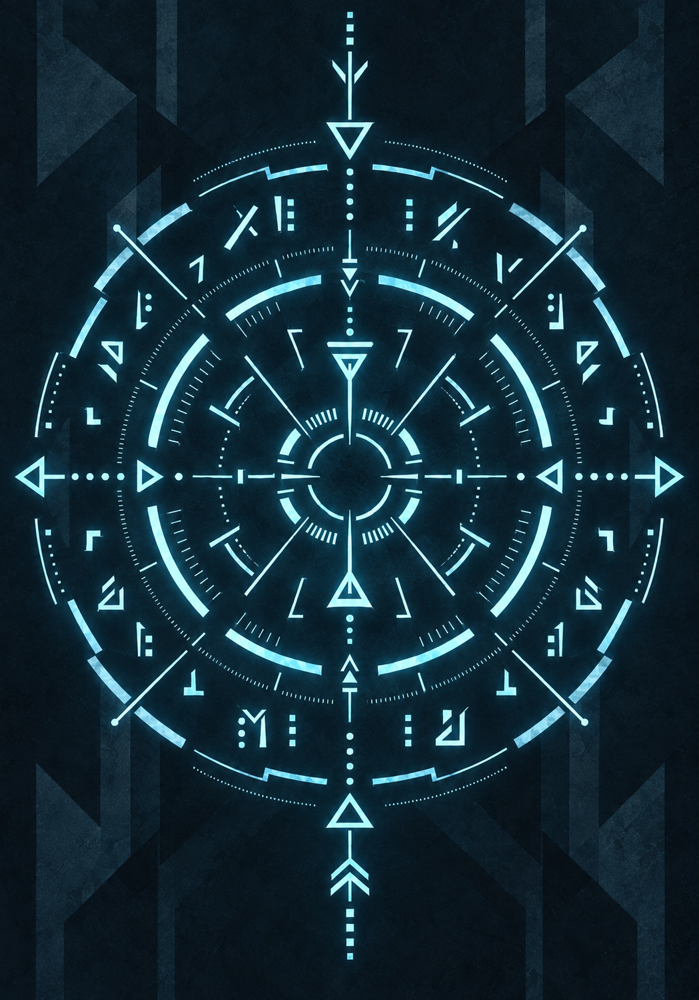

{.opener}

# Quick Reference

## The Turn

**Two Beats.** One Beat buys: an attack, a spell, a Zone move, an item, a Principle Application, a check, a Disengage, or a Seize Momentum attempt. **Free:** speaking, drawing a weapon, dropping something, moving inside your Zone.

**Surprise Beat:** ambushers act once before the first round. **Master's free action:** once on your turn, the first action with a Mastered Proficiency's weapon costs no Beat; it is not a Beat and cannot be given up to Yield.

## Rolling

**Roll d100 + Force + Tactics. High wins. Every d100 explodes.**

- **Clash (against someone who rolls back):** both roll d100 + Force + Tactics. Higher total wins; a tie goes to whoever started it (in combat, the attacker). Margin = Winner − Loser. Margin 40+ is decisive.
- **Check (against a number):** meet or beat the Resistance from the Difficulty Card.
- **When to roll a check:** the GM calls it. (1) Force ≥ Resistance: success, no roll. (2) **Take 100:** nothing presses and a natural 100 would succeed: success, no roll, it takes time. (3) Otherwise roll once; a failed check stands until something changes.
- **Volatility:** if the **natural d100** (before any modifiers) meets the Grade threshold, roll again and add. Each cascade die also checks its own natural result. Every roll, both sides, in or out of combat. A cascade of 2+ extra dice on a PC's roll grants a Battle Memory Card.
- **Advantage:** roll two d100, keep the higher (about +20). The GM grants it from the fiction; it does not stack with itself; only the kept die explodes. **Exposed:** −10 to your Clash rolls.
- **Flanking:** when two or more hostiles fight one target, each of them gains +10 against it.
- **Reach:** you can attack anyone in your Zone; ranged and most spells also reach adjacent Zones.
- **Environment:** −10 hindering / −20 crippling.
- **Turned Aside:** defender wins by 40+ → attacker Exposed until end of their next turn.
- **Driven Back:** attacker wins by 40+ → defender takes the damage and is Exposed until end of their next turn; the attacker may drive them one Zone (no free strikes).
- **Check failure:** fail by 1–39 Soft (a setback with a way forward; success at a cost is the GM's option, offered when the cost makes the better scene), 40+ Hard (failure plus consequence), natural 01–05 Catastrophic.
- **Exceptional Success:** a check that explodes and succeeds. Narrate a step beyond what was asked.
- **Background:** in its field, attempt trained work, succeed at Trivial and Easy without rolling, and roll checks with Advantage. Never on an attack or a defense.
- **Cross-Grade:** vs. passive obstacles, the Adjustment counts toward Force ≥ Resistance and Take 100 (2+ Grades up never rolls).
- **Momentum:** a Clash between sides: d100 + HRT or PER Force (whichever is higher); a tie rerolls. Winning side acts first each round. Seize: 1 Beat, spent either way.
- **Free Step:** DEX Force 50+ grants one free Zone move per turn.
- **Cross-Grade movement:** the higher Grade auto-wins movement contests. A combatant a full Grade above every hostile present moves between Zones without spending Beats at all.

**The Clash Formula:**

- **Attacker:** d100 + Offensive Force (STR/DEX/POW based on weapon) + Tactics
- **Defender:** d100 + Defensive Force (DEX to dodge, FOR to tank, HRT vs. mental, PER vs. illusion) + Tactics
- **Damage:** Margin × Grade Multiplier (append zeroes)

**Offensive Force by Weapon Type:**

- Heavy melee (axe, greatsword): STR Force
- Finesse melee (rapier, daggers): DEX Force
- Ranged (bows, thrown): DEX Force
- Spells, and Applications that act on their own: POW Force
- An Application that shapes a weapon attack: the attack's Force

**Defensive Force by Attack Type:**

- Physical (dodged): DEX Force
- Physical (absorbed): FOR Force
- Mental / spiritual / coercive: HRT Force
- Illusion / sensory deception: PER Force

**Grade Multipliers:** F-Grade: ×1 | E-Grade: ×10 | D-Grade: ×100 | C-Grade: ×1,000

**Volatility Thresholds (natural die):** F: 96+ | E: 95+ | D: 94+ | C: 93+ | B: 92+ | A: 91+ (starts at 96, falls 1 per Grade).

One number at the top of the die. When the natural die reaches it, the roll explodes. A check that explodes and succeeds is an Exceptional Success. An attack or defense with a weapon that explodes earns a **Mark** in that weapon's Proficiency. A cascade of 2+ extra dice on a PC's roll also grants a Battle Memory Card.

**Cross-Grade Adjustment:** The higher-Grade side gains +100 per Grade of difference. In a Clash, the higher-Grade combatant adds +100 to their total per Grade above the opponent. In a check, add +100 per Grade of difference to whichever side is higher (the challenger's roll if challenging a lower-Grade obstacle, the obstacle's Resistance if challenging a higher-Grade obstacle). Same Grade, no adjustment.

**Lagging stats:** every stat reads at its owner's Grade. Pad below-band stats with leading zeros (E-Grade STR 65 → 065 → Force 06). Cross-Grade Adjustment and damage multiplier always follow the character's Grade.

**HP** = Raw FOR × 2. **Aether** = Raw POW. Aether does not regenerate; Consolidation refills it after the first full hour, and Aether Pills and Pulse Shards restore it.

**VE Tolerance:** 80 at F-Grade for every character, ×10 per Grade. **Saturation:** past 80 −10, past 160 −25, past 240 the collapse clock.

**Consolidation:** every hour refines 20 VE (×10 per Grade) and restores one fifth of Max HP (the fifth hour restores the rest); a level's worth clears in 6 hours; Aether refills at the first full hour. Interruption keeps completed hours.

**Breakthrough Check:** d100 + HRT Force + preparation vs. **Resistance 140** (Severe, flat, no Cross-Grade Adjustment). Overcharge ×1/×2/×3/×4 (80/160/240/320 VE at F) raises it to 140/150/160/180 and buys +0/+1/+2/+3 Quality Tiers. Stable or better: the Grade rises, the caps lift, and every Attribute gains 10 (×10 per Grade).

**Surge:** spend half your Maximum Aether (round down, at least 1) for +5 on one Clash roll you make. Declare before rolling. No Beat. Stacks with everything; available to everyone.

**Yield:** once the Margin is known and before damage lands, give up Beats from your **next** turn. Each Beat cuts the incoming Margin by 20. Your next turn has two Beats, so two is the most you can give. One Beat: you give ground where you stand. Two Beats: your turn is gone and the attacker may drive you one Zone of their choosing, or leave you where you are; no free strike either way. Against an AoE, each target Yields on their own Margin and two Beats throws them clear. **Cornered** (nowhere to be driven): one Beat only. Creatures Yield only if their stat block says so.

**Background:** one or two lines of life before Integration. **Proficiency:** one weapon shape at creation, **Trained**.

<!-- rules:table quickref-proficiency -->
| Tier | Effect |
|---|---|
| Trained | +5 to attacks and defenses with the Proficiency's weapons. |
| Seasoned | +10 in place of the +5. **3 Marks.** |
| Master | +10, and once on your turn your first action with its weapon costs no Beat. **10 Marks**, and an E-Grade body. |
<!-- /rules:table -->

Weapons carry no bonus of their own; the bonus is the wielder's tier. Untrained is +0. **3 Marks with a weapon shape you have no Proficiency in:** the System grants it at Trained, spending those Marks.

**Gear:** a shield adds +5 to your Clash when defending and occupies a hand; there is no shield Proficiency. Armor Scraps add +5 Defense Force with FOR and impose −5 on DEX-based Clashes. Pills take 1 Beat; the first two of each kind per fight work in full, and further pills do nothing until ten quiet minutes out of combat.

**Fighting domains, by weapon shape:** blades | axes and hammers | spears and staves | hand to hand | archery and throwing | firearms. Anything you let go of is archery and throwing.

**Interpretation:** every Integrant translates deliberately communicated messages, both directions, and one holder in a conversation is enough. A lie translates perfectly; involuntary displays and cultural implications do not translate. Old tutorial sectors lack it until registration past the gate.

**Downed:** PCs at 0 HP (NPCs by default; creatures die unless the GM rules otherwise): no Beats, no defense; dies at the end of their third round unless stabilized (any healing, or 1 Beat + Moderate 90 check, with Advantage for a medical Background). One hit ≥ 10× Max HP kills outright. Attacking a Downed character: 1 Beat, no roll, kills. Surviving being Downed in a fight grants a Battle Memory Card, at the GM's discretion when it taught nothing.

**Principle Application Costs (by tier, never by Grade):** Seed 10 | Early Fragment 15 | Infusion free | Domain 3,000 + 500/round. A cost is fixed by the tier that granted it and never changes. Scale grows with the character's current Grade. Domains require a D-Grade body. Spells and class techniques are fixed by the Grade they were acquired at, ×10 per Grade; a class technique is 5 Aether at F, or no Aether once per encounter or with a drawback.

**Will Save (Aura Pressure):** d100 + HRT Force vs. Aura Resistance. Aura Resistance is the flat card value, no Cross-Grade Adjustment: calm presence Moderate (90), flaring Hard (115). At a gap of three or more Grades the GM may impose Suppression without a save. Suppressed: one Beat per turn for the encounter; a meaningful change in the fiction allows a new save.

---

## Difficulty Card

<!-- rules:table quickref-resistance -->
| **Difficulty** | **Resistance** |
|---|---|
| Trivial | 40 |
| Easy | 65 |
| Moderate | 90 |
| Hard | 115 |
| Severe | 140 |
| Peak | 165 |
<!-- /rules:table -->

Resistance is read straight off the card for same-Grade encounters. For Cross-Grade, apply the +100/Grade adjustment to whichever side is higher (see above).

<!-- rules:table quickref-grades -->
| **Grade** | **Stat Cap** | **Force** | **Damage** |
|---|---|---|---|
| F-Grade | 99 | the stat | the Margin |
| E-Grade | 999 | stat ÷ 10 | Margin × 10 |
| D-Grade | 9,999 | stat ÷ 100 | Margin × 100 |
| C-Grade | 99,999 | stat ÷ 1,000 | Margin × 1,000 |
<!-- /rules:table -->

Force runs 0 to 99 at every Grade; a lagging stat reads low (see Lagging stats above).

<!-- rules:table quickref-ve -->
| **VE at F-Grade** | **Amount** |
|---|---|
| A level | 120 |
| Kill, by tier: Trivial / Easy / Moderate / Hard / Severe / Peak | 2 / 5 / 10 / 20 / 30 / 50 |
| Session survival | 5 |
| Accession Rift, by difficulty: Moderate / Hard / Severe / Peak | 25 / 50 / 90 / 150, per character, on completion, and the kills as well |
| Cross-Grade kill | the victim's tier read at its own Grade, ×10 per Grade above the killer; a victim below your Grade pays nothing |
<!-- /rules:table -->

All VE values scale ×10 per Grade.

**When a Rift clears:** the moment the completion condition is met, every Imprint in it stops where it stands and comes apart within the hour, fought or not. A Rift solved without a kill pays its reward and none of the kill VE. A cleared Rift never reopens.

---

## Examples

::: worked
**1. F-Grade Peer Clash:**

Attacker: STR 55 (Force 55). Defender: FOR 40 (Force 40), HP 80.

- Attacker rolls 60 + 55 = 115. Defender rolls 50 + 40 = 90.
- Margin = 25. F-Grade adds 0 zeroes. **Damage = 25.**
- Defender drops from 80 HP to 55.
:::

::: worked
**2. D-Grade Peer Clash (Volatility Cascade):**

Attacker: STR 8,500 (D-Grade, Force 85). Defender: FOR 7,000 (D-Grade, Force 70), HP 14,000.

- Attacker rolls a natural 97. D-Grade explodes on natural 94+. Rolls again: natural 40 (below 94, no further cascade). Total die = 137. Clash = 137 + 85 = 222.
- Defender rolls a natural 75 (no explosion). Clash = 75 + 70 = 145.
- Margin = 77. D-Grade adds 2 zeroes. **Damage = 7,700.**
- Defender drops from 14,000 to 6,300 HP.
:::

::: worked
**3. Cross-Grade: F-Grade Peak vs. E-Grade Initiate:**

F-Peak: STR 99 (Force 99), HP 198. E-Initiate: STR and FOR 120 (Force 12, +100 Grade bonus = 112), HP 240.

F attacks E:

- F-Peak rolls brilliantly: 85 + 99 = 184. E-Initiate rolls poorly: 20 + 112 = 132.
- Margin = 52. F-Grade multiplier: ×1. **Damage = 52.** The E-Grade drops from 240 HP to 188.

E attacks F:

- E-Initiate rolls 50: 50 + 112 = 162. F-Peak rolls 50: 50 + 99 = 149.
- Margin = 13. E-Grade multiplier: ×10. **Damage = 130.** F-Peak drops from 198 HP to 68.
:::
